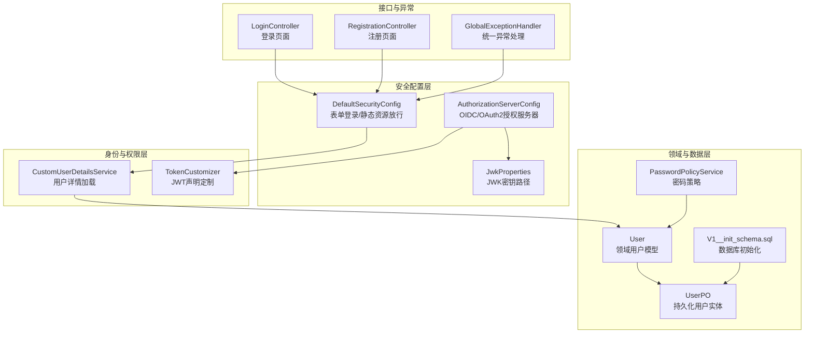
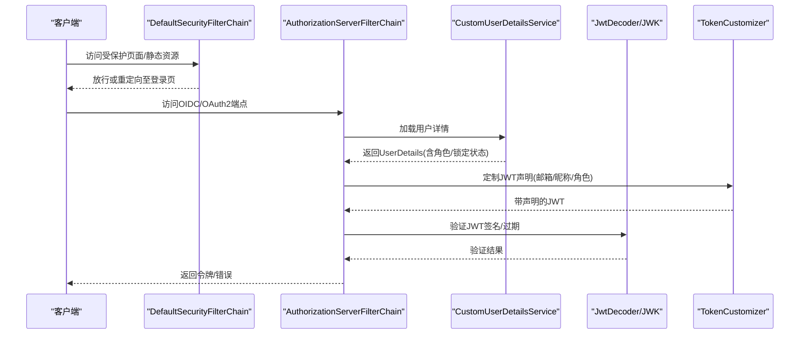
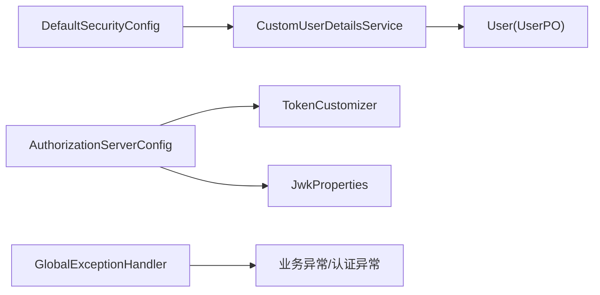

# 安全问题排查

<cite>
**本文引用的文件**
- [DefaultSecurityConfig.java](file://src/main/java/sso/oidc/infrastructure/config/DefaultSecurityConfig.java)
- [AuthorizationServerConfig.java](file://src/main/java/sso/oidc/infrastructure/config/AuthorizationServerConfig.java)
- [JwkProperties.java](file://src/main/java/sso/oidc/infrastructure/config/JwkProperties.java)
- [PasswordPolicyService.java](file://src/main/java/sso/oidc/domain/service/PasswordPolicyService.java)
- [TokenCustomizer.java](file://src/main/java/sso/oidc/infrastructure/security/TokenCustomizer.java)
- [CustomUserDetailsService.java](file://src/main/java/sso/oidc/infrastructure/security/CustomUserDetailsService.java)
- [application.yml](file://src/main/resources/application.yml)
- [V1__init_schema.sql](file://src/main/resources/db/migration/V1__init_schema.sql)
- [User.java](file://src/main/java/sso/oidc/domain/model/entity/User.java)
- [UserPO.java](file://src/main/java/sso/oidc/infrastructure/persistence/entity/UserPO.java)
- [InvalidCredentialsException.java](file://src/main/java/sso/oidc/domain/model/exception/InvalidCredentialsException.java)
- [AccountLockedException.java](file://src/main/java/sso/oidc/domain/model/exception/AccountLockedException.java)
- [GlobalExceptionHandler.java](file://src/main/java/sso/oidc/interfaces/rest/common/GlobalExceptionHandler.java)
- [LoginController.java](file://src/main/java/sso/oidc/interfaces/web/LoginController.java)
- [RegistrationController.java](file://src/main/java/sso/oidc/interfaces/web/RegistrationController.java)
</cite>

## 目录
1. [简介](#简介)
2. [项目结构与安全相关模块概览](#项目结构与安全相关模块概览)
3. [核心安全组件](#核心安全组件)
4. [架构总览](#架构总览)
5. [详细组件与安全排查](#详细组件与安全排查)
6. [依赖与耦合分析](#依赖与耦合分析)
7. [性能与安全权衡](#性能与安全权衡)
8. [故障排查指南](#故障排查指南)
9. [渗透测试与安全审计实施指南](#渗透测试与安全审计实施指南)
10. [结论](#结论)

## 简介
本指南面向IAM Platform认证服务的安全运维与开发人员，聚焦于常见安全问题的识别与处置，包括认证失败、权限拒绝、会话劫持、令牌验证异常、异常登录尝试、暴力破解与权限提升尝试等。文档同时覆盖JWT令牌的安全检查机制（签名验证、过期时间检查、声明解析）、密码策略与账户锁定机制、会话管理等，并提供渗透测试与安全审计的实施步骤及加固建议。

## 项目结构与安全相关模块概览
- 安全配置层：Spring Security Web过滤链、OIDC/OAuth2授权服务器配置、JWK密钥加载与JWT解码器。
- 身份与权限层：自定义用户详情服务、令牌声明定制器（角色、邮箱、昵称）。
- 领域与数据层：用户实体、用户持久化对象、密码策略服务、数据库初始化脚本。
- 接口与异常：登录/注册控制器、全局异常处理器（统一返回与日志）。
- 运行时配置：应用配置文件（数据库、Redis、JWK路径、Issuer URI、会话存储类型等）。

图表来源
- [DefaultSecurityConfig.java:1-43](file://src/main/java/sso/oidc/infrastructure/config/DefaultSecurityConfig.java#L1-L43)
- [AuthorizationServerConfig.java:1-142](file://src/main/java/sso/oidc/infrastructure/config/AuthorizationServerConfig.java#L1-L142)
- [JwkProperties.java:1-16](file://src/main/java/sso/oidc/infrastructure/config/JwkProperties.java#L1-L16)
- [CustomUserDetailsService.java:1-38](file://src/main/java/sso/oidc/infrastructure/security/CustomUserDetailsService.java#L1-L38)
- [TokenCustomizer.java:1-34](file://src/main/java/sso/oidc/infrastructure/security/TokenCustomizer.java#L1-L34)
- [User.java:1-36](file://src/main/java/sso/oidc/domain/model/entity/User.java#L1-L36)
- [UserPO.java:1-76](file://src/main/java/sso/oidc/infrastructure/persistence/entity/UserPO.java#L1-L76)
- [PasswordPolicyService.java:1-35](file://src/main/java/sso/oidc/domain/service/PasswordPolicyService.java#L1-L35)
- [V1__init_schema.sql:1-180](file://src/main/resources/db/migration/V1__init_schema.sql#L1-L180)
- [LoginController.java:1-14](file://src/main/java/sso/oidc/interfaces/web/LoginController.java#L1-L14)
- [RegistrationController.java:1-43](file://src/main/java/sso/oidc/interfaces/web/RegistrationController.java#L1-L43)
- [GlobalExceptionHandler.java:1-67](file://src/main/java/sso/oidc/interfaces/rest/common/GlobalExceptionHandler.java#L1-L67)

章节来源
- [DefaultSecurityConfig.java:1-43](file://src/main/java/sso/oidc/infrastructure/config/DefaultSecurityConfig.java#L1-L43)
- [AuthorizationServerConfig.java:1-142](file://src/main/java/sso/oidc/infrastructure/config/AuthorizationServerConfig.java#L1-L142)
- [application.yml:1-78](file://src/main/resources/application.yml#L1-L78)

## 核心安全组件
- 默认Web安全过滤链：定义受保护路径、静态资源放行、表单登录入口、登出成功跳转。
- 授权服务器安全过滤链：启用默认安全、OIDC端点、未认证访问HTML入口重定向到登录页、JWT资源服务器配置。
- 密钥与令牌：通过JWK加载RSA密钥对，构建JWK集合与JWT解码器；令牌声明中注入邮箱、昵称与角色列表。
- 用户详情服务：从领域用户映射到Spring Security UserDetails，包含账户启用/锁定状态与角色授权。
- 密码策略：最小长度、大小写、数字要求校验。
- 全局异常处理：统一记录并返回认证失败、权限拒绝、业务异常等错误码与HTTP状态。

章节来源
- [DefaultSecurityConfig.java:19-36](file://src/main/java/sso/oidc/infrastructure/config/DefaultSecurityConfig.java#L19-L36)
- [AuthorizationServerConfig.java:50-67](file://src/main/java/sso/oidc/infrastructure/config/AuthorizationServerConfig.java#L50-L67)
- [AuthorizationServerConfig.java:93-118](file://src/main/java/sso/oidc/infrastructure/config/AuthorizationServerConfig.java#L93-L118)
- [TokenCustomizer.java:20-32](file://src/main/java/sso/oidc/infrastructure/security/TokenCustomizer.java#L20-L32)
- [CustomUserDetailsService.java:23-36](file://src/main/java/sso/oidc/infrastructure/security/CustomUserDetailsService.java#L23-L36)
- [PasswordPolicyService.java:11-24](file://src/main/java/sso/oidc/domain/service/PasswordPolicyService.java#L11-L24)
- [GlobalExceptionHandler.java:20-56](file://src/main/java/sso/oidc/interfaces/rest/common/GlobalExceptionHandler.java#L20-L56)

## 架构总览
下图展示OIDC/OAuth2授权服务器与Web安全过滤链的交互，以及JWT签发与声明定制的关键流程。

图表来源
- [DefaultSecurityConfig.java:19-36](file://src/main/java/sso/oidc/infrastructure/config/DefaultSecurityConfig.java#L19-L36)
- [AuthorizationServerConfig.java:50-67](file://src/main/java/sso/oidc/infrastructure/config/AuthorizationServerConfig.java#L50-L67)
- [AuthorizationServerConfig.java:115-118](file://src/main/java/sso/oidc/infrastructure/config/AuthorizationServerConfig.java#L115-L118)
- [TokenCustomizer.java:20-32](file://src/main/java/sso/oidc/infrastructure/security/TokenCustomizer.java#L20-L32)
- [CustomUserDetailsService.java:23-36](file://src/main/java/sso/oidc/infrastructure/security/CustomUserDetailsService.java#L23-L36)

## 详细组件与安全排查

### 组件一：默认Web安全过滤链（认证入口与静态资源）
- 功能要点
  - 受保护路径匹配与放行规则
  - 表单登录页面与成功跳转
  - 登出成功URL
- 安全关注点
  - 登录页与注册页是否被正确放行
  - 未认证访问HTML资源是否重定向到登录页
  - 是否存在绕过登录的路径
- 故障排查清单
  - 检查securityMatcher匹配范围是否覆盖预期路径
  - 确认表单登录页URL与默认成功跳转URL一致
  - 核对静态资源放行模式是否遗漏
  - 验证登出后是否回到登录页

章节来源
- [DefaultSecurityConfig.java:23-33](file://src/main/java/sso/oidc/infrastructure/config/DefaultSecurityConfig.java#L23-L33)

### 组件二：授权服务器安全过滤链（OIDC/OAuth2）
- 功能要点
  - 应用默认安全配置
  - 启用OIDC端点
  - 未认证访问HTML时重定向到登录页
  - JWT资源服务器配置
- 安全关注点
  - OIDC端点是否暴露在生产环境
  - 未认证入口是否仅针对HTML请求
  - JWT解码器是否正确加载JWK
- 故障排查清单
  - 确认applyDefaultSecurity已启用
  - 检查LoginUrlAuthenticationEntryPoint的匹配器
  - 验证jwtDecoder是否可用
  - 核对AuthorizationServerSettings的issuer配置

章节来源
- [AuthorizationServerConfig.java:54-67](file://src/main/java/sso/oidc/infrastructure/config/AuthorizationServerConfig.java#L54-L67)
- [AuthorizationServerConfig.java:121-124](file://src/main/java/sso/oidc/infrastructure/config/AuthorizationServerConfig.java#L121-L124)

### 组件三：JWK与JWT解码器
- 功能要点
  - 从资源路径加载RSA私钥/公钥
  - 构建JWK集合与JWT解码器
  - 配置AuthorizationServerSettings的issuer
- 安全关注点
  - 私钥/公钥路径是否正确且可读
  - JWK加载是否成功
  - Issuer URI是否与客户端配置一致
- 故障排查清单
  - 检查JwkProperties中的路径属性
  - 确认PEM内容格式与Base64编码
  - 验证RSA密钥规格与算法
  - 核对issuer与客户端配置一致性

章节来源
- [JwkProperties.java:12-15](file://src/main/java/sso/oidc/infrastructure/config/JwkProperties.java#L12-L15)
- [AuthorizationServerConfig.java:95-118](file://src/main/java/sso/oidc/infrastructure/config/AuthorizationServerConfig.java#L95-L118)
- [AuthorizationServerConfig.java:121-124](file://src/main/java/sso/oidc/infrastructure/config/AuthorizationServerConfig.java#L121-L124)

### 组件四：用户详情服务与账户状态
- 功能要点
  - 从领域用户映射到UserDetails
  - 设置账户启用/锁定状态与角色授权
- 安全关注点
  - disabled与accountLocked字段是否正确影响认证
  - 角色映射是否完整
- 故障排查清单
  - 核对User与UserPO中的enabled/accountLocked字段
  - 检查CustomUserDetailsService映射逻辑
  - 验证角色枚举/字符串是否与授权一致

章节来源
- [CustomUserDetailsService.java:29-36](file://src/main/java/sso/oidc/infrastructure/security/CustomUserDetailsService.java#L29-L36)
- [User.java:23-25](file://src/main/java/sso/oidc/domain/model/entity/User.java#L23-L25)
- [UserPO.java:50-54](file://src/main/java/sso/oidc/infrastructure/persistence/entity/UserPO.java#L50-L54)

### 组件五：令牌声明定制（JWT声明）
- 功能要点
  - 注入email、nickname（若非空）、roles
- 安全关注点
  - 声明注入是否仅限必要字段
  - 角色列表是否来自可信来源
- 故障排查清单
  - 检查TokenCustomizer中claim注入逻辑
  - 确认User.roles不为空且角色值有效
  - 核对声明键名与客户端解析约定

章节来源
- [TokenCustomizer.java:20-32](file://src/main/java/sso/oidc/infrastructure/security/TokenCustomizer.java#L20-L32)

### 组件六：密码策略与注册流程
- 功能要点
  - 最小长度、大小写、数字要求
  - 注册流程与重复用户名处理
- 安全关注点
  - 密码强度是否足够
  - 注册失败是否暴露过多信息
- 故障排查清单
  - 检查PasswordPolicyService.validate逻辑
  - 确认RegistrationController错误处理
  - 核对UserAlreadyExistsException处理

章节来源
- [PasswordPolicyService.java:11-24](file://src/main/java/sso/oidc/domain/service/PasswordPolicyService.java#L11-L24)
- [RegistrationController.java:27-41](file://src/main/java/sso/oidc/interfaces/web/RegistrationController.java#L27-L41)

### 组件七：全局异常处理与安全日志
- 功能要点
  - 统一处理业务异常、访问拒绝、认证失败、参数校验错误
  - 记录警告/错误日志并返回标准化响应
- 安全关注点
  - 错误信息是否脱敏
  - 日志级别与敏感信息控制
- 故障排查清单
  - 检查各异常处理器返回的状态码与消息
  - 确认日志输出是否包含敏感信息
  - 核对BusinessException错误码与HTTP状态映射

章节来源
- [GlobalExceptionHandler.java:20-66](file://src/main/java/sso/oidc/interfaces/rest/common/GlobalExceptionHandler.java#L20-L66)
- [InvalidCredentialsException.java:5-9](file://src/main/java/sso/oidc/domain/model/exception/InvalidCredentialsException.java#L5-L9)
- [AccountLockedException.java:5-9](file://src/main/java/sso/oidc/domain/model/exception/AccountLockedException.java#L5-L9)

## 依赖与耦合分析
- 组件内聚性
  - DefaultSecurityConfig与AuthorizationServerConfig分别负责Web层与授权服务器层，职责清晰。
  - TokenCustomizer与CustomUserDetailsService分别负责声明定制与用户详情加载，边界明确。
- 外部依赖
  - JWK资源路径由JwkProperties与application.yml提供，需确保路径与部署环境一致。
  - 数据库存储使用PostgreSQL，会话存储使用Redis，需关注连接与凭据配置。
- 潜在风险点
  - JWK密钥加载失败会导致令牌验证异常
  - 用户详情映射错误可能导致权限判定异常
  - 全局异常处理未捕获所有异常类型，可能产生未记录的内部错误

图表来源
- [DefaultSecurityConfig.java:19-36](file://src/main/java/sso/oidc/infrastructure/config/DefaultSecurityConfig.java#L19-L36)
- [AuthorizationServerConfig.java:50-67](file://src/main/java/sso/oidc/infrastructure/config/AuthorizationServerConfig.java#L50-L67)
- [TokenCustomizer.java:14-33](file://src/main/java/sso/oidc/infrastructure/security/TokenCustomizer.java#L14-L33)
- [JwkProperties.java:12-15](file://src/main/java/sso/oidc/infrastructure/config/JwkProperties.java#L12-L15)
- [CustomUserDetailsService.java:19-36](file://src/main/java/sso/oidc/infrastructure/security/CustomUserDetailsService.java#L19-L36)
- [User.java:16-35](file://src/main/java/sso/oidc/domain/model/entity/User.java#L16-L35)
- [UserPO.java:21-75](file://src/main/java/sso/oidc/infrastructure/persistence/entity/UserPO.java#L21-L75)
- [GlobalExceptionHandler.java:20-66](file://src/main/java/sso/oidc/interfaces/rest/common/GlobalExceptionHandler.java#L20-L66)

## 性能与安全权衡
- 密码哈希强度与验证成本：BCrypt编码强度越高，验证越慢，需在安全与性能间平衡。
- 会话存储：Redis存储会话可提升横向扩展能力，但需关注网络延迟与可用性。
- JWT体积与声明数量：减少不必要的声明可降低传输与解析开销。
- 数据库连接池：合理设置最大连接数与超时，避免在高并发下成为瓶颈。

## 故障排查指南

### 认证失败
- 现象
  - 登录后仍被重定向到登录页或提示未认证
- 排查步骤
  - 确认DefaultSecurityConfig的securityMatcher是否包含登录/注册路径
  - 检查表单登录页URL与默认成功跳转URL
  - 核对CustomUserDetailsService是否正确映射enabled与accountLocked
  - 查看GlobalExceptionHandler对AuthenticationException的处理与日志

章节来源
- [DefaultSecurityConfig.java:23-33](file://src/main/java/sso/oidc/infrastructure/config/DefaultSecurityConfig.java#L23-L33)
- [CustomUserDetailsService.java:30-36](file://src/main/java/sso/oidc/infrastructure/security/CustomUserDetailsService.java#L30-L36)
- [GlobalExceptionHandler.java:50-56](file://src/main/java/sso/oidc/interfaces/rest/common/GlobalExceptionHandler.java#L50-L56)

### 权限拒绝
- 现象
  - 返回403 Forbidden
- 排查步骤
  - 检查AuthorizationServerConfig的OIDC与JWT配置
  - 确认TokenCustomizer的角色声明是否正确注入
  - 核对客户端scopes与授权范围

章节来源
- [AuthorizationServerConfig.java:56-64](file://src/main/java/sso/oidc/infrastructure/config/AuthorizationServerConfig.java#L56-L64)
- [TokenCustomizer.java:29-31](file://src/main/java/sso/oidc/infrastructure/security/TokenCustomizer.java#L29-L31)

### 会话劫持与会话管理
- 现象
  - 登录态异常失效或被冒用
- 排查步骤
  - 检查application.yml中的session.store-type是否为redis
  - 核对Redis连接配置与密码
  - 关注会话超时与并发访问行为

章节来源
- [application.yml:45-46](file://src/main/resources/application.yml#L45-L46)
- [application.yml:28-32](file://src/main/resources/application.yml#L28-L32)

### 令牌验证异常（签名/过期/声明）
- 现象
  - JWT解码失败、签名无效、过期或声明缺失
- 排查步骤
  - 确认JwkProperties的私钥/公钥路径与PEM格式
  - 校验AuthorizationServerSettings的issuer与客户端一致
  - 检查TokenCustomizer的声明注入是否符合客户端解析

章节来源
- [JwkProperties.java:12-15](file://src/main/java/sso/oidc/infrastructure/config/JwkProperties.java#L12-L15)
- [AuthorizationServerConfig.java:115-118](file://src/main/java/sso/oidc/infrastructure/config/AuthorizationServerConfig.java#L115-L118)
- [AuthorizationServerConfig.java:121-124](file://src/main/java/sso/oidc/infrastructure/config/AuthorizationServerConfig.java#L121-L124)
- [TokenCustomizer.java:25-31](file://src/main/java/sso/oidc/infrastructure/security/TokenCustomizer.java#L25-L31)

### 异常登录尝试与暴力破解
- 现象
  - 大量401 Unauthorized或频繁登录失败
- 排查步骤
  - 结合GlobalExceptionHandler日志定位异常来源
  - 检查CustomUserDetailsService的账户锁定逻辑
  - 在网关/反向代理层增加速率限制与IP封禁

章节来源
- [GlobalExceptionHandler.java:50-56](file://src/main/java/sso/oidc/interfaces/rest/common/GlobalExceptionHandler.java#L50-L56)
- [CustomUserDetailsService.java:32](file://src/main/java/sso/oidc/infrastructure/security/CustomUserDetailsService.java#L32)

### 权限提升尝试
- 现象
  - 客户端收到的角色声明异常或越权访问
- 排查步骤
  - 确认TokenCustomizer的角色来源与User.roles一致
  - 核对数据库t_user_role关联关系

章节来源
- [TokenCustomizer.java:29-31](file://src/main/java/sso/oidc/infrastructure/security/TokenCustomizer.java#L29-L31)
- [V1__init_schema.sql:72-78](file://src/main/resources/db/migration/V1__init_schema.sql#L72-L78)

### 密码策略与账户锁定
- 现象
  - 注册失败或登录被拒绝
- 排查步骤
  - 检查PasswordPolicyService.validate逻辑
  - 确认User.enabled与User.accountLocked字段
  - 核对RegistrationController的异常处理

章节来源
- [PasswordPolicyService.java:11-24](file://src/main/java/sso/oidc/domain/service/PasswordPolicyService.java#L11-L24)
- [User.java:23-25](file://src/main/java/sso/oidc/domain/model/entity/User.java#L23-L25)
- [UserPO.java:50-54](file://src/main/java/sso/oidc/infrastructure/persistence/entity/UserPO.java#L50-L54)
- [RegistrationController.java:34-41](file://src/main/java/sso/oidc/interfaces/web/RegistrationController.java#L34-L41)

## 渗透测试与安全审计实施指南

### 测试范围
- 认证流程：用户名/密码、注册、登出
- 授权流程：授权码、刷新令牌、客户端凭证
- 令牌安全：签名验证、过期时间、声明篡改
- 会话安全：会话固定、跨站请求伪造、会话劫持
- 配置安全：密钥路径、Issuer URI、数据库与Redis凭据

### 实施步骤
- 身份与权限
  - 使用弱密码与强密码进行登录测试
  - 验证账户锁定策略与重复登录限制
- 令牌与授权
  - 解析并修改JWT声明，验证服务端签名验证
  - 测试过期令牌与刷新令牌流程
  - 验证客户端凭据与授权范围
- 会话与防护
  - 检查会话存储与超时配置
  - 验证CSRF防护与CORS策略
- 配置与密钥
  - 校验JWK路径与PEM格式
  - 对比issuer与客户端配置一致性

### 安全加固建议
- 密钥与证书
  - 使用安全的密钥生成与轮换流程
  - 限制密钥文件权限，避免明文存储
- 密码与账户
  - 提升密码策略阈值（长度、复杂度、历史密码）
  - 实施账户锁定与解锁策略
- 传输与存储
  - 强制HTTPS与安全头
  - 加密敏感字段（如客户端密钥）
- 监控与告警
  - 记录并监控异常登录与认证失败
  - 配置速率限制与IP封禁

## 结论
本指南基于代码实现梳理了IAM Platform认证服务的关键安全组件与排查路径。通过理解Web安全过滤链、授权服务器配置、JWK与JWT解码、用户详情与令牌声明定制、密码策略与异常处理等模块，可以系统地定位与解决认证失败、权限拒绝、会话与令牌安全等问题。结合渗透测试与安全审计，持续优化配置与策略，可显著提升系统的整体安全性与稳定性。