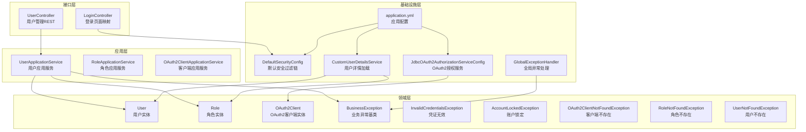
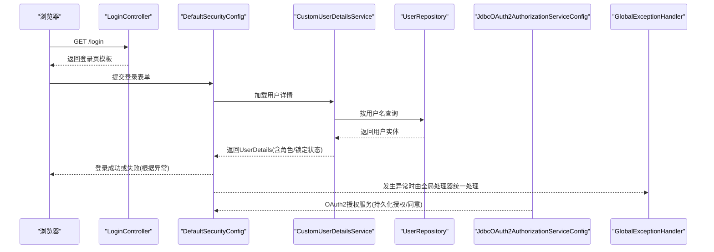
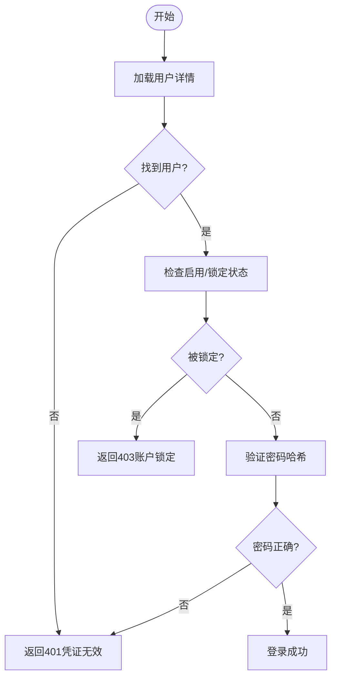
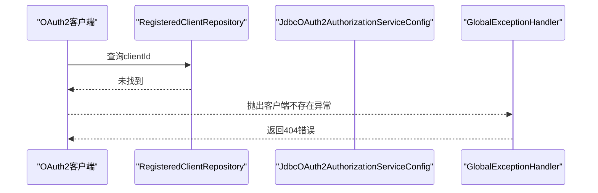
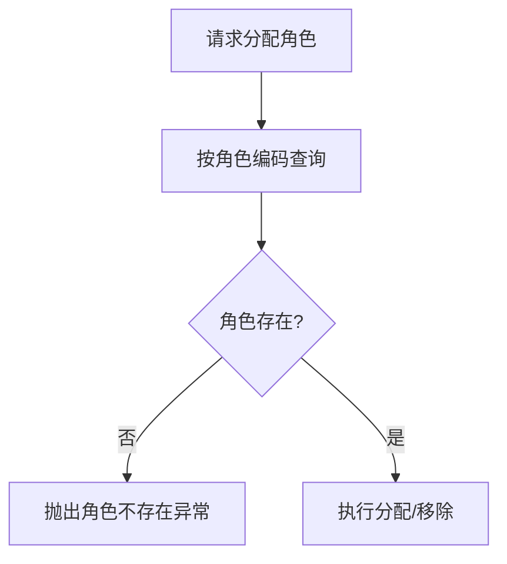
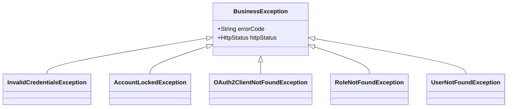
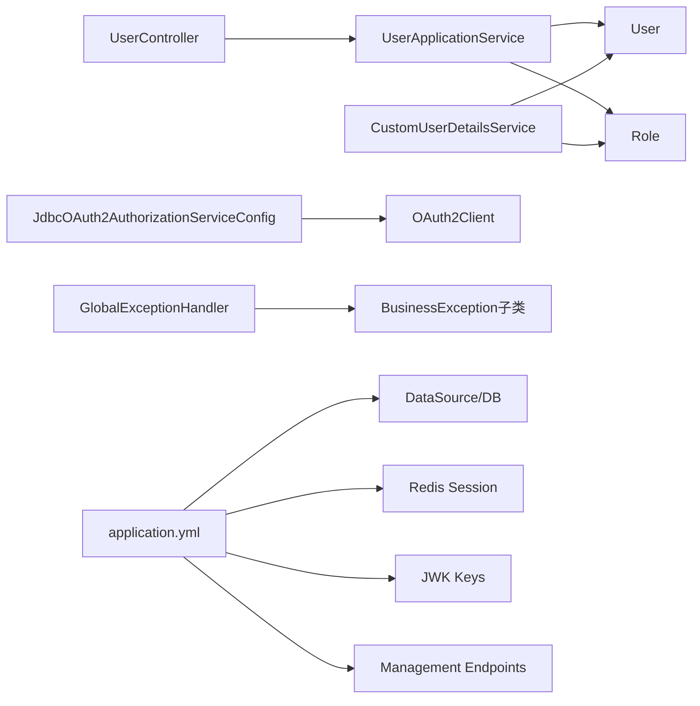

# 常见问题解决

<cite>
**本文引用的文件**
- [User.java](file://src/main/java/sso/oidc/domain/model/entity/User.java)
- [OAuth2Client.java](file://src/main/java/sso/oidc/domain/model/entity/OAuth2Client.java)
- [Role.java](file://src/main/java/sso/oidc/domain/model/entity/Role.java)
- [BusinessException.java](file://src/main/java/sso/oidc/domain/model/exception/BusinessException.java)
- [InvalidCredentialsException.java](file://src/main/java/sso/oidc/domain/model/exception/InvalidCredentialsException.java)
- [AccountLockedException.java](file://src/main/java/sso/oidc/domain/model/exception/AccountLockedException.java)
- [OAuth2ClientNotFoundException.java](file://src/main/java/sso/oidc/domain/model/exception/OAuth2ClientNotFoundException.java)
- [RoleNotFoundException.java](file://src/main/java/sso/oidc/domain/model/exception/RoleNotFoundException.java)
- [UserNotFoundException.java](file://src/main/java/sso/oidc/domain/model/exception/UserNotFoundException.java)
- [GlobalExceptionHandler.java](file://src/main/java/sso/oidc/interfaces/rest/common/GlobalExceptionHandler.java)
- [CustomUserDetailsService.java](file://src/main/java/sso/oidc/infrastructure/security/CustomUserDetailsService.java)
- [JdbcOAuth2AuthorizationServiceConfig.java](file://src/main/java/sso/oidc/infrastructure/security/JdbcOAuth2AuthorizationServiceConfig.java)
- [LoginController.java](file://src/main/java/sso/oidc/interfaces/web/LoginController.java)
- [UserController.java](file://src/main/java/sso/oidc/interfaces/rest/UserController.java)
- [DefaultSecurityConfig.java](file://src/main/java/sso/oidc/infrastructure/config/DefaultSecurityConfig.java)
- [application.yml](file://src/main/resources/application.yml)
- [PasswordPolicyService.java](file://src/main/java/sso/oidc/domain/service/PasswordPolicyService.java)
</cite>

## 目录
1. [简介](#简介)
2. [项目结构](#项目结构)
3. [核心组件](#核心组件)
4. [架构总览](#架构总览)
5. [详细组件分析](#详细组件分析)
6. [依赖分析](#依赖分析)
7. [性能考虑](#性能考虑)
8. [故障排查指南](#故障排查指南)
9. [结论](#结论)
10. [附录](#附录)

## 简介
本指南面向运维与开发人员，聚焦IAM Platform认证服务在实际运行中出现频率最高的问题，覆盖用户认证失败、OAuth2客户端不存在、角色权限异常、业务逻辑错误等场景，并提供可操作的错误识别、根因分析与解决步骤。同时给出预防性措施与最佳实践，帮助快速定位并解决90%以上的常见问题。

## 项目结构
该服务采用分层架构：接口层（REST/Web）、应用层（DTO/Service）、领域层（实体/异常/值对象）、基础设施层（安全配置、持久化适配、JDBC授权存储）。配置集中在Spring Boot的YAML文件中，数据库连接、Redis会话、JWK密钥、OpenAPI文档与管理端点均通过配置项统一管理。

图表来源
- [LoginController.java:1-14](file://src/main/java/sso/oidc/interfaces/web/LoginController.java#L1-L14)
- [UserController.java:1-90](file://src/main/java/sso/oidc/interfaces/rest/UserController.java#L1-L90)
- [DefaultSecurityConfig.java:1-44](file://src/main/java/sso/oidc/infrastructure/config/DefaultSecurityConfig.java#L1-L44)
- [CustomUserDetailsService.java:1-41](file://src/main/java/sso/oidc/infrastructure/security/CustomUserDetailsService.java#L1-L41)
- [JdbcOAuth2AuthorizationServiceConfig.java:1-27](file://src/main/java/sso/oidc/infrastructure/security/JdbcOAuth2AuthorizationServiceConfig.java#L1-L27)
- [GlobalExceptionHandler.java:1-67](file://src/main/java/sso/oidc/interfaces/rest/common/GlobalExceptionHandler.java#L1-L67)
- [application.yml:1-78](file://src/main/resources/application.yml#L1-L78)

章节来源
- [application.yml:1-78](file://src/main/resources/application.yml#L1-L78)

## 核心组件
- 用户实体：包含用户名、邮箱、密码哈希、启用状态、账户锁定状态、角色集合等字段，用于认证与授权决策。
- 角色实体：包含角色编码、名称与描述，作为权限标识的基础。
- OAuth2客户端实体：包含clientId、clientSecret、授权方式、重定向URI、作用域、令牌有效期等，用于OAuth2/OIDC流程校验。
- 异常体系：以BusinessException为基类，派生出凭证无效、账户锁定、客户端不存在、角色不存在、用户不存在等异常，配合全局异常处理器返回标准化错误响应。
- 安全配置：定义公开路径（登录、注册、静态资源）、表单登录、登出策略与BCrypt密码编码器。
- 全局异常处理：对业务异常、验证异常、鉴权异常、访问拒绝与通用异常进行分类处理与HTTP状态码映射。

章节来源
- [User.java:1-40](file://src/main/java/sso/oidc/domain/model/entity/User.java#L1-L40)
- [Role.java:1-24](file://src/main/java/sso/oidc/domain/model/entity/Role.java#L1-L24)
- [OAuth2Client.java:1-73](file://src/main/java/sso/oidc/domain/model/entity/OAuth2Client.java#L1-L73)
- [BusinessException.java:1-17](file://src/main/java/sso/oidc/domain/model/exception/BusinessException.java#L1-L17)
- [InvalidCredentialsException.java:1-10](file://src/main/java/sso/oidc/domain/model/exception/InvalidCredentialsException.java#L1-L10)
- [AccountLockedException.java:1-10](file://src/main/java/sso/oidc/domain/model/exception/AccountLockedException.java#L1-L10)
- [OAuth2ClientNotFoundException.java:1-10](file://src/main/java/sso/oidc/domain/model/exception/OAuth2ClientNotFoundException.java#L1-L10)
- [RoleNotFoundException.java:1-10](file://src/main/java/sso/oidc/domain/model/exception/RoleNotFoundException.java#L1-L10)
- [UserNotFoundException.java:1-10](file://src/main/java/sso/oidc/domain/model/exception/UserNotFoundException.java#L1-L10)
- [DefaultSecurityConfig.java:1-44](file://src/main/java/sso/oidc/infrastructure/config/DefaultSecurityConfig.java#L1-L44)
- [GlobalExceptionHandler.java:1-67](file://src/main/java/sso/oidc/interfaces/rest/common/GlobalExceptionHandler.java#L1-L67)

## 架构总览
下图展示从浏览器到后端的关键交互路径：登录页面、表单提交、用户详情加载、OAuth2授权服务与全局异常处理。

图表来源
- [LoginController.java:1-14](file://src/main/java/sso/oidc/interfaces/web/LoginController.java#L1-L14)
- [DefaultSecurityConfig.java:1-44](file://src/main/java/sso/oidc/infrastructure/config/DefaultSecurityConfig.java#L1-L44)
- [CustomUserDetailsService.java:1-41](file://src/main/java/sso/oidc/infrastructure/security/CustomUserDetailsService.java#L1-L41)
- [JdbcOAuth2AuthorizationServiceConfig.java:1-27](file://src/main/java/sso/oidc/infrastructure/security/JdbcOAuth2AuthorizationServiceConfig.java#L1-L27)
- [GlobalExceptionHandler.java:1-67](file://src/main/java/sso/oidc/interfaces/rest/common/GlobalExceptionHandler.java#L1-L67)

## 详细组件分析

### 组件A：用户认证失败
- 错误识别
  - HTTP状态：401未授权
  - 异常类型：凭证无效异常
  - 典型表现：登录页提示“用户名或密码不正确”；全局异常处理器返回统一错误体
- 根因分析
  - 用户名不存在或被禁用/锁定
  - 密码哈希不匹配
  - 账户被锁定（enabled=false 或 accountLocked=true）
- 解决步骤
  1) 确认用户是否存在且启用
  2) 检查用户是否被锁定
  3) 验证密码策略（最小长度、大小写、数字）
  4) 核对BCrypt编码器一致性
- 预防与最佳实践
  - 启用密码复杂度策略
  - 设置合理的账户锁定阈值与解锁流程
  - 使用强随机盐与BCrypt进行密码存储

图表来源
- [CustomUserDetailsService.java:1-41](file://src/main/java/sso/oidc/infrastructure/security/CustomUserDetailsService.java#L1-L41)
- [User.java:1-40](file://src/main/java/sso/oidc/domain/model/entity/User.java#L1-L40)
- [InvalidCredentialsException.java:1-10](file://src/main/java/sso/oidc/domain/model/exception/InvalidCredentialsException.java#L1-L10)
- [AccountLockedException.java:1-10](file://src/main/java/sso/oidc/domain/model/exception/AccountLockedException.java#L1-L10)
- [GlobalExceptionHandler.java:1-67](file://src/main/java/sso/oidc/interfaces/rest/common/GlobalExceptionHandler.java#L1-L67)

章节来源
- [CustomUserDetailsService.java:1-41](file://src/main/java/sso/oidc/infrastructure/security/CustomUserDetailsService.java#L1-L41)
- [User.java:1-40](file://src/main/java/sso/oidc/domain/model/entity/User.java#L1-L40)
- [InvalidCredentialsException.java:1-10](file://src/main/java/sso/oidc/domain/model/exception/InvalidCredentialsException.java#L1-L10)
- [AccountLockedException.java:1-10](file://src/main/java/sso/oidc/domain/model/exception/AccountLockedException.java#L1-L10)
- [GlobalExceptionHandler.java:1-67](file://src/main/java/sso/oidc/interfaces/rest/common/GlobalExceptionHandler.java#L1-L67)

### 组件B：OAuth2客户端不存在
- 错误识别
  - HTTP状态：404未找到
  - 异常类型：客户端不存在异常
  - 典型表现：授权请求返回“客户端未找到”
- 根因分析
  - 客户端未在注册库中
  - 客户端未启用
  - 请求中的clientId与注册记录不一致
- 解决步骤
  1) 在注册库中确认clientId存在且enabled=true
  2) 校验授权类型、重定向URI、作用域与PKCE要求
  3) 如需变更，使用客户端管理API更新
- 预防与最佳实践
  - 在上线前完成客户端注册与校验
  - 对外暴露的重定向URI与作用域进行白名单管理

图表来源
- [OAuth2ClientNotFoundException.java:1-10](file://src/main/java/sso/oidc/domain/model/exception/OAuth2ClientNotFoundException.java#L1-L10)
- [JdbcOAuth2AuthorizationServiceConfig.java:1-27](file://src/main/java/sso/oidc/infrastructure/security/JdbcOAuth2AuthorizationServiceConfig.java#L1-L27)
- [GlobalExceptionHandler.java:1-67](file://src/main/java/sso/oidc/interfaces/rest/common/GlobalExceptionHandler.java#L1-L67)

章节来源
- [OAuth2ClientNotFoundException.java:1-10](file://src/main/java/sso/oidc/domain/model/exception/OAuth2ClientNotFoundException.java#L1-L10)
- [JdbcOAuth2AuthorizationServiceConfig.java:1-27](file://src/main/java/sso/oidc/infrastructure/security/JdbcOAuth2AuthorizationServiceConfig.java#L1-L27)
- [GlobalExceptionHandler.java:1-67](file://src/main/java/sso/oidc/interfaces/rest/common/GlobalExceptionHandler.java#L1-L67)

### 组件C：角色权限异常
- 错误识别
  - HTTP状态：404未找到（角色不存在）
  - 异常类型：角色不存在异常
  - 典型表现：分配/移除角色时报错
- 根因分析
  - 角色编码不存在
  - 角色未初始化或迁移未执行
- 解决步骤
  1) 确认角色编码是否存在于系统
  2) 执行数据库迁移脚本确保默认角色存在
  3) 通过角色管理API创建缺失角色
- 预防与最佳实践
  - 在发布前执行Flyway迁移
  - 将角色枚举纳入版本控制与发布清单

图表来源
- [RoleNotFoundException.java:1-10](file://src/main/java/sso/oidc/domain/model/exception/RoleNotFoundException.java#L1-L10)
- [GlobalExceptionHandler.java:1-67](file://src/main/java/sso/oidc/interfaces/rest/common/GlobalExceptionHandler.java#L1-L67)

章节来源
- [RoleNotFoundException.java:1-10](file://src/main/java/sso/oidc/domain/model/exception/RoleNotFoundException.java#L1-L10)
- [GlobalExceptionHandler.java:1-67](file://src/main/java/sso/oidc/interfaces/rest/common/GlobalExceptionHandler.java#L1-L67)

### 组件D：业务逻辑错误
- 错误识别
  - HTTP状态：取决于具体业务异常（如400、403、404、500）
  - 异常类型：业务异常基类派生
  - 典型表现：统一错误响应体，包含错误码与消息
- 根因分析
  - 参数校验失败
  - 权限不足
  - 资源不存在
  - 未知异常
- 解决步骤
  1) 查看日志中的错误码与消息
  2) 根据异常类型定位到对应业务场景
  3) 修正输入参数或权限配置
  4) 必要时回滚或重试
- 预防与最佳实践
  - 在接口层统一使用校验注解
  - 明确异常语义与HTTP映射
  - 对外部调用增加幂等与重试策略

图表来源
- [BusinessException.java:1-17](file://src/main/java/sso/oidc/domain/model/exception/BusinessException.java#L1-L17)
- [InvalidCredentialsException.java:1-10](file://src/main/java/sso/oidc/domain/model/exception/InvalidCredentialsException.java#L1-L10)
- [AccountLockedException.java:1-10](file://src/main/java/sso/oidc/domain/model/exception/AccountLockedException.java#L1-L10)
- [OAuth2ClientNotFoundException.java:1-10](file://src/main/java/sso/oidc/domain/model/exception/OAuth2ClientNotFoundException.java#L1-L10)
- [RoleNotFoundException.java:1-10](file://src/main/java/sso/oidc/domain/model/exception/RoleNotFoundException.java#L1-L10)
- [UserNotFoundException.java:1-10](file://src/main/java/sso/oidc/domain/model/exception/UserNotFoundException.java#L1-L10)

章节来源
- [BusinessException.java:1-17](file://src/main/java/sso/oidc/domain/model/exception/BusinessException.java#L1-L17)
- [GlobalExceptionHandler.java:1-67](file://src/main/java/sso/oidc/interfaces/rest/common/GlobalExceptionHandler.java#L1-L67)

### 组件E：用户账户锁定
- 错误识别
  - HTTP状态：403禁止访问
  - 异常类型：账户锁定异常
  - 典型表现：登录被拒绝，提示账户被锁定
- 根因分析
  - 用户被管理员手动锁定
  - 账户处于非启用状态
- 解决步骤
  1) 管理员将用户设为启用并解除锁定
  2) 通知用户重新登录
- 预防与最佳实践
  - 制定账户锁定策略与自动解锁时间
  - 对高危操作增加二次确认

章节来源
- [AccountLockedException.java:1-10](file://src/main/java/sso/oidc/domain/model/exception/AccountLockedException.java#L1-L10)
- [User.java:1-40](file://src/main/java/sso/oidc/domain/model/entity/User.java#L1-L40)
- [CustomUserDetailsService.java:1-41](file://src/main/java/sso/oidc/infrastructure/security/CustomUserDetailsService.java#L1-L41)
- [GlobalExceptionHandler.java:1-67](file://src/main/java/sso/oidc/interfaces/rest/common/GlobalExceptionHandler.java#L1-L67)

### 组件F：密码错误
- 错误识别
  - HTTP状态：401未授权
  - 异常类型：凭证无效异常
- 根因分析
  - 密码不符合策略（长度、大小写、数字）
  - 提交明文与存储哈希不一致
- 解决步骤
  1) 检查密码策略是否满足
  2) 确保前端加密/后端编码一致
  3) 重置密码并通知用户
- 预防与最佳实践
  - 使用BCrypt并固定迭代次数
  - 在变更密码时强制执行策略校验

章节来源
- [InvalidCredentialsException.java:1-10](file://src/main/java/sso/oidc/domain/model/exception/InvalidCredentialsException.java#L1-L10)
- [PasswordPolicyService.java:1-35](file://src/main/java/sso/oidc/domain/service/PasswordPolicyService.java#L1-L35)
- [DefaultSecurityConfig.java:1-44](file://src/main/java/sso/oidc/infrastructure/config/DefaultSecurityConfig.java#L1-L44)
- [GlobalExceptionHandler.java:1-67](file://src/main/java/sso/oidc/interfaces/rest/common/GlobalExceptionHandler.java#L1-L67)

### 组件G：令牌过期
- 错误识别
  - HTTP状态：401未授权
  - 典型表现：刷新令牌或访问令牌过期导致授权失败
- 根因分析
  - 访问令牌过期时间已到
  - 刷新令牌过期或被撤销
- 解决步骤
  1) 使用刷新令牌换取新令牌
  2) 若刷新失败，引导用户重新授权
  3) 检查OAuth2授权服务的存储与清理策略
- 预防与最佳实践
  - 合理设置令牌TTL
  - 实现前端自动刷新与错误兜底

章节来源
- [OAuth2Client.java:1-73](file://src/main/java/sso/oidc/domain/model/entity/OAuth2Client.java#L1-L73)
- [JdbcOAuth2AuthorizationServiceConfig.java:1-27](file://src/main/java/sso/oidc/infrastructure/security/JdbcOAuth2AuthorizationServiceConfig.java#L1-L27)
- [GlobalExceptionHandler.java:1-67](file://src/main/java/sso/oidc/interfaces/rest/common/GlobalExceptionHandler.java#L1-L67)

### 组件H：客户端密钥失效
- 错误识别
  - HTTP状态：401未授权
  - 典型表现：客户端认证失败
- 根因分析
  - client_secret为空或与注册不一致
  - 使用了错误的认证方法
- 解决步骤
  1) 校验client_secret是否正确
  2) 确认客户端认证方法与注册一致
  3) 重新生成密钥并更新客户端配置
- 预防与最佳实践
  - 定期轮换密钥并灰度发布
  - 将密钥存储在受控环境变量中

章节来源
- [OAuth2Client.java:1-73](file://src/main/java/sso/oidc/domain/model/entity/OAuth2Client.java#L1-L73)
- [JdbcOAuth2AuthorizationServiceConfig.java:1-27](file://src/main/java/sso/oidc/infrastructure/security/JdbcOAuth2AuthorizationServiceConfig.java#L1-L27)
- [GlobalExceptionHandler.java:1-67](file://src/main/java/sso/oidc/interfaces/rest/common/GlobalExceptionHandler.java#L1-L67)

## 依赖分析
- 组件耦合
  - 控制器依赖应用服务；应用服务依赖仓库与领域模型
  - 用户详情加载依赖用户仓库与角色集合
  - OAuth2授权服务依赖JDBC与注册客户端仓库
  - 全局异常处理器统一处理各类异常
- 外部依赖
  - 数据库（PostgreSQL）与连接池配置
  - Redis（会话与缓存）
  - JWK密钥文件位置
  - Flyway迁移脚本
- 配置影响
  - 数据源、JPA方言、Redis会话、JWK路径、管理端点等均在配置文件集中管理

图表来源
- [UserController.java:1-90](file://src/main/java/sso/oidc/interfaces/rest/UserController.java#L1-L90)
- [CustomUserDetailsService.java:1-41](file://src/main/java/sso/oidc/infrastructure/security/CustomUserDetailsService.java#L1-L41)
- [JdbcOAuth2AuthorizationServiceConfig.java:1-27](file://src/main/java/sso/oidc/infrastructure/security/JdbcOAuth2AuthorizationServiceConfig.java#L1-L27)
- [GlobalExceptionHandler.java:1-67](file://src/main/java/sso/oidc/interfaces/rest/common/GlobalExceptionHandler.java#L1-L67)
- [application.yml:1-78](file://src/main/resources/application.yml#L1-L78)

章节来源
- [application.yml:1-78](file://src/main/resources/application.yml#L1-L78)

## 性能考虑
- 连接池与超时：合理设置最大连接数、最小空闲、连接超时与最大生命周期，避免高峰期阻塞
- SQL与缓存：开启Flyway迁移，避免DDL变更导致的性能回退；Redis会话减少数据库压力
- 日志与追踪：开启采样概率与Zipkin端点，便于定位慢调用与异常路径
- 密码编码：BCrypt成本因子应平衡安全与性能，避免在高并发场景成为瓶颈

## 故障排查指南

- 认证失败（401/403）
  - 步骤：检查用户是否存在、启用状态、锁定状态；核对密码策略与哈希；查看全局异常日志
  - 参考：用户详情加载、凭证异常、账户锁定异常、全局异常处理
- 客户端不存在（404）
  - 步骤：确认clientId、授权类型、重定向URI、作用域与PKCE配置；检查客户端启用状态
  - 参考：客户端不存在异常、OAuth2授权服务配置
- 角色异常（404）
  - 步骤：确认角色编码存在；执行迁移脚本；必要时创建角色
  - 参考：角色不存在异常、全局异常处理
- 业务逻辑错误（400/500）
  - 步骤：查看统一错误响应体中的错误码；定位异常分支；修正参数或权限
  - 参考：业务异常基类、全局异常处理
- 账户锁定（403）
  - 步骤：管理员启用并解锁；制定自动解锁策略
  - 参考：账户锁定异常、用户实体、用户详情加载
- 密码错误（401）
  - 步骤：检查密码策略；确认前后端编码一致；重置密码
  - 参考：凭证无效异常、密码策略服务、默认安全配置
- 令牌过期（401）
  - 步骤：刷新令牌；若失败则重新授权；检查OAuth2授权服务存储
  - 参考：OAuth2客户端实体、OAuth2授权服务配置
- 客户端密钥失效（401）
  - 步骤：校验client_secret；确认认证方法；重新生成密钥
  - 参考：OAuth2客户端实体、OAuth2授权服务配置

章节来源
- [CustomUserDetailsService.java:1-41](file://src/main/java/sso/oidc/infrastructure/security/CustomUserDetailsService.java#L1-L41)
- [InvalidCredentialsException.java:1-10](file://src/main/java/sso/oidc/domain/model/exception/InvalidCredentialsException.java#L1-L10)
- [AccountLockedException.java:1-10](file://src/main/java/sso/oidc/domain/model/exception/AccountLockedException.java#L1-L10)
- [OAuth2ClientNotFoundException.java:1-10](file://src/main/java/sso/oidc/domain/model/exception/OAuth2ClientNotFoundException.java#L1-L10)
- [RoleNotFoundException.java:1-10](file://src/main/java/sso/oidc/domain/model/exception/RoleNotFoundException.java#L1-L10)
- [BusinessException.java:1-17](file://src/main/java/sso/oidc/domain/model/exception/BusinessException.java#L1-L17)
- [GlobalExceptionHandler.java:1-67](file://src/main/java/sso/oidc/interfaces/rest/common/GlobalExceptionHandler.java#L1-L67)
- [OAuth2Client.java:1-73](file://src/main/java/sso/oidc/domain/model/entity/OAuth2Client.java#L1-L73)
- [JdbcOAuth2AuthorizationServiceConfig.java:1-27](file://src/main/java/sso/oidc/infrastructure/security/JdbcOAuth2AuthorizationServiceConfig.java#L1-L27)
- [PasswordPolicyService.java:1-35](file://src/main/java/sso/oidc/domain/service/PasswordPolicyService.java#L1-L35)
- [DefaultSecurityConfig.java:1-44](file://src/main/java/sso/oidc/infrastructure/config/DefaultSecurityConfig.java#L1-L44)

## 结论
通过标准化异常处理、明确的错误码与HTTP映射、完善的配置与迁移机制，本系统能够稳定支撑OIDC/SAML等多租户认证场景。遵循本指南的排查步骤与最佳实践，可快速定位并解决绝大多数常见问题，显著提升运维效率与系统可用性。

## 附录
- 关键配置项参考
  - 数据源与连接池：数据库URL、用户名、密码、连接池参数
  - JPA与方言：DDL模式、SQL输出、OpenInView
  - Redis：主机、端口、密码、会话存储类型
  - Flyway：启用开关、迁移脚本位置
  - Jackson：日期格式与时区
  - Thymeleaf：模板路径与缓存
  - Spring Security：JWK密钥位置、加密密钥、Issuer URI
  - SpringDoc：OpenAPI文档与UI路径
  - Management：端口、指标标签、追踪采样与Zipkin端点

章节来源
- [application.yml:1-78](file://src/main/resources/application.yml#L1-L78)