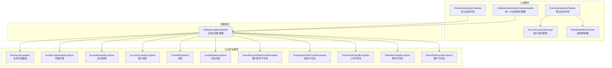
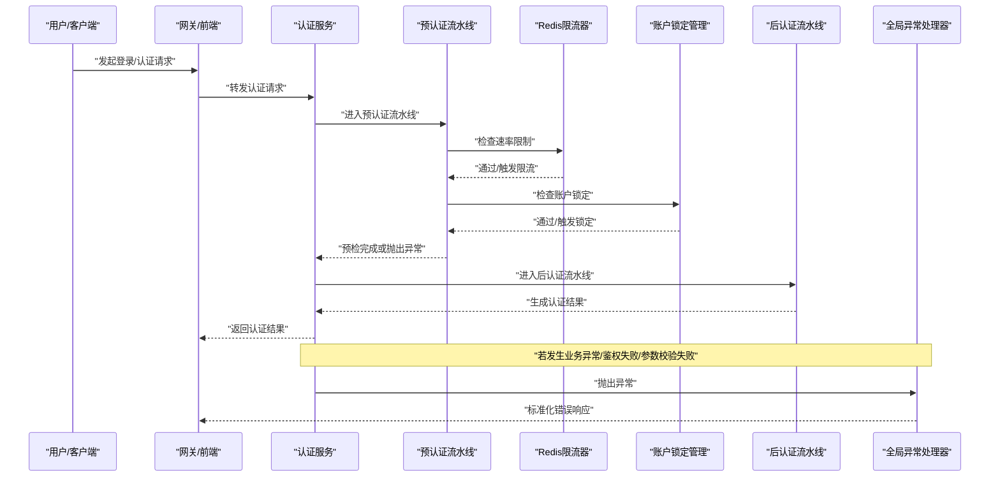
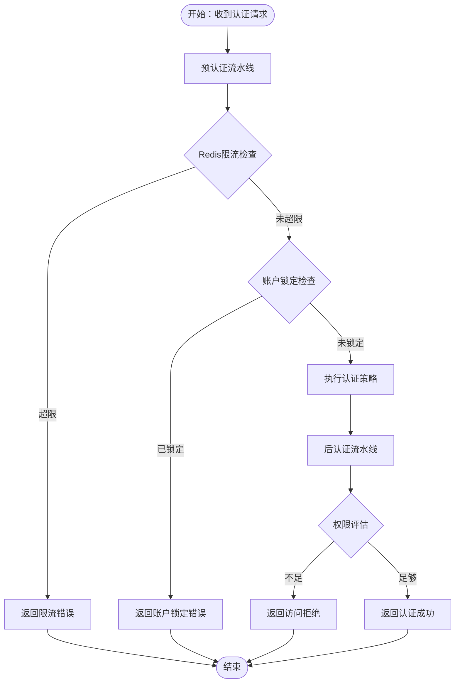
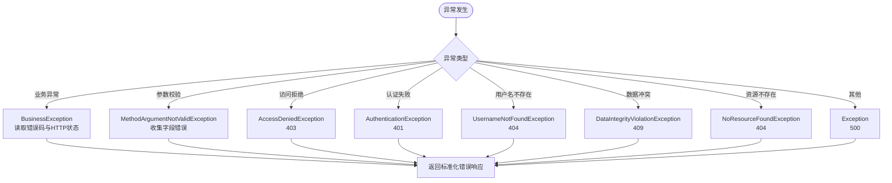
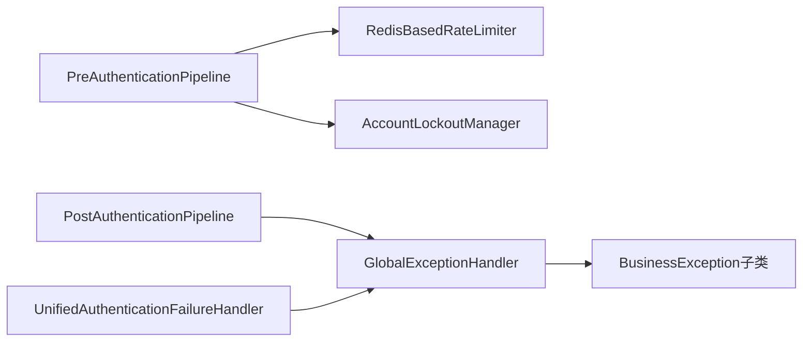

# 常见问题诊断

<cite>
**本文引用的文件**
- [BusinessException.java](file://iam-common/src/main/java/iam/platform/common/model/exception/BusinessException.java)
- [InvalidCredentialsException.java](file://iam-common/src/main/java/iam/platform/common/model/exception/InvalidCredentialsException.java)
- [AccessDeniedException.java](file://iam-common/src/main/java/iam/platform/common/model/exception/AccessDeniedException.java)
- [AccountLockedException.java](file://iam-common/src/main/java/iam/platform/common/model/exception/AccountLockedException.java)
- [TenantAccountNotFoundException.java](file://iam-common/src/main/java/iam/platform/common/model/exception/TenantAccountNotFoundException.java)
- [OrganizationNotFoundException.java](file://iam-common/src/main/java/iam/platform/common/model/exception/OrganizationNotFoundException.java)
- [PersonNotFoundException.java](file://iam-common/src/main/java/iam/platform/common/model/exception/PersonNotFoundException.java)
- [RoleNotFoundException.java](file://iam-common/src/main/java/iam/platform/common/model/exception/RoleNotFoundException.java)
- [TenantNotFoundException.java](file://iam-common/src/main/java/iam/platform/common/model/exception/TenantNotFoundException.java)
- [ConflictException.java](file://iam-common/src/main/java/iam/platform/common/model/exception/ConflictException.java)
- [InvalidStateException.java](file://iam-common/src/main/java/iam/platform/common/model/exception/InvalidStateException.java)
- [GlobalExceptionHandler.java](file://iam-admin-server/src/main/java/iam/platform/admin/interfaces/rest/common/GlobalExceptionHandler.java)
- [UnifiedAuthenticationFailureHandler.java](file://iam-auth-server/src/main/java/iam/platform/auth/infrastructure/security/UnifiedAuthenticationFailureHandler.java)
- [PreAuthenticationPipeline.java](file://iam-auth-server/src/main/java/iam/platform/auth/application/service/pipeline/PreAuthenticationPipeline.java)
- [PostAuthenticationPipeline.java](file://iam-auth-server/src/main/java/iam/platform/auth/application/service/pipeline/PostAuthenticationPipeline.java)
- [AccountLockoutManager.java](file://iam-auth-server/src/main/java/iam/platform/auth/infrastructure/security/AccountLockoutManager.java)
- [RedisBasedRateLimiter.java](file://iam-auth-server/src/main/java/iam/platform/auth/infrastructure/security/RedisBasedRateLimiter.java)
- [AuthenticationController.java](file://iam-auth-server/src/main/java/iam/platform/auth/interfaces/rest/AuthenticationController.java)
</cite>

## 目录
1. [简介](#简介)
2. [项目结构](#项目结构)
3. [核心组件](#核心组件)
4. [架构总览](#架构总览)
5. [详细组件分析](#详细组件分析)
6. [依赖分析](#依赖分析)
7. [性能考虑](#性能考虑)
8. [故障排查指南](#故障排查指南)
9. [结论](#结论)
10. [附录](#附录)

## 简介
本指南面向运维与开发人员，聚焦IAM平台在认证失败、业务异常、服务可用性等场景下的问题诊断与处理。内容覆盖：
- 认证失败的诊断步骤（凭据错误、账户锁定、权限不足等）
- 业务异常识别与处理（数据完整性约束、资源不存在、参数校验失败等）
- 服务可用性排查（启动失败、依赖服务不可用、网络连接问题）
- 错误码与HTTP状态映射、常见错误消息含义
- 问题分类与优先级评估方法

## 项目结构
IAM平台采用多模块分层设计：公共异常模型、认证服务、管理服务、网关与BFF等。认证与异常处理的关键逻辑集中在认证服务与管理服务的全局异常处理器中。

图表来源
- [PreAuthenticationPipeline.java:1-61](file://iam-auth-server/src/main/java/iam/platform/auth/application/service/pipeline/PreAuthenticationPipeline.java#L1-L61)
- [PostAuthenticationPipeline.java:1-31](file://iam-auth-server/src/main/java/iam/platform/auth/application/service/pipeline/PostAuthenticationPipeline.java#L1-L31)
- [AccountLockoutManager.java:1-135](file://iam-auth-server/src/main/java/iam/platform/auth/infrastructure/security/AccountLockoutManager.java#L1-L135)
- [RedisBasedRateLimiter.java:1-124](file://iam-auth-server/src/main/java/iam/platform/auth/infrastructure/security/RedisBasedRateLimiter.java#L1-L124)
- [UnifiedAuthenticationFailureHandler.java:1-37](file://iam-auth-server/src/main/java/iam/platform/auth/infrastructure/security/UnifiedAuthenticationFailureHandler.java#L1-L37)
- [GlobalExceptionHandler.java:1-101](file://iam-admin-server/src/main/java/iam/platform/admin/interfaces/rest/common/GlobalExceptionHandler.java#L1-L101)
- [BusinessException.java:1-17](file://iam-common/src/main/java/iam/platform/common/model/exception/BusinessException.java#L1-L17)
- [InvalidCredentialsException.java:1-10](file://iam-common/src/main/java/iam/platform/common/model/exception/InvalidCredentialsException.java#L1-L10)
- [AccessDeniedException.java:1-25](file://iam-common/src/main/java/iam/platform/common/model/exception/AccessDeniedException.java#L1-L25)
- [AccountLockedException.java:1-10](file://iam-common/src/main/java/iam/platform/common/model/exception/AccountLockedException.java#L1-L10)
- [ConflictException.java:1-10](file://iam-common/src/main/java/iam/platform/common/model/exception/ConflictException.java#L1-L10)
- [InvalidStateException.java:1-10](file://iam-common/src/main/java/iam/platform/common/model/exception/InvalidStateException.java#L1-L10)
- [TenantAccountNotFoundException.java:1-10](file://iam-common/src/main/java/iam/platform/common/model/exception/TenantAccountNotFoundException.java#L1-L10)
- [OrganizationNotFoundException.java:1-10](file://iam-common/src/main/java/iam/platform/common/model/exception/OrganizationNotFoundException.java#L1-L10)
- [PersonNotFoundException.java:1-10](file://iam-common/src/main/java/iam/platform/common/model/exception/PersonNotFoundException.java#L1-L10)
- [RoleNotFoundException.java:1-10](file://iam-common/src/main/java/iam/platform/common/model/exception/RoleNotFoundException.java#L1-L10)
- [TenantNotFoundException.java:1-10](file://iam-common/src/main/java/iam/platform/common/model/exception/TenantNotFoundException.java#L1-L10)

章节来源
- [PreAuthenticationPipeline.java:1-61](file://iam-auth-server/src/main/java/iam/platform/auth/application/service/pipeline/PreAuthenticationPipeline.java#L1-L61)
- [PostAuthenticationPipeline.java:1-31](file://iam-auth-server/src/main/java/iam/platform/auth/application/service/pipeline/PostAuthenticationPipeline.java#L1-L31)
- [AccountLockoutManager.java:1-135](file://iam-auth-server/src/main/java/iam/platform/auth/infrastructure/security/AccountLockoutManager.java#L1-L135)
- [RedisBasedRateLimiter.java:1-124](file://iam-auth-server/src/main/java/iam/platform/auth/infrastructure/security/RedisBasedRateLimiter.java#L1-L124)
- [UnifiedAuthenticationFailureHandler.java:1-37](file://iam-auth-server/src/main/java/iam/platform/auth/infrastructure/security/UnifiedAuthenticationFailureHandler.java#L1-L37)
- [GlobalExceptionHandler.java:1-101](file://iam-admin-server/src/main/java/iam/platform/admin/interfaces/rest/common/GlobalExceptionHandler.java#L1-L101)
- [BusinessException.java:1-17](file://iam-common/src/main/java/iam/platform/common/model/exception/BusinessException.java#L1-L17)
- [InvalidCredentialsException.java:1-10](file://iam-common/src/main/java/iam/platform/common/model/exception/InvalidCredentialsException.java#L1-L10)
- [AccessDeniedException.java:1-25](file://iam-common/src/main/java/iam/platform/common/model/exception/AccessDeniedException.java#L1-L25)
- [AccountLockedException.java:1-10](file://iam-common/src/main/java/iam/platform/common/model/exception/AccountLockedException.java#L1-L10)
- [ConflictException.java:1-10](file://iam-common/src/main/java/iam/platform/common/model/exception/ConflictException.java#L1-L10)
- [InvalidStateException.java:1-10](file://iam-common/src/main/java/iam/platform/common/model/exception/InvalidStateException.java#L1-L10)
- [TenantAccountNotFoundException.java:1-10](file://iam-common/src/main/java/iam/platform/common/model/exception/TenantAccountNotFoundException.java#L1-L10)
- [OrganizationNotFoundException.java:1-10](file://iam-common/src/main/java/iam/platform/common/model/exception/OrganizationNotFoundException.java#L1-L10)
- [PersonNotFoundException.java:1-10](file://iam-common/src/main/java/iam/platform/common/model/exception/PersonNotFoundException.java#L1-L10)
- [RoleNotFoundException.java:1-10](file://iam-common/src/main/java/iam/platform/common/model/exception/RoleNotFoundException.java#L1-L10)
- [TenantNotFoundException.java:1-10](file://iam-common/src/main/java/iam/platform/common/model/exception/TenantNotFoundException.java#L1-L10)

## 核心组件
- 业务异常基类与具体异常：定义统一的错误码与HTTP状态，便于前端与网关一致化处理。
- 全局异常处理器：集中捕获业务异常、参数校验、鉴权失败、资源不存在、数据完整性冲突等，并返回标准化响应。
- 预/后认证流水线：在认证前后执行一系列检查与处理（如速率限制、账户锁定、审计、权限加载等）。
- 统一认证失败处理器：将认证失败重定向到登录页并携带错误参数。
- Redis限流与账户锁定：基于Redis实现滑动窗口计数与账户锁定阈值控制，具备“故障放行”策略。

章节来源
- [BusinessException.java:1-17](file://iam-common/src/main/java/iam/platform/common/model/exception/BusinessException.java#L1-L17)
- [GlobalExceptionHandler.java:1-101](file://iam-admin-server/src/main/java/iam/platform/admin/interfaces/rest/common/GlobalExceptionHandler.java#L1-L101)
- [PreAuthenticationPipeline.java:1-61](file://iam-auth-server/src/main/java/iam/platform/auth/application/service/pipeline/PreAuthenticationPipeline.java#L1-L61)
- [PostAuthenticationPipeline.java:1-31](file://iam-auth-server/src/main/java/iam/platform/auth/application/service/pipeline/PostAuthenticationPipeline.java#L1-L31)
- [UnifiedAuthenticationFailureHandler.java:1-37](file://iam-auth-server/src/main/java/iam/platform/auth/infrastructure/security/UnifiedAuthenticationFailureHandler.java#L1-L37)
- [AccountLockoutManager.java:1-135](file://iam-auth-server/src/main/java/iam/platform/auth/infrastructure/security/AccountLockoutManager.java#L1-L135)
- [RedisBasedRateLimiter.java:1-124](file://iam-auth-server/src/main/java/iam/platform/auth/infrastructure/security/RedisBasedRateLimiter.java#L1-L124)

## 架构总览
下图展示认证失败从请求到响应的关键路径，以及异常如何被统一处理。

图表来源
- [PreAuthenticationPipeline.java:1-61](file://iam-auth-server/src/main/java/iam/platform/auth/application/service/pipeline/PreAuthenticationPipeline.java#L1-L61)
- [PostAuthenticationPipeline.java:1-31](file://iam-auth-server/src/main/java/iam/platform/auth/application/service/pipeline/PostAuthenticationPipeline.java#L1-L31)
- [RedisBasedRateLimiter.java:1-124](file://iam-auth-server/src/main/java/iam/platform/auth/infrastructure/security/RedisBasedRateLimiter.java#L1-L124)
- [AccountLockoutManager.java:1-135](file://iam-auth-server/src/main/java/iam/platform/auth/infrastructure/security/AccountLockoutManager.java#L1-L135)
- [GlobalExceptionHandler.java:1-101](file://iam-admin-server/src/main/java/iam/platform/admin/interfaces/rest/common/GlobalExceptionHandler.java#L1-L101)

## 详细组件分析

### 认证失败诊断（凭据错误、账户锁定、权限不足）
- 凭据错误
  - 触发点：认证失败处理器在登录页重定向时携带错误参数；业务异常中“INVALID_CREDENTIALS”对应401未授权。
  - 排查要点：确认用户名/密码、客户端凭据是否正确；检查登录页错误参数是否出现。
- 账户锁定
  - 触发点：账户锁定管理器基于Redis计数超过阈值后设置锁定键并设置过期时间；预认证流水线记录失败以更新计数。
  - 排查要点：检查Redis中锁定键是否存在及剩余TTL；确认是否因连续失败触发；关注“故障放行”日志。
- 权限不足
  - 触发点：后认证流水线可能加载权限并进行授权评估；全局异常处理器捕获访问拒绝异常并返回403。
  - 排查要点：核对用户角色与资源权限映射；检查权限加载链路是否正常。

图表来源
- [PreAuthenticationPipeline.java:1-61](file://iam-auth-server/src/main/java/iam/platform/auth/application/service/pipeline/PreAuthenticationPipeline.java#L1-L61)
- [PostAuthenticationPipeline.java:1-31](file://iam-auth-server/src/main/java/iam/platform/auth/application/service/pipeline/PostAuthenticationPipeline.java#L1-L31)
- [RedisBasedRateLimiter.java:1-124](file://iam-auth-server/src/main/java/iam/platform/auth/infrastructure/security/RedisBasedRateLimiter.java#L1-L124)
- [AccountLockoutManager.java:1-135](file://iam-auth-server/src/main/java/iam/platform/auth/infrastructure/security/AccountLockoutManager.java#L1-L135)
- [UnifiedAuthenticationFailureHandler.java:1-37](file://iam-auth-server/src/main/java/iam/platform/auth/infrastructure/security/UnifiedAuthenticationFailureHandler.java#L1-L37)

章节来源
- [InvalidCredentialsException.java:1-10](file://iam-common/src/main/java/iam/platform/common/model/exception/InvalidCredentialsException.java#L1-L10)
- [AccountLockedException.java:1-10](file://iam-common/src/main/java/iam/platform/common/model/exception/AccountLockedException.java#L1-L10)
- [AccessDeniedException.java:1-25](file://iam-common/src/main/java/iam/platform/common/model/exception/AccessDeniedException.java#L1-L25)
- [UnifiedAuthenticationFailureHandler.java:1-37](file://iam-auth-server/src/main/java/iam/platform/auth/infrastructure/security/UnifiedAuthenticationFailureHandler.java#L1-L37)
- [PreAuthenticationPipeline.java:1-61](file://iam-auth-server/src/main/java/iam/platform/auth/application/service/pipeline/PreAuthenticationPipeline.java#L1-L61)
- [PostAuthenticationPipeline.java:1-31](file://iam-auth-server/src/main/java/iam/platform/auth/application/service/pipeline/PostAuthenticationPipeline.java#L1-L31)

### 业务异常识别与处理（数据完整性、资源不存在、参数校验）
- 数据完整性约束违反
  - 触发点：数据库唯一约束/外键冲突导致的数据完整性异常；全局异常处理器捕获并返回409。
  - 排查要点：检查重复主键/唯一键、外键引用、事务一致性。
- 资源不存在
  - 触发点：查询对象不存在（租户、人员、组织、角色等）；返回404。
  - 排查要点：确认ID/编码是否正确；检查软删除与可见性过滤。
- 参数验证失败
  - 触发点：请求体/参数不满足校验规则；返回400并附带字段级错误列表。
  - 排查要点：逐项核对必填字段、格式与范围。

图表来源
- [GlobalExceptionHandler.java:1-101](file://iam-admin-server/src/main/java/iam/platform/admin/interfaces/rest/common/GlobalExceptionHandler.java#L1-L101)
- [BusinessException.java:1-17](file://iam-common/src/main/java/iam/platform/common/model/exception/BusinessException.java#L1-L17)
- [ConflictException.java:1-10](file://iam-common/src/main/java/iam/platform/common/model/exception/ConflictException.java#L1-L10)
- [TenantAccountNotFoundException.java:1-10](file://iam-common/src/main/java/iam/platform/common/model/exception/TenantAccountNotFoundException.java#L1-L10)
- [OrganizationNotFoundException.java:1-10](file://iam-common/src/main/java/iam/platform/common/model/exception/OrganizationNotFoundException.java#L1-L10)
- [PersonNotFoundException.java:1-10](file://iam-common/src/main/java/iam/platform/common/model/exception/PersonNotFoundException.java#L1-L10)
- [RoleNotFoundException.java:1-10](file://iam-common/src/main/java/iam/platform/common/model/exception/RoleNotFoundException.java#L1-L10)
- [TenantNotFoundException.java:1-10](file://iam-common/src/main/java/iam/platform/common/model/exception/TenantNotFoundException.java#L1-L10)

章节来源
- [GlobalExceptionHandler.java:1-101](file://iam-admin-server/src/main/java/iam/platform/admin/interfaces/rest/common/GlobalExceptionHandler.java#L1-L101)
- [BusinessException.java:1-17](file://iam-common/src/main/java/iam/platform/common/model/exception/BusinessException.java#L1-L17)
- [ConflictException.java:1-10](file://iam-common/src/main/java/iam/platform/common/model/exception/ConflictException.java#L1-L10)
- [TenantAccountNotFoundException.java:1-10](file://iam-common/src/main/java/iam/platform/common/model/exception/TenantAccountNotFoundException.java#L1-L10)
- [OrganizationNotFoundException.java:1-10](file://iam-common/src/main/java/iam/platform/common/model/exception/OrganizationNotFoundException.java#L1-L10)
- [PersonNotFoundException.java:1-10](file://iam-common/src/main/java/iam/platform/common/model/exception/PersonNotFoundException.java#L1-L10)
- [RoleNotFoundException.java:1-10](file://iam-common/src/main/java/iam/platform/common/model/exception/RoleNotFoundException.java#L1-L10)
- [TenantNotFoundException.java:1-10](file://iam-common/src/main/java/iam/platform/common/model/exception/TenantNotFoundException.java#L1-L10)

### 服务可用性问题排查（启动失败、依赖不可用、网络问题）
- 启动失败
  - 排查要点：查看应用启动日志中的异常堆栈；确认配置文件加载顺序与环境变量；检查端口占用与健康检查端点。
- 依赖服务不可用
  - 排查要点：认证服务依赖Redis进行限流与锁定；若Redis不可用，系统会“故障放行”，但需关注日志告警；检查Feign客户端配置与熔断策略。
- 网络连接问题
  - 排查要点：跨服务调用（如BFF->认证/管理）应检查DNS解析、防火墙策略、超时与重试配置。

章节来源
- [AccountLockoutManager.java:54-58](file://iam-auth-server/src/main/java/iam/platform/auth/infrastructure/security/AccountLockoutManager.java#L54-L58)
- [RedisBasedRateLimiter.java:63-67](file://iam-auth-server/src/main/java/iam/platform/auth/infrastructure/security/RedisBasedRateLimiter.java#L63-L67)

## 依赖分析
- 认证服务内部依赖
  - 预/后认证流水线通过Spring自动发现处理器并按序执行，耦合度低、扩展性强。
  - 限流与锁定依赖Redis，具备“故障放行”策略，避免单点故障放大。
- 异常处理依赖
  - 全局异常处理器统一拦截各类异常并输出标准化响应，降低各控制器的重复逻辑。

图表来源
- [PreAuthenticationPipeline.java:1-61](file://iam-auth-server/src/main/java/iam/platform/auth/application/service/pipeline/PreAuthenticationPipeline.java#L1-L61)
- [PostAuthenticationPipeline.java:1-31](file://iam-auth-server/src/main/java/iam/platform/auth/application/service/pipeline/PostAuthenticationPipeline.java#L1-L31)
- [RedisBasedRateLimiter.java:1-124](file://iam-auth-server/src/main/java/iam/platform/auth/infrastructure/security/RedisBasedRateLimiter.java#L1-L124)
- [AccountLockoutManager.java:1-135](file://iam-auth-server/src/main/java/iam/platform/auth/infrastructure/security/AccountLockoutManager.java#L1-L135)
- [UnifiedAuthenticationFailureHandler.java:1-37](file://iam-auth-server/src/main/java/iam/platform/auth/infrastructure/security/UnifiedAuthenticationFailureHandler.java#L1-L37)
- [GlobalExceptionHandler.java:1-101](file://iam-admin-server/src/main/java/iam/platform/admin/interfaces/rest/common/GlobalExceptionHandler.java#L1-L101)

## 性能考虑
- 限流与锁定
  - 使用滑动窗口计数，窗口与最大尝试次数可配置；首次访问设置TTL，后续访问复用。
  - 账户锁定采用独立键，失败计数与锁定键分离，便于快速重置。
- 故障放行
  - Redis不可用时，限流与锁定逻辑“故障放行”，保证服务可用性，但需监控与告警。
- 日志与可观测性
  - 关键路径均输出DEBUG/WARN/ERROR级别日志，便于定位问题与统计趋势。

章节来源
- [RedisBasedRateLimiter.java:32-67](file://iam-auth-server/src/main/java/iam/platform/auth/infrastructure/security/RedisBasedRateLimiter.java#L32-L67)
- [AccountLockoutManager.java:64-99](file://iam-auth-server/src/main/java/iam/platform/auth/infrastructure/security/AccountLockoutManager.java#L64-L99)
- [PreAuthenticationPipeline.java:36-59](file://iam-auth-server/src/main/java/iam/platform/auth/application/service/pipeline/PreAuthenticationPipeline.java#L36-L59)

## 故障排查指南

### 认证失败问题诊断步骤
1. 检查登录页错误参数
   - 若出现认证失败提示，确认是否由统一认证失败处理器触发。
2. 核对凭据
   - 使用正确的用户名/密码或客户端凭据；确认租户上下文与账号状态。
3. 查看速率限制
   - 检查Redis中限流键是否存在与剩余TTL；确认是否触发了限流。
4. 检查账户锁定
   - 检查锁定键是否存在；若存在，等待TTL到期或联系管理员解锁。
5. 权限评估
   - 确认用户角色与目标资源权限映射；检查后认证流水线是否加载权限成功。

章节来源
- [UnifiedAuthenticationFailureHandler.java:1-37](file://iam-auth-server/src/main/java/iam/platform/auth/infrastructure/security/UnifiedAuthenticationFailureHandler.java#L1-L37)
- [RedisBasedRateLimiter.java:1-124](file://iam-auth-server/src/main/java/iam/platform/auth/infrastructure/security/RedisBasedRateLimiter.java#L1-L124)
- [AccountLockoutManager.java:1-135](file://iam-auth-server/src/main/java/iam/platform/auth/infrastructure/security/AccountLockoutManager.java#L1-L135)
- [PostAuthenticationPipeline.java:1-31](file://iam-auth-server/src/main/java/iam/platform/auth/application/service/pipeline/PostAuthenticationPipeline.java#L1-L31)

### 业务异常识别与处理
- 数据完整性约束违反
  - 现象：返回409；消息提示约束冲突。
  - 处理：修正重复键或外键引用；必要时回滚事务。
- 资源不存在
  - 现象：返回404；消息提示资源不存在。
  - 处理：确认ID/编码；检查软删除与可见性。
- 参数验证失败
  - 现象：返回400；附带字段级错误列表。
  - 处理：逐项修正字段值与格式。

章节来源
- [GlobalExceptionHandler.java:76-91](file://iam-admin-server/src/main/java/iam/platform/admin/interfaces/rest/common/GlobalExceptionHandler.java#L76-L91)
- [TenantAccountNotFoundException.java:1-10](file://iam-common/src/main/java/iam/platform/common/model/exception/TenantAccountNotFoundException.java#L1-L10)
- [OrganizationNotFoundException.java:1-10](file://iam-common/src/main/java/iam/platform/common/model/exception/OrganizationNotFoundException.java#L1-L10)
- [PersonNotFoundException.java:1-10](file://iam-common/src/main/java/iam/platform/common/model/exception/PersonNotFoundException.java#L1-L10)
- [RoleNotFoundException.java:1-10](file://iam-common/src/main/java/iam/platform/common/model/exception/RoleNotFoundException.java#L1-L10)
- [TenantNotFoundException.java:1-10](file://iam-common/src/main/java/iam/platform/common/model/exception/TenantNotFoundException.java#L1-L10)

### 服务可用性问题排查
- 启动失败
  - 步骤：查看启动日志；核对配置文件与环境变量；检查端口占用。
- 依赖服务不可用
  - 步骤：检查Redis连通性；关注“故障放行”日志；确认Feign与熔断配置。
- 网络连接问题
  - 步骤：检查DNS、防火墙、超时与重试；验证跨服务调用链路。

章节来源
- [AccountLockoutManager.java:54-58](file://iam-auth-server/src/main/java/iam/platform/auth/infrastructure/security/AccountLockoutManager.java#L54-L58)
- [RedisBasedRateLimiter.java:63-67](file://iam-auth-server/src/main/java/iam/platform/auth/infrastructure/security/RedisBasedRateLimiter.java#L63-L67)

### 错误码与HTTP状态对照
- INVALID_CREDENTIALS：401 未授权（凭据无效）
- ACCOUNT_LOCKED：403 禁止访问（账户被锁定）
- CONFLICT：409 冲突（数据完整性约束违反）
- INVALID_STATE：400 错误请求（状态无效）
- TENANT_ACCOUNT_NOT_FOUND：404 未找到（租户账号不存在）
- ORGANIZATION_NOT_FOUND：404 未找到（组织不存在）
- PERSON_NOT_FOUND：404 未找到（人员不存在）
- ROLE_NOT_FOUND：404 未找到（角色不存在）
- TENANT_NOT_FOUND：404 未找到（租户不存在）

章节来源
- [InvalidCredentialsException.java:1-10](file://iam-common/src/main/java/iam/platform/common/model/exception/InvalidCredentialsException.java#L1-L10)
- [AccountLockedException.java:1-10](file://iam-common/src/main/java/iam/platform/common/model/exception/AccountLockedException.java#L1-L10)
- [ConflictException.java:1-10](file://iam-common/src/main/java/iam/platform/common/model/exception/ConflictException.java#L1-L10)
- [InvalidStateException.java:1-10](file://iam-common/src/main/java/iam/platform/common/model/exception/InvalidStateException.java#L1-L10)
- [TenantAccountNotFoundException.java:1-10](file://iam-common/src/main/java/iam/platform/common/model/exception/TenantAccountNotFoundException.java#L1-L10)
- [OrganizationNotFoundException.java:1-10](file://iam-common/src/main/java/iam/platform/common/model/exception/OrganizationNotFoundException.java#L1-L10)
- [PersonNotFoundException.java:1-10](file://iam-common/src/main/java/iam/platform/common/model/exception/PersonNotFoundException.java#L1-L10)
- [RoleNotFoundException.java:1-10](file://iam-common/src/main/java/iam/platform/common/model/exception/RoleNotFoundException.java#L1-L10)
- [TenantNotFoundException.java:1-10](file://iam-common/src/main/java/iam/platform/common/model/exception/TenantNotFoundException.java#L1-L10)

### 常见错误消息含义
- “Too many authentication attempts. Please try again in X seconds.”：触发速率限制，建议稍后再试。
- “Account is temporarily locked. Please try again in X seconds.”：账户被锁定，等待TTL到期或管理员解锁。
- “Access denied: required permission 'X' not granted”：缺少所需权限，需补充角色或授权。

章节来源
- [RedisBasedRateLimiter.java:49-50](file://iam-auth-server/src/main/java/iam/platform/auth/infrastructure/security/RedisBasedRateLimiter.java#L49-L50)
- [AccountLockoutManager.java:49-50](file://iam-auth-server/src/main/java/iam/platform/auth/infrastructure/security/AccountLockoutManager.java#L49-L50)
- [AccessDeniedException.java:1-25](file://iam-common/src/main/java/iam/platform/common/model/exception/AccessDeniedException.java#L1-L25)

### 问题分类与优先级评估
- P0（立即处理）
  - 认证失败导致大规模无法登录；服务完全不可用。
- P1（高优）
  - 速率限制误触发；账户锁定误判；权限缺失导致关键功能不可用。
- P2（常规）
  - 参数校验失败；资源不存在；数据冲突。
- P3（低优先）
  - 配置差异导致的非关键异常；日志噪音。

建议处理顺序
- 先恢复服务可用性（检查依赖、网络、配置），再定位具体异常类型，最后修复业务逻辑与权限。

## 结论
通过统一的异常模型、全局异常处理器与认证流水线，IAM平台实现了对认证失败、业务异常与服务可用性的系统化诊断与处理。建议在生产环境中：
- 开启并监控Redis限流与锁定指标；
- 完善日志与告警策略；
- 明确问题分级与升级机制；
- 定期演练故障恢复流程。

## 附录

### 认证流程关键节点（参考）
- 预认证流水线：执行限流与锁定检查，记录失败/成功。
- 后认证流水线：加载权限、生成结果。
- 统一认证失败处理器：登录页重定向并携带错误参数。
- 全局异常处理器：统一返回标准化错误响应。

章节来源
- [PreAuthenticationPipeline.java:1-61](file://iam-auth-server/src/main/java/iam/platform/auth/application/service/pipeline/PreAuthenticationPipeline.java#L1-L61)
- [PostAuthenticationPipeline.java:1-31](file://iam-auth-server/src/main/java/iam/platform/auth/application/service/pipeline/PostAuthenticationPipeline.java#L1-L31)
- [UnifiedAuthenticationFailureHandler.java:1-37](file://iam-auth-server/src/main/java/iam/platform/auth/infrastructure/security/UnifiedAuthenticationFailureHandler.java#L1-L37)
- [GlobalExceptionHandler.java:1-101](file://iam-admin-server/src/main/java/iam/platform/admin/interfaces/rest/common/GlobalExceptionHandler.java#L1-L101)
- [AuthenticationController.java:1-47](file://iam-auth-server/src/main/java/iam/platform/auth/interfaces/rest/AuthenticationController.java#L1-L47)