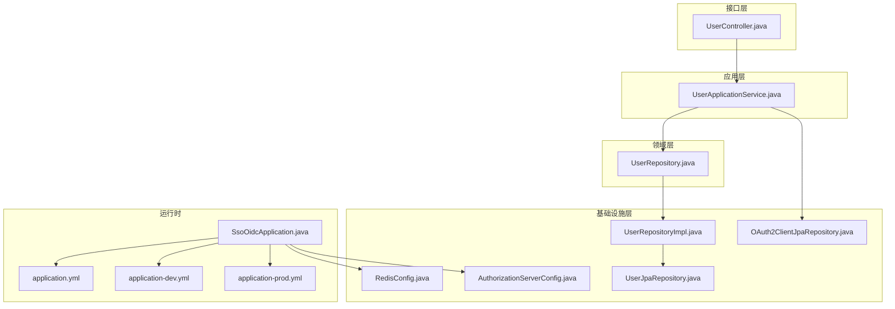
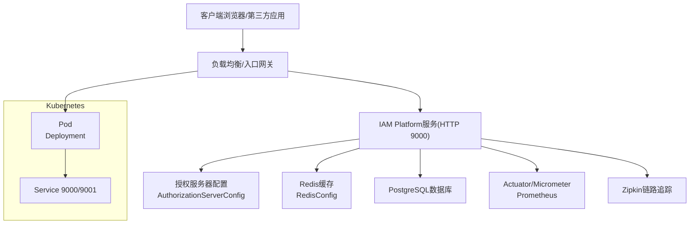
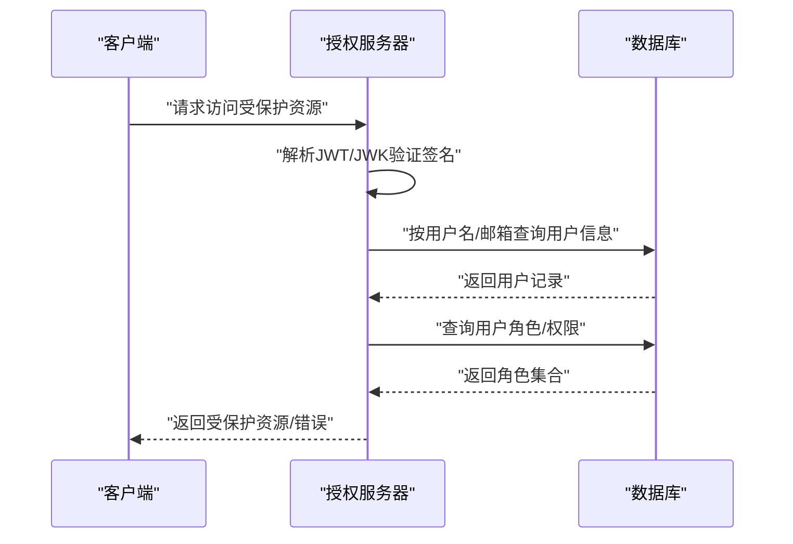
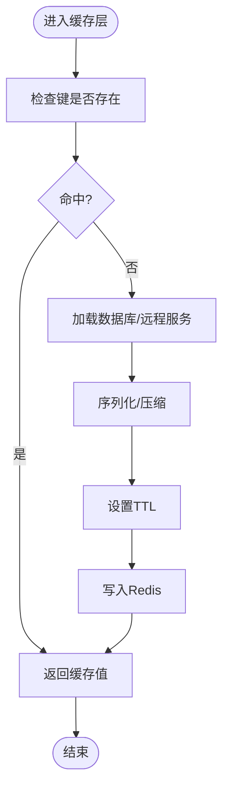
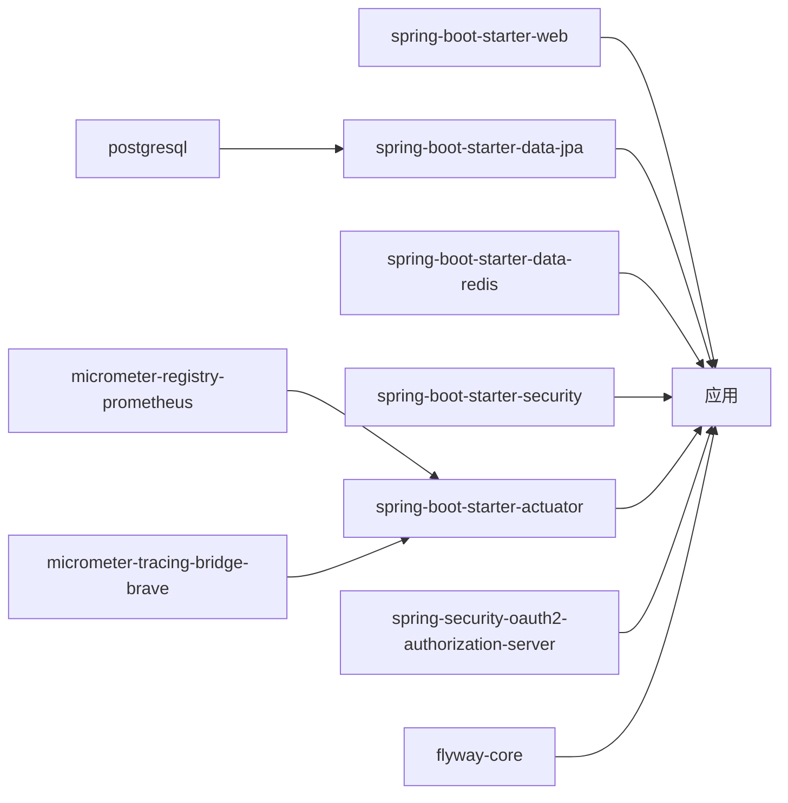

# 性能优化

<cite>
**本文引用的文件**
- [SsoOidcApplication.java](file://src/main/java/sso/oidc/SsoOidcApplication.java)
- [application.yml](file://src/main/resources/application.yml)
- [application-dev.yml](file://src/main/resources/application-dev.yml)
- [application-prod.yml](file://src/main/resources/application-prod.yml)
- [RedisConfig.java](file://src/main/java/sso/oidc/infrastructure/config/RedisConfig.java)
- [AuthorizationServerConfig.java](file://src/main/java/sso/oidc/infrastructure/config/AuthorizationServerConfig.java)
- [UserRepository.java](file://src/main/java/sso/oidc/domain/repository/UserRepository.java)
- [UserRepositoryImpl.java](file://src/main/java/sso/oidc/infrastructure/persistence/impl/UserRepositoryImpl.java)
- [UserJpaRepository.java](file://src/main/java/sso/oidc/infrastructure/persistence/repository/UserJpaRepository.java)
- [OAuth2ClientJpaRepository.java](file://src/main/java/sso/oidc/infrastructure/persistence/repository/OAuth2ClientJpaRepository.java)
- [CustomUserDetailsService.java](file://src/main/java/sso/oidc/infrastructure/security/CustomUserDetailsService.java)
- [UserController.java](file://src/main/java/sso/oidc/interfaces/rest/UserController.java)
- [deployment.yaml](file://k8s/base/deployment.yaml)
- [service.yaml](file://k8s/base/service.yaml)
- [pom.xml](file://pom.xml)
</cite>

## 目录
1. [简介](#简介)
2. [项目结构](#项目结构)
3. [核心组件](#核心组件)
4. [架构总览](#架构总览)
5. [详细组件分析](#详细组件分析)
6. [依赖分析](#依赖分析)
7. [性能考虑](#性能考虑)
8. [故障排查指南](#故障排查指南)
9. [结论](#结论)
10. [附录](#附录)

## 简介
本指南面向IAM Platform认证服务（基于Spring Authorization Server）在生产环境中的性能优化实践，聚焦以下方面：
- 数据库查询优化：SQL执行计划分析、索引优化建议、连接池配置调整
- Redis缓存调优：命中率、延迟、内存使用与键空间设计
- 内存使用优化：JVM参数、GC策略、对象生命周期管理
- 并发处理优化：线程模型、异步化、限流与超时控制
- 观测性与压测：Prometheus/Micrometer指标、Zipkin链路追踪、基准测试工具

## 项目结构
该服务采用分层架构：接口层（REST）、应用层（DTO/Service）、领域层（Repository/Model）、基础设施层（JPA/Redis/安全配置）。关键运行参数通过多环境配置文件管理，并在Kubernetes中以Deployment暴露HTTP与Management端口。

图示来源
- [SsoOidcApplication.java:1-13](file://src/main/java/sso/oidc/SsoOidcApplication.java#L1-L13)
- [application.yml:1-78](file://src/main/resources/application.yml#L1-L78)
- [application-dev.yml:1-22](file://src/main/resources/application-dev.yml#L1-L22)
- [application-prod.yml:1-25](file://src/main/resources/application-prod.yml#L1-L25)
- [RedisConfig.java:1-34](file://src/main/java/sso/oidc/infrastructure/config/RedisConfig.java#L1-L34)
- [AuthorizationServerConfig.java:1-144](file://src/main/java/sso/oidc/infrastructure/config/AuthorizationServerConfig.java#L1-L144)
- [UserRepository.java:1-26](file://src/main/java/sso/oidc/domain/repository/UserRepository.java#L1-L26)
- [UserRepositoryImpl.java:1-92](file://src/main/java/sso/oidc/infrastructure/persistence/impl/UserRepositoryImpl.java#L1-L92)
- [UserJpaRepository.java:1-17](file://src/main/java/sso/oidc/infrastructure/persistence/repository/UserJpaRepository.java#L1-L17)
- [OAuth2ClientJpaRepository.java:1-11](file://src/main/java/sso/oidc/infrastructure/persistence/repository/OAuth2ClientJpaRepository.java#L1-L11)

章节来源
- [SsoOidcApplication.java:1-13](file://src/main/java/sso/oidc/SsoOidcApplication.java#L1-L13)
- [application.yml:1-78](file://src/main/resources/application.yml#L1-L78)
- [application-dev.yml:1-22](file://src/main/resources/application-dev.yml#L1-L22)
- [application-prod.yml:1-25](file://src/main/resources/application-prod.yml#L1-L25)

## 核心组件
- 应用入口与运行参数
  - 应用启动类负责引导Spring Boot容器
  - 运行参数通过application.yml及多环境配置文件集中管理，包括数据库连接池、JPA、Redis、Actuator/Micrometer/Tracing等
- 安全与OIDC配置
  - AuthorizationServerConfig定义了授权服务器的安全过滤链、客户端注册、JWK/JWT解码器、授权服务器设置
- 缓存与会话
  - RedisConfig启用缓存并配置默认TTL、序列化策略与键前缀
  - Spring Session集成Redis用于分布式会话存储
- 持久层
  - UserRepository接口定义用户域操作
  - UserRepositoryImpl通过JPA仓库实现具体持久化逻辑
  - UserJpaRepository/OAuth2ClientJpaRepository提供按用户名/邮箱与客户端ID的查询方法
- 接口层
  - UserController提供用户管理REST接口，配合通用响应包装

章节来源
- [SsoOidcApplication.java:1-13](file://src/main/java/sso/oidc/SsoOidcApplication.java#L1-L13)
- [application.yml:1-78](file://src/main/resources/application.yml#L1-L78)
- [AuthorizationServerConfig.java:1-144](file://src/main/java/sso/oidc/infrastructure/config/AuthorizationServerConfig.java#L1-L144)
- [RedisConfig.java:1-34](file://src/main/java/sso/oidc/infrastructure/config/RedisConfig.java#L1-L34)
- [UserRepository.java:1-26](file://src/main/java/sso/oidc/domain/repository/UserRepository.java#L1-L26)
- [UserRepositoryImpl.java:1-92](file://src/main/java/sso/oidc/infrastructure/persistence/impl/UserRepositoryImpl.java#L1-L92)
- [UserJpaRepository.java:1-17](file://src/main/java/sso/oidc/infrastructure/persistence/repository/UserJpaRepository.java#L1-L17)
- [OAuth2ClientJpaRepository.java:1-11](file://src/main/java/sso/oidc/infrastructure/persistence/repository/OAuth2ClientJpaRepository.java#L1-L11)
- [UserController.java:1-90](file://src/main/java/sso/oidc/interfaces/rest/UserController.java#L1-L90)

## 架构总览
下图展示从客户端到授权服务器、数据库与Redis的关键交互路径，以及可观测性组件的接入点。

图示来源
- [AuthorizationServerConfig.java:1-144](file://src/main/java/sso/oidc/infrastructure/config/AuthorizationServerConfig.java#L1-L144)
- [RedisConfig.java:1-34](file://src/main/java/sso/oidc/infrastructure/config/RedisConfig.java#L1-L34)
- [application.yml:63-78](file://src/main/resources/application.yml#L63-L78)
- [deployment.yaml:1-58](file://k8s/base/deployment.yaml#L1-L58)
- [service.yaml:1-18](file://k8s/base/service.yaml#L1-L18)

## 详细组件分析

### 数据库查询优化
- 查询路径与潜在瓶颈
  - 用户登录/鉴权流程通常涉及按用户名或邮箱查找用户，随后加载角色与权限
  - 当前UserRepositoryImpl通过UserJpaRepository的findByUsername/findByEmail进行查询
- SQL执行计划与日志
  - 开发环境开启show-sql与格式化输出，便于定位慢查询
  - 生产环境关闭show-sql，避免I/O开销
- 索引优化建议
  - 在用户表的username与email字段建立唯一索引，减少重复扫描
  - 若存在频繁的组合查询（如状态+创建时间），可考虑复合索引
- 连接池配置
  - 开发环境最大池大小较小，适合本地调试
  - 生产环境应根据QPS与事务并发度提升maximum-pool-size与minimum-idle
  - 合理设置连接超时、空闲超时与最大生命周期，避免连接泄漏
- 分页与N+1
  - 使用分页接口避免一次性加载大结果集
  - 关注是否存在N+1查询问题（例如加载用户后逐个查询其角色），可通过JOIN或批量加载优化

图示来源
- [AuthorizationServerConfig.java:1-144](file://src/main/java/sso/oidc/infrastructure/config/AuthorizationServerConfig.java#L1-L144)
- [UserJpaRepository.java:1-17](file://src/main/java/sso/oidc/infrastructure/persistence/repository/UserJpaRepository.java#L1-L17)
- [application-dev.yml:1-22](file://src/main/resources/application-dev.yml#L1-L22)
- [application-prod.yml:1-25](file://src/main/resources/application-prod.yml#L1-L25)

章节来源
- [UserRepository.java:1-26](file://src/main/java/sso/oidc/domain/repository/UserRepository.java#L1-L26)
- [UserRepositoryImpl.java:1-92](file://src/main/java/sso/oidc/infrastructure/persistence/impl/UserRepositoryImpl.java#L1-L92)
- [UserJpaRepository.java:1-17](file://src/main/java/sso/oidc/infrastructure/persistence/repository/UserJpaRepository.java#L1-L17)
- [OAuth2ClientJpaRepository.java:1-11](file://src/main/java/sso/oidc/infrastructure/persistence/repository/OAuth2ClientJpaRepository.java#L1-L11)
- [application-dev.yml:1-22](file://src/main/resources/application-dev.yml#L1-L22)
- [application-prod.yml:1-25](file://src/main/resources/application-prod.yml#L1-L25)

### Redis缓存调优
- 缓存配置
  - 默认TTL较短（分钟级），适用于短期热点数据；对长尾数据可按业务场景调整
  - JSON序列化策略带来可读性但有CPU与带宽成本，需结合命中率评估
- 命中率与延迟
  - 通过Micrometer指标观察缓存命中率、命令耗时与内存使用
  - 高延迟可能由网络抖动、过期键清理风暴或大value导致
- 键空间设计
  - 统一键前缀与命名规范，避免键冲突
  - 对会话、令牌、JWK等敏感数据设置合理TTL与淘汰策略
- 会话存储
  - Spring Session使用Redis存储会话，注意会话过期与清理策略

图示来源
- [RedisConfig.java:1-34](file://src/main/java/sso/oidc/infrastructure/config/RedisConfig.java#L1-L34)
- [application.yml:28-46](file://src/main/resources/application.yml#L28-L46)

章节来源
- [RedisConfig.java:1-34](file://src/main/java/sso/oidc/infrastructure/config/RedisConfig.java#L1-L34)
- [application.yml:28-46](file://src/main/resources/application.yml#L28-L46)

### 内存使用优化与JVM调优
- JVM版本与参数
  - 工程使用Java 21，建议在容器资源限制内合理设置堆大小与GC策略
  - 建议启用G1GC并结合容器CPU/内存限制，避免Full GC停顿
- 对象生命周期
  - DTO与实体转换尽量复用，避免频繁分配
  - 大对象及时释放引用，防止晋升老年代
- 线程池配置
  - Web与异步任务分离线程池，避免阻塞IO影响请求线程
  - 结合业务峰值QPS设置队列长度与拒绝策略

章节来源
- [pom.xml:20-27](file://pom.xml#L20-L27)
- [deployment.yaml:30-36](file://k8s/base/deployment.yaml#L30-L36)

### 并发处理优化
- 授权服务器与安全过滤链
  - AuthorizationServerConfig定义了安全过滤链与JWT解码器，确保高并发下的签名校验性能
- 登录与鉴权
  - CustomUserDetailsService按用户名加载用户并构建权限集合，注意避免在此处触发额外昂贵查询
- 控制器与应用服务
  - UserController提供REST接口，建议对高频接口增加幂等与限流策略

章节来源
- [AuthorizationServerConfig.java:1-144](file://src/main/java/sso/oidc/infrastructure/config/AuthorizationServerConfig.java#L1-L144)
- [CustomUserDetailsService.java:1-36](file://src/main/java/sso/oidc/infrastructure/security/CustomUserDetailsService.java#L1-L36)
- [UserController.java:1-90](file://src/main/java/sso/oidc/interfaces/rest/UserController.java#L1-L90)

## 依赖分析
- 外部依赖
  - Spring Authorization Server提供OIDC能力
  - PostgreSQL + Flyway用于数据迁移与版本控制
  - Redis + Spring Session用于缓存与会话
  - Micrometer + Prometheus + Zipkin用于可观测性
- 内部耦合
  - 接口层仅依赖应用服务，应用服务依赖领域仓库，仓库实现依赖JPA仓库
  - 安全配置与缓存配置作为基础设施Bean注入应用上下文

图示来源
- [pom.xml:29-140](file://pom.xml#L29-L140)

章节来源
- [pom.xml:29-140](file://pom.xml#L29-L140)

## 性能考虑
- 数据库
  - 使用开发环境的日志开关定位慢SQL，生产环境关闭show-sql
  - 为高频查询字段建立索引，定期分析表统计信息
  - 调整Hikari连接池参数以匹配生产流量
- Redis
  - 监控命中率与延迟，优化序列化策略与键空间设计
  - 对会话与令牌设置合理的TTL，避免内存膨胀
- JVM与GC
  - 在容器资源限制内设置堆大小，优先G1GC
  - 通过Prometheus采集GC与内存指标，结合Zipkin定位慢请求
- 并发
  - 将IO密集与CPU密集任务分离，避免线程饥饿
  - 对登录/鉴权等关键路径进行限流与超时控制

章节来源
- [application-dev.yml:1-22](file://src/main/resources/application-dev.yml#L1-L22)
- [application-prod.yml:1-25](file://src/main/resources/application-prod.yml#L1-L25)
- [RedisConfig.java:1-34](file://src/main/java/sso/oidc/infrastructure/config/RedisConfig.java#L1-L34)
- [pom.xml:87-103](file://pom.xml#L87-L103)
- [deployment.yaml:30-36](file://k8s/base/deployment.yaml#L30-L36)

## 故障排查指南
- 慢查询定位
  - 开启开发环境SQL日志，结合数据库执行计划分析
  - 为高频查询字段建立索引，避免全表扫描
- Redis问题
  - 观察命中率与内存使用，检查键过期与清理策略
  - 大value可能导致网络拥塞与GC压力
- JVM与GC
  - 通过Prometheus采集GC日志与堆内存指标，识别晋升失败与Full GC
- 链路追踪
  - 利用Zipkin查看端到端延迟，定位慢数据库/缓存调用

章节来源
- [application-dev.yml:12-18](file://src/main/resources/application-dev.yml#L12-L18)
- [application.yml:63-78](file://src/main/resources/application.yml#L63-L78)

## 结论
本指南围绕数据库、Redis、JVM与并发四个维度给出可落地的优化策略，并结合工程实际配置与部署文件提供可操作的参数调整方向。建议在灰度环境中逐步验证优化效果，并持续通过观测性指标闭环迭代。

## 附录
- Kubernetes资源配置
  - Deployment定义了CPU与内存请求/限制、健康探针
  - Service暴露HTTP与Management端口，便于外部访问与运维

章节来源
- [deployment.yaml:1-58](file://k8s/base/deployment.yaml#L1-L58)
- [service.yaml:1-18](file://k8s/base/service.yaml#L1-L18)