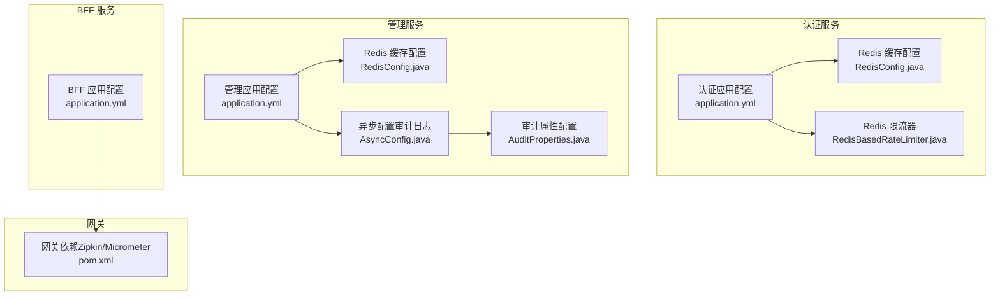
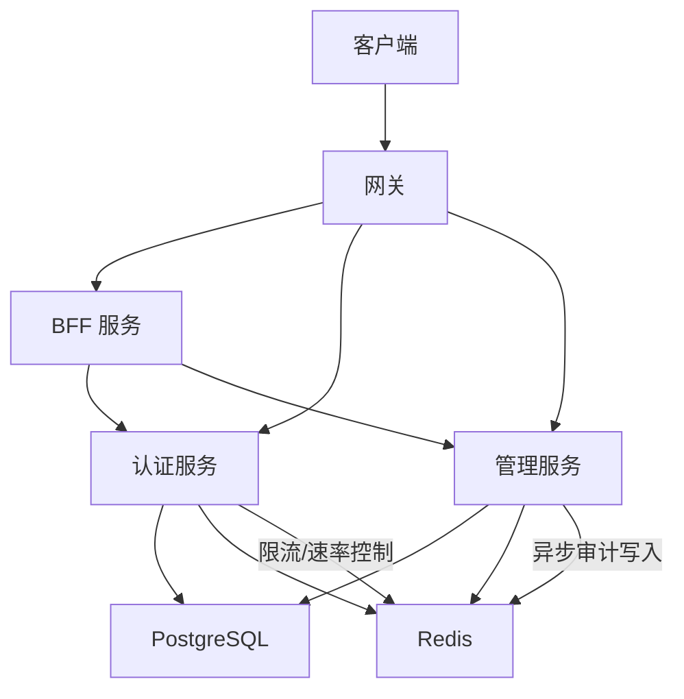
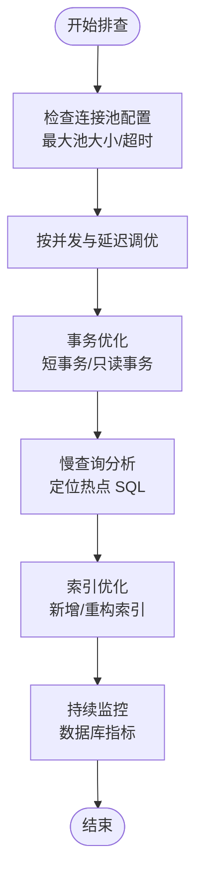
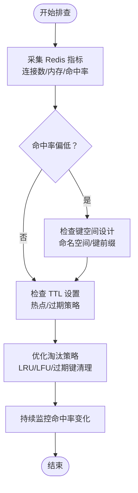
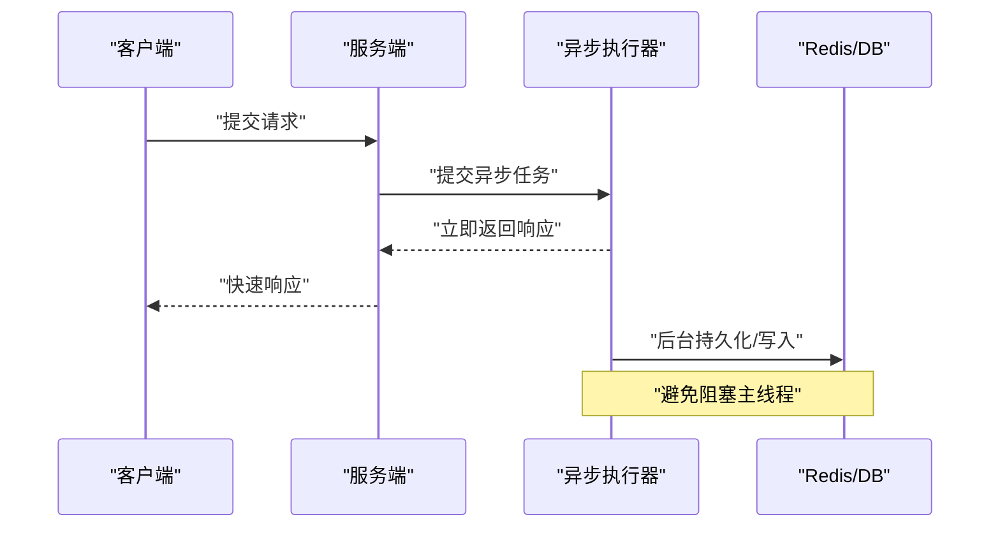
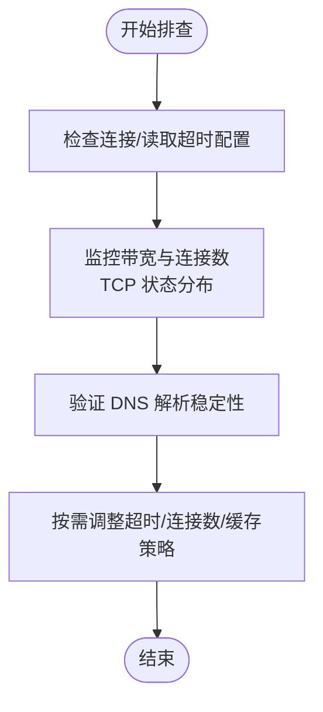
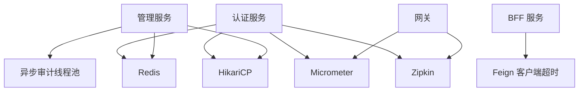

# 性能问题排查

<cite>
**本文引用的文件**
- [application.yml（管理服务）](file://iam-admin-server/src/main/resources/application.yml)
- [application.yml（认证服务）](file://iam-auth-server/src/main/resources/application.yml)
- [application.yml（BFF 服务）](file://iam-bff-server/src/main/resources/application.yml)
- [Redis 配置（管理服务）](file://iam-admin-server/src/main/java/iam/platform/admin/infrastructure/config/RedisConfig.java)
- [Redis 配置（认证服务）](file://iam-auth-server/src/main/java/iam/platform/auth/infrastructure/config/RedisConfig.java)
- [异步配置（审计日志）](file://iam-admin-server/src/main/java/iam/platform/admin/infrastructure/config/AsyncConfig.java)
- [审计属性配置](file://iam-admin-server/src/main/java/iam/platform/admin/infrastructure/config/AuditProperties.java)
- [Redis 限流器](file://iam-auth-server/src/main/java/iam/platform/auth/infrastructure/security/RedisBasedRateLimiter.java)
- [安全策略属性（认证服务）](file://iam-auth-server/src/main/java/iam/platform/auth/infrastructure/config/SecurityPolicyProperties.java)
- [网关 POM 依赖（Zipkin/Micrometer）](file://iam-gateway/pom.xml)
</cite>

## 目录
1. [简介](#简介)
2. [项目结构](#项目结构)
3. [核心组件](#核心组件)
4. [架构总览](#架构总览)
5. [详细组件分析](#详细组件分析)
6. [依赖分析](#依赖分析)
7. [性能注意事项](#性能注意事项)
8. [故障排查指南](#故障排查指南)
9. [结论](#结论)
10. [附录](#附录)

## 简介
本指南面向 IAM 平台的性能问题排查与优化，聚焦以下方面：
- 数据库性能：慢查询分析、索引优化、连接池配置、事务优化
- 缓存性能：Redis 监控、命中率分析、失效策略优化
- 并发问题：线程池配置、锁竞争、异步处理优化
- 网络性能：连接超时、带宽限制、DNS 解析
- 内存使用：内存泄漏检测、GC 优化、堆内存配置
- 系统资源监控：CPU、磁盘 IO、网络流量指标解读

本指南结合代码库中的配置与实现，提供可操作的定位与优化建议。

## 项目结构
IAM 平台采用多模块微服务架构，包含认证、管理、BFF 和网关等模块。各模块通过 Spring Boot 配置文件集中管理数据库、缓存、监控与安全策略；部分模块内置 Redis 缓存与异步执行配置，便于性能调优。

图表来源
- [application.yml（认证服务）:1-144](file://iam-auth-server/src/main/resources/application.yml#L1-L144)
- [Redis 配置（认证服务）:1-36](file://iam-auth-server/src/main/java/iam/platform/auth/infrastructure/config/RedisConfig.java#L1-L36)
- [Redis 限流器:1-124](file://iam-auth-server/src/main/java/iam/platform/auth/infrastructure/security/RedisBasedRateLimiter.java#L1-L124)
- [application.yml（管理服务）:1-102](file://iam-admin-server/src/main/resources/application.yml#L1-L102)
- [Redis 配置（管理服务）:1-30](file://iam-admin-server/src/main/java/iam/platform/admin/infrastructure/config/RedisConfig.java#L1-L30)
- [异步配置（审计日志）:1-31](file://iam-admin-server/src/main/java/iam/platform/admin/infrastructure/config/AsyncConfig.java#L1-L31)
- [审计属性配置:1-37](file://iam-admin-server/src/main/java/iam/platform/admin/infrastructure/config/AuditProperties.java#L1-L37)
- [application.yml（BFF 服务）:1-54](file://iam-bff-server/src/main/resources/application.yml#L1-L54)
- [网关 POM 依赖（Zipkin/Micrometer）:70-105](file://iam-gateway/pom.xml#L70-L105)

章节来源
- [application.yml（管理服务）:1-102](file://iam-admin-server/src/main/resources/application.yml#L1-L102)
- [application.yml（认证服务）:1-144](file://iam-auth-server/src/main/resources/application.yml#L1-L144)
- [application.yml（BFF 服务）:1-54](file://iam-bff-server/src/main/resources/application.yml#L1-L54)

## 核心组件
- 数据库与连接池
  - 认证与管理服务均使用 HikariCP 连接池，可通过最大池大小、最小空闲、连接超时、空闲超时、最大生存时间等参数进行调优。
- 缓存与会话
  - 两服务均启用 Redis 缓存与基于 Redis 的会话存储，支持 JSON 序列化与 TTL 控制。
- 异步与审计
  - 管理服务提供独立的审计日志异步线程池，避免阻塞主业务线程。
- 安全与限流
  - 认证服务使用 Redis 实现滑动窗口限流，具备失败降级能力（Redis 不可用时“放行”）。
- 监控与追踪
  - 各服务开启健康、信息、指标与 Prometheus 端点，并集成 Zipkin 与 Micrometer 进行分布式追踪采样。

章节来源
- [application.yml（管理服务）:15-24](file://iam-admin-server/src/main/resources/application.yml#L15-L24)
- [application.yml（认证服务）:15-24](file://iam-auth-server/src/main/resources/application.yml#L15-L24)
- [Redis 配置（管理服务）:19-28](file://iam-admin-server/src/main/java/iam/platform/admin/infrastructure/config/RedisConfig.java#L19-L28)
- [Redis 配置（认证服务）:20-29](file://iam-auth-server/src/main/java/iam/platform/auth/infrastructure/config/RedisConfig.java#L20-L29)
- [异步配置（审计日志）:18-29](file://iam-admin-server/src/main/java/iam/platform/admin/infrastructure/config/AsyncConfig.java#L18-L29)
- [Redis 限流器:32-67](file://iam-auth-server/src/main/java/iam/platform/auth/infrastructure/security/RedisBasedRateLimiter.java#L32-L67)
- [application.yml（认证服务）:128-143](file://iam-auth-server/src/main/resources/application.yml#L128-L143)
- [application.yml（管理服务）:76-91](file://iam-admin-server/src/main/resources/application.yml#L76-L91)

## 架构总览
下图展示服务间与外部组件的交互，以及性能相关的关键路径（数据库、Redis、限流、异步审计、监控）。

图表来源
- [application.yml（认证服务）:15-37](file://iam-auth-server/src/main/resources/application.yml#L15-L37)
- [application.yml（管理服务）:15-37](file://iam-admin-server/src/main/resources/application.yml#L15-L37)
- [application.yml（BFF 服务）:25-32](file://iam-bff-server/src/main/resources/application.yml#L25-L32)
- [Redis 限流器:14-124](file://iam-auth-server/src/main/java/iam/platform/auth/infrastructure/security/RedisBasedRateLimiter.java#L14-L124)
- [异步配置（审计日志）:11-29](file://iam-admin-server/src/main/java/iam/platform/admin/infrastructure/config/AsyncConfig.java#L11-L29)

## 详细组件分析

### 数据库性能排查
- 连接池配置要点
  - 最大池大小、最小空闲、连接超时、空闲超时、最大生存时间直接影响并发与资源占用。
  - 建议：根据 QPS 与事务持续时间调整最大池大小；设置合理的连接超时避免请求堆积。
- 事务优化
  - 使用只读事务或短事务减少锁持有时间；批量写入合并以降低往返次数。
- 慢查询分析
  - 开启 SQL 日志（生产环境谨慎开启）或使用数据库端慢查询日志工具定位热点 SQL。
  - 结合应用层监控（Prometheus + Grafana）观察数据库指标（连接数、等待事件、吞吐）。
- 索引优化
  - 对高频过滤/排序字段建立合适索引；定期分析表统计信息与索引使用情况。

图表来源
- [application.yml（管理服务）:19-24](file://iam-admin-server/src/main/resources/application.yml#L19-L24)
- [application.yml（认证服务）:19-24](file://iam-auth-server/src/main/resources/application.yml#L19-L24)

章节来源
- [application.yml（管理服务）:15-32](file://iam-admin-server/src/main/resources/application.yml#L15-L32)
- [application.yml（认证服务）:15-32](file://iam-auth-server/src/main/resources/application.yml#L15-L32)

### 缓存性能诊断与优化
- Redis 监控
  - 关注连接数、内存使用、命中率、过期键比例、阻塞命令占比。
  - 利用内置指标端点与外部监控系统（如 Prometheus/Grafana）可视化。
- 命中率分析
  - 低命中率通常由键空间设计不合理、TTL 设置不当或冷数据过多导致。
  - 可通过统计命中率与 QPS 的比值评估缓存效果。
- 失效策略优化
  - 为热点数据设置合理 TTL；对频繁更新的数据采用“写后失效”或“延迟双删”策略。
  - 使用命名空间隔离不同业务域，避免键冲突与误删。
- 序列化与 TTL
  - JSON 序列化体积较大，可考虑二进制序列化或压缩；统一 TTL 策略避免“幽灵数据”。

图表来源
- [Redis 配置（管理服务）:20-28](file://iam-admin-server/src/main/java/iam/platform/admin/infrastructure/config/RedisConfig.java#L20-L28)
- [Redis 配置（认证服务）:20-29](file://iam-auth-server/src/main/java/iam/platform/auth/infrastructure/config/RedisConfig.java#L20-L29)

章节来源
- [Redis 配置（管理服务）:19-28](file://iam-admin-server/src/main/java/iam/platform/admin/infrastructure/config/RedisConfig.java#L19-L28)
- [Redis 配置（认证服务）:20-29](file://iam-auth-server/src/main/java/iam/platform/auth/infrastructure/config/RedisConfig.java#L20-L29)

### 并发问题排查与优化
- 线程池配置
  - 业务线程池：根据 CPU 核数与任务类型（IO 密集/计算密集）设置核心/最大线程数与队列容量。
  - 异步审计线程池：当前配置位于管理服务，核心/最大线程与队列容量需结合审计量与延迟目标调整。
- 锁竞争分析
  - 使用分布式锁或本地锁时，尽量缩短持锁时间与缩小作用域；避免跨模块长事务。
- 异步处理优化
  - 将非关键路径（如审计写入）异步化，避免阻塞主请求链路。
  - 注意拒绝策略：建议采用“调用方执行”策略以保护系统稳定性。

图表来源
- [异步配置（审计日志）:18-29](file://iam-admin-server/src/main/java/iam/platform/admin/infrastructure/config/AsyncConfig.java#L18-L29)
- [审计属性配置:30-35](file://iam-admin-server/src/main/java/iam/platform/admin/infrastructure/config/AuditProperties.java#L30-L35)

章节来源
- [异步配置（审计日志）:11-29](file://iam-admin-server/src/main/java/iam/platform/admin/infrastructure/config/AsyncConfig.java#L11-L29)
- [审计属性配置:25-35](file://iam-admin-server/src/main/java/iam/platform/admin/infrastructure/config/AuditProperties.java#L25-L35)

### 网络性能问题排查
- 连接超时
  - BFF 层面已配置默认连接超时与读取超时，可根据下游服务 SLA 调整。
- 带宽限制
  - 在高并发场景下关注 TCP 连接数、TIME_WAIT 数量与拥塞窗口；必要时调整内核参数与负载均衡策略。
- DNS 解析
  - 使用稳定 DNS 服务或本地缓存；避免频繁解析导致的抖动。

图表来源
- [application.yml（BFF 服务）:26-32](file://iam-bff-server/src/main/resources/application.yml#L26-L32)

章节来源
- [application.yml（BFF 服务）:25-32](file://iam-bff-server/src/main/resources/application.yml#L25-L32)

### 内存使用问题分析
- 内存泄漏检测
  - 使用堆转储与 GC 日志分析对象存活情况；重点关注静态集合、线程本地变量与缓存键生命周期。
- 垃圾回收优化
  - 选择合适的 GC 算法；调整新生代/老年代比例与晋升阈值；避免长时间 GC 暂停。
- 堆内存配置
  - 根据峰值并发与对象分配速率设置堆上限；预留足够空间给元空间与直接内存。

章节来源
- [application.yml（认证服务）:1-144](file://iam-auth-server/src/main/resources/application.yml#L1-L144)
- [application.yml（管理服务）:1-102](file://iam-admin-server/src/main/resources/application.yml#L1-L102)

### 系统资源监控指标解读
- CPU 使用率
  - 关注用户态与内核态占比；异常升高可能由 GC、锁竞争或热点循环引起。
- 磁盘 IO
  - 观察读写延迟与队列长度；数据库 WAL 与缓存刷盘会影响 IO 峰值。
- 网络流量
  - 分析入/出站带宽与连接数；识别异常流量模式（DDoS 或异常重试）。

章节来源
- [application.yml（认证服务）:128-143](file://iam-auth-server/src/main/resources/application.yml#L128-L143)
- [application.yml（管理服务）:76-91](file://iam-admin-server/src/main/resources/application.yml#L76-L91)

## 依赖分析
- 认证服务
  - 使用 HikariCP 连接池与 Redis 缓存；通过限流器实现滑动窗口限流；集成 Zipkin/Micrometer 进行追踪采样。
- 管理服务
  - 同样使用 HikariCP 与 Redis；提供独立异步审计线程池；开启 Prometheus 指标导出。
- BFF 服务
  - 配置 Feign 客户端超时；作为网关后的前端聚合层，承担路由与跨域处理职责。
- 网关
  - 引入 Zipkin 与 Micrometer 依赖，用于分布式追踪与指标收集。

图表来源
- [application.yml（认证服务）:15-24](file://iam-auth-server/src/main/resources/application.yml#L15-L24)
- [application.yml（认证服务）:128-143](file://iam-auth-server/src/main/resources/application.yml#L128-L143)
- [application.yml（管理服务）:15-24](file://iam-admin-server/src/main/resources/application.yml#L15-L24)
- [application.yml（管理服务）:76-91](file://iam-admin-server/src/main/resources/application.yml#L76-L91)
- [application.yml（BFF 服务）:25-32](file://iam-bff-server/src/main/resources/application.yml#L25-L32)
- [网关 POM 依赖（Zipkin/Micrometer）:72-80](file://iam-gateway/pom.xml#L72-L80)

章节来源
- [application.yml（认证服务）:15-24](file://iam-auth-server/src/main/resources/application.yml#L15-L24)
- [application.yml（认证服务）:128-143](file://iam-auth-server/src/main/resources/application.yml#L128-L143)
- [application.yml（管理服务）:15-24](file://iam-admin-server/src/main/resources/application.yml#L15-L24)
- [application.yml（管理服务）:76-91](file://iam-admin-server/src/main/resources/application.yml#L76-L91)
- [application.yml（BFF 服务）:25-32](file://iam-bff-server/src/main/resources/application.yml#L25-L32)
- [网关 POM 依赖（Zipkin/Micrometer）:72-80](file://iam-gateway/pom.xml#L72-L80)

## 性能注意事项
- 生产环境禁用 SQL 日志打印；使用数据库慢查询日志与 APM 工具。
- 缓存键设计遵循“业务域+实体+维度”的层级结构，避免键冲突与扫描。
- 异步任务应具备幂等性与重试机制，防止重复写入与雪崩。
- 限流策略在 Redis 不可用时应“放行”，保障系统可用性。
- 监控与告警联动：对连接池饱和、Redis 命中率下降、GC 暂停时间、网络 RTT 异常设置阈值告警。

## 故障排查指南
- 数据库
  - 现象：连接池耗尽、事务回滚频繁、慢查询增多
  - 排查步骤：检查连接池参数、事务时长、慢查询日志；分析索引使用情况
- 缓存
  - 现象：命中率低、内存增长快、Redis 命令阻塞
  - 排查步骤：查看指标与键空间分布；优化 TTL 与淘汰策略
- 并发
  - 现象：请求排队、线程池饱和、异步任务积压
  - 排查步骤：调整线程池参数与拒绝策略；拆分异步任务粒度
- 网络
  - 现象：超时增多、RTT 上升、连接数异常
  - 排查步骤：检查超时配置、DNS 解析、带宽与连接状态
- 内存
  - 现象：Full GC 频繁、内存泄漏、OOM
  - 排查步骤：分析堆转储与 GC 日志；优化对象生命周期与序列化
- 监控
  - 现象：指标异常波动、告警风暴
  - 排查步骤：确认采样率与标签维度；校准阈值与告警规则

章节来源
- [Redis 限流器:63-67](file://iam-auth-server/src/main/java/iam/platform/auth/infrastructure/security/RedisBasedRateLimiter.java#L63-L67)
- [异步配置（审计日志）:26-27](file://iam-admin-server/src/main/java/iam/platform/admin/infrastructure/config/AsyncConfig.java#L26-L27)
- [application.yml（BFF 服务）:30-31](file://iam-bff-server/src/main/resources/application.yml#L30-L31)

## 结论
通过结合连接池、缓存、异步与限流等关键组件的配置与实现，配合完善的监控与追踪体系，可以系统性地定位与缓解 IAM 平台的性能瓶颈。建议在灰度环境中逐步验证优化方案，并持续观测关键指标以确保稳定性与可扩展性。

## 附录
- 快速检查清单
  - 数据库：连接池参数、慢查询、索引覆盖率
  - 缓存：命中率、TTL、键空间设计
  - 并发：线程池参数、拒绝策略、异步任务
  - 网络：超时配置、DNS、带宽
  - 内存：GC 日志、堆转储、对象生命周期
  - 监控：指标维度、采样率、告警阈值