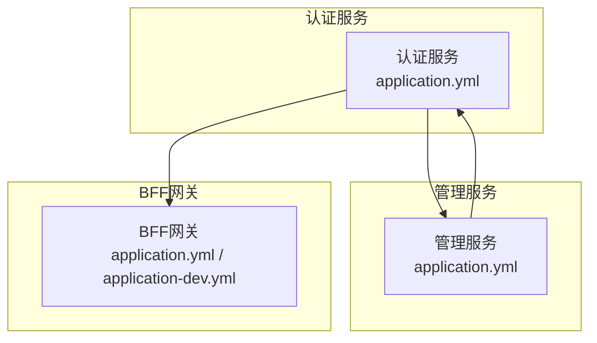
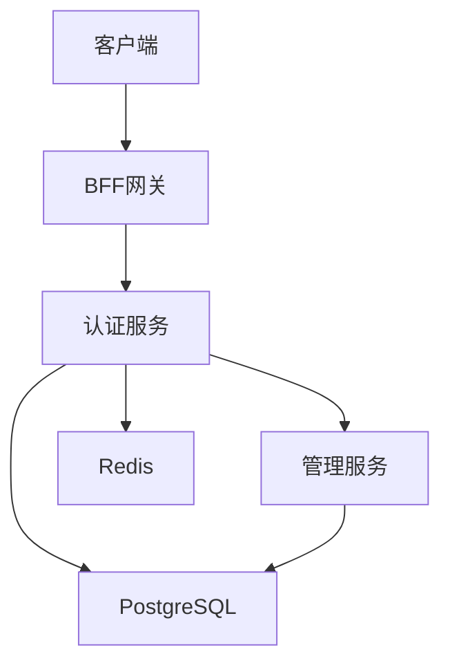
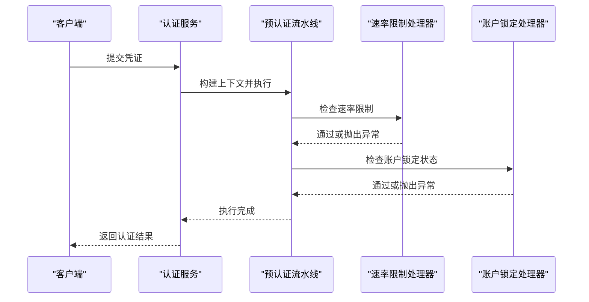
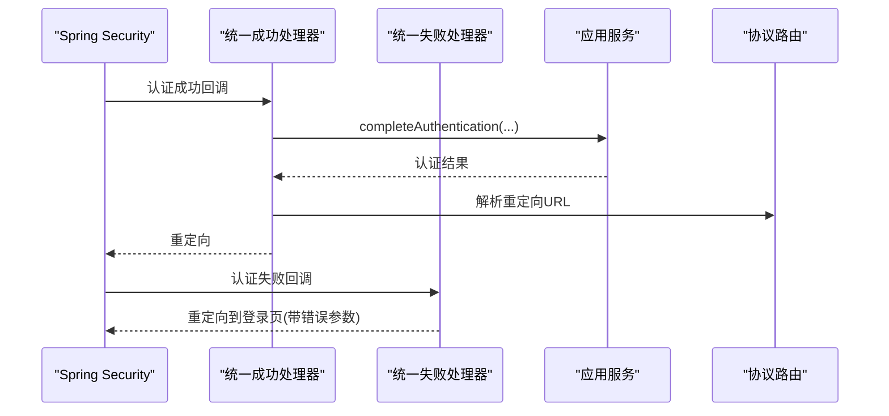
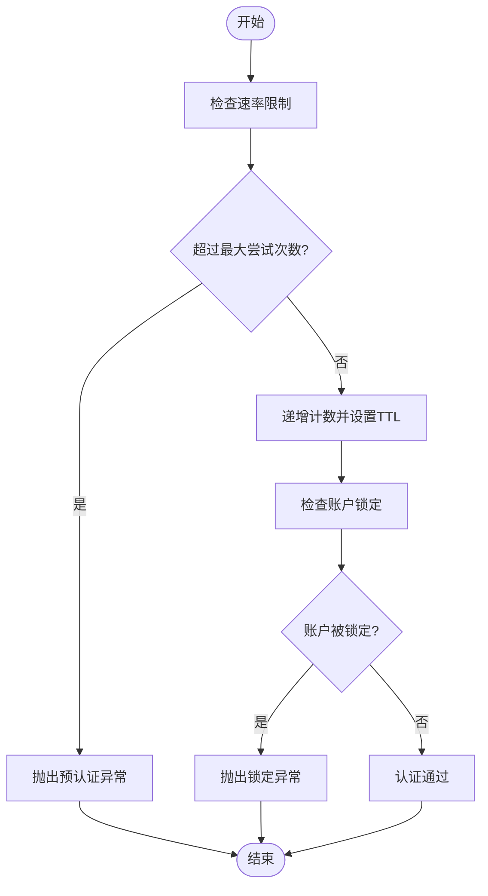
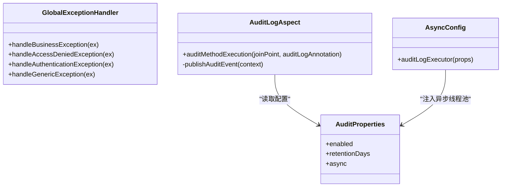
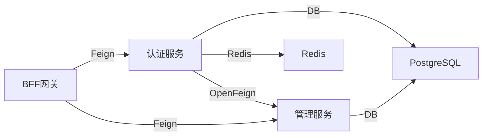

# 故障排除

<cite>
**本文引用的文件**
- [iam-admin-server/src/main/java/iam/platform/admin/interfaces/rest/common/GlobalExceptionHandler.java](file://iam-admin-server/src/main/java/iam/platform/admin/interfaces/rest/common/GlobalExceptionHandler.java)
- [iam-auth-server/src/main/java/iam/platform/auth/application/service/pipeline/PreAuthenticationPipeline.java](file://iam-auth-server/src/main/java/iam/platform/auth/application/service/pipeline/PreAuthenticationPipeline.java)
- [iam-auth-server/src/main/java/iam/platform/auth/application/service/pipeline/PostAuthenticationPipeline.java](file://iam-auth-server/src/main/java/iam/platform/auth/application/service/pipeline/PostAuthenticationPipeline.java)
- [iam-auth-server/src/main/java/iam/platform/auth/infrastructure/security/UnifiedAuthenticationFailureHandler.java](file://iam-auth-server/src/main/java/iam/platform/auth/infrastructure/security/UnifiedAuthenticationFailureHandler.java)
- [iam-auth-server/src/main/java/iam/platform/auth/infrastructure/security/UnifiedAuthenticationSuccessHandler.java](file://iam-auth-server/src/main/java/iam/platform/auth/infrastructure/security/UnifiedAuthenticationSuccessHandler.java)
- [iam-auth-server/src/main/java/iam/platform/auth/infrastructure/security/RedisBasedRateLimiter.java](file://iam-auth-server/src/main/java/iam/platform/auth/infrastructure/security/RedisBasedRateLimiter.java)
- [iam-auth-server/src/main/java/iam/platform/auth/application/service/pipeline/RateLimitHandler.java](file://iam-auth-server/src/main/java/iam/platform/auth/application/service/pipeline/RateLimitHandler.java)
- [iam-auth-server/src/main/java/iam/platform/auth/application/service/pipeline/AccountLockoutHandler.java](file://iam-auth-server/src/main/java/iam/platform/auth/application/service/pipeline/AccountLockoutHandler.java)
- [iam-auth-server/src/main/java/iam/platform/auth/infrastructure/config/SecurityPolicyProperties.java](file://iam-auth-server/src/main/java/iam/platform/auth/infrastructure/config/SecurityPolicyProperties.java)
- [iam-admin-server/src/main/resources/application.yml](file://iam-admin-server/src/main/resources/application.yml)
- [iam-auth-server/src/main/resources/application.yml](file://iam-auth-server/src/main/resources/application.yml)
- [iam-bff-server/src/main/resources/application.yml](file://iam-bff-server/src/main/resources/application.yml)
- [iam-bff-server/src/main/resources/application-dev.yml](file://iam-bff-server/src/main/resources/application-dev.yml)
- [iam-admin-server/src/main/java/iam/platform/admin/infrastructure/aspect/AuditLogAspect.java](file://iam-admin-server/src/main/java/iam/platform/admin/infrastructure/aspect/AuditLogAspect.java)
- [iam-admin-server/src/main/java/iam/platform/admin/infrastructure/config/AuditProperties.java](file://iam-admin-server/src/main/java/iam/platform/admin/infrastructure/config/AuditProperties.java)
- [iam-admin-server/src/main/java/iam/platform/admin/infrastructure/config/AsyncConfig.java](file://iam-admin-server/src/main/java/iam/platform/admin/infrastructure/config/AsyncConfig.java)
</cite>

## 目录
1. 引言
2. 项目结构
3. 核心组件
4. 架构总览
5. 详细组件分析
6. 依赖分析
7. 性能考虑
8. 故障排除指南
9. 结论
10. 附录

## 引言
本指南面向运维与开发人员，围绕IAM平台在认证失败、权限拒绝、服务不可用、性能瓶颈、安全风险（暴力破解、会话劫持、权限提升）、网络与数据库连接异常以及第三方服务集成问题等场景，提供系统化的诊断与处置流程。文档同时覆盖日志分析方法（级别、关键信息、聚合）、性能诊断工具与技术、调试技巧与开发工具使用、问题报告与反馈机制，以及应急响应与升级流程。

## 项目结构
IAM平台采用多模块微服务架构，核心服务包括认证服务、管理服务、BFF网关与安全策略组件。各服务通过配置文件集中管理运行参数、安全策略与监控指标，并通过统一的审计与异常处理机制保障可观测性与可维护性。

图表来源
- [iam-auth-server/src/main/resources/application.yml:1-144](file://iam-auth-server/src/main/resources/application.yml#L1-L144)
- [iam-admin-server/src/main/resources/application.yml:1-102](file://iam-admin-server/src/main/resources/application.yml#L1-L102)
- [iam-bff-server/src/main/resources/application.yml:1-54](file://iam-bff-server/src/main/resources/application.yml#L1-L54)

章节来源
- [iam-auth-server/src/main/resources/application.yml:1-144](file://iam-auth-server/src/main/resources/application.yml#L1-L144)
- [iam-admin-server/src/main/resources/application.yml:1-102](file://iam-admin-server/src/main/resources/application.yml#L1-L102)
- [iam-bff-server/src/main/resources/application.yml:1-54](file://iam-bff-server/src/main/resources/application.yml#L1-L54)

## 核心组件
- 认证流水线：预认证与后认证处理器链，负责速率限制、账户锁定、审计事件记录与结果收敛。
- 统一认证成功/失败处理器：统一会话与重定向行为，触发后认证处理与协议路由。
- 安全策略配置：速率限制、账户锁定阈值与窗口、IP白名单/黑名单等。
- 全局异常处理：REST接口统一错误响应与日志输出。
- 审计日志：基于AOP的异步审计事件发布与落库。
- 监控与追踪：Prometheus指标、Zipkin链路追踪、健康检查端点。

章节来源
- [iam-auth-server/src/main/java/iam/platform/auth/application/service/pipeline/PreAuthenticationPipeline.java:1-61](file://iam-auth-server/src/main/java/iam/platform/auth/application/service/pipeline/PreAuthenticationPipeline.java#L1-L61)
- [iam-auth-server/src/main/java/iam/platform/auth/application/service/pipeline/PostAuthenticationPipeline.java:1-31](file://iam-auth-server/src/main/java/iam/platform/auth/application/service/pipeline/PostAuthenticationPipeline.java#L1-L31)
- [iam-auth-server/src/main/java/iam/platform/auth/infrastructure/security/UnifiedAuthenticationSuccessHandler.java:1-68](file://iam-auth-server/src/main/java/iam/platform/auth/infrastructure/security/UnifiedAuthenticationSuccessHandler.java#L1-L68)
- [iam-auth-server/src/main/java/iam/platform/auth/infrastructure/security/UnifiedAuthenticationFailureHandler.java:1-37](file://iam-auth-server/src/main/java/iam/platform/auth/infrastructure/security/UnifiedAuthenticationFailureHandler.java#L1-L37)
- [iam-auth-server/src/main/java/iam/platform/auth/infrastructure/config/SecurityPolicyProperties.java:1-37](file://iam-auth-server/src/main/java/iam/platform/auth/infrastructure/config/SecurityPolicyProperties.java#L1-L37)
- [iam-admin-server/src/main/java/iam/platform/admin/interfaces/rest/common/GlobalExceptionHandler.java:1-101](file://iam-admin-server/src/main/java/iam/platform/admin/interfaces/rest/common/GlobalExceptionHandler.java#L1-L101)
- [iam-admin-server/src/main/java/iam/platform/admin/infrastructure/aspect/AuditLogAspect.java:1-66](file://iam-admin-server/src/main/java/iam/platform/admin/infrastructure/aspect/AuditLogAspect.java#L1-L66)
- [iam-admin-server/src/main/java/iam/platform/admin/infrastructure/config/AuditProperties.java:1-37](file://iam-admin-server/src/main/java/iam/platform/admin/infrastructure/config/AuditProperties.java#L1-L37)
- [iam-admin-server/src/main/java/iam/platform/admin/infrastructure/config/AsyncConfig.java:1-30](file://iam-admin-server/src/main/java/iam/platform/admin/infrastructure/config/AsyncConfig.java#L1-L30)

## 架构总览
下图展示认证服务与管理/BFF服务之间的交互，以及安全策略与审计、异常处理的关键节点。

图表来源
- [iam-auth-server/src/main/resources/application.yml:15-37](file://iam-auth-server/src/main/resources/application.yml#L15-L37)
- [iam-admin-server/src/main/resources/application.yml:15-37](file://iam-admin-server/src/main/resources/application.yml#L15-L37)
- [iam-bff-server/src/main/resources/application.yml:15-23](file://iam-bff-server/src/main/resources/application.yml#L15-L23)

## 详细组件分析

### 预认证与后认证流水线
- 预认证流水线按顺序执行多个处理器，支持记录失败/成功以驱动速率限制与账户锁定。
- 后认证流水线汇聚认证结果并生成最终返回对象，供统一成功处理器进行协议路由与重定向。

图表来源
- [iam-auth-server/src/main/java/iam/platform/auth/application/service/pipeline/PreAuthenticationPipeline.java:26-60](file://iam-auth-server/src/main/java/iam/platform/auth/application/service/pipeline/PreAuthenticationPipeline.java#L26-L60)
- [iam-auth-server/src/main/java/iam/platform/auth/application/service/pipeline/RateLimitHandler.java:1-42](file://iam-auth-server/src/main/java/iam/platform/auth/application/service/pipeline/RateLimitHandler.java#L1-L42)
- [iam-auth-server/src/main/java/iam/platform/auth/application/service/pipeline/AccountLockoutHandler.java:1-42](file://iam-auth-server/src/main/java/iam/platform/auth/application/service/pipeline/AccountLockoutHandler.java#L1-L42)

章节来源
- [iam-auth-server/src/main/java/iam/platform/auth/application/service/pipeline/PreAuthenticationPipeline.java:1-61](file://iam-auth-server/src/main/java/iam/platform/auth/application/service/pipeline/PreAuthenticationPipeline.java#L1-L61)
- [iam-auth-server/src/main/java/iam/platform/auth/application/service/pipeline/PostAuthenticationPipeline.java:1-31](file://iam-auth-server/src/main/java/iam/platform/auth/application/service/pipeline/PostAuthenticationPipeline.java#L1-L31)

### 统一认证成功/失败处理器
- 成功处理器：根据认证类型提取用户与认证方式，执行后认证流水线，再由协议路由器决定重定向地址。
- 失败处理器：统一记录失败并重定向到登录页带错误参数，保证用户体验与可观测性。

图表来源
- [iam-auth-server/src/main/java/iam/platform/auth/infrastructure/security/UnifiedAuthenticationSuccessHandler.java:35-66](file://iam-auth-server/src/main/java/iam/platform/auth/infrastructure/security/UnifiedAuthenticationSuccessHandler.java#L35-L66)
- [iam-auth-server/src/main/java/iam/platform/auth/infrastructure/security/UnifiedAuthenticationFailureHandler.java:21-35](file://iam-auth-server/src/main/java/iam/platform/auth/infrastructure/security/UnifiedAuthenticationFailureHandler.java#L21-L35)

章节来源
- [iam-auth-server/src/main/java/iam/platform/auth/infrastructure/security/UnifiedAuthenticationSuccessHandler.java:1-68](file://iam-auth-server/src/main/java/iam/platform/auth/infrastructure/security/UnifiedAuthenticationSuccessHandler.java#L1-L68)
- [iam-auth-server/src/main/java/iam/platform/auth/infrastructure/security/UnifiedAuthenticationFailureHandler.java:1-37](file://iam-auth-server/src/main/java/iam/platform/auth/infrastructure/security/UnifiedAuthenticationFailureHandler.java#L1-L37)

### 速率限制与账户锁定
- 速率限制：基于Redis滑动窗口计数，超限则抛出预认证异常；失败/成功分别记录与重置。
- 账户锁定：基于失败次数阈值与锁定时长，防止暴力破解。
- 策略配置：集中于安全策略属性，支持启用/禁用与阈值调整。

图表来源
- [iam-auth-server/src/main/java/iam/platform/auth/infrastructure/security/RedisBasedRateLimiter.java:32-67](file://iam-auth-server/src/main/java/iam/platform/auth/infrastructure/security/RedisBasedRateLimiter.java#L32-L67)
- [iam-auth-server/src/main/java/iam/platform/auth/application/service/pipeline/RateLimitHandler.java:18-26](file://iam-auth-server/src/main/java/iam/platform/auth/application/service/pipeline/RateLimitHandler.java#L18-L26)
- [iam-auth-server/src/main/java/iam/platform/auth/application/service/pipeline/AccountLockoutHandler.java:18-26](file://iam-auth-server/src/main/java/iam/platform/auth/application/service/pipeline/AccountLockoutHandler.java#L18-L26)
- [iam-auth-server/src/main/java/iam/platform/auth/infrastructure/config/SecurityPolicyProperties.java:24-35](file://iam-auth-server/src/main/java/iam/platform/auth/infrastructure/config/SecurityPolicyProperties.java#L24-L35)

章节来源
- [iam-auth-server/src/main/java/iam/platform/auth/infrastructure/security/RedisBasedRateLimiter.java:1-124](file://iam-auth-server/src/main/java/iam/platform/auth/infrastructure/security/RedisBasedRateLimiter.java#L1-L124)
- [iam-auth-server/src/main/java/iam/platform/auth/application/service/pipeline/RateLimitHandler.java:1-42](file://iam-auth-server/src/main/java/iam/platform/auth/application/service/pipeline/RateLimitHandler.java#L1-L42)
- [iam-auth-server/src/main/java/iam/platform/auth/application/service/pipeline/AccountLockoutHandler.java:1-42](file://iam-auth-server/src/main/java/iam/platform/auth/application/service/pipeline/AccountLockoutHandler.java#L1-L42)
- [iam-auth-server/src/main/java/iam/platform/auth/infrastructure/config/SecurityPolicyProperties.java:1-37](file://iam-auth-server/src/main/java/iam/platform/auth/infrastructure/config/SecurityPolicyProperties.java#L1-L37)

### 全局异常处理与审计日志
- 全局异常处理器：对业务异常、访问拒绝、认证失败、资源不存在等进行统一响应与日志记录。
- 审计切面：拦截标注了审计注解的方法，在方法前后记录执行结果与错误信息，并异步发布事件。

图表来源
- [iam-admin-server/src/main/java/iam/platform/admin/interfaces/rest/common/GlobalExceptionHandler.java:24-99](file://iam-admin-server/src/main/java/iam/platform/admin/interfaces/rest/common/GlobalExceptionHandler.java#L24-L99)
- [iam-admin-server/src/main/java/iam/platform/admin/infrastructure/aspect/AuditLogAspect.java:27-58](file://iam-admin-server/src/main/java/iam/platform/admin/infrastructure/aspect/AuditLogAspect.java#L27-L58)
- [iam-admin-server/src/main/java/iam/platform/admin/infrastructure/config/AuditProperties.java:13-36](file://iam-admin-server/src/main/java/iam/platform/admin/infrastructure/config/AuditProperties.java#L13-L36)
- [iam-admin-server/src/main/java/iam/platform/admin/infrastructure/config/AsyncConfig.java:18-29](file://iam-admin-server/src/main/java/iam/platform/admin/infrastructure/config/AsyncConfig.java#L18-L29)

章节来源
- [iam-admin-server/src/main/java/iam/platform/admin/interfaces/rest/common/GlobalExceptionHandler.java:1-101](file://iam-admin-server/src/main/java/iam/platform/admin/interfaces/rest/common/GlobalExceptionHandler.java#L1-L101)
- [iam-admin-server/src/main/java/iam/platform/admin/infrastructure/aspect/AuditLogAspect.java:1-66](file://iam-admin-server/src/main/java/iam/platform/admin/infrastructure/aspect/AuditLogAspect.java#L1-L66)
- [iam-admin-server/src/main/java/iam/platform/admin/infrastructure/config/AuditProperties.java:1-37](file://iam-admin-server/src/main/java/iam/platform/admin/infrastructure/config/AuditProperties.java#L1-L37)
- [iam-admin-server/src/main/java/iam/platform/admin/infrastructure/config/AsyncConfig.java:1-30](file://iam-admin-server/src/main/java/iam/platform/admin/infrastructure/config/AsyncConfig.java#L1-L30)

## 依赖分析
- 认证服务依赖Redis用于速率限制与会话存储，依赖PostgreSQL持久化数据；通过OpenFeign调用管理服务。
- 管理服务依赖PostgreSQL与Redis，启用异步审计线程池，暴露监控端点。
- BFF网关注入Feign客户端超时配置，便于定位第三方服务集成问题。

图表来源
- [iam-auth-server/src/main/resources/application.yml:15-37](file://iam-auth-server/src/main/resources/application.yml#L15-L37)
- [iam-admin-server/src/main/resources/application.yml:15-37](file://iam-admin-server/src/main/resources/application.yml#L15-L37)
- [iam-bff-server/src/main/resources/application.yml:25-32](file://iam-bff-server/src/main/resources/application.yml#L25-L32)

章节来源
- [iam-auth-server/src/main/resources/application.yml:1-144](file://iam-auth-server/src/main/resources/application.yml#L1-L144)
- [iam-admin-server/src/main/resources/application.yml:1-102](file://iam-admin-server/src/main/resources/application.yml#L1-L102)
- [iam-bff-server/src/main/resources/application.yml:1-54](file://iam-bff-server/src/main/resources/application.yml#L1-L54)

## 性能考虑
- 指标与追踪
  - Prometheus指标与Zipkin链路追踪已启用，建议结合Grafana进行可视化监控。
  - 可通过管理端点查看健康、指标与Prometheus导出数据。
- 数据库连接池
  - HikariCP连接池参数已在配置中设定，建议结合慢查询日志与连接池指标进行优化。
- 缓存与会话
  - Redis作为会话与速率限制缓存，需关注键空间命中率与过期策略。
- 异步审计
  - 审计日志异步写入，线程池参数可按吞吐量调整，避免阻塞主业务线程。

章节来源
- [iam-auth-server/src/main/resources/application.yml:128-144](file://iam-auth-server/src/main/resources/application.yml#L128-L144)
- [iam-admin-server/src/main/resources/application.yml:76-92](file://iam-admin-server/src/main/resources/application.yml#L76-L92)
- [iam-admin-server/src/main/java/iam/platform/admin/infrastructure/config/AsyncConfig.java:18-29](file://iam-admin-server/src/main/java/iam/platform/admin/infrastructure/config/AsyncConfig.java#L18-L29)

## 故障排除指南

### 一、认证失败类问题
- 现象
  - 用户登录失败，页面提示未授权或禁止访问。
- 快速定位
  - 查看统一失败处理器日志与全局异常处理日志，确认是否触发速率限制或账户锁定。
  - 检查安全策略配置中的速率限制与账户锁定阈值。
- 处置步骤
  - 若为速率限制触发：等待窗口期或临时放宽策略；检查Redis可用性与键空间。
  - 若为账户锁定：确认锁定阈值与持续时间；必要时人工解锁或临时禁用锁定策略。
  - 若为凭据错误：核对用户名/密码或第三方登录回调参数。
- 参考路径
  - [统一认证失败处理器:21-35](file://iam-auth-server/src/main/java/iam/platform/auth/infrastructure/security/UnifiedAuthenticationFailureHandler.java#L21-L35)
  - [全局异常处理:52-58](file://iam-admin-server/src/main/java/iam/platform/admin/interfaces/rest/common/GlobalExceptionHandler.java#L52-L58)
  - [速率限制处理器:18-26](file://iam-auth-server/src/main/java/iam/platform/auth/application/service/pipeline/RateLimitHandler.java#L18-L26)
  - [账户锁定处理器:18-26](file://iam-auth-server/src/main/java/iam/platform/auth/application/service/pipeline/AccountLockoutHandler.java#L18-L26)
  - [安全策略配置:24-35](file://iam-auth-server/src/main/java/iam/platform/auth/infrastructure/config/SecurityPolicyProperties.java#L24-L35)

章节来源
- [iam-auth-server/src/main/java/iam/platform/auth/infrastructure/security/UnifiedAuthenticationFailureHandler.java:1-37](file://iam-auth-server/src/main/java/iam/platform/auth/infrastructure/security/UnifiedAuthenticationFailureHandler.java#L1-L37)
- [iam-admin-server/src/main/java/iam/platform/admin/interfaces/rest/common/GlobalExceptionHandler.java:52-58](file://iam-admin-server/src/main/java/iam/platform/admin/interfaces/rest/common/GlobalExceptionHandler.java#L52-L58)
- [iam-auth-server/src/main/java/iam/platform/auth/application/service/pipeline/RateLimitHandler.java:1-42](file://iam-auth-server/src/main/java/iam/platform/auth/application/service/pipeline/RateLimitHandler.java#L1-L42)
- [iam-auth-server/src/main/java/iam/platform/auth/application/service/pipeline/AccountLockoutHandler.java:1-42](file://iam-auth-server/src/main/java/iam/platform/auth/application/service/pipeline/AccountLockoutHandler.java#L1-L42)
- [iam-auth-server/src/main/java/iam/platform/auth/infrastructure/config/SecurityPolicyProperties.java:1-37](file://iam-auth-server/src/main/java/iam/platform/auth/infrastructure/config/SecurityPolicyProperties.java#L1-L37)

### 二、权限拒绝类问题
- 现象
  - 返回403 Forbidden，提示权限不足。
- 快速定位
  - 全局异常处理会记录访问拒绝日志；检查控制器层权限注解与领域权限评估逻辑。
- 处置步骤
  - 核对用户角色与资源权限映射；检查租户上下文与拦截器是否正确传递。
  - 如为业务权限校验失败，查看业务异常码与HTTP状态码映射。
- 参考路径
  - [全局异常处理:44-50](file://iam-admin-server/src/main/java/iam/platform/admin/interfaces/rest/common/GlobalExceptionHandler.java#L44-L50)

章节来源
- [iam-admin-server/src/main/java/iam/platform/admin/interfaces/rest/common/GlobalExceptionHandler.java:44-50](file://iam-admin-server/src/main/java/iam/platform/admin/interfaces/rest/common/GlobalExceptionHandler.java#L44-L50)

### 三、服务不可用类问题
- 现象
  - 接口500或下游服务超时。
- 快速定位
  - 检查管理端点健康与指标；确认认证/管理/BFF服务进程状态。
  - 对照Feign客户端超时配置，判断是否为第三方服务响应慢。
- 处置步骤
  - 重启异常实例；扩大超时阈值或增加重试策略；检查下游服务可用性与限流策略。
- 参考路径
  - [BFF Feign配置:25-32](file://iam-bff-server/src/main/resources/application.yml#L25-L32)
  - [认证服务管理端点:128-144](file://iam-auth-server/src/main/resources/application.yml#L128-L144)
  - [管理服务管理端点:76-92](file://iam-admin-server/src/main/resources/application.yml#L76-L92)

章节来源
- [iam-bff-server/src/main/resources/application.yml:25-32](file://iam-bff-server/src/main/resources/application.yml#L25-L32)
- [iam-auth-server/src/main/resources/application.yml:128-144](file://iam-auth-server/src/main/resources/application.yml#L128-L144)
- [iam-admin-server/src/main/resources/application.yml:76-92](file://iam-admin-server/src/main/resources/application.yml#L76-L92)

### 四、日志分析方法
- 日志级别
  - 开发环境可开启更详细的日志级别以辅助定位；生产环境建议保持INFO或WARN以降低开销。
- 关键日志信息
  - 认证失败/成功、速率限制触发、账户锁定、访问拒绝、业务异常码、数据库连接超时、Redis操作异常。
- 日志聚合
  - 使用集中式日志系统收集各服务日志，结合Trace ID串联请求链路，定位问题根因。
- 参考路径
  - [BFF开发环境日志级别:1-9](file://iam-bff-server/src/main/resources/application-dev.yml#L1-L9)
  - [全局异常处理日志:24-99](file://iam-admin-server/src/main/java/iam/platform/admin/interfaces/rest/common/GlobalExceptionHandler.java#L24-L99)
  - [统一成功/失败处理器日志:35-66](file://iam-auth-server/src/main/java/iam/platform/auth/infrastructure/security/UnifiedAuthenticationSuccessHandler.java#L35-L66)
  - [速率限制Redis操作日志:63-107](file://iam-auth-server/src/main/java/iam/platform/auth/infrastructure/security/RedisBasedRateLimiter.java#L63-L107)

章节来源
- [iam-bff-server/src/main/resources/application-dev.yml:1-9](file://iam-bff-server/src/main/resources/application-dev.yml#L1-L9)
- [iam-admin-server/src/main/java/iam/platform/admin/interfaces/rest/common/GlobalExceptionHandler.java:24-99](file://iam-admin-server/src/main/java/iam/platform/admin/interfaces/rest/common/GlobalExceptionHandler.java#L24-L99)
- [iam-auth-server/src/main/java/iam/platform/auth/infrastructure/security/UnifiedAuthenticationSuccessHandler.java:35-66](file://iam-auth-server/src/main/java/iam/platform/auth/infrastructure/security/UnifiedAuthenticationSuccessHandler.java#L35-L66)
- [iam-auth-server/src/main/java/iam/platform/auth/infrastructure/security/RedisBasedRateLimiter.java:63-107](file://iam-auth-server/src/main/java/iam/platform/auth/infrastructure/security/RedisBasedRateLimiter.java#L63-L107)

### 五、性能问题诊断
- 慢查询分析
  - 启用数据库慢查询日志，结合事务耗时与连接池指标定位热点SQL。
- 内存使用监控
  - 观察堆外内存与Redis内存占用，排查连接泄漏与缓存膨胀。
- 并发问题排查
  - 检查线程池队列长度与拒绝策略；评估异步审计线程池容量。
- 参考路径
  - [HikariCP连接池配置:19-24](file://iam-auth-server/src/main/resources/application.yml#L19-L24)
  - [异步审计线程池配置:18-29](file://iam-admin-server/src/main/java/iam/platform/admin/infrastructure/config/AsyncConfig.java#L18-L29)

章节来源
- [iam-auth-server/src/main/resources/application.yml:19-24](file://iam-auth-server/src/main/resources/application.yml#L19-L24)
- [iam-admin-server/src/main/java/iam/platform/admin/infrastructure/config/AsyncConfig.java:18-29](file://iam-admin-server/src/main/java/iam/platform/admin/infrastructure/config/AsyncConfig.java#L18-L29)

### 六、安全相关问题
- 暴力破解防护
  - 通过速率限制与账户锁定策略降低风险；必要时启用IP白名单/黑名单。
- 会话劫持检测
  - 校验会话来源IP与User-Agent；启用HTTPS与安全Cookie属性。
- 权限提升尝试
  - 严格权限注解与后认证审计；对异常登录地点与设备进行告警。
- 参考路径
  - [速率限制Redis实现:32-67](file://iam-auth-server/src/main/java/iam/platform/auth/infrastructure/security/RedisBasedRateLimiter.java#L32-L67)
  - [账户锁定处理器:18-26](file://iam-auth-server/src/main/java/iam/platform/auth/application/service/pipeline/AccountLockoutHandler.java#L18-L26)
  - [安全策略配置:24-35](file://iam-auth-server/src/main/java/iam/platform/auth/infrastructure/config/SecurityPolicyProperties.java#L24-L35)

章节来源
- [iam-auth-server/src/main/java/iam/platform/auth/infrastructure/security/RedisBasedRateLimiter.java:1-124](file://iam-auth-server/src/main/java/iam/platform/auth/infrastructure/security/RedisBasedRateLimiter.java#L1-L124)
- [iam-auth-server/src/main/java/iam/platform/auth/application/service/pipeline/AccountLockoutHandler.java:1-42](file://iam-auth-server/src/main/java/iam/platform/auth/application/service/pipeline/AccountLockoutHandler.java#L1-L42)
- [iam-auth-server/src/main/java/iam/platform/auth/infrastructure/config/SecurityPolicyProperties.java:1-37](file://iam-auth-server/src/main/java/iam/platform/auth/infrastructure/config/SecurityPolicyProperties.java#L1-L37)

### 七、网络与数据库连接问题
- 网络连接
  - 检查服务间DNS解析、防火墙策略与TLS证书；验证重定向URL与回调地址。
- 数据库连接
  - 核对连接串、凭据与网络连通性；观察连接池状态与超时时间。
- 第三方服务集成
  - 根据BFF的Feign超时配置定位上游服务响应慢或不可达问题。
- 参考路径
  - [认证服务数据库与Redis配置:15-37](file://iam-auth-server/src/main/resources/application.yml#L15-L37)
  - [管理服务数据库与Redis配置:15-37](file://iam-admin-server/src/main/resources/application.yml#L15-L37)
  - [BFF Feign超时配置:25-32](file://iam-bff-server/src/main/resources/application.yml#L25-L32)

章节来源
- [iam-auth-server/src/main/resources/application.yml:15-37](file://iam-auth-server/src/main/resources/application.yml#L15-L37)
- [iam-admin-server/src/main/resources/application.yml:15-37](file://iam-admin-server/src/main/resources/application.yml#L15-L37)
- [iam-bff-server/src/main/resources/application.yml:25-32](file://iam-bff-server/src/main/resources/application.yml#L25-L32)

### 八、调试技巧与开发工具
- 开启DEBUG日志：在开发环境提高日志级别，便于快速定位问题。
- 使用管理端点：通过health、info、metrics、prometheus端点获取服务状态与指标。
- 链路追踪：结合Zipkin查看跨服务调用链，定位延迟与异常节点。
- 参考路径
  - [BFF开发环境日志级别:1-9](file://iam-bff-server/src/main/resources/application-dev.yml#L1-L9)
  - [认证服务管理端点:128-144](file://iam-auth-server/src/main/resources/application.yml#L128-L144)
  - [管理服务管理端点:76-92](file://iam-admin-server/src/main/resources/application.yml#L76-L92)

章节来源
- [iam-bff-server/src/main/resources/application-dev.yml:1-9](file://iam-bff-server/src/main/resources/application-dev.yml#L1-L9)
- [iam-auth-server/src/main/resources/application.yml:128-144](file://iam-auth-server/src/main/resources/application.yml#L128-L144)
- [iam-admin-server/src/main/resources/application.yml:76-92](file://iam-admin-server/src/main/resources/application.yml#L76-L92)

### 九、问题报告与反馈机制
- 问题分类
  - 认证失败、权限拒绝、服务不可用、性能瓶颈、安全风险、网络/数据库/第三方集成问题。
- 优先级评估
  - P0：影响所有用户或核心功能；P1：影响关键租户；P2：影响部分用户；P3：一般问题。
- 解决跟踪
  - 建议使用工单系统记录问题、分配责任人、跟踪进度与复盘。
- 参考路径
  - [全局异常处理统一响应:24-99](file://iam-admin-server/src/main/java/iam/platform/admin/interfaces/rest/common/GlobalExceptionHandler.java#L24-L99)
  - [审计事件发布:50-58](file://iam-admin-server/src/main/java/iam/platform/admin/infrastructure/aspect/AuditLogAspect.java#L50-L58)

章节来源
- [iam-admin-server/src/main/java/iam/platform/admin/interfaces/rest/common/GlobalExceptionHandler.java:24-99](file://iam-admin-server/src/main/java/iam/platform/admin/interfaces/rest/common/GlobalExceptionHandler.java#L24-L99)
- [iam-admin-server/src/main/java/iam/platform/admin/infrastructure/aspect/AuditLogAspect.java:50-58](file://iam-admin-server/src/main/java/iam/platform/admin/infrastructure/aspect/AuditLogAspect.java#L50-L58)

### 十、应急响应流程与升级机制
- 应急响应
  - 快速隔离问题范围（服务、租户、区域）；回滚变更；临时放宽安全策略以恢复服务。
- 升级机制
  - P0/P1问题立即升级至值班负责人与技术经理；定期复盘并完善预案。
- 参考路径
  - [速率限制Redis降级策略（失败放行）:63-67](file://iam-auth-server/src/main/java/iam/platform/auth/infrastructure/security/RedisBasedRateLimiter.java#L63-L67)
  - [统一失败处理器兜底重定向:25-35](file://iam-auth-server/src/main/java/iam/platform/auth/infrastructure/security/UnifiedAuthenticationFailureHandler.java#L25-L35)

章节来源
- [iam-auth-server/src/main/java/iam/platform/auth/infrastructure/security/RedisBasedRateLimiter.java:63-67](file://iam-auth-server/src/main/java/iam/platform/auth/infrastructure/security/RedisBasedRateLimiter.java#L63-L67)
- [iam-auth-server/src/main/java/iam/platform/auth/infrastructure/security/UnifiedAuthenticationFailureHandler.java:25-35](file://iam-auth-server/src/main/java/iam/platform/auth/infrastructure/security/UnifiedAuthenticationFailureHandler.java#L25-L35)

## 结论
通过统一的成功/失败处理器、预/后认证流水线、速率限制与账户锁定策略、全局异常处理与审计日志体系，以及完善的监控与追踪能力，IAM平台具备了较强的可观测性与可维护性。遵循本文提供的诊断流程与处置步骤，可有效缩短故障恢复时间并提升系统稳定性。

## 附录
- 关键配置参考
  - [认证服务配置:1-144](file://iam-auth-server/src/main/resources/application.yml#L1-L144)
  - [管理服务配置:1-102](file://iam-admin-server/src/main/resources/application.yml#L1-L102)
  - [BFF服务配置:1-54](file://iam-bff-server/src/main/resources/application.yml#L1-L54)
- 审计与异常处理
  - [审计切面:1-66](file://iam-admin-server/src/main/java/iam/platform/admin/infrastructure/aspect/AuditLogAspect.java#L1-L66)
  - [审计属性:1-37](file://iam-admin-server/src/main/java/iam/platform/admin/infrastructure/config/AuditProperties.java#L1-L37)
  - [全局异常处理:1-101](file://iam-admin-server/src/main/java/iam/platform/admin/interfaces/rest/common/GlobalExceptionHandler.java#L1-L101)