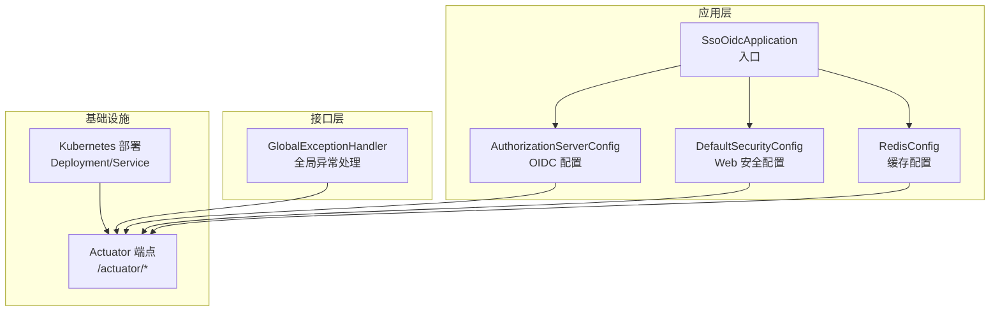
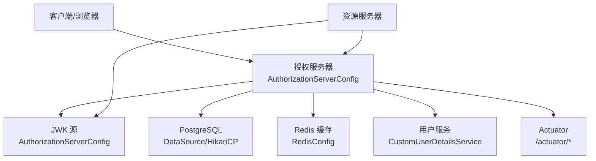
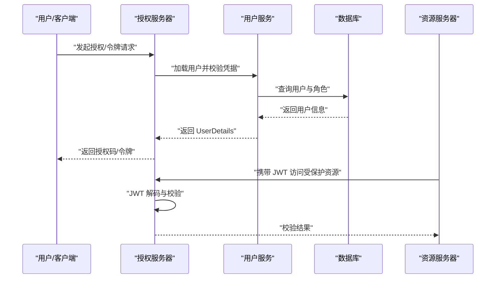
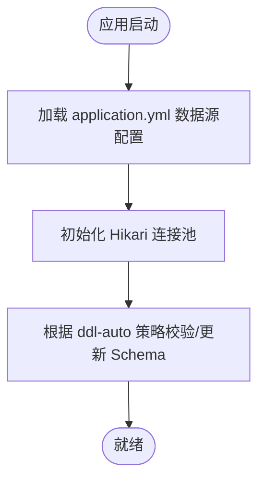
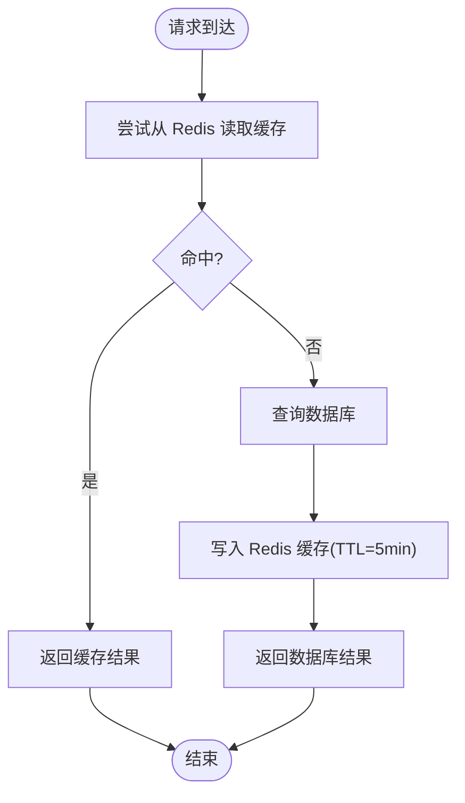
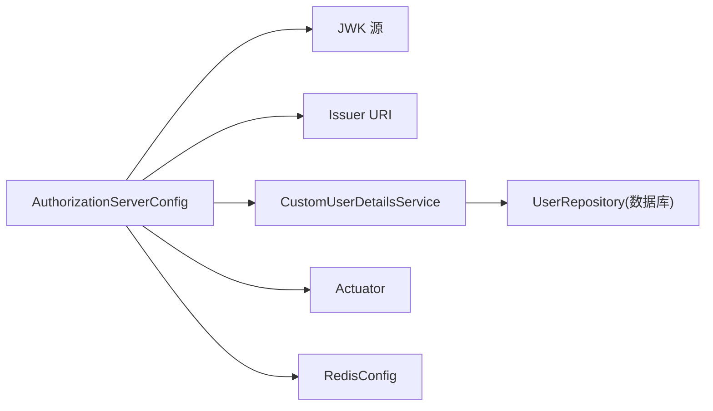

# 故障排除

<cite>
**本文引用的文件**
- [README.md](file://README.md)
- [DEPLOYMENT.md](file://DEPLOYMENT.md)
- [application.yml](file://src/main/resources/application.yml)
- [SsoOidcApplication.java](file://src/main/java/sso/oidc/SsoOidcApplication.java)
- [AuthorizationServerConfig.java](file://src/main/java/sso/oidc/infrastructure/config/AuthorizationServerConfig.java)
- [DefaultSecurityConfig.java](file://src/main/java/sso/oidc/infrastructure/config/DefaultSecurityConfig.java)
- [RedisConfig.java](file://src/main/java/sso/oidc/infrastructure/config/RedisConfig.java)
- [GlobalExceptionHandler.java](file://src/main/java/sso/oidc/interfaces/rest/common/GlobalExceptionHandler.java)
- [BusinessException.java](file://src/main/java/sso/oidc/domain/model/exception/BusinessException.java)
- [InvalidCredentialsException.java](file://src/main/java/sso/oidc/domain/model/exception/InvalidCredentialsException.java)
- [UserNotFoundException.java](file://src/main/java/sso/oidc/domain/model/exception/UserNotFoundException.java)
- [CustomUserDetailsService.java](file://src/main/java/sso/oidc/infrastructure/security/CustomUserDetailsService.java)
- [deployment.yaml](file://k8s/base/deployment.yaml)
- [service.yaml](file://k8s/base/service.yaml)
</cite>

## 目录
1. [简介](#简介)
2. [项目结构](#项目结构)
3. [核心组件](#核心组件)
4. [架构总览](#架构总览)
5. [详细组件分析](#详细组件分析)
6. [依赖分析](#依赖分析)
7. [性能考虑](#性能考虑)
8. [故障排除指南](#故障排除指南)
9. [结论](#结论)
10. [附录](#附录)

## 简介
本指南面向运维与开发团队，提供针对 IAM Platform 认证服务的系统化故障排除方法。内容涵盖认证失败、授权异常、数据库与 Redis 连接问题、日志分析、性能优化、安全问题排查、监控告警与紧急回滚策略。文档以实际代码与配置为依据，帮助快速定位与解决问题。

## 项目结构
应用采用三层架构与多环境配置，结合 Spring Authorization Server 提供 OIDC 能力，并通过 Actuator 暴露健康与指标端点，配合 Kubernetes 部署与 Kustomize Overlay 实现多环境隔离。

图表来源
- [SsoOidcApplication.java:1-13](file://src/main/java/sso/oidc/SsoOidcApplication.java#L1-L13)
- [AuthorizationServerConfig.java:1-143](file://src/main/java/sso/oidc/infrastructure/config/AuthorizationServerConfig.java#L1-L143)
- [DefaultSecurityConfig.java:1-44](file://src/main/java/sso/oidc/infrastructure/config/DefaultSecurityConfig.java#L1-L44)
- [RedisConfig.java:1-34](file://src/main/java/sso/oidc/infrastructure/config/RedisConfig.java#L1-L34)
- [GlobalExceptionHandler.java:1-67](file://src/main/java/sso/oidc/interfaces/rest/common/GlobalExceptionHandler.java#L1-L67)
- [deployment.yaml:1-58](file://k8s/base/deployment.yaml#L1-L58)
- [service.yaml:1-18](file://k8s/base/service.yaml#L1-L18)

章节来源
- [README.md:104-139](file://README.md#L104-L139)
- [application.yml:1-78](file://src/main/resources/application.yml#L1-L78)
- [DEPLOYMENT.md:96-123](file://DEPLOYMENT.md#L96-L123)

## 核心组件
- 应用入口与配置
  - 应用入口负责启动 Spring Boot 应用。
  - OIDC 与安全配置定义了授权服务器行为、客户端设置、令牌有效期、JWK 源与解码器。
  - 默认 Web 安全配置限定公开页面与登录流程。
  - Redis 缓存配置定义 TTL 与序列化策略。
- 异常处理
  - 全局异常处理器将业务异常、认证异常、访问拒绝与通用异常映射为标准 HTTP 响应。
- 多环境与部署
  - application.yml 提供数据库、Redis、JWK、加密、OpenAPI、Actuator 等配置。
  - Kubernetes 部署定义健康探针、资源限制与端口暴露。
  - DEPLOYMENT.md 提供 Docker/K8s 部署、灰度与回滚流程。

章节来源
- [SsoOidcApplication.java:1-13](file://src/main/java/sso/oidc/SsoOidcApplication.java#L1-L13)
- [AuthorizationServerConfig.java:1-143](file://src/main/java/sso/oidc/infrastructure/config/AuthorizationServerConfig.java#L1-L143)
- [DefaultSecurityConfig.java:1-44](file://src/main/java/sso/oidc/infrastructure/config/DefaultSecurityConfig.java#L1-L44)
- [RedisConfig.java:1-34](file://src/main/java/sso/oidc/infrastructure/config/RedisConfig.java#L1-L34)
- [GlobalExceptionHandler.java:1-67](file://src/main/java/sso/oidc/interfaces/rest/common/GlobalExceptionHandler.java#L1-L67)
- [application.yml:1-78](file://src/main/resources/application.yml#L1-L78)
- [deployment.yaml:1-58](file://k8s/base/deployment.yaml#L1-L58)
- [service.yaml:1-18](file://k8s/base/service.yaml#L1-L18)

## 架构总览
下图展示 OIDC 认证服务在运行时的关键交互：客户端发起授权请求，授权服务器校验与发放令牌；资源服务器通过 JWT 解码器验证签名；用户管理与角色管理通过数据库与 Redis 缓存支撑；Actuator 提供健康与指标。

图表来源
- [AuthorizationServerConfig.java:49-123](file://src/main/java/sso/oidc/infrastructure/config/AuthorizationServerConfig.java#L49-L123)
- [RedisConfig.java:19-32](file://src/main/java/sso/oidc/infrastructure/config/RedisConfig.java#L19-L32)
- [application.yml:9-46](file://src/main/resources/application.yml#L9-L46)
- [CustomUserDetailsService.java:15-41](file://src/main/java/sso/oidc/infrastructure/security/CustomUserDetailsService.java#L15-L41)
- [deployment.yaml:37-54](file://k8s/base/deployment.yaml#L37-L54)

## 详细组件分析

### 组件A：认证与授权链路
- 授权服务器配置
  - 定义 OIDC 发现端点、JWT 解码器、客户端设置与令牌有效期。
  - 设置登录入口与资源服务器 JWT 校验。
- 用户服务
  - 从数据库加载用户并装配角色权限。
- 全局异常处理
  - 将认证失败、访问拒绝、业务异常映射为标准响应。

图表来源
- [AuthorizationServerConfig.java:49-123](file://src/main/java/sso/oidc/infrastructure/config/AuthorizationServerConfig.java#L49-L123)
- [CustomUserDetailsService.java:21-39](file://src/main/java/sso/oidc/infrastructure/security/CustomUserDetailsService.java#L21-L39)
- [GlobalExceptionHandler.java:50-56](file://src/main/java/sso/oidc/interfaces/rest/common/GlobalExceptionHandler.java#L50-L56)

章节来源
- [AuthorizationServerConfig.java:49-123](file://src/main/java/sso/oidc/infrastructure/config/AuthorizationServerConfig.java#L49-L123)
- [DefaultSecurityConfig.java:18-37](file://src/main/java/sso/oidc/infrastructure/config/DefaultSecurityConfig.java#L18-L37)
- [CustomUserDetailsService.java:15-41](file://src/main/java/sso/oidc/infrastructure/security/CustomUserDetailsService.java#L15-L41)
- [GlobalExceptionHandler.java:18-66](file://src/main/java/sso/oidc/interfaces/rest/common/GlobalExceptionHandler.java#L18-L66)

### 组件B：数据库与连接池
- 数据源配置
  - JDBC URL、用户名、密码、Hikari 连接池参数（最大池大小、空闲超时、最大生存时间）。
- Hibernate/JPA
  - DDL 策略、SQL 输出开关、open-in-view 关闭。
- Flyway
  - 启用数据库迁移，位置 classpath:db/migration。

图表来源
- [application.yml:9-26](file://src/main/resources/application.yml#L9-L26)

章节来源
- [application.yml:9-26](file://src/main/resources/application.yml#L9-L26)

### 组件C：Redis 缓存与会话
- 缓存配置
  - TTL 5 分钟、禁用空值缓存、JSON 序列化。
- 会话存储
  - Spring Session 存储于 Redis。

图表来源
- [RedisConfig.java:19-32](file://src/main/java/sso/oidc/infrastructure/config/RedisConfig.java#L19-L32)
- [application.yml:45-46](file://src/main/resources/application.yml#L45-L46)

章节来源
- [RedisConfig.java:19-32](file://src/main/java/sso/oidc/infrastructure/config/RedisConfig.java#L19-L32)
- [application.yml:28-46](file://src/main/resources/application.yml#L28-L46)

## 依赖分析
- 组件耦合
  - 授权服务器配置依赖 JWK 源与 Issuer URI。
  - 用户服务依赖数据库仓储。
  - 全局异常处理统一输出。
- 外部依赖
  - PostgreSQL、Redis、JWK 密钥对、Actuator 指标与 Zipkin 链路追踪。

图表来源
- [AuthorizationServerConfig.java:94-123](file://src/main/java/sso/oidc/infrastructure/config/AuthorizationServerConfig.java#L94-L123)
- [CustomUserDetailsService.java:19-25](file://src/main/java/sso/oidc/infrastructure/security/CustomUserDetailsService.java#L19-L25)
- [RedisConfig.java:19-32](file://src/main/java/sso/oidc/infrastructure/config/RedisConfig.java#L19-L32)

章节来源
- [AuthorizationServerConfig.java:94-123](file://src/main/java/sso/oidc/infrastructure/config/AuthorizationServerConfig.java#L94-L123)
- [application.yml:48-55](file://src/main/resources/application.yml#L48-L55)
- [application.yml:28-46](file://src/main/resources/application.yml#L28-L46)

## 性能考虑
- 连接池与数据库
  - 根据环境调整最大池大小与 SQL 输出开关，避免生产开启 show-sql。
  - 使用 Flyway 管理迁移，减少启动时 schema 校验开销。
- 缓存与会话
  - Redis TTL 与 JSON 序列化降低序列化成本。
  - Spring Session 使用 Redis，避免内存膨胀。
- 指标与追踪
  - Actuator 暴露健康、指标与 Prometheus，Zipkin 采集链路数据。

章节来源
- [application.yml:13-19](file://src/main/resources/application.yml#L13-L19)
- [application.yml:20-26](file://src/main/resources/application.yml#L20-L26)
- [application.yml:70-78](file://src/main/resources/application.yml#L70-L78)
- [RedisConfig.java:19-32](file://src/main/java/sso/oidc/infrastructure/config/RedisConfig.java#L19-L32)
- [DEPLOYMENT.md:242-289](file://DEPLOYMENT.md#L242-L289)

## 故障排除指南

### 一、认证失败
- 现象
  - 登录 401、令牌校验失败、用户不存在。
- 诊断步骤
  1) 检查登录页面与表单提交路径是否受保护。
  2) 核对用户是否存在且未锁定/禁用。
  3) 校验客户端 ID/密钥与授权范围配置。
  4) 检查 JWK 私钥/公钥路径与格式。
  5) 查看 Actuator 健康与日志。
- 关键定位点
  - 用户加载与权限装配：[CustomUserDetailsService.java:21-39](file://src/main/java/sso/oidc/infrastructure/security/CustomUserDetailsService.java#L21-L39)
  - 认证异常映射：[GlobalExceptionHandler.java:50-56](file://src/main/java/sso/oidc/interfaces/rest/common/GlobalExceptionHandler.java#L50-L56)
  - OIDC 配置与 Issuer：[AuthorizationServerConfig.java:49-123](file://src/main/java/sso/oidc/infrastructure/config/AuthorizationServerConfig.java#L49-L123)
  - JWK 源与解码器：[AuthorizationServerConfig.java:94-116](file://src/main/java/sso/oidc/infrastructure/config/AuthorizationServerConfig.java#L94-L116)

章节来源
- [DefaultSecurityConfig.java:18-37](file://src/main/java/sso/oidc/infrastructure/config/DefaultSecurityConfig.java#L18-L37)
- [CustomUserDetailsService.java:15-41](file://src/main/java/sso/oidc/infrastructure/security/CustomUserDetailsService.java#L15-L41)
- [GlobalExceptionHandler.java:50-56](file://src/main/java/sso/oidc/interfaces/rest/common/GlobalExceptionHandler.java#L50-L56)
- [AuthorizationServerConfig.java:49-123](file://src/main/java/sso/oidc/infrastructure/config/AuthorizationServerConfig.java#L49-L123)

### 二、授权异常
- 现象
  - 403 访问被拒、权限不足。
- 诊断步骤
  1) 确认用户角色与客户端授权范围。
  2) 检查资源服务器 JWT 验证配置。
  3) 核对 Actuator 权限与安全过滤链。
- 关键定位点
  - 访问拒绝映射：[GlobalExceptionHandler.java:42-48](file://src/main/java/sso/oidc/interfaces/rest/common/GlobalExceptionHandler.java#L42-L48)
  - 资源服务器 JWT：[AuthorizationServerConfig.java:63](file://src/main/java/sso/oidc/infrastructure/config/AuthorizationServerConfig.java#L63)
  - 默认安全链：[DefaultSecurityConfig.java:18-37](file://src/main/java/sso/oidc/infrastructure/config/DefaultSecurityConfig.java#L18-L37)

章节来源
- [GlobalExceptionHandler.java:42-48](file://src/main/java/sso/oidc/interfaces/rest/common/GlobalExceptionHandler.java#L42-L48)
- [AuthorizationServerConfig.java:63](file://src/main/java/sso/oidc/infrastructure/config/AuthorizationServerConfig.java#L63)
- [DefaultSecurityConfig.java:18-37](file://src/main/java/sso/oidc/infrastructure/config/DefaultSecurityConfig.java#L18-L37)

### 三、数据库连接问题
- 现象
  - 应用无法启动、Hikari 连接超时、SQL 执行失败。
- 诊断步骤
  1) 检查数据库主机、端口、凭据与网络连通性。
  2) 查看 Hikari 连接池状态与健康端点。
  3) 确认 Flyway 迁移是否成功执行。
- 关键定位点
  - 数据源与连接池：[application.yml:9-19](file://src/main/resources/application.yml#L9-L19)
  - 健康端点（数据源）：[DEPLOYMENT.md:244-258](file://DEPLOYMENT.md#L244-L258)
  - 迁移配置：[application.yml:32-35](file://src/main/resources/application.yml#L32-L35)

章节来源
- [application.yml:9-19](file://src/main/resources/application.yml#L9-L19)
- [application.yml:32-35](file://src/main/resources/application.yml#L32-L35)
- [DEPLOYMENT.md:244-258](file://DEPLOYMENT.md#L244-L258)

### 四、Redis 连接问题
- 现象
  - 缓存读写失败、会话丢失、健康检查中 Redis 不可用。
- 诊断步骤
  1) 检查 Redis 主机、端口、密码与网络连通。
  2) 查看 Actuator 健康端点中的 Redis 指标。
  3) 核对 Spring Session 是否正确使用 Redis。
- 关键定位点
  - Redis 配置与 TTL：[application.yml:28-31](file://src/main/resources/application.yml#L28-L31)
  - 缓存管理器：[RedisConfig.java:19-32](file://src/main/java/sso/oidc/infrastructure/config/RedisConfig.java#L19-L32)
  - 健康端点（Redis）：[DEPLOYMENT.md:244-258](file://DEPLOYMENT.md#L244-L258)

章节来源
- [application.yml:28-31](file://src/main/resources/application.yml#L28-L31)
- [RedisConfig.java:19-32](file://src/main/java/sso/oidc/infrastructure/config/RedisConfig.java#L19-L32)
- [DEPLOYMENT.md:244-258](file://DEPLOYMENT.md#L244-L258)

### 五、日志分析技巧
- 日志级别
  - 不同环境的日志级别不同，生产建议 INFO 或更高。
- 关键日志信息
  - 认证失败、访问被拒、业务异常、数据库连接异常、Redis 连接异常。
- 错误追踪
  - 结合 Zipkin 链路与 Actuator 指标定位慢请求。
- 关键定位点
  - 全局异常日志：[GlobalExceptionHandler.java:20-65](file://src/main/java/sso/oidc/interfaces/rest/common/GlobalExceptionHandler.java#L20-L65)
  - Actuator 指标与 Zipkin：[application.yml:70-78](file://src/main/resources/application.yml#L70-L78)
  - K8s 日志查看：[DEPLOYMENT.md:260-271](file://DEPLOYMENT.md#L260-L271)

章节来源
- [GlobalExceptionHandler.java:20-65](file://src/main/java/sso/oidc/interfaces/rest/common/GlobalExceptionHandler.java#L20-L65)
- [application.yml:70-78](file://src/main/resources/application.yml#L70-L78)
- [DEPLOYMENT.md:260-271](file://DEPLOYMENT.md#L260-L271)

### 六、性能问题识别与优化
- 慢查询
  - 通过 Actuator 指标与 Zipkin 分析热点端点与耗时。
- 内存使用
  - 调整容器内存限制与 JVM 参数，关注 Redis 缓存命中率。
- 并发处理
  - 优化数据库连接池大小与超时，避免阻塞。
- 关键定位点
  - 指标与 Zipkin：[application.yml:70-78](file://src/main/resources/application.yml#L70-L78)
  - 连接池参数：[application.yml:13-19](file://src/main/resources/application.yml#L13-L19)
  - 资源监控：[DEPLOYMENT.md:273-281](file://DEPLOYMENT.md#L273-L281)

章节来源
- [application.yml:70-78](file://src/main/resources/application.yml#L70-L78)
- [application.yml:13-19](file://src/main/resources/application.yml#L13-L19)
- [DEPLOYMENT.md:273-281](file://DEPLOYMENT.md#L273-L281)

### 七、安全问题排查
- 令牌验证失败
  - 检查 JWK 路径、私钥/公钥格式、Issuer URI。
- 权限拒绝
  - 核对用户角色与客户端授权范围、资源服务器 JWT 验证。
- 会话异常
  - 检查 Redis 连接与 Spring Session 配置。
- 关键定位点
  - JWK 与 Issuer：[AuthorizationServerConfig.java:94-123](file://src/main/java/sso/oidc/infrastructure/config/AuthorizationServerConfig.java#L94-L123)
  - 资源服务器 JWT：[AuthorizationServerConfig.java:63](file://src/main/java/sso/oidc/infrastructure/config/AuthorizationServerConfig.java#L63)
  - Redis 会话：[application.yml:45-46](file://src/main/resources/application.yml#L45-L46)

章节来源
- [AuthorizationServerConfig.java:94-123](file://src/main/java/sso/oidc/infrastructure/config/AuthorizationServerConfig.java#L94-L123)
- [AuthorizationServerConfig.java:63](file://src/main/java/sso/oidc/infrastructure/config/AuthorizationServerConfig.java#L63)
- [application.yml:45-46](file://src/main/resources/application.yml#L45-L46)

### 八、监控告警与响应流程
- 健康检查
  - 使用 /actuator/health、/actuator/health/datasource,redis。
- 指标导出
  - /actuator/prometheus 采集 Prometheus。
- 日志与追踪
  - K8s 日志、Zipkin 链路。
- 关键定位点
  - 健康与指标端点：[DEPLOYMENT.md:244-258](file://DEPLOYMENT.md#L244-L258)
  - Prometheus 指标：[DEPLOYMENT.md:283-288](file://DEPLOYMENT.md#L283-L288)

章节来源
- [DEPLOYMENT.md:244-258](file://DEPLOYMENT.md#L244-L258)
- [DEPLOYMENT.md:283-288](file://DEPLOYMENT.md#L283-L288)

### 九、紧急恢复与回滚策略
- Kubernetes 回滚
  - 使用 kubectl rollout undo 指定版本回滚。
- 镜像回退
  - 重新部署上一个稳定版本镜像。
- 关键定位点
  - 回滚命令：[DEPLOYMENT.md:185-198](file://DEPLOYMENT.md#L185-L198)

章节来源
- [DEPLOYMENT.md:185-198](file://DEPLOYMENT.md#L185-L198)

## 结论
通过结合应用配置、安全与异常处理、数据库与缓存、Actuator 指标与日志、Kubernetes 部署与回滚策略，可以系统化地定位与解决 IAM Platform 认证服务的各类问题。建议在生产环境严格区分日志级别、启用必要的监控与追踪，并建立标准化的灰度与回滚流程。

## 附录
- OIDC 端点参考
  - 发现、授权、令牌、用户信息、JWKS、撤销、内省等端点。
- 多环境配置
  - 不同环境的连接池大小、SQL 输出、Swagger UI、日志级别与模板缓存策略。
- 部署与回滚
  - Docker 构建、K8s 部署、灰度发布与回滚命令。

章节来源
- [README.md:360-388](file://README.md#L360-L388)
- [DEPLOYMENT.md:200-241](file://DEPLOYMENT.md#L200-L241)
- [DEPLOYMENT.md:185-198](file://DEPLOYMENT.md#L185-L198)