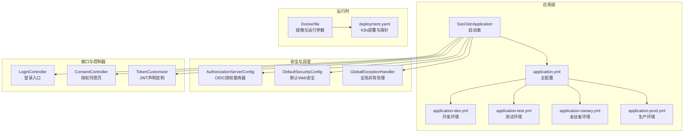
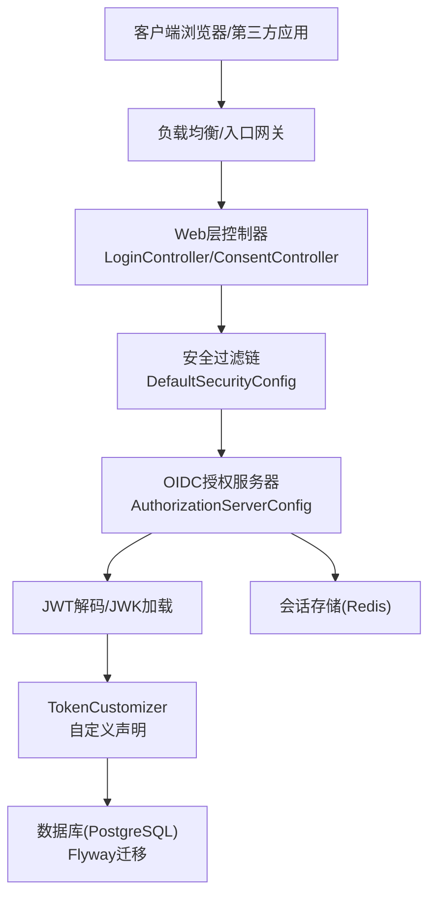
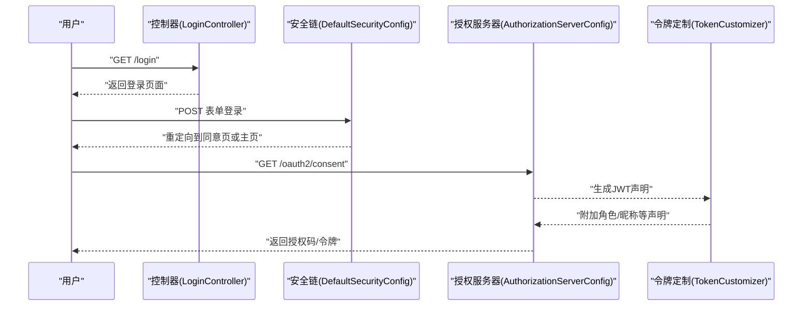
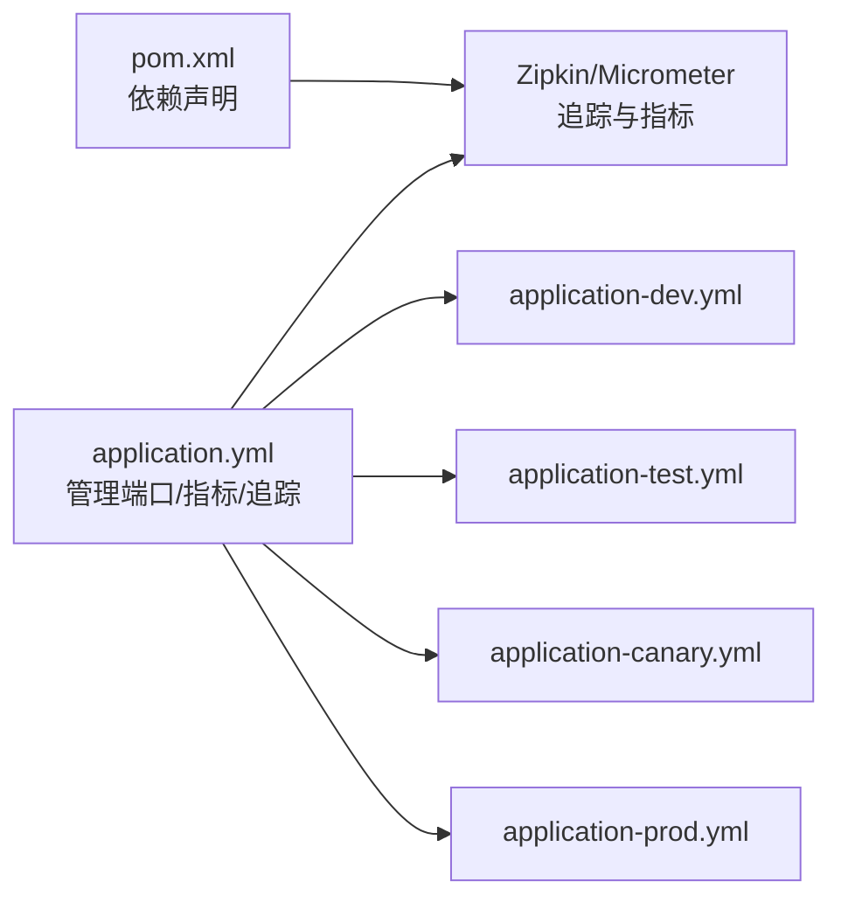

# 日志分析

<cite>
**本文引用的文件**   
- [application.yml](file://src/main/resources/application.yml)
- [application-dev.yml](file://src/main/resources/application-dev.yml)
- [application-test.yml](file://src/main/resources/application-test.yml)
- [application-prod.yml](file://src/main/resources/application-prod.yml)
- [application-canary.yml](file://src/main/resources/application-canary.yml)
- [Dockerfile](file://Dockerfile)
- [deployment.yaml](file://k8s/base/deployment.yaml)
- [SsoOidcApplication.java](file://src/main/java/sso/oidc/SsoOidcApplication.java)
- [GlobalExceptionHandler.java](file://src/main/java/sso/oidc/interfaces/rest/common/GlobalExceptionHandler.java)
- [AuthorizationServerConfig.java](file://src/main/java/sso/oidc/infrastructure/config/AuthorizationServerConfig.java)
- [DefaultSecurityConfig.java](file://src/main/java/sso/oidc/infrastructure/config/DefaultSecurityConfig.java)
- [TokenCustomizer.java](file://src/main/java/sso/oidc/infrastructure/security/TokenCustomizer.java)
- [ConsentController.java](file://src/main/java/sso/oidc/interfaces/web/ConsentController.java)
- [LoginController.java](file://src/main/java/sso/oidc/interfaces/web/LoginController.java)
- [pom.xml](file://pom.xml)
</cite>

## 目录
1. [简介](#简介)
2. [项目结构](#项目结构)
3. [核心组件](#核心组件)
4. [架构总览](#架构总览)
5. [详细组件分析](#详细组件分析)
6. [依赖分析](#依赖分析)
7. [性能考量](#性能考量)
8. [故障排查指南](#故障排查指南)
9. [结论](#结论)
10. [附录](#附录)

## 简介
本指南面向IAM Platform认证服务的日志分析与运维，聚焦于如何在不同环境中配置与使用日志级别（DEBUG、INFO、WARN、ERROR），识别关键日志信息（认证事件、授权流程、异常堆栈、性能指标），以及如何通过日志追踪用户行为、识别系统瓶颈与安全威胁。同时提供日志轮转、存储策略与隐私保护的最佳实践，并结合项目中的配置文件与运行环境，给出可落地的落地建议。

## 项目结构
该服务基于Spring Boot构建，采用多环境配置文件区分开发、测试、金丝雀与生产环境；容器化部署并通过Kubernetes进行编排。日志相关的关键位置包括：
- 应用主配置：定义Actuator管理端口、指标标签、链路追踪Zipkin端点等
- 环境配置：按环境设置日志级别、SQL输出、缓存开关、Swagger启用等
- 容器与K8s：暴露管理端口、健康检查探针、资源限制与非root运行
- 异常处理：全局异常捕获与日志输出策略
- 安全配置：OIDC授权服务器与默认Web安全链路
- 控制器：登录、注册、同意页等入口，便于识别用户行为轨迹

图表来源
- [SsoOidcApplication.java:1-13](file://src/main/java/sso/oidc/SsoOidcApplication.java#L1-L13)
- [application.yml:1-78](file://src/main/resources/application.yml#L1-L78)
- [application-dev.yml:1-22](file://src/main/resources/application-dev.yml#L1-L22)
- [application-test.yml:1-16](file://src/main/resources/application-test.yml#L1-L16)
- [application-canary.yml:1-14](file://src/main/resources/application-canary.yml#L1-L14)
- [application-prod.yml:1-25](file://src/main/resources/application-prod.yml#L1-L25)
- [Dockerfile:1-60](file://Dockerfile#L1-L60)
- [deployment.yaml:1-58](file://k8s/base/deployment.yaml#L1-L58)
- [AuthorizationServerConfig.java:1-144](file://src/main/java/sso/oidc/infrastructure/config/AuthorizationServerConfig.java#L1-L144)
- [DefaultSecurityConfig.java:1-44](file://src/main/java/sso/oidc/infrastructure/config/DefaultSecurityConfig.java#L1-L44)
- [GlobalExceptionHandler.java:1-67](file://src/main/java/sso/oidc/interfaces/rest/common/GlobalExceptionHandler.java#L1-L67)
- [LoginController.java:1-14](file://src/main/java/sso/oidc/interfaces/web/LoginController.java#L1-L14)
- [ConsentController.java:1-21](file://src/main/java/sso/oidc/interfaces/web/ConsentController.java#L1-L21)
- [TokenCustomizer.java:1-32](file://src/main/java/sso/oidc/infrastructure/security/TokenCustomizer.java#L1-L32)

章节来源
- [application.yml:1-78](file://src/main/resources/application.yml#L1-L78)
- [application-dev.yml:1-22](file://src/main/resources/application-dev.yml#L1-L22)
- [application-test.yml:1-16](file://src/main/resources/application-test.yml#L1-L16)
- [application-prod.yml:1-25](file://src/main/resources/application-prod.yml#L1-L25)
- [application-canary.yml:1-14](file://src/main/resources/application-canary.yml#L1-L14)
- [Dockerfile:1-60](file://Dockerfile#L1-L60)
- [deployment.yaml:1-58](file://k8s/base/deployment.yaml#L1-L58)
- [SsoOidcApplication.java:1-13](file://src/main/java/sso/oidc/SsoOidcApplication.java#L1-L13)

## 核心组件
- 全局异常处理：集中记录业务异常、访问拒绝、认证失败与未预期错误，便于统一分析与告警
- 安全配置：OIDC授权服务器与默认Web安全链路，用于识别鉴权入口与异常路径
- 控制器：登录、注册、同意页等用户交互入口，便于追踪用户行为
- 配置文件：按环境设置日志级别、SQL输出、缓存与Swagger，支撑不同阶段的日志密度与可观测性

章节来源
- [GlobalExceptionHandler.java:1-67](file://src/main/java/sso/oidc/interfaces/rest/common/GlobalExceptionHandler.java#L1-L67)
- [AuthorizationServerConfig.java:1-144](file://src/main/java/sso/oidc/infrastructure/config/AuthorizationServerConfig.java#L1-L144)
- [DefaultSecurityConfig.java:1-44](file://src/main/java/sso/oidc/infrastructure/config/DefaultSecurityConfig.java#L1-L44)
- [LoginController.java:1-14](file://src/main/java/sso/oidc/interfaces/web/LoginController.java#L1-L14)
- [ConsentController.java:1-21](file://src/main/java/sso/oidc/interfaces/web/ConsentController.java#L1-L21)

## 架构总览
下图展示从客户端到OIDC授权服务器、再到数据库与Redis的典型请求链路，以及日志与指标采集的关键节点。

图表来源
- [AuthorizationServerConfig.java:1-144](file://src/main/java/sso/oidc/infrastructure/config/AuthorizationServerConfig.java#L1-L144)
- [DefaultSecurityConfig.java:1-44](file://src/main/java/sso/oidc/infrastructure/config/DefaultSecurityConfig.java#L1-L44)
- [TokenCustomizer.java:1-32](file://src/main/java/sso/oidc/infrastructure/security/TokenCustomizer.java#L1-L32)
- [LoginController.java:1-14](file://src/main/java/sso/oidc/interfaces/web/LoginController.java#L1-L14)
- [ConsentController.java:1-21](file://src/main/java/sso/oidc/interfaces/web/ConsentController.java#L1-L21)

## 详细组件分析

### 日志级别与适用场景
- 开发环境（dev）
  - SQL打印开启，便于调试
  - 安全框架与核心包DEBUG级别，便于理解认证与授权流程
  - Swagger可用，便于联调
- 测试环境（test）
  - SQL关闭，减少噪声
  - 安全框架DEBUG级别，便于验证鉴权链路
- 金丝雀/生产环境（canary/prod）
  - SQL关闭，降低I/O与敏感信息泄露风险
  - 安全框架日志降级至WARN或更低，避免过度曝光
  - Swagger禁用，降低攻击面
  - Zipkin采样率可下调以控制开销

章节来源
- [application-dev.yml:1-22](file://src/main/resources/application-dev.yml#L1-L22)
- [application-test.yml:1-16](file://src/main/resources/application-test.yml#L1-L16)
- [application-canary.yml:1-14](file://src/main/resources/application-canary.yml#L1-L14)
- [application-prod.yml:1-25](file://src/main/resources/application-prod.yml#L1-L25)

### 关键日志信息识别
- 认证事件
  - 登录入口与表单登录链路由默认安全配置与登录控制器驱动，可通过安全框架日志与全局异常处理日志识别认证成功/失败与权限不足
- 授权流程
  - OIDC授权服务器配置启用OpenID Connect与JWT支持，授权同意页由控制器渲染，日志中可定位授权同意触发与范围(scope)传递
- 异常堆栈
  - 全局异常处理器对业务异常、访问拒绝、认证失败与通用异常进行分类记录，便于快速定位问题类型与HTTP状态
- 性能指标
  - Actuator暴露指标端点，结合Micrometer与Zipkin实现分布式追踪与指标上报，日志中可关联traceId进行端到端分析

章节来源
- [DefaultSecurityConfig.java:1-44](file://src/main/java/sso/oidc/infrastructure/config/DefaultSecurityConfig.java#L1-L44)
- [LoginController.java:1-14](file://src/main/java/sso/oidc/interfaces/web/LoginController.java#L1-L14)
- [ConsentController.java:1-21](file://src/main/java/sso/oidc/interfaces/web/ConsentController.java#L1-L21)
- [AuthorizationServerConfig.java:1-144](file://src/main/java/sso/oidc/infrastructure/config/AuthorizationServerConfig.java#L1-L144)
- [GlobalExceptionHandler.java:1-67](file://src/main/java/sso/oidc/interfaces/rest/common/GlobalExceptionHandler.java#L1-L67)
- [application.yml:63-78](file://src/main/resources/application.yml#L63-L78)
- [pom.xml:96-103](file://pom.xml#L96-L103)

### 用户行为追踪
- 登录与退出：通过登录控制器与默认安全配置的登出逻辑，可在安全框架日志中识别用户登录入口、成功跳转与退出路径
- 授权同意：同意页控制器接收客户端与scope参数，便于在日志中识别第三方应用授权意图
- 令牌发放：令牌定制器在JWT中注入用户角色与扩展声明，结合授权服务器日志可定位令牌发放上下文

章节来源
- [LoginController.java:1-14](file://src/main/java/sso/oidc/interfaces/web/LoginController.java#L1-L14)
- [ConsentController.java:1-21](file://src/main/java/sso/oidc/interfaces/web/ConsentController.java#L1-L21)
- [TokenCustomizer.java:1-32](file://src/main/java/sso/oidc/infrastructure/security/TokenCustomizer.java#L1-L32)
- [DefaultSecurityConfig.java:1-44](file://src/main/java/sso/oidc/infrastructure/config/DefaultSecurityConfig.java#L1-L44)

### 安全威胁识别
- 认证失败与访问拒绝：全局异常处理对认证失败与权限不足进行记录，可作为入侵尝试与越权访问的早期信号
- 异常堆栈：未预期错误会被记录为ERROR级别，需结合上下文与采样策略进行告警与调查
- 生产环境日志降噪：降低安全框架日志级别与禁用Swagger，有助于减少敏感信息暴露与噪声干扰

章节来源
- [GlobalExceptionHandler.java:1-67](file://src/main/java/sso/oidc/interfaces/rest/common/GlobalExceptionHandler.java#L1-L67)
- [application-prod.yml:1-25](file://src/main/resources/application-prod.yml#L1-L25)

### 日志序列与流程（示例）
以下序列图展示一次典型登录与授权同意流程的日志视角：

图表来源
- [LoginController.java:1-14](file://src/main/java/sso/oidc/interfaces/web/LoginController.java#L1-L14)
- [DefaultSecurityConfig.java:1-44](file://src/main/java/sso/oidc/infrastructure/config/DefaultSecurityConfig.java#L1-L44)
- [AuthorizationServerConfig.java:1-144](file://src/main/java/sso/oidc/infrastructure/config/AuthorizationServerConfig.java#L1-L144)
- [TokenCustomizer.java:1-32](file://src/main/java/sso/oidc/infrastructure/security/TokenCustomizer.java#L1-L32)

## 依赖分析
- 运行时依赖
  - Micrometer追踪桥接与Zipkin报告器，用于将日志与指标导出到外部系统
- 配置依赖
  - 主配置定义管理端口、指标标签与Zipkin端点；各环境配置覆盖日志级别与功能开关
- 安全与异常处理
  - 安全配置与全局异常处理共同构成可观测性的基础，日志中应体现认证、授权与异常三类关键事件

图表来源
- [pom.xml:96-103](file://pom.xml#L96-L103)
- [application.yml:63-78](file://src/main/resources/application.yml#L63-L78)
- [application-dev.yml:1-22](file://src/main/resources/application-dev.yml#L1-L22)
- [application-test.yml:1-16](file://src/main/resources/application-test.yml#L1-L16)
- [application-canary.yml:1-14](file://src/main/resources/application-canary.yml#L1-L14)
- [application-prod.yml:1-25](file://src/main/resources/application-prod.yml#L1-L25)

章节来源
- [pom.xml:96-103](file://pom.xml#L96-L103)
- [application.yml:63-78](file://src/main/resources/application.yml#L63-L78)

## 性能考量
- 日志级别与SQL输出
  - 开发/测试开启SQL打印便于诊断，生产关闭以降低I/O与敏感信息泄露风险
- Zipkin采样率
  - 生产环境可降低采样概率以平衡观测成本与性能影响
- 资源限制与健康检查
  - 容器与K8s部署配置了CPU/内存限制与健康检查探针，结合日志可识别启动慢、存活失败等问题

章节来源
- [application-dev.yml:1-22](file://src/main/resources/application-dev.yml#L1-L22)
- [application-test.yml:1-16](file://src/main/resources/application-test.yml#L1-L16)
- [application-prod.yml:1-25](file://src/main/resources/application-prod.yml#L1-L25)
- [application-canary.yml:1-14](file://src/main/resources/application-canary.yml#L1-L14)
- [Dockerfile:1-60](file://Dockerfile#L1-L60)
- [deployment.yaml:1-58](file://k8s/base/deployment.yaml#L1-L58)

## 故障排查指南
- 常见问题定位步骤
  - 认证失败：查看全局异常处理对认证异常的日志记录，结合安全框架日志确认登录入口与重定向路径
  - 权限不足：关注访问拒绝日志，核对受保护资源与权限模型
  - 未预期错误：ERROR级别日志包含堆栈信息，结合traceId与指标进行端到端分析
- 环境差异
  - 开发/测试SQL打印与安全框架DEBUG日志有助于快速定位问题；生产环境应优先通过指标与采样日志进行分析
- 运维要点
  - 使用管理端口与Actuator健康检查探针，结合日志判断服务状态与启动耗时

章节来源
- [GlobalExceptionHandler.java:1-67](file://src/main/java/sso/oidc/interfaces/rest/common/GlobalExceptionHandler.java#L1-L67)
- [DefaultSecurityConfig.java:1-44](file://src/main/java/sso/oidc/infrastructure/config/DefaultSecurityConfig.java#L1-L44)
- [deployment.yaml:1-58](file://k8s/base/deployment.yaml#L1-L58)

## 结论
通过合理配置不同环境的日志级别与功能开关，结合全局异常处理与安全配置的日志输出，可以有效识别认证事件、授权流程、异常堆栈与性能指标。配合容器与K8s的健康检查、Micrometer与Zipkin的指标与追踪能力，能够实现从用户行为到系统瓶颈与安全威胁的全链路日志分析。生产环境应坚持“低噪声、高价值”的原则，确保可观测性与安全性并重。

## 附录

### 日志分析工具与集成建议
- ELK Stack（Elasticsearch、Logstash、Kibana）
  - 将应用日志输出到标准输出，由容器编排系统收集；在Kibana中建立索引模式与仪表板，筛选认证、授权与异常事件
- Splunk
  - 通过Splunk Universal Forwarder收集日志，使用搜索语法过滤traceId、用户标识与HTTP状态，建立告警规则
- Prometheus + Grafana
  - 结合Actuator指标与Micrometer，使用Grafana可视化请求量、错误率与响应时间趋势
- Zipkin
  - 通过采样与traceId串联请求链路，结合日志定位具体环节的异常与延迟

### 日志轮转、存储与隐私保护最佳实践
- 日志轮转
  - 在容器侧使用日志驱动的轮转策略，限制单文件大小与保留数量，避免磁盘占满
- 存储策略
  - 开发/测试短期存储，生产长期归档；对敏感字段（如密码、令牌）进行脱敏或屏蔽
- 隐私保护
  - 生产环境关闭SQL打印与Swagger，降低敏感信息泄露风险；对日志中的个人数据进行去标识化处理