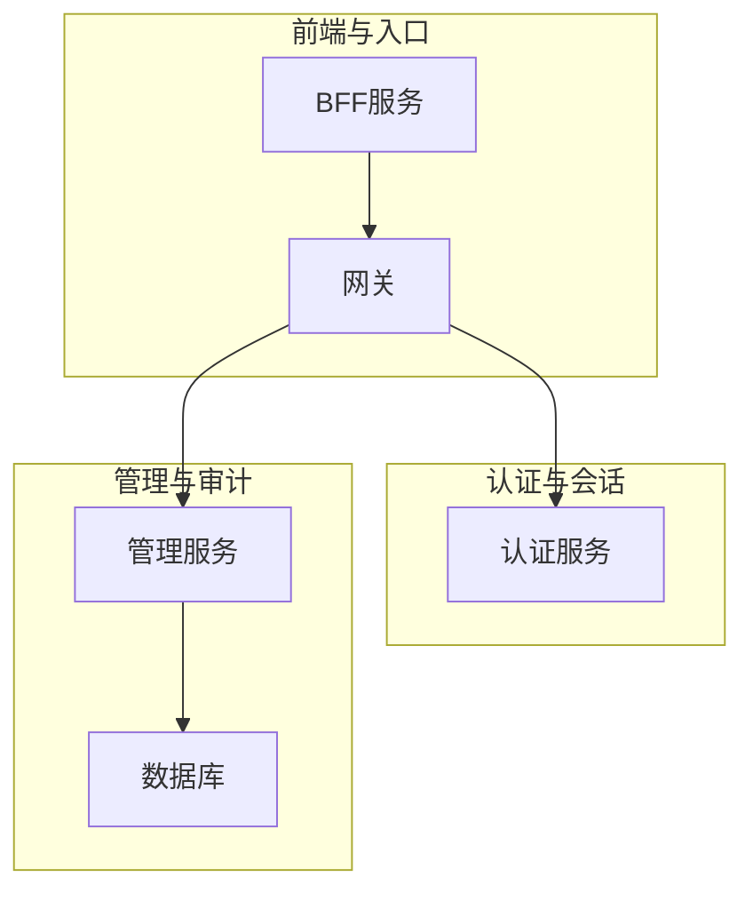
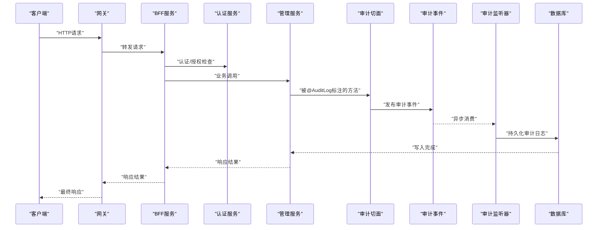
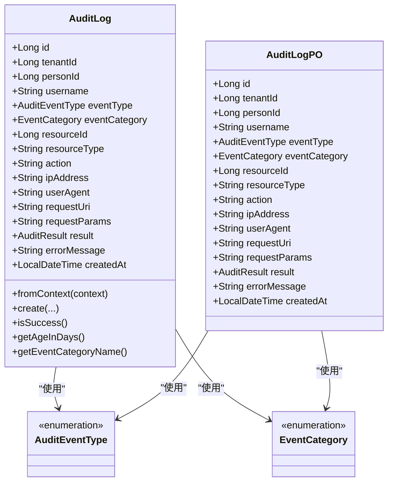
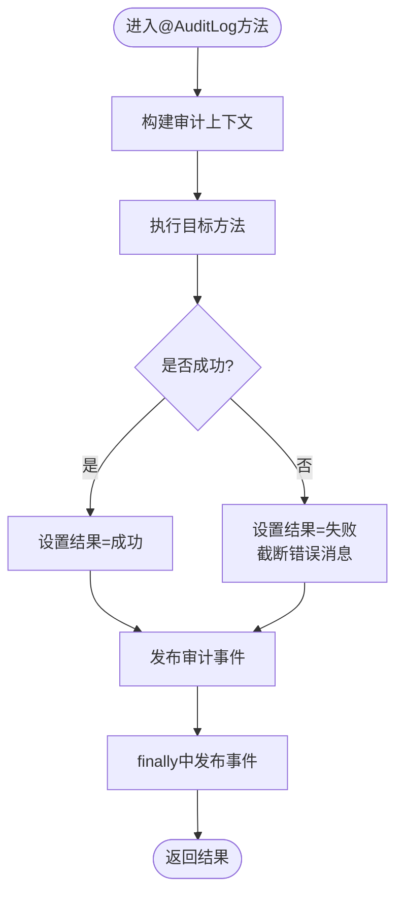
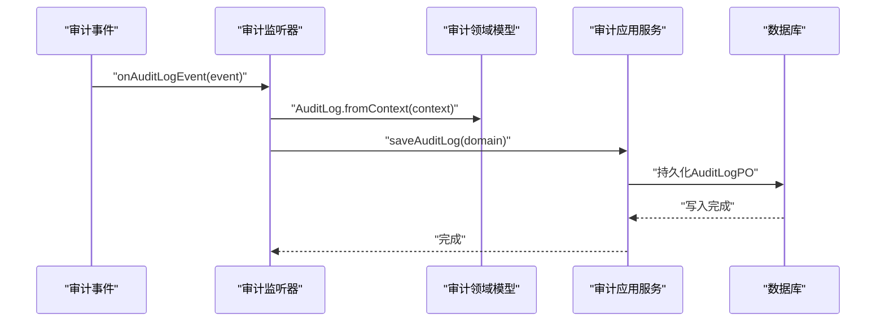
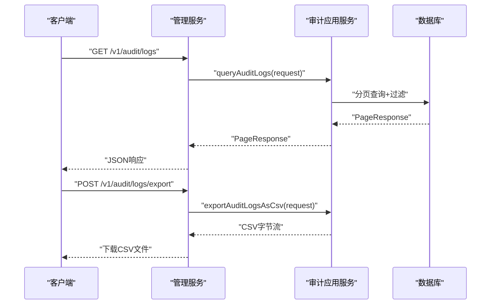
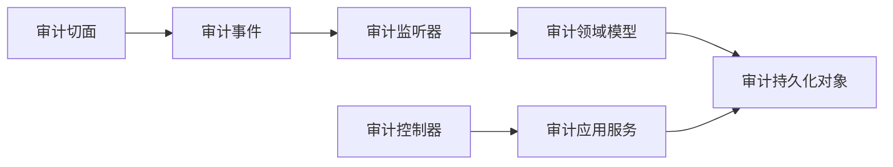

# 日志分析与监控

<cite>
**本文引用的文件**
- [application.yml（管理服务）](file://iam-admin-server/src/main/resources/application.yml)
- [application.yml（认证服务）](file://iam-auth-server/src/main/resources/application.yml)
- [application.yml（BFF服务）](file://iam-bff-server/src/main/resources/application.yml)
- [application-dev.yml（认证服务开发环境）](file://iam-auth-server/src/main/resources/application-dev.yml)
- [AuditProperties.java](file://iam-admin-server/src/main/java/iam/platform/admin/infrastructure/config/AuditProperties.java)
- [AsyncConfig.java](file://iam-admin-server/src/main/java/iam/platform/admin/infrastructure/config/AsyncConfig.java)
- [AuditLogAspect.java](file://iam-admin-server/src/main/java/iam/platform/admin/infrastructure/aspect/AuditLogAspect.java)
- [AuditLogEvent.java](file://iam-admin-server/src/main/java/iam/platform/admin/application/event/AuditLogEvent.java)
- [AuditLogEventListener.java](file://iam-admin-server/src/main/java/iam/platform/admin/application/event/AuditLogEventListener.java)
- [AuditLog.java](file://iam-admin-server/src/main/java/iam/platform/admin/domain/model/entity/AuditLog.java)
- [AuditLogPO.java](file://iam-admin-server/src/main/java/iam/platform/admin/infrastructure/persistence/entity/AuditLogPO.java)
- [AuditController.java](file://iam-admin-server/src/main/java/iam/platform/admin/interfaces/rest/AuditController.java)
- [AuditEventType.java](file://iam-common/src/main/java/iam/platform/common/model/enums/AuditEventType.java)
- [EventCategory.java](file://iam-common/src/main/java/iam/platform/common/model/enums/EventCategory.java)
</cite>

## 目录
1. [简介](#简介)
2. [项目结构](#项目结构)
3. [核心组件](#核心组件)
4. [架构总览](#架构总览)
5. [组件详解](#组件详解)
6. [依赖关系分析](#依赖关系分析)
7. [性能与监控](#性能与监控)
8. [故障排查指南](#故障排查指南)
9. [结论](#结论)
10. [附录](#附录)

## 简介
本指南面向IAM平台运维与安全团队，系统化阐述平台的日志体系与监控实践，覆盖以下主题：
- 日志级别与输出策略：解释DEBUG、INFO、WARN、ERROR在各模块中的使用场景与配置要点
- 关键日志字段识别：认证、审计、异常等日志的关键字段及其业务含义
- 审计日志分析：用户行为追踪、异常操作检测与合规审计方法
- 性能日志分析：慢查询识别、响应时间分析与资源使用监控
- 日志聚合与分析工具：ELK Stack、Splunk等的配置与查询技巧
- 告警规则与处理流程：基于审计与性能指标的告警策略与处置流程

## 项目结构
IAM平台采用多模块微服务架构，日志与审计能力主要集中在管理服务（iam-admin-server），并通过Spring Cloud OpenFeign在BFF层进行调用；认证服务（iam-auth-server）提供统一认证与会话能力；网关（iam-gateway）负责流量接入与链路追踪。

图示来源
- [AuditController.java:26-89](file://iam-admin-server/src/main/java/iam/platform/admin/interfaces/rest/AuditController.java#L26-L89)
- [application.yml（管理服务）:1-102](file://iam-admin-server/src/main/resources/application.yml#L1-L102)
- [application.yml（认证服务）:1-144](file://iam-auth-server/src/main/resources/application.yml#L1-L144)
- [application.yml（BFF服务）:1-54](file://iam-bff-server/src/main/resources/application.yml#L1-L54)

章节来源
- [AuditController.java:26-89](file://iam-admin-server/src/main/java/iam/platform/admin/interfaces/rest/AuditController.java#L26-L89)
- [application.yml（管理服务）:1-102](file://iam-admin-server/src/main/resources/application.yml#L1-L102)
- [application.yml（认证服务）:1-144](file://iam-auth-server/src/main/resources/application.yml#L1-L144)
- [application.yml（BFF服务）:1-54](file://iam-bff-server/src/main/resources/application.yml#L1-L54)

## 核心组件
- 审计事件枚举与分类：定义审计事件类型与分类，支撑审计日志的结构化记录
- 审计切面与事件：通过AOP拦截标注方法，生成审计上下文并发布事件
- 异步监听器与持久化：异步消费审计事件，转换为领域模型并持久化到数据库
- 审计查询接口：提供分页查询、按用户/资源过滤、统计与导出能力
- 配置与属性：审计开关、保留期、异步线程池参数等

章节来源
- [AuditEventType.java:6-58](file://iam-common/src/main/java/iam/platform/common/model/enums/AuditEventType.java#L6-L58)
- [EventCategory.java:6-12](file://iam-common/src/main/java/iam/platform/common/model/enums/EventCategory.java#L6-L12)
- [AuditLogAspect.java:14-66](file://iam-admin-server/src/main/java/iam/platform/admin/infrastructure/aspect/AuditLogAspect.java#L14-L66)
- [AuditLogEvent.java:7-21](file://iam-admin-server/src/main/java/iam/platform/admin/application/event/AuditLogEvent.java#L7-L21)
- [AuditLogEventListener.java:12-31](file://iam-admin-server/src/main/java/iam/platform/admin/application/event/AuditLogEventListener.java#L12-L31)
- [AuditLog.java:15-118](file://iam-admin-server/src/main/java/iam/platform/admin/domain/model/entity/AuditLog.java#L15-L118)
- [AuditLogPO.java:14-86](file://iam-admin-server/src/main/java/iam/platform/admin/infrastructure/persistence/entity/AuditLogPO.java#L14-L86)
- [AuditController.java:34-87](file://iam-admin-server/src/main/java/iam/platform/admin/interfaces/rest/AuditController.java#L34-L87)
- [AuditProperties.java:7-36](file://iam-admin-server/src/main/java/iam/platform/admin/infrastructure/config/AuditProperties.java#L7-L36)
- [AsyncConfig.java:11-30](file://iam-admin-server/src/main/java/iam/platform/admin/infrastructure/config/AsyncConfig.java#L11-L30)

## 架构总览
下图展示从请求进入网关，经由BFF与认证服务，再到管理服务的审计日志生成与落库路径，并结合异步执行与数据库索引设计。

图示来源
- [AuditLogAspect.java:27-48](file://iam-admin-server/src/main/java/iam/platform/admin/infrastructure/aspect/AuditLogAspect.java#L27-L48)
- [AuditLogEvent.java:16-19](file://iam-admin-server/src/main/java/iam/platform/admin/application/event/AuditLogEvent.java#L16-L19)
- [AuditLogEventListener.java:22-29](file://iam-admin-server/src/main/java/iam/platform/admin/application/event/AuditLogEventListener.java#L22-L29)
- [AuditLogPO.java:18-27](file://iam-admin-server/src/main/java/iam/platform/admin/infrastructure/persistence/entity/AuditLogPO.java#L18-L27)
- [AuditController.java:34-87](file://iam-admin-server/src/main/java/iam/platform/admin/interfaces/rest/AuditController.java#L34-L87)

## 组件详解

### 审计日志模型与实体
审计日志以不可变领域模型形式存在，包含事件类型、分类、资源标识、请求上下文、结果与错误信息等字段。持久化实体映射数据库表并建立多维索引，支持高效查询与统计。

图示来源
- [AuditLog.java:23-99](file://iam-admin-server/src/main/java/iam/platform/admin/domain/model/entity/AuditLog.java#L23-L99)
- [AuditLogPO.java:31-84](file://iam-admin-server/src/main/java/iam/platform/admin/infrastructure/persistence/entity/AuditLogPO.java#L31-L84)
- [AuditEventType.java:6-58](file://iam-common/src/main/java/iam/platform/common/model/enums/AuditEventType.java#L6-L58)
- [EventCategory.java:6-12](file://iam-common/src/main/java/iam/platform/common/model/enums/EventCategory.java#L6-L12)

章节来源
- [AuditLog.java:15-118](file://iam-admin-server/src/main/java/iam/platform/admin/domain/model/entity/AuditLog.java#L15-L118)
- [AuditLogPO.java:14-86](file://iam-admin-server/src/main/java/iam/platform/admin/infrastructure/persistence/entity/AuditLogPO.java#L14-L86)
- [AuditEventType.java:6-58](file://iam-common/src/main/java/iam/platform/common/model/enums/AuditEventType.java#L6-L58)
- [EventCategory.java:6-12](file://iam-common/src/main/java/iam/platform/common/model/enums/EventCategory.java#L6-L12)

### 审计切面与事件发布
审计切面在标注方法周围执行，构建审计上下文，捕获异常并设置结果，最后发布审计事件。该机制确保所有受控业务操作均被记录。

图示来源
- [AuditLogAspect.java:27-58](file://iam-admin-server/src/main/java/iam/platform/admin/infrastructure/aspect/AuditLogAspect.java#L27-L58)

章节来源
- [AuditLogAspect.java:14-66](file://iam-admin-server/src/main/java/iam/platform/admin/infrastructure/aspect/AuditLogAspect.java#L14-L66)
- [AuditLogEvent.java:7-21](file://iam-admin-server/src/main/java/iam/platform/admin/application/event/AuditLogEvent.java#L7-L21)

### 异步监听与持久化
审计事件由异步监听器接收，转换为领域模型后交由应用服务持久化。异步执行避免阻塞主业务线程，提高吞吐。

图示来源
- [AuditLogEventListener.java:22-29](file://iam-admin-server/src/main/java/iam/platform/admin/application/event/AuditLogEventListener.java#L22-L29)
- [AuditLog.java:46-70](file://iam-admin-server/src/main/java/iam/platform/admin/domain/model/entity/AuditLog.java#L46-L70)
- [AuditLogPO.java:31-84](file://iam-admin-server/src/main/java/iam/platform/admin/infrastructure/persistence/entity/AuditLogPO.java#L31-L84)

章节来源
- [AuditLogEventListener.java:12-31](file://iam-admin-server/src/main/java/iam/platform/admin/application/event/AuditLogEventListener.java#L12-L31)
- [AuditLog.java:46-70](file://iam-admin-server/src/main/java/iam/platform/admin/domain/model/entity/AuditLog.java#L46-L70)

### 审计查询与导出接口
管理服务提供REST接口用于审计日志的查询、详情、按用户/资源过滤、统计与CSV导出，便于运营与安全部门开展分析与取证。

图示来源
- [AuditController.java:34-87](file://iam-admin-server/src/main/java/iam/platform/admin/interfaces/rest/AuditController.java#L34-L87)

章节来源
- [AuditController.java:26-89](file://iam-admin-server/src/main/java/iam/platform/admin/interfaces/rest/AuditController.java#L26-L89)

### 日志级别与输出策略
- 管理服务（iam-admin-server）
  - 默认启用审计日志，可通过配置项控制开关与异步线程池参数
  - 日志根级别与包级别在配置文件中定义
- 认证服务（iam-auth-server）
  - 开发环境开启DEBUG级别以辅助问题定位
  - 生产环境默认INFO级别，可按需调整
- BFF服务（iam-bff-server）
  - 默认INFO级别，开发环境可提升至DEBUG
- 全局监控
  - 各服务均暴露健康、指标与Prometheus端点，便于集成监控系统

章节来源
- [application.yml（管理服务）:93-102](file://iam-admin-server/src/main/resources/application.yml#L93-L102)
- [application-dev.yml（认证服务开发环境）:28-34](file://iam-auth-server/src/main/resources/application-dev.yml#L28-L34)
- [application.yml（BFF服务）:50-54](file://iam-bff-server/src/main/resources/application.yml#L50-L54)
- [application.yml（认证服务）:128-144](file://iam-auth-server/src/main/resources/application.yml#L128-L144)
- [application.yml（管理服务）:76-92](file://iam-admin-server/src/main/resources/application.yml#L76-L92)

### 审计日志字段与含义
- 事件基础信息
  - 事件类型：区分认证、授权、账户、管理、会话等类别
  - 事件分类：与事件类型绑定，便于统计与报表
  - 结果：成功或失败，失败时携带截断后的错误信息
- 身份与上下文
  - 租户ID、人员ID、用户名
  - IP地址、User-Agent、请求URI、请求参数
- 资源与动作
  - 资源类型与ID
  - 动作描述（如“角色分配”、“应用创建”等）
- 时间戳
  - 创建时间，用于排序与留存策略

章节来源
- [AuditLog.java:24-39](file://iam-admin-server/src/main/java/iam/platform/admin/domain/model/entity/AuditLog.java#L24-L39)
- [AuditLogPO.java:37-84](file://iam-admin-server/src/main/java/iam/platform/admin/infrastructure/persistence/entity/AuditLogPO.java#L37-L84)
- [AuditEventType.java:6-58](file://iam-common/src/main/java/iam/platform/common/model/enums/AuditEventType.java#L6-L58)
- [EventCategory.java:6-12](file://iam-common/src/main/java/iam/platform/common/model/enums/EventCategory.java#L6-L12)

### 审计日志分析方法
- 用户行为追踪
  - 按用户ID查询审计日志，结合事件类型与动作，还原用户操作轨迹
  - 关注登录/登出、密码变更、角色与权限变更等高风险事件
- 异常操作检测
  - 失败事件占比异常升高、短时间内大量失败、跨地域登录等
  - 使用IP白名单/黑名单策略配合审计日志进行联动
- 合规性审计
  - 按租户与时间范围导出审计数据，满足合规要求
  - 对关键资源（应用、组织、角色）的增删改查进行留痕

章节来源
- [AuditController.java:47-71](file://iam-admin-server/src/main/java/iam/platform/admin/interfaces/rest/AuditController.java#L47-L71)
- [application.yml（认证服务）:90-102](file://iam-auth-server/src/main/resources/application.yml#L90-L102)

### 性能日志与分析
- 慢查询识别
  - 认证服务开发环境开启SQL日志，便于发现慢查询与重复查询
  - 生产环境保持INFO级别，必要时临时提升DEBUG进行诊断
- 响应时间分析
  - 利用Micrometer与Prometheus指标，采集关键端点耗时分布
  - 结合Zipkin链路追踪，定位瓶颈环节
- 资源使用监控
  - 数据库连接池、Redis连接数、线程池队列长度等
  - 通过管理端点暴露的指标进行可视化与告警

章节来源
- [application-dev.yml（认证服务开发环境）:2-8](file://iam-auth-server/src/main/resources/application-dev.yml#L2-L8)
- [application.yml（认证服务）:128-144](file://iam-auth-server/src/main/resources/application.yml#L128-L144)
- [application.yml（管理服务）:76-92](file://iam-admin-server/src/main/resources/application.yml#L76-L92)

## 依赖关系分析
审计子系统内部依赖清晰，职责分离明确：切面负责上下文构建与事件发布，监听器负责异步持久化，控制器提供查询与导出能力。

图示来源
- [AuditLogAspect.java:23-54](file://iam-admin-server/src/main/java/iam/platform/admin/infrastructure/aspect/AuditLogAspect.java#L23-L54)
- [AuditLogEvent.java:16-19](file://iam-admin-server/src/main/java/iam/platform/admin/application/event/AuditLogEvent.java#L16-L19)
- [AuditLogEventListener.java:22-29](file://iam-admin-server/src/main/java/iam/platform/admin/application/event/AuditLogEventListener.java#L22-L29)
- [AuditLog.java:46-70](file://iam-admin-server/src/main/java/iam/platform/admin/domain/model/entity/AuditLog.java#L46-L70)
- [AuditLogPO.java:31-84](file://iam-admin-server/src/main/java/iam/platform/admin/infrastructure/persistence/entity/AuditLogPO.java#L31-L84)
- [AuditController.java:34-87](file://iam-admin-server/src/main/java/iam/platform/admin/interfaces/rest/AuditController.java#L34-L87)

章节来源
- [AuditLogAspect.java:14-66](file://iam-admin-server/src/main/java/iam/platform/admin/infrastructure/aspect/AuditLogAspect.java#L14-L66)
- [AuditLogEventListener.java:12-31](file://iam-admin-server/src/main/java/iam/platform/admin/application/event/AuditLogEventListener.java#L12-L31)
- [AuditLog.java:15-118](file://iam-admin-server/src/main/java/iam/platform/admin/domain/model/entity/AuditLog.java#L15-L118)
- [AuditLogPO.java:14-86](file://iam-admin-server/src/main/java/iam/platform/admin/infrastructure/persistence/entity/AuditLogPO.java#L14-L86)
- [AuditController.java:26-89](file://iam-admin-server/src/main/java/iam/platform/admin/interfaces/rest/AuditController.java#L26-L89)

## 性能与监控
- 指标与端点
  - 各服务暴露health、info、metrics、prometheus端点，便于Prometheus抓取
  - 可扩展自定义指标，如审计写入速率、失败率、线程池排队长度
- 链路追踪
  - 集成Zipkin，采样概率设为1.0，便于全量追踪
- 日志聚合
  - 建议在生产环境统一收集容器日志与数据库慢SQL日志，结合ELK/Splunk进行检索与可视化

章节来源
- [application.yml（认证服务）:128-144](file://iam-auth-server/src/main/resources/application.yml#L128-L144)
- [application.yml（管理服务）:76-92](file://iam-admin-server/src/main/resources/application.yml#L76-L92)
- [application.yml（BFF服务）:33-48](file://iam-bff-server/src/main/resources/application.yml#L33-L48)

## 故障排查指南
- 审计日志未入库
  - 检查审计开关与异步线程池配置
  - 查看审计监听器是否正常启动与消费事件
  - 核对数据库连接与表结构是否存在
- 查询性能差
  - 确认索引是否生效，关注按租户、分类、时间的复合查询
  - 控制查询窗口大小与过滤条件
- 导出异常
  - 检查内存与超时设置，必要时分批导出
- 日志级别不当
  - 开发环境可适度提升DEBUG级别，生产环境维持INFO或更高级别

章节来源
- [AuditProperties.java:15-35](file://iam-admin-server/src/main/java/iam/platform/admin/infrastructure/config/AuditProperties.java#L15-L35)
- [AsyncConfig.java:18-29](file://iam-admin-server/src/main/java/iam/platform/admin/infrastructure/config/AsyncConfig.java#L18-L29)
- [AuditLogEventListener.java:22-29](file://iam-admin-server/src/main/java/iam/platform/admin/application/event/AuditLogEventListener.java#L22-L29)
- [AuditLogPO.java:18-27](file://iam-admin-server/src/main/java/iam/platform/admin/infrastructure/persistence/entity/AuditLogPO.java#L18-L27)
- [AuditController.java:73-87](file://iam-admin-server/src/main/java/iam/platform/admin/interfaces/rest/AuditController.java#L73-L87)

## 结论
IAM平台的日志与审计体系以AOP切面为核心，结合异步事件与数据库持久化，实现了对关键业务操作的全量留痕。通过合理的日志级别配置、完善的查询与导出接口以及可观测性指标与链路追踪，能够有效支撑安全运营、合规审计与性能优化工作。建议在生产环境中持续完善日志聚合与告警策略，形成闭环的监控与应急响应机制。

## 附录
- 审计配置项参考
  - 审计开关、保留天数、异步线程池核心/最大/队列容量
- 常用查询维度
  - 按用户、按资源、按事件类型/分类、按时间范围、按结果
- 告警建议
  - 失败率阈值、异常峰值、长时间无审计写入、线程池饱和

章节来源
- [AuditProperties.java:15-35](file://iam-admin-server/src/main/java/iam/platform/admin/infrastructure/config/AuditProperties.java#L15-L35)
- [AsyncConfig.java:18-29](file://iam-admin-server/src/main/java/iam/platform/admin/infrastructure/config/AsyncConfig.java#L18-L29)
- [AuditController.java:34-87](file://iam-admin-server/src/main/java/iam/platform/admin/interfaces/rest/AuditController.java#L34-L87)