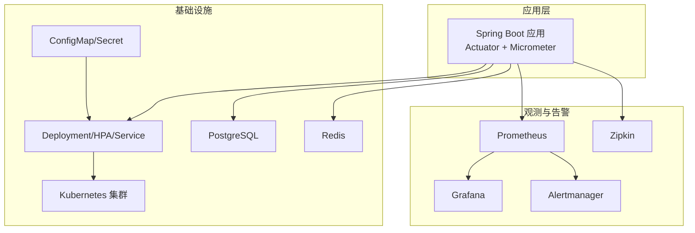
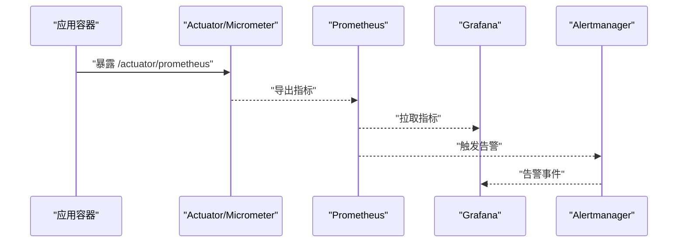
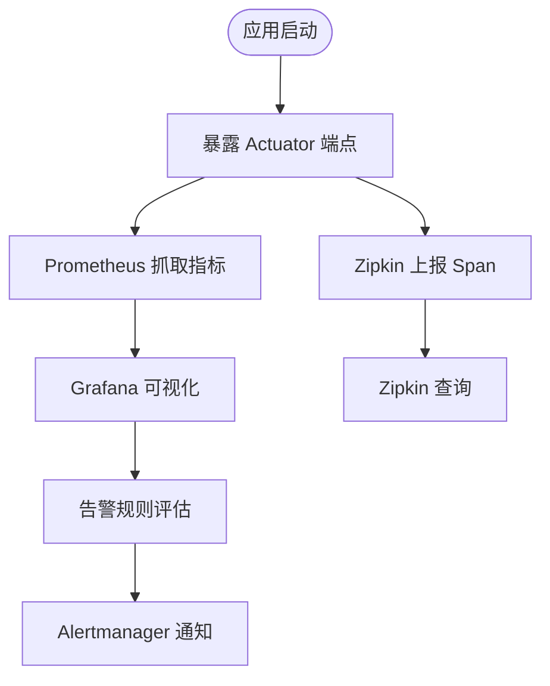
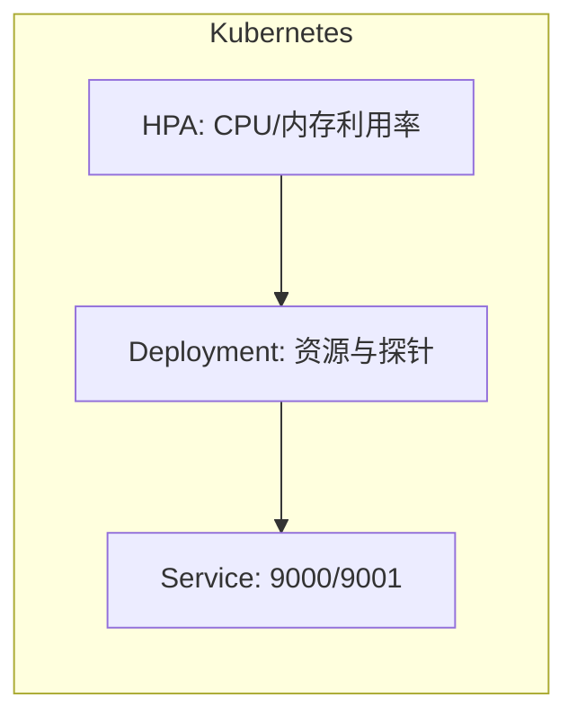
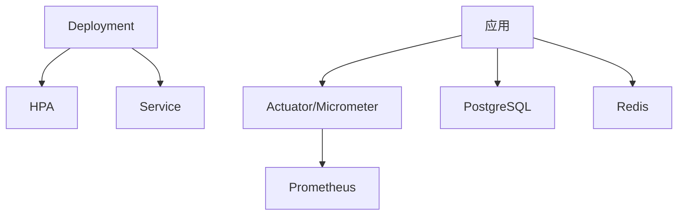

# 监控告警

<cite>
**本文引用的文件**
- [README.md](file://README.md)
- [application.yml](file://src/main/resources/application.yml)
- [application-dev.yml](file://src/main/resources/application-dev.yml)
- [application-prod.yml](file://src/main/resources/application-prod.yml)
- [Dockerfile](file://Dockerfile)
- [pom.xml](file://pom.xml)
- [deployment.yaml](file://k8s/base/deployment.yaml)
- [service.yaml](file://k8s/base/service.yaml)
- [hpa.yaml](file://k8s/base/hpa.yaml)
- [configmap.yaml](file://k8s/base/configmap.yaml)
- [secret.yaml](file://k8s/base/secret.yaml)
- [kustomization.yaml](file://k8s/base/kustomization.yaml)
</cite>

## 目录
1. [简介](#简介)
2. [项目结构](#项目结构)
3. [核心组件](#核心组件)
4. [架构总览](#架构总览)
5. [详细组件分析](#详细组件分析)
6. [依赖关系分析](#依赖关系分析)
7. [性能考量](#性能考量)
8. [故障排查指南](#故障排查指南)
9. [结论](#结论)
10. [附录](#附录)

## 简介
本指南面向IAM Platform认证服务的监控与告警体系建设，目标是帮助运维与开发团队建立完善的监控体系，覆盖应用指标、基础设施与业务指标，明确关键指标的含义与阈值设定，提供Prometheus、Grafana、Alertmanager的集成配置思路，并给出告警规则设计原则、级别划分与通知渠道建议。同时，结合本项目的Spring Boot Actuator、Micrometer、Prometheus、Zipkin链路追踪能力，以及Kubernetes部署与HPA自动伸缩配置，指导如何通过监控数据进行容量规划、性能调优与故障预测，并提供监控可视化与报表生成方法。

## 项目结构
本项目采用Spring Boot + Spring Authorization Server + JPA + Redis + Flyway的分层架构，容器化部署于Kubernetes，使用Kustomize管理多环境Overlay。Actuator暴露健康、指标与Prometheus端点，Micrometer集成Prometheus与Zipkin，便于统一观测与链路追踪。

图表来源
- [application.yml:63-77](file://src/main/resources/application.yml#L63-L77)
- [pom.xml:87-103](file://pom.xml#L87-L103)
- [deployment.yaml:17-54](file://k8s/base/deployment.yaml#L17-L54)
- [service.yaml:8-17](file://k8s/base/service.yaml#L8-L17)
- [hpa.yaml:1-25](file://k8s/base/hpa.yaml#L1-L25)
- [configmap.yaml:1-14](file://k8s/base/configmap.yaml#L1-L14)
- [secret.yaml:1-11](file://k8s/base/secret.yaml#L1-L11)

章节来源
- [README.md:1-388](file://README.md#L1-L388)
- [application.yml:1-78](file://src/main/resources/application.yml#L1-L78)
- [pom.xml:1-225](file://pom.xml#L1-L225)
- [k8s/base/kustomization.yaml:1-11](file://k8s/base/kustomization.yaml#L1-L11)

## 核心组件
- 应用观测与指标
  - Actuator：暴露health、info、metrics、prometheus端点，便于Prometheus抓取。
  - Micrometer：Prometheus指标注册、标签、采样率与Zipkin桥接。
- 容器与Kubernetes
  - Dockerfile：容器镜像构建、JVM参数、健康检查。
  - Deployment/Service/HPA：端口暴露、探针、资源限制与自动伸缩。
- 多环境配置
  - application.yml与各环境YAML：数据库、Redis、JWK、加密密钥、Zipkin端点、管理端口与采样率。
  - Kustomize：ConfigMap/Secret注入环境变量，Overlay切换环境。

章节来源
- [application.yml:63-77](file://src/main/resources/application.yml#L63-L77)
- [application-dev.yml:1-22](file://src/main/resources/application-dev.yml#L1-L22)
- [application-prod.yml:1-25](file://src/main/resources/application-prod.yml#L1-L25)
- [Dockerfile:34-59](file://Dockerfile#L34-L59)
- [deployment.yaml:17-54](file://k8s/base/deployment.yaml#L17-L54)
- [service.yaml:8-17](file://k8s/base/service.yaml#L8-L17)
- [hpa.yaml:1-25](file://k8s/base/hpa.yaml#L1-L25)
- [configmap.yaml:1-14](file://k8s/base/configmap.yaml#L1-L14)
- [secret.yaml:1-11](file://k8s/base/secret.yaml#L1-L11)

## 架构总览
下图展示了从应用到观测系统的整体链路，包括指标采集、可视化与告警流转。

图表来源
- [application.yml:63-77](file://src/main/resources/application.yml#L63-L77)
- [pom.xml:87-103](file://pom.xml#L87-L103)

## 详细组件分析

### 应用指标与可观测性
- 指标端点与采样
  - 管理端口与暴露：管理端口为9001，暴露health、info、metrics、prometheus端点。
  - 采样率：默认100%，生产环境可按需降低以减少开销。
- 指标标签
  - 应用名称作为公共标签，便于跨环境聚合与对比。
- Zipkin链路追踪
  - 通过Micrometer Brave桥接到Zipkin，采样端点可配置。

图表来源
- [application.yml:63-77](file://src/main/resources/application.yml#L63-L77)
- [pom.xml:87-103](file://pom.xml#L87-L103)

章节来源
- [application.yml:63-77](file://src/main/resources/application.yml#L63-L77)
- [application-dev.yml:1-22](file://src/main/resources/application-dev.yml#L1-L22)
- [application-prod.yml:1-25](file://src/main/resources/application-prod.yml#L1-L25)
- [pom.xml:87-103](file://pom.xml#L87-L103)

### 基础设施监控
- 容器与资源
  - CPU/内存请求与限制：CPU请求200m/限制1000m，内存请求512Mi/限制1Gi。
  - 健康检查：容器健康检查与K8s探针（就绪/存活/启动）。
- 服务与网络
  - Service暴露HTTP(9000)与管理(9001)端口。
- 自动伸缩
  - HPA基于CPU使用率与内存使用率进行弹性伸缩，目标利用率分别为70%与80%，副本范围1~5。

图表来源
- [deployment.yaml:17-54](file://k8s/base/deployment.yaml#L17-L54)
- [service.yaml:8-17](file://k8s/base/service.yaml#L8-L17)
- [hpa.yaml:1-25](file://k8s/base/hpa.yaml#L1-L25)

章节来源
- [deployment.yaml:17-54](file://k8s/base/deployment.yaml#L17-L54)
- [service.yaml:8-17](file://k8s/base/service.yaml#L8-L17)
- [hpa.yaml:1-25](file://k8s/base/hpa.yaml#L1-L25)

### 业务指标监控
- OIDC关键端点
  - 发现端点、授权端点、令牌端点、用户信息端点、JWKS、令牌撤销与内省端点。
- 业务关注点
  - 授权码流程、客户端凭证流程、刷新令牌、PKCE校验、令牌签发与撤销。
- 监控建议
  - 关注端点QPS、错误率、P95/P99延迟、令牌签发失败率、会话与缓存命中率。

章节来源
- [README.md:360-371](file://README.md#L360-L371)

### 容器与镜像
- JVM参数与容器支持
  - 容器化运行参数、最大堆百分比、随机源配置。
- 健康检查
  - 容器健康检查与应用级健康端点联动。

章节来源
- [Dockerfile:34-59](file://Dockerfile#L34-L59)

### 多环境配置与密钥
- 环境变量
  - 通过ConfigMap/Secret注入数据库、Redis、JWK、加密密钥、Zipkin端点、OIDC发行者URI等。
- 环境差异
  - 开发开启SQL日志与Swagger；生产关闭SQL日志与Swagger，降低开销与风险。

章节来源
- [configmap.yaml:1-14](file://k8s/base/configmap.yaml#L1-L14)
- [secret.yaml:1-11](file://k8s/base/secret.yaml#L1-L11)
- [application.yml:1-78](file://src/main/resources/application.yml#L1-L78)
- [application-dev.yml:1-22](file://src/main/resources/application-dev.yml#L1-L22)
- [application-prod.yml:1-25](file://src/main/resources/application-prod.yml#L1-L25)

## 依赖关系分析
- 组件耦合
  - 应用通过Actuator/Micrometer与Prometheus解耦，便于独立扩展观测系统。
  - HPA依赖资源指标，与Deployment/Service形成松耦合。
- 外部依赖
  - PostgreSQL与Redis为关键外部依赖，需纳入基础设施监控。
  - Zipkin用于分布式追踪，与Prometheus互补。

图表来源
- [pom.xml:87-103](file://pom.xml#L87-L103)
- [deployment.yaml:17-54](file://k8s/base/deployment.yaml#L17-L54)
- [service.yaml:8-17](file://k8s/base/service.yaml#L8-L17)
- [hpa.yaml:1-25](file://k8s/base/hpa.yaml#L1-L25)

章节来源
- [pom.xml:87-103](file://pom.xml#L87-L103)
- [k8s/base/kustomization.yaml:1-11](file://k8s/base/kustomization.yaml#L1-L11)

## 性能考量
- 指标采样与开销
  - 生产环境可降低Zipkin采样概率以平衡可观测性与性能。
- 资源配额与伸缩
  - HPA目标利用率与副本上限需结合历史流量与峰值进行调优。
- 数据库与缓存
  - Hikari连接池大小、Redis连接与过期策略影响延迟与吞吐。
- JVM与容器
  - 容器内存限制与JVM参数需匹配，避免OOM与频繁GC。

章节来源
- [application-prod.yml:1-25](file://src/main/resources/application-prod.yml#L1-L25)
- [hpa.yaml:1-25](file://k8s/base/hpa.yaml#L1-L25)
- [application.yml:9-18](file://src/main/resources/application.yml#L9-L18)
- [Dockerfile:55-58](file://Dockerfile#L55-L58)

## 故障排查指南
- 健康与就绪
  - 若Pod反复重启，检查就绪/存活探针路径与返回状态。
- 指标缺失
  - 确认Actuator端点暴露与Prometheus抓取配置。
- 链路追踪
  - 检查Zipkin端点配置与采样率，确保Span上报正常。
- 数据库与缓存
  - 关注连接池耗尽、慢查询与缓存失效导致的延迟上升。
- 日志与告警
  - 结合Grafana仪表盘与Alertmanager通知，定位异常时段与根因。

章节来源
- [deployment.yaml:37-54](file://k8s/base/deployment.yaml#L37-L54)
- [application.yml:63-77](file://src/main/resources/application.yml#L63-L77)
- [application-dev.yml:12-17](file://src/main/resources/application-dev.yml#L12-L17)

## 结论
本项目已具备完善的观测基础：Actuator与Micrometer、Prometheus端点、Zipkin桥接、K8s探针与HPA。建议在此基础上补充业务指标（OIDC端点QPS/错误率/延迟）、数据库与缓存指标、以及针对不同环境的差异化采样策略。通过合理的告警规则与通知渠道，结合容量规划与性能调优，可显著提升系统的稳定性与可维护性。

## 附录

### 监控指标与阈值建议
- 应用指标
  - 响应时间（P95/P99）：根据SLA设定阈值，如授权端点P99>2s触发预警。
  - 错误率：全局错误率>1%、特定端点错误率>5%触发告警。
  - 吞吐量：QPS下降超过30%可能预示异常。
  - 资源使用：CPU/内存利用率接近HPA目标利用率时提前预警。
- 基础设施
  - Pod重启次数、容器健康检查失败率、HPA扩容/缩容频率。
- 业务指标
  - 令牌签发成功率、会话创建/销毁速率、用户登录/授权失败率。

### Prometheus、Grafana、Alertmanager集成步骤
- Prometheus
  - 配置静态目标或Kubernetes SD，抓取应用管理端口指标。
- Grafana
  - 导入常用模板（JVM、Spring Boot、Kubernetes），创建业务看板。
- Alertmanager
  - 定义路由、接收器（邮件/IM/电话），区分级别（警告/严重/致命）。

### 告警规则设计原则与级别
- 原则
  - 明确根因、避免噪音、分级分层、可验证可恢复。
- 级别
  - 警告：潜在风险，需关注；严重：影响可用性，需立即处理；致命：系统性故障，需SOS。
- 通知渠道
  - 邮件、IM（如钉钉/企业微信）、电话（仅致命），并配置静默窗口与抑制规则。

### 容量规划、性能调优与故障预测
- 容量规划
  - 基于历史流量与增长趋势，结合HPA目标利用率与副本上限，估算所需资源。
- 性能调优
  - 优化数据库索引、连接池参数、Redis缓存命中率；调整JVM参数与容器资源。
- 故障预测
  - 通过异常检测与趋势分析，提前发现资源瓶颈与异常波动。

### 监控数据可视化与报表
- 可视化
  - Grafana仪表盘：应用指标、基础设施、业务指标三类看板。
- 报表
  - 按日/周/月生成SLA报告、容量使用报告与故障统计报告。