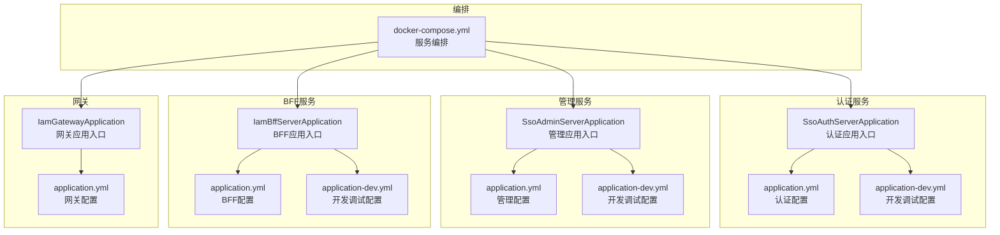
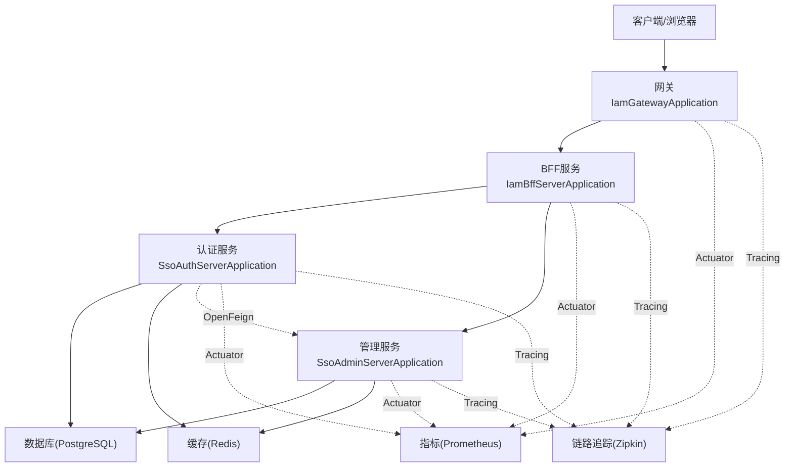
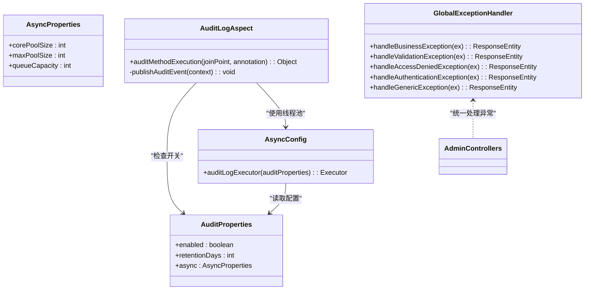
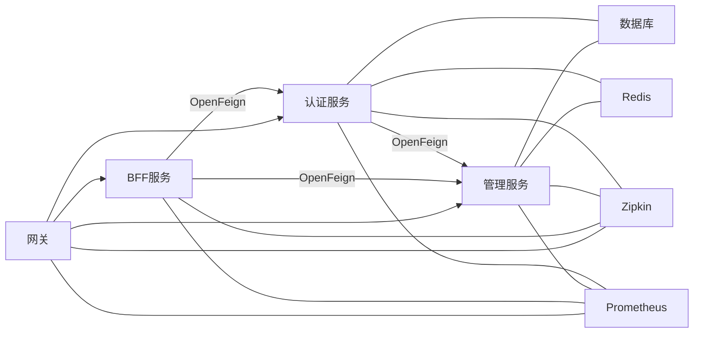

# 调试工具与技巧

<cite>
**本文引用的文件**
- [SsoAdminServerApplication.java](file://iam-admin-server/src/main/java/iam/platform/admin/SsoAdminServerApplication.java)
- [application.yml（管理服务）](file://iam-admin-server/src/main/resources/application.yml)
- [application-dev.yml（管理服务）](file://iam-admin-server/src/main/resources/application-dev.yml)
- [GlobalExceptionHandler.java（管理服务）](file://iam-admin-server/src/main/java/iam/platform/admin/interfaces/rest/common/GlobalExceptionHandler.java)
- [AuditLogAspect.java（管理服务）](file://iam-admin-server/src/main/java/iam/platform/admin/infrastructure/aspect/AuditLogAspect.java)
- [AuditProperties.java（管理服务）](file://iam-admin-server/src/main/java/iam/platform/admin/infrastructure/config/AuditProperties.java)
- [AsyncConfig.java（管理服务）](file://iam-admin-server/src/main/java/iam/platform/admin/infrastructure/config/AsyncConfig.java)
- [SsoAuthServerApplication.java](file://iam-auth-server/src/main/java/iam/platform/auth/SsoAuthServerApplication.java)
- [application.yml（认证服务）](file://iam-auth-server/src/main/resources/application.yml)
- [application-dev.yml（认证服务）](file://iam-auth-server/src/main/resources/application-dev.yml)
- [IamBffServerApplication.java](file://iam-bff-server/src/main/java/iam/platform/bff/IamBffServerApplication.java)
- [application.yml（BFF服务）](file://iam-bff-server/src/main/resources/application.yml)
- [application-dev.yml（BFF服务）](file://iam-bff-server/src/main/resources/application-dev.yml)
- [IamGatewayApplication.java](file://iam-gateway/src/main/java/iam/platform/gateway/IamGatewayApplication.java)
- [application.yml（网关）](file://iam-gateway/src/main/resources/application.yml)
- [docker-compose.yml](file://docker-compose.yml)
- [README.md](file://README.md)
</cite>

## 目录
1. [简介](#简介)
2. [项目结构](#项目结构)
3. [核心组件](#核心组件)
4. [架构总览](#架构总览)
5. [详细组件分析](#详细组件分析)
6. [依赖分析](#依赖分析)
7. [性能考虑](#性能考虑)
8. [故障排查指南](#故障排查指南)
9. [结论](#结论)
10. [附录](#附录)

## 简介
本指南面向IAM平台的开发与运维人员，系统性地总结了在本地与容器化环境中进行调试的方法与技巧。内容覆盖IDE断点调试、远程调试、日志动态调整、网络请求测试、数据库调试、性能分析工具以及标准化的排障流程。文档以实际源码与配置为依据，帮助快速定位问题并提升诊断效率。

## 项目结构
IAM平台采用多模块微服务架构，包含认证服务、管理服务、BFF服务与网关，并通过docker-compose统一编排。各服务均提供独立的Spring Boot入口类与配置文件，便于分别启动与调试。

图表来源
- [SsoAuthServerApplication.java:1-19](file://iam-auth-server/src/main/java/iam/platform/auth/SsoAuthServerApplication.java#L1-L19)
- [application.yml（认证服务）:1-144](file://iam-auth-server/src/main/resources/application.yml#L1-L144)
- [application-dev.yml（认证服务）:1-26](file://iam-auth-server/src/main/resources/application-dev.yml#L1-L26)
- [SsoAdminServerApplication.java:1-17](file://iam-admin-server/src/main/java/iam/platform/admin/SsoAdminServerApplication.java#L1-L17)
- [application.yml（管理服务）:1-102](file://iam-admin-server/src/main/resources/application.yml#L1-L102)
- [application-dev.yml（管理服务）:1-26](file://iam-admin-server/src/main/resources/application-dev.yml#L1-L26)
- [IamBffServerApplication.java:1-17](file://iam-bff-server/src/main/java/iam/platform/bff/IamBffServerApplication.java#L1-L17)
- [application.yml（BFF服务）:1-54](file://iam-bff-server/src/main/resources/application.yml#L1-L54)
- [application-dev.yml（BFF服务）:1-9](file://iam-bff-server/src/main/resources/application-dev.yml#L1-L9)
- [IamGatewayApplication.java:1-15](file://iam-gateway/src/main/java/iam/platform/gateway/IamGatewayApplication.java#L1-L15)
- [application.yml（网关）:1-116](file://iam-gateway/src/main/resources/application.yml#L1-L116)
- [docker-compose.yml](file://docker-compose.yml)

章节来源
- [SsoAuthServerApplication.java:1-19](file://iam-auth-server/src/main/java/iam/platform/auth/SsoAuthServerApplication.java#L1-L19)
- [SsoAdminServerApplication.java:1-17](file://iam-admin-server/src/main/java/iam/platform/admin/SsoAdminServerApplication.java#L1-L17)
- [IamBffServerApplication.java:1-17](file://iam-bff-server/src/main/java/iam/platform/bff/IamBffServerApplication.java#L1-L17)
- [IamGatewayApplication.java:1-15](file://iam-gateway/src/main/java/iam/platform/gateway/IamGatewayApplication.java#L1-L15)
- [application.yml（认证服务）:1-144](file://iam-auth-server/src/main/resources/application.yml#L1-L144)
- [application.yml（管理服务）:1-102](file://iam-admin-server/src/main/resources/application.yml#L1-L102)
- [application.yml（BFF服务）:1-54](file://iam-bff-server/src/main/resources/application.yml#L1-L54)
- [application.yml（网关）:1-116](file://iam-gateway/src/main/resources/application.yml#L1-L116)
- [docker-compose.yml](file://docker-compose.yml)

## 核心组件
- 应用入口：每个服务均提供Spring Boot入口类，负责加载配置与启动容器。
- 配置体系：生产与开发环境分离，开发模式下开启SQL格式化、模板缓存关闭、日志级别提升等便于调试。
- 异步审计：管理服务通过AOP切面与线程池异步记录审计事件，支持动态开关与队列容量控制。
- 全局异常处理：管理服务提供统一异常映射，便于定位业务异常与参数校验错误。
- 运行时监控：各服务暴露Actuator端点，集成Prometheus与Zipkin，支持指标采集与链路追踪。

章节来源
- [SsoAuthServerApplication.java:1-19](file://iam-auth-server/src/main/java/iam/platform/auth/SsoAuthServerApplication.java#L1-L19)
- [SsoAdminServerApplication.java:1-17](file://iam-admin-server/src/main/java/iam/platform/admin/SsoAdminServerApplication.java#L1-L17)
- [IamBffServerApplication.java:1-17](file://iam-bff-server/src/main/java/iam/platform/bff/IamBffServerApplication.java#L1-L17)
- [IamGatewayApplication.java:1-15](file://iam-gateway/src/main/java/iam/platform/gateway/IamGatewayApplication.java#L1-L15)
- [application-dev.yml（管理服务）:1-26](file://iam-admin-server/src/main/resources/application-dev.yml#L1-L26)
- [application-dev.yml（认证服务）:1-26](file://iam-auth-server/src/main/resources/application-dev.yml#L1-L26)
- [application-dev.yml（BFF服务）:1-9](file://iam-bff-server/src/main/resources/application-dev.yml#L1-L9)
- [AuditLogAspect.java:1-66](file://iam-admin-server/src/main/java/iam/platform/admin/infrastructure/aspect/AuditLogAspect.java#L1-L66)
- [AuditProperties.java:1-36](file://iam-admin-server/src/main/java/iam/platform/admin/infrastructure/config/AuditProperties.java#L1-L36)
- [AsyncConfig.java:1-30](file://iam-admin-server/src/main/java/iam/platform/admin/infrastructure/config/AsyncConfig.java#L1-L30)
- [GlobalExceptionHandler.java（管理服务）:1-101](file://iam-admin-server/src/main/java/iam/platform/admin/interfaces/rest/common/GlobalExceptionHandler.java#L1-L101)

## 架构总览
IAM平台由认证服务、管理服务、BFF服务与网关组成，服务间通过OpenFeign与Spring Cloud Gateway进行通信；数据库与Redis用于持久化与会话存储；Zipkin用于链路追踪；Prometheus用于指标采集。

图表来源
- [IamGatewayApplication.java:1-15](file://iam-gateway/src/main/java/iam/platform/gateway/IamGatewayApplication.java#L1-L15)
- [IamBffServerApplication.java:1-17](file://iam-bff-server/src/main/java/iam/platform/bff/IamBffServerApplication.java#L1-L17)
- [SsoAuthServerApplication.java:1-19](file://iam-auth-server/src/main/java/iam/platform/auth/SsoAuthServerApplication.java#L1-L19)
- [SsoAdminServerApplication.java:1-17](file://iam-admin-server/src/main/java/iam/platform/admin/SsoAdminServerApplication.java#L1-L17)
- [application.yml（网关）:1-116](file://iam-gateway/src/main/resources/application.yml#L1-L116)
- [application.yml（BFF服务）:1-54](file://iam-bff-server/src/main/resources/application.yml#L1-L54)
- [application.yml（认证服务）:1-144](file://iam-auth-server/src/main/resources/application.yml#L1-L144)
- [application.yml（管理服务）:1-102](file://iam-admin-server/src/main/resources/application.yml#L1-L102)

## 详细组件分析

### 管理服务调试要点
- 启动入口与扫描范围：确认入口类已启用配置属性扫描与JPA仓库扫描，避免遗漏自定义配置或实体。
- 开发模式配置：开启show-sql与format_sql，关闭模板缓存，提升SQL与页面渲染调试可见度。
- 日志级别：将根日志级别与安全、Hibernate SQL日志提升至DEBUG，便于捕获异常与SQL执行细节。
- 全局异常处理：统一映射业务异常、参数校验异常、鉴权与访问拒绝异常，便于前端与测试快速定位问题。
- 审计日志：AOP切面拦截标注审计注解的方法，异步写入，线程池可配置，失败时记录发布异常日志。

图表来源
- [AuditProperties.java:1-36](file://iam-admin-server/src/main/java/iam/platform/admin/infrastructure/config/AuditProperties.java#L1-L36)
- [AsyncConfig.java:1-30](file://iam-admin-server/src/main/java/iam/platform/admin/infrastructure/config/AsyncConfig.java#L1-L30)
- [AuditLogAspect.java:1-66](file://iam-admin-server/src/main/java/iam/platform/admin/infrastructure/aspect/AuditLogAspect.java#L1-L66)
- [GlobalExceptionHandler.java（管理服务）:1-101](file://iam-admin-server/src/main/java/iam/platform/admin/interfaces/rest/common/GlobalExceptionHandler.java#L1-L101)

章节来源
- [SsoAdminServerApplication.java:1-17](file://iam-admin-server/src/main/java/iam/platform/admin/SsoAdminServerApplication.java#L1-L17)
- [application-dev.yml（管理服务）:1-26](file://iam-admin-server/src/main/resources/application-dev.yml#L1-L26)
- [GlobalExceptionHandler.java（管理服务）:1-101](file://iam-admin-server/src/main/java/iam/platform/admin/interfaces/rest/common/GlobalExceptionHandler.java#L1-L101)
- [AuditLogAspect.java:1-66](file://iam-admin-server/src/main/java/iam/platform/admin/infrastructure/aspect/AuditLogAspect.java#L1-L66)
- [AuditProperties.java:1-36](file://iam-admin-server/src/main/java/iam/platform/admin/infrastructure/config/AuditProperties.java#L1-L36)
- [AsyncConfig.java:1-30](file://iam-admin-server/src/main/java/iam/platform/admin/infrastructure/config/AsyncConfig.java#L1-L30)

### 认证服务调试要点
- 启动入口：启用配置属性扫描、JPA仓库扫描与Feign客户端，确保外部服务调用与配置生效。
- 开发模式：关闭Flyway迁移（避免重复初始化），开启模板缓存关闭，便于前端调试。
- 安全策略：速率限制、账户锁定阈值、IP白名单/黑名单等策略可通过配置项快速调整。
- CAS与OIDC适配：通过协议适配器与路由配置，结合调试日志定位票据与登录流程问题。

章节来源
- [SsoAuthServerApplication.java:1-19](file://iam-auth-server/src/main/java/iam/platform/auth/SsoAuthServerApplication.java#L1-L19)
- [application-dev.yml（认证服务）:1-26](file://iam-auth-server/src/main/resources/application-dev.yml#L1-L26)
- [application.yml（认证服务）:1-144](file://iam-auth-server/src/main/resources/application.yml#L1-L144)

### BFF服务调试要点
- 启动入口：启用服务发现与Feign客户端，便于调用下游认证与管理服务。
- 开发模式：开启DEBUG日志，关闭模板缓存，缩短连接与读取超时，提升联调效率。
- 日志级别：对OpenFeign进行单独DEBUG，便于观察HTTP请求与响应细节。

章节来源
- [IamBffServerApplication.java:1-17](file://iam-bff-server/src/main/java/iam/platform/bff/IamBffServerApplication.java#L1-L17)
- [application-dev.yml（BFF服务）:1-9](file://iam-bff-server/src/main/resources/application-dev.yml#L1-L9)
- [application.yml（BFF服务）:1-54](file://iam-bff-server/src/main/resources/application.yml#L1-L54)

### 网关调试要点
- 启动入口：启用服务发现，便于从注册中心动态路由到下游服务。
- 路由与过滤：基于路径与域名的路由规则清晰，配合全局跨域配置便于前后端联调。
- 安全日控：资源服务器JWT配置与OAuth2客户端配置明确，便于定位鉴权失败问题。
- 日志级别：对网关与Spring Security开启DEBUG，有助于排查请求拦截与转发问题。

章节来源
- [IamGatewayApplication.java:1-15](file://iam-gateway/src/main/java/iam/platform/gateway/IamGatewayApplication.java#L1-L15)
- [application.yml（网关）:1-116](file://iam-gateway/src/main/resources/application.yml#L1-L116)

## 依赖分析
- 模块耦合：服务间通过OpenFeign与服务名进行松耦合调用；网关集中路由，降低客户端复杂度。
- 外部依赖：数据库、Redis、Zipkin、Prometheus均为可配置项，便于在不同环境切换。
- 运行时暴露：各服务通过Actuator暴露健康、指标与网关详情端点，便于监控与排障。

图表来源
- [application.yml（认证服务）:1-144](file://iam-auth-server/src/main/resources/application.yml#L1-L144)
- [application.yml（管理服务）:1-102](file://iam-admin-server/src/main/resources/application.yml#L1-L102)
- [application.yml（BFF服务）:1-54](file://iam-bff-server/src/main/resources/application.yml#L1-L54)
- [application.yml（网关）:1-116](file://iam-gateway/src/main/resources/application.yml#L1-L116)

章节来源
- [application.yml（认证服务）:1-144](file://iam-auth-server/src/main/resources/application.yml#L1-L144)
- [application.yml（管理服务）:1-102](file://iam-admin-server/src/main/resources/application.yml#L1-L102)
- [application.yml（BFF服务）:1-54](file://iam-bff-server/src/main/resources/application.yml#L1-L54)
- [application.yml（网关）:1-116](file://iam-gateway/src/main/resources/application.yml#L1-L116)

## 性能考虑
- 指标采集：各服务通过Actuator暴露指标端点，结合Prometheus抓取，形成统一监控面板。
- 链路追踪：Zipkin端点可配置，采样概率可调，建议在开发环境提高采样率以便定位慢调用。
- 数据库连接池：HikariCP参数已在配置中设定，建议结合慢查询日志与执行计划分析定位瓶颈。
- 缓存与会话：Redis作为会话存储，注意键空间与过期策略对性能的影响。

章节来源
- [application.yml（认证服务）:76-144](file://iam-auth-server/src/main/resources/application.yml#L76-L144)
- [application.yml（管理服务）:76-102](file://iam-admin-server/src/main/resources/application.yml#L76-L102)
- [application.yml（BFF服务）:33-54](file://iam-bff-server/src/main/resources/application.yml#L33-L54)
- [application.yml（网关）:93-116](file://iam-gateway/src/main/resources/application.yml#L93-L116)

## 故障排查指南

### IDE断点调试
- 断点位置建议
  - 控制器层：定位请求进入与返回路径，观察参数绑定与权限校验。
  - 业务服务层：定位核心流程与分支逻辑，关注异常抛出点。
  - 持久层：定位SQL执行与事务边界，结合开发模式SQL日志核对。
- 变量监视
  - 关注上下文对象（如审计上下文、用户上下文、租户上下文）。
  - 观察集合与流式处理中间结果，定位数据转换异常。
- 调用栈分析
  - 结合全局异常处理器定位异常来源，查看异常堆栈与业务码。
- 条件断点
  - 对特定参数或异常类型设置条件断点，减少无效中断。

章节来源
- [GlobalExceptionHandler.java（管理服务）:1-101](file://iam-admin-server/src/main/java/iam/platform/admin/interfaces/rest/common/GlobalExceptionHandler.java#L1-L101)
- [AuditLogAspect.java:1-66](file://iam-admin-server/src/main/java/iam/platform/admin/infrastructure/aspect/AuditLogAspect.java#L1-L66)

### 远程调试配置
- JVM参数
  - 在启动脚本或容器环境变量中添加远程调试参数，开放调试端口。
- 调试端口
  - 确认服务监听的调试端口与IDE一致，避免端口冲突。
- 连接建立
  - 使用IDE Attach到目标进程，选择对应服务实例，建立连接后即可断点调试。

章节来源
- [application.yml（认证服务）:1-144](file://iam-auth-server/src/main/resources/application.yml#L1-L144)
- [application.yml（管理服务）:1-102](file://iam-admin-server/src/main/resources/application.yml#L1-L102)
- [application.yml（BFF服务）:1-54](file://iam-bff-server/src/main/resources/application.yml#L1-L54)
- [application.yml（网关）:1-116](file://iam-gateway/src/main/resources/application.yml#L1-L116)

### 日志调试技术
- 动态日志级别
  - 开发模式下提升根日志级别与关键包日志级别，观察SQL、安全、网关与Feign交互。
- 条件日志输出
  - 对异常与关键路径增加日志，区分WARN/ERROR等级，便于筛选。
- 调试信息收集
  - 结合全局异常处理器与审计切面，确保异常与操作均有记录，便于回溯。

章节来源
- [application-dev.yml（管理服务）:16-26](file://iam-admin-server/src/main/resources/application-dev.yml#L16-L26)
- [application-dev.yml（认证服务）:1-26](file://iam-auth-server/src/main/resources/application-dev.yml#L1-L26)
- [application-dev.yml（BFF服务）:1-9](file://iam-bff-server/src/main/resources/application-dev.yml#L1-L9)
- [GlobalExceptionHandler.java（管理服务）:1-101](file://iam-admin-server/src/main/java/iam/platform/admin/interfaces/rest/common/GlobalExceptionHandler.java#L1-L101)
- [AuditLogAspect.java:1-66](file://iam-admin-server/src/main/java/iam/platform/admin/infrastructure/aspect/AuditLogAspect.java#L1-L66)

### 网络调试工具
- curl命令
  - 用于验证HTTP端点、携带Cookie与Header、模拟不同请求体。
- Postman
  - 用于构建复杂请求场景，保存环境变量与预演脚本，便于回归测试。
- 抓包分析
  - 使用抓包工具观察TLS握手、重定向与跨域头，辅助定位网络与证书问题。

章节来源
- [application.yml（网关）:55-68](file://iam-gateway/src/main/resources/application.yml#L55-L68)
- [application.yml（BFF服务）:25-32](file://iam-bff-server/src/main/resources/application.yml#L25-L32)

### 数据库调试技巧
- SQL执行计划
  - 在开发模式开启SQL输出，结合数据库执行计划分析慢查询与索引缺失。
- 事务状态
  - 观察事务边界与异常回滚点，结合审计日志定位业务失败原因。
- 死锁检测
  - 利用数据库死锁日志与锁等待信息，定位并发冲突热点。

章节来源
- [application-dev.yml（管理服务）:2-7](file://iam-admin-server/src/main/resources/application-dev.yml#L2-L7)
- [application.yml（认证服务）:15-24](file://iam-auth-server/src/main/resources/application.yml#L15-L24)
- [application.yml（管理服务）:15-24](file://iam-admin-server/src/main/resources/application.yml#L15-L24)

### 性能分析工具
- JProfiler/VisualVM
  - 用于CPU、内存与线程分析，结合服务端口与JVM参数进行Attach分析。
- APM工具
  - 结合Zipkin链路与Prometheus指标，定位慢调用与高延迟路径。

章节来源
- [application.yml（认证服务）:86-91](file://iam-auth-server/src/main/resources/application.yml#L86-L91)
- [application.yml（管理服务）:86-91](file://iam-admin-server/src/main/resources/application.yml#L86-L91)
- [application.yml（BFF服务）:43-48](file://iam-bff-server/src/main/resources/application.yml#L43-L48)
- [application.yml（网关）:103-108](file://iam-gateway/src/main/resources/application.yml#L103-L108)

### 标准化排障流程
- 现象描述与复现步骤
- 环境与版本信息（服务版本、数据库版本、JDK版本）
- 关键日志与异常堆栈
- 请求链路与依赖服务状态
- 快速修复与回归验证

章节来源
- [GlobalExceptionHandler.java（管理服务）:1-101](file://iam-admin-server/src/main/java/iam/platform/admin/interfaces/rest/common/GlobalExceptionHandler.java#L1-L101)
- [AuditLogAspect.java:1-66](file://iam-admin-server/src/main/java/iam/platform/admin/infrastructure/aspect/AuditLogAspect.java#L1-L66)

## 结论
通过结合IDE断点调试、远程调试、日志动态调整、网络与数据库调试以及性能分析工具，可以系统性地提升IAM平台的开发与运维效率。建议在开发环境充分启用调试配置，在生产环境保持可观测性与最小侵入性，形成标准化的排障流程与知识沉淀。

## 附录
- 启动与编排
  - 使用docker-compose一键启动所有服务，便于端到端调试。
- 文档与设计
  - 参考项目文档与设计说明，理解协议与流程，有助于快速定位问题。

章节来源
- [docker-compose.yml](file://docker-compose.yml)
- [README.md](file://README.md)