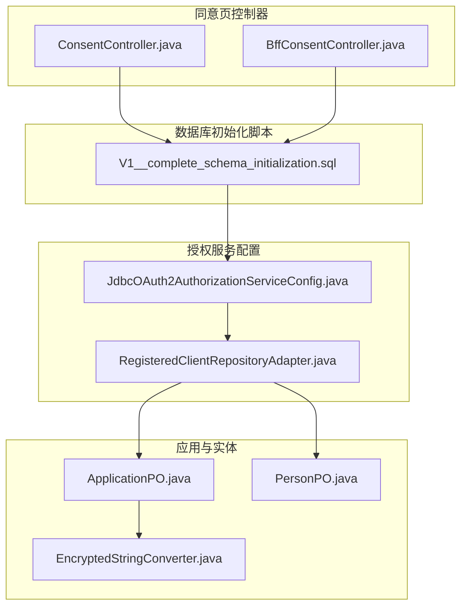
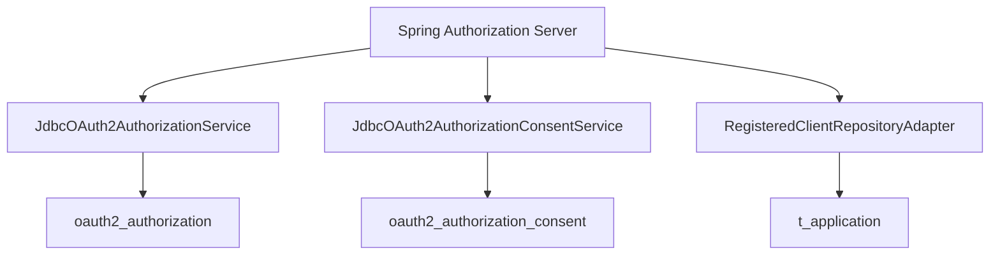
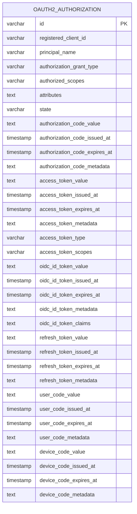
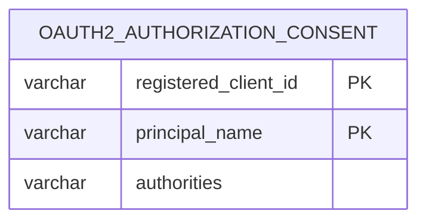
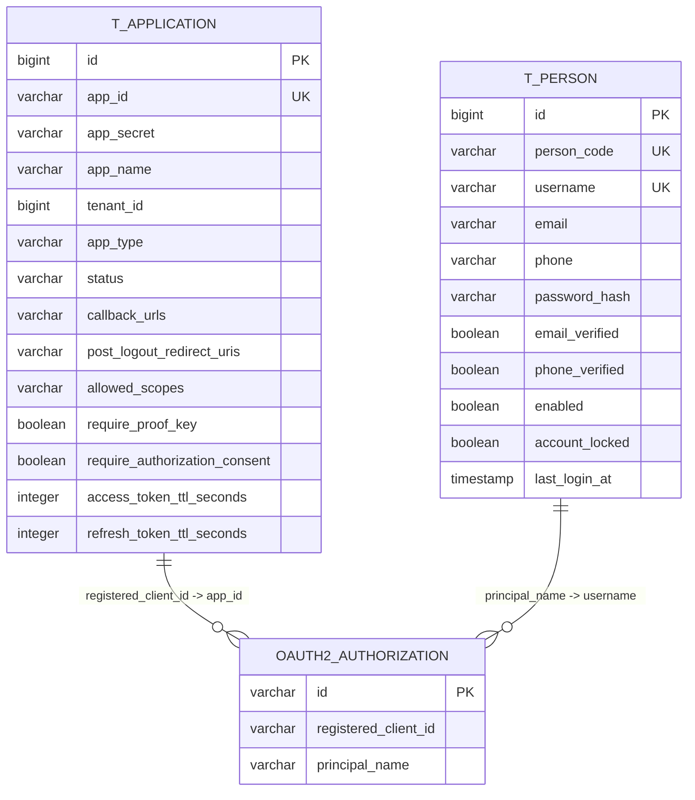
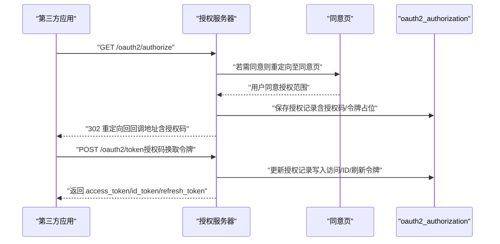
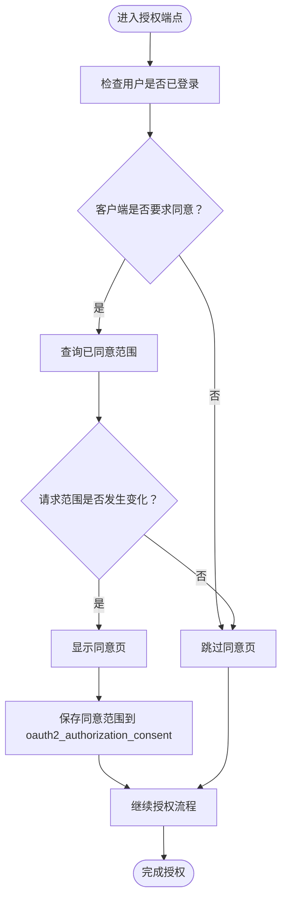
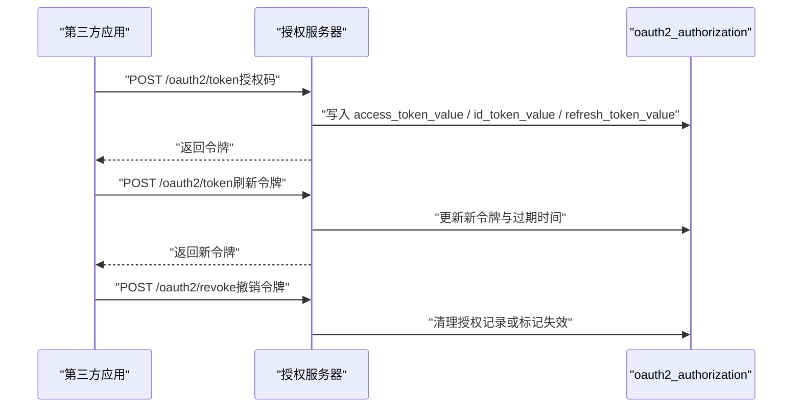
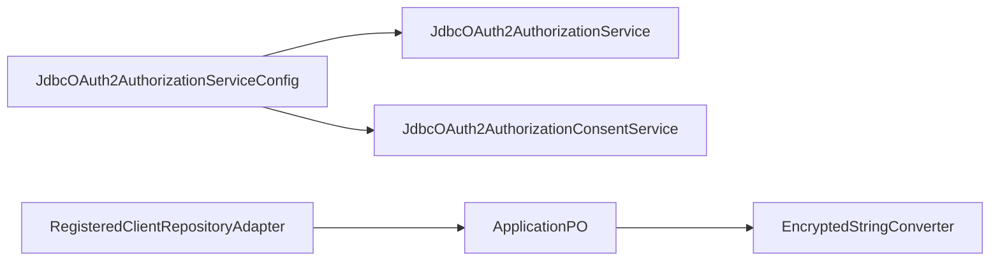

# OAuth2表设计

<cite>
**本文引用的文件**
- [V1__complete_schema_initialization.sql](file://iam-admin-server/src/main/resources/db/migration/V1__complete_schema_initialization.sql)
- [Spring Authorization Server 原理与流程.md](file://docs/design/Spring Authorization Server 原理与流程.md)
- [JdbcOAuth2AuthorizationServiceConfig.java](file://iam-auth-server/src/main/java/iam/platform/auth/infrastructure/security/JdbcOAuth2AuthorizationServiceConfig.java)
- [RegisteredClientRepositoryAdapter.java](file://iam-auth-server/src/main/java/iam/platform/auth/infrastructure/security/RegisteredClientRepositoryAdapter.java)
- [ApplicationPO.java](file://iam-auth-server/src/main/java/iam/platform/auth/infrastructure/persistence/entity/ApplicationPO.java)
- [EncryptedStringConverter.java](file://iam-auth-server/src/main/java/iam/platform/auth/infrastructure/persistence/converter/EncryptedStringConverter.java)
- [PersonPO.java](file://iam-auth-server/src/main/java/iam/platform/auth/infrastructure/persistence/entity/PersonPO.java)
- [ConsentController.java](file://iam-auth-server/src/main/java/iam/platform/auth/interfaces/web/ConsentController.java)
- [BffConsentController.java](file://iam-bff-server/src/main/java/iam/platform/bff/interfaces/web/BffConsentController.java)
</cite>

## 目录
1. [引言](#引言)
2. [项目结构](#项目结构)
3. [核心组件](#核心组件)
4. [架构总览](#架构总览)
5. [详细组件分析](#详细组件分析)
6. [依赖分析](#依赖分析)
7. [性能考量](#性能考量)
8. [故障排查指南](#故障排查指南)
9. [结论](#结论)
10. [附录](#附录)

## 引言
本文件系统性梳理基于 Spring Authorization Server 的 OAuth2/ OIDC 表设计与数据流，重点覆盖：
- Spring Authorization Server 集成所需的 oauth2_authorization 与 oauth2_authorization_consent 表结构与字段语义
- 授权码、访问令牌、刷新令牌、ID Token 的存储策略与生命周期管理
- 授权同意（Consent）的持久化与范围校验机制
- 与核心业务表（Person、Application）的关联关系与外键约束
- 令牌颁发、刷新、撤销的完整数据流图
- 安全性考虑（令牌加密、过期管理、安全存储策略）

## 项目结构
围绕 OAuth2/OIDC 的数据库结构主要分布在以下位置：
- 初始化脚本：iam-admin-server/src/main/resources/db/migration/V1__complete_schema_initialization.sql
- 文档说明：docs/design/Spring Authorization Server 原理与流程.md
- 授权服务配置：iam-auth-server/.../security/JdbcOAuth2AuthorizationServiceConfig.java
- 客户端适配器：iam-auth-server/.../security/RegisteredClientRepositoryAdapter.java
- 应用实体与加密转换器：iam-auth-server/.../persistence/entity/ApplicationPO.java、EncryptedStringConverter.java
- 用户实体：iam-auth-server/.../persistence/entity/PersonPO.java
- 同意页控制器：iam-auth-server/.../web/ConsentController.java；BFF同意页控制器：iam-bff-server/.../web/BffConsentController.java

**图表来源**
- [V1__complete_schema_initialization.sql:111-166](file://iam-admin-server/src/main/resources/db/migration/V1__complete_schema_initialization.sql#L111-L166)
- [JdbcOAuth2AuthorizationServiceConfig.java:15-25](file://iam-auth-server/src/main/java/iam/platform/auth/infrastructure/security/JdbcOAuth2AuthorizationServiceConfig.java#L15-L25)
- [RegisteredClientRepositoryAdapter.java:47-99](file://iam-auth-server/src/main/java/iam/platform/auth/infrastructure/security/RegisteredClientRepositoryAdapter.java#L47-L99)
- [ApplicationPO.java:35-93](file://iam-auth-server/src/main/java/iam/platform/auth/infrastructure/persistence/entity/ApplicationPO.java#L35-L93)
- [EncryptedStringConverter.java:28-41](file://iam-auth-server/src/main/java/iam/platform/auth/infrastructure/persistence/converter/EncryptedStringConverter.java#L28-L41)
- [PersonPO.java:23-52](file://iam-auth-server/src/main/java/iam/platform/auth/infrastructure/persistence/entity/PersonPO.java#L23-L52)
- [ConsentController.java:10-16](file://iam-auth-server/src/main/java/iam/platform/auth/interfaces/web/ConsentController.java#L10-L16)
- [BffConsentController.java:16-33](file://iam-bff-server/src/main/java/iam/platform/bff/interfaces/web/BffConsentController.java#L16-L33)

**章节来源**
- [V1__complete_schema_initialization.sql:111-166](file://iam-admin-server/src/main/resources/db/migration/V1__complete_schema_initialization.sql#L111-L166)
- [Spring Authorization Server 原理与流程.md:697-771](file://docs/design/Spring Authorization Server 原理与流程.md#L697-L771)

## 核心组件
- oauth2_authorization：Spring Authorization Server 授权记录存储表，承载授权码、访问令牌、刷新令牌、ID Token 及其元数据、过期时间等
- oauth2_authorization_consent：授权同意存储表，记录用户对客户端授权范围的同意情况
- t_application：应用（OAuth2 客户端）表，承载回调地址、允许的 scopes、令牌 TTL、是否要求 PKCE/同意等
- t_person：自然人身份表，作为授权主体 principal_name 的来源之一
- 加密转换器 EncryptedStringConverter：对应用密钥进行 AES-256-GCM 加密存储

**章节来源**
- [V1__complete_schema_initialization.sql:111-166](file://iam-admin-server/src/main/resources/db/migration/V1__complete_schema_initialization.sql#L111-L166)
- [ApplicationPO.java:35-93](file://iam-auth-server/src/main/java/iam/platform/auth/infrastructure/persistence/entity/ApplicationPO.java#L35-L93)
- [EncryptedStringConverter.java:28-41](file://iam-auth-server/src/main/java/iam/platform/auth/infrastructure/persistence/converter/EncryptedStringConverter.java#L28-L41)
- [PersonPO.java:23-52](file://iam-auth-server/src/main/java/iam/platform/auth/infrastructure/persistence/entity/PersonPO.java#L23-L52)

## 架构总览
Spring Authorization Server 在授权流程中依赖 JDBC 实现的授权与同意服务，将授权状态持久化到 oauth2_authorization 与 oauth2_authorization_consent 表，并通过 RegisteredClientRepositoryAdapter 将 t_application 的配置映射为 RegisteredClient。

**图表来源**
- [JdbcOAuth2AuthorizationServiceConfig.java:15-25](file://iam-auth-server/src/main/java/iam/platform/auth/infrastructure/security/JdbcOAuth2AuthorizationServiceConfig.java#L15-L25)
- [RegisteredClientRepositoryAdapter.java:47-99](file://iam-auth-server/src/main/java/iam/platform/auth/infrastructure/security/RegisteredClientRepositoryAdapter.java#L47-L99)
- [V1__complete_schema_initialization.sql:111-166](file://iam-admin-server/src/main/resources/db/migration/V1__complete_schema_initialization.sql#L111-L166)

## 详细组件分析

### oauth2_authorization 表设计
- 设计理念
  - 单表统一存储一次授权会话的全部状态，便于 Spring Authorization Server 读写授权码、访问令牌、刷新令牌、ID Token 及其元数据
  - 通过索引优化按客户端、主体、状态、令牌值的查询
- 关键字段
  - 授权码：authorization_code_value、authorization_code_issued_at、authorization_code_expires_at、authorization_code_metadata
  - 访问令牌：access_token_value、access_token_issued_at、access_token_expires_at、access_token_metadata、access_token_type、access_token_scopes
  - ID Token：oidc_id_token_value、oidc_id_token_issued_at、oidc_id_token_expires_at、oidc_id_token_metadata、oidc_id_token_claims
  - 刷新令牌：refresh_token_value、refresh_token_issued_at、refresh_token_expires_at、refresh_token_metadata
  - 其他：registered_client_id、principal_name、authorization_grant_type、authorized_scopes、attributes、state、user_code_*、device_code_*
- 索引
  - 按 registered_client_id、principal_name、state、access_token_value、refresh_token_value 建立索引，支撑授权查询与令牌校验

**图表来源**
- [V1__complete_schema_initialization.sql:111-148](file://iam-admin-server/src/main/resources/db/migration/V1__complete_schema_initialization.sql#L111-L148)

**章节来源**
- [V1__complete_schema_initialization.sql:111-156](file://iam-admin-server/src/main/resources/db/migration/V1__complete_schema_initialization.sql#L111-L156)

### oauth2_authorization_consent 表设计
- 设计理念
  - 记录用户对特定客户端的授权范围同意，避免重复弹窗并支持范围变更时的重新同意
- 关键字段
  - registered_client_id：客户端标识
  - principal_name：用户主体名称
  - authorities：已同意的范围集合（以 SCOPE_ 前缀存储）
- 索引与主键
  - 主键为 (registered_client_id, principal_name)，保证同一用户对同一客户端的唯一同意记录

**图表来源**
- [V1__complete_schema_initialization.sql:158-166](file://iam-admin-server/src/main/resources/db/migration/V1__complete_schema_initialization.sql#L158-L166)

**章节来源**
- [V1__complete_schema_initialization.sql:158-166](file://iam-admin-server/src/main/resources/db/migration/V1__complete_schema_initialization.sql#L158-L166)
- [Spring Authorization Server 原理与流程.md:279-324](file://docs/design/Spring Authorization Server 原理与流程.md#L279-L324)

### 与核心业务表的关联关系
- 与 t_application 的关系
  - oauth2_authorization.registered_client_id 对应 t_application.app_id
  - t_application 作为 RegisteredClient 的数据源，驱动授权策略（scopes、PKCE、同意要求、令牌 TTL）
- 与 t_person 的关系
  - oauth2_authorization.principal_name 通常对应 t_person.username 或其他身份标识
  - t_person 提供全局身份基础，支持跨租户/多应用的统一主体识别

**图表来源**
- [V1__complete_schema_initialization.sql:350-382](file://iam-admin-server/src/main/resources/db/migration/V1__complete_schema_initialization.sql#L350-L382)
- [V1__complete_schema_initialization.sql:111-148](file://iam-admin-server/src/main/resources/db/migration/V1__complete_schema_initialization.sql#L111-L148)
- [PersonPO.java:23-52](file://iam-auth-server/src/main/java/iam/platform/auth/infrastructure/persistence/entity/PersonPO.java#L23-L52)

**章节来源**
- [RegisteredClientRepositoryAdapter.java:47-99](file://iam-auth-server/src/main/java/iam/platform/auth/infrastructure/security/RegisteredClientRepositoryAdapter.java#L47-L99)
- [ApplicationPO.java:31-93](file://iam-auth-server/src/main/java/iam/platform/auth/infrastructure/persistence/entity/ApplicationPO.java#L31-L93)
- [PersonPO.java:23-52](file://iam-auth-server/src/main/java/iam/platform/auth/infrastructure/persistence/entity/PersonPO.java#L23-L52)

### OAuth2 授权流程中的数据存储需求
- 授权码存储
  - 授权码值、签发时间、过期时间、元数据均独立存储，便于授权码一次性使用与防重放
- 访问令牌存储
  - 存储令牌值、类型、签发/过期时间、作用域、元数据；ID Token 与访问令牌分离存储，便于区分用途
- 刷新令牌存储
  - 存储刷新令牌值、签发/过期时间、元数据；支持刷新流程中的令牌轮换
- OIDC ID Token
  - 存储 ID Token 值、签发/过期时间、元数据及 claims，满足身份验证场景

**图表来源**
- [V1__complete_schema_initialization.sql:111-148](file://iam-admin-server/src/main/resources/db/migration/V1__complete_schema_initialization.sql#L111-L148)
- [ConsentController.java:10-16](file://iam-auth-server/src/main/java/iam/platform/auth/interfaces/web/ConsentController.java#L10-L16)
- [Spring Authorization Server 原理与流程.md:362-407](file://docs/design/Spring Authorization Server 原理与流程.md#L362-L407)

**章节来源**
- [V1__complete_schema_initialization.sql:111-156](file://iam-admin-server/src/main/resources/db/migration/V1__complete_schema_initialization.sql#L111-L156)
- [Spring Authorization Server 原理与流程.md:362-407](file://docs/design/Spring Authorization Server 原理与流程.md#L362-L407)

### 授权同意存储机制
- 触发条件
  - 用户已登录、客户端要求同意、授权记录缺失或请求范围超出已同意范围
- 存储策略
  - oauth2_authorization_consent.authorities 以逗号分隔的 SCOPE_* 形式存储，便于框架内部比较
- 场景对比
  - 首次授权、新增 scope、客户端关闭同意要求等不同场景下的同意页显示逻辑

**图表来源**
- [Spring Authorization Server 原理与流程.md:279-324](file://docs/design/Spring Authorization Server 原理与流程.md#L279-L324)
- [V1__complete_schema_initialization.sql:158-166](file://iam-admin-server/src/main/resources/db/migration/V1__complete_schema_initialization.sql#L158-L166)

**章节来源**
- [Spring Authorization Server 原理与流程.md:279-324](file://docs/design/Spring Authorization Server 原理与流程.md#L279-L324)
- [V1__complete_schema_initialization.sql:158-166](file://iam-admin-server/src/main/resources/db/migration/V1__complete_schema_initialization.sql#L158-L166)

### OIDC（OpenID Connect）集成的 ID Token 存储与用户声明
- ID Token 存储
  - oauth2_authorization 表中独立存储 oidc_id_token_value、oidc_id_token_issued_at、oidc_id_token_expires_at、oidc_id_token_metadata
- 用户声明管理
  - 通过 oidc_id_token_claims 字段存储声明内容，便于令牌解析与验证
- 与客户端配置联动
  - RegisteredClientRepositoryAdapter 将 t_application.allowed_scopes 映射为 RegisteredClient 的 scopes，影响 ID Token 中的声明范围

**章节来源**
- [V1__complete_schema_initialization.sql:130-134](file://iam-admin-server/src/main/resources/db/migration/V1__complete_schema_initialization.sql#L130-L134)
- [RegisteredClientRepositoryAdapter.java:86-88](file://iam-auth-server/src/main/java/iam/platform/auth/infrastructure/security/RegisteredClientRepositoryAdapter.java#L86-L88)

### OAuth2 数据流图：令牌颁发、刷新与撤销
- 颁发流程
  - 授权码换取访问令牌与 ID Token，同时写入 oauth2_authorization
- 刷新流程
  - 使用 refresh_token_value 进行刷新，更新授权记录中的新令牌与过期时间
- 撤销流程
  - 通过撤销端点清理授权记录或标记令牌失效（具体实现取决于服务端策略）

**图表来源**
- [V1__complete_schema_initialization.sql:124-146](file://iam-admin-server/src/main/resources/db/migration/V1__complete_schema_initialization.sql#L124-L146)
- [Spring Authorization Server 原理与流程.md:472-504](file://docs/design/Spring Authorization Server 原理与流程.md#L472-L504)

**章节来源**
- [V1__complete_schema_initialization.sql:124-146](file://iam-admin-server/src/main/resources/db/migration/V1__complete_schema_initialization.sql#L124-L146)
- [Spring Authorization Server 原理与流程.md:472-504](file://docs/design/Spring Authorization Server 原理与流程.md#L472-L504)

### OAuth2 安全性考虑
- 令牌加密
  - 应用密钥通过 AES-256-GCM 加密存储，防止明文泄露
- 过期管理
  - 授权码、访问令牌、刷新令牌均具备 issued_at 与 expires_at 字段，便于过期判断与清理
- 安全存储策略
  - oauth2_authorization 与 oauth2_authorization_consent 仅存储必要元数据，避免敏感信息冗余
  - 令牌值采用一次性使用策略（授权码）与短生命周期（访问令牌），降低泄露风险

**章节来源**
- [EncryptedStringConverter.java:28-41](file://iam-auth-server/src/main/java/iam/platform/auth/infrastructure/persistence/converter/EncryptedStringConverter.java#L28-L41)
- [V1__complete_schema_initialization.sql:120-146](file://iam-admin-server/src/main/resources/db/migration/V1__complete_schema_initialization.sql#L120-L146)

## 依赖分析
- 授权服务配置
  - JdbcOAuth2AuthorizationServiceConfig 注入 JdbcOAuth2AuthorizationService 与 JdbcOAuth2AuthorizationConsentService，绑定 JDBC 存储
- 客户端适配
  - RegisteredClientRepositoryAdapter 将 t_application 映射为 RegisteredClient，驱动授权策略与令牌 TTL
- 实体与转换器
  - ApplicationPO 与 EncryptedStringConverter 共同保障应用密钥的安全存储与读取

**图表来源**
- [JdbcOAuth2AuthorizationServiceConfig.java:15-25](file://iam-auth-server/src/main/java/iam/platform/auth/infrastructure/security/JdbcOAuth2AuthorizationServiceConfig.java#L15-L25)
- [RegisteredClientRepositoryAdapter.java:47-99](file://iam-auth-server/src/main/java/iam/platform/auth/infrastructure/security/RegisteredClientRepositoryAdapter.java#L47-L99)
- [ApplicationPO.java:35-93](file://iam-auth-server/src/main/java/iam/platform/auth/infrastructure/persistence/entity/ApplicationPO.java#L35-L93)
- [EncryptedStringConverter.java:28-41](file://iam-auth-server/src/main/java/iam/platform/auth/infrastructure/persistence/converter/EncryptedStringConverter.java#L28-L41)

**章节来源**
- [JdbcOAuth2AuthorizationServiceConfig.java:15-25](file://iam-auth-server/src/main/java/iam/platform/auth/infrastructure/security/JdbcOAuth2AuthorizationServiceConfig.java#L15-L25)
- [RegisteredClientRepositoryAdapter.java:47-99](file://iam-auth-server/src/main/java/iam/platform/auth/infrastructure/security/RegisteredClientRepositoryAdapter.java#L47-L99)
- [ApplicationPO.java:35-93](file://iam-auth-server/src/main/java/iam/platform/auth/infrastructure/persistence/entity/ApplicationPO.java#L35-L93)
- [EncryptedStringConverter.java:28-41](file://iam-auth-server/src/main/java/iam/platform/auth/infrastructure/persistence/converter/EncryptedStringConverter.java#L28-L41)

## 性能考量
- 索引设计
  - oauth2_authorization 表针对 registered_client_id、principal_name、state、access_token_value、refresh_token_value 建立索引，提升授权查询与令牌校验效率
- 令牌 TTL
  - 通过 t_application.access_token_ttl_seconds 与 refresh_token_ttl_seconds 控制生命周期，平衡安全与性能
- 存储容量
  - oauth2_authorization 仅存储令牌值与元数据，避免冗余字段占用空间

**章节来源**
- [V1__complete_schema_initialization.sql:150-154](file://iam-admin-server/src/main/resources/db/migration/V1__complete_schema_initialization.sql#L150-L154)
- [ApplicationPO.java:88-93](file://iam-auth-server/src/main/java/iam/platform/auth/infrastructure/persistence/entity/ApplicationPO.java#L88-L93)

## 故障排查指南
- 授权同意问题
  - 确认 oauth2_authorization_consent 是否正确写入 authorities；检查客户端 require_authorization_consent 配置
- 令牌无效或过期
  - 校验 oauth2_authorization 中 access_token_value/expires_at 与 refresh_token_value/expires_at；核对 t_application 的令牌 TTL 设置
- 同意页显示异常
  - 检查 ConsentController 与 BffConsentController 的参数传递与模板渲染

**章节来源**
- [Spring Authorization Server 原理与流程.md:279-324](file://docs/design/Spring Authorization Server 原理与流程.md#L279-L324)
- [ConsentController.java:10-16](file://iam-auth-server/src/main/java/iam/platform/auth/interfaces/web/ConsentController.java#L10-L16)
- [BffConsentController.java:16-33](file://iam-bff-server/src/main/java/iam/platform/bff/interfaces/web/BffConsentController.java#L16-L33)

## 结论
本设计以 Spring Authorization Server 为核心，结合 oauth2_authorization 与 oauth2_authorization_consent 表，实现了 OAuth2/OIDC 的完整授权与同意机制。通过合理的字段设计、索引策略与安全存储（加密），既满足了授权流程的数据需求，又兼顾了性能与安全。与 t_application、t_person 的关联进一步强化了跨应用、跨租户的身份与授权一致性。

## 附录
- 相关配置与实体路径
  - 授权服务配置：[JdbcOAuth2AuthorizationServiceConfig.java:15-25](file://iam-auth-server/src/main/java/iam/platform/auth/infrastructure/security/JdbcOAuth2AuthorizationServiceConfig.java#L15-L25)
  - 客户端适配器：[RegisteredClientRepositoryAdapter.java:47-99](file://iam-auth-server/src/main/java/iam/platform/auth/infrastructure/security/RegisteredClientRepositoryAdapter.java#L47-L99)
  - 应用实体与加密转换器：[ApplicationPO.java:35-93](file://iam-auth-server/src/main/java/iam/platform/auth/infrastructure/persistence/entity/ApplicationPO.java#L35-L93)、[EncryptedStringConverter.java:28-41](file://iam-auth-server/src/main/java/iam/platform/auth/infrastructure/persistence/converter/EncryptedStringConverter.java#L28-L41)
  - 用户实体：[PersonPO.java:23-52](file://iam-auth-server/src/main/java/iam/platform/auth/infrastructure/persistence/entity/PersonPO.java#L23-L52)
  - 同意页控制器：[ConsentController.java:10-16](file://iam-auth-server/src/main/java/iam/platform/auth/interfaces/web/ConsentController.java#L10-L16)、[BffConsentController.java:16-33](file://iam-bff-server/src/main/java/iam/platform/bff/interfaces/web/BffConsentController.java#L16-L33)