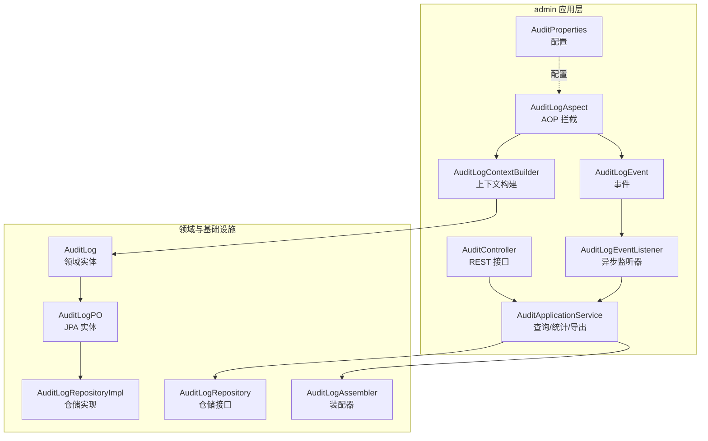
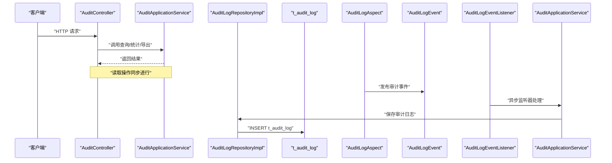
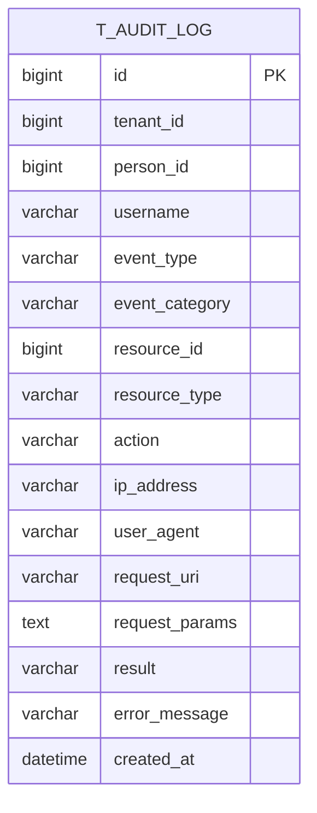
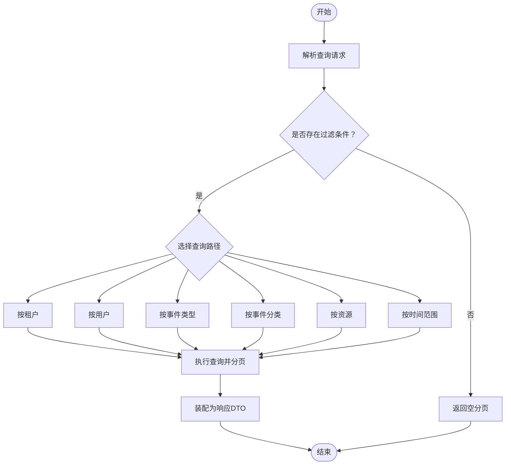
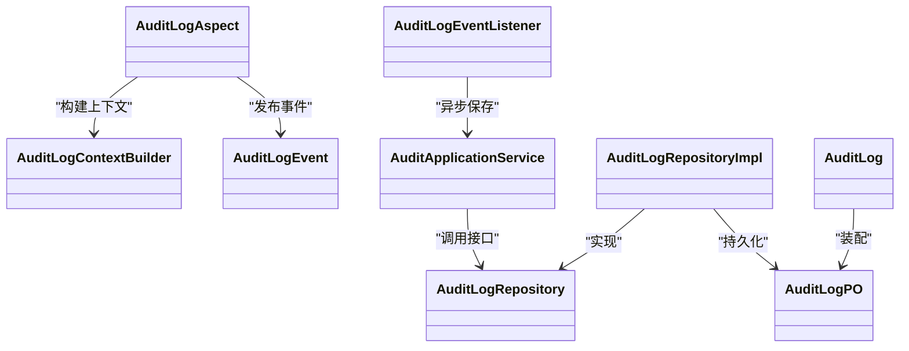

# 审计日志设计

<cite>
**本文引用的文件**
- [AuditLog.java](file://iam-admin-server/src/main/java/iam/platform/admin/domain/model/entity/AuditLog.java)
- [AuditLogPO.java](file://iam-admin-server/src/main/java/iam/platform/admin/infrastructure/persistence/entity/AuditLogPO.java)
- [AuditLogRepository.java](file://iam-admin-server/src/main/java/iam/platform/admin/domain/repository/AuditLogRepository.java)
- [AuditLogRepositoryImpl.java](file://iam-admin-server/src/main/java/iam/platform/admin/infrastructure/persistence/impl/AuditLogRepositoryImpl.java)
- [AuditApplicationService.java](file://iam-admin-server/src/main/java/iam/platform/admin/application/service/AuditApplicationService.java)
- [AuditLogEvent.java](file://iam-admin-server/src/main/java/iam/platform/admin/application/event/AuditLogEvent.java)
- [AuditLogEventListener.java](file://iam-admin-server/src/main/java/iam/platform/admin/application/event/AuditLogEventListener.java)
- [AuditLogAspect.java](file://iam-admin-server/src/main/java/iam/platform/admin/infrastructure/aspect/AuditLogAspect.java)
- [AuditLogContext.java](file://iam-admin-server/src/main/java/iam/platform/admin/infrastructure/aspect/AuditLogContext.java)
- [AuditLogContextBuilder.java](file://iam-admin-server/src/main/java/iam/platform/admin/infrastructure/aspect/AuditLogContextBuilder.java)
- [AuditProperties.java](file://iam-admin-server/src/main/java/iam/platform/admin/infrastructure/config/AuditProperties.java)
- [AuditController.java](file://iam-admin-server/src/main/java/iam/platform/admin/interfaces/rest/AuditController.java)
- [AuditLogAssembler.java](file://iam-admin-server/src/main/java/iam/platform/admin/application/assembler/AuditLogAssembler.java)
- [AuditEventType.java](file://iam-common/src/main/java/iam/platform/common/model/enums/AuditEventType.java)
- [EventCategory.java](file://iam-common/src/main/java/iam/platform/common/model/enums/EventCategory.java)
- [AuditResult.java](file://iam-common/src/main/java/iam/platform/common/model/enums/AuditResult.java)
</cite>

## 目录
1. [简介](#简介)
2. [项目结构](#项目结构)
3. [核心组件](#核心组件)
4. [架构总览](#架构总览)
5. [详细组件分析](#详细组件分析)
6. [依赖分析](#依赖分析)
7. [性能考量](#性能考量)
8. [故障排查指南](#故障排查指南)
9. [结论](#结论)
10. [附录](#附录)

## 简介
本文件系统化阐述该IAM平台的审计日志设计，覆盖数据库表结构与索引策略、事件分类体系、完整性保障、敏感信息保护、查询与导出优化、清理与保留策略，以及合规性考虑。通过AOP拦截、异步事件发布与持久化、分层仓储与应用服务，形成高可用、可扩展且可审计的审计体系。

## 项目结构
审计日志相关代码主要分布在admin子系统与公共枚举模块中，采用领域模型-仓储-应用服务-接口控制器的分层架构，配合Spring AOP与事件机制实现非侵入式审计记录。

图表来源
- [AuditController.java:1-89](file://iam-admin-server/src/main/java/iam/platform/admin/interfaces/rest/AuditController.java#L1-L89)
- [AuditApplicationService.java:1-217](file://iam-admin-server/src/main/java/iam/platform/admin/application/service/AuditApplicationService.java#L1-L217)
- [AuditLogEvent.java:1-21](file://iam-admin-server/src/main/java/iam/platform/admin/application/event/AuditLogEvent.java#L1-L21)
- [AuditLogEventListener.java:1-31](file://iam-admin-server/src/main/java/iam/platform/admin/application/event/AuditLogEventListener.java#L1-L31)
- [AuditLogAspect.java:1-66](file://iam-admin-server/src/main/java/iam/platform/admin/infrastructure/aspect/AuditLogAspect.java#L1-L66)
- [AuditLogContextBuilder.java:1-183](file://iam-admin-server/src/main/java/iam/platform/admin/infrastructure/aspect/AuditLogContextBuilder.java#L1-L183)
- [AuditLog.java:1-118](file://iam-admin-server/src/main/java/iam/platform/admin/domain/model/entity/AuditLog.java#L1-L118)
- [AuditLogPO.java:1-86](file://iam-admin-server/src/main/java/iam/platform/admin/infrastructure/persistence/entity/AuditLogPO.java#L1-L86)
- [AuditLogRepository.java:1-56](file://iam-admin-server/src/main/java/iam/platform/admin/domain/repository/AuditLogRepository.java#L1-L56)
- [AuditLogRepositoryImpl.java:1-152](file://iam-admin-server/src/main/java/iam/platform/admin/infrastructure/persistence/impl/AuditLogRepositoryImpl.java#L1-L152)
- [AuditLogAssembler.java:1-23](file://iam-admin-server/src/main/java/iam/platform/admin/application/assembler/AuditLogAssembler.java#L1-L23)
- [AuditProperties.java:1-37](file://iam-admin-server/src/main/java/iam/platform/admin/infrastructure/config/AuditProperties.java#L1-L37)

章节来源
- [AuditController.java:1-89](file://iam-admin-server/src/main/java/iam/platform/admin/interfaces/rest/AuditController.java#L1-L89)
- [AuditApplicationService.java:1-217](file://iam-admin-server/src/main/java/iam/platform/admin/application/service/AuditApplicationService.java#L1-L217)
- [AuditLogAspect.java:1-66](file://iam-admin-server/src/main/java/iam/platform/admin/infrastructure/aspect/AuditLogAspect.java#L1-L66)
- [AuditLogContextBuilder.java:1-183](file://iam-admin-server/src/main/java/iam/platform/admin/infrastructure/aspect/AuditLogContextBuilder.java#L1-L183)

## 核心组件
- 领域实体：不可变审计事件，包含操作者、资源、行为、结果与时间戳等关键字段，提供成功判定与年龄计算等查询方法。
- JPA 实体：映射 t_audit_log 表，定义字段长度、枚举存储方式与多列复合索引。
- 仓储接口与实现：提供按租户、用户、资源、事件类型、结果、时间范围的查询与统计，以及批量保存与过期清理。
- 应用服务：统一对外查询、统计、导出与单条详情查询；异步写入失败不阻塞主业务。
- AOP 与事件：基于注解拦截方法执行，构建上下文并发布异步审计事件，最终由监听器落库。
- 控制器：提供分页查询、按用户/资源检索、统计与CSV导出接口。
- 装配器：将领域对象映射为响应DTO，统一枚举名称输出。
- 枚举：事件类型与分类、结果状态，用于分类统计与过滤。

章节来源
- [AuditLog.java:1-118](file://iam-admin-server/src/main/java/iam/platform/admin/domain/model/entity/AuditLog.java#L1-L118)
- [AuditLogPO.java:1-86](file://iam-admin-server/src/main/java/iam/platform/admin/infrastructure/persistence/entity/AuditLogPO.java#L1-L86)
- [AuditLogRepository.java:1-56](file://iam-admin-server/src/main/java/iam/platform/admin/domain/repository/AuditLogRepository.java#L1-L56)
- [AuditLogRepositoryImpl.java:1-152](file://iam-admin-server/src/main/java/iam/platform/admin/infrastructure/persistence/impl/AuditLogRepositoryImpl.java#L1-L152)
- [AuditApplicationService.java:1-217](file://iam-admin-server/src/main/java/iam/platform/admin/application/service/AuditApplicationService.java#L1-L217)
- [AuditLogEvent.java:1-21](file://iam-admin-server/src/main/java/iam/platform/admin/application/event/AuditLogEvent.java#L1-L21)
- [AuditLogEventListener.java:1-31](file://iam-admin-server/src/main/java/iam/platform/admin/application/event/AuditLogEventListener.java#L1-L31)
- [AuditLogAspect.java:1-66](file://iam-admin-server/src/main/java/iam/platform/admin/infrastructure/aspect/AuditLogAspect.java#L1-L66)
- [AuditLogContextBuilder.java:1-183](file://iam-admin-server/src/main/java/iam/platform/admin/infrastructure/aspect/AuditLogContextBuilder.java#L1-L183)
- [AuditLogAssembler.java:1-23](file://iam-admin-server/src/main/java/iam/platform/admin/application/assembler/AuditLogAssembler.java#L1-L23)
- [AuditEventType.java:1-59](file://iam-common/src/main/java/iam/platform/common/model/enums/AuditEventType.java#L1-L59)
- [EventCategory.java:1-13](file://iam-common/src/main/java/iam/platform/common/model/enums/EventCategory.java#L1-L13)
- [AuditResult.java:1-9](file://iam-common/src/main/java/iam/platform/common/model/enums/AuditResult.java#L1-L9)

## 架构总览
下图展示从请求到审计落库的关键交互路径，强调异步与非阻塞特性。

图表来源
- [AuditController.java:1-89](file://iam-admin-server/src/main/java/iam/platform/admin/interfaces/rest/AuditController.java#L1-L89)
- [AuditApplicationService.java:1-217](file://iam-admin-server/src/main/java/iam/platform/admin/application/service/AuditApplicationService.java#L1-L217)
- [AuditLogRepositoryImpl.java:1-152](file://iam-admin-server/src/main/java/iam/platform/admin/infrastructure/persistence/impl/AuditLogRepositoryImpl.java#L1-L152)
- [AuditLogEvent.java:1-21](file://iam-admin-server/src/main/java/iam/platform/admin/application/event/AuditLogEvent.java#L1-L21)
- [AuditLogEventListener.java:1-31](file://iam-admin-server/src/main/java/iam/platform/admin/application/event/AuditLogEventListener.java#L1-L31)
- [AuditLogAspect.java:1-66](file://iam-admin-server/src/main/java/iam/platform/admin/infrastructure/aspect/AuditLogAspect.java#L1-L66)

## 详细组件分析

### 数据模型与表设计
- 表名：t_audit_log
- 字段要点
  - 标识与租户：id、tenant_id
  - 操作者：person_id、username
  - 事件：event_type（枚举）、event_category（枚举）
  - 资源：resource_type、resource_id
  - 行为：action
  - 上下文：ip_address、user_agent、request_uri、request_params（TEXT）
  - 结果：result（枚举）、error_message
  - 时间：created_at（自动插入）
- 索引策略
  - 单列：tenant_id、person_id、event_type、event_category、result、created_at
  - 复合：resource_type+resource_id、tenant_id+event_category+created_at
- 存储优化
  - 枚举以字符串存储，便于跨语言查询与展示
  - request_params 使用TEXT，避免超长参数导致截断
  - created_at 使用数据库自动时间戳，减少应用侧开销

图表来源
- [AuditLogPO.java:1-86](file://iam-admin-server/src/main/java/iam/platform/admin/infrastructure/persistence/entity/AuditLogPO.java#L1-L86)

章节来源
- [AuditLogPO.java:1-86](file://iam-admin-server/src/main/java/iam/platform/admin/infrastructure/persistence/entity/AuditLogPO.java#L1-L86)
- [AuditLog.java:1-118](file://iam-admin-server/src/main/java/iam/platform/admin/domain/model/entity/AuditLog.java#L1-L118)

### 事件分类体系
- 分类枚举：AUTHENTICATION、AUTHORIZATION、ACCOUNT、ADMINISTRATION、SESSION
- 典型事件
  - 认证：登录成功/失败、退出、令牌刷新、短信/邮件验证码发送
  - 授权：角色分配/撤销、权限变更
  - 账户：人员创建/更新/删除、租户账户创建/更新、密码修改、账户锁定/解锁
  - 管理：租户/组织/应用/角色/权限的创建/更新/删除/启用/停用
  - 会话：租户选择、会话过期
- 分类映射：事件类型与分类一一对应，支持按分类聚合统计

章节来源
- [AuditEventType.java:1-59](file://iam-common/src/main/java/iam/platform/common/model/enums/AuditEventType.java#L1-L59)
- [EventCategory.java:1-13](file://iam-common/src/main/java/iam/platform/common/model/enums/EventCategory.java#L1-L13)

### 完整性保障机制
- 不可变性：领域实体一旦创建即不可修改，确保审计证据链完整
- 操作者识别：AOP构建上下文时提取当前租户、人员、用户名、IP、UA、URI、参数等
- 时间戳精度：使用数据库自动时间戳，避免应用侧时钟漂移影响
- 数据溯源：记录请求参数快照（受控截断），错误消息带有限定长度，便于回溯

章节来源
- [AuditLog.java:1-118](file://iam-admin-server/src/main/java/iam/platform/admin/domain/model/entity/AuditLog.java#L1-L118)
- [AuditLogContextBuilder.java:1-183](file://iam-admin-server/src/main/java/iam/platform/admin/infrastructure/aspect/AuditLogContextBuilder.java#L1-L183)
- [AuditLogAspect.java:1-66](file://iam-admin-server/src/main/java/iam/platform/admin/infrastructure/aspect/AuditLogAspect.java#L1-L66)

### 敏感信息保护策略
- 参数掩码：对注解声明的敏感字段进行掩码处理，支持嵌套Map递归处理
- 参数截断：超过阈值的请求参数会被截断并标记，避免超大数据写入
- 错误消息限制：异常消息最大长度限定，防止泄露内部细节
- 用户代理与IP：仅记录必要长度的UA与标准化IP（优先X-Forwarded-For首跳）

章节来源
- [AuditLogContextBuilder.java:1-183](file://iam-admin-server/src/main/java/iam/platform/admin/infrastructure/aspect/AuditLogContextBuilder.java#L1-L183)
- [AuditLogAspect.java:1-66](file://iam-admin-server/src/main/java/iam/platform/admin/infrastructure/aspect/AuditLogAspect.java#L1-L66)

### 查询与导出优化
- 查询路径
  - 支持按租户、用户、事件类型、事件分类、资源、时间范围分页查询
  - 默认无过滤条件时返回空页，强制显式筛选
  - 统一排序字段与方向，按创建时间倒序为主
- 统计分析
  - 按分类与结果聚合计数，前N高频事件类型
- 导出能力
  - CSV导出，包含头部与转义处理
  - 导出查询限制在一定数量内，避免大范围全量导出造成压力

图表来源
- [AuditApplicationService.java:1-217](file://iam-admin-server/src/main/java/iam/platform/admin/application/service/AuditApplicationService.java#L1-L217)
- [AuditLogRepositoryImpl.java:1-152](file://iam-admin-server/src/main/java/iam/platform/admin/infrastructure/persistence/impl/AuditLogRepositoryImpl.java#L1-L152)

章节来源
- [AuditApplicationService.java:1-217](file://iam-admin-server/src/main/java/iam/platform/admin/application/service/AuditApplicationService.java#L1-L217)
- [AuditLogRepository.java:1-56](file://iam-admin-server/src/main/java/iam/platform/admin/domain/repository/AuditLogRepository.java#L1-L56)
- [AuditLogRepositoryImpl.java:1-152](file://iam-admin-server/src/main/java/iam/platform/admin/infrastructure/persistence/impl/AuditLogRepositoryImpl.java#L1-L152)
- [AuditLogAssembler.java:1-23](file://iam-admin-server/src/main/java/iam/platform/admin/application/assembler/AuditLogAssembler.java#L1-L23)

### 清理与保留策略
- 保留期限：通过配置项设置天数，默认180天
- 清理触发：仓储提供按截止日期删除的方法，可用于定时任务或运维脚本
- 存储成本控制：结合索引与分页查询，避免全表扫描；定期清理历史数据

章节来源
- [AuditProperties.java:1-37](file://iam-admin-server/src/main/java/iam/platform/admin/infrastructure/config/AuditProperties.java#L1-L37)
- [AuditLogRepository.java:1-56](file://iam-admin-server/src/main/java/iam/platform/admin/domain/repository/AuditLogRepository.java#L1-L56)
- [AuditLogRepositoryImpl.java:1-152](file://iam-admin-server/src/main/java/iam/platform/admin/infrastructure/persistence/impl/AuditLogRepositoryImpl.java#L1-L152)

### 合规性考虑
- GDPR 合规要点
  - 最小化采集：仅记录必要的审计字段
  - 敏感字段掩码与截断，错误消息长度限制
  - 明确保留期限并定期清理，避免长期存储不必要的个人数据
- 审计证据保全
  - 不可变实体设计，禁止修改
  - 自动时间戳与上下文记录，确保可追溯
- 监管要求满足
  - 提供统计与导出能力，支持合规检查与审计
  - 事件分类清晰，便于按场景归档与检索

## 依赖分析
- 组件耦合
  - AOP与上下文构建器解耦于业务方法，通过注解驱动
  - 事件发布与监听器解耦于业务逻辑，异步执行
  - 应用服务聚合仓储接口，面向接口编程
- 外部依赖
  - Spring AOP、事件发布、事务管理
  - JPA/Hibernate（枚举字符串存储、自动时间戳）
  - Jackson（JSON序列化敏感参数）

图表来源
- [AuditLogAspect.java:1-66](file://iam-admin-server/src/main/java/iam/platform/admin/infrastructure/aspect/AuditLogAspect.java#L1-L66)
- [AuditLogContextBuilder.java:1-183](file://iam-admin-server/src/main/java/iam/platform/admin/infrastructure/aspect/AuditLogContextBuilder.java#L1-L183)
- [AuditLogEvent.java:1-21](file://iam-admin-server/src/main/java/iam/platform/admin/application/event/AuditLogEvent.java#L1-L21)
- [AuditLogEventListener.java:1-31](file://iam-admin-server/src/main/java/iam/platform/admin/application/event/AuditLogEventListener.java#L1-L31)
- [AuditApplicationService.java:1-217](file://iam-admin-server/src/main/java/iam/platform/admin/application/service/AuditApplicationService.java#L1-L217)
- [AuditLogRepository.java:1-56](file://iam-admin-server/src/main/java/iam/platform/admin/domain/repository/AuditLogRepository.java#L1-L56)
- [AuditLogRepositoryImpl.java:1-152](file://iam-admin-server/src/main/java/iam/platform/admin/infrastructure/persistence/impl/AuditLogRepositoryImpl.java#L1-L152)
- [AuditLog.java:1-118](file://iam-admin-server/src/main/java/iam/platform/admin/domain/model/entity/AuditLog.java#L1-L118)
- [AuditLogPO.java:1-86](file://iam-admin-server/src/main/java/iam/platform/admin/infrastructure/persistence/entity/AuditLogPO.java#L1-L86)

章节来源
- [AuditLogAspect.java:1-66](file://iam-admin-server/src/main/java/iam/platform/admin/infrastructure/aspect/AuditLogAspect.java#L1-L66)
- [AuditLogContextBuilder.java:1-183](file://iam-admin-server/src/main/java/iam/platform/admin/infrastructure/aspect/AuditLogContextBuilder.java#L1-L183)
- [AuditLogRepositoryImpl.java:1-152](file://iam-admin-server/src/main/java/iam/platform/admin/infrastructure/persistence/impl/AuditLogRepositoryImpl.java#L1-L152)

## 性能考量
- 写入优化
  - 异步事件监听器，避免阻塞主业务线程
  - 批量保存接口，降低事务开销
  - 适度的线程池配置，避免过载
- 读取优化
  - 多列索引覆盖常见查询维度
  - 分页查询与排序固定，避免全表扫描
  - 统计查询使用原生聚合，减少ORM开销
- 导出优化
  - 导出限制最大记录数，避免内存与网络压力
  - CSV转义与UTF-8编码，提升兼容性

章节来源
- [AuditLogEventListener.java:1-31](file://iam-admin-server/src/main/java/iam/platform/admin/application/event/AuditLogEventListener.java#L1-L31)
- [AuditApplicationService.java:1-217](file://iam-admin-server/src/main/java/iam/platform/admin/application/service/AuditApplicationService.java#L1-L217)
- [AuditLogRepositoryImpl.java:1-152](file://iam-admin-server/src/main/java/iam/platform/admin/infrastructure/persistence/impl/AuditLogRepositoryImpl.java#L1-L152)
- [AuditProperties.java:1-37](file://iam-admin-server/src/main/java/iam/platform/admin/infrastructure/config/AuditProperties.java#L1-L37)

## 故障排查指南
- 审计写入失败
  - 现象：日志错误但业务不受影响
  - 排查：检查异步监听器与应用服务的异常日志
- 查询无结果
  - 现象：默认无过滤条件返回空分页
  - 排查：确认至少设置一个过滤条件（租户/用户/事件/资源/时间）
- 参数过大被截断
  - 现象：request_params显示截断标记
  - 排查：检查敏感字段是否正确声明，确认截断阈值
- 导出为空
  - 现象：导出接口返回空集合
  - 排查：确认查询条件与记录上限

章节来源
- [AuditApplicationService.java:1-217](file://iam-admin-server/src/main/java/iam/platform/admin/application/service/AuditApplicationService.java#L1-L217)
- [AuditLogEventListener.java:1-31](file://iam-admin-server/src/main/java/iam/platform/admin/application/event/AuditLogEventListener.java#L1-L31)
- [AuditLogContextBuilder.java:1-183](file://iam-admin-server/src/main/java/iam/platform/admin/infrastructure/aspect/AuditLogContextBuilder.java#L1-L183)

## 结论
该审计日志系统通过清晰的分层设计、AOP与事件机制、完善的索引策略与异步写入，实现了高可用、可扩展且合规的审计能力。结合敏感信息保护、统计与导出功能，能够满足日常运营审计与合规要求。建议持续监控异步队列积压与磁盘占用，按保留策略定期清理，确保系统长期稳定运行。

## 附录
- 关键接口与职责
  - AuditController：对外提供查询、详情、统计、导出接口
  - AuditApplicationService：封装查询、统计、导出与异步写入
  - AuditLogRepository/AuditLogRepositoryImpl：提供多维查询、统计与清理
  - AuditLogAspect/AuditLogContextBuilder：构建审计上下文并发布事件
  - AuditLogEvent/AuditLogEventListener：异步持久化
  - AuditLog/AuditLogPO：领域与持久化模型
  - AuditLogAssembler：装配响应DTO
  - AuditEventType/EventCategory/AuditResult：事件分类与结果枚举

章节来源
- [AuditController.java:1-89](file://iam-admin-server/src/main/java/iam/platform/admin/interfaces/rest/AuditController.java#L1-L89)
- [AuditApplicationService.java:1-217](file://iam-admin-server/src/main/java/iam/platform/admin/application/service/AuditApplicationService.java#L1-L217)
- [AuditLogRepository.java:1-56](file://iam-admin-server/src/main/java/iam/platform/admin/domain/repository/AuditLogRepository.java#L1-L56)
- [AuditLogRepositoryImpl.java:1-152](file://iam-admin-server/src/main/java/iam/platform/admin/infrastructure/persistence/impl/AuditLogRepositoryImpl.java#L1-L152)
- [AuditLogAspect.java:1-66](file://iam-admin-server/src/main/java/iam/platform/admin/infrastructure/aspect/AuditLogAspect.java#L1-L66)
- [AuditLogContextBuilder.java:1-183](file://iam-admin-server/src/main/java/iam/platform/admin/infrastructure/aspect/AuditLogContextBuilder.java#L1-L183)
- [AuditLogEvent.java:1-21](file://iam-admin-server/src/main/java/iam/platform/admin/application/event/AuditLogEvent.java#L1-L21)
- [AuditLogEventListener.java:1-31](file://iam-admin-server/src/main/java/iam/platform/admin/application/event/AuditLogEventListener.java#L1-L31)
- [AuditLog.java:1-118](file://iam-admin-server/src/main/java/iam/platform/admin/domain/model/entity/AuditLog.java#L1-L118)
- [AuditLogPO.java:1-86](file://iam-admin-server/src/main/java/iam/platform/admin/infrastructure/persistence/entity/AuditLogPO.java#L1-L86)
- [AuditLogAssembler.java:1-23](file://iam-admin-server/src/main/java/iam/platform/admin/application/assembler/AuditLogAssembler.java#L1-L23)
- [AuditEventType.java:1-59](file://iam-common/src/main/java/iam/platform/common/model/enums/AuditEventType.java#L1-L59)
- [EventCategory.java:1-13](file://iam-common/src/main/java/iam/platform/common/model/enums/EventCategory.java#L1-L13)
- [AuditResult.java:1-9](file://iam-common/src/main/java/iam/platform/common/model/enums/AuditResult.java#L1-L9)