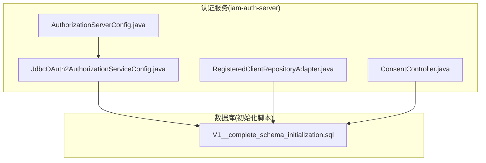
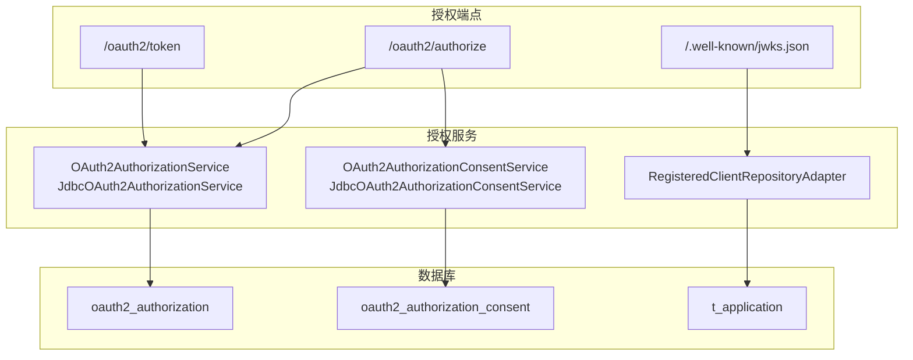
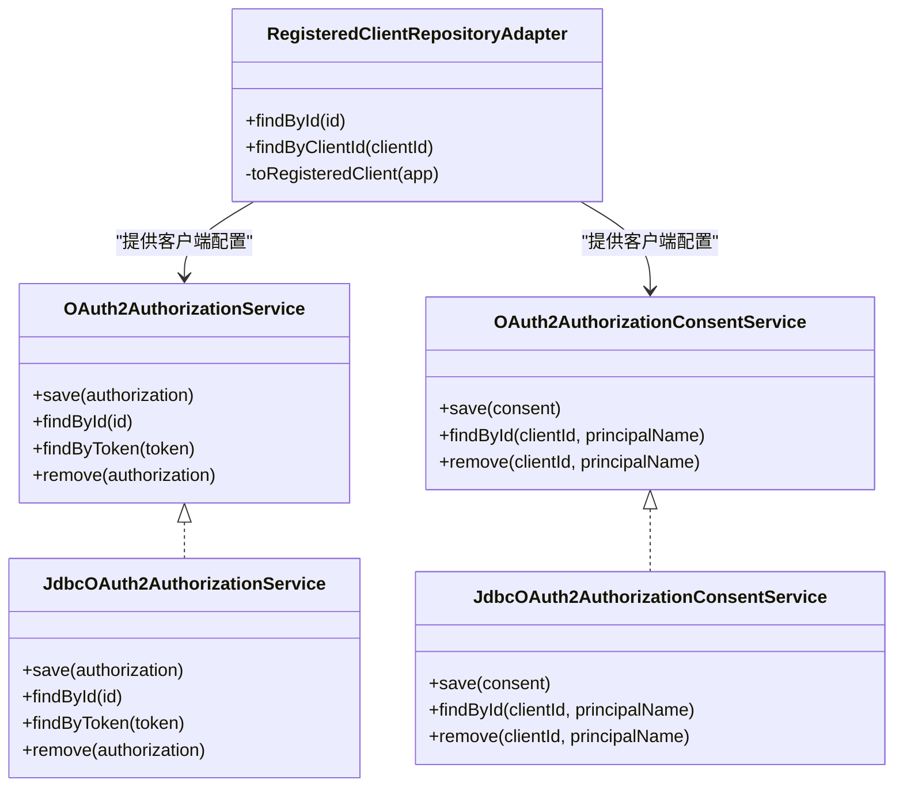
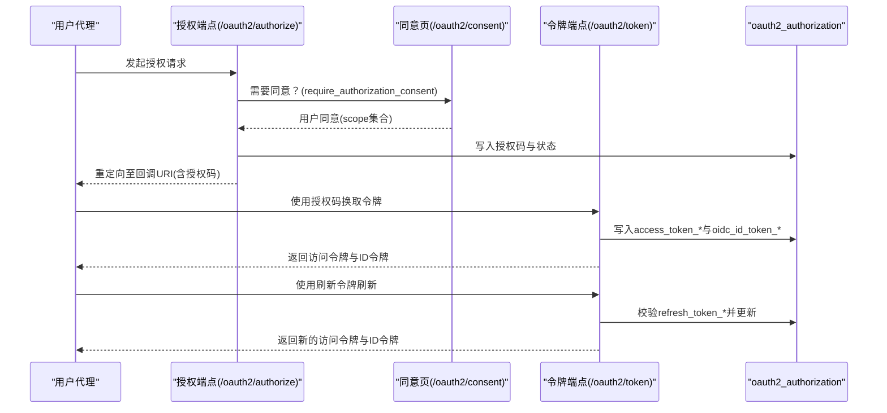
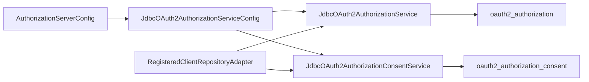

# OAuth2授权表

<cite>
**本文引用的文件**
- [V1__complete_schema_initialization.sql](file://iam-admin-server/src/main/resources/db/migration/V1__complete_schema_initialization.sql)
- [AuthorizationServerConfig.java](file://iam-auth-server/src/main/java/iam/platform/auth/infrastructure/config/AuthorizationServerConfig.java)
- [JdbcOAuth2AuthorizationServiceConfig.java](file://iam-auth-server/src/main/java/iam/platform/auth/infrastructure/security/JdbcOAuth2AuthorizationServiceConfig.java)
- [RegisteredClientRepositoryAdapter.java](file://iam-auth-server/src/main/java/iam/platform/auth/infrastructure/security/RegisteredClientRepositoryAdapter.java)
- [ConsentController.java](file://iam-auth-server/src/main/java/iam/platform/auth/interfaces/web/ConsentController.java)
- [Spring Authorization Server 原理与流程.md](file://docs/design/Spring Authorization Server 原理与流程.md)
</cite>

## 目录
1. [简介](#简介)
2. [项目结构](#项目结构)
3. [核心组件](#核心组件)
4. [架构总览](#架构总览)
5. [详细组件分析](#详细组件分析)
6. [依赖关系分析](#依赖关系分析)
7. [性能考量](#性能考量)
8. [故障排查指南](#故障排查指南)
9. [结论](#结论)
10. [附录](#附录)

## 简介
本文件面向IAM平台的OAuth2授权表设计与实现，聚焦Spring Authorization Server集成下的数据库表结构与运行机制，系统性阐述以下主题：
- 授权存储表oauth2_authorization与授权同意表oauth2_authorization_consent的设计与用途
- 各类令牌（授权码、访问令牌、刷新令牌、OIDC ID令牌）在数据库中的存储策略与生命周期管理
- 授权流程的状态跟踪与令牌验证机制
- 客户端ID管理、作用域控制与用户同意管理
- 数据库层面的OAuth2流程实现与性能优化建议
- 提供OAuth2授权流程图与令牌管理示例

## 项目结构
IAM平台采用多模块架构，OAuth2授权相关能力集中在iam-auth-server模块中，数据库初始化脚本位于iam-admin-server模块的Flyway迁移目录。核心文件如下：
- 授权服务配置：AuthorizationServerConfig.java
- JDBC授权服务配置：JdbcOAuth2AuthorizationServiceConfig.java
- 客户端仓库适配器：RegisteredClientRepositoryAdapter.java
- 授权同意控制器：ConsentController.java
- 数据库初始化脚本：V1__complete_schema_initialization.sql
- 设计文档：Spring Authorization Server 原理与流程.md

**图表来源**
- [AuthorizationServerConfig.java:44-64](file://iam-auth-server/src/main/java/iam/platform/auth/infrastructure/config/AuthorizationServerConfig.java#L44-L64)
- [JdbcOAuth2AuthorizationServiceConfig.java:15-25](file://iam-auth-server/src/main/java/iam/platform/auth/infrastructure/security/JdbcOAuth2AuthorizationServiceConfig.java#L15-L25)
- [RegisteredClientRepositoryAdapter.java:47-99](file://iam-auth-server/src/main/java/iam/platform/auth/infrastructure/security/RegisteredClientRepositoryAdapter.java#L47-L99)
- [ConsentController.java:10-16](file://iam-auth-server/src/main/java/iam/platform/auth/interfaces/web/ConsentController.java#L10-L16)
- [V1__complete_schema_initialization.sql:111-166](file://iam-admin-server/src/main/resources/db/migration/V1__complete_schema_initialization.sql#L111-L166)

**章节来源**
- [AuthorizationServerConfig.java:44-64](file://iam-auth-server/src/main/java/iam/platform/auth/infrastructure/config/AuthorizationServerConfig.java#L44-L64)
- [JdbcOAuth2AuthorizationServiceConfig.java:15-25](file://iam-auth-server/src/main/java/iam/platform/auth/infrastructure/security/JdbcOAuth2AuthorizationServiceConfig.java#L15-L25)
- [RegisteredClientRepositoryAdapter.java:47-99](file://iam-auth-server/src/main/java/iam/platform/auth/infrastructure/security/RegisteredClientRepositoryAdapter.java#L47-L99)
- [ConsentController.java:10-16](file://iam-auth-server/src/main/java/iam/platform/auth/interfaces/web/ConsentController.java#L10-L16)
- [V1__complete_schema_initialization.sql:111-166](file://iam-admin-server/src/main/resources/db/migration/V1__complete_schema_initialization.sql#L111-L166)

## 核心组件
- 授权存储表oauth2_authorization：用于持久化一次授权会话的完整状态，包括授权码、访问令牌、OIDC ID令牌、刷新令牌及其元数据、过期时间等。
- 授权同意表oauth2_authorization_consent：用于记录用户对特定客户端的作用域授权同意，支持按客户端+主体名进行唯一约束。
- JDBC授权服务：通过JdbcOAuth2AuthorizationService与JdbcOAuth2AuthorizationConsentService将上述两张表作为持久化后端。
- 客户端仓库适配器：将业务实体Application映射为RegisteredClient，驱动授权端点行为（授权方式、作用域、令牌TTL、PKCE与同意要求等）。

**章节来源**
- [V1__complete_schema_initialization.sql:111-166](file://iam-admin-server/src/main/resources/db/migration/V1__complete_schema_initialization.sql#L111-L166)
- [JdbcOAuth2AuthorizationServiceConfig.java:15-25](file://iam-auth-server/src/main/java/iam/platform/auth/infrastructure/security/JdbcOAuth2AuthorizationServiceConfig.java#L15-L25)
- [RegisteredClientRepositoryAdapter.java:47-99](file://iam-auth-server/src/main/java/iam/platform/auth/infrastructure/security/RegisteredClientRepositoryAdapter.java#L47-L99)

## 架构总览
下图展示了OAuth2授权在IAM平台中的数据库层面实现与交互关系：

**图表来源**
- [AuthorizationServerConfig.java:44-64](file://iam-auth-server/src/main/java/iam/platform/auth/infrastructure/config/AuthorizationServerConfig.java#L44-L64)
- [JdbcOAuth2AuthorizationServiceConfig.java:15-25](file://iam-auth-server/src/main/java/iam/platform/auth/infrastructure/security/JdbcOAuth2AuthorizationServiceConfig.java#L15-L25)
- [RegisteredClientRepositoryAdapter.java:47-99](file://iam-auth-server/src/main/java/iam/platform/auth/infrastructure/security/RegisteredClientRepositoryAdapter.java#L47-L99)
- [V1__complete_schema_initialization.sql:111-166](file://iam-admin-server/src/main/resources/db/migration/V1__complete_schema_initialization.sql#L111-L166)

## 详细组件分析

### 授权存储表 oauth2_authorization
该表是Spring Authorization Server在JDBC模式下的核心授权状态存储，字段覆盖授权码、访问令牌、OIDC ID令牌、刷新令牌及用户码/设备码等，同时包含状态参数与元数据字段，便于端点按需读写。

- 主键：id（字符串，通常为随机标识符）
- 关联键：registered_client_id（对应客户端ID）、principal_name（主体名）
- 授权码字段：authorization_code_value、authorization_code_issued_at、authorization_code_expires_at、authorization_code_metadata
- 访问令牌字段：access_token_value、access_token_issued_at、access_token_expires_at、access_token_metadata、access_token_type、access_token_scopes
- OIDC ID令牌字段：oidc_id_token_value、oidc_id_token_issued_at、oidc_id_token_expires_at、oidc_id_token_metadata、oidc_id_token_claims
- 刷新令牌字段：refresh_token_value、refresh_token_issued_at、refresh_token_expires_at、refresh_token_metadata
- 其他字段：state、attributes、user_code_*、device_code_* 等

索引设计：
- registered_client_id：加速按客户端查询
- principal_name：加速按主体查询
- state：加速按state查询
- access_token_value：加速令牌校验
- refresh_token_value：加速刷新流程

生命周期管理要点：
- 授权码：仅在授权响应阶段短暂存在，成功换取访问令牌后应视为失效
- 访问令牌：按access_token_expires_at判断过期；资源服务器使用时需验证签名与声明
- OIDC ID令牌：携带用户身份声明，按oidc_id_token_expires_at判断过期
- 刷新令牌：按refresh_token_expires_at判断过期；刷新时应撤销旧令牌并发放新令牌

**章节来源**
- [V1__complete_schema_initialization.sql:111-155](file://iam-admin-server/src/main/resources/db/migration/V1__complete_schema_initialization.sql#L111-L155)

### 授权同意表 oauth2_authorization_consent
该表用于持久化用户的授权同意信息，键为(registered_client_id, principal_name)，记录用户同意授予的权限集合（authorities），用于授权端点的同意页渲染与后续授权决策。

- 主键：(registered_client_id, principal_name)
- 字段：authorities（逗号分隔的作用域或权限集合）

与客户端设置的关系：
- 当客户端配置require_authorization_consent=true时，授权端点会在首次授权时引导用户确认作用域，并将结果写入该表
- 后续授权可复用该同意，除非客户端变更了作用域集合或策略

**章节来源**
- [V1__complete_schema_initialization.sql:158-166](file://iam-admin-server/src/main/resources/db/migration/V1__complete_schema_initialization.sql#L158-L166)
- [RegisteredClientRepositoryAdapter.java:95-96](file://iam-auth-server/src/main/java/iam/platform/auth/infrastructure/security/RegisteredClientRepositoryAdapter.java#L95-L96)

### JDBC授权服务与客户端仓库适配器
- JdbcOAuth2AuthorizationService：实现OAuth2AuthorizationService接口，负责将授权状态写入/读取到oauth2_authorization表
- JdbcOAuth2AuthorizationConsentService：实现OAuth2AuthorizationConsentService接口，负责将用户同意写入/读取到oauth2_authorization_consent表
- RegisteredClientRepositoryAdapter：将Application实体映射为RegisteredClient，驱动授权端点的行为，如授权方式、作用域、令牌TTL、PKCE与同意要求等

**图表来源**
- [JdbcOAuth2AuthorizationServiceConfig.java:15-25](file://iam-auth-server/src/main/java/iam/platform/auth/infrastructure/security/JdbcOAuth2AuthorizationServiceConfig.java#L15-L25)
- [RegisteredClientRepositoryAdapter.java:47-99](file://iam-auth-server/src/main/java/iam/platform/auth/infrastructure/security/RegisteredClientRepositoryAdapter.java#L47-L99)

**章节来源**
- [JdbcOAuth2AuthorizationServiceConfig.java:15-25](file://iam-auth-server/src/main/java/iam/platform/auth/infrastructure/security/JdbcOAuth2AuthorizationServiceConfig.java#L15-L25)
- [RegisteredClientRepositoryAdapter.java:47-99](file://iam-auth-server/src/main/java/iam/platform/auth/infrastructure/security/RegisteredClientRepositoryAdapter.java#L47-L99)

### 授权流程与令牌管理（数据库层面）
- 授权端点：/oauth2/authorize
  - 根据RegisteredClient配置决定授权方式（授权码/密码等）
  - 若require_authorization_consent为true，则进入同意页（/oauth2/consent）
  - 成功后在oauth2_authorization中写入授权码、状态参数与元数据
- 令牌端点：/oauth2/token
  - 使用授权码交换访问令牌与ID令牌，同时写入access_token_*与oidc_id_token_*字段
  - 支持PKCE（若客户端开启requireProofKey）
  - 支持刷新令牌流程，按refresh_token_*字段进行校验与替换
- 资源访问：资源服务器使用JWT解码器验证令牌签名与声明，结合access_token_*字段进行审计与追踪

**图表来源**
- [ConsentController.java:10-16](file://iam-auth-server/src/main/java/iam/platform/auth/interfaces/web/ConsentController.java#L10-L16)
- [RegisteredClientRepositoryAdapter.java:95-96](file://iam-auth-server/src/main/java/iam/platform/auth/infrastructure/security/RegisteredClientRepositoryAdapter.java#L95-L96)
- [V1__complete_schema_initialization.sql:111-155](file://iam-admin-server/src/main/resources/db/migration/V1__complete_schema_initialization.sql#L111-L155)

**章节来源**
- [ConsentController.java:10-16](file://iam-auth-server/src/main/java/iam/platform/auth/interfaces/web/ConsentController.java#L10-L16)
- [RegisteredClientRepositoryAdapter.java:95-96](file://iam-auth-server/src/main/java/iam/platform/auth/infrastructure/security/RegisteredClientRepositoryAdapter.java#L95-L96)
- [V1__complete_schema_initialization.sql:111-155](file://iam-admin-server/src/main/resources/db/migration/V1__complete_schema_initialization.sql#L111-L155)

### 令牌类型与生命周期管理
- 授权码（Authorization Code）
  - 存储于authorization_code_*字段，过期时间由authorization_code_expires_at控制
  - 仅在换取令牌阶段有效，成功后应作废
- 访问令牌（Access Token）
  - 存储于access_token_*字段，过期时间由access_token_expires_at控制
  - 资源服务器验证签名与声明，支持按access_token_value建立索引以提升校验效率
- 刷新令牌（Refresh Token）
  - 存储于refresh_token_*字段，过期时间由refresh_token_expires_at控制
  - 刷新时应撤销旧令牌并发放新令牌，避免并发场景下的重复使用
- OIDC ID令牌（ID Token）
  - 存储于oidc_id_token_*字段，包含身份声明，过期时间由oidc_id_token_expires_at控制
  - 用于前端验证用户身份与派发会话

**章节来源**
- [V1__complete_schema_initialization.sql:120-146](file://iam-admin-server/src/main/resources/db/migration/V1__complete_schema_initialization.sql#L120-L146)

### 客户端ID管理、作用域控制与用户同意
- 客户端ID管理
  - 客户端ID来源于Application.app_id，RegisteredClientRepositoryAdapter将其映射为RegisteredClient
  - 客户端密钥采用{noop}明文或BCrypt编码（根据部署环境选择），并支持client_secret_basic认证方法
- 作用域控制
  - 从Application.allowed_scopes解析作用域集合，注册到RegisteredClient
  - 授权端点按作用域集合进行同意页渲染与后续授权决策
- 用户同意管理
  - 当require_authorization_consent=true时，授权端点引导用户确认作用域
  - 同意结果持久化到oauth2_authorization_consent，后续授权可复用

**章节来源**
- [RegisteredClientRepositoryAdapter.java:56-96](file://iam-auth-server/src/main/java/iam/platform/auth/infrastructure/security/RegisteredClientRepositoryAdapter.java#L56-L96)
- [V1__complete_schema_initialization.sql:349-380](file://iam-admin-server/src/main/resources/db/migration/V1__complete_schema_initialization.sql#L349-L380)

## 依赖关系分析
- 授权服务配置
  - AuthorizationServerConfig启用OAuth2 Authorization Server默认安全策略，并注入TenantAwareAuthenticationFilter
- JDBC授权服务
  - JdbcOAuth2AuthorizationServiceConfig装配JdbcOAuth2AuthorizationService与JdbcOAuth2AuthorizationConsentService
- 客户端仓库适配器
  - RegisteredClientRepositoryAdapter从ApplicationRepository加载客户端配置，驱动授权端点行为
- 数据库脚本
  - 初始化oauth2_authorization与oauth2_authorization_consent表结构与索引

**图表来源**
- [AuthorizationServerConfig.java:44-64](file://iam-auth-server/src/main/java/iam/platform/auth/infrastructure/config/AuthorizationServerConfig.java#L44-L64)
- [JdbcOAuth2AuthorizationServiceConfig.java:15-25](file://iam-auth-server/src/main/java/iam/platform/auth/infrastructure/security/JdbcOAuth2AuthorizationServiceConfig.java#L15-L25)
- [RegisteredClientRepositoryAdapter.java:47-99](file://iam-auth-server/src/main/java/iam/platform/auth/infrastructure/security/RegisteredClientRepositoryAdapter.java#L47-L99)
- [V1__complete_schema_initialization.sql:111-166](file://iam-admin-server/src/main/resources/db/migration/V1__complete_schema_initialization.sql#L111-L166)

**章节来源**
- [AuthorizationServerConfig.java:44-64](file://iam-auth-server/src/main/java/iam/platform/auth/infrastructure/config/AuthorizationServerConfig.java#L44-L64)
- [JdbcOAuth2AuthorizationServiceConfig.java:15-25](file://iam-auth-server/src/main/java/iam/platform/auth/infrastructure/security/JdbcOAuth2AuthorizationServiceConfig.java#L15-L25)
- [RegisteredClientRepositoryAdapter.java:47-99](file://iam-auth-server/src/main/java/iam/platform/auth/infrastructure/security/RegisteredClientRepositoryAdapter.java#L47-L99)
- [V1__complete_schema_initialization.sql:111-166](file://iam-admin-server/src/main/resources/db/migration/V1__complete_schema_initialization.sql#L111-L166)

## 性能考量
- 索引优化
  - 在oauth2_authorization上维护access_token_value与refresh_token_value索引，以加速令牌校验与刷新流程
  - 在registered_client_id与principal_name上建立索引，提升按客户端与主体查询效率
- 令牌TTL策略
  - 依据Application配置的access_token_ttl_seconds与refresh_token_ttl_seconds合理设置，避免过短导致频繁刷新、过长带来安全风险
- 并发与一致性
  - 刷新令牌流程需保证原子性：先校验旧令牌再发放新令牌并标记旧令牌失效
- 清理策略
  - 对过期授权与令牌定期清理，减少表膨胀与查询开销

[本节为通用性能建议，不直接分析具体文件]

## 故障排查指南
- 授权码无法换取令牌
  - 检查oauth2_authorization中对应授权记录是否存在且未过期
  - 核对回调URI与state参数是否匹配
- 令牌无效或过期
  - 校验access_token_expires_at与当前时间
  - 确认资源服务器使用的JWKS与签发者一致
- 刷新失败
  - 校验refresh_token_expires_at与refresh_token_value
  - 确认刷新流程中旧令牌已被撤销
- 同意页未出现
  - 检查Application.require_authorization_consent配置
  - 确认oauth2_authorization_consent中是否存在历史同意记录

**章节来源**
- [V1__complete_schema_initialization.sql:111-166](file://iam-admin-server/src/main/resources/db/migration/V1__complete_schema_initialization.sql#L111-L166)
- [RegisteredClientRepositoryAdapter.java:95-96](file://iam-auth-server/src/main/java/iam/platform/auth/infrastructure/security/RegisteredClientRepositoryAdapter.java#L95-L96)

## 结论
IAM平台通过Spring Authorization Server与JDBC持久化，实现了完整的OAuth2/OIDC授权流程。oauth2_authorization与oauth2_authorization_consent两张表清晰地承载了授权状态与用户同意信息，配合RegisteredClientRepositoryAdapter与JdbcOAuth2AuthorizationService，形成了从客户端配置到令牌发放与验证的闭环。合理的索引设计、令牌TTL策略与清理机制是保障系统性能与安全的关键。

[本节为总结性内容，不直接分析具体文件]

## 附录
- 授权端点与令牌端点的典型路径
  - 授权端点：/oauth2/authorize
  - 令牌端点：/oauth2/token
  - 同意页：/oauth2/consent
- 设计参考
  - Spring Authorization Server原理与流程文档

**章节来源**
- [Spring Authorization Server 原理与流程.md:22-50](file://docs/design/Spring Authorization Server 原理与流程.md#L22-L50)