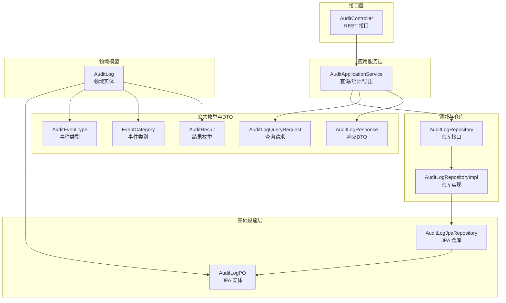
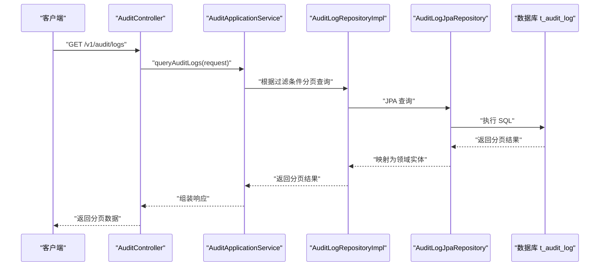
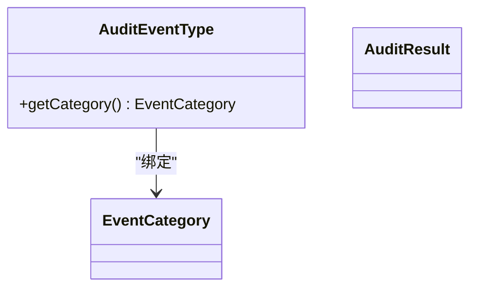
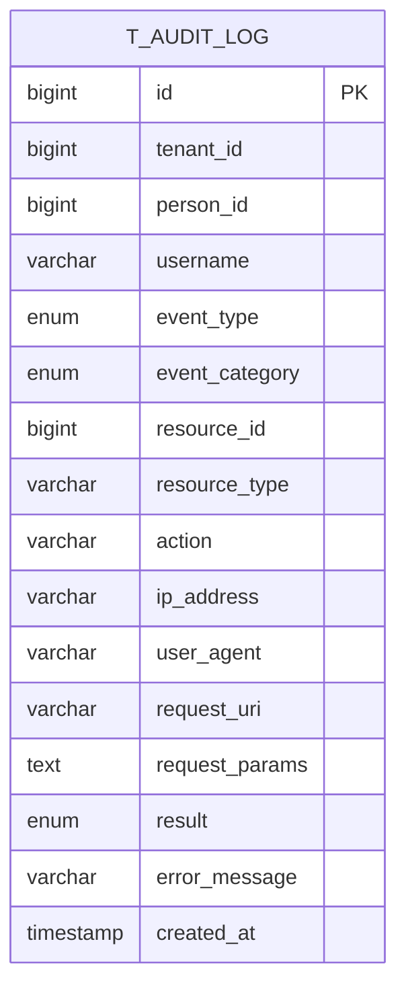
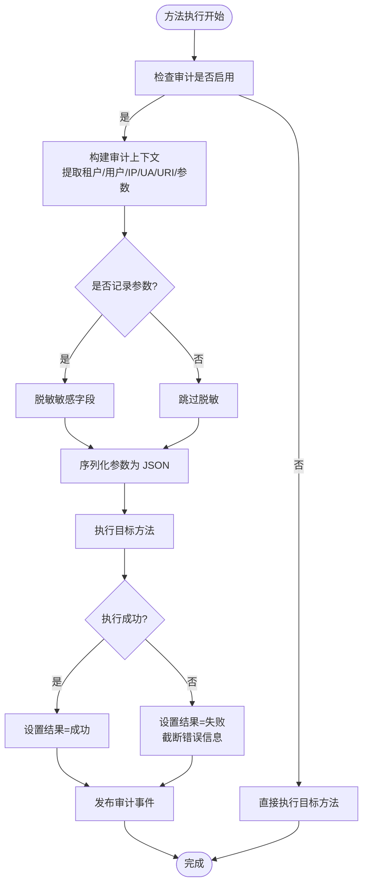
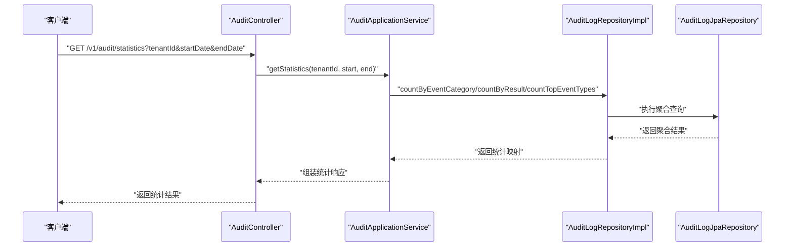
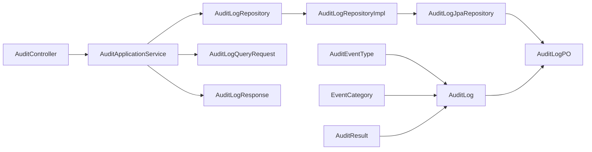
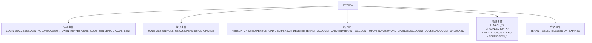

# 审计日志表

<cite>
**本文引用的文件**
- [AuditLog.java](file://iam-admin-server/src/main/java/iam/platform/admin/domain/model/entity/AuditLog.java)
- [AuditLogPO.java](file://iam-admin-server/src/main/java/iam/platform/admin/infrastructure/persistence/entity/AuditLogPO.java)
- [AuditLogRepository.java](file://iam-admin-server/src/main/java/iam/platform/admin/domain/repository/AuditLogRepository.java)
- [AuditLogJpaRepository.java](file://iam-admin-server/src/main/java/iam/platform/admin/infrastructure/persistence/repository/AuditLogJpaRepository.java)
- [AuditLogRepositoryImpl.java](file://iam-admin-server/src/main/java/iam/platform/admin/infrastructure/persistence/impl/AuditLogRepositoryImpl.java)
- [AuditApplicationService.java](file://iam-admin-server/src/main/java/iam/platform/admin/application/service/AuditApplicationService.java)
- [AuditController.java](file://iam-admin-server/src/main/java/iam/platform/admin/interfaces/rest/AuditController.java)
- [AuditLogAspect.java](file://iam-admin-server/src/main/java/iam/platform/admin/infrastructure/aspect/AuditLogAspect.java)
- [AuditLogContext.java](file://iam-admin-server/src/main/java/iam/platform/admin/infrastructure/aspect/AuditLogContext.java)
- [AuditLogContextBuilder.java](file://iam-admin-server/src/main/java/iam/platform/admin/infrastructure/aspect/AuditLogContextBuilder.java)
- [AuditLogQueryRequest.java](file://iam-common/src/main/java/iam/platform/common/dto/request/AuditLogQueryRequest.java)
- [AuditLogResponse.java](file://iam-common/src/main/java/iam/platform/common/dto/response/AuditLogResponse.java)
- [AuditEventType.java](file://iam-common/src/main/java/iam/platform/common/model/enums/AuditEventType.java)
- [EventCategory.java](file://iam-common/src/main/java/iam/platform/common/model/enums/EventCategory.java)
- [AuditResult.java](file://iam-common/src/main/java/iam/platform/common/model/enums/AuditResult.java)
</cite>

## 目录
1. [简介](#简介)
2. [项目结构](#项目结构)
3. [核心组件](#核心组件)
4. [架构总览](#架构总览)
5. [详细组件分析](#详细组件分析)
6. [依赖关系分析](#依赖关系分析)
7. [性能考虑](#性能考虑)
8. [故障排查指南](#故障排查指南)
9. [结论](#结论)
10. [附录](#附录)

## 简介
本文件围绕 IAM 平台审计日志表 t_audit_log 的设计与实现进行系统化说明，重点覆盖以下方面：
- 审计事件类型、事件类别与操作结果的分类体系
- 审计数据采集策略（用户操作、系统事件、安全相关事件）
- 敏感信息处理与脱敏策略
- 查询性能优化与索引设计
- 审计日志清理策略与保留期限管理
- 审计事件分类图与查询示例

## 项目结构
IAM 平台采用多模块分层架构，审计相关能力主要集中在 admin 模块与公共枚举定义中：
- 领域模型与仓库接口：领域实体、仓库接口定义
- 基础设施层：JPA 实体、JPA 仓库、仓库实现
- 应用服务层：审计查询、统计、导出等业务逻辑
- 接口层：REST 控制器，提供审计日志查询、详情、统计与导出接口
- 公共模块：审计事件类型、事件类别、结果枚举及请求/响应 DTO

图表来源
- [AuditController.java:1-89](file://iam-admin-server/src/main/java/iam/platform/admin/interfaces/rest/AuditController.java#L1-L89)
- [AuditApplicationService.java:1-217](file://iam-admin-server/src/main/java/iam/platform/admin/application/service/AuditApplicationService.java#L1-L217)
- [AuditLogRepository.java:1-56](file://iam-admin-server/src/main/java/iam/platform/admin/domain/repository/AuditLogRepository.java#L1-L56)
- [AuditLogRepositoryImpl.java:1-152](file://iam-admin-server/src/main/java/iam/platform/admin/infrastructure/persistence/impl/AuditLogRepositoryImpl.java#L1-L152)
- [AuditLogJpaRepository.java:1-57](file://iam-admin-server/src/main/java/iam/platform/admin/infrastructure/persistence/repository/AuditLogJpaRepository.java#L1-L57)
- [AuditLogPO.java:1-86](file://iam-admin-server/src/main/java/iam/platform/admin/infrastructure/persistence/entity/AuditLogPO.java#L1-L86)
- [AuditLog.java:1-118](file://iam-admin-server/src/main/java/iam/platform/admin/domain/model/entity/AuditLog.java#L1-L118)
- [AuditLogQueryRequest.java:1-41](file://iam-common/src/main/java/iam/platform/common/dto/request/AuditLogQueryRequest.java#L1-L41)
- [AuditLogResponse.java:1-31](file://iam-common/src/main/java/iam/platform/common/dto/response/AuditLogResponse.java#L1-L31)
- [AuditEventType.java:1-59](file://iam-common/src/main/java/iam/platform/common/model/enums/AuditEventType.java#L1-L59)
- [EventCategory.java:1-13](file://iam-common/src/main/java/iam/platform/common/model/enums/EventCategory.java#L1-L13)
- [AuditResult.java:1-9](file://iam-common/src/main/java/iam/platform/common/model/enums/AuditResult.java#L1-L9)

章节来源
- [AuditController.java:1-89](file://iam-admin-server/src/main/java/iam/platform/admin/interfaces/rest/AuditController.java#L1-L89)
- [AuditApplicationService.java:1-217](file://iam-admin-server/src/main/java/iam/platform/admin/application/service/AuditApplicationService.java#L1-L217)
- [AuditLogRepository.java:1-56](file://iam-admin-server/src/main/java/iam/platform/admin/domain/repository/AuditLogRepository.java#L1-L56)
- [AuditLogRepositoryImpl.java:1-152](file://iam-admin-server/src/main/java/iam/platform/admin/infrastructure/persistence/impl/AuditLogRepositoryImpl.java#L1-L152)
- [AuditLogJpaRepository.java:1-57](file://iam-admin-server/src/main/java/iam/platform/admin/infrastructure/persistence/repository/AuditLogJpaRepository.java#L1-L57)
- [AuditLogPO.java:1-86](file://iam-admin-server/src/main/java/iam/platform/admin/infrastructure/persistence/entity/AuditLogPO.java#L1-L86)
- [AuditLog.java:1-118](file://iam-admin-server/src/main/java/iam/platform/admin/domain/model/entity/AuditLog.java#L1-L118)
- [AuditLogQueryRequest.java:1-41](file://iam-common/src/main/java/iam/platform/common/dto/request/AuditLogQueryRequest.java#L1-L41)
- [AuditLogResponse.java:1-31](file://iam-common/src/main/java/iam/platform/common/dto/response/AuditLogResponse.java#L1-L31)
- [AuditEventType.java:1-59](file://iam-common/src/main/java/iam/platform/common/model/enums/AuditEventType.java#L1-L59)
- [EventCategory.java:1-13](file://iam-common/src/main/java/iam/platform/common/model/enums/EventCategory.java#L1-L13)
- [AuditResult.java:1-9](file://iam-common/src/main/java/iam/platform/common/model/enums/AuditResult.java#L1-L9)

## 核心组件
- 审计事件类型与分类
  - 事件类型：登录/登出/刷新令牌、角色分配/撤销、权限变更、账户创建/更新/删除/锁定/解锁、密码修改、租户/组织/应用/角色/权限创建/更新/删除/启用/停用等
  - 事件类别：认证、授权、账户、管理、会话
  - 结果枚举：成功/失败
- 领域实体与持久化实体
  - 领域实体包含不可变审计事件的完整信息，并提供工厂方法与查询辅助方法
  - JPA 实体映射到 t_audit_log 表，定义了关键字段与复合索引
- 仓库与查询
  - 仓库接口定义读写、分页查询、统计与清理方法
  - JPA 仓库提供基于条件的分页查询与聚合统计
  - 仓库实现负责领域对象与持久化对象的转换
- 应用服务与接口
  - 应用服务封装查询、统计、导出与异步保存逻辑
  - 控制器提供 REST 接口，支持按用户、资源、时间范围等维度查询与导出
- AOP 审计切面
  - 自动拦截标注了审计注解的方法，构建上下文并发布审计事件
  - 支持参数脱敏、长度截断、IP/User-Agent/URI 提取等

章节来源
- [AuditLog.java:1-118](file://iam-admin-server/src/main/java/iam/platform/admin/domain/model/entity/AuditLog.java#L1-L118)
- [AuditLogPO.java:1-86](file://iam-admin-server/src/main/java/iam/platform/admin/infrastructure/persistence/entity/AuditLogPO.java#L1-L86)
- [AuditLogRepository.java:1-56](file://iam-admin-server/src/main/java/iam/platform/admin/domain/repository/AuditLogRepository.java#L1-L56)
- [AuditLogJpaRepository.java:1-57](file://iam-admin-server/src/main/java/iam/platform/admin/infrastructure/persistence/repository/AuditLogJpaRepository.java#L1-L57)
- [AuditLogRepositoryImpl.java:1-152](file://iam-admin-server/src/main/java/iam/platform/admin/infrastructure/persistence/impl/AuditLogRepositoryImpl.java#L1-L152)
- [AuditApplicationService.java:1-217](file://iam-admin-server/src/main/java/iam/platform/admin/application/service/AuditApplicationService.java#L1-L217)
- [AuditController.java:1-89](file://iam-admin-server/src/main/java/iam/platform/admin/interfaces/rest/AuditController.java#L1-L89)
- [AuditLogAspect.java:1-66](file://iam-admin-server/src/main/java/iam/platform/admin/infrastructure/aspect/AuditLogAspect.java#L1-L66)
- [AuditLogContext.java:1-32](file://iam-admin-server/src/main/java/iam/platform/admin/infrastructure/aspect/AuditLogContext.java#L1-L32)
- [AuditLogContextBuilder.java:1-183](file://iam-admin-server/src/main/java/iam/platform/admin/infrastructure/aspect/AuditLogContextBuilder.java#L1-L183)
- [AuditEventType.java:1-59](file://iam-common/src/main/java/iam/platform/common/model/enums/AuditEventType.java#L1-L59)
- [EventCategory.java:1-13](file://iam-common/src/main/java/iam/platform/common/model/enums/EventCategory.java#L1-L13)
- [AuditResult.java:1-9](file://iam-common/src/main/java/iam/platform/common/model/enums/AuditResult.java#L1-L9)

## 架构总览
下图展示了从接口调用到数据落库与查询统计的端到端流程。

图表来源
- [AuditController.java:1-89](file://iam-admin-server/src/main/java/iam/platform/admin/interfaces/rest/AuditController.java#L1-L89)
- [AuditApplicationService.java:1-217](file://iam-admin-server/src/main/java/iam/platform/admin/application/service/AuditApplicationService.java#L1-L217)
- [AuditLogRepositoryImpl.java:1-152](file://iam-admin-server/src/main/java/iam/platform/admin/infrastructure/persistence/impl/AuditLogRepositoryImpl.java#L1-L152)
- [AuditLogJpaRepository.java:1-57](file://iam-admin-server/src/main/java/iam/platform/admin/infrastructure/persistence/repository/AuditLogJpaRepository.java#L1-L57)

## 详细组件分析

### 审计事件分类体系
- 事件类型与类别的映射由事件类型枚举维护，每个事件类型绑定一个事件类别
- 类别用于统计与报表维度，便于按认证、授权、账户、管理、会话等视角分析

图表来源
- [AuditEventType.java:1-59](file://iam-common/src/main/java/iam/platform/common/model/enums/AuditEventType.java#L1-L59)
- [EventCategory.java:1-13](file://iam-common/src/main/java/iam/platform/common/model/enums/EventCategory.java#L1-L13)
- [AuditResult.java:1-9](file://iam-common/src/main/java/iam/platform/common/model/enums/AuditResult.java#L1-L9)

章节来源
- [AuditEventType.java:1-59](file://iam-common/src/main/java/iam/platform/common/model/enums/AuditEventType.java#L1-L59)
- [EventCategory.java:1-13](file://iam-common/src/main/java/iam/platform/common/model/enums/EventCategory.java#L1-L13)
- [AuditResult.java:1-9](file://iam-common/src/main/java/iam/platform/common/model/enums/AuditResult.java#L1-L9)

### 数据模型与表结构
- t_audit_log 字段涵盖租户、用户、事件类型与类别、资源标识、请求上下文、结果与错误信息、创建时间等
- 关键索引设计覆盖租户、人员、事件类型、事件类别、资源组合、结果、时间、以及复合索引以支撑常见查询

图表来源
- [AuditLogPO.java:1-86](file://iam-admin-server/src/main/java/iam/platform/admin/infrastructure/persistence/entity/AuditLogPO.java#L1-L86)

章节来源
- [AuditLogPO.java:1-86](file://iam-admin-server/src/main/java/iam/platform/admin/infrastructure/persistence/entity/AuditLogPO.java#L1-L86)

### 审计数据采集策略
- AOP 切面自动拦截标注审计注解的方法，构建审计上下文并发布事件
- 上下文构建器从当前请求与安全上下文中提取租户、用户、IP、UA、URI 等信息，并对敏感字段进行脱敏
- 异常时记录错误信息并标记结果为失败；最终通过事件发布器异步保存

图表来源
- [AuditLogAspect.java:1-66](file://iam-admin-server/src/main/java/iam/platform/admin/infrastructure/aspect/AuditLogAspect.java#L1-L66)
- [AuditLogContextBuilder.java:1-183](file://iam-admin-server/src/main/java/iam/platform/admin/infrastructure/aspect/AuditLogContextBuilder.java#L1-L183)
- [AuditLogContext.java:1-32](file://iam-admin-server/src/main/java/iam/platform/admin/infrastructure/aspect/AuditLogContext.java#L1-L32)

章节来源
- [AuditLogAspect.java:1-66](file://iam-admin-server/src/main/java/iam/platform/admin/infrastructure/aspect/AuditLogAspect.java#L1-L66)
- [AuditLogContextBuilder.java:1-183](file://iam-admin-server/src/main/java/iam/platform/admin/infrastructure/aspect/AuditLogContextBuilder.java#L1-L183)
- [AuditLogContext.java:1-32](file://iam-admin-server/src/main/java/iam/platform/admin/infrastructure/aspect/AuditLogContext.java#L1-L32)

### 敏感信息处理与脱敏策略
- 参数脱敏：对标注为敏感的字段名进行全量匹配替换为掩码值
- 嵌套对象：递归处理 Map 类型参数，确保深层字段也被脱敏
- 参数大小控制：序列化后的参数超过阈值进行截断
- 错误信息长度限制：异常消息截断至最大长度
- IP/UA/URI：从请求头与远端地址提取，UA 进行长度截断

章节来源
- [AuditLogContextBuilder.java:1-183](file://iam-admin-server/src/main/java/iam/platform/admin/infrastructure/aspect/AuditLogContextBuilder.java#L1-L183)
- [AuditLogAspect.java:1-66](file://iam-admin-server/src/main/java/iam/platform/admin/infrastructure/aspect/AuditLogAspect.java#L1-L66)

### 查询与统计
- 分页查询：支持按租户、人员、事件类型、事件类别、资源类型+ID、时间范围等条件分页查询
- 统计分析：按事件类别、结果、事件类型 TopN 维度统计
- 导出功能：将满足条件的日志导出为 CSV 文件（带分页限制）

图表来源
- [AuditController.java:1-89](file://iam-admin-server/src/main/java/iam/platform/admin/interfaces/rest/AuditController.java#L1-L89)
- [AuditApplicationService.java:1-217](file://iam-admin-server/src/main/java/iam/platform/admin/application/service/AuditApplicationService.java#L1-L217)
- [AuditLogRepositoryImpl.java:1-152](file://iam-admin-server/src/main/java/iam/platform/admin/infrastructure/persistence/impl/AuditLogRepositoryImpl.java#L1-L152)
- [AuditLogJpaRepository.java:1-57](file://iam-admin-server/src/main/java/iam/platform/admin/infrastructure/persistence/repository/AuditLogJpaRepository.java#L1-L57)

章节来源
- [AuditApplicationService.java:1-217](file://iam-admin-server/src/main/java/iam/platform/admin/application/service/AuditApplicationService.java#L1-L217)
- [AuditLogRepository.java:1-56](file://iam-admin-server/src/main/java/iam/platform/admin/domain/repository/AuditLogRepository.java#L1-L56)
- [AuditLogJpaRepository.java:1-57](file://iam-admin-server/src/main/java/iam/platform/admin/infrastructure/persistence/repository/AuditLogJpaRepository.java#L1-L57)

### 清理策略与保留期限
- 提供按截止时间删除旧日志的仓库方法，便于实现基于时间的保留策略
- 建议结合定时任务或运维脚本定期清理超出保留期的数据

章节来源
- [AuditLogRepository.java:1-56](file://iam-admin-server/src/main/java/iam/platform/admin/domain/repository/AuditLogRepository.java#L1-L56)
- [AuditLogJpaRepository.java:1-57](file://iam-admin-server/src/main/java/iam/platform/admin/infrastructure/persistence/repository/AuditLogJpaRepository.java#L1-L57)

## 依赖关系分析
- 控制器依赖应用服务
- 应用服务依赖仓库接口与装配器
- 仓库实现依赖 JPA 仓库
- JPA 仓库依赖 JPA/Hibernate 运行时
- 领域实体与持久化实体之间存在一对一映射关系
- 公共枚举在多个模块中被复用

图表来源
- [AuditController.java:1-89](file://iam-admin-server/src/main/java/iam/platform/admin/interfaces/rest/AuditController.java#L1-L89)
- [AuditApplicationService.java:1-217](file://iam-admin-server/src/main/java/iam/platform/admin/application/service/AuditApplicationService.java#L1-L217)
- [AuditLogRepository.java:1-56](file://iam-admin-server/src/main/java/iam/platform/admin/domain/repository/AuditLogRepository.java#L1-L56)
- [AuditLogRepositoryImpl.java:1-152](file://iam-admin-server/src/main/java/iam/platform/admin/infrastructure/persistence/impl/AuditLogRepositoryImpl.java#L1-L152)
- [AuditLogJpaRepository.java:1-57](file://iam-admin-server/src/main/java/iam/platform/admin/infrastructure/persistence/repository/AuditLogJpaRepository.java#L1-L57)
- [AuditLogPO.java:1-86](file://iam-admin-server/src/main/java/iam/platform/admin/infrastructure/persistence/entity/AuditLogPO.java#L1-L86)
- [AuditLog.java:1-118](file://iam-admin-server/src/main/java/iam/platform/admin/domain/model/entity/AuditLog.java#L1-L118)
- [AuditLogQueryRequest.java:1-41](file://iam-common/src/main/java/iam/platform/common/dto/request/AuditLogQueryRequest.java#L1-L41)
- [AuditLogResponse.java:1-31](file://iam-common/src/main/java/iam/platform/common/dto/response/AuditLogResponse.java#L1-L31)
- [AuditEventType.java:1-59](file://iam-common/src/main/java/iam/platform/common/model/enums/AuditEventType.java#L1-L59)
- [EventCategory.java:1-13](file://iam-common/src/main/java/iam/platform/common/model/enums/EventCategory.java#L1-L13)
- [AuditResult.java:1-9](file://iam-common/src/main/java/iam/platform/common/model/enums/AuditResult.java#L1-L9)

## 性能考虑
- 索引设计
  - 单列索引：租户、人员、事件类型、事件类别、结果、创建时间
  - 复合索引：资源类型+ID、租户+事件类别+创建时间
  - 作用：支撑高频查询路径（按租户/人员/事件类型/时间范围/资源）与统计聚合
- 分页与排序
  - 默认按创建时间倒序，避免全表扫描
  - 查询请求支持自定义排序字段与方向
- 导出限制
  - 导出接口限制最大查询条数，防止大范围导出导致内存压力
- 写入路径
  - 通过事件发布器异步保存，降低主业务路径延迟

章节来源
- [AuditLogPO.java:1-86](file://iam-admin-server/src/main/java/iam/platform/admin/infrastructure/persistence/entity/AuditLogPO.java#L1-L86)
- [AuditApplicationService.java:1-217](file://iam-admin-server/src/main/java/iam/platform/admin/application/service/AuditApplicationService.java#L1-L217)
- [AuditLogRepository.java:1-56](file://iam-admin-server/src/main/java/iam/platform/admin/domain/repository/AuditLogRepository.java#L1-L56)

## 故障排查指南
- 审计写入失败不影响主流程
  - 应用服务捕获保存异常并记录日志
- 事件发布失败
  - AOP 切面捕获发布异常并记录日志，保证业务继续执行
- 参数过大或包含敏感信息
  - 参数序列化后进行截断与脱敏；UA 长度也有限制
- 查询无结果
  - 确认至少提供一个过滤条件；默认情况下返回空分页

章节来源
- [AuditApplicationService.java:1-217](file://iam-admin-server/src/main/java/iam/platform/admin/application/service/AuditApplicationService.java#L1-L217)
- [AuditLogAspect.java:1-66](file://iam-admin-server/src/main/java/iam/platform/admin/infrastructure/aspect/AuditLogAspect.java#L1-L66)

## 结论
本设计以清晰的事件分类体系为基础，结合 AOP 自动采集与严格的参数脱敏策略，实现了高可读性与高安全性的审计日志系统。通过合理的索引与分页机制，保障了查询与统计的性能；同时提供清理接口以支持合规的保留期限管理。整体架构层次分明、职责清晰，便于扩展与维护。

## 附录

### 审计事件分类图

图表来源
- [AuditEventType.java:1-59](file://iam-common/src/main/java/iam/platform/common/model/enums/AuditEventType.java#L1-L59)
- [EventCategory.java:1-13](file://iam-common/src/main/java/iam/platform/common/model/enums/EventCategory.java#L1-L13)

### 查询示例（路径）
- 按用户查询
  - 路径：[AuditController.java:47-53](file://iam-admin-server/src/main/java/iam/platform/admin/interfaces/rest/AuditController.java#L47-L53)
  - 服务：[AuditApplicationService.java:99-108](file://iam-admin-server/src/main/java/iam/platform/admin/application/service/AuditApplicationService.java#L99-L108)
- 按资源查询
  - 路径：[AuditController.java:55-63](file://iam-admin-server/src/main/java/iam/platform/admin/interfaces/rest/AuditController.java#L55-L63)
  - 服务：[AuditApplicationService.java:113-124](file://iam-admin-server/src/main/java/iam/platform/admin/application/service/AuditApplicationService.java#L113-L124)
- 时间范围统计
  - 路径：[AuditController.java:65-71](file://iam-admin-server/src/main/java/iam/platform/admin/interfaces/rest/AuditController.java#L65-L71)
  - 统计实现：[AuditApplicationService.java:129-158](file://iam-admin-server/src/main/java/iam/platform/admin/application/service/AuditApplicationService.java#L129-L158)
- 导出 CSV
  - 路径：[AuditController.java:73-87](file://iam-admin-server/src/main/java/iam/platform/admin/interfaces/rest/AuditController.java#L73-L87)
  - 导出实现：[AuditApplicationService.java:163-187](file://iam-admin-server/src/main/java/iam/platform/admin/application/service/AuditApplicationService.java#L163-L187)