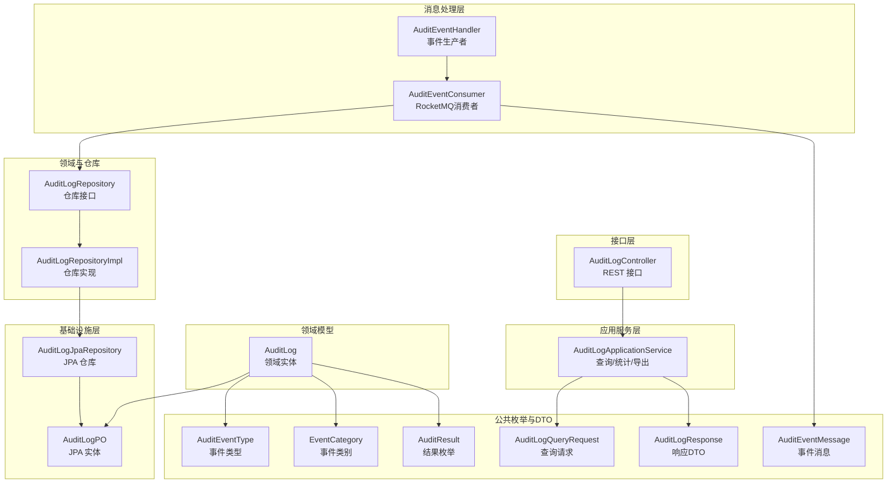
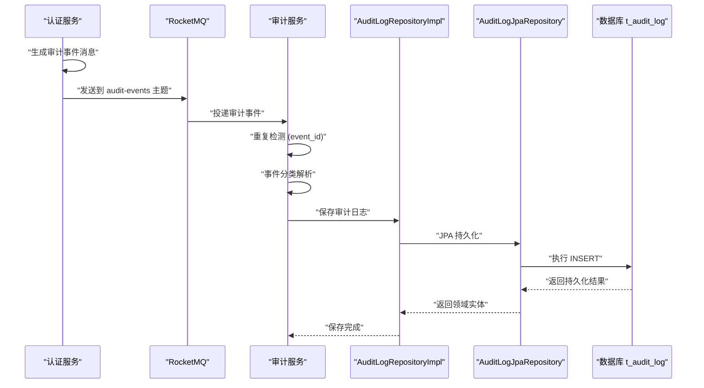
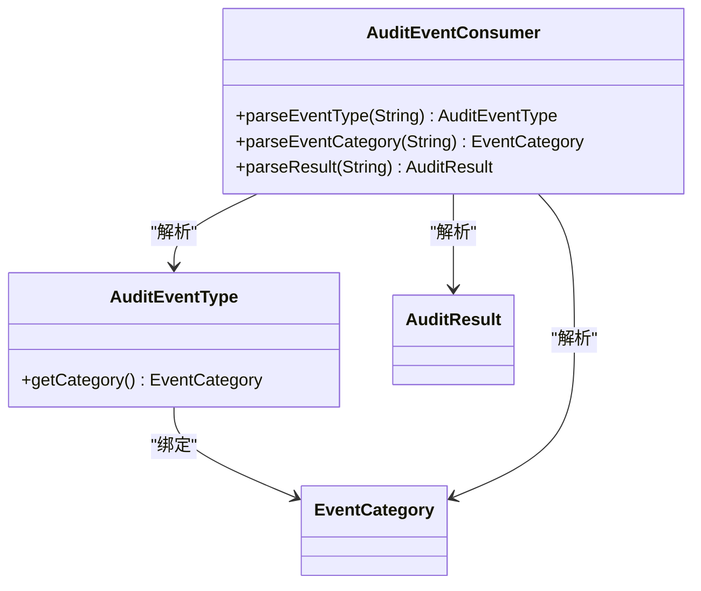
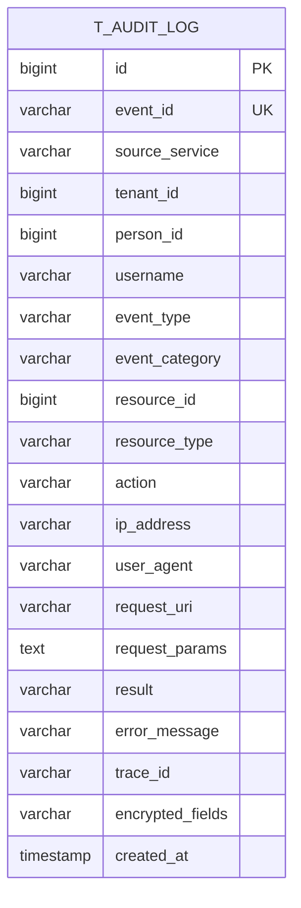
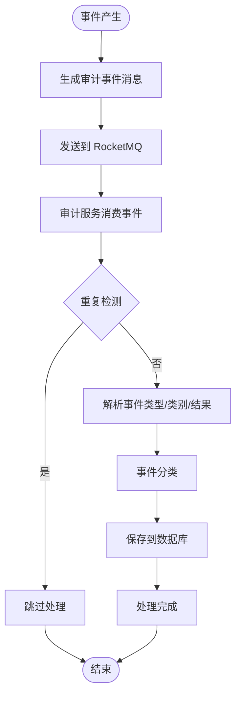
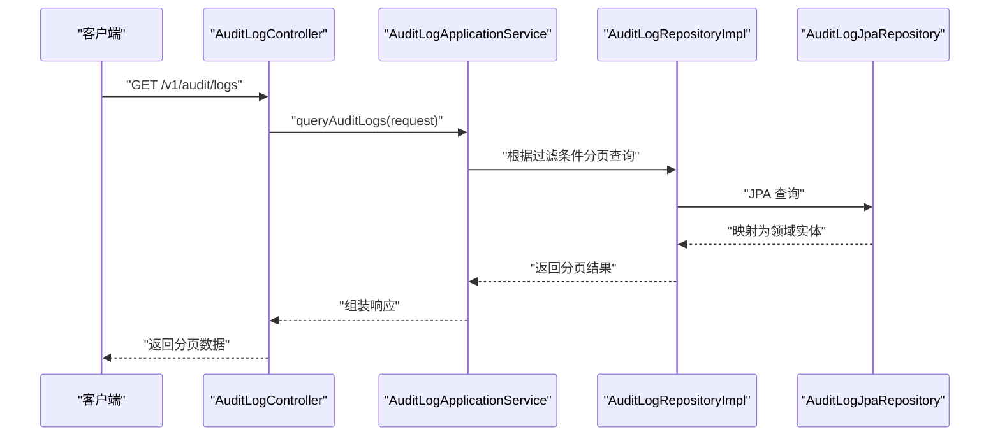
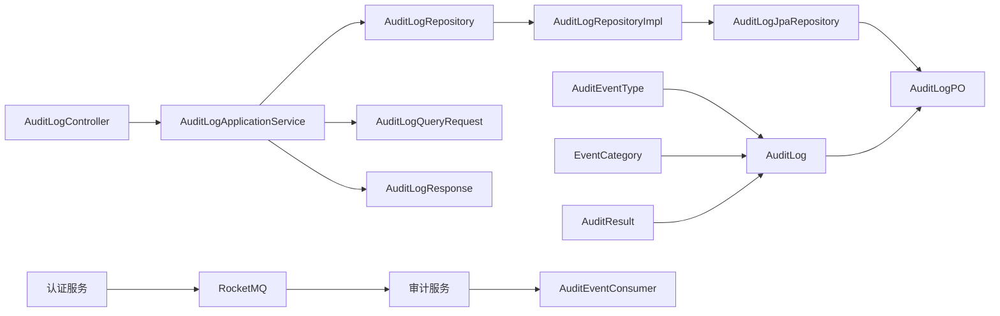
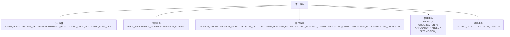
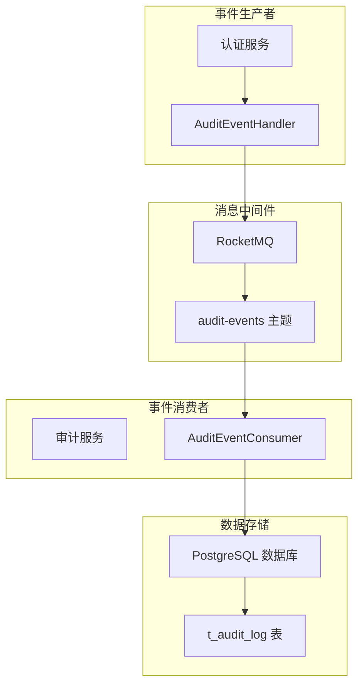

# 审计日志表

<cite>
**本文引用的文件**
- [AuditEventConsumer.java](file://iam-audit-server/src/main/java/iam/platform/audit/application/consumer/AuditEventConsumer.java)
- [AuditLog.java](file://iam-audit-server/src/main/java/iam/platform/audit/domain/model/entity/AuditLog.java)
- [AuditLogPO.java](file://iam-audit-server/src/main/java/iam/platform/audit/infrastructure/persistence/entity/AuditLogPO.java)
- [AuditLogRepository.java](file://iam-audit-server/src/main/java/iam/platform/audit/domain/repository/AuditLogRepository.java)
- [AuditLogJpaRepository.java](file://iam-audit-server/src/main/java/iam/platform/audit/infrastructure/persistence/repository/AuditLogJpaRepository.java)
- [AuditLogRepositoryImpl.java](file://iam-audit-server/src/main/java/iam/platform/audit/infrastructure/persistence/impl/AuditLogRepositoryImpl.java)
- [AuditLogApplicationService.java](file://iam-audit-server/src/main/java/iam/platform/audit/application/service/AuditLogApplicationService.java)
- [AuditLogController.java](file://iam-audit-server/src/main/java/iam/platform/audit/interfaces/controller/AuditLogController.java)
- [AuditEventHandler.java](file://iam-auth-server/src/main/java/iam/platform/auth/application/service/pipeline/AuditEventHandler.java)
- [application.yml](file://iam-audit-server/src/main/resources/application.yml)
- [AuditLogQueryRequest.java](file://iam-common/src/main/java/iam/platform/common/dto/request/AuditLogQueryRequest.java)
- [AuditLogResponse.java](file://iam-common/src/main/java/iam/platform/common/dto/response/AuditLogResponse.java)
- [AuditEventType.java](file://iam-common/src/main/java/iam/platform/common/model/enums/AuditEventType.java)
- [EventCategory.java](file://iam-common/src/main/java/iam/platform/common/model/enums/EventCategory.java)
- [AuditResult.java](file://iam-common/src/main/java/iam/platform/common/model/enums/AuditResult.java)
- [AuditEventMessage.java](file://iam-common/src/main/java/iam/platform/common/dto/AuditEventMessage.java)
</cite>

## 更新摘要
**所做更改**
- 更新了审计架构以反映新的基于RocketMQ的消息驱动模式
- 新增了审计事件消费者和生产者组件的详细说明
- 更新了数据采集策略以支持实时事件处理
- 增强了重复检测和事件分类机制的描述
- 更新了性能优化和索引设计章节以适应新架构
- 添加了新的架构图和事件流图

## 目录
1. [简介](#简介)
2. [项目结构](#项目结构)
3. [核心组件](#核心组件)
4. [架构总览](#架构总览)
5. [详细组件分析](#详细组件分析)
6. [依赖关系分析](#依赖关系分析)
7. [性能考虑](#性能考虑)
8. [故障排查指南](#故障排查指南)
9. [结论](#结论)
10. [附录](#附录)

## 简介
本文件围绕 IAM 平台审计日志表 t_audit_log 的设计与实现进行系统化说明，重点覆盖以下方面：
- 审计事件类型、事件类别与操作结果的分类体系
- 基于RocketMQ的消息驱动审计处理模式
- 实时审计事件处理、重复检测、事件分类和持久化
- 审计数据采集策略（用户操作、系统事件、安全相关事件）
- 敏感信息处理与脱敏策略
- 查询性能优化与索引设计
- 审计日志清理策略与保留期限管理
- 审计事件分类图与查询示例

## 项目结构
IAM 平台采用多模块分层架构，审计相关能力主要集中在审计服务器模块中：
- 领域模型与仓库接口：领域实体、仓库接口定义
- 基础设施层：JPA 实体、JPA 仓库、仓库实现
- 应用服务层：审计查询、统计、导出等业务逻辑
- 接口层：REST 控制器，提供审计日志查询、详情、统计与导出接口
- 消息处理层：RocketMQ消费者，处理实时审计事件
- 公共模块：审计事件类型、事件类别、结果枚举及请求/响应 DTO

**图表来源**
- [AuditEventConsumer.java:1-109](file://iam-audit-server/src/main/java/iam/platform/audit/application/consumer/AuditEventConsumer.java#L1-L109)
- [AuditEventHandler.java:1-94](file://iam-auth-server/src/main/java/iam/platform/auth/application/service/pipeline/AuditEventHandler.java#L1-L94)
- [AuditLogController.java:1-87](file://iam-audit-server/src/main/java/iam/platform/audit/interfaces/controller/AuditLogController.java#L1-L87)
- [AuditLogApplicationService.java:1-184](file://iam-audit-server/src/main/java/iam/platform/audit/application/service/AuditLogApplicationService.java#L1-L184)
- [AuditLogRepository.java:1-48](file://iam-audit-server/src/main/java/iam/platform/audit/domain/repository/AuditLogRepository.java#L1-L48)
- [AuditLogRepositoryImpl.java:1-122](file://iam-audit-server/src/main/java/iam/platform/audit/infrastructure/persistence/impl/AuditLogRepositoryImpl.java#L1-L122)
- [AuditLogJpaRepository.java:1-46](file://iam-audit-server/src/main/java/iam/platform/audit/infrastructure/persistence/repository/AuditLogJpaRepository.java#L1-L46)
- [AuditLogPO.java:1-102](file://iam-audit-server/src/main/java/iam/platform/audit/infrastructure/persistence/entity/AuditLogPO.java#L1-L102)
- [AuditLog.java:1-103](file://iam-audit-server/src/main/java/iam/platform/audit/domain/model/entity/AuditLog.java#L1-L103)
- [AuditLogQueryRequest.java:1-41](file://iam-common/src/main/java/iam/platform/common/dto/request/AuditLogQueryRequest.java#L1-L41)
- [AuditLogResponse.java:1-31](file://iam-common/src/main/java/iam/platform/common/dto/response/AuditLogResponse.java#L1-L31)
- [AuditEventType.java:1-59](file://iam-common/src/main/java/iam/platform/common/model/enums/AuditEventType.java#L1-L59)
- [EventCategory.java:1-13](file://iam-common/src/main/java/iam/platform/common/model/enums/EventCategory.java#L1-L13)
- [AuditResult.java:1-9](file://iam-common/src/main/java/iam/platform/common/model/enums/AuditResult.java#L1-L9)
- [AuditEventMessage.java:1-50](file://iam-common/src/main/java/iam/platform/common/dto/AuditEventMessage.java#L1-L50)

**章节来源**
- [AuditEventConsumer.java:1-109](file://iam-audit-server/src/main/java/iam/platform/audit/application/consumer/AuditEventConsumer.java#L1-L109)
- [AuditEventHandler.java:1-94](file://iam-auth-server/src/main/java/iam/platform/auth/application/service/pipeline/AuditEventHandler.java#L1-L94)
- [AuditLogController.java:1-87](file://iam-audit-server/src/main/java/iam/platform/audit/interfaces/controller/AuditLogController.java#L1-L87)
- [AuditLogApplicationService.java:1-184](file://iam-audit-server/src/main/java/iam/platform/audit/application/service/AuditLogApplicationService.java#L1-L184)
- [AuditLogRepository.java:1-48](file://iam-audit-server/src/main/java/iam/platform/audit/domain/repository/AuditLogRepository.java#L1-L48)
- [AuditLogRepositoryImpl.java:1-122](file://iam-audit-server/src/main/java/iam/platform/audit/infrastructure/persistence/impl/AuditLogRepositoryImpl.java#L1-L122)
- [AuditLogJpaRepository.java:1-46](file://iam-audit-server/src/main/java/iam/platform/audit/infrastructure/persistence/repository/AuditLogJpaRepository.java#L1-L46)
- [AuditLogPO.java:1-102](file://iam-audit-server/src/main/java/iam/platform/audit/infrastructure/persistence/entity/AuditLogPO.java#L1-L102)
- [AuditLog.java:1-103](file://iam-audit-server/src/main/java/iam/platform/audit/domain/model/entity/AuditLog.java#L1-L103)
- [AuditLogQueryRequest.java:1-41](file://iam-common/src/main/java/iam/platform/common/dto/request/AuditLogQueryRequest.java#L1-L41)
- [AuditLogResponse.java:1-31](file://iam-common/src/main/java/iam/platform/common/dto/response/AuditLogResponse.java#L1-L31)
- [AuditEventType.java:1-59](file://iam-common/src/main/java/iam/platform/common/model/enums/AuditEventType.java#L1-L59)
- [EventCategory.java:1-13](file://iam-common/src/main/java/iam/platform/common/model/enums/EventCategory.java#L1-L13)
- [AuditResult.java:1-9](file://iam-common/src/main/java/iam/platform/common/model/enums/AuditResult.java#L1-L9)
- [AuditEventMessage.java:1-50](file://iam-common/src/main/java/iam/platform/common/dto/AuditEventMessage.java#L1-L50)

## 核心组件
- **消息驱动架构**
  - RocketMQ消费者：监听audit-events主题，处理实时审计事件
  - 事件生产者：在认证服务中生成审计事件消息
  - 重复检测：基于event_id的去重机制
- **审计事件类型与分类**
  - 事件类型：登录/登出/刷新令牌、角色分配/撤销、权限变更、账户创建/更新/删除/锁定/解锁、密码修改、租户/组织/应用/角色/权限创建/更新/删除/启用/停用等
  - 事件类别：认证、授权、账户、管理、会话
  - 结果枚举：成功/失败
- **领域实体与持久化实体**
  - 领域实体包含不可变审计事件的完整信息，并提供工厂方法与查询辅助方法
  - JPA 实体映射到 t_audit_log 表，定义了关键字段与复合索引
- **仓库与查询**
  - 仓库接口定义读写、分页查询、统计与清理方法
  - JPA 仓库提供基于条件的分页查询与聚合统计
  - 仓库实现负责领域对象与持久化对象的转换
- **应用服务与接口**
  - 应用服务封装查询、统计、导出与异步保存逻辑
  - 控制器提供 REST 接口，支持按用户、资源、时间范围等维度查询与导出
- **消息处理与事件分类**
  - 自动解析事件类型、类别和结果枚举
  - 支持未知类型的容错处理
  - 基于RocketMQ的异步事件处理

**章节来源**
- [AuditEventConsumer.java:1-109](file://iam-audit-server/src/main/java/iam/platform/audit/application/consumer/AuditEventConsumer.java#L1-L109)
- [AuditLog.java:1-103](file://iam-audit-server/src/main/java/iam/platform/audit/domain/model/entity/AuditLog.java#L1-L103)
- [AuditLogPO.java:1-102](file://iam-audit-server/src/main/java/iam/platform/audit/infrastructure/persistence/entity/AuditLogPO.java#L1-L102)
- [AuditLogRepository.java:1-48](file://iam-audit-server/src/main/java/iam/platform/audit/domain/repository/AuditLogRepository.java#L1-L48)
- [AuditLogJpaRepository.java:1-46](file://iam-audit-server/src/main/java/iam/platform/audit/infrastructure/persistence/repository/AuditLogJpaRepository.java#L1-L46)
- [AuditLogRepositoryImpl.java:1-122](file://iam-audit-server/src/main/java/iam/platform/audit/infrastructure/persistence/impl/AuditLogRepositoryImpl.java#L1-L122)
- [AuditLogApplicationService.java:1-184](file://iam-audit-server/src/main/java/iam/platform/audit/application/service/AuditLogApplicationService.java#L1-L184)
- [AuditLogController.java:1-87](file://iam-audit-server/src/main/java/iam/platform/audit/interfaces/controller/AuditLogController.java#L1-L87)
- [AuditEventHandler.java:1-94](file://iam-auth-server/src/main/java/iam/platform/auth/application/service/pipeline/AuditEventHandler.java#L1-L94)
- [AuditEventType.java:1-59](file://iam-common/src/main/java/iam/platform/common/model/enums/AuditEventType.java#L1-L59)
- [EventCategory.java:1-13](file://iam-common/src/main/java/iam/platform/common/model/enums/EventCategory.java#L1-L13)
- [AuditResult.java:1-9](file://iam-common/src/main/java/iam/platform/common/model/enums/AuditResult.java#L1-L9)

## 架构总览
下图展示了从事件产生到消息消费与数据持久化的端到端流程。

**图表来源**
- [AuditEventHandler.java:35-78](file://iam-auth-server/src/main/java/iam/platform/auth/application/service/pipeline/AuditEventHandler.java#L35-L78)
- [AuditEventConsumer.java:32-73](file://iam-audit-server/src/main/java/iam/platform/audit/application/consumer/AuditEventConsumer.java#L32-L73)
- [AuditLogRepositoryImpl.java:33-37](file://iam-audit-server/src/main/java/iam/platform/audit/infrastructure/persistence/impl/AuditLogRepositoryImpl.java#L33-L37)
- [AuditLogJpaRepository.java:20-45](file://iam-audit-server/src/main/java/iam/platform/audit/infrastructure/persistence/repository/AuditLogJpaRepository.java#L20-L45)

## 详细组件分析

### 审计事件分类体系
- 事件类型与类别的映射由事件类型枚举维护，每个事件类型绑定一个事件类别
- 类别用于统计与报表维度，便于按认证、授权、账户、管理、会话等视角分析
- 消费者端提供容错处理，未知类型事件会被记录警告但不会中断处理流程

**图表来源**
- [AuditEventType.java:1-59](file://iam-common/src/main/java/iam/platform/common/model/enums/AuditEventType.java#L1-L59)
- [EventCategory.java:1-13](file://iam-common/src/main/java/iam/platform/common/model/enums/EventCategory.java#L1-L13)
- [AuditResult.java:1-9](file://iam-common/src/main/java/iam/platform/common/model/enums/AuditResult.java#L1-L9)
- [AuditEventConsumer.java:75-108](file://iam-audit-server/src/main/java/iam/platform/audit/application/consumer/AuditEventConsumer.java#L75-L108)

**章节来源**
- [AuditEventType.java:1-59](file://iam-common/src/main/java/iam/platform/common/model/enums/AuditEventType.java#L1-L59)
- [EventCategory.java:1-13](file://iam-common/src/main/java/iam/platform/common/model/enums/EventCategory.java#L1-L13)
- [AuditResult.java:1-9](file://iam-common/src/main/java/iam/platform/common/model/enums/AuditResult.java#L1-L9)
- [AuditEventConsumer.java:75-108](file://iam-audit-server/src/main/java/iam/platform/audit/application/consumer/AuditEventConsumer.java#L75-L108)

### 数据模型与表结构
- t_audit_log 字段涵盖租户、用户、事件类型与类别、资源标识、请求上下文、结果与错误信息、创建时间等
- 关键索引设计覆盖租户、人员、事件类型、事件类别、资源组合、结果、时间、以及复合索引以支撑常见查询
- 新增event_id唯一索引用于重复检测，trace_id索引用于分布式追踪

**图表来源**
- [AuditLogPO.java:14-102](file://iam-audit-server/src/main/java/iam/platform/audit/infrastructure/persistence/entity/AuditLogPO.java#L14-L102)

**章节来源**
- [AuditLogPO.java:14-102](file://iam-audit-server/src/main/java/iam/platform/audit/infrastructure/persistence/entity/AuditLogPO.java#L14-L102)

### 审计数据采集策略
- **消息驱动模式**：认证服务通过RocketMQ生产审计事件，审计服务异步消费处理
- **重复检测**：基于event_id的唯一性约束，避免重复事件的处理
- **实时处理**：事件产生后立即投递到消息队列，实现近实时的审计日志记录
- **容错处理**：未知事件类型会被记录警告但不影响整体处理流程
- **事件分类**：自动解析事件类型、类别和结果枚举，支持未知类型的降级处理

**图表来源**
- [AuditEventHandler.java:35-78](file://iam-auth-server/src/main/java/iam/platform/auth/application/service/pipeline/AuditEventHandler.java#L35-L78)
- [AuditEventConsumer.java:32-73](file://iam-audit-server/src/main/java/iam/platform/audit/application/consumer/AuditEventConsumer.java#L32-L73)

**章节来源**
- [AuditEventHandler.java:1-94](file://iam-auth-server/src/main/java/iam/platform/auth/application/service/pipeline/AuditEventHandler.java#L1-L94)
- [AuditEventConsumer.java:1-109](file://iam-audit-server/src/main/java/iam/platform/audit/application/consumer/AuditEventConsumer.java#L1-L109)

### 敏感信息处理与脱敏策略
- **加密存储**：配置文件中定义了敏感字段列表，包括requestParams和username
- **字段级加密**：支持对特定字段进行加密存储，增强数据安全性
- **参数脱敏**：对敏感字段进行脱敏处理，防止敏感信息泄露
- **长度限制**：对各字段设置适当的长度限制，防止数据膨胀
- **日志脱敏**：在日志输出中避免打印敏感信息

**章节来源**
- [application.yml:42-47](file://iam-audit-server/src/main/resources/application.yml#L42-L47)
- [AuditLogPO.java:77-90](file://iam-audit-server/src/main/java/iam/platform/audit/infrastructure/persistence/entity/AuditLogPO.java#L77-L90)

### 查询与统计
- **分页查询**：支持按租户、人员、事件类型、事件类别、资源类型+ID、时间范围等条件分页查询
- **统计分析**：按事件类别、结果、事件类型 TopN 维度统计
- **导出功能**：将满足条件的日志导出为 CSV 文件（带分页限制）
- **实时查询**：基于消息驱动的架构，查询结果包含最新的审计事件

**图表来源**
- [AuditLogController.java:28-32](file://iam-audit-server/src/main/java/iam/platform/audit/interfaces/controller/AuditLogController.java#L28-L32)
- [AuditLogApplicationService.java:36-74](file://iam-audit-server/src/main/java/iam/platform/audit/application/service/AuditLogApplicationService.java#L36-L74)
- [AuditLogRepositoryImpl.java:49-87](file://iam-audit-server/src/main/java/iam/platform/audit/infrastructure/persistence/impl/AuditLogRepositoryImpl.java#L49-L87)
- [AuditLogJpaRepository.java:20-45](file://iam-audit-server/src/main/java/iam/platform/audit/infrastructure/persistence/repository/AuditLogJpaRepository.java#L20-L45)

**章节来源**
- [AuditLogApplicationService.java:1-184](file://iam-audit-server/src/main/java/iam/platform/audit/application/service/AuditLogApplicationService.java#L1-L184)
- [AuditLogRepository.java:1-48](file://iam-audit-server/src/main/java/iam/platform/audit/domain/repository/AuditLogRepository.java#L1-L48)
- [AuditLogJpaRepository.java:1-46](file://iam-audit-server/src/main/java/iam/platform/audit/infrastructure/persistence/repository/AuditLogJpaRepository.java#L1-L46)

### 清理策略与保留期限
- 提供按截止时间删除旧日志的仓库方法，便于实现基于时间的保留策略
- 支持批量删除操作，提高清理效率
- 建议结合定时任务或运维脚本定期清理超出保留期的数据

**章节来源**
- [AuditLogRepository.java:46](file://iam-audit-server/src/main/java/iam/platform/audit/domain/repository/AuditLogRepository.java#L46)
- [AuditLogJpaRepository.java:44](file://iam-audit-server/src/main/java/iam/platform/audit/infrastructure/persistence/repository/AuditLogJpaRepository.java#L44)

## 依赖关系分析
- 控制器依赖应用服务
- 应用服务依赖仓库接口与装配器
- 仓库实现依赖 JPA 仓库
- JPA 仓库依赖 JPA/Hibernate 运行时
- 领域实体与持久化实体之间存在一对一映射关系
- 公共枚举在多个模块中被复用
- 认证服务通过RocketMQ向审计服务发送事件

**图表来源**
- [AuditLogController.java:24-26](file://iam-audit-server/src/main/java/iam/platform/audit/interfaces/controller/AuditLogController.java#L24-L26)
- [AuditLogApplicationService.java:32-34](file://iam-audit-server/src/main/java/iam/platform/audit/application/service/AuditLogApplicationService.java#L32-L34)
- [AuditLogRepository.java:18-47](file://iam-audit-server/src/main/java/iam/platform/audit/domain/repository/AuditLogRepository.java#L18-L47)
- [AuditLogRepositoryImpl.java:25-121](file://iam-audit-server/src/main/java/iam/platform/audit/infrastructure/persistence/impl/AuditLogRepositoryImpl.java#L25-L121)
- [AuditLogJpaRepository.java:20-45](file://iam-audit-server/src/main/java/iam/platform/audit/infrastructure/persistence/repository/AuditLogJpaRepository.java#L20-L45)
- [AuditLogPO.java:28-101](file://iam-audit-server/src/main/java/iam/platform/audit/infrastructure/persistence/entity/AuditLogPO.java#L28-L101)
- [AuditLog.java:18-103](file://iam-audit-server/src/main/java/iam/platform/audit/domain/model/entity/AuditLog.java#L18-L103)
- [AuditLogQueryRequest.java:1-41](file://iam-common/src/main/java/iam/platform/common/dto/request/AuditLogQueryRequest.java#L1-L41)
- [AuditLogResponse.java:1-31](file://iam-common/src/main/java/iam/platform/common/dto/response/AuditLogResponse.java#L1-L31)
- [AuditEventType.java:1-59](file://iam-common/src/main/java/iam/platform/common/model/enums/AuditEventType.java#L1-L59)
- [EventCategory.java:1-13](file://iam-common/src/main/java/iam/platform/common/model/enums/EventCategory.java#L1-L13)
- [AuditResult.java:1-9](file://iam-common/src/main/java/iam/platform/common/model/enums/AuditResult.java#L1-L9)
- [AuditEventHandler.java:24-33](file://iam-auth-server/src/main/java/iam/platform/auth/application/service/pipeline/AuditEventHandler.java#L24-L33)

## 性能考虑
- **消息队列优化**
  - RocketMQ集群部署，支持高吞吐量的审计事件处理
  - 消费者组配置，支持水平扩展
  - 消息分区策略，确保事件有序性和处理效率
- **索引设计**
  - 单列索引：租户、人员、事件类型、事件类别、结果、创建时间、event_id、trace_id
  - 复合索引：资源类型+ID、租户+事件类别+创建时间、source_service+created_at
  - 作用：支撑高频查询路径（按租户/人员/事件类型/时间范围/资源）与统计聚合
- **分页与排序**
  - 默认按创建时间倒序，避免全表扫描
  - 查询请求支持自定义排序字段与方向
- **导出限制**
  - 导出接口限制最大查询条数，防止大范围导出导致内存压力
- **重复检测优化**
  - 基于event_id的唯一索引，快速去重
  - 内存缓存机制，减少数据库查询次数

**章节来源**
- [application.yml:36-39](file://iam-audit-server/src/main/resources/application.yml#L36-L39)
- [AuditLogPO.java:15-27](file://iam-audit-server/src/main/java/iam/platform/audit/infrastructure/persistence/entity/AuditLogPO.java#L15-L27)
- [AuditEventConsumer.java:37-41](file://iam-audit-server/src/main/java/iam/platform/audit/application/consumer/AuditEventConsumer.java#L37-L41)
- [AuditLogApplicationService.java:1-184](file://iam-audit-server/src/main/java/iam/platform/audit/application/service/AuditLogApplicationService.java#L1-L184)
- [AuditLogRepository.java:1-48](file://iam-audit-server/src/main/java/iam/platform/audit/domain/repository/AuditLogRepository.java#L1-L48)

## 故障排查指南
- **消息处理失败**
  - RocketMQ消费者捕获异常并记录日志，支持重试机制
  - 未知事件类型会被记录警告但不影响其他事件处理
- **重复事件处理**
  - 基于event_id的唯一约束，重复事件会被跳过处理
  - 检查event_id生成机制，确保唯一性
- **事件分类错误**
  - 消费者端提供容错处理，未知类型事件会被记录警告
  - 检查事件消息格式，确保枚举值正确
- **查询性能问题**
  - 确认相关索引是否存在且有效
  - 检查查询条件是否能够利用索引
- **内存溢出**
  - 导出接口有最大查询限制
  - 分批处理大量数据导出

**章节来源**
- [AuditEventConsumer.java:69-73](file://iam-audit-server/src/main/java/iam/platform/audit/application/consumer/AuditEventConsumer.java#L69-L73)
- [AuditEventConsumer.java:82-84](file://iam-audit-server/src/main/java/iam/platform/audit/application/consumer/AuditEventConsumer.java#L82-L84)
- [AuditEventConsumer.java:105-108](file://iam-audit-server/src/main/java/iam/platform/audit/application/consumer/AuditEventConsumer.java#L105-L108)
- [AuditLogApplicationService.java:127-149](file://iam-audit-server/src/main/java/iam/platform/audit/application/service/AuditLogApplicationService.java#L127-L149)

## 结论
本设计以基于RocketMQ的消息驱动架构为核心，实现了高可用、高性能的审计日志系统。通过实时事件处理、智能重复检测和完善的事件分类机制，系统能够在保证数据完整性的同时提供优秀的性能表现。新的架构模式替代了原有的AOP方式，提供了更好的扩展性和可靠性。通过合理的索引设计和分页机制，保障了查询与统计的性能；同时提供清理接口以支持合规的保留期限管理。整体架构层次分明、职责清晰，便于扩展与维护。

## 附录

### 审计事件分类图

**图表来源**
- [AuditEventType.java:1-59](file://iam-common/src/main/java/iam/platform/common/model/enums/AuditEventType.java#L1-L59)
- [EventCategory.java:1-13](file://iam-common/src/main/java/iam/platform/common/model/enums/EventCategory.java#L1-L13)

### 查询示例（路径）
- **按用户查询**
  - 路径：[AuditLogController.java:42-49](file://iam-audit-server/src/main/java/iam/platform/audit/interfaces/controller/AuditLogController.java#L42-L49)
  - 服务：[AuditLogApplicationService.java:80-89](file://iam-audit-server/src/main/java/iam/platform/audit/application/service/AuditLogApplicationService.java#L80-L89)
- **按资源查询**
  - 路径：[AuditLogController.java:51-59](file://iam-audit-server/src/main/java/iam/platform/audit/interfaces/controller/AuditLogController.java#L51-L59)
  - 服务：[AuditLogApplicationService.java:91-102](file://iam-audit-server/src/main/java/iam/platform/audit/application/service/AuditLogApplicationService.java#L91-L102)
- **时间范围统计**
  - 路径：[AuditLogController.java:61-71](file://iam-audit-server/src/main/java/iam/platform/audit/interfaces/controller/AuditLogController.java#L61-L71)
  - 统计实现：[AuditLogApplicationService.java:104-125](file://iam-audit-server/src/main/java/iam/platform/audit/application/service/AuditLogApplicationService.java#L104-L125)
- **导出 CSV**
  - 路径：[AuditLogController.java:73-85](file://iam-audit-server/src/main/java/iam/platform/audit/interfaces/controller/AuditLogController.java#L73-L85)
  - 导出实现：[AuditLogApplicationService.java:127-149](file://iam-audit-server/src/main/java/iam/platform/audit/application/service/AuditLogApplicationService.java#L127-L149)

### 消息驱动架构图

**图表来源**
- [AuditEventHandler.java:24-33](file://iam-auth-server/src/main/java/iam/platform/auth/application/service/pipeline/AuditEventHandler.java#L24-L33)
- [AuditEventConsumer.java:21-27](file://iam-audit-server/src/main/java/iam/platform/audit/application/consumer/AuditEventConsumer.java#L21-L27)
- [application.yml:36-39](file://iam-audit-server/src/main/resources/application.yml#L36-L39)