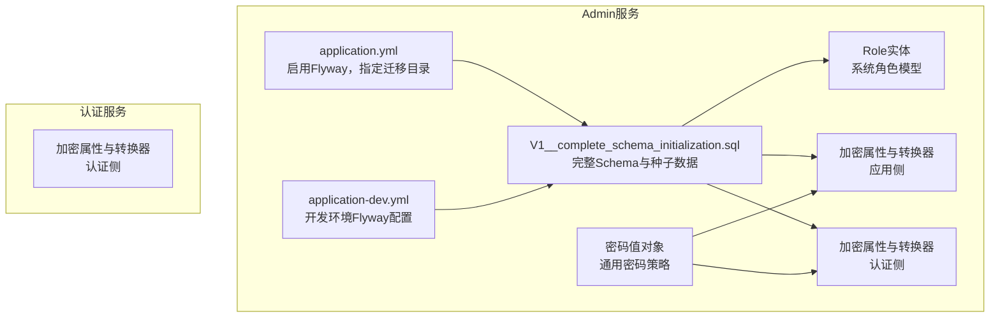
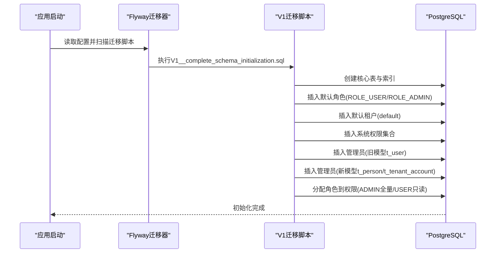
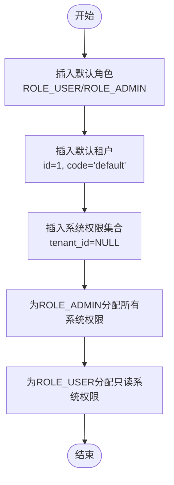
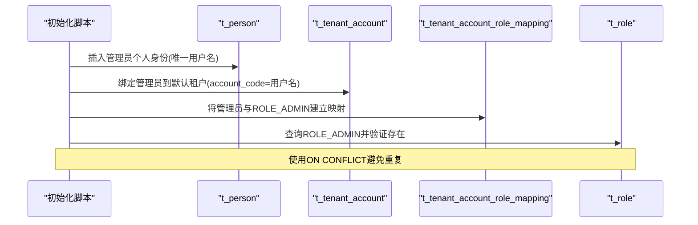
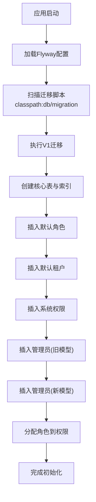
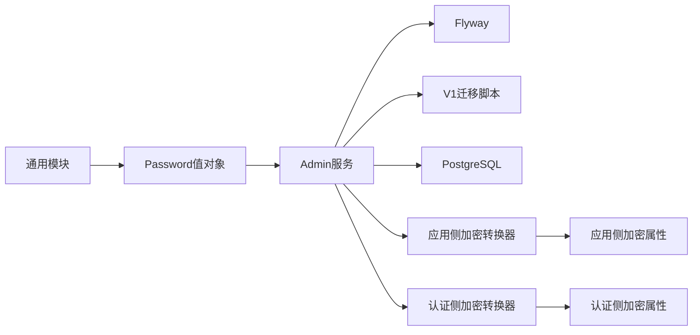

# 数据初始化

<cite>
**本文引用的文件**
- [V1__complete_schema_initialization.sql](file://iam-admin-server/src/main/resources/db/migration/V1__complete_schema_initialization.sql)
- [application.yml](file://iam-admin-server/src/main/resources/application.yml)
- [application-dev.yml](file://iam-admin-server/src/main/resources/application-dev.yml)
- [pom.xml](file://iam-admin-server/pom.xml)
- [Role.java](file://iam-admin-server/src/main/java/iam/platform/admin/domain/model/entity/Role.java)
- [EncryptedStringConverter.java](file://iam-admin-server/src/main/java/iam/platform/admin/infrastructure/persistence/converter/EncryptedStringConverter.java)
- [EncryptionProperties.java](file://iam-admin-server/src/main/java/iam/platform/admin/infrastructure/config/EncryptionProperties.java)
- [EncryptedStringConverter.java](file://iam-auth-server/src/main/java/iam/platform/auth/infrastructure/persistence/converter/EncryptedStringConverter.java)
- [EncryptionProperties.java](file://iam-auth-server/src/main/java/iam/platform/auth/infrastructure/config/EncryptionProperties.java)
- [Password.java](file://iam-common/src/main/java/iam/platform/common/model/valueobject/Password.java)
- [TenantAccountCreationPolicy.java](file://iam-admin-server/src/main/java/iam/platform/admin/domain/service/TenantAccountCreationPolicy.java)
- [TenantAccountCreationPolicyImpl.java](file://iam-admin-server/src/main/java/iam/platform/admin/domain/service/impl/TenantAccountCreationPolicyImpl.java)
- [JwtUserContextFilter.java](file://iam-admin-server/src/main/java/iam/platform/admin/infrastructure/security/JwtUserContextFilter.java)
</cite>

## 目录
1. [简介](#简介)
2. [项目结构](#项目结构)
3. [核心组件](#核心组件)
4. [架构总览](#架构总览)
5. [详细组件分析](#详细组件分析)
6. [依赖关系分析](#依赖关系分析)
7. [性能考量](#性能考量)
8. [故障排查指南](#故障排查指南)
9. [结论](#结论)
10. [附录](#附录)

## 简介
本文件面向IAM平台的数据库初始化与种子数据，系统性阐述以下内容：
- 种子数据设计与初始化策略：系统默认角色（ROLE_USER、ROLE_ADMIN）、默认租户、系统权限集合
- 默认租户创建与系统权限初始化流程
- 管理员账户创建流程与安全配置要点（密码哈希、加密转换器）
- 数据迁移与版本兼容性处理策略（Flyway、ON CONFLICT）
- 初始化最佳实践与常见问题解决方案
- 提供初始化流程图与数据结构示例，帮助理解系统启动时的完整数据准备过程

## 项目结构
IAM平台采用多模块架构，数据库初始化由Admin服务负责，通过Flyway执行SQL迁移脚本，完成表结构与种子数据的初始化。

**图表来源**
- [application.yml:37-41](file://iam-admin-server/src/main/resources/application.yml#L37-L41)
- [application-dev.yml:7-8](file://iam-admin-server/src/main/resources/application-dev.yml#L7-L8)
- [V1__complete_schema_initialization.sql:1-232](file://iam-admin-server/src/main/resources/db/migration/V1__complete_schema_initialization.sql#L1-L232)
- [Role.java:1-82](file://iam-admin-server/src/main/java/iam/platform/admin/domain/model/entity/Role.java#L1-L82)
- [EncryptedStringConverter.java:1-108](file://iam-admin-server/src/main/java/iam/platform/admin/infrastructure/persistence/converter/EncryptedStringConverter.java#L1-L108)
- [EncryptionProperties.java:1-14](file://iam-admin-server/src/main/java/iam/platform/admin/infrastructure/config/EncryptionProperties.java#L1-L14)
- [EncryptedStringConverter.java:1-108](file://iam-auth-server/src/main/java/iam/platform/auth/infrastructure/persistence/converter/EncryptedStringConverter.java#L1-L108)
- [EncryptionProperties.java:1-14](file://iam-auth-server/src/main/java/iam/platform/auth/infrastructure/config/EncryptionProperties.java#L1-L14)
- [Password.java:1-72](file://iam-common/src/main/java/iam/platform/common/model/valueobject/Password.java#L1-L72)

**章节来源**
- [application.yml:37-41](file://iam-admin-server/src/main/resources/application.yml#L37-L41)
- [application-dev.yml:7-8](file://iam-admin-server/src/main/resources/application-dev.yml#L7-L8)
- [V1__complete_schema_initialization.sql:1-232](file://iam-admin-server/src/main/resources/db/migration/V1__complete_schema_initialization.sql#L1-L232)

## 核心组件
- Flyway迁移配置：在Admin服务中启用Flyway，并指向classpath:db/migration目录，确保启动时自动执行V1迁移脚本。
- 完整Schema与种子数据：V1脚本一次性创建所有核心表与默认数据（角色、租户、权限、管理员）。
- 角色模型：Role实体支持系统内置角色与租户自定义角色，系统角色不可删除。
- 加密与安全：应用侧与认证侧均提供AES-GCM加密转换器与属性配置；通用Password值对象提供密码策略校验。
- 初始化策略：使用ON CONFLICT避免重复插入，保证幂等性与版本兼容。

**章节来源**
- [application.yml:37-41](file://iam-admin-server/src/main/resources/application.yml#L37-L41)
- [V1__complete_schema_initialization.sql:581-719](file://iam-admin-server/src/main/resources/db/migration/V1__complete_schema_initialization.sql#L581-L719)
- [Role.java:27-82](file://iam-admin-server/src/main/java/iam/platform/admin/domain/model/entity/Role.java#L27-L82)
- [EncryptedStringConverter.java:28-41](file://iam-admin-server/src/main/java/iam/platform/admin/infrastructure/persistence/converter/EncryptedStringConverter.java#L28-L41)
- [EncryptionProperties.java:11-14](file://iam-admin-server/src/main/java/iam/platform/admin/infrastructure/config/EncryptionProperties.java#L11-L14)
- [EncryptedStringConverter.java:28-41](file://iam-auth-server/src/main/java/iam/platform/auth/infrastructure/persistence/converter/EncryptedStringConverter.java#L28-L41)
- [EncryptionProperties.java:11-14](file://iam-auth-server/src/main/java/iam/platform/auth/infrastructure/config/EncryptionProperties.java#L11-L14)
- [Password.java:37-72](file://iam-common/src/main/java/iam/platform/common/model/valueobject/Password.java#L37-L72)

## 架构总览
系统启动时的初始化流程如下：

**图表来源**
- [application.yml:37-41](file://iam-admin-server/src/main/resources/application.yml#L37-L41)
- [V1__complete_schema_initialization.sql:581-719](file://iam-admin-server/src/main/resources/db/migration/V1__complete_schema_initialization.sql#L581-L719)

## 详细组件分析

### 默认角色与权限分配
- 系统默认角色
  - ROLE_USER：普通用户，默认具备只读权限
  - ROLE_ADMIN：管理员，具备全部系统权限
- 权限分配策略
  - ADMIN：对所有tenant_id为NULL的系统权限进行全量授权
  - USER：仅对action=READ的系统权限进行授权
- 幂等性保障：使用ON CONFLICT避免重复插入

**图表来源**
- [V1__complete_schema_initialization.sql:581-719](file://iam-admin-server/src/main/resources/db/migration/V1__complete_schema_initialization.sql#L581-L719)

**章节来源**
- [V1__complete_schema_initialization.sql:581-719](file://iam-admin-server/src/main/resources/db/migration/V1__complete_schema_initialization.sql#L581-L719)
- [Role.java:27-82](file://iam-admin-server/src/main/java/iam/platform/admin/domain/model/entity/Role.java#L27-L82)

### 默认租户创建
- 默认租户ID固定为1，编码为"default"，名称为“默认租户”，状态为ACTIVE
- 同步重置租户序列，确保后续自增主键连续性
- 该租户作为系统级默认上下文，用于初始化管理员账户与基础资源

**章节来源**
- [V1__complete_schema_initialization.sql:590-596](file://iam-admin-server/src/main/resources/db/migration/V1__complete_schema_initialization.sql#L590-L596)

### 管理员账户创建流程与安全配置
- 旧模型（兼容）：向t_user插入管理员用户，密码字段存储BCrypt哈希
- 新模型（推荐）：向t_person插入管理员个人身份，再向t_tenant_account绑定到默认租户，最后授予ROLE_ADMIN
- 密码安全：使用BCrypt哈希存储；通用Password值对象提供最小长度与复杂度策略
- 应用侧加密：提供AES-256-GCM加密转换器与属性配置，用于敏感字段（如应用密钥）的加解密
- 认证侧加密：与应用侧一致的加密机制，确保跨模块一致性

**图表来源**
- [V1__complete_schema_initialization.sql:661-692](file://iam-admin-server/src/main/resources/db/migration/V1__complete_schema_initialization.sql#L661-L692)
- [Role.java:71-73](file://iam-admin-server/src/main/java/iam/platform/admin/domain/model/entity/Role.java#L71-L73)

**章节来源**
- [V1__complete_schema_initialization.sql:644-692](file://iam-admin-server/src/main/resources/db/migration/V1__complete_schema_initialization.sql#L644-L692)
- [Password.java:37-72](file://iam-common/src/main/java/iam/platform/common/model/valueobject/Password.java#L37-L72)
- [EncryptedStringConverter.java:28-41](file://iam-admin-server/src/main/java/iam/platform/admin/infrastructure/persistence/converter/EncryptedStringConverter.java#L28-L41)
- [EncryptionProperties.java:11-14](file://iam-admin-server/src/main/java/iam/platform/admin/infrastructure/config/EncryptionProperties.java#L11-L14)
- [EncryptedStringConverter.java:28-41](file://iam-auth-server/src/main/java/iam/platform/auth/infrastructure/persistence/converter/EncryptedStringConverter.java#L28-L41)
- [EncryptionProperties.java:11-14](file://iam-auth-server/src/main/java/iam/platform/auth/infrastructure/config/EncryptionProperties.java#L11-L14)

### 数据迁移与版本兼容性
- 迁移工具：Flyway启用并扫描classpath:db/migration目录
- 版本策略：V1脚本一次性完成完整Schema与种子数据，避免多版本叠加导致的复杂性
- 兼容性保障：大量使用ON CONFLICT (code/username/tenant_id,account_code/permission_code/role_id)避免重复初始化
- 开发环境：application-dev.yml同样启用Flyway，便于本地调试

**章节来源**
- [application.yml:37-41](file://iam-admin-server/src/main/resources/application.yml#L37-L41)
- [application-dev.yml:7-8](file://iam-admin-server/src/main/resources/application-dev.yml#L7-L8)
- [pom.xml:78-80](file://iam-admin-server/pom.xml#L78-L80)
- [V1__complete_schema_initialization.sql:584-719](file://iam-admin-server/src/main/resources/db/migration/V1__complete_schema_initialization.sql#L584-L719)

### 初始化流程图（系统启动时）

**图表来源**
- [application.yml:37-41](file://iam-admin-server/src/main/resources/application.yml#L37-L41)
- [V1__complete_schema_initialization.sql:581-719](file://iam-admin-server/src/main/resources/db/migration/V1__complete_schema_initialization.sql#L581-L719)

## 依赖关系分析
- 外部依赖
  - PostgreSQL：持久化后端
  - Flyway：数据库迁移管理
- 内部依赖
  - Admin服务依赖Flyway与V1脚本完成初始化
  - 加密转换器依赖安全属性配置
  - 通用Password值对象提供跨模块密码策略

**图表来源**
- [pom.xml:71-80](file://iam-admin-server/pom.xml#L71-L80)
- [application.yml:37-41](file://iam-admin-server/src/main/resources/application.yml#L37-L41)
- [EncryptedStringConverter.java:28-41](file://iam-admin-server/src/main/java/iam/platform/admin/infrastructure/persistence/converter/EncryptedStringConverter.java#L28-L41)
- [EncryptionProperties.java:11-14](file://iam-admin-server/src/main/java/iam/platform/admin/infrastructure/config/EncryptionProperties.java#L11-L14)
- [EncryptedStringConverter.java:28-41](file://iam-auth-server/src/main/java/iam/platform/auth/infrastructure/persistence/converter/EncryptedStringConverter.java#L28-L41)
- [EncryptionProperties.java:11-14](file://iam-auth-server/src/main/java/iam/platform/auth/infrastructure/config/EncryptionProperties.java#L11-L14)
- [Password.java:37-72](file://iam-common/src/main/java/iam/platform/common/model/valueobject/Password.java#L37-L72)

**章节来源**
- [pom.xml:71-80](file://iam-admin-server/pom.xml#L71-L80)
- [application.yml:37-41](file://iam-admin-server/src/main/resources/application.yml#L37-L41)
- [EncryptedStringConverter.java:28-41](file://iam-admin-server/src/main/java/iam/platform/admin/infrastructure/persistence/converter/EncryptedStringConverter.java#L28-L41)
- [EncryptionProperties.java:11-14](file://iam-admin-server/src/main/java/iam/platform/admin/infrastructure/config/EncryptionProperties.java#L11-L14)
- [EncryptedStringConverter.java:28-41](file://iam-auth-server/src/main/java/iam/platform/auth/infrastructure/persistence/converter/EncryptedStringConverter.java#L28-L41)
- [EncryptionProperties.java:11-14](file://iam-auth-server/src/main/java/iam/platform/auth/infrastructure/config/EncryptionProperties.java#L11-L14)
- [Password.java:37-72](file://iam-common/src/main/java/iam/platform/common/model/valueobject/Password.java#L37-L72)

## 性能考量
- Flyway迁移在启动阶段执行，建议在生产环境将迁移脚本拆分为更细粒度版本以降低单次迁移时间
- ON CONFLICT的广泛使用提升了幂等性，减少重复初始化成本
- 密钥长度与加密算法（AES-256-GCM）在保证安全性的同时需关注加解密开销
- 建议在高并发场景下评估初始化阶段对数据库连接池的影响

## 故障排查指南
- 迁移失败
  - 检查Flyway配置是否正确指向classpath:db/migration
  - 确认数据库连接参数与权限
- 重复初始化
  - 脚本已使用ON CONFLICT避免重复，若仍出现异常，检查目标列唯一性约束
- 密钥无效
  - 应用侧与认证侧加密转换器会校验密钥长度，长度不正确时会降级为禁用加密
  - 检查ENCRYPTION_KEY配置是否为32字节长度
- 管理员账户无法登录
  - 确认t_person与t_tenant_account是否成功绑定至默认租户
  - 验证t_tenant_account_role_mapping是否授予ROLE_ADMIN
- 角色权限异常
  - 检查t_role_permission是否按策略为ADMIN全量授权、为USER只读授权

**章节来源**
- [application.yml:37-41](file://iam-admin-server/src/main/resources/application.yml#L37-L41)
- [EncryptedStringConverter.java:33-41](file://iam-admin-server/src/main/java/iam/platform/admin/infrastructure/persistence/converter/EncryptedStringConverter.java#L33-L41)
- [EncryptionProperties.java:11-14](file://iam-admin-server/src/main/java/iam/platform/admin/infrastructure/config/EncryptionProperties.java#L11-L14)
- [EncryptedStringConverter.java:33-41](file://iam-auth-server/src/main/java/iam/platform/auth/infrastructure/persistence/converter/EncryptedStringConverter.java#L33-L41)
- [EncryptionProperties.java:11-14](file://iam-auth-server/src/main/java/iam/platform/auth/infrastructure/config/EncryptionProperties.java#L11-L14)
- [V1__complete_schema_initialization.sql:685-719](file://iam-admin-server/src/main/resources/db/migration/V1__complete_schema_initialization.sql#L685-L719)

## 结论
IAM平台通过Flyway与V1迁移脚本实现了完整的数据库初始化，覆盖角色、租户、权限与管理员账户的种子数据。系统采用幂等性设计（ON CONFLICT）与多层安全配置（BCrypt、AES-GCM），确保初始化过程稳定可靠。建议在生产环境中结合业务演进逐步拆分迁移版本，并持续完善监控与告警体系。

## 附录
- 最佳实践
  - 在开发环境使用application-dev.yml启用Flyway，便于快速迭代
  - 初始化完成后，建议对关键表添加必要的索引与分区策略
  - 对敏感字段（如应用密钥）启用加密转换器，并妥善管理密钥
- 常见问题
  - 若出现“密钥长度不正确”警告，请检查ENCRYPTION_KEY长度为32字节
  - 若管理员无法登录，请核对t_person、t_tenant_account与t_tenant_account_role_mapping三表关联关系
  - 若迁移卡住，请检查数据库连接与权限，确认Flyway版本与驱动兼容