# 数据库架构

<cite>
**本文引用的文件**
- [V1__complete_schema_initialization.sql](file://iam-admin-server/src/main/resources/db/migration/V1__complete_schema_initialization.sql)
- [V2__admin_ui_support.sql](file://iam-admin-server/src/main/resources/db/migration/V2__admin_ui_support.sql)
- [V3__add_audit_log_tracing_fields.sql](file://iam-admin-server/src/main/resources/db/migration/V3__add_audit_log_tracing_fields.sql)
- [V4__audit_advanced_features.sql](file://iam-admin-server/src/main/resources/db/migration/V4__audit_advanced_features.sql)
- [V5__user_credential_migration.sql](file://iam-admin-server/src/main/resources/db/migration/V5__user_credential_migration.sql)
- [V1__audit_schema_initialization.sql](file://iam-audit-server/src/main/resources/db/migration/V1__audit_schema_initialization.sql)
- [application.yml（管理端）](file://iam-admin-server/src/main/resources/application.yml)
- [application.yml（认证端）](file://iam-auth-server/src/main/resources/application.yml)
- [Person.java](file://iam-admin-server/src/main/java/iam/platform/admin/domain/model/entity/Person.java)
- [TenantAccount.java](file://iam-admin-server/src/main/java/iam/platform/admin/domain/model/entity/TenantAccount.java)
- [Organization.java](file://iam-admin-server/src/main/java/iam/platform/admin/domain/model/entity/Organization.java)
- [Application.java](file://iam-admin-server/src/main/java/iam/platform/admin/domain/model/entity/Application.java)
- [Role.java](file://iam-admin-server/src/main/java/iam/platform/admin/domain/model/entity/Role.java)
- [Tenant.java](file://iam-admin-server/src/main/java/iam/platform/admin/domain/model/entity/Tenant.java)
- [AuditLog.java](file://iam-admin-server/src/main/java/iam/platform/admin/domain/model/entity/AuditLog.java)
- [PersonExternalLogin.java](file://iam-admin-server/src/main/java/iam/platform/admin/domain/model/entity/PersonExternalLogin.java)
- [ApplicationPermission.java](file://iam-admin-server/src/main/java/iam/platform/admin/domain/model/entity/ApplicationPermission.java)
- [UserCredential.java](file://iam-admin-server/src/main/java/iam/platform/admin/domain/model/entity/UserCredential.java)
- [UserCredentialApplicationService.java](file://iam-admin-server/src/main/java/iam/platform/admin/application/service/UserCredentialApplicationService.java)
- [UserCredentialRepository.java](file://iam-admin-server/src/main/java/iam/platform/admin/domain/repository/UserCredentialRepository.java)
- [UserCredentialController.java](file://iam-admin-server/src/main/java/iam/platform/admin/interfaces/rest/UserCredentialController.java)
- [UserCredentialPO.java](file://iam-admin-server/src/main/java/iam/platform/admin/infrastructure/persistence/entity/UserCredentialPO.java)
- [CredentialType.java](file://iam-common/src/main/java/iam/platform/common/model/enums/CredentialType.java)
- [CredentialStatus.java](file://iam-common/src/main/java/iam/platform/common/model/enums/CredentialStatus.java)
</cite>

## 更新摘要
**所做更改**
- 优化用户凭证迁移脚本，增强触发器逻辑和冲突解决机制
- 改进时间戳管理和主要凭证记录的冲突处理
- 新增详细的触发器函数实现和ON CONFLICT处理逻辑
- 更新凭证系统的完整性约束和索引设计
- 增强凭证迁移过程中的数据一致性保证

## 目录
1. [简介](#简介)
2. [项目结构](#项目结构)
3. [核心组件](#核心组件)
4. [架构总览](#架构总览)
5. [详细组件分析](#详细组件分析)
6. [依赖分析](#依赖分析)
7. [性能考虑](#性能考虑)
8. [故障排查指南](#故障排查指南)
9. [结论](#结论)
10. [附录](#附录)

## 简介
本文件系统化梳理 IAM 平台数据库架构，重点覆盖：
- 多租户架构设计与实现要点
- 表结构布局与设计原则
- 核心领域模型：用户身份模型（Person/TenantAccount）、权限体系（Role/Permission）、应用管理（Application）、组织架构（Organization）
- **新增**：用户凭证系统设计，支持密码和数字证书等多种认证方式
- **新增**：审计高级功能，包括实时告警、SIEM集成和合规报告
- **更新**：优化的用户凭证迁移脚本，包含增强的触发器逻辑和冲突解决机制
- 数据库分层设计：核心表、关联表、审计表
- **更新**：版本管理策略，包含V4和V5迁移脚本的详细说明
- 架构图与表关系图
- 性能优化建议：索引策略、查询优化与数据访问模式

## 项目结构
数据库相关的核心文件分布在多个模块中，采用"管理端统一迁移 + 审计端独立架构"的设计：

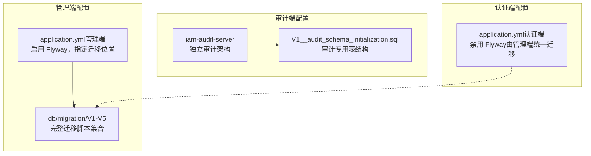

**更新** 新增审计服务器模块，提供独立的审计处理能力

图表来源
- [application.yml（管理端）:38-40](file://iam-admin-server/src/main/resources/application.yml#L38-L40)
- [V1__complete_schema_initialization.sql:1-20](file://iam-admin-server/src/main/resources/db/migration/V1__complete_schema_initialization.sql#L1-L20)
- [V4__audit_advanced_features.sql:1-150](file://iam-admin-server/src/main/resources/db/migration/V4__audit_advanced_features.sql#L1-150)
- [V5__user_credential_migration.sql:1-85](file://iam-admin-server/src/main/resources/db/migration/V5__user_credential_migration.sql#L1-85)

章节来源
- [application.yml（管理端）:38-40](file://iam-admin-server/src/main/resources/application.yml#L38-L40)
- [application.yml（认证端）](file://iam-auth-server/src/main/resources/application.yml#L39)

## 核心组件
- 用户身份模型
  - Person：全局自然人身份，唯一标识与登录凭据
  - TenantAccount：租户内的账户视图，绑定 Person 与 Tenant，并记录状态与偏好
- 权限体系
  - Role：角色，支持全局与租户自定义两类
  - ResourcePermission：资源级权限（按租户隔离）
  - RolePermission：角色到权限的多对多映射
  - ApplicationPermission：应用级权限（按应用隔离）
- 应用管理
  - Application：应用（原 OAuth2 Client 升级），含回调地址、作用域、令牌有效期等
- 组织架构
  - Organization：组织树，采用"物化路径"存储层级关系
  - TenantAccountOrganizationMapping：人员与组织的多对多映射（主组织唯一性）
- **新增**：用户凭证系统
  - UserCredential：持久化用户凭证，支持密码和数字证书
  - **更新**：增强的触发器逻辑和冲突解决机制
  - 支持主凭证管理、到期控制和状态跟踪
- **新增**：审计高级功能
  - t_alert_rule：实时告警规则定义
  - t_alert_record：触发的告警记录
  - t_siem_endpoint：SIEM集成端点配置
  - t_compliance_report：合规报告元数据

章节来源
- [Person.java:17-32](file://iam-admin-server/src/main/java/iam/platform/admin/domain/model/entity/Person.java#L17-L32)
- [TenantAccount.java:17-29](file://iam-admin-server/src/main/java/iam/platform/admin/domain/model/entity/TenantAccount.java#L17-L29)
- [Role.java:16-25](file://iam-admin-server/src/main/java/iam/platform/admin/domain/model/entity/Role.java#L16-L25)
- [Application.java:21-41](file://iam-admin-server/src/main/java/iam/platform/admin/domain/model/entity/Application.java#L21-L41)
- [Organization.java:18-34](file://iam-admin-server/src/main/java/iam/platform/admin/domain/model/entity/Organization.java#L18-L34)
- [AuditLog.java:23-39](file://iam-admin-server/src/main/java/iam/platform/admin/domain/model/entity/AuditLog.java#L23-L39)
- [UserCredential.java:18-124](file://iam-admin-server/src/main/java/iam/platform/admin/domain/model/entity/UserCredential.java#L18-124)

## 架构总览
整体采用"统一 Flyway 初始化 + 独立审计架构 + 多租户凭证管理"的三层架构：
- 管理端负责业务主数据与权限治理，Flyway 统一执行初始化脚本
- **新增**：审计端提供独立的审计处理能力，包含高级监控和合规功能
- **新增**：凭证系统支持多种认证方式，提供灵活的凭据管理
- **更新**：优化的迁移脚本包含增强的触发器逻辑和冲突解决机制
- 人员与租户账户通过 Person/TenantAccount 实现跨租户唯一性与租户内唯一性

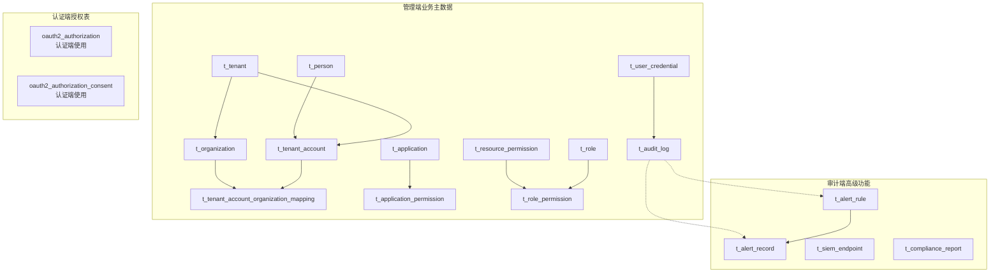

**更新** 新增审计端高级功能和凭证系统架构，优化迁移脚本

图表来源
- [V1__complete_schema_initialization.sql:172-510](file://iam-admin-server/src/main/resources/db/migration/V1__complete_schema_initialization.sql#L172-L510)
- [V4__audit_advanced_features.sql:35-132](file://iam-admin-server/src/main/resources/db/migration/V4__audit_advanced_features.sql#L35-132)
- [V5__user_credential_migration.sql:15-32](file://iam-admin-server/src/main/resources/db/migration/V5__user_credential_migration.sql#L15-32)

## 详细组件分析

### 用户凭证系统（UserCredential）
- **新增** 设计要点
  - UserCredential：持久化用户凭证，支持PASSWORD和CERTIFICATE两种类型
  - **更新**：增强的触发器逻辑，自动管理updated_at字段
  - 支持主凭证管理，每个用户每种类型的凭证只能有一个主凭证
  - 凭证状态管理：ACTIVE、EXPIRED、REVOKED三种状态
  - 到期时间控制，支持永不过期和固定期限凭证
  - **更新**：优化的冲突解决机制，使用ON CONFLICT处理主凭证冲突
- 关键约束与索引
  - 唯一索引：user_id + credential_type（仅当is_primary = TRUE时生效）
  - 复合索引：user_id + credential_type，expires_at（仅ACTIVE且有到期时间）
  - 普通索引：user_id，status，credential_type
  - **更新**：触发器函数update_updated_at_column确保updated_at自动更新
- 行为方法
  - 凭证创建：支持密码哈希和证书PEM格式
  - 主凭证切换：自动取消其他主凭证
  - 凭证吊销：标记为REVOKED状态
  - 到期检查：自动识别过期凭证
  - 最后使用时间：记录凭证使用情况

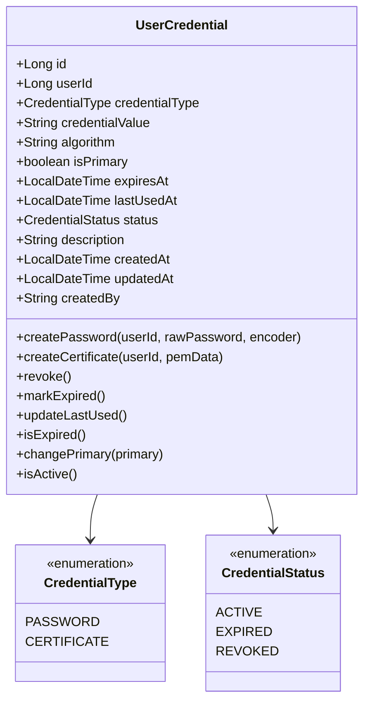

**更新** 新增完整的用户凭证系统设计和实现，包含增强的触发器逻辑

图表来源
- [UserCredential.java:18-124](file://iam-admin-server/src/main/java/iam/platform/admin/domain/model/entity/UserCredential.java#L18-124)
- [CredentialType.java:8-13](file://iam-common/src/main/java/iam/platform/common/model/enums/CredentialType.java#L8-13)
- [CredentialStatus.java:8-14](file://iam-common/src/main/java/iam/platform/common/model/enums/CredentialStatus.java#L8-14)

章节来源
- [UserCredential.java:35-124](file://iam-admin-server/src/main/java/iam/platform/admin/domain/model/entity/UserCredential.java#L35-L124)
- [UserCredentialApplicationService.java:31-223](file://iam-admin-server/src/main/java/iam/platform/admin/application/service/UserCredentialApplicationService.java#L31-L223)
- [UserCredentialRepository.java:12-31](file://iam-admin-server/src/main/java/iam/platform/admin/domain/repository/UserCredentialRepository.java#L12-L31)
- [V5__user_credential_migration.sql:15-85](file://iam-admin-server/src/main/resources/db/migration/V5__user_credential_migration.sql#L15-85)

### 用户凭证迁移脚本（Enhanced Migration Script）
- **更新** 设计要点
  - **增强触发器逻辑**：创建update_updated_at_column函数确保updated_at自动更新
  - **优化冲突解决**：使用ON CONFLICT (user_id, credential_type) WHERE is_primary = TRUE DO NOTHING处理主凭证冲突
  - **改进时间戳管理**：统一使用NOW()函数设置created_at和updated_at
  - **增强数据一致性**：通过WHERE条件精确控制冲突处理范围
  - **向后兼容性**：保持t_user.password_hash列的可空性，提供过渡期
- 关键实现细节
  - 触发器函数：update_updated_at_column返回NEW.updated_at = NOW()
  - 冲突处理：仅对主凭证（is_primary = TRUE）进行冲突检查
  - 索引优化：创建复合索引idx_cred_user_type支持多类型查询
  - 部分索引：idx_cred_expires仅索引有效且有到期时间的凭证
- 迁移流程
  1. 创建t_user_credential表结构
  2. 建立必要的索引和约束
  3. 创建触发器函数和触发器
  4. 执行数据迁移，使用ON CONFLICT处理冲突
  5. 保持向后兼容性，允许password_hash为NULL

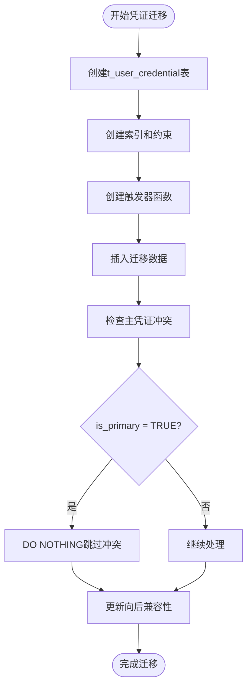

**更新** 新增详细的迁移脚本实现和冲突解决机制

图表来源
- [V5__user_credential_migration.sql:48-72](file://iam-admin-server/src/main/resources/db/migration/V5__user_credential_migration.sql#L48-L72)

章节来源
- [V5__user_credential_migration.sql:1-94](file://iam-admin-server/src/main/resources/db/migration/V5__user_credential_migration.sql#L1-94)

### 审计高级功能（Audit Advanced Features）
- **新增** 设计要点
  - t_audit_log增强：新增encrypted_fields列，支持敏感字段加密标识
  - 失败部分索引：idx_audit_failure专门优化失败查询性能
  - t_alert_rule：实时告警规则定义，支持阈值、时间窗口和严重级别
  - t_alert_record：告警触发记录，包含状态管理和通知追踪
  - t_siem_endpoint：SIEM集成端点配置，支持多种导出格式
  - t_compliance_report：合规报告元数据，支持SOC2、GDPR等标准
- 关键索引与约束
  - 失败部分索引：WHERE result = 'FAILURE'
  - 告警索引：rule_id、status、triggered_at
  - 合规报告索引：report_type、status、period_start+period_end
  - 默认告警规则：包含暴力破解检测、账户锁定级联等5种规则
- 行为方法
  - 实时监控：基于规则表达式的动态告警
  - 批量导出：支持CEF、LEEF、JSON等格式
  - 报告生成：自动化合规报告创建和状态追踪

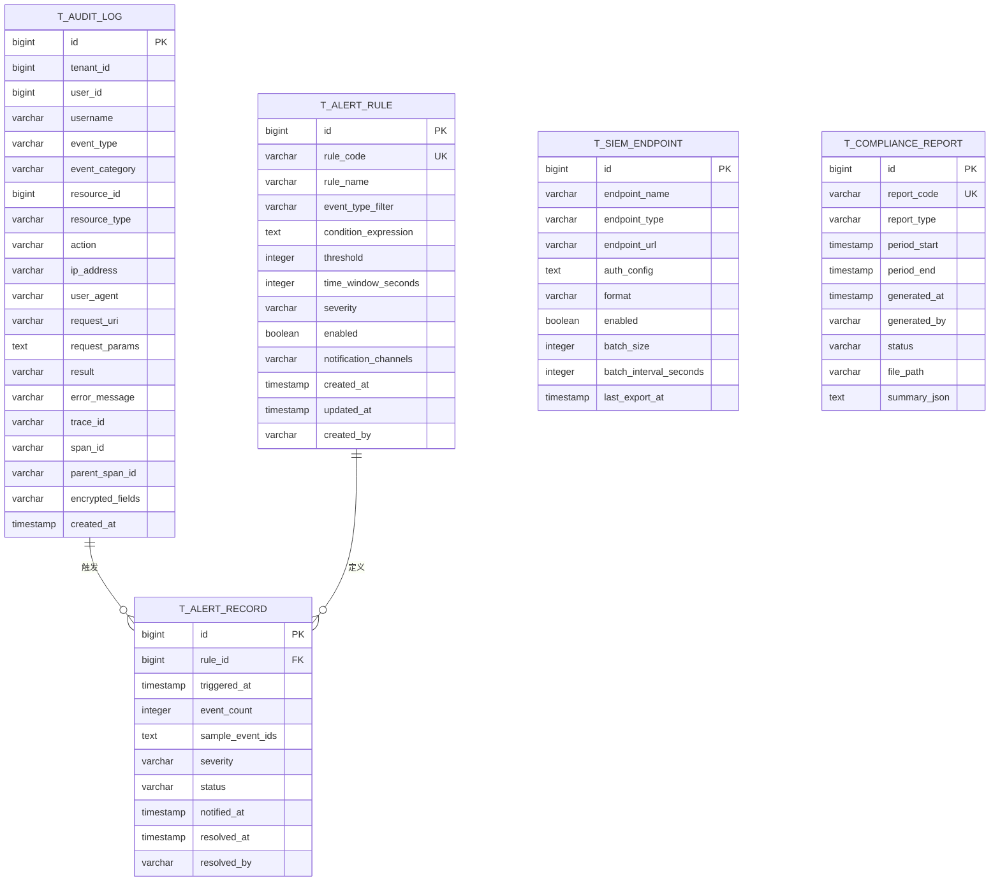

**更新** 新增完整的审计高级功能架构和表结构设计

图表来源
- [V4__audit_advanced_features.sql:20-150](file://iam-admin-server/src/main/resources/db/migration/V4__audit_advanced_features.sql#L20-150)
- [V1__audit_schema_initialization.sql:13-206](file://iam-audit-server/src/main/resources/db/migration/V1__audit_schema_initialization.sql#L13-206)

章节来源
- [V4__audit_advanced_features.sql:1-150](file://iam-admin-server/src/main/resources/db/migration/V4__audit_advanced_features.sql#L1-150)
- [V1__audit_schema_initialization.sql:1-206](file://iam-audit-server/src/main/resources/db/migration/V1__audit_schema_initialization.sql#L1-206)

### 用户身份模型（Person/TenantAccount）
- 设计要点
  - Person 提供全局唯一标识与登录凭据，确保用户名/邮箱/手机在全局唯一约束下可变
  - TenantAccount 将 Person 与 Tenant 绑定，提供租户内唯一性（account_code/employee_no），并记录加入时间、状态与偏好
- 关键约束与索引
  - Person：唯一索引（person_code, username, email, phone）
  - TenantAccount：唯一索引（tenant_id, account_code），（tenant_id, employee_no），并按 person_id/tenant_id/status 建索引
- 生命周期与行为
  - 支持启用/禁用、锁定/解锁、更新偏好语言与时区、记录最后登录时间等

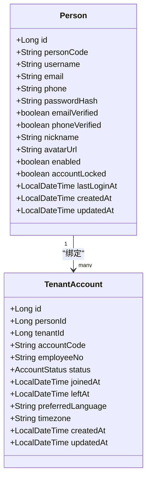

图表来源
- [Person.java:17-32](file://iam-admin-server/src/main/java/iam/platform/admin/domain/model/entity/Person.java#L17-L32)
- [TenantAccount.java:17-29](file://iam-admin-server/src/main/java/iam/platform/admin/domain/model/entity/TenantAccount.java#L17-L29)
- [V1__complete_schema_initialization.sql:200-272](file://iam-admin-server/src/main/resources/db/migration/V1__complete_schema_initialization.sql#L200-L272)

章节来源
- [Person.java:39-157](file://iam-admin-server/src/main/java/iam/platform/admin/domain/model/entity/Person.java#L39-L157)
- [TenantAccount.java:39-130](file://iam-admin-server/src/main/java/iam/platform/admin/domain/model/entity/TenantAccount.java#L39-L130)
- [V1__complete_schema_initialization.sql:200-272](file://iam-admin-server/src/main/resources/db/migration/V1__complete_schema_initialization.sql#L200-L272)

### 权限体系（Role/Permission）
- 设计要点
  - ResourcePermission：资源级权限，按租户隔离（tenant_id 可为空表示全局）
  - Role：支持 SYSTEM 与 TENANT_CUSTOM 两类，全局角色不可删除
  - RolePermission：角色到权限的多对多映射
  - ApplicationPermission：应用级权限，按应用隔离
- 关键约束与索引
  - ResourcePermission：唯一索引（tenant_id, permission_code），并按 tenant_id/resource_type/action 建索引
  - RolePermission：唯一索引（role_id, permission_id），并按 role_id/permission_id 建索引
  - ApplicationPermission：唯一索引（application_id, permission_code），并按 application_id/resource_type/action 建索引
- 默认数据
  - 初始化脚本预置系统默认角色与全局权限种子数据

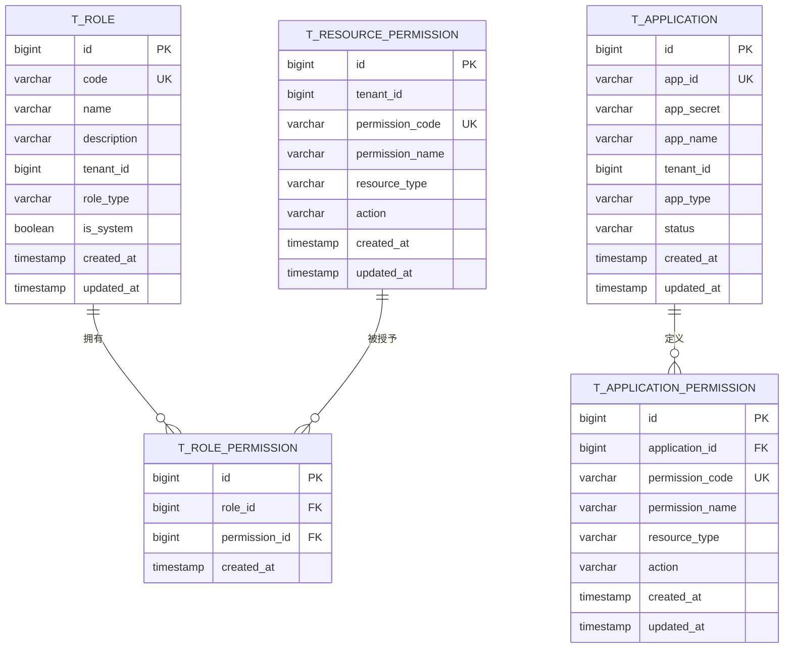

图表来源
- [V1__complete_schema_initialization.sql:26-480](file://iam-admin-server/src/main/resources/db/migration/V1__complete_schema_initialization.sql#L26-L480)

章节来源
- [Role.java:16-82](file://iam-admin-server/src/main/java/iam/platform/admin/domain/model/entity/Role.java#L16-L82)
- [ApplicationPermission.java:16-74](file://iam-admin-server/src/main/java/iam/platform/admin/domain/model/entity/ApplicationPermission.java#L16-L74)
- [V1__complete_schema_initialization.sql:26-480](file://iam-admin-server/src/main/resources/db/migration/V1__complete_schema_initialization.sql#L26-L480)

### 应用管理（Application）
- 设计要点
  - Application 作为 OAuth2 Client 的升级版，承载应用元数据、回调地址、作用域、令牌有效期等
  - 支持应用生命周期状态（ACTIVE/INACTIVE/REVIEWING/BLOCKED）
- 关键约束与索引
  - 唯一索引（app_id），并按 tenant_id/status/app_type 建索引
- 行为方法
  - 注册、轮转密钥、激活/停用/封禁、更新元数据与 OAuth 设置、更新令牌 TTL

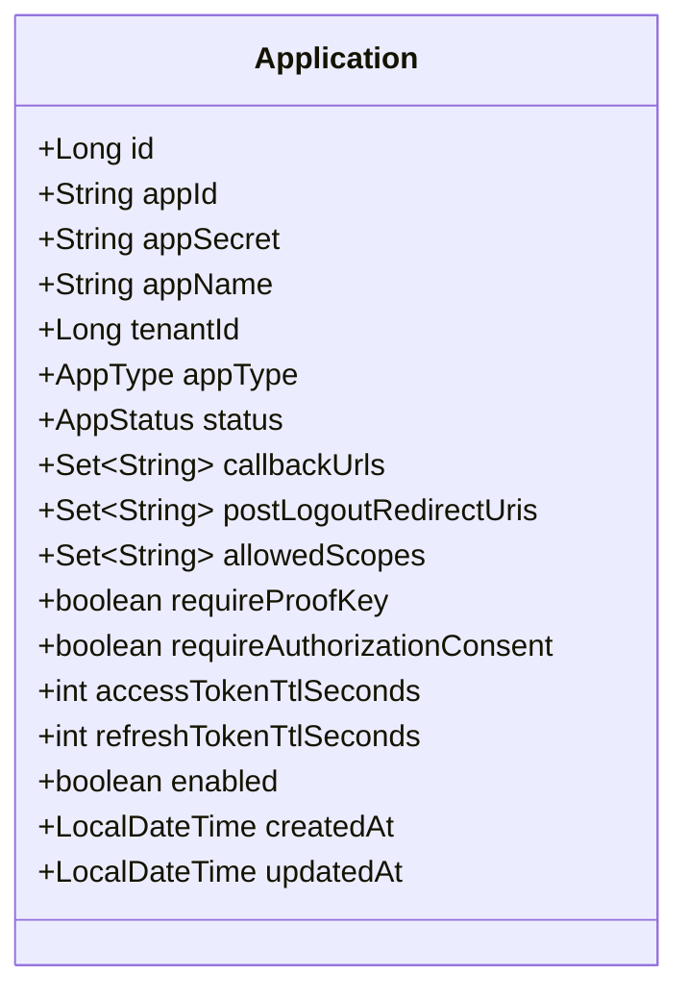

图表来源
- [Application.java:21-41](file://iam-admin-server/src/main/java/iam/platform/admin/domain/model/entity/Application.java#L21-L41)
- [V1__complete_schema_initialization.sql:350-381](file://iam-admin-server/src/main/resources/db/migration/V1__complete_schema_initialization.sql#L350-L381)

章节来源
- [Application.java:45-210](file://iam-admin-server/src/main/java/iam/platform/admin/domain/model/entity/Application.java#L45-L210)
- [V1__complete_schema_initialization.sql:350-381](file://iam-admin-server/src/main/resources/db/migration/V1__complete_schema_initialization.sql#L350-L381)

### 组织架构（Organization）
- 设计要点
  - 采用物化路径（path）+ 层级（level）+ 父子关系（parent_id）构建组织树
  - 支持根组织与子组织创建、重父（reparent）校验、路径修复（fixPathAfterPersist）
- 关键约束与索引
  - 唯一索引（tenant_id, org_code），并按 tenant_id/parent_id/path/level/manager_id 建索引
- 行为方法
  - 创建根/子组织、激活/停用、更新信息、路径修复、重父校验

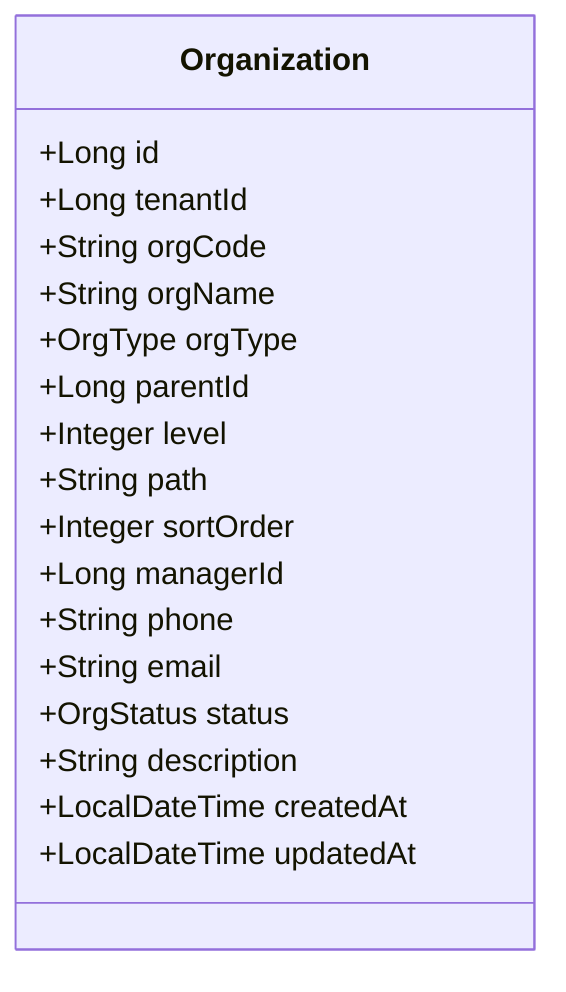

图表来源
- [Organization.java:18-34](file://iam-admin-server/src/main/java/iam/platform/admin/domain/model/entity/Organization.java#L18-L34)
- [V1__complete_schema_initialization.sql:277-320](file://iam-admin-server/src/main/resources/db/migration/V1__complete_schema_initialization.sql#L277-L320)

章节来源
- [Organization.java:38-216](file://iam-admin-server/src/main/java/iam/platform/admin/domain/model/entity/Organization.java#L38-L216)
- [V1__complete_schema_initialization.sql:277-320](file://iam-admin-server/src/main/resources/db/migration/V1__complete_schema_initialization.sql#L277-L320)

### 审计日志（AuditLog）
- 设计要点
  - 全量记录关键操作事件，包含租户、操作人、资源、动作、结果、错误信息等
  - **更新**：新增encrypted_fields列，支持敏感字段加密标识
  - **更新**：新增失败部分索引，优化失败查询性能
  - 预置清理函数与多维索引，支持按租户/类别/时间等维度检索与统计
- 关键索引
  - tenant_id、person_id、event_type、event_category、resource_type+resource_id、result、created_at、tenant_id+event_category+created_at
  - **新增**：idx_audit_failure（result = 'FAILURE'）
- 行为方法
  - 从上下文创建、直接创建、成功判定、年龄计算、分类名称获取

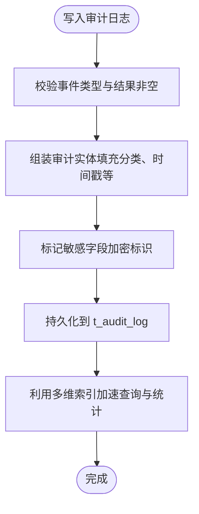

**更新** 新增加密字段标识和失败索引优化

图表来源
- [AuditLog.java:46-99](file://iam-admin-server/src/main/java/iam/platform/admin/domain/model/entity/AuditLog.java#L46-L99)
- [V1__complete_schema_initialization.sql:514-576](file://iam-admin-server/src/main/resources/db/migration/V1__complete_schema_initialization.sql#L514-L576)
- [V4__audit_advanced_features.sql:20-29](file://iam-admin-server/src/main/resources/db/migration/V4__audit_advanced_features.sql#L20-29)

章节来源
- [AuditLog.java:46-117](file://iam-admin-server/src/main/java/iam/platform/admin/domain/model/entity/AuditLog.java#L46-L117)
- [V1__complete_schema_initialization.sql:514-576](file://iam-admin-server/src/main/resources/db/migration/V1__complete_schema_initialization.sql#L514-L576)
- [V4__audit_advanced_features.sql:20-29](file://iam-admin-server/src/main/resources/db/migration/V4__audit_advanced_features.sql#L20-29)

### 外部登录（PersonExternalLogin）
- 设计要点
  - 记录第三方 OAuth2 登录信息（provider/provider_user_id/access_token/refresh_token/expires_at）
  - 唯一索引（person_id, provider, provider_user_id），并按 person_id/provider 建索引
- 行为方法
  - 链接第三方账号、更新令牌、记录使用时间、过期判断与刷新能力判断

章节来源
- [PersonExternalLogin.java:29-76](file://iam-admin-server/src/main/java/iam/platform/admin/domain/model/entity/PersonExternalLogin.java#L29-L76)
- [V1__complete_schema_initialization.sql:481-509](file://iam-admin-server/src/main/resources/db/migration/V1__complete_schema_initialization.sql#L481-L509)

## 依赖分析
- 多租户依赖链
  - Tenant → TenantAccount（一对多）
  - Person → TenantAccount（一对多）
  - TenantAccount → Organization（多对多，通过映射表）
- 权限依赖链
  - Role → RolePermission（一对多）
  - ResourcePermission → RolePermission（一对多）
  - Application → ApplicationPermission（一对多）
- **新增**：凭证依赖链
  - UserCredential → AuditLog（凭证操作审计）
  - UserCredential → Person（用户关联）
  - **更新**：UserCredential通过触发器自动管理updated_at时间戳
- **新增**：审计依赖链
  - AuditLog → AlertRule（告警触发）
  - AlertRule → AlertRecord（告警记录）
  - AuditLog → ComplianceReport（合规报告）

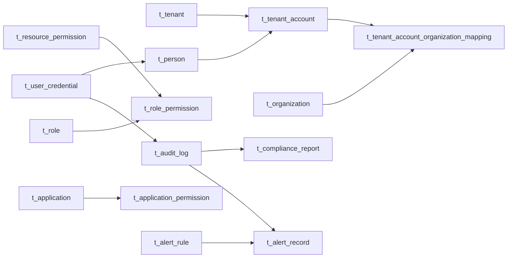

**更新** 新增凭证系统和审计高级功能的依赖关系，包含增强的触发器逻辑

图表来源
- [V1__complete_schema_initialization.sql:172-510](file://iam-admin-server/src/main/resources/db/migration/V1__complete_schema_initialization.sql#L172-L510)
- [V4__audit_advanced_features.sql:35-132](file://iam-admin-server/src/main/resources/db/migration/V4__audit_advanced_features.sql#L35-132)
- [V5__user_credential_migration.sql:15-32](file://iam-admin-server/src/main/resources/db/migration/V5__user_credential_migration.sql#L15-32)

章节来源
- [V1__complete_schema_initialization.sql:172-510](file://iam-admin-server/src/main/resources/db/migration/V1__complete_schema_initialization.sql#L172-L510)

## 性能考虑
- 索引策略
  - 多表建立常用过滤字段索引：tenant_id、status、type、resource_type/action 等
  - **新增**：审计失败部分索引 idx_audit_failure，专门优化失败查询性能
  - **新增**：凭证到期索引 idx_cred_expires，仅索引有效且有到期时间的凭证
  - **更新**：凭证类型索引 idx_cred_user_type，支持多类型查询优化
  - 审计日志建立复合索引：tenant_id+event_category+created_at，支持高并发统计
- 查询优化
  - 分页查询与范围筛选：优先使用复合索引覆盖
  - **新增**：告警规则查询使用 enabled 索引，提高告警引擎性能
  - **新增**：合规报告查询使用多列索引，支持复杂报表场景
  - **更新**：凭证查询使用复合索引优化主凭证查找
  - 审计日志定期清理：通过清理函数按保留天数删除过期记录
- 数据访问模式
  - 读写分离：审计与统计类查询可下沉至只读副本（如部署）
  - 缓存策略：热点数据（如角色/权限）可引入缓存，注意失效策略
  - **新增**：凭证缓存：频繁使用的凭证信息可缓存，但需注意状态同步
  - **更新**：触发器自动更新机制减少应用层时间戳管理开销
- 连接池与方言
  - HikariCP 连接池参数已配置，Hibernate 方言为 PostgreSQLDialect

**更新** 新增凭证系统和审计高级功能的性能优化建议，包含触发器优化

章节来源
- [application.yml（管理端）:19-32](file://iam-admin-server/src/main/resources/application.yml#L19-L32)
- [application.yml（认证端）:19-32](file://iam-auth-server/src/main/resources/application.yml#L19-L32)
- [V4__audit_advanced_features.sql:29](file://iam-admin-server/src/main/resources/db/migration/V4__audit_advanced_features.sql#L29)
- [V5__user_credential_migration.sql:40-45](file://iam-admin-server/src/main/resources/db/migration/V5__user_credential_migration.sql#L40-45)

## 故障排查指南
- Flyway 迁移失败
  - 确认迁移位置与启用状态一致：管理端启用，认证端禁用
  - 检查数据库连接参数与权限
  - **新增**：验证V4和V5迁移脚本的执行顺序和依赖关系
  - **更新**：检查触发器函数update_updated_at_column是否正确创建
- 审计日志异常
  - 检查清理函数是否按配置运行（保留天数）
  - 审计写入失败时，确认请求参数与敏感信息掩码逻辑
  - **新增**：检查encrypted_fields字段的JSON格式正确性
- 多租户冲突
  - 检查 account_code/employee_no 在同一租户内的唯一性
  - 组织树路径修复：保存后及时调用路径修复方法
- 权限不生效
  - 校验角色到权限映射是否存在
  - 确认资源级权限是否按租户正确隔离
- **新增**：凭证系统问题
  - 检查主凭证唯一性约束是否被违反
  - 验证密码哈希算法兼容性和证书PEM格式
  - 确认凭证到期检查逻辑正常运行
  - **更新**：验证ON CONFLICT处理逻辑是否正确执行
  - **更新**：检查触发器函数是否正常工作
- **新增**：审计高级功能问题
  - 验证告警规则表达式语法正确性
  - 检查SIEM端点认证配置和网络连通性
  - 确认合规报告生成任务正常执行

**更新** 新增凭证系统和审计高级功能的故障排查指南，包含触发器和冲突处理问题

章节来源
- [application.yml（管理端）:38-40](file://iam-admin-server/src/main/resources/application.yml#L38-L40)
- [application.yml（认证端）](file://iam-auth-server/src/main/resources/application.yml#L39)
- [V4__audit_advanced_features.sql:143-149](file://iam-admin-server/src/main/resources/db/migration/V4__audit_advanced_features.sql#L143-149)
- [V5__user_credential_migration.sql:59-63](file://iam-admin-server/src/main/resources/db/migration/V5__user_credential_migration.sql#L59-63)

## 结论
该数据库架构以 Flyway 统一初始化为核心，结合独立的审计架构和多租户凭证管理系统，形成"业务主数据 + 协议处理 + 高级审计 + 凭证管理"的完整解决方案。通过物化路径组织树、全局与租户隔离的权限模型、完善的审计与索引策略，以及新增的实时告警、SIEM集成和合规报告功能，满足多租户场景下的身份、权限、安全监控与合规需求。

**更新**：优化的用户凭证迁移脚本提供了更强的数据一致性和更好的性能表现，包含增强的触发器逻辑、精确的冲突解决机制和改进的时间戳管理。建议在生产环境进一步完善只读副本、缓存与异步审计写入，持续优化查询与清理策略，同时加强凭证安全管理和审计数据的长期保存策略。

## 附录
- 版本管理策略
  - 管理端启用 Flyway，迁移位置为 classpath:db/migration
  - **更新**：初始版本为 V1，包含完整业务与授权表初始化
  - **新增**：V2-V5版本分别添加UI支持、追踪字段、审计高级功能和用户凭证迁移
  - 认证端禁用 Flyway，避免重复迁移
  - **新增**：审计端独立的V1版本，专注于审计专用表结构
- 默认数据
  - 初始化脚本包含系统默认角色、全局权限、默认租户与管理员账户的种子数据
  - **新增**：默认告警规则包含5种常见安全场景的检测规则
  - **更新**：凭证迁移脚本将现有密码数据转换为新的凭证表结构，包含增强的触发器和冲突处理逻辑
- **更新**：触发器和冲突处理
  - **新增**：update_updated_at_column触发器函数确保updated_at自动更新
  - **新增**：ON CONFLICT处理机制防止主凭证重复
  - **新增**：精确的WHERE条件限制冲突处理范围

**更新** 新增V4和V5版本的详细说明和审计端独立架构，包含增强的触发器和冲突处理机制

章节来源
- [application.yml（管理端）:38-40](file://iam-admin-server/src/main/resources/application.yml#L38-L40)
- [application.yml（认证端）](file://iam-auth-server/src/main/resources/application.yml#L39)
- [V1__complete_schema_initialization.sql:581-720](file://iam-admin-server/src/main/resources/db/migration/V1__complete_schema_initialization.sql#L581-L720)
- [V4__audit_advanced_features.sql:143-149](file://iam-admin-server/src/main/resources/db/migration/V4__audit_advanced_features.sql#L143-149)
- [V5__user_credential_migration.sql:59-63](file://iam-admin-server/src/main/resources/db/migration/V5__user_credential_migration.sql#L59-63)