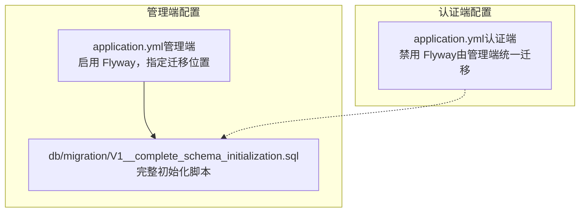
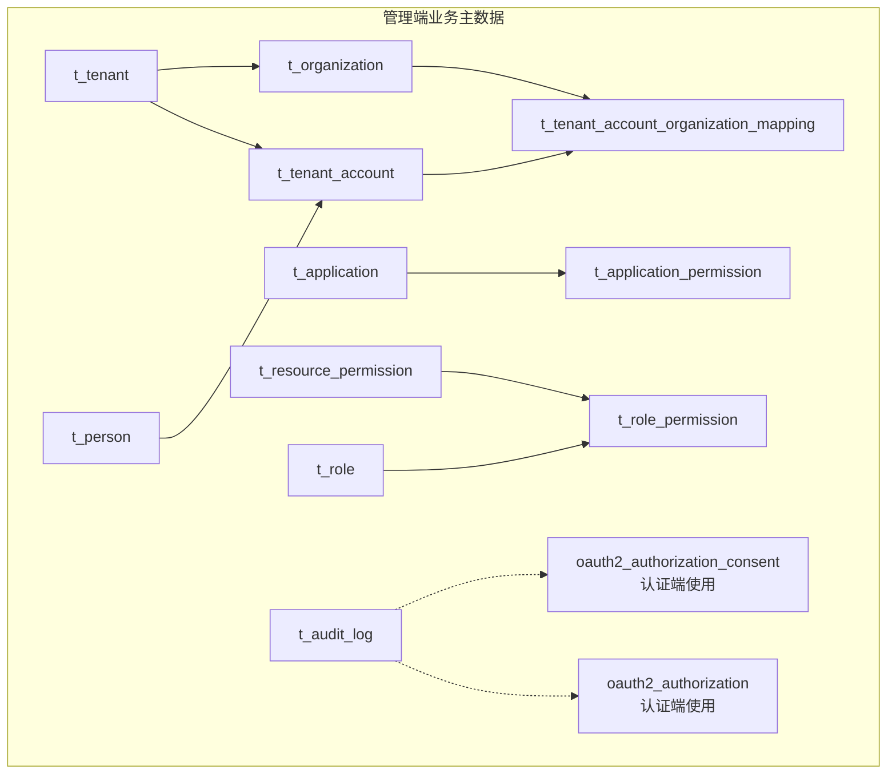
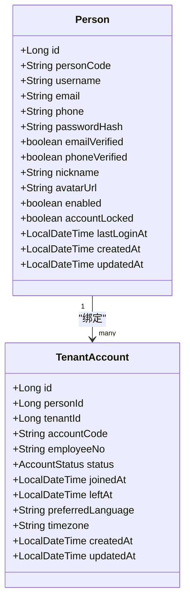
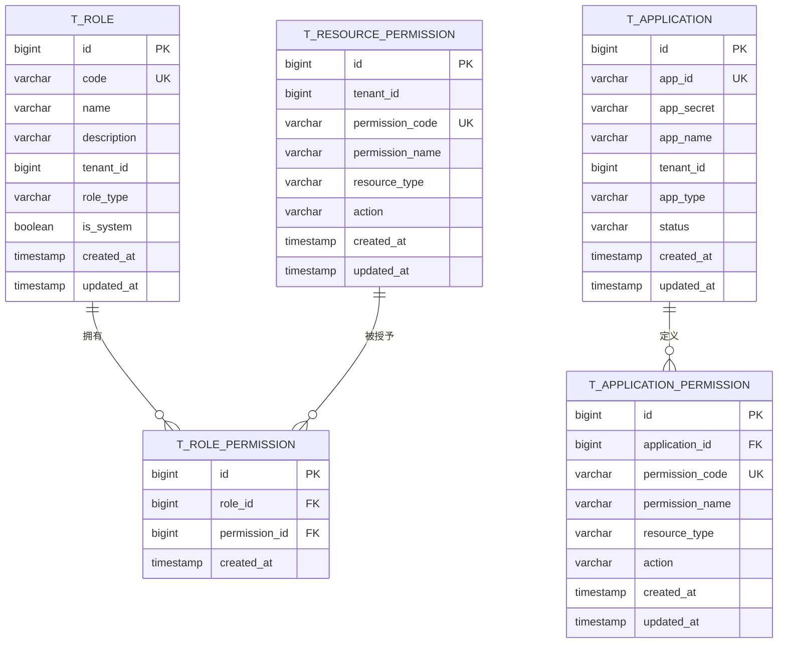
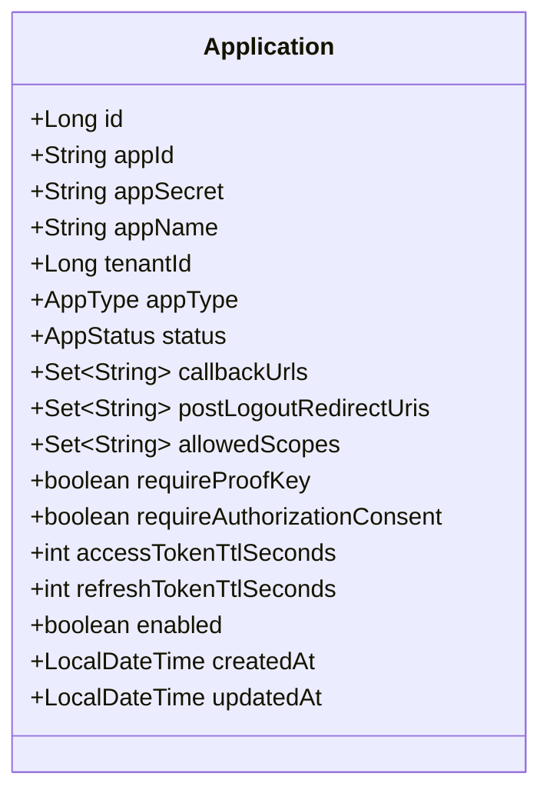
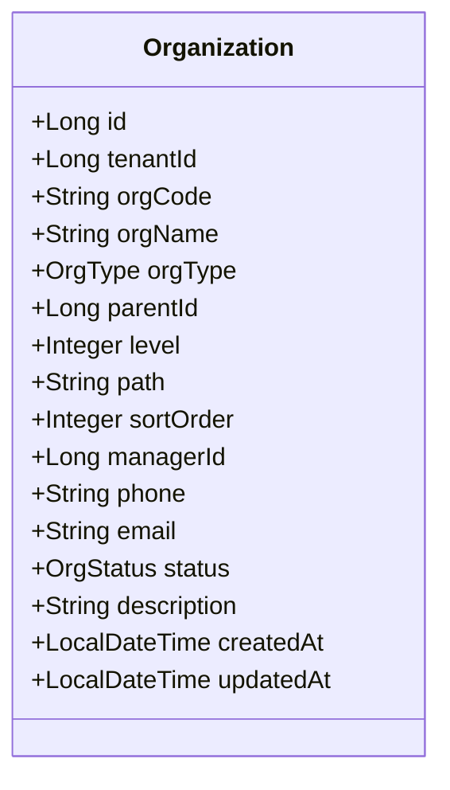
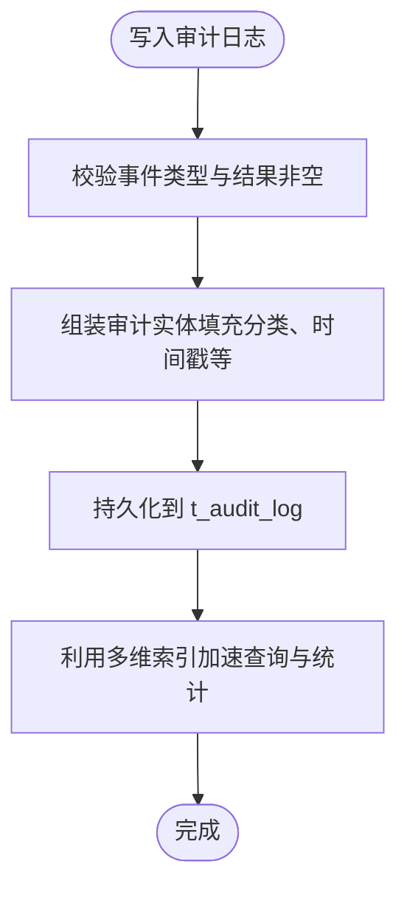
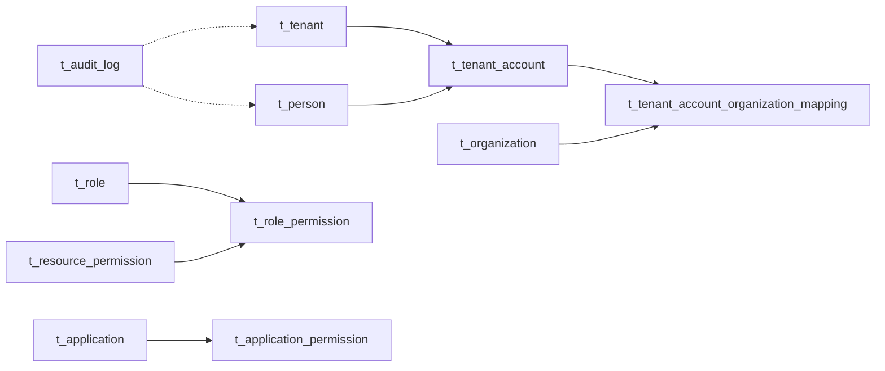

# 数据库架构

<cite>
**本文引用的文件**
- [V1__complete_schema_initialization.sql](file://iam-admin-server/src/main/resources/db/migration/V1__complete_schema_initialization.sql)
- [application.yml（管理端）](file://iam-admin-server/src/main/resources/application.yml)
- [application.yml（认证端）](file://iam-auth-server/src/main/resources/application.yml)
- [Person.java](file://iam-admin-server/src/main/java/iam/platform/admin/domain/model/entity/Person.java)
- [TenantAccount.java](file://iam-admin-server/src/main/java/iam/platform/admin/domain/model/entity/TenantAccount.java)
- [Organization.java](file://iam-admin-server/src/main/java/iam/platform/admin/domain/model/entity/Organization.java)
- [Application.java](file://iam-admin-server/src/main/java/iam/platform/admin/domain/model/entity/Application.java)
- [Role.java](file://iam-admin-server/src/main/java/iam/platform/admin/domain/model/entity/Role.java)
- [Tenant.java](file://iam-admin-server/src/main/java/iam/platform/admin/domain/model/entity/Tenant.java)
- [AuditLog.java](file://iam-admin-server/src/main/java/iam/platform/admin/domain/model/entity/AuditLog.java)
- [PersonExternalLogin.java](file://iam-admin-server/src/main/java/iam/platform/admin/domain/model/entity/PersonExternalLogin.java)
- [ApplicationPermission.java](file://iam-admin-server/src/main/java/iam/platform/admin/domain/model/entity/ApplicationPermission.java)
</cite>

## 目录
1. [简介](#简介)
2. [项目结构](#项目结构)
3. [核心组件](#核心组件)
4. [架构总览](#架构总览)
5. [详细组件分析](#详细组件分析)
6. [依赖分析](#依赖分析)
7. [性能考虑](#性能考虑)
8. [故障排查指南](#故障排查指南)
9. [结论](#结论)
10. [附录](#附录)

## 简介
本文件系统化梳理 IAM 平台数据库架构，重点覆盖：
- 多租户架构设计与实现要点
- 表结构布局与设计原则
- 核心领域模型：用户身份模型（Person/TenantAccount）、权限体系（Role/Permission）、应用管理（Application）、组织架构（Organization）
- 数据库分层设计：核心表、关联表、审计表
- 版本管理策略：Flyway 迁移组织与演进路径
- 架构图与表关系图
- 性能优化建议：索引策略、查询优化与数据访问模式

## 项目结构
数据库相关的核心文件集中在管理端的 Flyway 迁移脚本中，认证端通过 Spring Authorization Server 使用独立的授权表；管理端配置 Flyway 启用并指定迁移位置。

图表来源
- [application.yml（管理端）:38-40](file://iam-admin-server/src/main/resources/application.yml#L38-L40)
- [V1__complete_schema_initialization.sql:1-20](file://iam-admin-server/src/main/resources/db/migration/V1__complete_schema_initialization.sql#L1-L20)

章节来源
- [application.yml（管理端）:38-40](file://iam-admin-server/src/main/resources/application.yml#L38-L40)
- [application.yml（认证端）](file://iam-auth-server/src/main/resources/application.yml#L39)

## 核心组件
- 用户身份模型
  - Person：全局自然人身份，唯一标识与登录凭据
  - TenantAccount：租户内的账户视图，绑定 Person 与 Tenant，并记录状态与偏好
- 权限体系
  - Role：角色，支持全局与租户自定义两类
  - ResourcePermission：资源级权限（按租户隔离）
  - RolePermission：角色到权限的多对多映射
  - ApplicationPermission：应用级权限（按应用隔离）
- 应用管理
  - Application：应用（原 OAuth2 Client 升级），含回调地址、作用域、令牌有效期等
- 组织架构
  - Organization：组织树，采用“物化路径”存储层级关系
  - TenantAccountOrganizationMapping：人员与组织的多对多映射（主组织唯一性）
- 审计日志
  - AuditLog：全量操作审计，带多维索引支撑统计与检索

章节来源
- [Person.java:17-32](file://iam-admin-server/src/main/java/iam/platform/admin/domain/model/entity/Person.java#L17-L32)
- [TenantAccount.java:17-29](file://iam-admin-server/src/main/java/iam/platform/admin/domain/model/entity/TenantAccount.java#L17-L29)
- [Role.java:16-25](file://iam-admin-server/src/main/java/iam/platform/admin/domain/model/entity/Role.java#L16-L25)
- [Application.java:21-41](file://iam-admin-server/src/main/java/iam/platform/admin/domain/model/entity/Application.java#L21-L41)
- [Organization.java:18-34](file://iam-admin-server/src/main/java/iam/platform/admin/domain/model/entity/Organization.java#L18-L34)
- [AuditLog.java:23-39](file://iam-admin-server/src/main/java/iam/platform/admin/domain/model/entity/AuditLog.java#L23-L39)

## 架构总览
整体采用“统一 Flyway 初始化 + Spring Authorization Server 授权表”的双轨架构：
- 管理端负责业务主数据与权限治理，Flyway 统一执行初始化脚本
- 认证端负责 OIDC/CAS/SAML 等协议处理，使用 Spring Authorization Server 的授权表
- 人员与租户账户通过 Person/TenantAccount 实现跨租户唯一性与租户内唯一性

图表来源
- [V1__complete_schema_initialization.sql:172-510](file://iam-admin-server/src/main/resources/db/migration/V1__complete_schema_initialization.sql#L172-L510)

## 详细组件分析

### 用户身份模型（Person/TenantAccount）
- 设计要点
  - Person 提供全局唯一标识与登录凭据，确保用户名/邮箱/手机在全局唯一约束下可变
  - TenantAccount 将 Person 与 Tenant 绑定，提供租户内唯一性（account_code/employee_no），并记录加入时间、状态与偏好
- 关键约束与索引
  - Person：唯一索引（person_code, username, email, phone）
  - TenantAccount：唯一索引（tenant_id, account_code），（tenant_id, employee_no），并按 person_id/tenant_id/status 建索引
- 生命周期与行为
  - 支持启用/禁用、锁定/解锁、更新偏好语言与时区、记录最后登录时间等

图表来源
- [Person.java:17-32](file://iam-admin-server/src/main/java/iam/platform/admin/domain/model/entity/Person.java#L17-L32)
- [TenantAccount.java:17-29](file://iam-admin-server/src/main/java/iam/platform/admin/domain/model/entity/TenantAccount.java#L17-L29)
- [V1__complete_schema_initialization.sql:200-272](file://iam-admin-server/src/main/resources/db/migration/V1__complete_schema_initialization.sql#L200-L272)

章节来源
- [Person.java:39-157](file://iam-admin-server/src/main/java/iam/platform/admin/domain/model/entity/Person.java#L39-L157)
- [TenantAccount.java:39-130](file://iam-admin-server/src/main/java/iam/platform/admin/domain/model/entity/TenantAccount.java#L39-L130)
- [V1__complete_schema_initialization.sql:200-272](file://iam-admin-server/src/main/resources/db/migration/V1__complete_schema_initialization.sql#L200-L272)

### 权限体系（Role/Permission）
- 设计要点
  - ResourcePermission：资源级权限，按租户隔离（tenant_id 可为空表示全局）
  - Role：支持 SYSTEM 与 TENANT_CUSTOM 两类，全局角色不可删除
  - RolePermission：角色到权限的多对多映射
  - ApplicationPermission：应用级权限，按应用隔离
- 关键约束与索引
  - ResourcePermission：唯一索引（tenant_id, permission_code），并按 tenant_id/resource_type/action 建索引
  - RolePermission：唯一索引（role_id, permission_id），并按 role_id/permission_id 建索引
  - ApplicationPermission：唯一索引（application_id, permission_code），并按 application_id/resource_type/action 建索引
- 默认数据
  - 初始化脚本预置系统默认角色与全局权限种子数据

图表来源
- [V1__complete_schema_initialization.sql:26-480](file://iam-admin-server/src/main/resources/db/migration/V1__complete_schema_initialization.sql#L26-L480)

章节来源
- [Role.java:16-82](file://iam-admin-server/src/main/java/iam/platform/admin/domain/model/entity/Role.java#L16-L82)
- [ApplicationPermission.java:16-74](file://iam-admin-server/src/main/java/iam/platform/admin/domain/model/entity/ApplicationPermission.java#L16-L74)
- [V1__complete_schema_initialization.sql:26-480](file://iam-admin-server/src/main/resources/db/migration/V1__complete_schema_initialization.sql#L26-L480)

### 应用管理（Application）
- 设计要点
  - Application 作为 OAuth2 Client 的升级版，承载应用元数据、回调地址、作用域、令牌有效期等
  - 支持应用生命周期状态（ACTIVE/INACTIVE/REVIEWING/BLOCKED）
- 关键约束与索引
  - 唯一索引（app_id），并按 tenant_id/status/app_type 建索引
- 行为方法
  - 注册、轮转密钥、激活/停用/封禁、更新元数据与 OAuth 设置、更新令牌 TTL

图表来源
- [Application.java:21-41](file://iam-admin-server/src/main/java/iam/platform/admin/domain/model/entity/Application.java#L21-L41)
- [V1__complete_schema_initialization.sql:350-381](file://iam-admin-server/src/main/resources/db/migration/V1__complete_schema_initialization.sql#L350-L381)

章节来源
- [Application.java:45-210](file://iam-admin-server/src/main/java/iam/platform/admin/domain/model/entity/Application.java#L45-L210)
- [V1__complete_schema_initialization.sql:350-381](file://iam-admin-server/src/main/resources/db/migration/V1__complete_schema_initialization.sql#L350-L381)

### 组织架构（Organization）
- 设计要点
  - 采用物化路径（path）+ 层级（level）+ 父子关系（parent_id）构建组织树
  - 支持根组织与子组织创建、重父（reparent）校验、路径修复（fixPathAfterPersist）
- 关键约束与索引
  - 唯一索引（tenant_id, org_code），并按 tenant_id/parent_id/path/level/manager_id 建索引
- 行为方法
  - 创建根/子组织、激活/停用、更新信息、路径修复、重父校验

图表来源
- [Organization.java:18-34](file://iam-admin-server/src/main/java/iam/platform/admin/domain/model/entity/Organization.java#L18-L34)
- [V1__complete_schema_initialization.sql:277-320](file://iam-admin-server/src/main/resources/db/migration/V1__complete_schema_initialization.sql#L277-L320)

章节来源
- [Organization.java:38-216](file://iam-admin-server/src/main/java/iam/platform/admin/domain/model/entity/Organization.java#L38-L216)
- [V1__complete_schema_initialization.sql:277-320](file://iam-admin-server/src/main/resources/db/migration/V1__complete_schema_initialization.sql#L277-L320)

### 审计日志（AuditLog）
- 设计要点
  - 全量记录关键操作事件，包含租户、操作人、资源、动作、结果、错误信息等
  - 预置清理函数与多维索引，支持按租户/类别/时间等维度检索与统计
- 关键索引
  - tenant_id、person_id、event_type、event_category、resource_type+resource_id、result、created_at、tenant_id+event_category+created_at
- 行为方法
  - 从上下文创建、直接创建、成功判定、年龄计算、分类名称获取

图表来源
- [AuditLog.java:46-99](file://iam-admin-server/src/main/java/iam/platform/admin/domain/model/entity/AuditLog.java#L46-L99)
- [V1__complete_schema_initialization.sql:514-576](file://iam-admin-server/src/main/resources/db/migration/V1__complete_schema_initialization.sql#L514-L576)

章节来源
- [AuditLog.java:46-117](file://iam-admin-server/src/main/java/iam/platform/admin/domain/model/entity/AuditLog.java#L46-L117)
- [V1__complete_schema_initialization.sql:514-576](file://iam-admin-server/src/main/resources/db/migration/V1__complete_schema_initialization.sql#L514-L576)

### 外部登录（PersonExternalLogin）
- 设计要点
  - 记录第三方 OAuth2 登录信息（provider/provider_user_id/access_token/refresh_token/expires_at）
  - 唯一索引（person_id, provider, provider_user_id），并按 person_id/provider 建索引
- 行为方法
  - 链接第三方账号、更新令牌、记录使用时间、过期判断与刷新能力判断

章节来源
- [PersonExternalLogin.java:29-76](file://iam-admin-server/src/main/java/iam/platform/admin/domain/model/entity/PersonExternalLogin.java#L29-L76)
- [V1__complete_schema_initialization.sql:481-509](file://iam-admin-server/src/main/resources/db/migration/V1__complete_schema_initialization.sql#L481-L509)

## 依赖分析
- 多租户依赖链
  - Tenant → TenantAccount（一对多）
  - Person → TenantAccount（一对多）
  - TenantAccount → Organization（多对多，通过映射表）
- 权限依赖链
  - Role → RolePermission（一对多）
  - ResourcePermission → RolePermission（一对多）
  - Application → ApplicationPermission（一对多）
- 审计依赖
  - AuditLog 与 Person/Tenant 解耦（允许人员删除后仍保留审计记录）

图表来源
- [V1__complete_schema_initialization.sql:172-510](file://iam-admin-server/src/main/resources/db/migration/V1__complete_schema_initialization.sql#L172-L510)

章节来源
- [V1__complete_schema_initialization.sql:172-510](file://iam-admin-server/src/main/resources/db/migration/V1__complete_schema_initialization.sql#L172-L510)

## 性能考虑
- 索引策略
  - 多表建立常用过滤字段索引：tenant_id、status、type、resource_type/action 等
  - 审计日志建立复合索引：tenant_id+event_category+created_at，支持高并发统计
- 查询优化
  - 分页查询与范围筛选：优先使用复合索引覆盖
  - 审计日志定期清理：通过清理函数按保留天数删除过期记录
- 数据访问模式
  - 读写分离：审计与统计类查询可下沉至只读副本（如部署）
  - 缓存策略：热点数据（如角色/权限）可引入缓存，注意失效策略
- 连接池与方言
  - HikariCP 连接池参数已配置，Hibernate 方言为 PostgreSQLDialect

章节来源
- [application.yml（管理端）:19-32](file://iam-admin-server/src/main/resources/application.yml#L19-L32)
- [application.yml（认证端）:19-32](file://iam-auth-server/src/main/resources/application.yml#L19-L32)
- [V1__complete_schema_initialization.sql:560-576](file://iam-admin-server/src/main/resources/db/migration/V1__complete_schema_initialization.sql#L560-L576)

## 故障排查指南
- Flyway 迁移失败
  - 确认迁移位置与启用状态一致：管理端启用，认证端禁用
  - 检查数据库连接参数与权限
- 审计日志异常
  - 检查清理函数是否按配置运行（保留天数）
  - 审计写入失败时，确认请求参数与敏感信息掩码逻辑
- 多租户冲突
  - 检查 account_code/employee_no 在同一租户内的唯一性
  - 组织树路径修复：保存后及时调用路径修复方法
- 权限不生效
  - 校验角色到权限映射是否存在
  - 确认资源级权限是否按租户正确隔离

章节来源
- [application.yml（管理端）:38-40](file://iam-admin-server/src/main/resources/application.yml#L38-L40)
- [application.yml（认证端）](file://iam-auth-server/src/main/resources/application.yml#L39)
- [V1__complete_schema_initialization.sql:560-576](file://iam-admin-server/src/main/resources/db/migration/V1__complete_schema_initialization.sql#L560-L576)

## 结论
该数据库架构以 Flyway 统一初始化为核心，结合 Spring Authorization Server 的授权表，形成“业务主数据 + 协议处理”的清晰分工。通过物化路径组织树、全局与租户隔离的权限模型、完善的审计与索引策略，满足多租户场景下的身份、权限与合规需求。建议在生产环境进一步完善只读副本、缓存与异步审计写入，持续优化查询与清理策略。

## 附录
- 版本管理策略
  - 管理端启用 Flyway，迁移位置为 classpath:db/migration
  - 初始版本为 V1，包含完整业务与授权表初始化
  - 认证端禁用 Flyway，避免重复迁移
- 默认数据
  - 初始化脚本包含系统默认角色、全局权限、默认租户与管理员账户的种子数据

章节来源
- [application.yml（管理端）:38-40](file://iam-admin-server/src/main/resources/application.yml#L38-L40)
- [application.yml（认证端）](file://iam-auth-server/src/main/resources/application.yml#L39)
- [V1__complete_schema_initialization.sql:581-720](file://iam-admin-server/src/main/resources/db/migration/V1__complete_schema_initialization.sql#L581-L720)