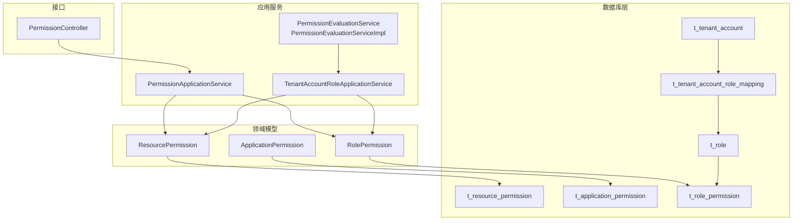
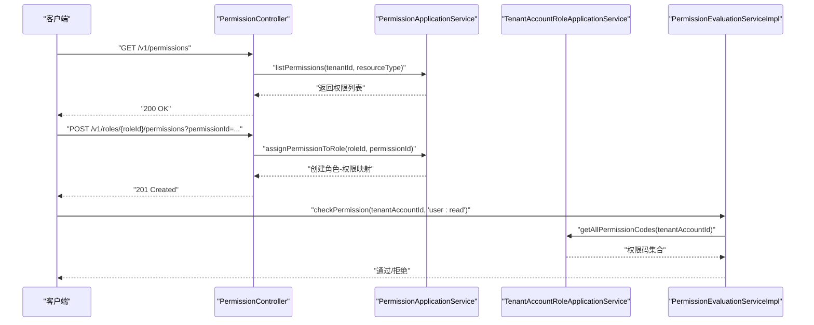
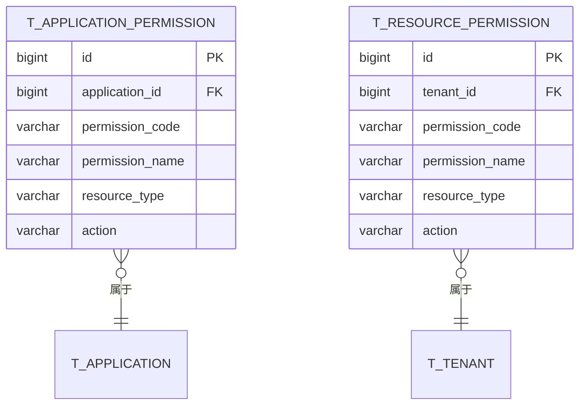
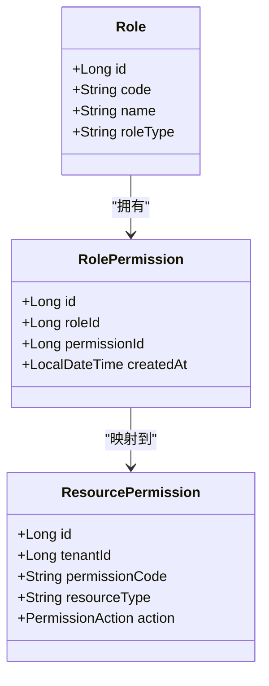
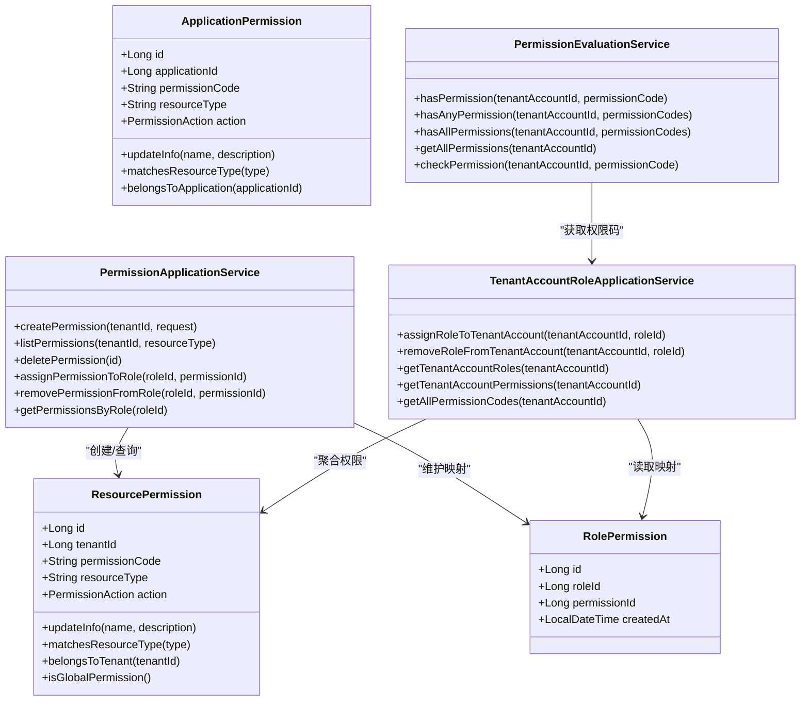
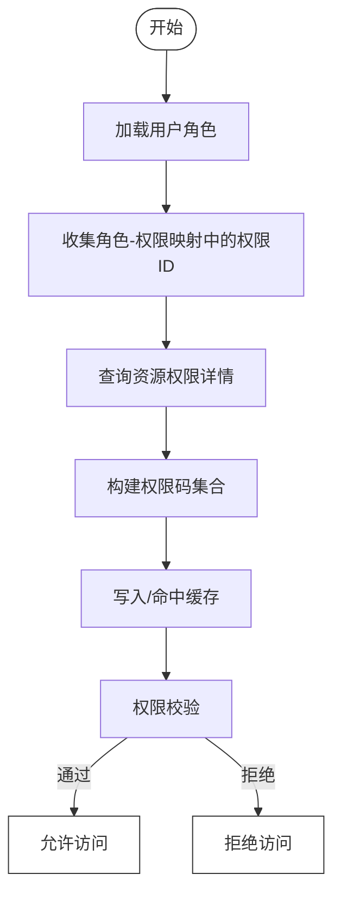

# 权限体系表

<cite>
**本文引用的文件**
- [V1__complete_schema_initialization.sql](file://iam-admin-server/src/main/resources/db/migration/V1__complete_schema_initialization.sql)
- [ResourcePermission.java](file://iam-admin-server/src/main/java/iam/platform/admin/domain/model/entity/ResourcePermission.java)
- [ApplicationPermission.java](file://iam-admin-server/src/main/java/iam/platform/admin/domain/model/entity/ApplicationPermission.java)
- [RolePermission.java](file://iam-admin-server/src/main/java/iam/platform/admin/domain/model/entity/RolePermission.java)
- [PermissionAction.java](file://iam-common/src/main/java/iam/platform/common/model/enums/PermissionAction.java)
- [PermissionApplicationService.java](file://iam-admin-server/src/main/java/iam/platform/admin/application/service/PermissionApplicationService.java)
- [PermissionEvaluationService.java](file://iam-admin-server/src/main/java/iam/platform/admin/domain/service/PermissionEvaluationService.java)
- [PermissionEvaluationServiceImpl.java](file://iam-admin-server/src/main/java/iam/platform/admin/domain/service/impl/PermissionEvaluationServiceImpl.java)
- [TenantAccountRoleApplicationService.java](file://iam-admin-server/src/main/java/iam/platform/admin/application/service/TenantAccountRoleApplicationService.java)
- [PermissionController.java](file://iam-admin-server/src/main/java/iam/platform/admin/interfaces/rest/PermissionController.java)
- [ApplicationPermissionRepository.java](file://iam-admin-server/src/main/java/iam/platform/admin/domain/repository/ApplicationPermissionRepository.java)
- [ApplicationPermissionRepositoryImpl.java](file://iam-admin-server/src/main/java/iam/platform/admin/infrastructure/persistence/impl/ApplicationPermissionRepositoryImpl.java)
- [ApplicationPermissionJpaRepository.java](file://iam-admin-server/src/main/java/iam/platform/admin/infrastructure/persistence/repository/ApplicationPermissionJpaRepository.java)
- [ResourcePermissionResponse.java](file://iam-common/src/main/java/iam/platform/common/dto/response/ResourcePermissionResponse.java)
- [RolePermissionResponse.java](file://iam-common/src/main/java/iam/platform/common/dto/response/RolePermissionResponse.java)
- [CreateResourcePermissionRequest.java](file://iam-common/src/main/java/iam/platform/common/dto/request/CreateResourcePermissionRequest.java)
</cite>

## 目录
1. [引言](#引言)
2. [项目结构](#项目结构)
3. [核心组件](#核心组件)
4. [架构总览](#架构总览)
5. [详细组件分析](#详细组件分析)
6. [依赖分析](#依赖分析)
7. [性能考虑](#性能考虑)
8. [故障排查指南](#故障排查指南)
9. [结论](#结论)
10. [附录](#附录)

## 引言
本文件系统化梳理 IAM 平台的权限体系表，围绕以下目标展开：  
- 明确资源权限表 t_resource_permission 与应用权限表 t_application_permission 的差异、边界与适用场景  
- 解释角色权限映射表 t_role_permission 的多对多关系设计与权限继承机制  
- 总结权限编码规范、资源类型分类与操作动作定义  
- 说明全局权限与租户权限的区分策略  
- 提供权限分配最佳实践与权限查询优化方案  
- 给出权限模型图与权限流转示例，展示从用户到权限的完整链路

## 项目结构
本权限体系由“数据库表 + 领域模型 + 应用服务 + 控制器 + 缓存 + 枚举”构成，关键文件如下：
- 数据库初始化脚本：定义 t_resource_permission、t_application_permission、t_role_permission 等核心表及索引、约束、种子数据
- 领域模型：ResourcePermission、ApplicationPermission、RolePermission
- 应用服务：PermissionApplicationService、TenantAccountRoleApplicationService
- 权限评估：PermissionEvaluationService 及其实现
- 控制器：PermissionController
- 应用权限仓储：ApplicationPermissionRepository 及其 JPA 实现
- 枚举：PermissionAction



图表来源
- [V1__complete_schema_initialization.sql:391-479](file://iam-admin-server/src/main/resources/db/migration/V1__complete_schema_initialization.sql#L391-L479)
- [ResourcePermission.java:16-51](file://iam-admin-server/src/main/java/iam/platform/admin/domain/model/entity/ResourcePermission.java#L16-L51)
- [ApplicationPermission.java:16-53](file://iam-admin-server/src/main/java/iam/platform/admin/domain/model/entity/ApplicationPermission.java#L16-L53)
- [RolePermission.java:14-19](file://iam-admin-server/src/main/java/iam/platform/admin/domain/model/entity/RolePermission.java#L14-L19)
- [PermissionApplicationService.java:25-135](file://iam-admin-server/src/main/java/iam/platform/admin/application/service/PermissionApplicationService.java#L25-L135)
- [TenantAccountRoleApplicationService.java:32-145](file://iam-admin-server/src/main/java/iam/platform/admin/application/service/TenantAccountRoleApplicationService.java#L32-L145)
- [PermissionEvaluationServiceImpl.java:16-53](file://iam-admin-server/src/main/java/iam/platform/admin/domain/service/impl/PermissionEvaluationServiceImpl.java#L16-L53)
- [PermissionController.java:25-89](file://iam-admin-server/src/main/java/iam/platform/admin/interfaces/rest/PermissionController.java#L25-L89)

章节来源
- [V1__complete_schema_initialization.sql:391-479](file://iam-admin-server/src/main/resources/db/migration/V1__complete_schema_initialization.sql#L391-L479)
- [PermissionController.java:25-89](file://iam-admin-server/src/main/java/iam/platform/admin/interfaces/rest/PermissionController.java#L25-L89)

## 核心组件
- t_resource_permission：资源级权限，支持全局与租户范围，字段包含 tenant_id、permission_code、resource_type、action 等
- t_application_permission：应用级权限，绑定到具体应用，字段包含 application_id、permission_code、resource_type、action 等
- t_role_permission：角色与资源权限的多对多映射，体现“角色拥有哪些资源权限”
- ResourcePermission 领域对象：封装资源权限的创建、更新、匹配与归属判断
- ApplicationPermission 领域对象：封装应用权限的创建、更新、匹配与归属判断
- RolePermission 领域对象：角色-权限映射的轻量实体
- PermissionAction 枚举：统一的动作类型（READ/WRITE/DELETE/EXPORT/APPROVE/EXECUTE）
- PermissionApplicationService：资源权限的创建、查询、删除、角色分配等
- TenantAccountRoleApplicationService：租户账号的角色与权限计算（聚合角色-权限）
- PermissionEvaluationServiceImpl：基于缓存的权限校验与全量权限获取

章节来源
- [V1__complete_schema_initialization.sql:391-479](file://iam-admin-server/src/main/resources/db/migration/V1__complete_schema_initialization.sql#L391-L479)
- [ResourcePermission.java:16-77](file://iam-admin-server/src/main/java/iam/platform/admin/domain/model/entity/ResourcePermission.java#L16-L77)
- [ApplicationPermission.java:16-75](file://iam-admin-server/src/main/java/iam/platform/admin/domain/model/entity/ApplicationPermission.java#L16-L75)
- [RolePermission.java:14-19](file://iam-admin-server/src/main/java/iam/platform/admin/domain/model/entity/RolePermission.java#L14-L19)
- [PermissionAction.java:3-5](file://iam-common/src/main/java/iam/platform/common/model/enums/PermissionAction.java#L3-L5)
- [PermissionApplicationService.java:25-135](file://iam-admin-server/src/main/java/iam/platform/admin/application/service/PermissionApplicationService.java#L25-L135)
- [TenantAccountRoleApplicationService.java:32-145](file://iam-admin-server/src/main/java/iam/platform/admin/application/service/TenantAccountRoleApplicationService.java#L32-L145)
- [PermissionEvaluationServiceImpl.java:16-53](file://iam-admin-server/src/main/java/iam/platform/admin/domain/service/impl/PermissionEvaluationServiceImpl.java#L16-L53)

## 架构总览
权限模型采用“资源权限 + 角色映射 + 用户角色”的三层设计：
- 资源权限：定义可操作的资源与动作（全局或租户）
- 角色映射：角色持有若干资源权限
- 用户角色：租户账号绑定若干角色，从而获得权限集合



图表来源
- [PermissionController.java:25-89](file://iam-admin-server/src/main/java/iam/platform/admin/interfaces/rest/PermissionController.java#L25-L89)
- [PermissionApplicationService.java:25-135](file://iam-admin-server/src/main/java/iam/platform/admin/application/service/PermissionApplicationService.java#L25-L135)
- [TenantAccountRoleApplicationService.java:100-127](file://iam-admin-server/src/main/java/iam/platform/admin/application/service/TenantAccountRoleApplicationService.java#L100-L127)
- [PermissionEvaluationServiceImpl.java:20-51](file://iam-admin-server/src/main/java/iam/platform/admin/domain/service/impl/PermissionEvaluationServiceImpl.java#L20-L51)

## 详细组件分析

### 资源权限表 t_resource_permission 与应用权限表 t_application_permission
- 设计要点
  - t_resource_permission：支持全局权限（tenant_id 为空）与租户权限（tenant_id 非空），唯一性约束为 (tenant_id, permission_code)，确保租户内权限码唯一
  - t_application_permission：仅应用级权限，唯一性约束为 (application_id, permission_code)，避免同一应用下权限码冲突
- 字段与索引
  - 共同字段：permission_code、permission_name、resource_type、action、描述、时间戳
  - 索引：按 resource_type、action 进行过滤；按 tenant_id 或 application_id 进行范围扫描
- 使用场景
  - 资源权限：面向业务资源（如 user、tenant、role、application、audit 等）的 CRUD、导出、审批、执行等细粒度控制
  - 应用权限：面向应用内部的资源访问控制，通常与 OAuth2 客户端能力相关联



图表来源
- [V1__complete_schema_initialization.sql:391-447](file://iam-admin-server/src/main/resources/db/migration/V1__complete_schema_initialization.sql#L391-L447)

章节来源
- [V1__complete_schema_initialization.sql:391-447](file://iam-admin-server/src/main/resources/db/migration/V1__complete_schema_initialization.sql#L391-L447)
- [ResourcePermission.java:16-51](file://iam-admin-server/src/main/java/iam/platform/admin/domain/model/entity/ResourcePermission.java#L16-L51)
- [ApplicationPermission.java:16-53](file://iam-admin-server/src/main/java/iam/platform/admin/domain/model/entity/ApplicationPermission.java#L16-L53)

### 角色权限映射表 t_role_permission 的多对多关系与权限继承
- 关系设计
  - 多对多：一个角色可拥有多个资源权限；一个资源权限可被多个角色持有
  - 唯一性：(role_id, permission_id) 防止重复映射
  - 级联删除：删除角色或资源权限时同步清理映射
- 权限继承
  - 用户通过 t_tenant_account_role_mapping 绑定角色，间接继承角色所拥有的资源权限
  - 权限集合由用户所有角色的权限并集组成，去重后生效
- 计算流程
  - TenantAccountRoleApplicationService 获取用户角色 → 收集角色-权限映射 → 查询资源权限详情 → 输出权限码集合



图表来源
- [V1__complete_schema_initialization.sql:448-479](file://iam-admin-server/src/main/resources/db/migration/V1__complete_schema_initialization.sql#L448-L479)
- [RolePermission.java:14-19](file://iam-admin-server/src/main/java/iam/platform/admin/domain/model/entity/RolePermission.java#L14-L19)
- [ResourcePermission.java:16-25](file://iam-admin-server/src/main/java/iam/platform/admin/domain/model/entity/ResourcePermission.java#L16-L25)

章节来源
- [V1__complete_schema_initialization.sql:448-479](file://iam-admin-server/src/main/resources/db/migration/V1__complete_schema_initialization.sql#L448-L479)
- [TenantAccountRoleApplicationService.java:100-127](file://iam-admin-server/src/main/java/iam/platform/admin/application/service/TenantAccountRoleApplicationService.java#L100-L127)

### 权限编码规范、资源类型分类与操作动作定义
- 编码规范
  - 资源权限：{resourceType}:{action}，例如 user:read、tenant:write、audit:export
  - 应用权限：约定以 app: 前缀或由应用侧生成规则决定，避免与资源权限冲突
- 资源类型分类
  - 示例：user、tenant、organization、role、application、permission、audit、order 等
- 操作动作定义
  - 统一枚举：READ、WRITE、DELETE、EXPORT、APPROVE、EXECUTE
- 建议
  - 资源类型与动作组合应语义明确，便于审计与策略治理
  - 对于应用级权限，建议在应用维度进行命名空间隔离

章节来源
- [ResourcePermission.java:29-51](file://iam-admin-server/src/main/java/iam/platform/admin/domain/model/entity/ResourcePermission.java#L29-L51)
- [ApplicationPermission.java:29-53](file://iam-admin-server/src/main/java/iam/platform/admin/domain/model/entity/ApplicationPermission.java#L29-L53)
- [PermissionAction.java:3-5](file://iam-common/src/main/java/iam/platform/common/model/enums/PermissionAction.java#L3-L5)

### 全局权限与租户权限的区分策略
- 区分依据
  - t_resource_permission.tenant_id 为空：全局权限，适用于系统级管理
  - t_resource_permission.tenant_id 非空：租户权限，仅在所属租户内生效
- 策略
  - 列表查询：支持按 tenantId 或全局过滤
  - 唯一性：租户内权限码唯一，全局权限码唯一
  - 种子数据：系统内置权限均为全局权限，便于平台级管控

章节来源
- [V1__complete_schema_initialization.sql:418-447](file://iam-admin-server/src/main/resources/db/migration/V1__complete_schema_initialization.sql#L418-L447)
- [PermissionApplicationService.java:57-67](file://iam-admin-server/src/main/java/iam/platform/admin/application/service/PermissionApplicationService.java#L57-L67)

### 权限分配最佳实践
- 分配路径
  - 先创建资源权限（或应用权限），再将权限分配给角色，最后将角色分配给租户账号
- 唯一性检查
  - 创建资源权限前校验租户内权限码唯一
  - 分配角色-权限前校验映射不存在
- 审计与可观测
  - 使用注解记录审计事件（创建、删除、分配、撤销）
  - 删除权限时先清理角色映射，避免悬挂数据
- 缓存与一致性
  - 角色变更后清除权限缓存，保证权限校验结果一致

章节来源
- [PermissionApplicationService.java:31-99](file://iam-admin-server/src/main/java/iam/platform/admin/application/service/PermissionApplicationService.java#L31-L99)
- [TenantAccountRoleApplicationService.java:43-86](file://iam-admin-server/src/main/java/iam/platform/admin/application/service/TenantAccountRoleApplicationService.java#L43-L86)

### 权限查询优化方案
- 数据库层面
  - 为 t_resource_permission 建立 (tenant_id, permission_code) 唯一索引，提升租户内查找效率
  - 为 t_resource_permission/resource_type、action 建立复合索引，加速过滤
  - 为 t_role_permission 建立 (role_id, permission_id) 唯一索引，加速映射查询
- 应用层面
  - 使用缓存存储用户全量权限码集合，减少重复计算
  - 提供批量权限校验接口（任一/全部），降低多次查询成本
- 控制器层面
  - 提供按资源类型过滤的列表接口，缩小结果集

章节来源
- [V1__complete_schema_initialization.sql:433-439](file://iam-admin-server/src/main/resources/db/migration/V1__complete_schema_initialization.sql#L433-L439)
- [PermissionEvaluationServiceImpl.java:38-42](file://iam-admin-server/src/main/java/iam/platform/admin/domain/service/impl/PermissionEvaluationServiceImpl.java#L38-L42)
- [PermissionController.java:49-55](file://iam-admin-server/src/main/java/iam/platform/admin/interfaces/rest/PermissionController.java#L49-L55)

### 权限模型图与权限流转示例
- 权限模型图（代码级）



图表来源
- [ResourcePermission.java:16-77](file://iam-admin-server/src/main/java/iam/platform/admin/domain/model/entity/ResourcePermission.java#L16-L77)
- [ApplicationPermission.java:16-75](file://iam-admin-server/src/main/java/iam/platform/admin/domain/model/entity/ApplicationPermission.java#L16-L75)
- [RolePermission.java:14-19](file://iam-admin-server/src/main/java/iam/platform/admin/domain/model/entity/RolePermission.java#L14-L19)
- [PermissionApplicationService.java:25-135](file://iam-admin-server/src/main/java/iam/platform/admin/application/service/PermissionApplicationService.java#L25-L135)
- [TenantAccountRoleApplicationService.java:32-145](file://iam-admin-server/src/main/java/iam/platform/admin/application/service/TenantAccountRoleApplicationService.java#L32-L145)
- [PermissionEvaluationService.java:8-53](file://iam-admin-server/src/main/java/iam/platform/admin/domain/service/PermissionEvaluationService.java#L8-L53)

- 权限流转示例（从用户到权限）
  - 用户在某个租户内的账号，通过角色映射获得角色，角色通过角色-权限映射获得资源权限，最终形成用户可用的权限集合
  - 权限校验时，系统从缓存中获取用户全量权限码，进行包含性判断



图表来源
- [TenantAccountRoleApplicationService.java:100-127](file://iam-admin-server/src/main/java/iam/platform/admin/application/service/TenantAccountRoleApplicationService.java#L100-L127)
- [PermissionEvaluationServiceImpl.java:20-51](file://iam-admin-server/src/main/java/iam/platform/admin/domain/service/impl/PermissionEvaluationServiceImpl.java#L20-L51)

## 依赖分析
- 表间依赖
  - t_role_permission.role_id → t_role.id
  - t_role_permission.permission_id → t_resource_permission.id
  - t_tenant_account_role_mapping.tenant_account_id → t_tenant_account.id
  - t_tenant_account_role_mapping.role_id → t_role.id
- 代码依赖
  - PermissionApplicationService 依赖 ResourcePermissionRepository、RolePermissionRepository、RoleRepository
  - TenantAccountRoleApplicationService 依赖上述仓储以及 TenantAccountRepository
  - PermissionEvaluationServiceImpl 依赖 TenantAccountRoleApplicationService，并使用缓存

```mermaid
graph LR
RP["t_resource_permission"] <- --> RPerm["t_role_permission"]
Role["t_role"] <- --> RPerm
TA["t_tenant_account"] <- --> Acc["t_tenant_account_role_mapping"]
Role <- --> Acc
```

图表来源
- [V1__complete_schema_initialization.sql:448-479](file://iam-admin-server/src/main/resources/db/migration/V1__complete_schema_initialization.sql#L448-L479)

章节来源
- [V1__complete_schema_initialization.sql:448-479](file://iam-admin-server/src/main/resources/db/migration/V1__complete_schema_initialization.sql#L448-L479)
- [PermissionApplicationService.java:27-29](file://iam-admin-server/src/main/java/iam/platform/admin/application/service/PermissionApplicationService.java#L27-L29)
- [TenantAccountRoleApplicationService.java:34-38](file://iam-admin-server/src/main/java/iam/platform/admin/application/service/TenantAccountRoleApplicationService.java#L34-L38)

## 性能考虑
- 数据库层
  - 合理使用索引：按 tenant_id、resource_type、action 过滤
  - 唯一约束：避免重复权限与映射，减少查询与合并成本
- 应用层
  - 缓存：对用户全量权限码集合进行缓存，设置合理过期策略
  - 批量接口：提供 hasAny/hasAll 接口，减少多次往返
- 控制器层
  - 提供按资源类型过滤的列表接口，降低结果集大小

## 故障排查指南
- 权限创建失败
  - 现象：提示权限码已在租户内存在
  - 排查：确认租户内权限码唯一性约束；检查请求参数 permissionCode
- 角色-权限分配失败
  - 现象：提示权限已分配或权限不存在
  - 排查：确认角色与权限存在且未重复映射
- 权限校验失败
  - 现象：AccessDenied
  - 排查：确认用户角色映射、角色-权限映射、权限是否正确下发；检查缓存是否失效

章节来源
- [PermissionApplicationService.java:35-49](file://iam-admin-server/src/main/java/iam/platform/admin/application/service/PermissionApplicationService.java#L35-L49)
- [PermissionApplicationService.java:82-111](file://iam-admin-server/src/main/java/iam/platform/admin/application/service/PermissionApplicationService.java#L82-L111)
- [PermissionEvaluationServiceImpl.java:44-51](file://iam-admin-server/src/main/java/iam/platform/admin/domain/service/impl/PermissionEvaluationServiceImpl.java#L44-L51)

## 结论
本权限体系以资源权限为核心，结合角色映射与用户角色，实现了灵活的权限继承与高效校验。通过全局/租户权限分离、严格的唯一性约束与缓存策略，既能满足多租户场景下的权限隔离，又能保障权限查询与校验的性能与一致性。

## 附录
- API 参考（节选）
  - 创建资源权限：POST /v1/tenants/{tenantId}/permissions
  - 查询权限列表：GET /v1/permissions?tenantId=&resourceType=
  - 删除权限：DELETE /v1/permissions/{id}
  - 为角色分配权限：POST /v1/roles/{roleId}/permissions?permissionId=
  - 从角色移除权限：DELETE /v1/roles/{roleId}/permissions/{permissionId}
  - 获取角色权限：GET /v1/roles/{roleId}/permissions

章节来源
- [PermissionController.java:35-87](file://iam-admin-server/src/main/java/iam/platform/admin/interfaces/rest/PermissionController.java#L35-L87)
- [CreateResourcePermissionRequest.java:15-29](file://iam-common/src/main/java/iam/platform/common/dto/request/CreateResourcePermissionRequest.java#L15-L29)
- [ResourcePermissionResponse.java:15-25](file://iam-common/src/main/java/iam/platform/common/dto/response/ResourcePermissionResponse.java#L15-L25)
- [RolePermissionResponse.java:14-19](file://iam-common/src/main/java/iam/platform/common/dto/response/RolePermissionResponse.java#L14-L19)