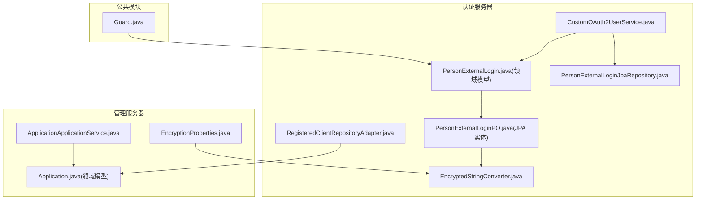
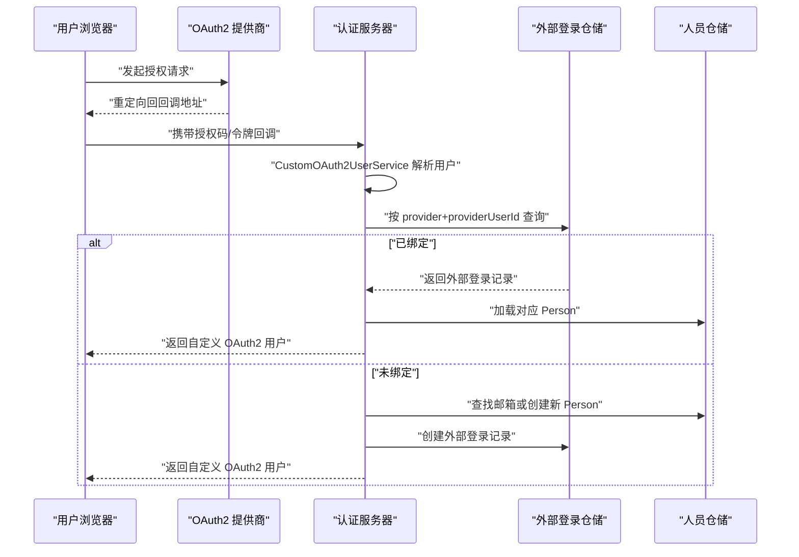
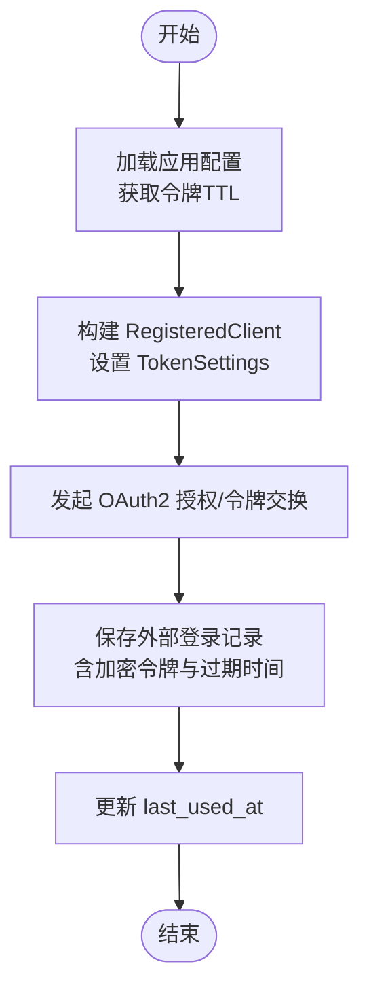
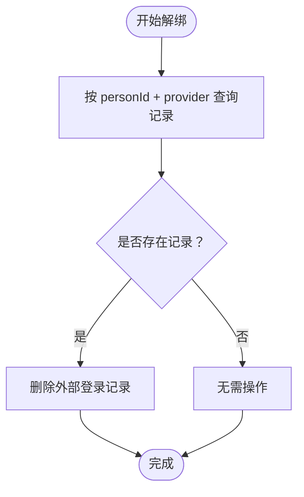
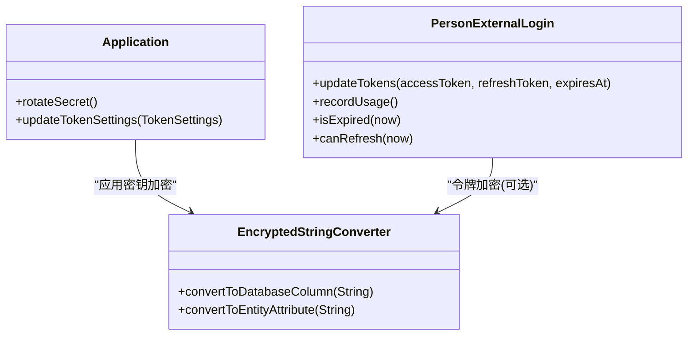
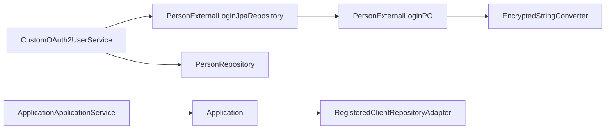

# 外部登录表

<cite>
**本文引用的文件**
- [PersonExternalLogin.java](file://iam-admin-server/src/main/java/iam/platform/admin/domain/model/entity/PersonExternalLogin.java)
- [PersonExternalLogin.java](file://iam-auth-server/src/main/java/iam/platform/auth/domain/model/entity/PersonExternalLogin.java)
- [PersonExternalLoginPO.java](file://iam-admin-server/src/main/java/iam/platform/admin/infrastructure/persistence/entity/PersonExternalLoginPO.java)
- [PersonExternalLoginPO.java](file://iam-auth-server/src/main/java/iam/platform/auth/infrastructure/persistence/entity/PersonExternalLoginPO.java)
- [PersonExternalLoginJpaRepository.java](file://iam-admin-server/src/main/java/iam/platform/admin/infrastructure/persistence/repository/PersonExternalLoginJpaRepository.java)
- [PersonExternalLoginJpaRepository.java](file://iam-auth-server/src/main/java/iam/platform/auth/infrastructure/persistence/repository/PersonExternalLoginJpaRepository.java)
- [CustomOAuth2UserService.java](file://iam-auth-server/src/main/java/iam/platform/auth/infrastructure/security/CustomOAuth2UserService.java)
- [RegisteredClientRepositoryAdapter.java](file://iam-auth-server/src/main/java/iam/platform/auth/infrastructure/security/RegisteredClientRepositoryAdapter.java)
- [EncryptedStringConverter.java](file://iam-auth-server/src/main/java/iam/platform/auth/infrastructure/persistence/converter/EncryptedStringConverter.java)
- [EncryptedStringConverter.java](file://iam-admin-server/src/main/java/iam/platform/admin/infrastructure/persistence/converter/EncryptedStringConverter.java)
- [EncryptionProperties.java](file://iam-auth-server/src/main/java/iam/platform/auth/infrastructure/config/EncryptionProperties.java)
- [EncryptionProperties.java](file://iam-admin-server/src/main/java/iam/platform/admin/infrastructure/config/EncryptionProperties.java)
- [V1__complete_schema_initialization.sql](file://iam-admin-server/src/main/resources/db/migration/V1__complete_schema_initialization.sql)
- [Guard.java](file://iam-common/src/main/java/iam/platform/common/util/Guard.java)
- [Application.java](file://iam-auth-server/src/main/java/iam/platform/auth/domain/model/entity/Application.java)
- [ApplicationApplicationService.java](file://iam-admin-server/src/main/java/iam/platform/admin/application/service/ApplicationApplicationService.java)
- [LoginController.java](file://iam-auth-server/src/main/java/iam/platform/auth/interfaces/web/LoginController.java)
</cite>

## 目录
1. [简介](#简介)
2. [项目结构](#项目结构)
3. [核心组件](#核心组件)
4. [架构总览](#架构总览)
5. [详细组件分析](#详细组件分析)
6. [依赖分析](#依赖分析)
7. [性能考虑](#性能考虑)
8. [故障排查指南](#故障排查指南)
9. [结论](#结论)
10. [附录](#附录)

## 简介
本文件聚焦 IAM 平台的“外部登录表”（t_person_external_login），系统性阐述第三方认证的核心表结构、账号绑定机制、令牌管理与会话保持策略，并覆盖 OAuth2 提供商集成、用户标识映射、访问令牌加密存储、刷新令牌处理、多提供商支持策略、账号解绑流程与安全令牌轮换机制。同时提供第三方登录集成示例、提供商配置模板与常见问题解决方案，展示如何通过外部登录实现 SSO 和统一身份认证。

## 项目结构
围绕外部登录的关键模块分布于认证服务器与管理服务器中：
- 认证服务器负责 OAuth2 登录流程、第三方用户解析与外部登录记录维护
- 管理服务器负责应用配置、令牌 TTL 设置与加密属性配置
- 公共模块提供断言工具 Guard，确保领域前置条件与不变式

**图表来源**
- [CustomOAuth2UserService.java:1-90](file://iam-auth-server/src/main/java/iam/platform/auth/infrastructure/security/CustomOAuth2UserService.java#L1-L90)
- [PersonExternalLogin.java:1-76](file://iam-auth-server/src/main/java/iam/platform/auth/domain/model/entity/PersonExternalLogin.java#L1-L76)
- [PersonExternalLoginPO.java:1-52](file://iam-auth-server/src/main/java/iam/platform/auth/infrastructure/persistence/entity/PersonExternalLoginPO.java#L1-L52)
- [PersonExternalLoginJpaRepository.java:1-18](file://iam-auth-server/src/main/java/iam/platform/auth/infrastructure/persistence/repository/PersonExternalLoginJpaRepository.java#L1-L18)
- [RegisteredClientRepositoryAdapter.java:1-101](file://iam-auth-server/src/main/java/iam/platform/auth/infrastructure/security/RegisteredClientRepositoryAdapter.java#L1-L101)
- [EncryptedStringConverter.java:1-73](file://iam-auth-server/src/main/java/iam/platform/auth/infrastructure/persistence/converter/EncryptedStringConverter.java#L1-L73)
- [ApplicationApplicationService.java:1-255](file://iam-admin-server/src/main/java/iam/platform/admin/application/service/ApplicationApplicationService.java#L1-L255)
- [Application.java:1-211](file://iam-auth-server/src/main/java/iam/platform/auth/domain/model/entity/Application.java#L1-L211)
- [EncryptionProperties.java:1-14](file://iam-auth-server/src/main/java/iam/platform/auth/infrastructure/config/EncryptionProperties.java#L1-L14)
- [Guard.java:1-37](file://iam-common/src/main/java/iam/platform/common/util/Guard.java#L1-L37)

**章节来源**
- [CustomOAuth2UserService.java:1-90](file://iam-auth-server/src/main/java/iam/platform/auth/infrastructure/security/CustomOAuth2UserService.java#L1-L90)
- [PersonExternalLogin.java:1-76](file://iam-auth-server/src/main/java/iam/platform/auth/domain/model/entity/PersonExternalLogin.java#L1-L76)
- [PersonExternalLoginPO.java:1-52](file://iam-auth-server/src/main/java/iam/platform/auth/infrastructure/persistence/entity/PersonExternalLoginPO.java#L1-L52)
- [PersonExternalLoginJpaRepository.java:1-18](file://iam-auth-server/src/main/java/iam/platform/auth/infrastructure/persistence/repository/PersonExternalLoginJpaRepository.java#L1-L18)
- [RegisteredClientRepositoryAdapter.java:1-101](file://iam-auth-server/src/main/java/iam/platform/auth/infrastructure/security/RegisteredClientRepositoryAdapter.java#L1-L101)
- [EncryptedStringConverter.java:1-73](file://iam-auth-server/src/main/java/iam/platform/auth/infrastructure/persistence/converter/EncryptedStringConverter.java#L1-L73)
- [ApplicationApplicationService.java:1-255](file://iam-admin-server/src/main/java/iam/platform/admin/application/service/ApplicationApplicationService.java#L1-L255)
- [Application.java:1-211](file://iam-auth-server/src/main/java/iam/platform/auth/domain/model/entity/Application.java#L1-L211)
- [EncryptionProperties.java:1-14](file://iam-auth-server/src/main/java/iam/platform/auth/infrastructure/config/EncryptionProperties.java#L1-L14)
- [Guard.java:1-37](file://iam-common/src/main/java/iam/platform/common/util/Guard.java#L1-L37)

## 核心组件
- 外部登录领域模型：封装第三方账号绑定、令牌更新、使用时间记录与过期判断
- 外部登录持久化实体：映射到 t_person_external_login 表，包含访问令牌、刷新令牌与过期时间等字段
- OAuth2 用户服务：从第三方提供商解析用户信息，完成用户查找/创建与外部登录记录建立
- 应用配置与令牌设置：通过 Application 领域模型与 RegisteredClientRepositoryAdapter 控制令牌 TTL
- 加密转换器：对敏感字段（如应用密钥、外部登录令牌）进行 AES-256-GCM 加密存储
- 断言工具：在关键路径上校验输入参数与状态，保障领域不变式

**章节来源**
- [PersonExternalLogin.java:1-77](file://iam-admin-server/src/main/java/iam/platform/admin/domain/model/entity/PersonExternalLogin.java#L1-L77)
- [PersonExternalLogin.java:1-76](file://iam-auth-server/src/main/java/iam/platform/auth/domain/model/entity/PersonExternalLogin.java#L1-L76)
- [PersonExternalLoginPO.java:1-72](file://iam-admin-server/src/main/java/iam/platform/admin/infrastructure/persistence/entity/PersonExternalLoginPO.java#L1-L72)
- [PersonExternalLoginPO.java:1-52](file://iam-auth-server/src/main/java/iam/platform/auth/infrastructure/persistence/entity/PersonExternalLoginPO.java#L1-L52)
- [CustomOAuth2UserService.java:1-90](file://iam-auth-server/src/main/java/iam/platform/auth/infrastructure/security/CustomOAuth2UserService.java#L1-L90)
- [RegisteredClientRepositoryAdapter.java:1-101](file://iam-auth-server/src/main/java/iam/platform/auth/infrastructure/security/RegisteredClientRepositoryAdapter.java#L1-L101)
- [EncryptedStringConverter.java:1-73](file://iam-auth-server/src/main/java/iam/platform/auth/infrastructure/persistence/converter/EncryptedStringConverter.java#L1-L73)
- [Guard.java:1-37](file://iam-common/src/main/java/iam/platform/common/util/Guard.java#L1-L37)

## 架构总览
外部登录贯穿 OAuth2 授权流程，从第三方提供商回调开始，解析用户标识，匹配或创建本地用户，并建立外部登录绑定；随后可按需更新令牌并记录使用时间。

**图表来源**
- [CustomOAuth2UserService.java:27-50](file://iam-auth-server/src/main/java/iam/platform/auth/infrastructure/security/CustomOAuth2UserService.java#L27-L50)
- [PersonExternalLoginJpaRepository.java:12-17](file://iam-auth-server/src/main/java/iam/platform/auth/infrastructure/persistence/repository/PersonExternalLoginJpaRepository.java#L12-L17)

## 详细组件分析

### 外部登录表结构与字段语义
- 表名：t_person_external_login
- 关键字段：
  - person_id：绑定的本地人员标识
  - provider：OAuth2 提供商标识（如 dingtalk、wechat、google 等）
  - provider_user_id：来自提供商的用户唯一标识
  - access_token / refresh_token：访问令牌与刷新令牌（加密存储）
  - expires_at：令牌过期时间
  - last_used_at：最近使用时间
  - created_at / updated_at：记录创建与更新时间戳
- 约束与索引：
  - 唯一约束：person_id + provider + provider_user_id
  - 索引：person_id、(provider, provider_user_id)

该表结构支持多提供商、多账号绑定与令牌生命周期管理。

**章节来源**
- [V1__complete_schema_initialization.sql:481-509](file://iam-admin-server/src/main/resources/db/migration/V1__complete_schema_initialization.sql#L481-L509)
- [PersonExternalLoginPO.java:28-64](file://iam-admin-server/src/main/java/iam/platform/admin/infrastructure/persistence/entity/PersonExternalLoginPO.java#L28-L64)
- [PersonExternalLoginPO.java:28-50](file://iam-auth-server/src/main/java/iam/platform/auth/infrastructure/persistence/entity/PersonExternalLoginPO.java#L28-L50)

### 外部登录领域模型与行为
- 工厂方法：link(personId, provider, providerUserId, accessToken, refreshToken, expiresAt)
  - 负责参数校验与默认时间填充
- 行为方法：
  - updateTokens(accessToken, refreshToken, expiresAt)：更新令牌与过期时间
  - recordUsage()：记录最近使用时间
  - isExpired(now)：判断是否过期
  - canRefresh(now)：在未过期且存在刷新令牌时允许刷新

这些方法确保外部登录对象在变更令牌与使用状态时保持一致的时间戳与有效性判断。

**章节来源**
- [PersonExternalLogin.java:29-76](file://iam-admin-server/src/main/java/iam/platform/admin/domain/model/entity/PersonExternalLogin.java#L29-L76)
- [PersonExternalLogin.java:29-76](file://iam-auth-server/src/main/java/iam/platform/auth/domain/model/entity/PersonExternalLogin.java#L29-L76)
- [Guard.java:13-35](file://iam-common/src/main/java/iam/platform/common/util/Guard.java#L13-L35)

### OAuth2 提供商集成与用户标识映射
- 提供商用户 ID 提取：
  - 钉钉：unionId
  - 微信：openid
  - 默认：id
- 登录流程：
  - 若外部登录记录存在：更新 last_used_at 并加载 Person
  - 否则：优先按邮箱查找 Person，若不存在则创建新 Person，并建立外部登录记录

该策略实现了“同源邮箱合并”与“首次登录自动注册”的统一逻辑。

**章节来源**
- [CustomOAuth2UserService.java:52-58](file://iam-auth-server/src/main/java/iam/platform/auth/infrastructure/security/CustomOAuth2UserService.java#L52-L58)
- [CustomOAuth2UserService.java:40-49](file://iam-auth-server/src/main/java/iam/platform/auth/infrastructure/security/CustomOAuth2UserService.java#L40-L49)
- [CustomOAuth2UserService.java:60-88](file://iam-auth-server/src/main/java/iam/platform/auth/infrastructure/security/CustomOAuth2UserService.java#L60-L88)

### 令牌管理与会话保持
- 访问令牌与刷新令牌：
  - 存储于 t_person_external_login 的 access_token 与 refresh_token 字段
  - 使用 AES-256-GCM 加密存储，密钥由 security.encryption.key 配置
- 令牌 TTL：
  - 应用层通过 Application 的 accessTokenTtlSeconds 与 refreshTokenTtlSeconds 控制
  - RegisteredClientRepositoryAdapter 将其映射为 Spring Authorization Server 的 TokenSettings
- 会话保持：
  - 每次外部登录成功后，更新 last_used_at，便于审计与统计

**图表来源**
- [Application.java:170-178](file://iam-auth-server/src/main/java/iam/platform/auth/domain/model/entity/Application.java#L170-L178)
- [RegisteredClientRepositoryAdapter.java:90-98](file://iam-auth-server/src/main/java/iam/platform/auth/infrastructure/security/RegisteredClientRepositoryAdapter.java#L90-L98)
- [EncryptedStringConverter.java:44-65](file://iam-auth-server/src/main/java/iam/platform/auth/infrastructure/persistence/converter/EncryptedStringConverter.java#L44-L65)

**章节来源**
- [Application.java:170-178](file://iam-auth-server/src/main/java/iam/platform/auth/domain/model/entity/Application.java#L170-L178)
- [RegisteredClientRepositoryAdapter.java:90-98](file://iam-auth-server/src/main/java/iam/platform/auth/infrastructure/security/RegisteredClientRepositoryAdapter.java#L90-L98)
- [EncryptedStringConverter.java:44-65](file://iam-auth-server/src/main/java/iam/platform/auth/infrastructure/persistence/converter/EncryptedStringConverter.java#L44-L65)

### 多提供商支持策略
- 提供商标识：通过 registrationId 识别（如 dingtalk、wechat 等）
- 用户 ID 映射：根据提供商差异提取 unionId/openid/id
- 绑定策略：以 provider + provider_user_id 作为唯一标识，避免跨提供商重复绑定

**章节来源**
- [CustomOAuth2UserService.java:31-38](file://iam-auth-server/src/main/java/iam/platform/auth/infrastructure/security/CustomOAuth2UserService.java#L31-L38)
- [CustomOAuth2UserService.java:52-58](file://iam-auth-server/src/main/java/iam/platform/auth/infrastructure/security/CustomOAuth2UserService.java#L52-L58)

### 账号解绑流程
- 删除外部登录记录：调用 PersonExternalLoginJpaRepository 的删除接口，解除 provider 与 provider_user_id 的绑定
- 影响：用户后续无法再通过该提供商直接登录，但本地账户仍可使用其他登录方式

**图表来源**
- [PersonExternalLoginJpaRepository.java:12-17](file://iam-auth-server/src/main/java/iam/platform/auth/infrastructure/persistence/repository/PersonExternalLoginJpaRepository.java#L12-L17)

**章节来源**
- [PersonExternalLoginJpaRepository.java:12-17](file://iam-auth-server/src/main/java/iam/platform/auth/infrastructure/persistence/repository/PersonExternalLoginJpaRepository.java#L12-L17)

### 安全令牌轮换机制
- 应用密钥轮换：ApplicationApplicationService.rotateAppSecret 触发密钥轮换，更新应用密文
- 外部登录令牌轮换：可通过 updateTokens 更新 access_token 与 refresh_token，并同步 expires_at
- 加密策略：AES-256-GCM，IV 随机生成，Tag 128bit，密钥长度必须为 32 字节

**图表来源**
- [ApplicationApplicationService.java:137-147](file://iam-admin-server/src/main/java/iam/platform/admin/application/service/ApplicationApplicationService.java#L137-L147)
- [Application.java:86-92](file://iam-auth-server/src/main/java/iam/platform/auth/domain/model/entity/Application.java#L86-L92)
- [PersonExternalLogin.java:56-75](file://iam-auth-server/src/main/java/iam/platform/auth/domain/model/entity/PersonExternalLogin.java#L56-L75)
- [EncryptedStringConverter.java:17-73](file://iam-auth-server/src/main/java/iam/platform/auth/infrastructure/persistence/converter/EncryptedStringConverter.java#L17-L73)

**章节来源**
- [ApplicationApplicationService.java:137-147](file://iam-admin-server/src/main/java/iam/platform/admin/application/service/ApplicationApplicationService.java#L137-L147)
- [Application.java:86-92](file://iam-auth-server/src/main/java/iam/platform/auth/domain/model/entity/Application.java#L86-L92)
- [PersonExternalLogin.java:56-75](file://iam-auth-server/src/main/java/iam/platform/auth/domain/model/entity/PersonExternalLogin.java#L56-L75)
- [EncryptedStringConverter.java:17-73](file://iam-auth-server/src/main/java/iam/platform/auth/infrastructure/persistence/converter/EncryptedStringConverter.java#L17-L73)

### 第三方登录集成示例与提供商配置模板
- 示例步骤（以钉钉/微信为例）：
  1) 在应用管理界面创建应用，配置回调地址与所需作用域
  2) 在提供商侧注册应用，获取 client_id 与 client_secret
  3) 在认证服务器中启用对应 registrationId 的 OAuth2 客户端
  4) 用户访问登录页，选择提供商进行授权
  5) 回调后，系统解析 unionId/openid 并建立外部登录绑定
- 提供商配置模板（示意）：
  - registrationId: dingtalk/wechat/google/github 等
  - client-id: 来自提供商
  - client-secret: 来自提供商
  - authorization-uri: 授权端点
  - token-uri: 令牌端点
  - user-info-uri: 用户信息端点
  - scope: openid/profile/email 等
  - client-name: 友好名称

注意：具体配置项以实际提供商文档为准，上述为通用模板。

### 常见问题与解决方案
- 问题：用户无法通过某提供商登录
  - 检查提供商用户 ID 提取逻辑（unionId/openid/id）
  - 核对 t_person_external_login 中是否存在重复绑定
- 问题：令牌过期导致第三方接口调用失败
  - 使用 canRefresh 判断是否可刷新
  - 若不可刷新，引导用户重新授权
- 问题：加密密钥配置错误导致启动失败
  - 检查 security.encryption.key 是否为 32 字节
  - 如配置无效，系统将降级为禁用加密

**章节来源**
- [CustomOAuth2UserService.java:52-58](file://iam-auth-server/src/main/java/iam/platform/auth/infrastructure/security/CustomOAuth2UserService.java#L52-L58)
- [PersonExternalLogin.java:73-75](file://iam-auth-server/src/main/java/iam/platform/auth/domain/model/entity/PersonExternalLogin.java#L73-L75)
- [EncryptedStringConverter.java:33-41](file://iam-auth-server/src/main/java/iam/platform/auth/infrastructure/persistence/converter/EncryptedStringConverter.java#L33-L41)

## 依赖分析
- 认证服务器依赖管理服务器的应用配置能力（令牌 TTL、回调地址等）
- 外部登录实体依赖加密转换器进行敏感字段加密
- OAuth2 用户服务依赖外部登录仓储与人员仓储，实现用户解析与绑定

**图表来源**
- [CustomOAuth2UserService.java:24-25](file://iam-auth-server/src/main/java/iam/platform/auth/infrastructure/security/CustomOAuth2UserService.java#L24-L25)
- [PersonExternalLoginJpaRepository.java:1-18](file://iam-auth-server/src/main/java/iam/platform/auth/infrastructure/persistence/repository/PersonExternalLoginJpaRepository.java#L1-L18)
- [ApplicationApplicationService.java:1-255](file://iam-admin-server/src/main/java/iam/platform/admin/application/service/ApplicationApplicationService.java#L1-L255)
- [Application.java:1-211](file://iam-auth-server/src/main/java/iam/platform/auth/domain/model/entity/Application.java#L1-L211)
- [RegisteredClientRepositoryAdapter.java:1-101](file://iam-auth-server/src/main/java/iam/platform/auth/infrastructure/security/RegisteredClientRepositoryAdapter.java#L1-L101)

**章节来源**
- [CustomOAuth2UserService.java:24-25](file://iam-auth-server/src/main/java/iam/platform/auth/infrastructure/security/CustomOAuth2UserService.java#L24-L25)
- [PersonExternalLoginJpaRepository.java:1-18](file://iam-auth-server/src/main/java/iam/platform/auth/infrastructure/persistence/repository/PersonExternalLoginJpaRepository.java#L1-L18)
- [ApplicationApplicationService.java:1-255](file://iam-admin-server/src/main/java/iam/platform/admin/application/service/ApplicationApplicationService.java#L1-L255)
- [Application.java:1-211](file://iam-auth-server/src/main/java/iam/platform/auth/domain/model/entity/Application.java#L1-L211)
- [RegisteredClientRepositoryAdapter.java:1-101](file://iam-auth-server/src/main/java/iam/platform/auth/infrastructure/security/RegisteredClientRepositoryAdapter.java#L1-L101)

## 性能考虑
- 外部登录查询：基于 (provider, provider_user_id) 的唯一索引，保证查找高效
- 令牌更新：批量更新 last_used_at 与 updated_at，减少写放大
- 加密开销：AES-256-GCM 加密/解密在入库/出库时执行，建议合理配置密钥与 JVM 参数

## 故障排查指南
- 外部登录记录缺失
  - 检查回调链路是否正确调用 CustomOAuth2UserService
  - 确认邮箱或用户名是否满足创建新用户的条件
- 令牌过期或刷新失败
  - 校验 expires_at 与 canRefresh 判断
  - 确认 refresh_token 是否为空
- 加密异常
  - 检查 security.encryption.key 长度与格式
  - 查看运行日志中的降级提示

**章节来源**
- [CustomOAuth2UserService.java:40-49](file://iam-auth-server/src/main/java/iam/platform/auth/infrastructure/security/CustomOAuth2UserService.java#L40-L49)
- [PersonExternalLogin.java:69-75](file://iam-auth-server/src/main/java/iam/platform/auth/domain/model/entity/PersonExternalLogin.java#L69-L75)
- [EncryptedStringConverter.java:33-41](file://iam-auth-server/src/main/java/iam/platform/auth/infrastructure/persistence/converter/EncryptedStringConverter.java#L33-L41)

## 结论
t_person_external_login 表为 IAM 平台的第三方认证提供了稳定的数据基础，结合 OAuth2 用户服务、应用令牌配置与加密存储，实现了多提供商支持、统一身份映射与安全令牌管理。通过规范的绑定、刷新与解绑流程，平台可在保障安全的前提下，灵活扩展第三方登录能力，支撑企业级 SSO 场景。

## 附录
- 数据库初始化脚本包含 t_person_external_login 表的完整定义与注释，可作为部署与审计依据
- 登录控制器提供多租户识别入口，便于在登录页展示租户相关信息

**章节来源**
- [V1__complete_schema_initialization.sql:481-509](file://iam-admin-server/src/main/resources/db/migration/V1__complete_schema_initialization.sql#L481-L509)
- [LoginController.java:19-57](file://iam-auth-server/src/main/java/iam/platform/auth/interfaces/web/LoginController.java#L19-L57)