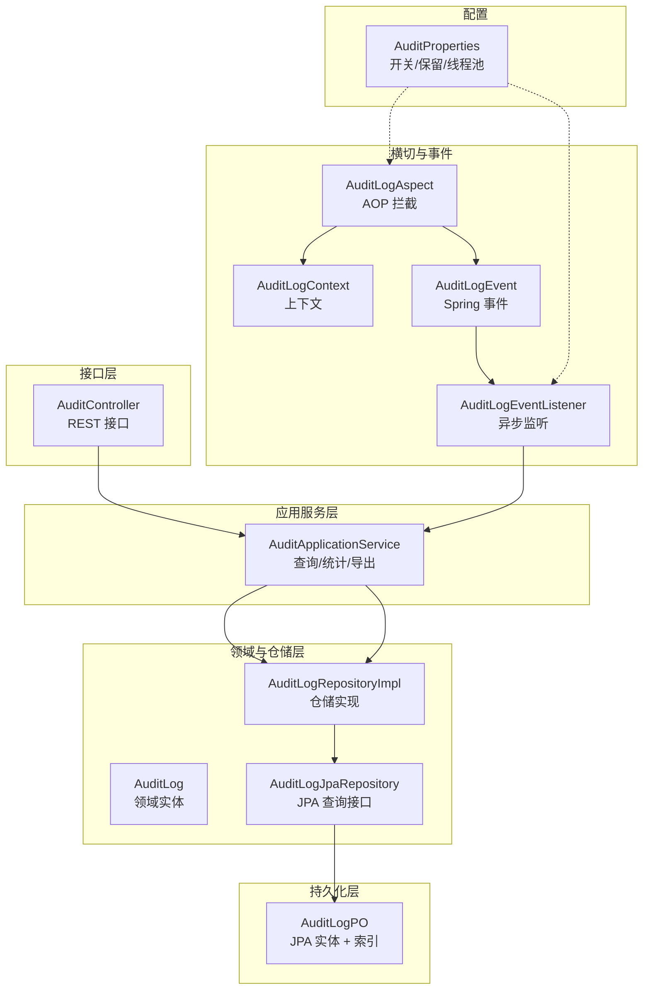
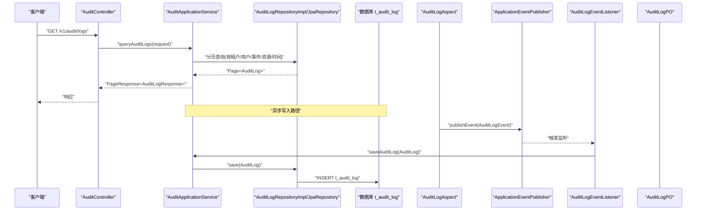

# 审计日志表

<cite>
**本文引用的文件**
- [AuditLog.java](file://iam-admin-server/src/main/java/iam/platform/admin/domain/model/entity/AuditLog.java)
- [AuditLogPO.java](file://iam-admin-server/src/main/java/iam/platform/admin/infrastructure/persistence/entity/AuditLogPO.java)
- [AuditLogEvent.java](file://iam-admin-server/src/main/java/iam/platform/admin/application/event/AuditLogEvent.java)
- [AuditLogEventListener.java](file://iam-admin-server/src/main/java/iam/platform/admin/application/event/AuditLogEventListener.java)
- [AuditLogAspect.java](file://iam-admin-server/src/main/java/iam/platform/admin/infrastructure/aspect/AuditLogAspect.java)
- [AuditApplicationService.java](file://iam-admin-server/src/main/java/iam/platform/admin/application/service/AuditApplicationService.java)
- [AuditLogJpaRepository.java](file://iam-admin-server/src/main/java/iam/platform/admin/infrastructure/persistence/repository/AuditLogJpaRepository.java)
- [AuditLogRepositoryImpl.java](file://iam-admin-server/src/main/java/iam/platform/admin/infrastructure/persistence/impl/AuditLogRepositoryImpl.java)
- [AuditController.java](file://iam-admin-server/src/main/java/iam/platform/admin/interfaces/rest/AuditController.java)
- [AuditLogContext.java](file://iam-admin-server/src/main/java/iam/platform/admin/infrastructure/aspect/AuditLogContext.java)
- [AuditProperties.java](file://iam-admin-server/src/main/java/iam/platform/admin/infrastructure/config/AuditProperties.java)
- [AuditEventType.java](file://iam-common/src/main/java/iam/platform/common/model/enums/AuditEventType.java)
- [EventCategory.java](file://iam-common/src/main/java/iam/platform/common/model/enums/EventCategory.java)
- [AuditResult.java](file://iam-common/src/main/java/iam/platform/common/model/enums/AuditResult.java)
</cite>

## 目录
1. [简介](#简介)
2. [项目结构](#项目结构)
3. [核心组件](#核心组件)
4. [架构总览](#架构总览)
5. [详细组件分析](#详细组件分析)
6. [依赖分析](#依赖分析)
7. [性能考虑](#性能考虑)
8. [故障排查指南](#故障排查指南)
9. [结论](#结论)
10. [附录](#附录)

## 简介
本文件围绕 IAM 平台的审计日志表 t_audit_log 进行系统化说明，覆盖以下主题：
- 审计追踪核心表结构：字段定义、索引设计与存储策略
- 日志记录格式：事件类型、事件分类、操作结果、请求上下文
- 敏感信息处理：参数截断与长度控制
- 日志保留策略：基于配置的保留天数与清理机制
- 审计指标统计：按事件分类、结果、事件类型聚合
- 合规与安全应用：查询、导出、统计、报表与监控
- 查询示例、性能优化与大数据量处理方案
- 合规审计、安全事件追踪与操作追溯实践

## 项目结构
IAM 平台的审计日志体系由“领域模型 + 持久化实体 + AOP 切面 + 应用服务 + 控制器 + 配置”构成，形成从方法拦截到异步持久化的完整链路。



图表来源
- [AuditController.java:1-89](file://iam-admin-server/src/main/java/iam/platform/admin/interfaces/rest/AuditController.java#L1-L89)
- [AuditApplicationService.java:1-217](file://iam-admin-server/src/main/java/iam/platform/admin/application/service/AuditApplicationService.java#L1-L217)
- [AuditLogRepositoryImpl.java:1-152](file://iam-admin-server/src/main/java/iam/platform/admin/infrastructure/persistence/impl/AuditLogRepositoryImpl.java#L1-L152)
- [AuditLogJpaRepository.java:1-57](file://iam-admin-server/src/main/java/iam/platform/admin/infrastructure/persistence/repository/AuditLogJpaRepository.java#L1-L57)
- [AuditLogPO.java:1-86](file://iam-admin-server/src/main/java/iam/platform/admin/infrastructure/persistence/entity/AuditLogPO.java#L1-L86)
- [AuditLogAspect.java:1-66](file://iam-admin-server/src/main/java/iam/platform/admin/infrastructure/aspect/AuditLogAspect.java#L1-L66)
- [AuditLogContext.java:1-32](file://iam-admin-server/src/main/java/iam/platform/admin/infrastructure/aspect/AuditLogContext.java#L1-L32)
- [AuditLogEvent.java:1-21](file://iam-admin-server/src/main/java/iam/platform/admin/application/event/AuditLogEvent.java#L1-L21)
- [AuditLogEventListener.java:1-31](file://iam-admin-server/src/main/java/iam/platform/admin/application/event/AuditLogEventListener.java#L1-L31)
- [AuditProperties.java:1-37](file://iam-admin-server/src/main/java/iam/platform/admin/infrastructure/config/AuditProperties.java#L1-L37)

章节来源
- [AuditController.java:1-89](file://iam-admin-server/src/main/java/iam/platform/admin/interfaces/rest/AuditController.java#L1-L89)
- [AuditApplicationService.java:1-217](file://iam-admin-server/src/main/java/iam/platform/admin/application/service/AuditApplicationService.java#L1-L217)
- [AuditLogRepositoryImpl.java:1-152](file://iam-admin-server/src/main/java/iam/platform/admin/infrastructure/persistence/impl/AuditLogRepositoryImpl.java#L1-L152)
- [AuditLogJpaRepository.java:1-57](file://iam-admin-server/src/main/java/iam/platform/admin/infrastructure/persistence/repository/AuditLogJpaRepository.java#L1-L57)
- [AuditLogPO.java:1-86](file://iam-admin-server/src/main/java/iam/platform/admin/infrastructure/persistence/entity/AuditLogPO.java#L1-L86)
- [AuditLogAspect.java:1-66](file://iam-admin-server/src/main/java/iam/platform/admin/infrastructure/aspect/AuditLogAspect.java#L1-L66)
- [AuditLogContext.java:1-32](file://iam-admin-server/src/main/java/iam/platform/admin/infrastructure/aspect/AuditLogContext.java#L1-L32)
- [AuditLogEvent.java:1-21](file://iam-admin-server/src/main/java/iam/platform/admin/application/event/AuditLogEvent.java#L1-L21)
- [AuditLogEventListener.java:1-31](file://iam-admin-server/src/main/java/iam/platform/admin/application/event/AuditLogEventListener.java#L1-L31)
- [AuditProperties.java:1-37](file://iam-admin-server/src/main/java/iam/platform/admin/infrastructure/config/AuditProperties.java#L1-L37)

## 核心组件
- t_audit_log 表结构与索引：包含租户、用户、事件类型与分类、资源标识、请求上下文、结果与错误信息、创建时间等字段，并建立多维索引以支撑高频查询。
- 领域实体 AuditLog：不可变审计事件对象，提供从上下文构建与直接创建两种工厂方法，以及查询辅助方法（成功判断、年龄计算、分类名称）。
- JPA 实体 AuditLogPO：映射 t_audit_log 的持久化对象，声明主键自增、字段长度与枚举列类型，以及复合索引。
- AOP 切面 AuditLogAspect：拦截带 @AuditLog 注解的方法，收集上下文、设置结果与错误信息、发布审计事件。
- 事件与监听：AuditLogEvent/Spring 事件/AuditLogEventListener 异步落库，避免阻塞业务主流程。
- 应用服务 AuditApplicationService：提供分页查询、详情查询、用户/资源维度查询、统计聚合、CSV 导出与异步写入。
- 仓储层：JPA 接口与实现负责具体查询、聚合与删除过期数据。
- 配置 AuditProperties：启用开关、保留天数、异步线程池参数。

章节来源
- [AuditLog.java:1-118](file://iam-admin-server/src/main/java/iam/platform/admin/domain/model/entity/AuditLog.java#L1-L118)
- [AuditLogPO.java:1-86](file://iam-admin-server/src/main/java/iam/platform/admin/infrastructure/persistence/entity/AuditLogPO.java#L1-L86)
- [AuditLogAspect.java:1-66](file://iam-admin-server/src/main/java/iam/platform/admin/infrastructure/aspect/AuditLogAspect.java#L1-L66)
- [AuditLogEvent.java:1-21](file://iam-admin-server/src/main/java/iam/platform/admin/application/event/AuditLogEvent.java#L1-L21)
- [AuditLogEventListener.java:1-31](file://iam-admin-server/src/main/java/iam/platform/admin/application/event/AuditLogEventListener.java#L1-L31)
- [AuditApplicationService.java:1-217](file://iam-admin-server/src/main/java/iam/platform/admin/application/service/AuditApplicationService.java#L1-L217)
- [AuditLogJpaRepository.java:1-57](file://iam-admin-server/src/main/java/iam/platform/admin/infrastructure/persistence/repository/AuditLogJpaRepository.java#L1-L57)
- [AuditLogRepositoryImpl.java:1-152](file://iam-admin-server/src/main/java/iam/platform/admin/infrastructure/persistence/impl/AuditLogRepositoryImpl.java#L1-L152)
- [AuditProperties.java:1-37](file://iam-admin-server/src/main/java/iam/platform/admin/infrastructure/config/AuditProperties.java#L1-L37)

## 架构总览
下图展示了从方法拦截到异步持久化的端到端流程，以及统计与导出能力：



图表来源
- [AuditController.java:1-89](file://iam-admin-server/src/main/java/iam/platform/admin/interfaces/rest/AuditController.java#L1-L89)
- [AuditApplicationService.java:1-217](file://iam-admin-server/src/main/java/iam/platform/admin/application/service/AuditApplicationService.java#L1-L217)
- [AuditLogRepositoryImpl.java:1-152](file://iam-admin-server/src/main/java/iam/platform/admin/infrastructure/persistence/impl/AuditLogRepositoryImpl.java#L1-L152)
- [AuditLogJpaRepository.java:1-57](file://iam-admin-server/src/main/java/iam/platform/admin/infrastructure/persistence/repository/AuditLogJpaRepository.java#L1-L57)
- [AuditLogAspect.java:1-66](file://iam-admin-server/src/main/java/iam/platform/admin/infrastructure/aspect/AuditLogAspect.java#L1-L66)
- [AuditLogEvent.java:1-21](file://iam-admin-server/src/main/java/iam/platform/admin/application/event/AuditLogEvent.java#L1-L21)
- [AuditLogEventListener.java:1-31](file://iam-admin-server/src/main/java/iam/platform/admin/application/event/AuditLogEventListener.java#L1-L31)
- [AuditLogPO.java:1-86](file://iam-admin-server/src/main/java/iam/platform/admin/infrastructure/persistence/entity/AuditLogPO.java#L1-L86)

## 详细组件分析

### 表结构与索引设计（t_audit_log）
- 字段要点
  - 主键：自增 id
  - 关联标识：tenant_id、person_id
  - 事件元数据：event_type（枚举）、event_category（枚举）、resource_type、resource_id、action
  - 请求上下文：ip_address、user_agent、request_uri、request_params（TEXT）
  - 结果与错误：result（枚举）、error_message（限制长度）
  - 时间戳：created_at（自动插入）
- 索引设计
  - 单列索引：tenant_id、person_id、event_type、event_category、result、created_at
  - 复合索引：resource_type+resource_id；tenant_id+event_category+created_at
- 设计意图
  - 支撑按租户、用户、事件类型、事件分类、资源、时间范围的高效查询
  - 降低全表扫描概率，提升统计与导出效率

章节来源
- [AuditLogPO.java:1-86](file://iam-admin-server/src/main/java/iam/platform/admin/infrastructure/persistence/entity/AuditLogPO.java#L1-L86)

### 领域实体与上下文（AuditLog 与 AuditLogContext）
- AuditLog
  - 不可变审计事件对象，提供 fromContext 与 create 工厂方法
  - 提供 isSuccess、getAgeInDays、getEventCategoryName 等查询方法
- AuditLogContext
  - 记录一次审计所需的全部上下文：租户、用户、事件类型、资源、请求头、IP、URI、参数、结果、错误信息

章节来源
- [AuditLog.java:1-118](file://iam-admin-server/src/main/java/iam/platform/admin/domain/model/entity/AuditLog.java#L1-L118)
- [AuditLogContext.java:1-32](file://iam-admin-server/src/main/java/iam/platform/admin/infrastructure/aspect/AuditLogContext.java#L1-L32)

### AOP 拦截与事件发布（AuditLogAspect、AuditLogEvent、AuditLogEventListener）
- AuditLogAspect
  - 在被 @AuditLog 标注的方法周围执行：构建上下文、设置结果为成功或失败（含错误信息截断）、发布审计事件
  - 受 AuditProperties.enabled 控制
- AuditLogEvent/AuditLogEventListener
  - 使用 Spring 异步监听器接收事件，转换为领域实体并调用应用服务保存
  - 保证审计写入不影响主业务流程

章节来源
- [AuditLogAspect.java:1-66](file://iam-admin-server/src/main/java/iam/platform/admin/infrastructure/aspect/AuditLogAspect.java#L1-L66)
- [AuditLogEvent.java:1-21](file://iam-admin-server/src/main/java/iam/platform/admin/application/event/AuditLogEvent.java#L1-L21)
- [AuditLogEventListener.java:1-31](file://iam-admin-server/src/main/java/iam/platform/admin/application/event/AuditLogEventListener.java#L1-L31)
- [AuditProperties.java:1-37](file://iam-admin-server/src/main/java/iam/platform/admin/infrastructure/config/AuditProperties.java#L1-L37)

### 应用服务与查询统计（AuditApplicationService）
- 分页查询
  - 支持按租户、用户、事件类型、事件分类、资源、时间范围查询
  - 默认无过滤条件时返回空页，防止全表扫描
- 统计聚合
  - 按事件分类、结果、Top N 事件类型进行聚合
  - 聚合范围限定在租户与时间区间内
- 导出
  - 将匹配的日志导出为 CSV，包含头部与转义处理
  - 导出默认限制前 10000 条，避免超大数据量导出导致内存压力

章节来源
- [AuditApplicationService.java:1-217](file://iam-admin-server/src/main/java/iam/platform/admin/application/service/AuditApplicationService.java#L1-L217)

### 仓储层与 SQL 聚合（AuditLogRepositoryImpl、AuditLogJpaRepository）
- JPA 查询接口
  - 提供按租户、用户、事件类型、事件分类、结果、时间范围的分页查询
  - 提供按租户+时间范围的事件分类/结果/事件类型聚合查询
  - 提供删除过期数据的原生更新语句
- 仓储实现
  - 负责领域对象与持久化对象之间的映射
  - 执行保存、批量保存、删除过期等事务性操作

章节来源
- [AuditLogJpaRepository.java:1-57](file://iam-admin-server/src/main/java/iam/platform/admin/infrastructure/persistence/repository/AuditLogJpaRepository.java#L1-L57)
- [AuditLogRepositoryImpl.java:1-152](file://iam-admin-server/src/main/java/iam/platform/admin/infrastructure/persistence/impl/AuditLogRepositoryImpl.java#L1-L152)

### 控制器接口（AuditController）
- 提供 REST 接口：分页查询、详情、按用户/资源查询、统计、CSV 导出
- 参数校验与分页排序由应用服务统一处理

章节来源
- [AuditController.java:1-89](file://iam-admin-server/src/main/java/iam/platform/admin/interfaces/rest/AuditController.java#L1-L89)

### 事件类型与分类（AuditEventType、EventCategory、AuditResult）
- 事件类型与分类映射：登录、登出、角色分配、权限变更、账户创建/更新/删除、租户管理、会话切换/过期等
- 结果枚举：SUCCESS/FAILURE

章节来源
- [AuditEventType.java:1-59](file://iam-common/src/main/java/iam/platform/common/model/enums/AuditEventType.java#L1-L59)
- [EventCategory.java:1-13](file://iam-common/src/main/java/iam/platform/common/model/enums/EventCategory.java#L1-L13)
- [AuditResult.java:1-9](file://iam-common/src/main/java/iam/platform/common/model/enums/AuditResult.java#L1-L9)

## 依赖分析
- 组件耦合
  - 控制器仅依赖应用服务；应用服务依赖仓储接口与装配器；仓储实现依赖 JPA 接口
  - AOP 切面与事件监听器通过 Spring 事件解耦，避免直接耦合
- 外部依赖
  - 数据库：MySQL/PG（根据索引与类型推断）
  - Spring：AOP、事件发布/订阅、异步执行器
- 循环依赖
  - 未见循环依赖迹象，职责清晰

```mermaid
classDiagram
class AuditController
class AuditApplicationService
class AuditLogRepositoryImpl
class AuditLogJpaRepository
class AuditLogPO
class AuditLog
class AuditLogAspect
class AuditLogEvent
class AuditLogEventListener
class AuditLogContext
class AuditProperties
AuditController --> AuditApplicationService : "调用"
AuditApplicationService --> AuditLogRepositoryImpl : "仓储访问"
AuditLogRepositoryImpl --> AuditLogJpaRepository : "委托"
AuditLogJpaRepository --> AuditLogPO : "持久化"
AuditLogRepositoryImpl --> AuditLog : "领域对象"
AuditLogAspect --> AuditLogContext : "构建上下文"
AuditLogAspect --> AuditLogEvent : "发布事件"
AuditLogEvent --> AuditLogEventListener : "监听"
AuditLogEventListener --> AuditApplicationService : "保存"
AuditProperties -.-> AuditLogAspect : "开关/线程池"
```

图表来源
- [AuditController.java:1-89](file://iam-admin-server/src/main/java/iam/platform/admin/interfaces/rest/AuditController.java#L1-L89)
- [AuditApplicationService.java:1-217](file://iam-admin-server/src/main/java/iam/platform/admin/application/service/AuditApplicationService.java#L1-L217)
- [AuditLogRepositoryImpl.java:1-152](file://iam-admin-server/src/main/java/iam/platform/admin/infrastructure/persistence/impl/AuditLogRepositoryImpl.java#L1-L152)
- [AuditLogJpaRepository.java:1-57](file://iam-admin-server/src/main/java/iam/platform/admin/infrastructure/persistence/repository/AuditLogJpaRepository.java#L1-L57)
- [AuditLogPO.java:1-86](file://iam-admin-server/src/main/java/iam/platform/admin/infrastructure/persistence/entity/AuditLogPO.java#L1-L86)
- [AuditLog.java:1-118](file://iam-admin-server/src/main/java/iam/platform/admin/domain/model/entity/AuditLog.java#L1-L118)
- [AuditLogAspect.java:1-66](file://iam-admin-server/src/main/java/iam/platform/admin/infrastructure/aspect/AuditLogAspect.java#L1-L66)
- [AuditLogEvent.java:1-21](file://iam-admin-server/src/main/java/iam/platform/admin/application/event/AuditLogEvent.java#L1-L21)
- [AuditLogEventListener.java:1-31](file://iam-admin-server/src/main/java/iam/platform/admin/application/event/AuditLogEventListener.java#L1-L31)
- [AuditLogContext.java:1-32](file://iam-admin-server/src/main/java/iam/platform/admin/infrastructure/aspect/AuditLogContext.java#L1-L32)
- [AuditProperties.java:1-37](file://iam-admin-server/src/main/java/iam/platform/admin/infrastructure/config/AuditProperties.java#L1-L37)

## 性能考虑
- 写入路径
  - 异步落库：通过 Spring 事件与 @Async 执行器异步保存，避免阻塞主业务
  - 线程池参数：可通过配置调整核心/最大线程与队列容量
- 查询路径
  - 复合索引：resource_type+resource_id、tenant_id+event_category+created_at
  - 分页查询：默认要求至少一个过滤条件，防止全表扫描
  - 统计查询：使用原生聚合查询，减少结果集大小
- 导出路径
  - 默认限制导出前 10000 条，避免大体积导出
  - CSV 转义处理，确保兼容性
- 清理策略
  - 基于配置的保留天数，提供删除过期数据的批量清理接口

章节来源
- [AuditProperties.java:1-37](file://iam-admin-server/src/main/java/iam/platform/admin/infrastructure/config/AuditProperties.java#L1-L37)
- [AuditApplicationService.java:1-217](file://iam-admin-server/src/main/java/iam/platform/admin/application/service/AuditApplicationService.java#L1-L217)
- [AuditLogJpaRepository.java:1-57](file://iam-admin-server/src/main/java/iam/platform/admin/infrastructure/persistence/repository/AuditLogJpaRepository.java#L1-L57)

## 故障排查指南
- 审计写入失败
  - 现象：日志保存异常但业务不中断
  - 处理：检查应用服务中的异常日志输出；确认异步执行器可用
- 事件未落库
  - 现象：业务执行成功但未产生审计记录
  - 处理：确认方法是否标注 @AuditLog；检查 AuditProperties.enabled；查看 AOP 是否生效
- 查询无结果
  - 现象：分页查询为空
  - 处理：确认至少提供一个过滤条件；核对时间范围与租户/用户/事件类型是否正确
- 导出过大
  - 现象：导出卡顿或内存不足
  - 处理：缩小时间范围或增加过滤条件；利用分页/分批导出策略
- 清理无效
  - 现象：历史数据未被清理
  - 处理：确认保留天数配置；检查清理任务执行时间

章节来源
- [AuditApplicationService.java:1-217](file://iam-admin-server/src/main/java/iam/platform/admin/application/service/AuditApplicationService.java#L1-L217)
- [AuditLogAspect.java:1-66](file://iam-admin-server/src/main/java/iam/platform/admin/infrastructure/aspect/AuditLogAspect.java#L1-L66)
- [AuditLogEventListener.java:1-31](file://iam-admin-server/src/main/java/iam/platform/admin/application/event/AuditLogEventListener.java#L1-L31)

## 结论
IAM 平台的审计日志体系以 t_audit_log 为核心，结合 AOP 拦截、异步事件与 JPA 仓储，实现了高可用、可扩展且面向合规的审计能力。通过合理的索引设计、统计聚合与导出机制，既能满足日常运营与安全监控需求，也能支撑合规审计与事件追溯。

## 附录

### 审计事件类型与分类
- 事件类型与分类映射参见事件枚举定义，涵盖认证、授权、账户、管理、会话五大类。

章节来源
- [AuditEventType.java:1-59](file://iam-common/src/main/java/iam/platform/common/model/enums/AuditEventType.java#L1-L59)
- [EventCategory.java:1-13](file://iam-common/src/main/java/iam/platform/common/model/enums/EventCategory.java#L1-L13)

### 日志记录格式与字段说明
- 关键字段
  - 租户与用户：tenant_id、person_id、username
  - 事件元数据：event_type、event_category、resource_type、resource_id、action
  - 请求上下文：ip_address、user_agent、request_uri、request_params
  - 结果与错误：result、error_message
  - 时间戳：created_at
- 不可变性：审计日志一旦创建不应修改，确保可追溯性

章节来源
- [AuditLog.java:1-118](file://iam-admin-server/src/main/java/iam/platform/admin/domain/model/entity/AuditLog.java#L1-L118)
- [AuditLogPO.java:1-86](file://iam-admin-server/src/main/java/iam/platform/admin/infrastructure/persistence/entity/AuditLogPO.java#L1-L86)

### 敏感信息处理与长度控制
- 错误信息截断：AOP 中对异常消息进行长度限制，避免超长文本写入
- 字段长度约束：如 request_params 使用 TEXT，其他字段设置合理长度上限
- 导出转义：CSV 导出时对逗号、引号、换行符进行转义处理

章节来源
- [AuditLogAspect.java:1-66](file://iam-admin-server/src/main/java/iam/platform/admin/infrastructure/aspect/AuditLogAspect.java#L1-L66)
- [AuditApplicationService.java:1-217](file://iam-admin-server/src/main/java/iam/platform/admin/application/service/AuditApplicationService.java#L1-L217)
- [AuditLogPO.java:1-86](file://iam-admin-server/src/main/java/iam/platform/admin/infrastructure/persistence/entity/AuditLogPO.java#L1-L86)

### 日志保留策略
- 保留天数：通过配置项设置，默认 180 天
- 清理机制：提供按截止时间删除过期数据的接口，支持定时任务调度

章节来源
- [AuditProperties.java:1-37](file://iam-admin-server/src/main/java/iam/platform/admin/infrastructure/config/AuditProperties.java#L1-L37)
- [AuditLogJpaRepository.java:1-57](file://iam-admin-server/src/main/java/iam/platform/admin/infrastructure/persistence/repository/AuditLogJpaRepository.java#L1-L57)

### 审计指标统计
- 聚合维度：事件分类、操作结果、Top N 事件类型
- 时间范围：限定在租户与起止时间之间
- 输出：总数、分类计数、结果计数、Top 事件类型列表

章节来源
- [AuditApplicationService.java:1-217](file://iam-admin-server/src/main/java/iam/platform/admin/application/service/AuditApplicationService.java#L1-L217)
- [AuditLogJpaRepository.java:1-57](file://iam-admin-server/src/main/java/iam/platform/admin/infrastructure/persistence/repository/AuditLogJpaRepository.java#L1-L57)

### 合规与安全应用
- 合规审计：提供统计报表与 CSV 导出，便于外部审计
- 安全监控：基于事件分类与结果的实时告警与趋势分析
- 操作追溯：按用户/资源维度查询，快速定位问题

章节来源
- [AuditController.java:1-89](file://iam-admin-server/src/main/java/iam/platform/admin/interfaces/rest/AuditController.java#L1-L89)
- [AuditApplicationService.java:1-217](file://iam-admin-server/src/main/java/iam/platform/admin/application/service/AuditApplicationService.java#L1-L217)

### 审计日志查询示例（路径指引）
- 分页查询
  - 路径：[AuditController.java:34-39](file://iam-admin-server/src/main/java/iam/platform/admin/interfaces/rest/AuditController.java#L34-L39)
  - 逻辑：[AuditApplicationService.java:53-85](file://iam-admin-server/src/main/java/iam/platform/admin/application/service/AuditApplicationService.java#L53-L85)
- 用户维度
  - 路径：[AuditController.java:47-53](file://iam-admin-server/src/main/java/iam/platform/admin/interfaces/rest/AuditController.java#L47-L53)
  - 逻辑：[AuditApplicationService.java:99-108](file://iam-admin-server/src/main/java/iam/platform/admin/application/service/AuditApplicationService.java#L99-L108)
- 资源维度
  - 路径：[AuditController.java:55-63](file://iam-admin-server/src/main/java/iam/platform/admin/interfaces/rest/AuditController.java#L55-L63)
  - 逻辑：[AuditApplicationService.java:113-124](file://iam-admin-server/src/main/java/iam/platform/admin/application/service/AuditApplicationService.java#L113-L124)
- 统计
  - 路径：[AuditController.java:65-71](file://iam-admin-server/src/main/java/iam/platform/admin/interfaces/rest/AuditController.java#L65-L71)
  - 逻辑：[AuditApplicationService.java:129-158](file://iam-admin-server/src/main/java/iam/platform/admin/application/service/AuditApplicationService.java#L129-L158)
- 导出
  - 路径：[AuditController.java:73-87](file://iam-admin-server/src/main/java/iam/platform/admin/interfaces/rest/AuditController.java#L73-L87)
  - 逻辑：[AuditApplicationService.java:163-187](file://iam-admin-server/src/main/java/iam/platform/admin/application/service/AuditApplicationService.java#L163-L187)

### 性能优化建议
- 索引优化：确保常用过滤组合命中复合索引
- 分页与过滤：强制至少一个过滤条件，避免全表扫描
- 导出优化：缩小时间范围与过滤条件，必要时分批导出
- 异步写入：合理配置异步线程池，平衡吞吐与延迟
- 清理策略：定期清理过期数据，保持表规模可控

章节来源
- [AuditLogPO.java:1-86](file://iam-admin-server/src/main/java/iam/platform/admin/infrastructure/persistence/entity/AuditLogPO.java#L1-L86)
- [AuditApplicationService.java:1-217](file://iam-admin-server/src/main/java/iam/platform/admin/application/service/AuditApplicationService.java#L1-L217)
- [AuditProperties.java:1-37](file://iam-admin-server/src/main/java/iam/platform/admin/infrastructure/config/AuditProperties.java#L1-L37)

### 大数据量处理方案
- 分页与分批：查询与导出均采用分页，限制单次处理量
- 聚合查询：优先使用原生聚合查询，减少结果集
- 清理策略：定期删除过期数据，维持表规模
- 异步写入：通过事件与异步监听器削峰填谷

章节来源
- [AuditApplicationService.java:1-217](file://iam-admin-server/src/main/java/iam/platform/admin/application/service/AuditApplicationService.java#L1-L217)
- [AuditLogJpaRepository.java:1-57](file://iam-admin-server/src/main/java/iam/platform/admin/infrastructure/persistence/repository/AuditLogJpaRepository.java#L1-L57)