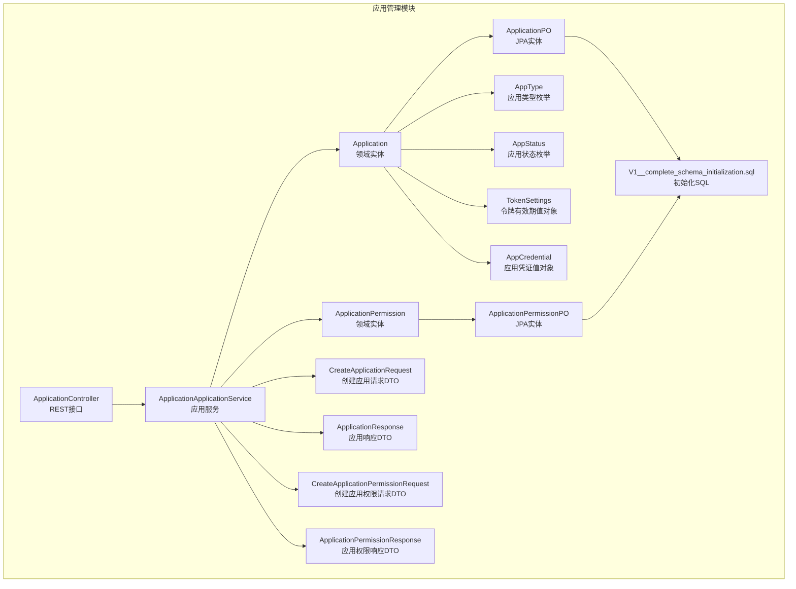
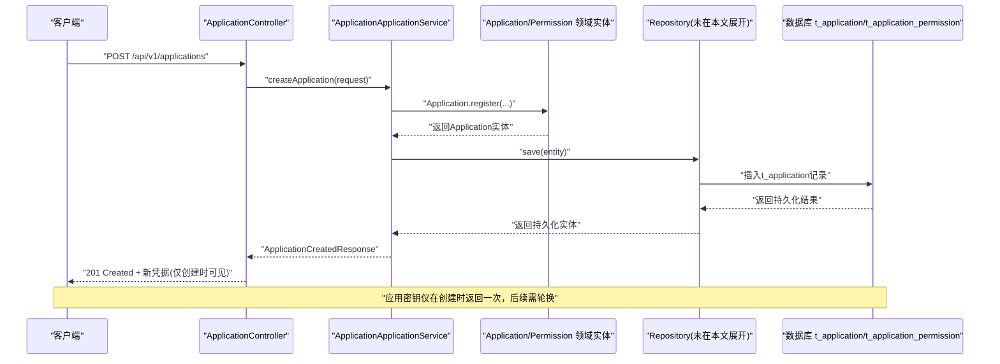
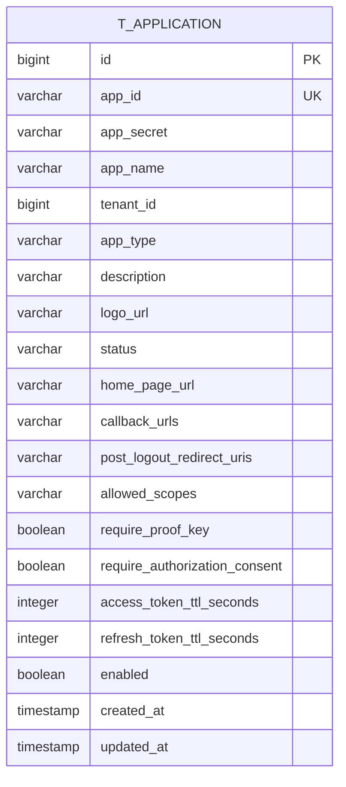
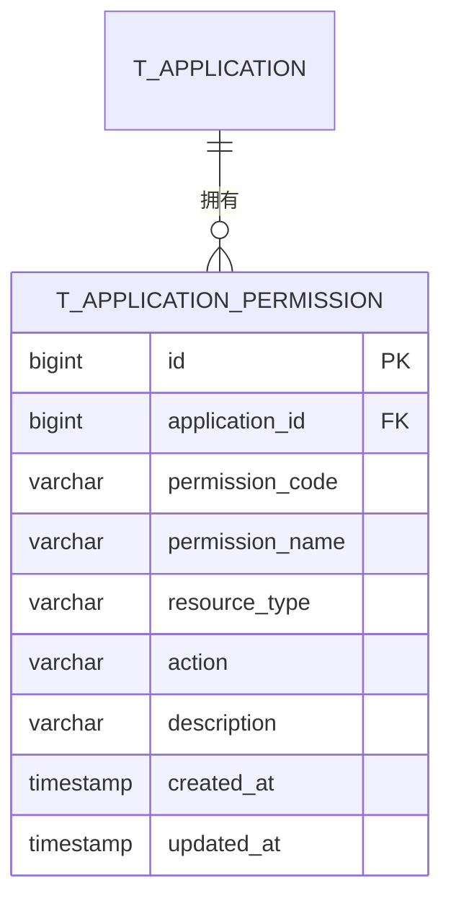
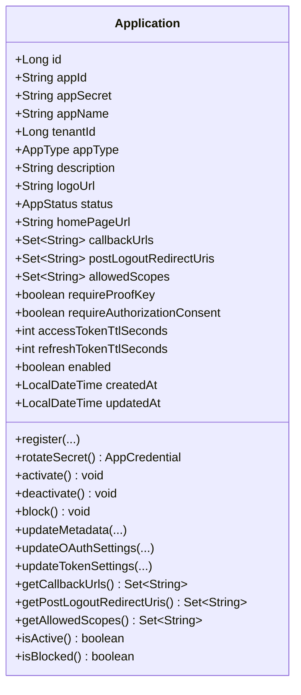
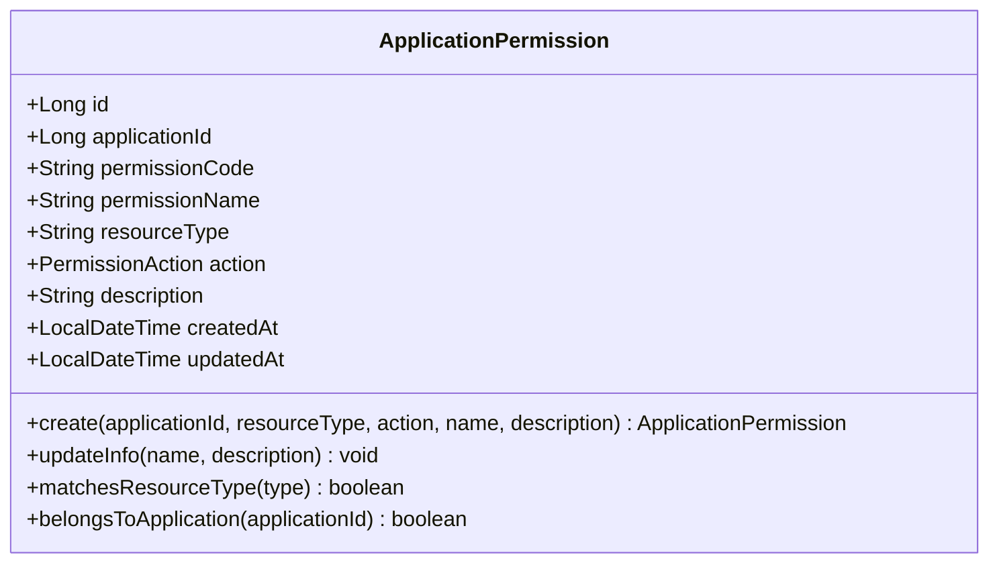
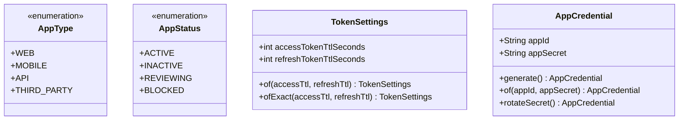
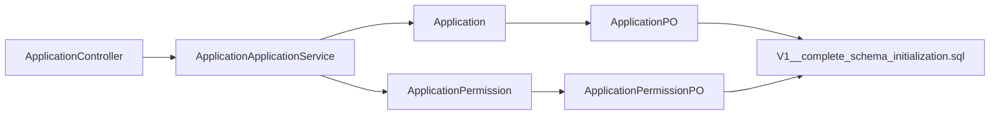

# 应用管理表

<cite>
**本文引用的文件**
- [Application.java](file://iam-admin-server/src/main/java/iam/platform/admin/domain/model/entity/Application.java)
- [ApplicationPermission.java](file://iam-admin-server/src/main/java/iam/platform/admin/domain/model/entity/ApplicationPermission.java)
- [ApplicationPO.java](file://iam-admin-server/src/main/java/iam/platform/admin/infrastructure/persistence/entity/ApplicationPO.java)
- [ApplicationPermissionPO.java](file://iam-admin-server/src/main/java/iam/platform/admin/infrastructure/persistence/entity/ApplicationPermissionPO.java)
- [AppType.java](file://iam-common/src/main/java/iam/platform/common/model/enums/AppType.java)
- [AppStatus.java](file://iam-common/src/main/java/iam/platform/common/model/enums/AppStatus.java)
- [TokenSettings.java](file://iam-common/src/main/java/iam/platform/common/model/valueobject/TokenSettings.java)
- [AppCredential.java](file://iam-common/src/main/java/iam/platform/common/model/valueobject/AppCredential.java)
- [CreateApplicationRequest.java](file://iam-common/src/main/java/iam/platform/common/dto/request/CreateApplicationRequest.java)
- [ApplicationResponse.java](file://iam-common/src/main/java/iam/platform/common/dto/response/ApplicationResponse.java)
- [CreateApplicationPermissionRequest.java](file://iam-common/src/main/java/iam/platform/common/dto/request/CreateApplicationPermissionRequest.java)
- [ApplicationPermissionResponse.java](file://iam-common/src/main/java/iam/platform/common/dto/response/ApplicationPermissionResponse.java)
- [ApplicationController.java](file://iam-admin-server/src/main/java/iam/platform/admin/interfaces/rest/ApplicationController.java)
- [ApplicationApplicationService.java](file://iam-admin-server/src/main/java/iam/platform/admin/application/service/ApplicationApplicationService.java)
- [V1__complete_schema_initialization.sql](file://iam-admin-server/src/main/resources/db/migration/V1__complete_schema_initialization.sql)
</cite>

## 目录
1. [简介](#简介)
2. [项目结构](#项目结构)
3. [核心组件](#核心组件)
4. [架构总览](#架构总览)
5. [详细组件分析](#详细组件分析)
6. [依赖分析](#依赖分析)
7. [性能考虑](#性能考虑)
8. [故障排查指南](#故障排查指南)
9. [结论](#结论)
10. [附录](#附录)

## 简介
本文件聚焦IAM平台“应用管理”子系统的数据库表结构与领域模型，系统性阐述以下内容：
- 核心表结构：t_application（应用表）与t_application_permission（应用权限表）
- 应用配置与OAuth2参数：应用类型、回调URL、作用域、PKCE与授权同意、令牌有效期等
- 应用与租户的关联关系、应用状态管理与安全配置
- 应用权限与系统权限的区别及应用场景
- OAuth2客户端配置示例、应用集成最佳实践与安全令牌管理策略

## 项目结构
围绕应用管理的关键代码分布在以下模块与包中：
- 领域模型层：Application、ApplicationPermission（实体）
- 数据持久化层：ApplicationPO、ApplicationPermissionPO（JPA实体）
- 接口层：ApplicationController（REST接口）
- 应用服务层：ApplicationApplicationService（业务编排）
- 公共模型与枚举：AppType、AppStatus、TokenSettings、AppCredential
- DTO与请求响应：CreateApplicationRequest、ApplicationResponse、CreateApplicationPermissionRequest、ApplicationPermissionResponse
- 初始化脚本：V1__complete_schema_initialization.sql（包含表定义与索引）

**图表来源**
- [ApplicationController.java:1-139](file://iam-admin-server/src/main/java/iam/platform/admin/interfaces/rest/ApplicationController.java#L1-139)
- [ApplicationApplicationService.java:1-255](file://iam-admin-server/src/main/java/iam/platform/admin/application/service/ApplicationApplicationService.java#L1-255)
- [Application.java:1-211](file://iam-admin-server/src/main/java/iam/platform/admin/domain/model/entity/Application.java#L1-211)
- [ApplicationPermission.java:1-75](file://iam-admin-server/src/main/java/iam/platform/admin/domain/model/entity/ApplicationPermission.java#L1-75)
- [ApplicationPO.java:1-118](file://iam-admin-server/src/main/java/iam/platform/admin/infrastructure/persistence/entity/ApplicationPO.java#L1-118)
- [ApplicationPermissionPO.java:1-71](file://iam-admin-server/src/main/java/iam/platform/admin/infrastructure/persistence/entity/ApplicationPermissionPO.java#L1-71)
- [AppType.java:1-6](file://iam-common/src/main/java/iam/platform/common/model/enums/AppType.java#L1-6)
- [AppStatus.java:1-6](file://iam-common/src/main/java/iam/platform/common/model/enums/AppStatus.java#L1-6)
- [TokenSettings.java:1-63](file://iam-common/src/main/java/iam/platform/common/model/valueobject/TokenSettings.java#L1-63)
- [AppCredential.java:1-67](file://iam-common/src/main/java/iam/platform/common/model/valueobject/AppCredential.java#L1-67)
- [CreateApplicationRequest.java:1-44](file://iam-common/src/main/java/iam/platform/common/dto/request/CreateApplicationRequest.java#L1-44)
- [ApplicationResponse.java:1-34](file://iam-common/src/main/java/iam/platform/common/dto/response/ApplicationResponse.java#L1-34)
- [CreateApplicationPermissionRequest.java:1-28](file://iam-common/src/main/java/iam/platform/common/dto/request/CreateApplicationPermissionRequest.java#L1-28)
- [ApplicationPermissionResponse.java:1-25](file://iam-common/src/main/java/iam/platform/common/dto/response/ApplicationPermissionResponse.java#L1-25)
- [V1__complete_schema_initialization.sql:349-417](file://iam-admin-server/src/main/resources/db/migration/V1__complete_schema_initialization.sql#L349-417)

**章节来源**
- [ApplicationController.java:1-139](file://iam-admin-server/src/main/java/iam/platform/admin/interfaces/rest/ApplicationController.java#L1-139)
- [ApplicationApplicationService.java:1-255](file://iam-admin-server/src/main/java/iam/platform/admin/application/service/ApplicationApplicationService.java#L1-255)
- [V1__complete_schema_initialization.sql:349-417](file://iam-admin-server/src/main/resources/db/migration/V1__complete_schema_initialization.sql#L349-417)

## 核心组件
本节从数据库表结构、领域模型、枚举与值对象四个维度，系统梳理应用管理的核心组件。

- 表结构与字段
  - t_application（应用表）
    - 关键字段：app_id、app_secret、app_name、tenant_id、app_type、status、home_page_url、callback_urls、post_logout_redirect_uris、allowed_scopes、require_proof_key、require_authorization_consent、access_token_ttl_seconds、refresh_token_ttl_seconds、enabled、created_at、updated_at
    - 约束与索引：唯一索引（app_id），索引（tenant_id、status、app_type）
    - 安全设计：app_secret采用加密存储（EncryptedStringConverter）
  - t_application_permission（应用权限表）
    - 关键字段：application_id、permission_code、permission_name、resource_type、action、description、created_at、updated_at
    - 约束与索引：唯一索引（application_id, permission_code），索引（resource_type, action）
- 领域模型
  - Application：封装应用注册、元数据更新、OAuth2参数更新、令牌有效期更新、密钥轮换、状态生命周期（激活/停用/封禁）
  - ApplicationPermission：封装应用级权限创建、信息更新、资源类型匹配、归属校验
- 枚举与值对象
  - AppType：WEB、MOBILE、API、THIRD_PARTY
  - AppStatus：ACTIVE、INACTIVE、REVIEWING、BLOCKED
  - TokenSettings：访问令牌与刷新令牌TTL（默认分别为3600秒与86400秒）
  - AppCredential：应用凭证（appId/appSecret），支持生成与轮换

**章节来源**
- [ApplicationPO.java:19-118](file://iam-admin-server/src/main/java/iam/platform/admin/infrastructure/persistence/entity/ApplicationPO.java#L19-118)
- [ApplicationPermissionPO.java:17-71](file://iam-admin-server/src/main/java/iam/platform/admin/infrastructure/persistence/entity/ApplicationPermissionPO.java#L17-71)
- [Application.java:21-211](file://iam-admin-server/src/main/java/iam/platform/admin/domain/model/entity/Application.java#L21-211)
- [ApplicationPermission.java:16-75](file://iam-admin-server/src/main/java/iam/platform/admin/domain/model/entity/ApplicationPermission.java#L16-75)
- [AppType.java:3-5](file://iam-common/src/main/java/iam/platform/common/model/enums/AppType.java#L3-5)
- [AppStatus.java:3-5](file://iam-common/src/main/java/iam/platform/common/model/enums/AppStatus.java#L3-5)
- [TokenSettings.java:13-63](file://iam-common/src/main/java/iam/platform/common/model/valueobject/TokenSettings.java#L13-63)
- [AppCredential.java:14-67](file://iam-common/src/main/java/iam/platform/common/model/valueobject/AppCredential.java#L14-67)
- [V1__complete_schema_initialization.sql:349-417](file://iam-admin-server/src/main/resources/db/migration/V1__complete_schema_initialization.sql#L349-417)

## 架构总览
应用管理的端到端流程由接口层接收请求，应用服务层进行业务编排，领域模型负责状态与行为，持久化层映射到数据库表，并通过初始化SQL完成表结构与约束定义。

**图表来源**
- [ApplicationController.java:38-45](file://iam-admin-server/src/main/java/iam/platform/admin/interfaces/rest/ApplicationController.java#L38-45)
- [ApplicationApplicationService.java:35-62](file://iam-admin-server/src/main/java/iam/platform/admin/application/service/ApplicationApplicationService.java#L35-62)
- [Application.java:48-78](file://iam-admin-server/src/main/java/iam/platform/admin/domain/model/entity/Application.java#L48-78)
- [V1__complete_schema_initialization.sql:349-371](file://iam-admin-server/src/main/resources/db/migration/V1__complete_schema_initialization.sql#L349-371)

## 详细组件分析

### t_application（应用表）结构与字段说明
- 主键与标识
  - id：自增主键
  - app_id：应用唯一标识（全局唯一）
- 安全与元信息
  - app_secret：应用密钥（加密存储）
  - app_name、description、logo_url、home_page_url
- 租户关联
  - tenant_id：所属租户（可空，表示全局或跨租户场景）
- 应用类型与状态
  - app_type：WEB、MOBILE、API、THIRD_PARTY
  - status：ACTIVE、INACTIVE、REVIEWING、BLOCKED
  - enabled：启用标志
- OAuth2参数
  - callback_urls：回调地址集合（逗号分隔字符串）
  - post_logout_redirect_uris：登出后重定向URI集合
  - allowed_scopes：允许的作用域集合
  - require_proof_key：是否要求PKCE
  - require_authorization_consent：是否要求授权同意
- 令牌有效期
  - access_token_ttl_seconds：访问令牌TTL（秒）
  - refresh_token_ttl_seconds：刷新令牌TTL（秒）
- 时间戳
  - created_at、updated_at：自动维护

**图表来源**
- [ApplicationPO.java:19-118](file://iam-admin-server/src/main/java/iam/platform/admin/infrastructure/persistence/entity/ApplicationPO.java#L19-118)
- [V1__complete_schema_initialization.sql:349-371](file://iam-admin-server/src/main/resources/db/migration/V1__complete_schema_initialization.sql#L349-371)

**章节来源**
- [ApplicationPO.java:19-118](file://iam-admin-server/src/main/java/iam/platform/admin/infrastructure/persistence/entity/ApplicationPO.java#L19-118)
- [V1__complete_schema_initialization.sql:349-371](file://iam-admin-server/src/main/resources/db/migration/V1__complete_schema_initialization.sql#L349-371)

### t_application_permission（应用权限表）结构与字段说明
- 主键与标识
  - id：自增主键
  - application_id：归属应用（外键 t_application.id）
  - permission_code：权限编码（应用内唯一）
- 权限描述
  - permission_name：权限名称
  - resource_type：资源类型（如 user、order、report）
  - action：操作（READ、WRITE、DELETE、EXECUTE）
  - description：描述
- 时间戳
  - created_at、updated_at：自动维护

**图表来源**
- [ApplicationPermissionPO.java:17-71](file://iam-admin-server/src/main/java/iam/platform/admin/infrastructure/persistence/entity/ApplicationPermissionPO.java#L17-71)
- [V1__complete_schema_initialization.sql:391-404](file://iam-admin-server/src/main/resources/db/migration/V1__complete_schema_initialization.sql#L391-404)

**章节来源**
- [ApplicationPermissionPO.java:17-71](file://iam-admin-server/src/main/java/iam/platform/admin/infrastructure/persistence/entity/ApplicationPermissionPO.java#L17-71)
- [V1__complete_schema_initialization.sql:391-404](file://iam-admin-server/src/main/resources/db/migration/V1__complete_schema_initialization.sql#L391-404)

### 领域模型：Application（应用）
- 工厂方法
  - register：生成appId/appSecret，设置默认状态与令牌TTL，拷贝回调、登出重定向、允许作用域等
- 凭证管理
  - rotateSecret：轮换密钥（仅保留appId不变）
- 状态生命周期
  - activate：激活（不可对已封禁应用执行）
  - deactivate：停用（仅ACTIVE可停用）
  - block：封禁（不可逆）
- 行为方法
  - updateMetadata：更新元信息
  - updateOAuthSettings：更新OAuth2参数
  - updateTokenSettings：更新令牌TTL
- 查询方法
  - getCallbackUrls/postLogoutRedirectUris/allowedScopes：延迟初始化空集合
  - isActive/isBlocked：状态查询

**图表来源**
- [Application.java:21-211](file://iam-admin-server/src/main/java/iam/platform/admin/domain/model/entity/Application.java#L21-211)

**章节来源**
- [Application.java:48-211](file://iam-admin-server/src/main/java/iam/platform/admin/domain/model/entity/Application.java#L48-211)

### 领域模型：ApplicationPermission（应用权限）
- 工厂方法
  - create：自动生成permission_code（格式 app:{resourceType}:{action}），校验必填项
- 行为方法
  - updateInfo：更新名称与描述
  - matchesResourceType：按资源类型匹配
  - belongsToApplication：按应用归属校验

**图表来源**
- [ApplicationPermission.java:16-75](file://iam-admin-server/src/main/java/iam/platform/admin/domain/model/entity/ApplicationPermission.java#L16-75)

**章节来源**
- [ApplicationPermission.java:29-75](file://iam-admin-server/src/main/java/iam/platform/admin/domain/model/entity/ApplicationPermission.java#L29-75)

### 枚举与值对象
- AppType：应用类型分类（WEB、MOBILE、API、THIRD_PARTY）
- AppStatus：应用状态（ACTIVE、INACTIVE、REVIEWING、BLOCKED）
- TokenSettings：令牌TTL值对象，默认访问令牌3600秒、刷新令牌86400秒
- AppCredential：应用凭证值对象，支持生成与轮换

**图表来源**
- [AppType.java:3-5](file://iam-common/src/main/java/iam/platform/common/model/enums/AppType.java#L3-5)
- [AppStatus.java:3-5](file://iam-common/src/main/java/iam/platform/common/model/enums/AppStatus.java#L3-5)
- [TokenSettings.java:13-63](file://iam-common/src/main/java/iam/platform/common/model/valueobject/TokenSettings.java#L13-63)
- [AppCredential.java:14-67](file://iam-common/src/main/java/iam/platform/common/model/valueobject/AppCredential.java#L14-67)

**章节来源**
- [AppType.java:3-5](file://iam-common/src/main/java/iam/platform/common/model/enums/AppType.java#L3-5)
- [AppStatus.java:3-5](file://iam-common/src/main/java/iam/platform/common/model/enums/AppStatus.java#L3-5)
- [TokenSettings.java:36-63](file://iam-common/src/main/java/iam/platform/common/model/valueobject/TokenSettings.java#L36-63)
- [AppCredential.java:31-60](file://iam-common/src/main/java/iam/platform/common/model/valueobject/AppCredential.java#L31-60)

### OAuth2客户端配置要点与令牌有效期
- 回调与登出重定向
  - callback_urls：授权码流程回调地址集合
  - post_logout_redirect_uris：OIDC登出后重定向地址集合
- 作用域与同意
  - allowed_scopes：允许的作用域集合
  - require_authorization_consent：是否强制用户同意授权范围
  - require_proof_key：是否要求PKCE（移动/浏览器原生应用建议开启）
- 令牌有效期
  - access_token_ttl_seconds：默认3600秒
  - refresh_token_ttl_seconds：默认86400秒
- 密钥管理
  - app_secret：仅在创建时返回一次；后续通过轮换来替换

**章节来源**
- [Application.java:152-178](file://iam-admin-server/src/main/java/iam/platform/admin/domain/model/entity/Application.java#L152-178)
- [TokenSettings.java:36-48](file://iam-common/src/main/java/iam/platform/common/model/valueobject/TokenSettings.java#L36-48)
- [ApplicationController.java:86-91](file://iam-admin-server/src/main/java/iam/platform/admin/interfaces/rest/ApplicationController.java#L86-91)

### 应用类型分类与应用场景
- WEB：服务端应用，适合后端直连授权服务器
- MOBILE：移动端应用，建议开启PKCE与短令牌TTL
- API：API服务作为客户端，通常使用client_credentials或后端对后端授权
- THIRD_PARTY：第三方对接应用，严格限制scope与回调地址

**章节来源**
- [AppType.java:3-5](file://iam-common/src/main/java/iam/platform/common/model/enums/AppType.java#L3-5)

### 应用与租户的关联关系
- 多租户支持：应用可归属于某个租户（tenant_id），用于资源隔离与计费
- 租户维度查询：可通过租户ID批量列出应用
- 系统级应用：tenant_id为空时，表示全局或跨租户场景

**章节来源**
- [ApplicationPO.java:44-45](file://iam-admin-server/src/main/java/iam/platform/admin/infrastructure/persistence/entity/ApplicationPO.java#L44-45)
- [ApplicationController.java:59-64](file://iam-admin-server/src/main/java/iam/platform/admin/interfaces/rest/ApplicationController.java#L59-64)

### 应用状态管理与安全配置
- 状态流转
  - ACTIVE <-> INACTIVE：管理员可激活/停用
  - BLOCKED：封禁不可逆，需特殊处理
- 安全配置
  - require_proof_key：建议移动端/原生应用开启
  - require_authorization_consent：生产环境建议开启
  - enabled：统一开关，配合状态使用

**章节来源**
- [Application.java:99-125](file://iam-admin-server/src/main/java/iam/platform/admin/domain/model/entity/Application.java#L99-125)
- [AppStatus.java:3-5](file://iam-common/src/main/java/iam/platform/common/model/enums/AppStatus.java#L3-5)

### 应用权限与系统权限的区别
- 应用权限（t_application_permission）
  - 属于应用级权限，权限编码格式为 app:{resourceType}:{action}
  - 与具体应用绑定，便于应用内部细粒度控制
- 系统权限（t_resource_permission）
  - 属于租户级或全局权限，权限编码为 {resourceType}:{action}
  - 与角色绑定，形成RBAC体系
- 关系
  - 应用权限用于应用内部资源控制
  - 系统权限用于跨应用的统一授权与审计

**章节来源**
- [ApplicationPermission.java:41-41](file://iam-admin-server/src/main/java/iam/platform/admin/domain/model/entity/ApplicationPermission.java#L41-41)
- [V1__complete_schema_initialization.sql:391-417](file://iam-admin-server/src/main/resources/db/migration/V1__complete_schema_initialization.sql#L391-417)
- [V1__complete_schema_initialization.sql:418-447](file://iam-admin-server/src/main/resources/db/migration/V1__complete_schema_initialization.sql#L418-447)

### OAuth2客户端配置示例（基于仓库字段）
- 必填项
  - app_id、app_secret（创建时返回）
  - app_type：WEB/MOBILE/API/THIRD_PARTY
  - callback_urls：至少一个
  - allowed_scopes：至少一个
- 可选项
  - require_pkce：移动端建议true
  - require_authorization_consent：建议true
  - access_token_ttl_seconds、refresh_token_ttl_seconds：按需调整
- 登出
  - post_logout_redirect_uris：可选，用于OIDC登出后跳转

**章节来源**
- [CreateApplicationRequest.java:17-43](file://iam-common/src/main/java/iam/platform/common/dto/request/CreateApplicationRequest.java#L17-43)
- [ApplicationResponse.java:15-33](file://iam-common/src/main/java/iam/platform/common/dto/response/ApplicationResponse.java#L15-33)

### 应用集成最佳实践
- 回调地址与作用域
  - 回调地址必须与实际部署一致，避免生产环境泄露
  - 作用域最小化原则，仅授予必要权限
- 令牌有效期
  - 访问令牌尽量短，刷新令牌按需延长
  - 定期轮换refresh_token（结合服务端会话管理）
- 安全加固
  - 移动端/浏览器原生应用开启PKCE
  - 强制授权同意，提升透明度
  - 严格限制第三方应用的回调与作用域
- 运维
  - 定期审计应用状态与权限
  - 密钥轮换策略：每季度或事件驱动（疑似泄露）

**章节来源**
- [Application.java:86-92](file://iam-admin-server/src/main/java/iam/platform/admin/domain/model/entity/Application.java#L86-92)
- [TokenSettings.java:36-48](file://iam-common/src/main/java/iam/platform/common/model/valueobject/TokenSettings.java#L36-48)

### 安全令牌管理策略
- 凭证生成与轮换
  - 创建时一次性返回明文密钥，后续仅通过轮换接口返回新密钥
- 加密存储
  - app_secret采用加密转换器存储，降低泄露风险
- 令牌TTL
  - 默认访问令牌1小时，刷新令牌24小时；根据业务调整
- 会话与刷新
  - 刷新令牌过期后，引导用户重新授权
  - 结合Redis/JWT黑名单策略，实现即时撤销

**章节来源**
- [AppCredential.java:31-60](file://iam-common/src/main/java/iam/platform/common/model/valueobject/AppCredential.java#L31-60)
- [ApplicationPO.java:35-37](file://iam-admin-server/src/main/java/iam/platform/admin/infrastructure/persistence/entity/ApplicationPO.java#L35-37)
- [TokenSettings.java:36-48](file://iam-common/src/main/java/iam/platform/common/model/valueobject/TokenSettings.java#L36-48)

## 依赖分析
- 组件耦合
  - 领域实体（Application/Permission）与JPA实体（ApplicationPO/ApplicationPermissionPO）一一对应
  - 控制器依赖应用服务，应用服务依赖领域实体与仓库（未在本文展开）
- 外部依赖
  - 初始化SQL定义了表结构、索引与约束，是运行期的契约
- 可能的循环依赖
  - 当前结构清晰，控制器→服务→实体→持久化，无循环

**图表来源**
- [ApplicationController.java:34-34](file://iam-admin-server/src/main/java/iam/platform/admin/interfaces/rest/ApplicationController.java#L34-34)
- [ApplicationApplicationService.java:32-33](file://iam-admin-server/src/main/java/iam/platform/admin/application/service/ApplicationApplicationService.java#L32-33)
- [Application.java:21-211](file://iam-admin-server/src/main/java/iam/platform/admin/domain/model/entity/Application.java#L21-211)
- [ApplicationPermission.java:16-75](file://iam-admin-server/src/main/java/iam/platform/admin/domain/model/entity/ApplicationPermission.java#L16-75)
- [ApplicationPO.java:19-118](file://iam-admin-server/src/main/java/iam/platform/admin/infrastructure/persistence/entity/ApplicationPO.java#L19-118)
- [ApplicationPermissionPO.java:17-71](file://iam-admin-server/src/main/java/iam/platform/admin/infrastructure/persistence/entity/ApplicationPermissionPO.java#L17-71)
- [V1__complete_schema_initialization.sql:349-417](file://iam-admin-server/src/main/resources/db/migration/V1__complete_schema_initialization.sql#L349-417)

**章节来源**
- [ApplicationController.java:34-34](file://iam-admin-server/src/main/java/iam/platform/admin/interfaces/rest/ApplicationController.java#L34-34)
- [ApplicationApplicationService.java:32-33](file://iam-admin-server/src/main/java/iam/platform/admin/application/service/ApplicationApplicationService.java#L32-33)
- [V1__complete_schema_initialization.sql:349-417](file://iam-admin-server/src/main/resources/db/migration/V1__complete_schema_initialization.sql#L349-417)

## 性能考虑
- 索引策略
  - t_application：tenant_id、status、app_type用于多维过滤
  - t_application_permission：application_id、resource_type+action用于快速定位与匹配
- 字段长度与序列化
  - 回调与作用域字段采用长文本存储，注意查询时的LIKE/分割处理成本
- 事务与一致性
  - 应用创建/更新/轮密等关键路径使用事务，确保状态与数据一致性
- 加密开销
  - app_secret加密存储带来一定CPU开销，建议在高并发场景下评估加密算法与缓存策略

**章节来源**
- [V1__complete_schema_initialization.sql:373-377](file://iam-admin-server/src/main/resources/db/migration/V1__complete_schema_initialization.sql#L373-377)
- [V1__complete_schema_initialization.sql:406-407](file://iam-admin-server/src/main/resources/db/migration/V1__complete_schema_initialization.sql#L406-407)

## 故障排查指南
- 应用创建失败
  - 检查请求DTO必填项（应用名、租户ID、应用类型、回调地址、作用域）
  - 确认令牌TTL为正数
- 回调地址不生效
  - 确认回调地址与授权服务器配置一致，且允许作用域与同意策略正确
- 令牌过期频繁
  - 调整access_token_ttl_seconds与refresh_token_ttl_seconds
- 密钥轮换后鉴权失败
  - 确认客户端已更新为最新密钥，旧密钥已失效
- 应用状态异常
  - ACTIVE/INACTIVE/BLOCKED状态切换遵循实体规则，避免对封禁应用执行激活

**章节来源**
- [CreateApplicationRequest.java:18-43](file://iam-common/src/main/java/iam/platform/common/dto/request/CreateApplicationRequest.java#L18-43)
- [Application.java:99-125](file://iam-admin-server/src/main/java/iam/platform/admin/domain/model/entity/Application.java#L99-125)
- [ApplicationController.java:86-91](file://iam-admin-server/src/main/java/iam/platform/admin/interfaces/rest/ApplicationController.java#L86-91)

## 结论
本文系统梳理了IAM平台应用管理的表结构与领域模型，明确了：
- t_application与t_application_permission的职责边界与关联关系
- OAuth2参数、令牌有效期与安全配置的最佳实践
- 应用类型分类与应用场景
- 应用权限与系统权限的区别与落地方式
- 从接口到持久化的完整流程与性能优化建议

这些内容为应用接入、运维与安全审计提供了坚实基础。

## 附录
- 初始化脚本摘要
  - t_application：定义字段、索引与触发器
  - t_application_permission：定义字段、唯一索引与触发器
  - 系统权限种子数据与角色-权限映射（与应用权限不同层级）

**章节来源**
- [V1__complete_schema_initialization.sql:349-417](file://iam-admin-server/src/main/resources/db/migration/V1__complete_schema_initialization.sql#L349-417)
- [V1__complete_schema_initialization.sql:599-720](file://iam-admin-server/src/main/resources/db/migration/V1__complete_schema_initialization.sql#L599-720)