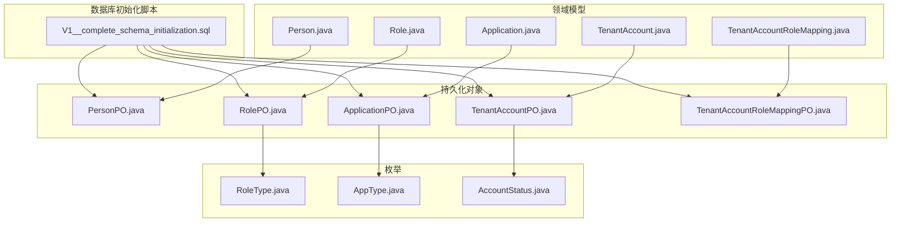
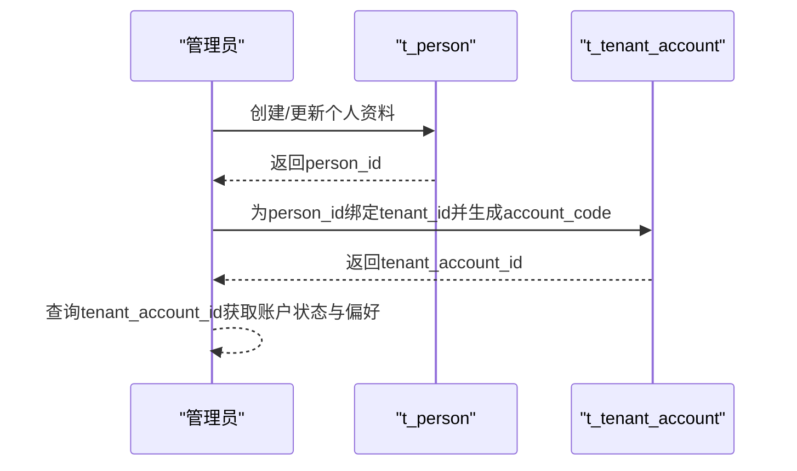
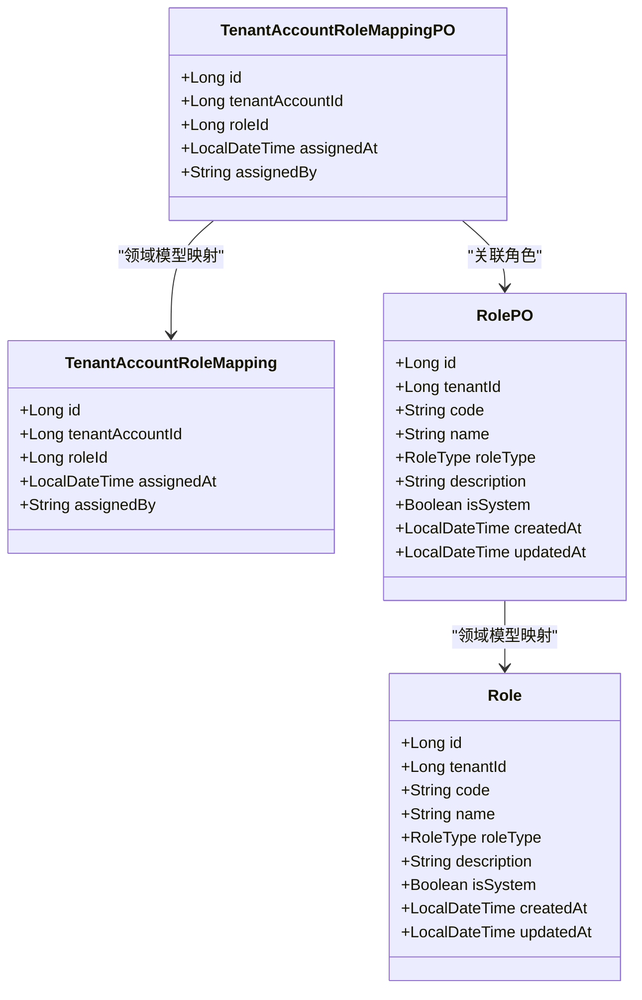
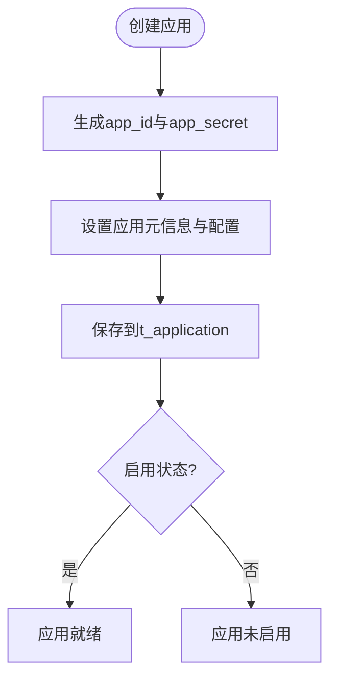
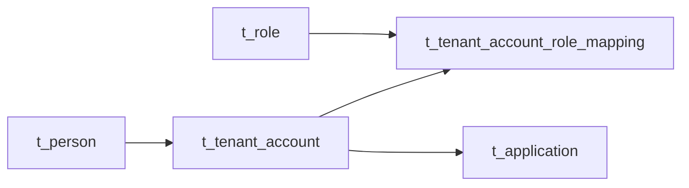

# 核心表结构

<cite>
**本文引用的文件**
- [V1__complete_schema_initialization.sql](file://iam-admin-server/src/main/resources/db/migration/V1__complete_schema_initialization.sql)
- [Person.java](file://iam-admin-server/src/main/java/iam/platform/admin/domain/model/entity/Person.java)
- [TenantAccount.java](file://iam-admin-server/src/main/java/iam/platform/admin/domain/model/entity/TenantAccount.java)
- [Role.java](file://iam-admin-server/src/main/java/iam/platform/admin/domain/model/entity/Role.java)
- [Application.java](file://iam-admin-server/src/main/java/iam/platform/admin/domain/model/entity/Application.java)
- [TenantAccountRoleMapping.java](file://iam-admin-server/src/main/java/iam/platform/admin/domain/model/entity/TenantAccountRoleMapping.java)
- [PersonPO.java](file://iam-admin-server/src/main/java/iam/platform/admin/infrastructure/persistence/entity/PersonPO.java)
- [TenantAccountPO.java](file://iam-admin-server/src/main/java/iam/platform/admin/infrastructure/persistence/entity/TenantAccountPO.java)
- [RolePO.java](file://iam-admin-server/src/main/java/iam/platform/admin/infrastructure/persistence/entity/RolePO.java)
- [ApplicationPO.java](file://iam-admin-server/src/main/java/iam/platform/admin/infrastructure/persistence/entity/ApplicationPO.java)
- [TenantAccountRoleMappingPO.java](file://iam-admin-server/src/main/java/iam/platform/admin/infrastructure/persistence/entity/TenantAccountRoleMappingPO.java)
- [RoleType.java](file://iam-common/src/main/java/iam/platform/common/model/enums/RoleType.java)
- [AppType.java](file://iam-common/src/main/java/iam/platform/common/model/enums/AppType.java)
- [AccountStatus.java](file://iam-common/src/main/java/iam/platform/common/model/enums/AccountStatus.java)
</cite>

## 目录
1. [简介](#简介)
2. [项目结构](#项目结构)
3. [核心组件](#核心组件)
4. [架构总览](#架构总览)
5. [详细组件分析](#详细组件分析)
6. [依赖分析](#依赖分析)
7. [性能考虑](#性能考虑)
8. [故障排查指南](#故障排查指南)
9. [结论](#结论)
10. [附录](#附录)

## 简介
本文件聚焦IAM平台的核心表结构，围绕用户身份模型、角色权限体系与应用管理三大部分展开，系统性梳理以下关键表的设计：t_person（个人用户表）、t_tenant_account（租户账户表）、t_role（角色表）、t_tenant_account_role_mapping（角色映射表）、t_application（应用表）。文档从字段定义、数据类型、约束条件、业务含义、索引策略与性能考量等维度进行深入解析，并通过ER关系图与类图展示核心表之间的关联关系。

## 项目结构
本次分析涉及的核心文件主要位于以下模块与路径：
- 数据库初始化脚本：iam-admin-server/src/main/resources/db/migration/V1__complete_schema_initialization.sql
- 领域模型（实体类）：iam-admin-server/src/main/java/iam/platform/admin/domain/model/entity/*.java
- 持久化对象（PO）：iam-admin-server/src/main/java/iam/platform/admin/infrastructure/persistence/entity/*.java
- 枚举类型：iam-common/src/main/java/iam/platform/common/model/enums/*.java



图表来源
- [V1__complete_schema_initialization.sql](file://iam-admin-server/src/main/resources/db/migration/V1__complete_schema_initialization.sql)
- [Person.java](file://iam-admin-server/src/main/java/iam/platform/admin/domain/model/entity/Person.java)
- [TenantAccount.java](file://iam-admin-server/src/main/java/iam/platform/admin/domain/model/entity/TenantAccount.java)
- [Role.java](file://iam-admin-server/src/main/java/iam/platform/admin/domain/model/entity/Role.java)
- [Application.java](file://iam-admin-server/src/main/java/iam/platform/admin/domain/model/entity/Application.java)
- [TenantAccountRoleMapping.java](file://iam-admin-server/src/main/java/iam/platform/admin/domain/model/entity/TenantAccountRoleMapping.java)
- [PersonPO.java](file://iam-admin-server/src/main/java/iam/platform/admin/infrastructure/persistence/entity/PersonPO.java)
- [TenantAccountPO.java](file://iam-admin-server/src/main/java/iam/platform/admin/infrastructure/persistence/entity/TenantAccountPO.java)
- [RolePO.java](file://iam-admin-server/src/main/java/iam/platform/admin/infrastructure/persistence/entity/RolePO.java)
- [ApplicationPO.java](file://iam-admin-server/src/main/java/iam/platform/admin/infrastructure/persistence/entity/ApplicationPO.java)
- [TenantAccountRoleMappingPO.java](file://iam-admin-server/src/main/java/iam/platform/admin/infrastructure/persistence/entity/TenantAccountRoleMappingPO.java)
- [RoleType.java](file://iam-common/src/main/java/iam/platform/common/model/enums/RoleType.java)
- [AppType.java](file://iam-common/src/main/java/iam/platform/common/model/enums/AppType.java)
- [AccountStatus.java](file://iam-common/src/main/java/iam/platform/common/model/enums/AccountStatus.java)

章节来源
- [V1__complete_schema_initialization.sql](file://iam-admin-server/src/main/resources/db/migration/V1__complete_schema_initialization.sql)
- [Person.java](file://iam-admin-server/src/main/java/iam/platform/admin/domain/model/entity/Person.java)
- [TenantAccount.java](file://iam-admin-server/src/main/java/iam/platform/admin/domain/model/entity/TenantAccount.java)
- [Role.java](file://iam-admin-server/src/main/java/iam/platform/admin/domain/model/entity/Role.java)
- [Application.java](file://iam-admin-server/src/main/java/iam/platform/admin/domain/model/entity/Application.java)
- [TenantAccountRoleMapping.java](file://iam-admin-server/src/main/java/iam/platform/admin/domain/model/entity/TenantAccountRoleMapping.java)
- [PersonPO.java](file://iam-admin-server/src/main/java/iam/platform/admin/infrastructure/persistence/entity/PersonPO.java)
- [TenantAccountPO.java](file://iam-admin-server/src/main/java/iam/platform/admin/infrastructure/persistence/entity/TenantAccountPO.java)
- [RolePO.java](file://iam-admin-server/src/main/java/iam/platform/admin/infrastructure/persistence/entity/RolePO.java)
- [ApplicationPO.java](file://iam-admin-server/src/main/java/iam/platform/admin/infrastructure/persistence/entity/ApplicationPO.java)
- [TenantAccountRoleMappingPO.java](file://iam-admin-server/src/main/java/iam/platform/admin/infrastructure/persistence/entity/TenantAccountRoleMappingPO.java)
- [RoleType.java](file://iam-common/src/main/java/iam/platform/common/model/enums/RoleType.java)
- [AppType.java](file://iam-common/src/main/java/iam/platform/common/model/enums/AppType.java)
- [AccountStatus.java](file://iam-common/src/main/java/iam/platform/common/model/enums/AccountStatus.java)

## 核心组件
本节对核心表进行逐项解析，涵盖字段定义、数据类型、约束条件、业务含义、索引策略与性能考量。

- t_person（个人用户表）
  - 字段与类型：主键自增id；person_code（唯一）、username（唯一）、email（唯一，可空）、phone（唯一，可空）、password_hash、email_verified、phone_verified、nickname、avatar_url、enabled、account_locked、last_login_at、created_at、updated_at。
  - 约束与注释：唯一索引覆盖person_code、username、email、phone；触发器自动更新updated_at；注释明确“全局身份”属性。
  - 业务含义：承载全局唯一自然人身份，支持多租户内的账户绑定。
  - 索引策略：uk_person_code、uk_person_username、uk_person_email、uk_person_phone。
  - 性能考量：email与phone为可空时，需注意部分数据库对可空唯一索引的差异；建议在高并发写入场景下控制重复注册的幂等校验。

- t_tenant_account（租户账户表）
  - 字段与类型：主键自增id；person_id（外键到t_person）、tenant_id（外键到t_tenant）、account_code（租户内唯一）、employee_no（租户内唯一）、status（默认ACTIVE）、joined_at、left_at、preferred_language（默认zh-CN）、timezone（默认Asia/Shanghai）、created_at、updated_at。
  - 约束与注释：uk_tenant_account_code（tenant_id, account_code）；uk_tenant_employee_no（tenant_id, employee_no）；索引idx_tenant_account_person_id、idx_tenant_account_tenant_id、idx_tenant_account_status；触发器自动更新updated_at。
  - 业务含义：记录个人在特定租户内的账户状态与偏好，支持员工编号与账户状态管理。
  - 索引策略：按person_id、tenant_id、status建立索引以支撑查询与状态统计。
  - 性能考量：status字段常用于过滤活跃用户，建议结合业务查询模式评估是否需要复合索引优化。

- t_role（角色表）
  - 字段与类型：主键自增id；code（唯一）、name、description、tenant_id（可空，为空表示全局角色）、role_type（默认SYSTEM）、is_system（默认FALSE）、created_at、updated_at。
  - 约束与注释：唯一索引idx_role_tenant_id；触发器自动更新updated_at；注释明确role_type取值与is_system语义。
  - 业务含义：统一管理全局与租户级角色，支持系统内置与租户自定义角色区分。
  - 索引策略：tenant_id用于按租户筛选角色。
  - 性能考量：role_type与is_system可用于快速识别系统角色，减少额外查询。

- t_tenant_account_role_mapping（角色映射表）
  - 字段与类型：主键自增id；tenant_account_id（外键到t_tenant_account）、role_id（外键到t_role）、assigned_at（默认当前时间）、assigned_by。
  - 约束与注释：uk_tenant_account_role（tenant_account_id, role_id）；索引idx_ta_role_mapping_tenant_account、idx_ta_role_mapping_role。
  - 业务含义：建立租户账户与角色的多对多映射关系，记录角色分配时间与经办人。
  - 索引策略：分别按tenant_account_id与role_id建立索引，便于按账户或角色查询映射。
  - 性能考量：分配/撤销角色操作频繁时，建议关注唯一约束带来的插入冲突处理成本。

- t_application（应用表）
  - 字段与类型：主键自增id；app_id（唯一）、app_secret（加密存储）、app_name、tenant_id（可空，为空表示全局应用）、app_type（默认WEB）、description、logo_url、status（默认ACTIVE）、home_page_url、callback_urls、post_logout_redirect_uris、allowed_scopes、require_proof_key（默认FALSE）、require_authorization_consent（默认TRUE）、access_token_ttl_seconds（默认3600）、refresh_token_ttl_seconds（默认86400）、enabled（默认TRUE）、created_at、updated_at。
  - 约束与注释：唯一索引uk_application_app_id；索引idx_application_tenant_id、idx_application_status、idx_application_app_type；触发器自动更新updated_at。
  - 业务含义：统一管理OAuth2/OIDC客户端（现升级为应用），支持回调地址、授权范围、令牌有效期等配置。
  - 索引策略：按tenant_id、status、app_type建立索引，支撑应用检索与状态统计。
  - 性能考量：app_secret采用加密转换器存储，避免明文泄露；令牌TTL参数直接影响会话生命周期与刷新频率。

章节来源
- [V1__complete_schema_initialization.sql](file://iam-admin-server/src/main/resources/db/migration/V1__complete_schema_initialization.sql)
- [PersonPO.java](file://iam-admin-server/src/main/java/iam/platform/admin/infrastructure/persistence/entity/PersonPO.java)
- [TenantAccountPO.java](file://iam-admin-server/src/main/java/iam/platform/admin/infrastructure/persistence/entity/TenantAccountPO.java)
- [RolePO.java](file://iam-admin-server/src/main/java/iam/platform/admin/infrastructure/persistence/entity/RolePO.java)
- [ApplicationPO.java](file://iam-admin-server/src/main/java/iam/platform/admin/infrastructure/persistence/entity/ApplicationPO.java)
- [TenantAccountRoleMappingPO.java](file://iam-admin-server/src/main/java/iam/platform/admin/infrastructure/persistence/entity/TenantAccountRoleMappingPO.java)

## 架构总览
下图展示核心表之间的ER关系，体现用户身份模型、角色权限与应用管理的关键关联。

```mermaid
erDiagram
T_PERSON {
bigint id PK
varchar person_code UK
varchar username UK
varchar email UK
varchar phone UK
varchar password_hash
boolean email_verified
boolean phone_verified
varchar nickname
varchar avatar_url
boolean enabled
boolean account_locked
timestamp last_login_at
timestamp created_at
timestamp updated_at
}
T_TENANT_ACCOUNT {
bigint id PK
bigint person_id FK
bigint tenant_id FK
varchar account_code
varchar employee_no
varchar status
timestamp joined_at
timestamp left_at
varchar preferred_language
varchar timezone
timestamp created_at
timestamp updated_at
}
T_ROLE {
bigint id PK
bigint tenant_id
varchar code UK
varchar name
varchar description
varchar role_type
boolean is_system
timestamp created_at
timestamp updated_at
}
T_TENANT_ACCOUNT_ROLE_MAPPING {
bigint id PK
bigint tenant_account_id FK
bigint role_id FK
timestamp assigned_at
varchar assigned_by
}
T_APPLICATION {
bigint id PK
varchar app_id UK
varchar app_secret
varchar app_name
bigint tenant_id
varchar app_type
varchar description
varchar logo_url
varchar status
varchar home_page_url
varchar callback_urls
varchar post_logout_redirect_uris
varchar allowed_scopes
boolean require_proof_key
boolean require_authorization_consent
integer access_token_ttl_seconds
integer refresh_token_ttl_seconds
boolean enabled
timestamp created_at
timestamp updated_at
}
T_TENANT_ACCOUNT }o--|| T_PERSON : "属于"
T_TENANT_ACCOUNT }o--|| T_ROLE : "拥有角色(通过映射)"
T_TENANT_ACCOUNT }o--o|| T_APPLICATION : "可访问(通过权限)"
T_TENANT_ACCOUNT_ROLE_MAPPING }o--|| T_TENANT_ACCOUNT : "映射"
T_TENANT_ACCOUNT_ROLE_MAPPING }o--|| T_ROLE : "映射"
```

图表来源
- [V1__complete_schema_initialization.sql](file://iam-admin-server/src/main/resources/db/migration/V1__complete_schema_initialization.sql)

## 详细组件分析

### 用户身份模型表（t_person 与 t_tenant_account）
- 设计要点
  - t_person提供全局唯一身份标识（person_code、username），并维护基础个人资料与安全状态。
  - t_tenant_account将全局身份与租户绑定，形成“人在租户内”的账户视图，支持状态、加入/离开时间与语言时区偏好。
- 关联关系
  - t_tenant_account.person_id → t_person.id
  - t_tenant_account.tenant_id → t_tenant.id（由初始化脚本中t_tenant定义）
- 业务流程示意



图表来源
- [V1__complete_schema_initialization.sql](file://iam-admin-server/src/main/resources/db/migration/V1__complete_schema_initialization.sql)

章节来源
- [V1__complete_schema_initialization.sql](file://iam-admin-server/src/main/resources/db/migration/V1__complete_schema_initialization.sql)
- [Person.java](file://iam-admin-server/src/main/java/iam/platform/admin/domain/model/entity/Person.java)
- [TenantAccount.java](file://iam-admin-server/src/main/java/iam/platform/admin/domain/model/entity/TenantAccount.java)
- [PersonPO.java](file://iam-admin-server/src/main/java/iam/platform/admin/infrastructure/persistence/entity/PersonPO.java)
- [TenantAccountPO.java](file://iam-admin-server/src/main/java/iam/platform/admin/infrastructure/persistence/entity/TenantAccountPO.java)

### 角色权限表（t_role 与 t_tenant_account_role_mapping）
- 设计要点
  - t_role支持全局角色与租户自定义角色，通过tenant_id与role_type区分；is_system标记系统内置角色。
  - t_tenant_account_role_mapping建立租户账户与角色的多对多映射，记录分配时间与经办人。
- 关联关系
  - t_tenant_account_role_mapping.tenant_account_id → t_tenant_account.id
  - t_tenant_account_role_mapping.role_id → t_role.id
- 类关系示意



图表来源
- [Role.java](file://iam-admin-server/src/main/java/iam/platform/admin/domain/model/entity/Role.java)
- [TenantAccountRoleMapping.java](file://iam-admin-server/src/main/java/iam/platform/admin/domain/model/entity/TenantAccountRoleMapping.java)
- [RolePO.java](file://iam-admin-server/src/main/java/iam/platform/admin/infrastructure/persistence/entity/RolePO.java)
- [TenantAccountRoleMappingPO.java](file://iam-admin-server/src/main/java/iam/platform/admin/infrastructure/persistence/entity/TenantAccountRoleMappingPO.java)
- [RoleType.java](file://iam-common/src/main/java/iam/platform/common/model/enums/RoleType.java)

章节来源
- [V1__complete_schema_initialization.sql](file://iam-admin-server/src/main/resources/db/migration/V1__complete_schema_initialization.sql)
- [Role.java](file://iam-admin-server/src/main/java/iam/platform/admin/domain/model/entity/Role.java)
- [TenantAccountRoleMapping.java](file://iam-admin-server/src/main/java/iam/platform/admin/domain/model/entity/TenantAccountRoleMapping.java)
- [RolePO.java](file://iam-admin-server/src/main/java/iam/platform/admin/infrastructure/persistence/entity/RolePO.java)
- [TenantAccountRoleMappingPO.java](file://iam-admin-server/src/main/java/iam/platform/admin/infrastructure/persistence/entity/TenantAccountRoleMappingPO.java)
- [RoleType.java](file://iam-common/src/main/java/iam/platform/common/model/enums/RoleType.java)

### 应用管理表（t_application）
- 设计要点
  - t_application承载OAuth2/OIDC客户端能力，支持回调地址、授权范围、令牌有效期、是否要求PKCE与授权同意等配置。
  - app_id唯一，tenant_id为空表示全局应用；status与enabled共同控制应用可用性。
- 关联关系
  - t_application.tenant_id → t_tenant.id（由初始化脚本中t_tenant定义）
- 流程示意



图表来源
- [V1__complete_schema_initialization.sql](file://iam-admin-server/src/main/resources/db/migration/V1__complete_schema_initialization.sql)
- [Application.java](file://iam-admin-server/src/main/java/iam/platform/admin/domain/model/entity/Application.java)
- [ApplicationPO.java](file://iam-admin-server/src/main/java/iam/platform/admin/infrastructure/persistence/entity/ApplicationPO.java)
- [AppType.java](file://iam-common/src/main/java/iam/platform/common/model/enums/AppType.java)

章节来源
- [V1__complete_schema_initialization.sql](file://iam-admin-server/src/main/resources/db/migration/V1__complete_schema_initialization.sql)
- [Application.java](file://iam-admin-server/src/main/java/iam/platform/admin/domain/model/entity/Application.java)
- [ApplicationPO.java](file://iam-admin-server/src/main/java/iam/platform/admin/infrastructure/persistence/entity/ApplicationPO.java)
- [AppType.java](file://iam-common/src/main/java/iam/platform/common/model/enums/AppType.java)

## 依赖分析
- 外键与引用完整性
  - t_tenant_account.person_id → t_person.id
  - t_tenant_account.tenant_id → t_tenant.id
  - t_tenant_account_role_mapping.tenant_account_id → t_tenant_account.id
  - t_tenant_account_role_mapping.role_id → t_role.id
  - t_application.tenant_id → t_tenant.id
- 唯一性与索引
  - t_person：uk_person_code、uk_person_username、uk_person_email、uk_person_phone
  - t_tenant_account：uk_tenant_account_code、uk_tenant_employee_no
  - t_role：uk_role_code（通过code唯一）
  - t_application：uk_application_app_id
  - t_tenant_account_role_mapping：uk_tenant_account_role
- 性能与扩展
  - 脚本中为高频查询字段建立索引，如idx_tenant_account_status、idx_application_status、idx_application_app_type等。
  - 触发器统一维护updated_at，确保审计与排序一致性。



图表来源
- [V1__complete_schema_initialization.sql](file://iam-admin-server/src/main/resources/db/migration/V1__complete_schema_initialization.sql)

章节来源
- [V1__complete_schema_initialization.sql](file://iam-admin-server/src/main/resources/db/migration/V1__complete_schema_initialization.sql)

## 性能考虑
- 索引策略
  - 按业务查询热点建立索引：t_tenant_account.status、t_application.status、t_application.app_type等。
  - 对于可空唯一索引（email、phone），需关注不同数据库的实现差异与查询计划。
- 写入与并发
  - 唯一约束（如account_code、employee_no）可能引发插入冲突，应结合业务做好幂等与重试策略。
  - 角色分配（t_tenant_account_role_mapping）频繁场景下，建议评估批量插入与事务粒度。
- 存储与加密
  - app_secret采用加密转换器存储，避免明文泄露风险；定期轮换密钥并清理历史版本。
- 时间戳与审计
  - 全局触发器维护updated_at，有利于排序与审计，但需关注触发器开销与DDL变更影响。

## 故障排查指南
- 常见问题与定位
  - 无法登录：检查t_person.enabled与account_locked状态；核对t_tenant_account.status与left_at。
  - 角色不生效：确认t_tenant_account_role_mapping是否存在对应映射；核对角色是否被撤销或过期。
  - 应用回调失败：核对t_application.callback_urls与请求中的redirect_uri是否匹配；检查require_proof_key与require_authorization_consent配置。
  - 密钥轮换后鉴权失败：确认新密钥已正确写入且未被缓存旧值。
- 审计与诊断
  - 利用t_audit_log的索引组合（tenant_id、event_category、created_at）进行事件检索与统计。
  - 使用cleanup_old_audit_logs函数清理过期日志，避免表膨胀影响查询性能。

章节来源
- [V1__complete_schema_initialization.sql](file://iam-admin-server/src/main/resources/db/migration/V1__complete_schema_initialization.sql)

## 结论
本文基于数据库初始化脚本与领域/持久化模型，系统梳理了IAM平台核心表结构：t_person与t_tenant_account构成多租户身份模型的基础；t_role与t_tenant_account_role_mapping实现灵活的角色授权；t_application承载应用级配置与安全策略。通过合理的索引与约束设计，配合统一的时间戳维护与加密存储策略，平台在保证安全性的同时兼顾了查询效率与扩展性。

## 附录
- 字段与索引速查
  - t_person：唯一索引（person_code、username、email、phone）；触发器维护updated_at。
  - t_tenant_account：唯一索引（tenant_id, account_code）、（tenant_id, employee_no）；索引（person_id、tenant_id、status）。
  - t_role：唯一索引（code）；索引（tenant_id）。
  - t_tenant_account_role_mapping：唯一索引（tenant_account_id, role_id）；索引（tenant_account_id、role_id）。
  - t_application：唯一索引（app_id）；索引（tenant_id、status、app_type）。
- 枚举类型参考
  - RoleType：SYSTEM、TENANT_CUSTOM
  - AppType：WEB、MOBILE、API、THIRD_PARTY
  - AccountStatus：ACTIVE、SUSPENDED、LEFT