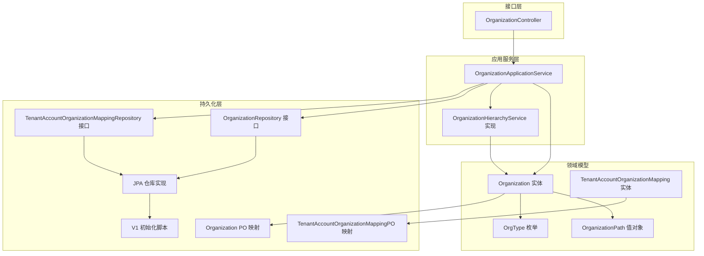
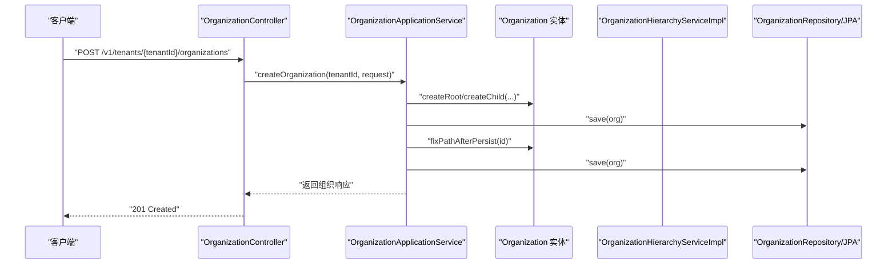
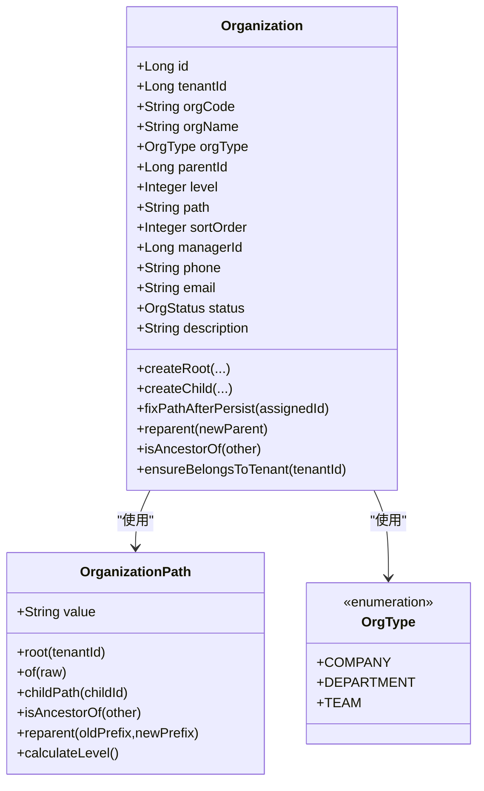
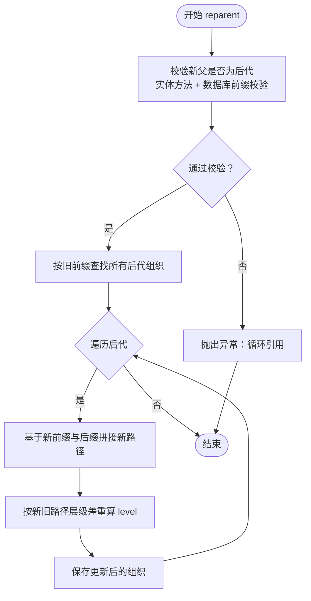
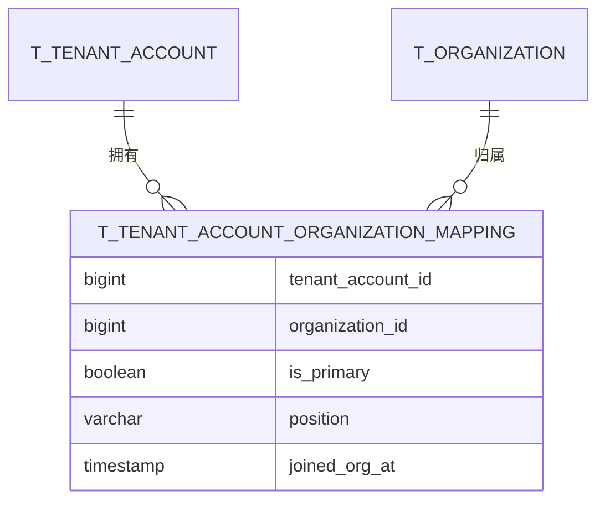
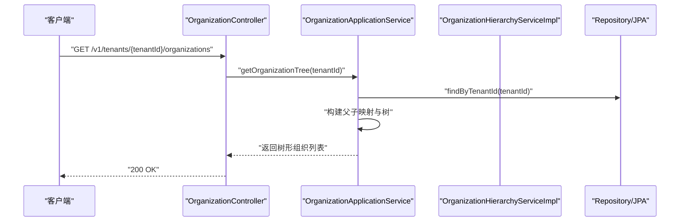
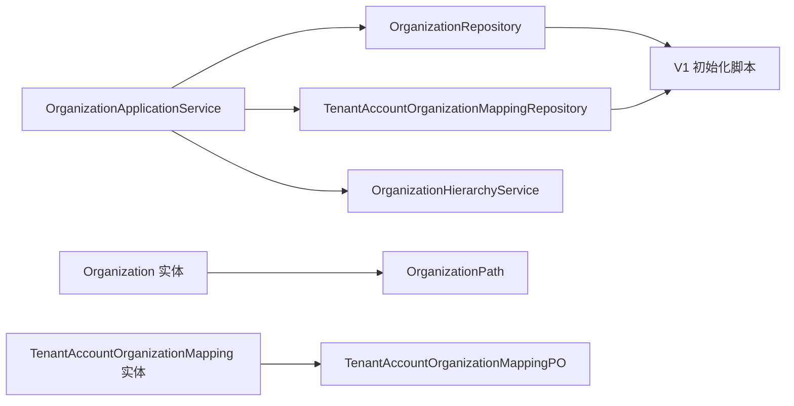

# 组织管理表

<cite>
**本文引用的文件**
- [Organization.java](file://iam-admin-server/src/main/java/iam/platform/admin/domain/model/entity/Organization.java)
- [TenantAccountOrganizationMapping.java](file://iam-admin-server/src/main/java/iam/platform/admin/domain/model/entity/TenantAccountOrganizationMapping.java)
- [OrganizationRepository.java](file://iam-admin-server/src/main/java/iam/platform/admin/domain/repository/OrganizationRepository.java)
- [TenantAccountOrganizationMappingRepository.java](file://iam-admin-server/src/main/java/iam/platform/admin/domain/repository/TenantAccountOrganizationMappingRepository.java)
- [OrganizationApplicationService.java](file://iam-admin-server/src/main/java/iam/platform/admin/application/service/OrganizationApplicationService.java)
- [OrganizationHierarchyService.java](file://iam-admin-server/src/main/java/iam/platform/admin/domain/service/OrganizationHierarchyService.java)
- [OrganizationHierarchyServiceImpl.java](file://iam-admin-server/src/main/java/iam/platform/admin/domain/service/impl/OrganizationHierarchyServiceImpl.java)
- [OrganizationPath.java](file://iam-common/src/main/java/iam/platform/common/model/valueobject/OrganizationPath.java)
- [OrgType.java](file://iam-common/src/main/java/iam/platform/common/model/enums/OrgType.java)
- [V1__complete_schema_initialization.sql](file://iam-admin-server/src/main/resources/db/migration/V1__complete_schema_initialization.sql)
- [CreateOrganizationRequest.java](file://iam-common/src/main/java/iam/platform/common/dto/request/CreateOrganizationRequest.java)
- [OrganizationResponse.java](file://iam-common/src/main/java/iam/platform/common/dto/response/OrganizationResponse.java)
- [OrganizationController.java](file://iam-admin-server/src/main/java/iam/platform/admin/interfaces/rest/OrganizationController.java)
- [TenantAccountOrganizationMappingPO.java](file://iam-admin-server/src/main/java/iam/platform/admin/infrastructure/persistence/entity/TenantAccountOrganizationMappingPO.java)
- [TenantAccountOrganizationMappingJpaRepository.java](file://iam-admin-server/src/main/java/iam/platform/admin/infrastructure/persistence/repository/TenantAccountOrganizationMappingJpaRepository.java)
</cite>

## 目录
1. [简介](#简介)
2. [项目结构](#项目结构)
3. [核心组件](#核心组件)
4. [架构总览](#架构总览)
5. [详细组件分析](#详细组件分析)
6. [依赖分析](#依赖分析)
7. [性能考量](#性能考量)
8. [故障排查指南](#故障排查指南)
9. [结论](#结论)
10. [附录](#附录)

## 简介
本文件聚焦IAM平台的组织管理表结构与实现，系统性阐述以下主题：
- t_organization（组织表）的树形结构设计、层级管理与路径计算
- t_tenant_account_organization_mapping（组织映射表）的用户-组织关联机制
- 组织类型分类（COMPANY/DEPARTMENT/TEAM）
- 父子关系维护、材料化路径算法与层级查询优化
- 组织管理最佳实践：架构设计原则、用户归属管理、权限继承规则
- 组织树构建示例、层级查询SQL与组织变更的事务处理策略

## 项目结构
围绕组织管理的关键代码分布在以下层次：
- 领域模型与值对象：组织实体、映射实体、组织路径值对象、组织类型枚举
- 应用服务：组织应用服务封装业务流程（创建、更新、删除、激活/停用、树构建）
- 领域服务：组织层级服务负责跨实体的层级约束校验与批量路径更新
- 持久化层：JPA仓库接口与PO映射，数据库初始化脚本定义表结构与索引
- 接口层：REST控制器提供组织管理API

图表来源
- [OrganizationController.java:1-84](file://iam-admin-server/src/main/java/iam/platform/admin/interfaces/rest/OrganizationController.java#L1-L84)
- [OrganizationApplicationService.java:1-191](file://iam-admin-server/src/main/java/iam/platform/admin/application/service/OrganizationApplicationService.java#L1-L191)
- [OrganizationHierarchyServiceImpl.java:1-73](file://iam-admin-server/src/main/java/iam/platform/admin/domain/service/impl/OrganizationHierarchyServiceImpl.java#L1-L73)
- [Organization.java:1-217](file://iam-admin-server/src/main/java/iam/platform/admin/domain/model/entity/Organization.java#L1-L217)
- [TenantAccountOrganizationMapping.java:1-22](file://iam-admin-server/src/main/java/iam/platform/admin/domain/model/entity/TenantAccountOrganizationMapping.java#L1-L22)
- [OrganizationPath.java:1-93](file://iam-common/src/main/java/iam/platform/common/model/valueobject/OrganizationPath.java#L1-L93)
- [OrgType.java:1-6](file://iam-common/src/main/java/iam/platform/common/model/enums/OrgType.java#L1-L6)
- [OrganizationRepository.java:1-25](file://iam-admin-server/src/main/java/iam/platform/admin/domain/repository/OrganizationRepository.java#L1-L25)
- [TenantAccountOrganizationMappingRepository.java:1-28](file://iam-admin-server/src/main/java/iam/platform/admin/domain/repository/TenantAccountOrganizationMappingRepository.java#L1-L28)
- [TenantAccountOrganizationMappingPO.java:1-54](file://iam-admin-server/src/main/java/iam/platform/admin/infrastructure/persistence/entity/TenantAccountOrganizationMappingPO.java#L1-L54)
- [TenantAccountOrganizationMappingJpaRepository.java:1-26](file://iam-admin-server/src/main/java/iam/platform/admin/infrastructure/persistence/repository/TenantAccountOrganizationMappingJpaRepository.java#L1-L26)
- [V1__complete_schema_initialization.sql:277-344](file://iam-admin-server/src/main/resources/db/migration/V1__complete_schema_initialization.sql#L277-L344)

章节来源
- [OrganizationController.java:1-84](file://iam-admin-server/src/main/java/iam/platform/admin/interfaces/rest/OrganizationController.java#L1-L84)
- [OrganizationApplicationService.java:1-191](file://iam-admin-server/src/main/java/iam/platform/admin/application/service/OrganizationApplicationService.java#L1-L191)
- [V1__complete_schema_initialization.sql:277-344](file://iam-admin-server/src/main/resources/db/migration/V1__complete_schema_initialization.sql#L277-L344)

## 核心组件
- t_organization（组织表）
  - 关键字段：tenant_id、org_code、org_name、org_type、parent_id、level、path、sort_order、manager_id、status、description
  - 约束：每租户内组织编码唯一；路径字段存储材料化路径；包含多类索引支持层级查询与排序
- t_tenant_account_organization_mapping（组织映射表）
  - 关键字段：tenant_account_id、organization_id、is_primary、position、joined_org_at
  - 约束：用户-组织唯一；每个租户账户仅能有一个主组织；索引覆盖用户与组织维度
- 组织实体与值对象
  - Organization：封装组织树操作（创建根/子节点、修复路径、重父、状态变更、祖先判断等）
  - OrganizationPath：封装路径值对象，提供根路径构造、子路径拼接、祖先判断、重父前缀替换、层级计算
  - OrgType：组织类型枚举（COMPANY/DEPARTMENT/TEAM）

章节来源
- [Organization.java:1-217](file://iam-admin-server/src/main/java/iam/platform/admin/domain/model/entity/Organization.java#L1-L217)
- [OrganizationPath.java:1-93](file://iam-common/src/main/java/iam/platform/common/model/valueobject/OrganizationPath.java#L1-L93)
- [OrgType.java:1-6](file://iam-common/src/main/java/iam/platform/common/model/enums/OrgType.java#L1-L6)
- [V1__complete_schema_initialization.sql:277-344](file://iam-admin-server/src/main/resources/db/migration/V1__complete_schema_initialization.sql#L277-L344)

## 架构总览
组织管理采用分层架构：
- 控制器接收请求，调用应用服务
- 应用服务编排业务流程，调用领域实体与领域服务
- 领域服务执行跨实体的层级校验与批量路径更新
- 仓储接口与JPA实现访问数据库，初始化脚本定义表结构与索引

图表来源
- [OrganizationController.java:33-40](file://iam-admin-server/src/main/java/iam/platform/admin/interfaces/rest/OrganizationController.java#L33-L40)
- [OrganizationApplicationService.java:32-66](file://iam-admin-server/src/main/java/iam/platform/admin/application/service/OrganizationApplicationService.java#L32-L66)
- [Organization.java:105-117](file://iam-admin-server/src/main/java/iam/platform/admin/domain/model/entity/Organization.java#L105-L117)
- [OrganizationRepository.java:9-11](file://iam-admin-server/src/main/java/iam/platform/admin/domain/repository/OrganizationRepository.java#L9-L11)

## 详细组件分析

### 组织实体与材料化路径
- 创建根组织：设置level=0，path为“/{tenantId}”
- 创建子组织：level=父级+1，path暂存父path，保存后立即修复为“{parentPath}/{id}”
- 重父逻辑：校验新父属于同租户且非自身后代；更新parentId/level/path
- 路径值对象：提供root/of/childPath/isAncestorOf/reparent/calculateLevel等方法
- 层级查询：通过path前缀匹配与level字段索引进行高效查询

图表来源
- [Organization.java:1-217](file://iam-admin-server/src/main/java/iam/platform/admin/domain/model/entity/Organization.java#L1-L217)
- [OrganizationPath.java:1-93](file://iam-common/src/main/java/iam/platform/common/model/valueobject/OrganizationPath.java#L1-L93)
- [OrgType.java:1-6](file://iam-common/src/main/java/iam/platform/common/model/enums/OrgType.java#L1-L6)

章节来源
- [Organization.java:36-135](file://iam-admin-server/src/main/java/iam/platform/admin/domain/model/entity/Organization.java#L36-L135)
- [OrganizationPath.java:25-86](file://iam-common/src/main/java/iam/platform/common/model/valueobject/OrganizationPath.java#L25-L86)

### 组织层级服务与路径批量更新
- 校验约束：禁止将组织移动到其自身后代（双重校验：实体方法+数据库前缀校验）
- 批量更新：根据旧前缀定位所有后代，逐个替换前缀生成新路径，并重新计算level

图表来源
- [OrganizationHierarchyServiceImpl.java:19-71](file://iam-admin-server/src/main/java/iam/platform/admin/domain/service/impl/OrganizationHierarchyServiceImpl.java#L19-L71)
- [OrganizationRepository.java:17-17](file://iam-admin-server/src/main/java/iam/platform/admin/domain/repository/OrganizationRepository.java#L17-L17)

章节来源
- [OrganizationHierarchyService.java:1-34](file://iam-admin-server/src/main/java/iam/platform/admin/domain/service/OrganizationHierarchyService.java#L1-L34)
- [OrganizationHierarchyServiceImpl.java:19-71](file://iam-admin-server/src/main/java/iam/platform/admin/domain/service/impl/OrganizationHierarchyServiceImpl.java#L19-L71)

### 用户-组织映射与主组织约束
- 映射实体：tenant_account_id、organization_id、is_primary、position、joined_org_at
- 约束：用户-组织唯一；每个租户账户仅一个主组织（数据库唯一索引uk_ta_org_mapping_primary）
- 查询：按用户或组织维度查询映射记录，支持删除清理

图表来源
- [V1__complete_schema_initialization.sql:321-344](file://iam-admin-server/src/main/resources/db/migration/V1__complete_schema_initialization.sql#L321-L344)
- [TenantAccountOrganizationMappingPO.java:1-54](file://iam-admin-server/src/main/java/iam/platform/admin/infrastructure/persistence/entity/TenantAccountOrganizationMappingPO.java#L1-L54)
- [TenantAccountOrganizationMappingJpaRepository.java:1-26](file://iam-admin-server/src/main/java/iam/platform/admin/infrastructure/persistence/repository/TenantAccountOrganizationMappingJpaRepository.java#L1-L26)

章节来源
- [TenantAccountOrganizationMapping.java:1-22](file://iam-admin-server/src/main/java/iam/platform/admin/domain/model/entity/TenantAccountOrganizationMapping.java#L1-L22)
- [TenantAccountOrganizationMappingRepository.java:1-28](file://iam-admin-server/src/main/java/iam/platform/admin/domain/repository/TenantAccountOrganizationMappingRepository.java#L1-L28)
- [V1__complete_schema_initialization.sql:321-344](file://iam-admin-server/src/main/resources/db/migration/V1__complete_schema_initialization.sql#L321-L344)

### 应用服务与API交互
- 创建组织：校验编码唯一，选择根或子节点创建，保存后修复路径
- 更新组织：属性更新、可选重父、触发批量路径更新
- 删除/激活/停用：租户所有权校验，删除前检查是否有子组织
- 组织树：按租户加载全量组织，构建树形结构返回

图表来源
- [OrganizationController.java:78-82](file://iam-admin-server/src/main/java/iam/platform/admin/interfaces/rest/OrganizationController.java#L78-L82)
- [OrganizationApplicationService.java:153-177](file://iam-admin-server/src/main/java/iam/platform/admin/application/service/OrganizationApplicationService.java#L153-L177)
- [OrganizationRepository.java:13-13](file://iam-admin-server/src/main/java/iam/platform/admin/domain/repository/OrganizationRepository.java#L13-L13)

章节来源
- [OrganizationApplicationService.java:32-177](file://iam-admin-server/src/main/java/iam/platform/admin/application/service/OrganizationApplicationService.java#L32-L177)
- [OrganizationController.java:33-82](file://iam-admin-server/src/main/java/iam/platform/admin/interfaces/rest/OrganizationController.java#L33-L82)

## 依赖分析
- 组件耦合
  - OrganizationApplicationService依赖OrganizationRepository与OrganizationHierarchyService，体现清晰的职责分离
  - Organization实体强依赖OrganizationPath值对象，确保路径一致性
  - 映射实体与PO分别对应领域模型与持久化模型，通过JPA仓库解耦
- 外部依赖
  - 初始化脚本定义表结构、索引与约束，支撑高性能层级查询与唯一性保证
  - DTO用于API输入输出，隔离领域模型细节

图表来源
- [OrganizationApplicationService.java:29-30](file://iam-admin-server/src/main/java/iam/platform/admin/application/service/OrganizationApplicationService.java#L29-L30)
- [OrganizationRepository.java:1-25](file://iam-admin-server/src/main/java/iam/platform/admin/domain/repository/OrganizationRepository.java#L1-L25)
- [TenantAccountOrganizationMappingRepository.java:1-28](file://iam-admin-server/src/main/java/iam/platform/admin/domain/repository/TenantAccountOrganizationMappingRepository.java#L1-L28)
- [Organization.java:1-217](file://iam-admin-server/src/main/java/iam/platform/admin/domain/model/entity/Organization.java#L1-L217)
- [TenantAccountOrganizationMapping.java:1-22](file://iam-admin-server/src/main/java/iam/platform/admin/domain/model/entity/TenantAccountOrganizationMapping.java#L1-L22)
- [V1__complete_schema_initialization.sql:277-344](file://iam-admin-server/src/main/resources/db/migration/V1__complete_schema_initialization.sql#L277-L344)

章节来源
- [OrganizationApplicationService.java:1-191](file://iam-admin-server/src/main/java/iam/platform/admin/application/service/OrganizationApplicationService.java#L1-L191)
- [OrganizationRepository.java:1-25](file://iam-admin-server/src/main/java/iam/platform/admin/domain/repository/OrganizationRepository.java#L1-L25)
- [TenantAccountOrganizationMappingRepository.java:1-28](file://iam-admin-server/src/main/java/iam/platform/admin/domain/repository/TenantAccountOrganizationMappingRepository.java#L1-L28)
- [V1__complete_schema_initialization.sql:277-344](file://iam-admin-server/src/main/resources/db/migration/V1__complete_schema_initialization.sql#L277-L344)

## 性能考量
- 材料化路径的优势
  - 路径前缀匹配支持快速祖先/后代判定与层级查询
  - level字段与path索引配合，避免递归查询开销
- 索引策略
  - t_organization：path、level、parent_id、manager_id、tenant_id等索引
  - t_tenant_account_organization_mapping：用户与组织维度索引，主组织唯一索引
- 批量更新成本
  - reparent后对所有后代执行批量路径更新，建议在低频变更场景或批处理窗口执行
- 查询优化建议
  - 使用path前缀查询时，尽量结合tenant_id与sort_order以减少扫描范围
  - 树构建时先按parent_id分组，再递归组装，避免N+1查询

## 故障排查指南
- 组织编码冲突
  - 现象：创建失败提示编码已存在
  - 排查：确认租户维度下org_code唯一约束；检查是否存在历史软删除记录
- 循环引用错误
  - 现象：重父时报错“不能移动到其后代”
  - 排查：检查目标父节点是否为当前组织的祖先；确认路径前缀校验逻辑
- 删除失败
  - 现象：删除报错“存在子组织”
  - 排查：先迁移或删除子组织，再执行删除
- 主组织重复
  - 现象：插入映射时报唯一约束冲突
  - 排查：确认同一租户账户仅有一个is_primary=true的记录

章节来源
- [OrganizationApplicationService.java:36-39](file://iam-admin-server/src/main/java/iam/platform/admin/application/service/OrganizationApplicationService.java#L36-L39)
- [OrganizationHierarchyServiceImpl.java:20-33](file://iam-admin-server/src/main/java/iam/platform/admin/domain/service/impl/OrganizationHierarchyServiceImpl.java#L20-L33)
- [OrganizationApplicationService.java:122-125](file://iam-admin-server/src/main/java/iam/platform/admin/application/service/OrganizationApplicationService.java#L122-L125)
- [V1__complete_schema_initialization.sql:336-340](file://iam-admin-server/src/main/resources/db/migration/V1__complete_schema_initialization.sql#L336-L340)

## 结论
本方案通过材料化路径与层级字段，实现了高效的组织树存储与查询；通过领域服务统一处理重父约束与批量路径更新，保障了数据一致性；通过映射表与唯一约束，清晰表达了用户-组织的多对多关系及主组织语义。配合完善的索引与事务策略，可在高并发场景下稳定运行。

## 附录

### 组织类型分类与最佳实践
- 类型定义：COMPANY（公司）、DEPARTMENT（部门）、TEAM（团队）
- 设计原则
  - 优先使用DEPARTMENT作为租户内主要层级，TEAM用于更细粒度团队划分
  - 合理设置sort_order以控制同级展示顺序
  - 严格遵循租户边界，避免跨租户组织引用
- 用户归属管理
  - 每个租户账户仅能有一个主组织，用于默认上下文与权限继承
  - 副属组织可记录position信息，便于多组织场景下的角色定位
- 权限继承规则
  - 建议以组织树作为权限作用域的上界，结合角色与资源权限进行组合授权
  - 对于全局权限，应明确标注并限制使用范围

章节来源
- [OrgType.java:1-6](file://iam-common/src/main/java/iam/platform/common/model/enums/OrgType.java#L1-L6)
- [V1__complete_schema_initialization.sql:313-313](file://iam-admin-server/src/main/resources/db/migration/V1__complete_schema_initialization.sql#L313-L313)

### 组织树构建示例与层级查询SQL
- 组织树构建
  - 先按租户加载全部组织，按parentId分组，根节点parentId为null或-1，递归组装children
  - 参考路径：[组织树构建逻辑:158-177](file://iam-admin-server/src/main/java/iam/platform/admin/application/service/OrganizationApplicationService.java#L158-L177)
- 层级查询SQL
  - 获取某组织的所有后代：基于path前缀匹配（如where path like '/{tenantId}/{orgId}/%')
  - 获取某组织的直接子组织：where parent_id = {orgId}
  - 获取某租户的根组织：where tenant_id = {tenantId} and parent_id is null
  - 参考索引与注释：[t_organization索引与注释:299-320](file://iam-admin-server/src/main/resources/db/migration/V1__complete_schema_initialization.sql#L299-L320)

章节来源
- [OrganizationApplicationService.java:153-177](file://iam-admin-server/src/main/java/iam/platform/admin/application/service/OrganizationApplicationService.java#L153-L177)
- [V1__complete_schema_initialization.sql:299-320](file://iam-admin-server/src/main/resources/db/migration/V1__complete_schema_initialization.sql#L299-L320)

### 组织变更的事务处理策略
- 创建组织
  - 事务内：校验编码唯一 → 创建实体 → 保存 → 修复路径 → 再次保存
  - 参考路径：[创建流程:32-66](file://iam-admin-server/src/main/java/iam/platform/admin/application/service/OrganizationApplicationService.java#L32-L66)
- 更新组织
  - 事务内：属性更新 → 如需重父：校验约束 → 实体重父 → 保存 → 领域服务批量更新后代路径
  - 参考路径：[更新流程:74-112](file://iam-admin-server/src/main/java/iam/platform/admin/application/service/OrganizationApplicationService.java#L74-L112)
- 删除组织
  - 事务内：校验租户归属 → 检查是否有子组织 → 删除
  - 参考路径：[删除流程:114-129](file://iam-admin-server/src/main/java/iam/platform/admin/application/service/OrganizationApplicationService.java#L114-L129)

章节来源
- [OrganizationApplicationService.java:32-129](file://iam-admin-server/src/main/java/iam/platform/admin/application/service/OrganizationApplicationService.java#L32-L129)