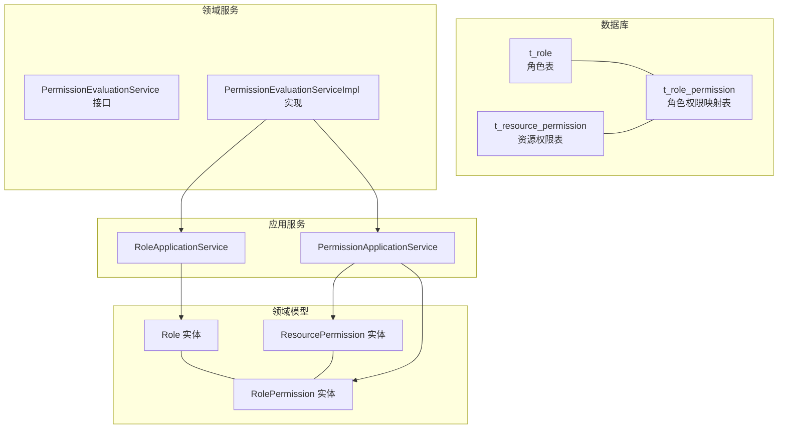
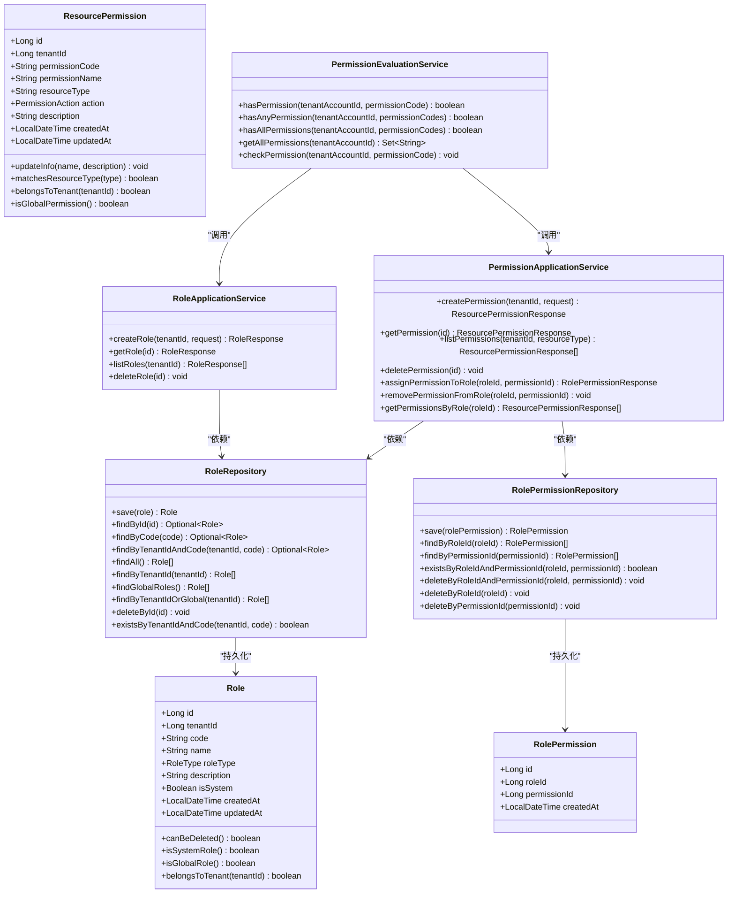
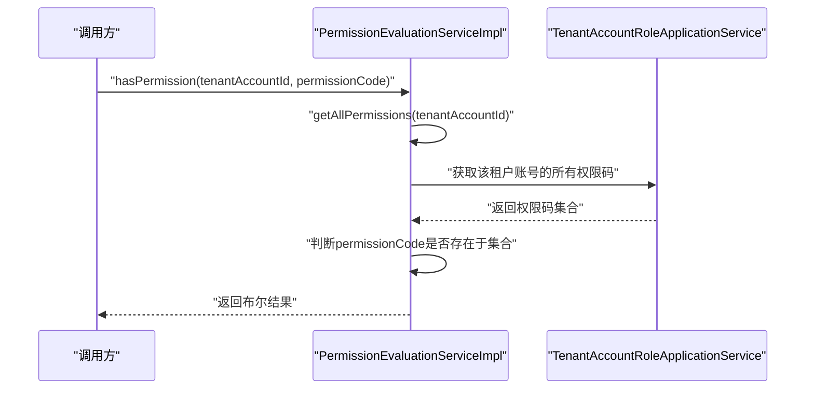
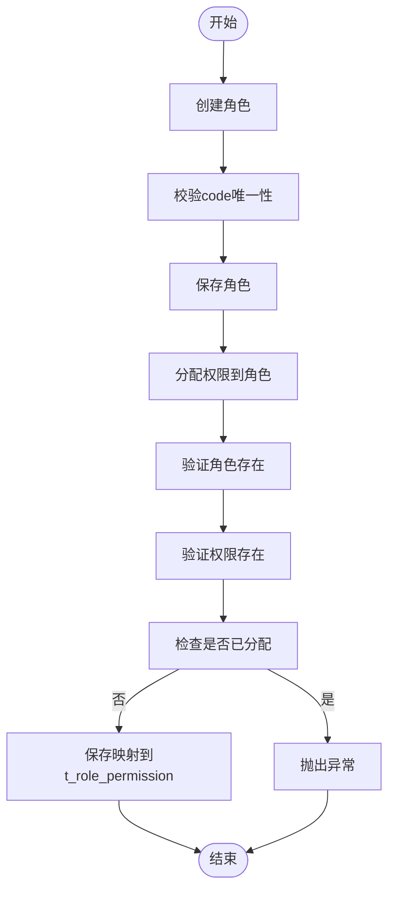
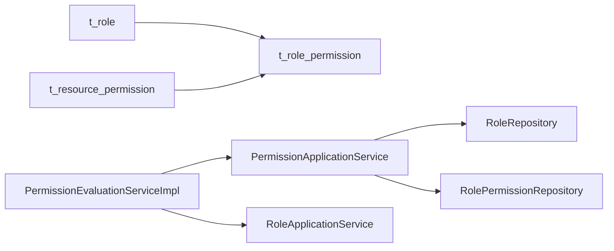

# 角色权限表

<cite>
**本文引用的文件**
- [V1__complete_schema_initialization.sql](file://iam-admin-server/src/main/resources/db/migration/V1__complete_schema_initialization.sql)
- [Role.java](file://iam-admin-server/src/main/java/iam/platform/admin/domain/model/entity/Role.java)
- [ResourcePermission.java](file://iam-admin-server/src/main/java/iam/platform/admin/domain/model/entity/ResourcePermission.java)
- [RolePermission.java](file://iam-admin-server/src/main/java/iam/platform/admin/domain/model/entity/RolePermission.java)
- [RoleType.java](file://iam-common/src/main/java/iam/platform/common/model/enums/RoleType.java)
- [PermissionAction.java](file://iam-common/src/main/java/iam/platform/common/model/enums/PermissionAction.java)
- [RoleApplicationService.java](file://iam-admin-server/src/main/java/iam/platform/admin/application/service/RoleApplicationService.java)
- [PermissionApplicationService.java](file://iam-admin-server/src/main/java/iam/platform/admin/application/service/PermissionApplicationService.java)
- [PermissionEvaluationService.java](file://iam-admin-server/src/main/java/iam/platform/admin/domain/service/PermissionEvaluationService.java)
- [PermissionEvaluationServiceImpl.java](file://iam-admin-server/src/main/java/iam/platform/admin/domain/service/impl/PermissionEvaluationServiceImpl.java)
- [RoleRepository.java](file://iam-admin-server/src/main/java/iam/platform/admin/domain/repository/RoleRepository.java)
- [RolePermissionRepository.java](file://iam-admin-server/src/main/java/iam/platform/admin/domain/repository/RolePermissionRepository.java)
</cite>

## 目录
1. [简介](#简介)
2. [项目结构](#项目结构)
3. [核心组件](#核心组件)
4. [架构总览](#架构总览)
5. [详细组件分析](#详细组件分析)
6. [依赖分析](#依赖分析)
7. [性能考虑](#性能考虑)
8. [故障排查指南](#故障排查指南)
9. [结论](#结论)
10. [附录](#附录)

## 简介
本文件聚焦IAM平台的角色权限表结构与权限体系，系统性解析以下三张核心表：
- t_role：角色表，定义角色的标识、名称、类型（系统内置/租户自定义）、归属租户等元信息
- t_resource_permission：资源权限表，定义资源类型与操作动作构成的权限模型
- t_role_permission：角色权限映射表，建立角色与具体权限的多对多关系

同时，本文阐明角色类型（SYSTEM/TENANT_CUSTOM）、权限代码规范（资源类型:动作小写）、资源类型与动作的定义，并解释权限评估算法、缓存策略及最佳实践。

## 项目结构
围绕角色权限表的代码与数据库脚本分布如下：
- 数据库初始化脚本包含三张核心表及其索引、触发器与种子数据
- 领域模型包含角色、资源权限、角色权限映射的实体类
- 应用服务负责角色与权限的创建、查询、分配与移除
- 领域服务提供权限评估接口与实现，支持缓存与批量校验

图表来源
- [V1__complete_schema_initialization.sql:25-461](file://iam-admin-server/src/main/resources/db/migration/V1__complete_schema_initialization.sql#L25-L461)
- [Role.java:16-82](file://iam-admin-server/src/main/java/iam/platform/admin/domain/model/entity/Role.java#L16-L82)
- [ResourcePermission.java:16-76](file://iam-admin-server/src/main/java/iam/platform/admin/domain/model/entity/ResourcePermission.java#L16-L76)
- [RolePermission.java:14-19](file://iam-admin-server/src/main/java/iam/platform/admin/domain/model/entity/RolePermission.java#L14-L19)
- [RoleApplicationService.java:20-83](file://iam-admin-server/src/main/java/iam/platform/admin/application/service/RoleApplicationService.java#L20-L83)
- [PermissionApplicationService.java:25-134](file://iam-admin-server/src/main/java/iam/platform/admin/application/service/PermissionApplicationService.java#L25-L134)
- [PermissionEvaluationService.java:8-52](file://iam-admin-server/src/main/java/iam/platform/admin/domain/service/PermissionEvaluationService.java#L8-L52)
- [PermissionEvaluationServiceImpl.java:16-52](file://iam-admin-server/src/main/java/iam/platform/admin/domain/service/impl/PermissionEvaluationServiceImpl.java#L16-L52)

章节来源
- [V1__complete_schema_initialization.sql:25-461](file://iam-admin-server/src/main/resources/db/migration/V1__complete_schema_initialization.sql#L25-L461)
- [Role.java:16-82](file://iam-admin-server/src/main/java/iam/platform/admin/domain/model/entity/Role.java#L16-L82)
- [ResourcePermission.java:16-76](file://iam-admin-server/src/main/java/iam/platform/admin/domain/model/entity/ResourcePermission.java#L16-L76)
- [RolePermission.java:14-19](file://iam-admin-server/src/main/java/iam/platform/admin/domain/model/entity/RolePermission.java#L14-L19)
- [RoleApplicationService.java:20-83](file://iam-admin-server/src/main/java/iam/platform/admin/application/service/RoleApplicationService.java#L20-L83)
- [PermissionApplicationService.java:25-134](file://iam-admin-server/src/main/java/iam/platform/admin/application/service/PermissionApplicationService.java#L25-L134)
- [PermissionEvaluationService.java:8-52](file://iam-admin-server/src/main/java/iam/platform/admin/domain/service/PermissionEvaluationService.java#L8-L52)
- [PermissionEvaluationServiceImpl.java:16-52](file://iam-admin-server/src/main/java/iam/platform/admin/domain/service/impl/PermissionEvaluationServiceImpl.java#L16-L52)

## 核心组件
本节从表结构、字段语义、枚举类型与实体类四个维度，系统梳理角色权限体系的数据模型。

- t_role（角色表）
  - 关键字段：id、code（唯一）、name、description、tenant_id（归属租户，为空表示全局角色）、role_type（SYSTEM/TENANT_CUSTOM）、is_system（系统内置不可删除）、created_at、updated_at
  - 约束与索引：code唯一；按tenant_id建立索引；更新时自动维护updated_at
  - 种子数据：内置ROLE_USER与ROLE_ADMIN

- t_resource_permission（资源权限表）
  - 关键字段：id、tenant_id（为空表示全局权限）、permission_code（唯一，格式为“资源类型:动作”，如user:read）、permission_name、resource_type、action（READ/WRITE/DELETE/EXPORT/APPROVE/EXECUTE）、description、created_at、updated_at
  - 约束与索引：tenant_id+permission_code唯一；按tenant_id、resource_type、action建立索引；更新时自动维护updated_at
  - 种子数据：覆盖user、tenant、organization、role、application、permission、audit等资源类型的典型权限

- t_role_permission（角色权限映射表）
  - 关键字段：id、role_id、permission_id、created_at
  - 约束与索引：role_id+permission_id唯一；分别对role_id、permission_id建立索引
  - 作用：建立角色与具体权限的多对多关系

- 枚举类型
  - RoleType：SYSTEM（系统内置）、TENANT_CUSTOM（租户自定义）
  - PermissionAction：READ、WRITE、DELETE、EXPORT、APPROVE、EXECUTE

- 领域实体
  - Role：封装角色的工厂方法、可删除性判断、是否系统角色、是否全局角色、是否属于某租户等行为
  - ResourcePermission：封装权限工厂方法（自动生成permission_code）、更新信息、匹配资源类型、归属租户、是否全局权限等行为
  - RolePermission：角色权限映射的轻量实体

章节来源
- [V1__complete_schema_initialization.sql:25-461](file://iam-admin-server/src/main/resources/db/migration/V1__complete_schema_initialization.sql#L25-L461)
- [RoleType.java:3-6](file://iam-common/src/main/java/iam/platform/common/model/enums/RoleType.java#L3-L6)
- [PermissionAction.java:3-5](file://iam-common/src/main/java/iam/platform/common/model/enums/PermissionAction.java#L3-L5)
- [Role.java:16-82](file://iam-admin-server/src/main/java/iam/platform/admin/domain/model/entity/Role.java#L16-L82)
- [ResourcePermission.java:16-76](file://iam-admin-server/src/main/java/iam/platform/admin/domain/model/entity/ResourcePermission.java#L16-L76)
- [RolePermission.java:14-19](file://iam-admin-server/src/main/java/iam/platform/admin/domain/model/entity/RolePermission.java#L14-L19)

## 架构总览
下图展示了角色权限在数据库、领域模型与应用/领域服务之间的交互关系。

图表来源
- [Role.java:16-82](file://iam-admin-server/src/main/java/iam/platform/admin/domain/model/entity/Role.java#L16-L82)
- [ResourcePermission.java:16-76](file://iam-admin-server/src/main/java/iam/platform/admin/domain/model/entity/ResourcePermission.java#L16-L76)
- [RolePermission.java:14-19](file://iam-admin-server/src/main/java/iam/platform/admin/domain/model/entity/RolePermission.java#L14-L19)
- [RoleRepository.java:8-28](file://iam-admin-server/src/main/java/iam/platform/admin/domain/repository/RoleRepository.java#L8-L28)
- [RolePermissionRepository.java:7-21](file://iam-admin-server/src/main/java/iam/platform/admin/domain/repository/RolePermissionRepository.java#L7-L21)
- [RoleApplicationService.java:20-83](file://iam-admin-server/src/main/java/iam/platform/admin/application/service/RoleApplicationService.java#L20-L83)
- [PermissionApplicationService.java:25-134](file://iam-admin-server/src/main/java/iam/platform/admin/application/service/PermissionApplicationService.java#L25-L134)
- [PermissionEvaluationService.java:8-52](file://iam-admin-server/src/main/java/iam/platform/admin/domain/service/PermissionEvaluationService.java#L8-L52)

## 详细组件分析

### t_role（角色表）
- 设计要点
  - 角色类型：SYSTEM（系统内置，不可删除）、TENANT_CUSTOM（租户自定义）
  - 全局角色：tenant_id为空；租户角色：tenant_id指向租户
  - 唯一性：code在全局或租户范围内唯一
- 行为与约束
  - is_system=true的角色禁止删除
  - 支持按租户或全局查询角色列表
- 种子数据
  - 内置ROLE_USER与ROLE_ADMIN，其中ROLE_ADMIN被授予全部系统权限

章节来源
- [V1__complete_schema_initialization.sql:25-51](file://iam-admin-server/src/main/resources/db/migration/V1__complete_schema_initialization.sql#L25-L51)
- [Role.java:67-81](file://iam-admin-server/src/main/java/iam/platform/admin/domain/model/entity/Role.java#L67-L81)
- [RoleApplicationService.java:24-75](file://iam-admin-server/src/main/java/iam/platform/admin/application/service/RoleApplicationService.java#L24-L75)

### t_resource_permission（资源权限表）
- 权限模型
  - 权限由“资源类型:动作”构成，如user:read、tenant:write
  - 资源类型涵盖user、tenant、organization、role、application、permission、audit等
  - 动作集合：READ、WRITE、DELETE、EXPORT、APPROVE、EXECUTE
- 命名规范
  - permission_code统一采用“资源类型:动作小写”的格式
  - permission_name用于显示名称
- 作用范围
  - tenant_id为空表示全局权限；非空表示租户内权限
- 种子数据
  - 提供系统级权限清单，覆盖管理与审计场景

章节来源
- [V1__complete_schema_initialization.sql:418-447](file://iam-admin-server/src/main/resources/db/migration/V1__complete_schema_initialization.sql#L418-L447)
- [ResourcePermission.java:29-51](file://iam-admin-server/src/main/java/iam/platform/admin/domain/model/entity/ResourcePermission.java#L29-L51)
- [PermissionAction.java:3-5](file://iam-common/src/main/java/iam/platform/common/model/enums/PermissionAction.java#L3-L5)

### t_role_permission（角色权限映射表）
- 多对多关系
  - 一个角色可拥有多个权限
  - 一个权限可被多个角色拥有
- 唯一性
  - role_id+permission_id唯一，避免重复授权
- 索引
  - 对role_id与permission_id分别建立索引，优化查询与删除性能

章节来源
- [V1__complete_schema_initialization.sql:448-461](file://iam-admin-server/src/main/resources/db/migration/V1__complete_schema_initialization.sql#L448-L461)
- [RolePermission.java:14-19](file://iam-admin-server/src/main/java/iam/platform/admin/domain/model/entity/RolePermission.java#L14-L19)

### 权限评估算法与缓存
- 评估入口
  - PermissionEvaluationService提供四种能力：单权限检查、任一权限检查、全部权限检查、获取用户全部权限码集合
- 执行流程
  - 通过缓存获取用户权限码集合（按租户账号ID缓存）
  - 单次检查直接命中Set进行contains判断
  - 批量检查使用流式过滤与allMatch/anyMatch
- 异常处理
  - 无权限时抛出访问拒绝异常

图表来源
- [PermissionEvaluationService.java:8-52](file://iam-admin-server/src/main/java/iam/platform/admin/domain/service/PermissionEvaluationService.java#L8-L52)
- [PermissionEvaluationServiceImpl.java:16-52](file://iam-admin-server/src/main/java/iam/platform/admin/domain/service/impl/PermissionEvaluationServiceImpl.java#L16-L52)

章节来源
- [PermissionEvaluationService.java:8-52](file://iam-admin-server/src/main/java/iam/platform/admin/domain/service/PermissionEvaluationService.java#L8-L52)
- [PermissionEvaluationServiceImpl.java:16-52](file://iam-admin-server/src/main/java/iam/platform/admin/domain/service/impl/PermissionEvaluationServiceImpl.java#L16-L52)

### 角色与权限的创建、分配与回收
- 创建角色
  - 校验code在租户或全局范围内唯一
  - 使用工厂方法创建角色并持久化
- 分配权限到角色
  - 校验角色与权限存在性
  - 防止重复分配
  - 成功后写入t_role_permission
- 回收权限
  - 删除t_role_permission中的映射记录
  - 删除权限时需先清理映射

图表来源
- [RoleApplicationService.java:24-43](file://iam-admin-server/src/main/java/iam/platform/admin/application/service/RoleApplicationService.java#L24-L43)
- [PermissionApplicationService.java:81-102](file://iam-admin-server/src/main/java/iam/platform/admin/application/service/PermissionApplicationService.java#L81-L102)

章节来源
- [RoleApplicationService.java:24-75](file://iam-admin-server/src/main/java/iam/platform/admin/application/service/RoleApplicationService.java#L24-L75)
- [PermissionApplicationService.java:31-111](file://iam-admin-server/src/main/java/iam/platform/admin/application/service/PermissionApplicationService.java#L31-L111)

## 依赖分析
- 表间依赖
  - t_role_permission.role_id → t_role.id（级联删除）
  - t_role_permission.permission_id → t_resource_permission.id（级联删除）
- 服务依赖
  - PermissionApplicationService依赖RoleRepository与RolePermissionRepository
  - PermissionEvaluationServiceImpl依赖TenantAccountRoleApplicationService（用于获取用户权限码集合）

图表来源
- [V1__complete_schema_initialization.sql:448-461](file://iam-admin-server/src/main/resources/db/migration/V1__complete_schema_initialization.sql#L448-L461)
- [RoleRepository.java:8-28](file://iam-admin-server/src/main/java/iam/platform/admin/domain/repository/RoleRepository.java#L8-L28)
- [RolePermissionRepository.java:7-21](file://iam-admin-server/src/main/java/iam/platform/admin/domain/repository/RolePermissionRepository.java#L7-L21)
- [PermissionApplicationService.java:25-134](file://iam-admin-server/src/main/java/iam/platform/admin/application/service/PermissionApplicationService.java#L25-L134)
- [PermissionEvaluationServiceImpl.java:16-52](file://iam-admin-server/src/main/java/iam/platform/admin/domain/service/impl/PermissionEvaluationServiceImpl.java#L16-L52)

章节来源
- [V1__complete_schema_initialization.sql:448-461](file://iam-admin-server/src/main/resources/db/migration/V1__complete_schema_initialization.sql#L448-L461)
- [RoleRepository.java:8-28](file://iam-admin-server/src/main/java/iam/platform/admin/domain/repository/RoleRepository.java#L8-L28)
- [RolePermissionRepository.java:7-21](file://iam-admin-server/src/main/java/iam/platform/admin/domain/repository/RolePermissionRepository.java#L7-L21)
- [PermissionApplicationService.java:25-134](file://iam-admin-server/src/main/java/iam/platform/admin/application/service/PermissionApplicationService.java#L25-L134)
- [PermissionEvaluationServiceImpl.java:16-52](file://iam-admin-server/src/main/java/iam/platform/admin/domain/service/impl/PermissionEvaluationServiceImpl.java#L16-L52)

## 性能考虑
- 索引策略
  - t_role：按tenant_id建立索引，便于按租户查询
  - t_resource_permission：按tenant_id、resource_type、action建立索引，提升权限查询效率
  - t_role_permission：对role_id与permission_id建立索引，加速映射查询与删除
- 缓存策略
  - 权限评估结果按租户账号ID缓存，减少重复查询
- 批量操作
  - 删除权限前先清理映射，避免外键约束导致的删除失败

[本节为通用性能建议，不直接分析具体文件]

## 故障排查指南
- 角色创建失败（code冲突）
  - 现象：提示租户内或全局已存在相同code
  - 处理：更换唯一code或确认是否应复用现有角色
- 删除角色失败（系统内置角色）
  - 现象：系统角色不可删除
  - 处理：仅可删除租户自定义角色
- 分配权限到角色失败（权限不存在或已分配）
  - 现象：权限不存在或重复分配
  - 处理：先创建权限，再执行分配；避免重复分配
- 权限评估失败（无权限）
  - 现象：抛出访问拒绝异常
  - 处理：确认租户账号是否被赋予相应角色与权限；检查权限码拼写与大小写

章节来源
- [RoleApplicationService.java:27-36](file://iam-admin-server/src/main/java/iam/platform/admin/application/service/RoleApplicationService.java#L27-L36)
- [RoleApplicationService.java:68-71](file://iam-admin-server/src/main/java/iam/platform/admin/application/service/RoleApplicationService.java#L68-L71)
- [PermissionApplicationService.java:82-96](file://iam-admin-server/src/main/java/iam/platform/admin/application/service/PermissionApplicationService.java#L82-L96)
- [PermissionEvaluationServiceImpl.java:44-51](file://iam-admin-server/src/main/java/iam/platform/admin/domain/service/impl/PermissionEvaluationServiceImpl.java#L44-L51)

## 结论
本角色权限体系以三张核心表为核心，结合枚举类型与领域实体，形成清晰的权限模型与稳定的业务流程。通过全局/租户权限划分、标准化的权限代码规范与多对多映射，实现了灵活的权限编排与高效的权限评估。配合缓存与索引策略，可在保证安全性的前提下满足高并发场景下的权限校验需求。

[本节为总结性内容，不直接分析具体文件]

## 附录

### 权限矩阵示例（示意）
- 全局只读角色
  - 权限：user:read、tenant:read、org:read、role:read、app:read、audit:read
- 系统管理员
  - 权限：覆盖所有系统级资源的READ/WRITE/DELETE/EXPORT/APPROVE
- 租户管理员
  - 权限：tenant:read、tenant:write、tenant:approve、org:*、role:*、app:*、permission:*、audit:read、audit:export

[本节为概念性示例，不直接分析具体文件]

### 角色分配最佳实践
- 最小权限原则
  - 优先选择具备必要权限的角色，避免授予超出职责范围的权限
- 权限分离
  - 将审批、执行、审计等关键动作拆分至不同角色，降低风险集中度
- 角色继承与组合
  - 通过组合多个角色实现复杂权限集，避免直接授予大量细粒度权限
- 审计与复核
  - 对敏感操作启用审计日志，定期复核角色与权限分配情况

[本节为通用最佳实践，不直接分析具体文件]