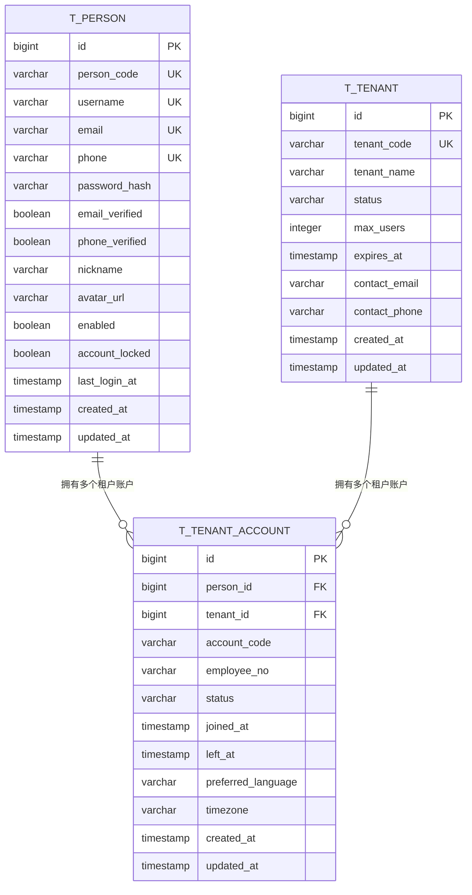
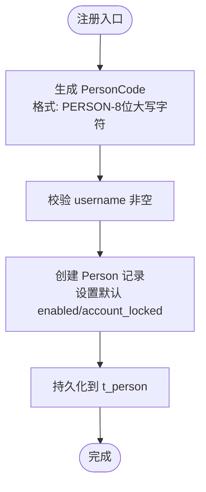
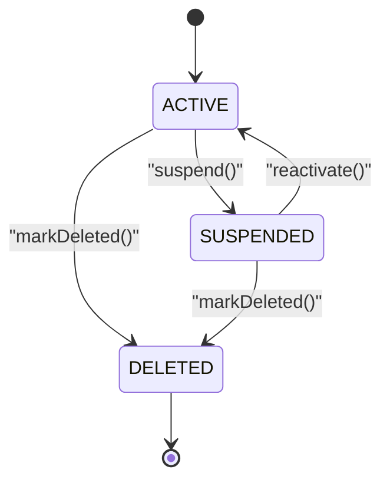
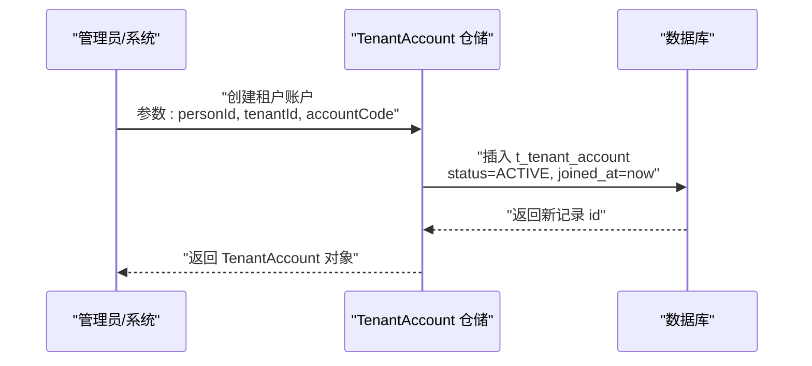
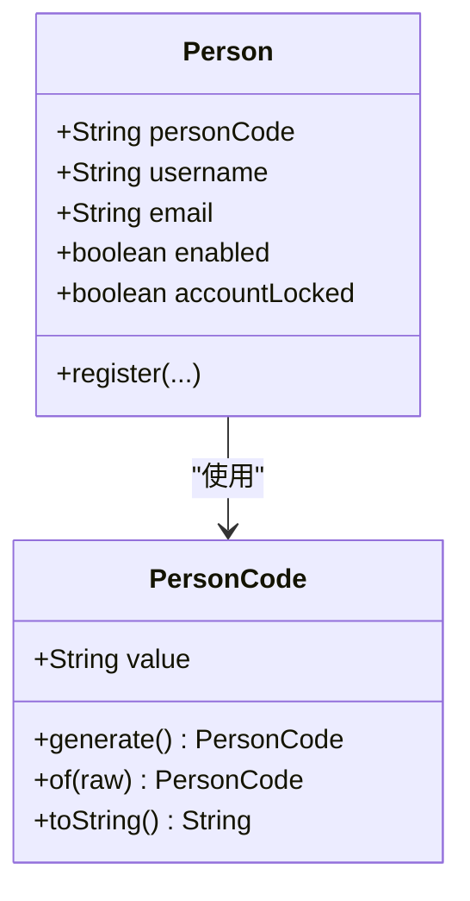
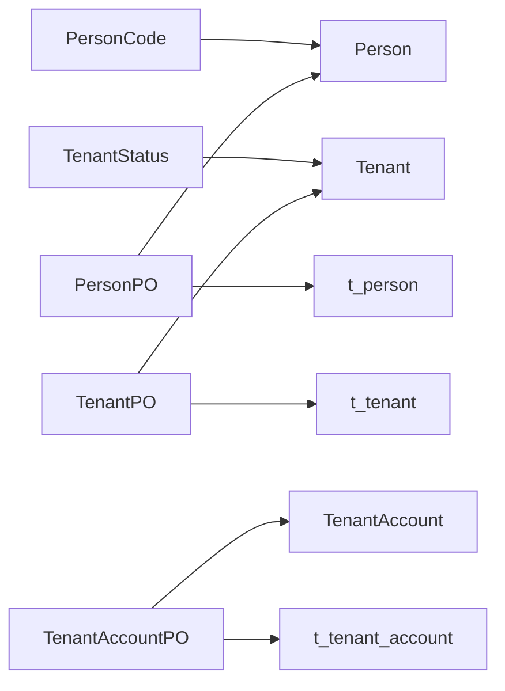

# 身份模型表

<cite>
**本文引用的文件**
- [V1__complete_schema_initialization.sql](file://iam-admin-server/src/main/resources/db/migration/V1__complete_schema_initialization.sql)
- [PersonPO.java](file://iam-admin-server/src/main/java/iam/platform/admin/infrastructure/persistence/entity/PersonPO.java)
- [PersonPO.java](file://iam-auth-server/src/main/java/iam/platform/auth/infrastructure/persistence/entity/PersonPO.java)
- [TenantPO.java](file://iam-admin-server/src/main/java/iam/platform/admin/infrastructure/persistence/entity/TenantPO.java)
- [TenantAccountPO.java](file://iam-admin-server/src/main/java/iam/platform/admin/infrastructure/persistence/entity/TenantAccountPO.java)
- [TenantAccountPO.java](file://iam-auth-server/src/main/java/iam/platform/auth/infrastructure/persistence/entity/TenantAccountPO.java)
- [Person.java](file://iam-admin-server/src/main/java/iam/platform/admin/domain/model/entity/Person.java)
- [Person.java](file://iam-auth-server/src/main/java/iam/platform/auth/domain/model/entity/Person.java)
- [Tenant.java](file://iam-admin-server/src/main/java/iam/platform/admin/domain/model/entity/Tenant.java)
- [TenantAccount.java](file://iam-admin-server/src/main/java/iam/platform/admin/domain/model/entity/TenantAccount.java)
- [PersonCode.java](file://iam-common/src/main/java/iam/platform/common/model/valueobject/PersonCode.java)
- [TenantStatus.java](file://iam-common/src/main/java/iam/platform/common/model/enums/TenantStatus.java)
</cite>

## 目录
1. [简介](#简介)
2. [项目结构](#项目结构)
3. [核心组件](#核心组件)
4. [架构总览](#架构总览)
5. [详细组件分析](#详细组件分析)
6. [依赖分析](#依赖分析)
7. [性能考虑](#性能考虑)
8. [故障排查指南](#故障排查指南)
9. [结论](#结论)

## 简介
本文件系统化梳理 IAM 平台的身份模型表，聚焦以下三张核心表：
- t_person：个人用户表，承载“全局唯一身份”，包含 person_code、username、email、phone 等字段及唯一性约束。
- t_tenant：租户表，描述多租户架构中的租户实体，包含租户状态、配额与过期时间等。
- t_tenant_account：租户账户表，建立 person 与 tenant 的关联，体现“用户在某个租户内的身份”。

文档将从表结构、唯一性约束、业务逻辑、数据流向、ER 关系图与序列图等维度进行深入解析，并结合领域模型与值对象，解释全局唯一标识符 person_code 的设计理念、用户名与邮箱的唯一性策略、账户状态管理与验证机制、租户隔离策略、账户生命周期管理与跨租户用户识别。

## 项目结构
围绕身份模型表，相关代码分布在如下模块与层次：
- 数据库初始化脚本：定义三张核心表及其索引、触发器与注释。
- 领域模型：Person、Tenant、TenantAccount 及其行为方法。
- 持久化实体：PersonPO、TenantPO、TenantAccountPO 映射到 t_person、t_tenant、t_tenant_account。
- 值对象与枚举：PersonCode、TenantStatus 提供格式校验与状态语义。

```mermaid
graph TB
subgraph "数据库层"
TPerson["t_person 表"]
TTenant["t_tenant 表"]
TTenantAccount["t_tenant_account 表"]
end
subgraph "持久化层"
PersonPO["PersonPO 实体"]
TenantPO["TenantPO 实体"]
TenantAccountPO["TenantAccountPO 实体"]
end
subgraph "领域模型层"
Person["Person 领域模型"]
Tenant["Tenant 领域模型"]
TenantAccount["TenantAccount 领域模型"]
PersonCode["PersonCode 值对象"]
TenantStatus["TenantStatus 枚举"]
end
TPerson <- --> PersonPO
TTenant <- --> TenantPO
TTenantAccount <- --> TenantAccountPO
PersonPO --> Person
TenantPO --> Tenant
TenantAccountPO --> TenantAccount
Person --> PersonCode
Tenant --> TenantStatus
```

图表来源
- [V1__complete_schema_initialization.sql:172-272](file://iam-admin-server/src/main/resources/db/migration/V1__complete_schema_initialization.sql#L172-L272)
- [PersonPO.java:17-96](file://iam-admin-server/src/main/java/iam/platform/admin/infrastructure/persistence/entity/PersonPO.java#L17-L96)
- [TenantPO.java:17-72](file://iam-admin-server/src/main/java/iam/platform/admin/infrastructure/persistence/entity/TenantPO.java#L17-L72)
- [TenantAccountPO.java:17-82](file://iam-admin-server/src/main/java/iam/platform/admin/infrastructure/persistence/entity/TenantAccountPO.java#L17-L82)
- [Person.java:17-43](file://iam-admin-server/src/main/java/iam/platform/admin/domain/model/entity/Person.java#L17-L43)
- [Tenant.java:16-117](file://iam-admin-server/src/main/java/iam/platform/admin/domain/model/entity/Tenant.java#L16-L117)
- [TenantAccount.java:17-131](file://iam-admin-server/src/main/java/iam/platform/admin/domain/model/entity/TenantAccount.java#L17-L131)
- [PersonCode.java:10-50](file://iam-common/src/main/java/iam/platform/common/model/valueobject/PersonCode.java#L10-L50)
- [TenantStatus.java:3-5](file://iam-common/src/main/java/iam/platform/common/model/enums/TenantStatus.java#L3-L5)

章节来源
- [V1__complete_schema_initialization.sql:172-272](file://iam-admin-server/src/main/resources/db/migration/V1__complete_schema_initialization.sql#L172-L272)
- [PersonPO.java:17-96](file://iam-admin-server/src/main/java/iam/platform/admin/infrastructure/persistence/entity/PersonPO.java#L17-L96)
- [TenantPO.java:17-72](file://iam-admin-server/src/main/java/iam/platform/admin/infrastructure/persistence/entity/TenantPO.java#L17-L72)
- [TenantAccountPO.java:17-82](file://iam-admin-server/src/main/java/iam/platform/admin/infrastructure/persistence/entity/TenantAccountPO.java#L17-L82)
- [Person.java:17-43](file://iam-admin-server/src/main/java/iam/platform/admin/domain/model/entity/Person.java#L17-L43)
- [Tenant.java:16-117](file://iam-admin-server/src/main/java/iam/platform/admin/domain/model/entity/Tenant.java#L16-L117)
- [TenantAccount.java:17-131](file://iam-admin-server/src/main/java/iam/platform/admin/domain/model/entity/TenantAccount.java#L17-L131)
- [PersonCode.java:10-50](file://iam-common/src/main/java/iam/platform/common/model/valueobject/PersonCode.java#L10-L50)
- [TenantStatus.java:3-5](file://iam-common/src/main/java/iam/platform/common/model/enums/TenantStatus.java#L3-L5)

## 核心组件
本节对三张核心表进行逐项解析，涵盖字段定义、唯一性约束、业务逻辑与索引策略。

- t_person（个人用户表）
  - 全局唯一标识：person_code（唯一索引），用于跨租户唯一识别自然人。
  - 登录凭据：username（唯一索引）、email（唯一索引，非空时生效）、phone（唯一索引，非空时生效）。
  - 安全与状态：password_hash、enabled、account_locked；email_verified、phone_verified 标识第三方验证状态。
  - 其他：nickname、avatar_url、last_login_at、时间戳 created_at/updated_at。
  - 触发器：update_t_person_updated_at 自动更新 updated_at。
  - 注释：明确为“全局身份”表，强调跨租户唯一性与全局可识别性。

- t_tenant（租户表）
  - 唯一标识：tenant_code（唯一索引）。
  - 状态与配额：status（默认 ACTIVE，取值 ACTIVE/SUSPENDED/DELETED）、max_users 默认 100。
  - 生命周期：expires_at 租户到期时间；contact_email、contact_phone 联系信息。
  - 时间戳：created_at/updated_at。
  - 触发器：update_t_tenant_updated_at 自动更新 updated_at。
  - 注释：租户状态枚举 TenantStatus。

- t_tenant_account（租户账户表）
  - 关联键：person_id 引用 t_person、tenant_id 引用 t_tenant。
  - 租户内唯一性：account_code（联合唯一：tenant_id + account_code）、employee_no（联合唯一：tenant_id + employee_no）。
  - 状态与时间：status（默认 ACTIVE，取值 ACTIVE/SUSPENDED/LEFT）、joined_at、left_at。
  - 本地化偏好：preferred_language（默认 zh-CN）、timezone（默认 Asia/Shanghai）。
  - 时间戳：created_at/updated_at。
  - 触发器：update_t_tenant_account_updated_at 自动更新 updated_at。
  - 注释：强调“租户内的用户身份”，并给出状态含义。

章节来源
- [V1__complete_schema_initialization.sql:172-272](file://iam-admin-server/src/main/resources/db/migration/V1__complete_schema_initialization.sql#L172-L272)
- [PersonPO.java:23-96](file://iam-admin-server/src/main/java/iam/platform/admin/infrastructure/persistence/entity/PersonPO.java#L23-L96)
- [TenantPO.java:23-72](file://iam-admin-server/src/main/java/iam/platform/admin/infrastructure/persistence/entity/TenantPO.java#L23-L72)
- [TenantAccountPO.java:23-82](file://iam-admin-server/src/main/java/iam/platform/admin/infrastructure/persistence/entity/TenantAccountPO.java#L23-L82)
- [Person.java:17-43](file://iam-admin-server/src/main/java/iam/platform/admin/domain/model/entity/Person.java#L17-L43)
- [Tenant.java:16-117](file://iam-admin-server/src/main/java/iam/platform/admin/domain/model/entity/Tenant.java#L16-L117)
- [TenantAccount.java:17-131](file://iam-admin-server/src/main/java/iam/platform/admin/domain/model/entity/TenantAccount.java#L17-L131)
- [PersonCode.java:10-50](file://iam-common/src/main/java/iam/platform/common/model/valueobject/PersonCode.java#L10-L50)
- [TenantStatus.java:3-5](file://iam-common/src/main/java/iam/platform/common/model/enums/TenantStatus.java#L3-L5)

## 架构总览
下图展示三张身份模型表的 ER 关系与数据流向，体现“全局身份 → 租户身份”的映射路径。



图表来源
- [V1__complete_schema_initialization.sql:172-272](file://iam-admin-server/src/main/resources/db/migration/V1__complete_schema_initialization.sql#L172-L272)

## 详细组件分析

### t_person（个人用户表）
- 设计要点
  - 全局唯一标识 person_code：通过值对象 PersonCode 生成，格式为“PERSON-八位大写字母数字”，确保跨租户唯一且可读。
  - 登录唯一性：username 全局唯一；email、phone 在非空时分别唯一，避免重复登录名。
  - 安全字段：password_hash 使用强哈希；enabled/account_locked 控制账户启用与锁定；email_verified/phone_verified 标识第三方验证状态。
  - 全局可识别：last_login_at 记录任意租户的最近登录时间，便于跨租户审计与风控。
- 唯一性约束与索引
  - uk_person_code、uk_person_username、uk_person_email（非空时生效）、uk_person_phone（非空时生效）。
- 业务逻辑
  - 注册时由领域模型 Person.register 生成 PersonCode，并设置默认状态。
  - 登录成功后可更新 last_login_at，便于统计与风控。
- 复杂度与性能
  - 唯一索引保证查询与插入的 O(log N) 复杂度；建议在高频查询场景（如按 username/email 查询）利用索引优化。
- 错误处理
  - 非法 person_code 将被值对象 PersonCode.of 校验拒绝，防止格式错误入库。



图表来源
- [Person.java:36-43](file://iam-admin-server/src/main/java/iam/platform/admin/domain/model/entity/Person.java#L36-L43)
- [PersonCode.java:27-44](file://iam-common/src/main/java/iam/platform/common/model/valueobject/PersonCode.java#L27-L44)
- [V1__complete_schema_initialization.sql:200-232](file://iam-admin-server/src/main/resources/db/migration/V1__complete_schema_initialization.sql#L200-L232)

章节来源
- [V1__complete_schema_initialization.sql:200-232](file://iam-admin-server/src/main/resources/db/migration/V1__complete_schema_initialization.sql#L200-L232)
- [PersonPO.java:23-96](file://iam-admin-server/src/main/java/iam/platform/admin/infrastructure/persistence/entity/PersonPO.java#L23-L96)
- [Person.java:36-43](file://iam-admin-server/src/main/java/iam/platform/admin/domain/model/entity/Person.java#L36-L43)
- [PersonCode.java:10-50](file://iam-common/src/main/java/iam/platform/common/model/valueobject/PersonCode.java#L10-L50)

### t_tenant（租户表）
- 设计要点
  - tenant_code 全局唯一，作为外部可见的租户标识。
  - status 支持 ACTIVE/SUSPENDED/DELETED 三种状态，配合业务流程（激活/暂停/删除）。
  - max_users 限制租户最大用户数；expires_at 控制租户有效期。
  - 联系信息 contact_email/contact_phone 便于运营与合规。
- 生命周期与状态机
  - create → activate（仅非 DELETED）→ suspend（仅 ACTIVE）→ markDeleted（仅非 ACTIVE）。
  - isExpired 利用 expires_at 进行过期判断。
- 性能与索引
  - uk_tenant_code；建议在 status、expires_at 上建立索引以支持批量调度与查询。



图表来源
- [Tenant.java:50-80](file://iam-admin-server/src/main/java/iam/platform/admin/domain/model/entity/Tenant.java#L50-L80)
- [TenantStatus.java:3-5](file://iam-common/src/main/java/iam/platform/common/model/enums/TenantStatus.java#L3-L5)

章节来源
- [V1__complete_schema_initialization.sql:172-198](file://iam-admin-server/src/main/resources/db/migration/V1__complete_schema_initialization.sql#L172-L198)
- [TenantPO.java:23-72](file://iam-admin-server/src/main/java/iam/platform/admin/infrastructure/persistence/entity/TenantPO.java#L23-L72)
- [Tenant.java:30-117](file://iam-admin-server/src/main/java/iam/platform/admin/domain/model/entity/Tenant.java#L30-L117)
- [TenantStatus.java:3-5](file://iam-common/src/main/java/iam/platform/common/model/enums/TenantStatus.java#L3-L5)

### t_tenant_account（租户账户表）
- 设计要点
  - 关联关系：person_id → t_person，tenant_id → t_tenant，形成“个人在租户内的身份”。
  - 租户内唯一性：account_code 与 employee_no 在同一 tenant 内唯一，避免重复。
  - 状态与时间：status 支持 ACTIVE/SUSPENDED/LEFT；joined_at/left_at 记录加入与离开时间。
  - 偏好设置：preferred_language、timezone 默认 zh-CN/Asia/Shanghai。
- 生命周期与状态机
  - create → suspend（仅 ACTIVE）→ reactivate（仅 SUSPENDED）→ leave（不可逆，置 LEFT）。
- 数据流向
  - 用户在某租户内的操作权限、组织归属、角色映射均基于该记录进行。



图表来源
- [TenantAccount.java:37-58](file://iam-admin-server/src/main/java/iam/platform/admin/domain/model/entity/TenantAccount.java#L37-L58)
- [TenantAccountPO.java:74-82](file://iam-admin-server/src/main/java/iam/platform/admin/infrastructure/persistence/entity/TenantAccountPO.java#L74-L82)
- [V1__complete_schema_initialization.sql:237-272](file://iam-admin-server/src/main/resources/db/migration/V1__complete_schema_initialization.sql#L237-L272)

章节来源
- [V1__complete_schema_initialization.sql:237-272](file://iam-admin-server/src/main/resources/db/migration/V1__complete_schema_initialization.sql#L237-L272)
- [TenantAccountPO.java:23-82](file://iam-admin-server/src/main/java/iam/platform/admin/infrastructure/persistence/entity/TenantAccountPO.java#L23-L82)
- [TenantAccount.java:37-131](file://iam-admin-server/src/main/java/iam/platform/admin/domain/model/entity/TenantAccount.java#L37-L131)

### 全局唯一标识符 person_code 的设计理念
- 值对象 PersonCode
  - 生成：采用 UUID 去除分隔符并截取 8 位，统一转为大写，前缀 PERSON-，确保全局唯一且可读。
  - 校验：正则校验格式，非法格式抛出异常，防止脏数据入库。
- 业务价值
  - 跨租户唯一识别：同一自然人在不同租户中共享同一 person_code，便于审计、风控与跨租户联动。
  - 与 username/email 解耦：username/email 仅在租户内唯一或全局唯一，person_code 独立存在，避免命名冲突影响身份识别。



图表来源
- [PersonCode.java:10-50](file://iam-common/src/main/java/iam/platform/common/model/valueobject/PersonCode.java#L10-L50)
- [Person.java:36-43](file://iam-admin-server/src/main/java/iam/platform/admin/domain/model/entity/Person.java#L36-L43)

章节来源
- [PersonCode.java:10-50](file://iam-common/src/main/java/iam/platform/common/model/valueobject/PersonCode.java#L10-L50)
- [Person.java:36-43](file://iam-admin-server/src/main/java/iam/platform/admin/domain/model/entity/Person.java#L36-L43)

### 用户名与邮箱的唯一性约束
- username：全局唯一（uk_person_username），保证登录名唯一。
- email：全局唯一（uk_person_email，非空时生效），避免重复邮箱导致的账号混淆。
- phone：全局唯一（uk_person_phone，非空时生效），支持手机号登录与短信验证。
- 唯一性策略
  - 非空时生效：通过数据库条件唯一索引实现，空值不参与唯一约束，允许同一邮箱/手机为空。
  - 插入/更新时需满足唯一性，违反将触发唯一约束冲突。

章节来源
- [V1__complete_schema_initialization.sql:218-221](file://iam-admin-server/src/main/resources/db/migration/V1__complete_schema_initialization.sql#L218-L221)
- [PersonPO.java:32-42](file://iam-admin-server/src/main/java/iam/platform/admin/infrastructure/persistence/entity/PersonPO.java#L32-L42)

### 账户状态管理与验证机制
- t_person
  - enabled：全局启用标志；account_locked：全局锁定标志；email_verified/phone_verified：第三方验证状态。
- t_tenant_account
  - status：ACTIVE/SUSPENDED/LEFT；LEFT 不可逆，记录 left_at。
- 领域模型
  - TenantAccount.suspend/reactivate/leave 提供状态转换的受控接口，避免直接修改状态引发不一致。
- 验证机制
  - 登录前可通过 enabled/account_locked 判断账户整体可用性；第三方登录后可更新 email_verified/phone_verified。

章节来源
- [V1__complete_schema_initialization.sql:200-232](file://iam-admin-server/src/main/resources/db/migration/V1__complete_schema_initialization.sql#L200-L232)
- [TenantAccount.java:60-91](file://iam-admin-server/src/main/java/iam/platform/admin/domain/model/entity/TenantAccount.java#L60-L91)
- [TenantAccountPO.java:44-54](file://iam-admin-server/src/main/java/iam/platform/admin/infrastructure/persistence/entity/TenantAccountPO.java#L44-L54)

### 租户隔离策略
- 多租户边界
  - t_tenant：租户实体，tenant_code 唯一。
  - t_tenant_account：租户内身份，person_id+tenant_id 唯一性保障同一人同一租户仅有一条记录。
- 隔离原则
  - 数据隔离：各租户间的数据通过 tenant_id 进行物理或逻辑隔离。
  - 权限隔离：角色与权限绑定到租户，跨租户无法直接继承。
- 跨租户识别
  - 通过 t_person 的 person_code 实现跨租户唯一识别，便于审计与风控。

章节来源
- [V1__complete_schema_initialization.sql:172-272](file://iam-admin-server/src/main/resources/db/migration/V1__complete_schema_initialization.sql#L172-L272)
- [TenantAccountPO.java:29-34](file://iam-admin-server/src/main/java/iam/platform/admin/infrastructure/persistence/entity/TenantAccountPO.java#L29-L34)

### 账户生命周期管理与跨租户用户识别
- 生命周期
  - t_person：注册即创建，支持后续资料更新与安全状态变更。
  - t_tenant_account：创建即 ACTIVE，支持 suspend/reactivate/leave。
  - t_tenant：create → activate/suspend/markDeleted，支持过期判断 isExpired。
- 跨租户识别
  - 同一 person_code 对应同一自然人，可在不同租户中拥有独立的 t_tenant_account 记录，实现“同一身份在多处生效”。

章节来源
- [Tenant.java:107-117](file://iam-admin-server/src/main/java/iam/platform/admin/domain/model/entity/Tenant.java#L107-L117)
- [TenantAccount.java:116-131](file://iam-admin-server/src/main/java/iam/platform/admin/domain/model/entity/TenantAccount.java#L116-L131)
- [PersonCode.java:27-44](file://iam-common/src/main/java/iam/platform/common/model/valueobject/PersonCode.java#L27-L44)

## 依赖分析
- 模块内依赖
  - PersonPO/TenantPO/TenantAccountPO 分别映射到 t_person/t_tenant/t_tenant_account。
  - 领域模型 Person/Tenant/TenantAccount 封装业务规则与状态机。
  - PersonCode 与 TenantStatus 提供格式校验与状态语义。
- 外部依赖
  - 数据库层面：唯一索引与触发器保障一致性与审计。
  - 应用层面：仓储与服务层通过实体与领域模型协作，实现业务编排。



图表来源
- [PersonCode.java:10-50](file://iam-common/src/main/java/iam/platform/common/model/valueobject/PersonCode.java#L10-L50)
- [TenantStatus.java:3-5](file://iam-common/src/main/java/iam/platform/common/model/enums/TenantStatus.java#L3-L5)
- [PersonPO.java:17-96](file://iam-admin-server/src/main/java/iam/platform/admin/infrastructure/persistence/entity/PersonPO.java#L17-L96)
- [TenantPO.java:17-72](file://iam-admin-server/src/main/java/iam/platform/admin/infrastructure/persistence/entity/TenantPO.java#L17-L72)
- [TenantAccountPO.java:17-82](file://iam-admin-server/src/main/java/iam/platform/admin/infrastructure/persistence/entity/TenantAccountPO.java#L17-L82)

章节来源
- [PersonCode.java:10-50](file://iam-common/src/main/java/iam/platform/common/model/valueobject/PersonCode.java#L10-L50)
- [TenantStatus.java:3-5](file://iam-common/src/main/java/iam/platform/common/model/enums/TenantStatus.java#L3-L5)
- [PersonPO.java:17-96](file://iam-admin-server/src/main/java/iam/platform/admin/infrastructure/persistence/entity/PersonPO.java#L17-L96)
- [TenantPO.java:17-72](file://iam-admin-server/src/main/java/iam/platform/admin/infrastructure/persistence/entity/TenantPO.java#L17-L72)
- [TenantAccountPO.java:17-82](file://iam-admin-server/src/main/java/iam/platform/admin/infrastructure/persistence/entity/TenantAccountPO.java#L17-L82)

## 性能考虑
- 唯一性索引
  - t_person 的 uk_person_code、uk_person_username、uk_person_email（非空时）、uk_person_phone（非空时）是高频查询与写入的关键路径，应保持合理维护。
- 更新触发器
  - update_t_person_updated_at/update_t_tenant_updated_at/update_t_tenant_account_updated_at 在每次更新时自动刷新 updated_at，减少业务层样板代码。
- 批量调度
  - 租户过期与审计日志清理等任务可基于 expires_at、created_at 等时间字段进行索引优化与分区策略（视数据库能力而定）。

## 故障排查指南
- 唯一性冲突
  - 现象：插入/更新时出现唯一约束冲突。
  - 排查：检查 username/email/phone/person_code 或 tenant_id+account_code/employee_no 是否重复。
  - 参考：数据库唯一索引定义与实体字段映射。
- 状态不合法
  - 现象：尝试对 ACTIVE 租户执行 suspend 或对 SUSPENDED 租户执行 reactivate。
  - 排查：确认当前状态与目标状态是否匹配，遵循状态机约束。
- person_code 格式错误
  - 现象：保存失败或运行时报错。
  - 排查：确认 PersonCode.of 输入格式是否符合“PERSON-八位大写字符”。
- 账户锁定/未启用
  - 现象：登录失败。
  - 排查：检查 t_person 的 enabled 与 account_locked 字段，以及 t_tenant_account 的 status。

章节来源
- [V1__complete_schema_initialization.sql:218-221](file://iam-admin-server/src/main/resources/db/migration/V1__complete_schema_initialization.sql#L218-L221)
- [Tenant.java:65-70](file://iam-admin-server/src/main/java/iam/platform/admin/domain/model/entity/Tenant.java#L65-L70)
- [TenantAccount.java:65-80](file://iam-admin-server/src/main/java/iam/platform/admin/domain/model/entity/TenantAccount.java#L65-L80)
- [PersonCode.java:39-44](file://iam-common/src/main/java/iam/platform/common/model/valueobject/PersonCode.java#L39-L44)

## 结论
本身份模型通过 t_person、t_tenant、t_tenant_account 三张表实现了“全局身份 + 租户内身份”的清晰分层：
- t_person 提供全局唯一身份标识与登录凭据，person_code 作为跨租户识别核心。
- t_tenant 管理租户状态、配额与有效期，支撑多租户隔离与生命周期管理。
- t_tenant_account 将个人与租户绑定，提供租户内的账户状态、偏好与时间线。
配合值对象与领域模型，系统在数据一致性、可读性与扩展性方面具备良好基础。建议在生产环境中持续关注唯一性索引维护、状态机约束与跨租户审计需求。