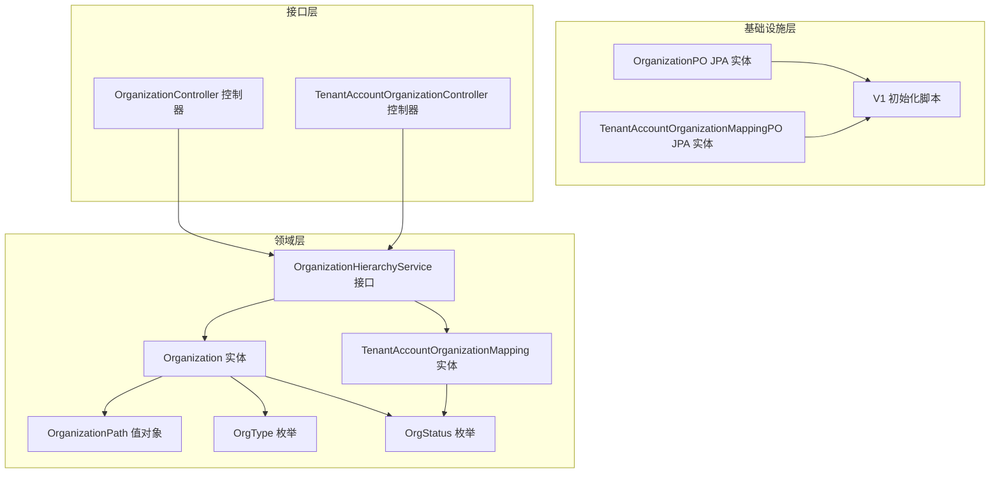
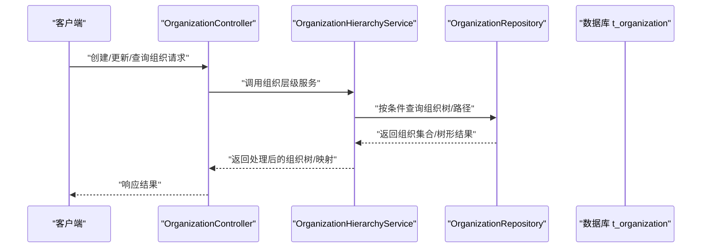
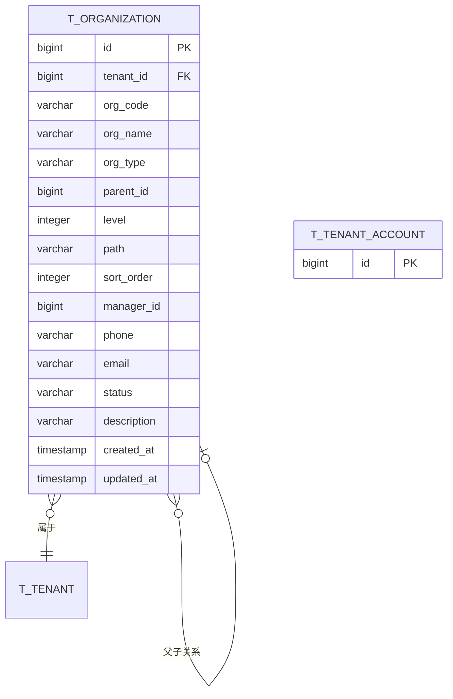
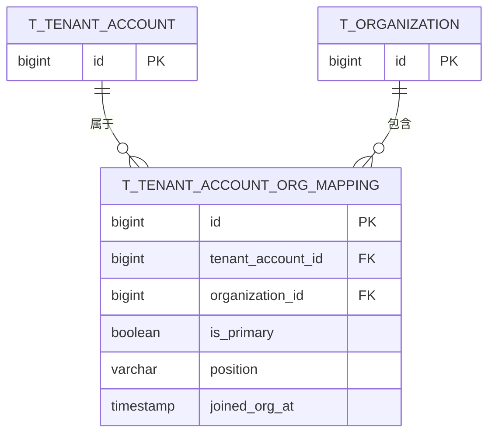
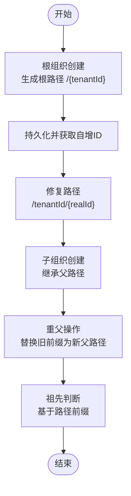
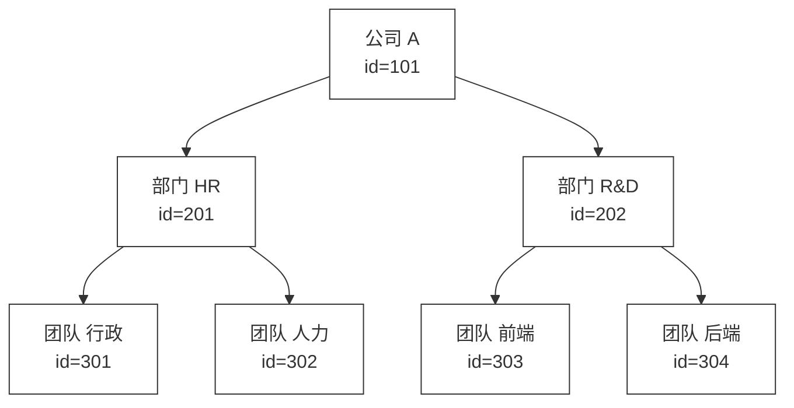
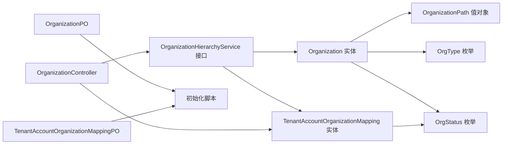

# 组织架构表

<cite>
**本文引用的文件**
- [Organization.java](file://iam-admin-server/src/main/java/iam/platform/admin/domain/model/entity/Organization.java)
- [TenantAccountOrganizationMapping.java](file://iam-admin-server/src/main/java/iam/platform/admin/domain/model/entity/TenantAccountOrganizationMapping.java)
- [OrganizationPO.java](file://iam-admin-server/src/main/java/iam/platform/admin/infrastructure/persistence/entity/OrganizationPO.java)
- [TenantAccountOrganizationMappingPO.java](file://iam-admin-server/src/main/java/iam/platform/admin/infrastructure/persistence/entity/TenantAccountOrganizationMappingPO.java)
- [OrganizationPath.java](file://iam-common/src/main/java/iam/platform/common/model/valueobject/OrganizationPath.java)
- [OrgType.java](file://iam-common/src/main/java/iam/platform/common/model/enums/OrgType.java)
- [OrgStatus.java](file://iam-common/src/main/java/iam/platform/common/model/enums/OrgStatus.java)
- [V1__complete_schema_initialization.sql](file://iam-admin-server/src/main/resources/db/migration/V1__complete_schema_initialization.sql)
- [OrganizationRepository.java](file://iam-admin-server/src/main/java/iam/platform/admin/domain/repository/OrganizationRepository.java)
- [OrganizationHierarchyService.java](file://iam-admin-server/src/main/java/iam/platform/admin/domain/service/OrganizationHierarchyService.java)
- [OrganizationController.java](file://iam-admin-server/src/main/java/iam/platform/admin/interfaces/rest/OrganizationController.java)
- [TenantAccountOrganizationController.java](file://iam-admin-server/src/main/java/iam/platform/admin/interfaces/rest/TenantAccountOrganizationController.java)
</cite>

## 目录
1. [简介](#简介)
2. [项目结构](#项目结构)
3. [核心组件](#核心组件)
4. [架构总览](#架构总览)
5. [详细组件分析](#详细组件分析)
6. [依赖分析](#依赖分析)
7. [性能考虑](#性能考虑)
8. [故障排查指南](#故障排查指南)
9. [结论](#结论)
10. [附录](#附录)

## 简介
本文件围绕IAM平台的组织架构表进行系统性说明，重点覆盖以下方面：
- 组织树表t_organization的设计：层级结构、父子关系、路径管理、排序机制与状态管理
- 组织与用户的映射表t_tenant_account_organization_mapping：多对多关系、主组织设置、职位信息
- 组织类型分类（公司、部门、团队）与状态管理
- 材料化路径算法与查询优化策略
- 组织树的构建、查询与维护最佳实践
- 组织架构图与层级关系示例，展示复杂组织结构的存储与查询方式

## 项目结构
IAM平台采用分层架构，组织架构相关代码主要分布在以下模块：
- 领域模型与服务：领域实体、值对象、枚举与服务接口
- 基础设施与持久化：JPA实体与数据库迁移脚本
- 接口层：REST控制器，暴露组织与映射的增删改查能力

图表来源
- [Organization.java:18-216](file://iam-admin-server/src/main/java/iam/platform/admin/domain/model/entity/Organization.java#L18-L216)
- [TenantAccountOrganizationMapping.java:14-21](file://iam-admin-server/src/main/java/iam/platform/admin/domain/model/entity/TenantAccountOrganizationMapping.java#L14-L21)
- [OrganizationPO.java:17-97](file://iam-admin-server/src/main/java/iam/platform/admin/infrastructure/persistence/entity/OrganizationPO.java#L17-L97)
- [TenantAccountOrganizationMappingPO.java:15-54](file://iam-admin-server/src/main/java/iam/platform/admin/infrastructure/persistence/entity/TenantAccountOrganizationMappingPO.java#L15-L54)
- [OrganizationPath.java:15-92](file://iam-common/src/main/java/iam/platform/common/model/valueobject/OrganizationPath.java#L15-L92)
- [OrgType.java:3-5](file://iam-common/src/main/java/iam/platform/common/model/enums/OrgType.java#L3-L5)
- [OrgStatus.java:3-5](file://iam-common/src/main/java/iam/platform/common/model/enums/OrgStatus.java#L3-L5)
- [V1__complete_schema_initialization.sql:277-344](file://iam-admin-server/src/main/resources/db/migration/V1__complete_schema_initialization.sql#L277-L344)
- [OrganizationController.java](file://iam-admin-server/src/main/java/iam/platform/admin/interfaces/rest/OrganizationController.java)
- [TenantAccountOrganizationController.java](file://iam-admin-server/src/main/java/iam/platform/admin/interfaces/rest/TenantAccountOrganizationController.java)

章节来源
- [Organization.java:18-216](file://iam-admin-server/src/main/java/iam/platform/admin/domain/model/entity/Organization.java#L18-L216)
- [OrganizationPO.java:17-97](file://iam-admin-server/src/main/java/iam/platform/admin/infrastructure/persistence/entity/OrganizationPO.java#L17-L97)
- [TenantAccountOrganizationMappingPO.java:15-54](file://iam-admin-server/src/main/java/iam/platform/admin/infrastructure/persistence/entity/TenantAccountOrganizationMappingPO.java#L15-L54)
- [OrganizationPath.java:15-92](file://iam-common/src/main/java/iam/platform/common/model/valueobject/OrganizationPath.java#L15-L92)
- [OrgType.java:3-5](file://iam-common/src/main/java/iam/platform/common/model/enums/OrgType.java#L3-L5)
- [OrgStatus.java:3-5](file://iam-common/src/main/java/iam/platform/common/model/enums/OrgStatus.java#L3-L5)
- [V1__complete_schema_initialization.sql:277-344](file://iam-admin-server/src/main/resources/db/migration/V1__complete_schema_initialization.sql#L277-L344)

## 核心组件
- 组织实体与值对象
  - Organization：封装组织的业务行为，包括根组织创建、子组织创建、路径修复、重父、状态变更、信息更新、祖先判断等
  - OrganizationPath：表示材料化路径的值对象，支持根路径构造、子路径拼接、祖先判断、重父替换、层级计算
- 映射实体
  - TenantAccountOrganizationMapping：记录租户账户与组织的多对多关系，支持主组织标记与职位信息
- 数据库表
  - t_organization：组织树表，包含租户标识、编码、名称、类型、父节点、层级、路径、排序、负责人、状态、描述等
  - t_tenant_account_organization_mapping：组织与租户账户的映射表，包含唯一约束“同一租户账户仅能有一个主组织”

章节来源
- [Organization.java:36-216](file://iam-admin-server/src/main/java/iam/platform/admin/domain/model/entity/Organization.java#L36-L216)
- [OrganizationPath.java:25-92](file://iam-common/src/main/java/iam/platform/common/model/valueobject/OrganizationPath.java#L25-L92)
- [TenantAccountOrganizationMapping.java:14-21](file://iam-admin-server/src/main/java/iam/platform/admin/domain/model/entity/TenantAccountOrganizationMapping.java#L14-L21)
- [OrganizationPO.java:17-97](file://iam-admin-server/src/main/java/iam/platform/admin/infrastructure/persistence/entity/OrganizationPO.java#L17-L97)
- [TenantAccountOrganizationMappingPO.java:15-54](file://iam-admin-server/src/main/java/iam/platform/admin/infrastructure/persistence/entity/TenantAccountOrganizationMappingPO.java#L15-L54)
- [V1__complete_schema_initialization.sql:277-344](file://iam-admin-server/src/main/resources/db/migration/V1__complete_schema_initialization.sql#L277-L344)

## 架构总览
组织架构在系统中的交互流程如下：

图表来源
- [OrganizationController.java](file://iam-admin-server/src/main/java/iam/platform/admin/interfaces/rest/OrganizationController.java)
- [OrganizationHierarchyService.java](file://iam-admin-server/src/main/java/iam/platform/admin/domain/service/OrganizationHierarchyService.java)
- [OrganizationRepository.java](file://iam-admin-server/src/main/java/iam/platform/admin/domain/repository/OrganizationRepository.java)
- [V1__complete_schema_initialization.sql:277-344](file://iam-admin-server/src/main/resources/db/migration/V1__complete_schema_initialization.sql#L277-L344)

## 详细组件分析

### 组织树表 t_organization 设计
- 字段与约束
  - 主键自增id；tenant_id外键关联租户；org_code在tenant维度唯一
  - parent_id指向父组织；level为层级（根从1开始）
  - path为材料化路径，格式为"/{tenantId}/{orgId1}/{orgId2}/..."，便于快速祖先/后代判断
  - sort_order用于同级排序；manager_id为负责人（租户账户id）；status为组织状态
  - 创建与更新时间戳由触发器自动维护
- 索引策略
  - 对tenant_id、parent_id、path、level、manager_id建立索引，支撑常见查询与层级遍历
- 路径与层级
  - 材料化路径通过值对象与实体方法共同维护，确保插入后路径修正与重父时路径替换正确

图表来源
- [V1__complete_schema_initialization.sql:277-320](file://iam-admin-server/src/main/resources/db/migration/V1__complete_schema_initialization.sql#L277-L320)
- [OrganizationPO.java:17-97](file://iam-admin-server/src/main/java/iam/platform/admin/infrastructure/persistence/entity/OrganizationPO.java#L17-L97)

章节来源
- [V1__complete_schema_initialization.sql:277-320](file://iam-admin-server/src/main/resources/db/migration/V1__complete_schema_initialization.sql#L277-L320)
- [OrganizationPO.java:17-97](file://iam-admin-server/src/main/java/iam/platform/admin/infrastructure/persistence/entity/OrganizationPO.java#L17-L97)

### 组织与用户映射表 t_tenant_account_organization_mapping 设计
- 多对多关系
  - 一个租户账户可同时属于多个组织；一个组织可包含多个租户账户
- 主组织设置
  - is_primary字段标记是否为主组织；同一租户账户维度仅允许一个主组织（通过唯一索引约束）
- 职位信息
  - position字段记录在组织内的职位头衔；joined_org_at记录加入时间
- 约束与索引
  - (tenant_account_id, organization_id)联合唯一；分别对两个列建立索引以提升查询效率

图表来源
- [V1__complete_schema_initialization.sql:321-344](file://iam-admin-server/src/main/resources/db/migration/V1__complete_schema_initialization.sql#L321-L344)
- [TenantAccountOrganizationMappingPO.java:15-54](file://iam-admin-server/src/main/java/iam/platform/admin/infrastructure/persistence/entity/TenantAccountOrganizationMappingPO.java#L15-L54)

章节来源
- [V1__complete_schema_initialization.sql:321-344](file://iam-admin-server/src/main/resources/db/migration/V1__complete_schema_initialization.sql#L321-L344)
- [TenantAccountOrganizationMappingPO.java:15-54](file://iam-admin-server/src/main/java/iam/platform/admin/infrastructure/persistence/entity/TenantAccountOrganizationMappingPO.java#L15-L54)

### 组织类型与状态管理
- 类型枚举
  - OrgType：COMPANY（公司）、DEPARTMENT（部门）、TEAM（团队）
- 状态枚举
  - OrgStatus：ACTIVE（启用）、INACTIVE（停用）
- 实体行为
  - 组织实体提供激活/停用方法，并在更新时同步更新时间戳

章节来源
- [OrgType.java:3-5](file://iam-common/src/main/java/iam/platform/common/model/enums/OrgType.java#L3-L5)
- [OrgStatus.java:3-5](file://iam-common/src/main/java/iam/platform/common/model/enums/OrgStatus.java#L3-L5)
- [Organization.java:137-153](file://iam-admin-server/src/main/java/iam/platform/admin/domain/model/entity/Organization.java#L137-L153)

### 材料化路径算法与查询优化
- 材料化路径值对象
  - 支持根路径构造、子路径拼接、祖先判断、重父替换、层级计算
- 实体中的路径修复与重父逻辑
  - 插入后根据真实id修正路径；重父时基于新父路径替换前缀
- 查询优化建议
  - 使用path前缀匹配快速定位祖先/后代；利用level与sort_order实现层级遍历与排序
  - 在高并发场景下，避免频繁重父；批量移动时先计算新路径再一次性更新

图表来源
- [Organization.java:38-135](file://iam-admin-server/src/main/java/iam/platform/admin/domain/model/entity/Organization.java#L38-L135)
- [OrganizationPath.java:25-86](file://iam-common/src/main/java/iam/platform/common/model/valueobject/OrganizationPath.java#L25-L86)

章节来源
- [Organization.java:38-135](file://iam-admin-server/src/main/java/iam/platform/admin/domain/model/entity/Organization.java#L38-L135)
- [OrganizationPath.java:25-86](file://iam-common/src/main/java/iam/platform/common/model/valueobject/OrganizationPath.java#L25-L86)

### 组织树的构建、查询与维护最佳实践
- 构建
  - 先创建根组织，再逐级创建子组织；每次保存后立即修复路径
- 查询
  - 使用path前缀匹配快速获取子树；结合level与sort_order进行有序遍历
- 维护
  - 重父操作需校验不能移入自身子孙；保持tenant一致性
  - 主组织唯一性通过数据库唯一索引保障；更新映射时注意事务一致性

章节来源
- [Organization.java:38-135](file://iam-admin-server/src/main/java/iam/platform/admin/domain/model/entity/Organization.java#L38-L135)
- [V1__complete_schema_initialization.sql:336-339](file://iam-admin-server/src/main/resources/db/migration/V1__complete_schema_initialization.sql#L336-L339)

### 组织架构图与层级关系示例
以下示例展示一个典型三层组织结构（公司-部门-团队）的存储与查询方式。

- 存储要点
  - 每个节点的path为"/{tenantId}/{ancestorIds...}/{selfId}"
  - level表示距离根的层级深度
- 查询要点
  - 获取某组织的所有子组织：path LIKE "/{tenantId}/{orgId}/%"
  - 获取某组织的直接子节点：level = parent.level + 1
  - 获取某组织的父链：按level降序排列的祖先序列

图表来源
- [V1__complete_schema_initialization.sql:277-320](file://iam-admin-server/src/main/resources/db/migration/V1__complete_schema_initialization.sql#L277-L320)
- [Organization.java:189-215](file://iam-admin-server/src/main/java/iam/platform/admin/domain/model/entity/Organization.java#L189-L215)

## 依赖分析
- 组件耦合
  - Organization实体依赖OrganizationPath值对象与枚举；映射实体依赖租户账户与组织实体
  - 服务层依赖仓库接口与实体模型；控制器依赖服务层
- 外部依赖
  - JPA/Hibernate用于实体映射；PostgreSQL触发器维护更新时间
- 约束与契约
  - 数据库层面通过唯一索引保证主组织唯一性与组织编码唯一性
  - 业务层面通过实体方法与服务接口保证路径一致性与租户隔离

图表来源
- [Organization.java:18-216](file://iam-admin-server/src/main/java/iam/platform/admin/domain/model/entity/Organization.java#L18-L216)
- [TenantAccountOrganizationMapping.java:14-21](file://iam-admin-server/src/main/java/iam/platform/admin/domain/model/entity/TenantAccountOrganizationMapping.java#L14-L21)
- [OrganizationPath.java:15-92](file://iam-common/src/main/java/iam/platform/common/model/valueobject/OrganizationPath.java#L15-L92)
- [OrgType.java:3-5](file://iam-common/src/main/java/iam/platform/common/model/enums/OrgType.java#L3-L5)
- [OrgStatus.java:3-5](file://iam-common/src/main/java/iam/platform/common/model/enums/OrgStatus.java#L3-L5)
- [OrganizationController.java](file://iam-admin-server/src/main/java/iam/platform/admin/interfaces/rest/OrganizationController.java)
- [TenantAccountOrganizationController.java](file://iam-admin-server/src/main/java/iam/platform/admin/interfaces/rest/TenantAccountOrganizationController.java)
- [OrganizationPO.java:17-97](file://iam-admin-server/src/main/java/iam/platform/admin/infrastructure/persistence/entity/OrganizationPO.java#L17-L97)
- [TenantAccountOrganizationMappingPO.java:15-54](file://iam-admin-server/src/main/java/iam/platform/admin/infrastructure/persistence/entity/TenantAccountOrganizationMappingPO.java#L15-L54)
- [V1__complete_schema_initialization.sql:277-344](file://iam-admin-server/src/main/resources/db/migration/V1__complete_schema_initialization.sql#L277-L344)

章节来源
- [Organization.java:18-216](file://iam-admin-server/src/main/java/iam/platform/admin/domain/model/entity/Organization.java#L18-L216)
- [TenantAccountOrganizationMapping.java:14-21](file://iam-admin-server/src/main/java/iam/platform/admin/domain/model/entity/TenantAccountOrganizationMapping.java#L14-L21)
- [OrganizationPath.java:15-92](file://iam-common/src/main/java/iam/platform/common/model/valueobject/OrganizationPath.java#L15-L92)
- [OrgType.java:3-5](file://iam-common/src/main/java/iam/platform/common/model/enums/OrgType.java#L3-L5)
- [OrgStatus.java:3-5](file://iam-common/src/main/java/iam/platform/common/model/enums/OrgStatus.java#L3-L5)
- [OrganizationController.java](file://iam-admin-server/src/main/java/iam/platform/admin/interfaces/rest/OrganizationController.java)
- [TenantAccountOrganizationController.java](file://iam-admin-server/src/main/java/iam/platform/admin/interfaces/rest/TenantAccountOrganizationController.java)
- [OrganizationPO.java:17-97](file://iam-admin-server/src/main/java/iam/platform/admin/infrastructure/persistence/entity/OrganizationPO.java#L17-L97)
- [TenantAccountOrganizationMappingPO.java:15-54](file://iam-admin-server/src/main/java/iam/platform/admin/infrastructure/persistence/entity/TenantAccountOrganizationMappingPO.java#L15-L54)
- [V1__complete_schema_initialization.sql:277-344](file://iam-admin-server/src/main/resources/db/migration/V1__complete_schema_initialization.sql#L277-L344)

## 性能考虑
- 索引策略
  - t_organization：path、level、parent_id、manager_id、tenant_id索引，满足常见祖先/后代查询与层级遍历
  - t_tenant_account_organization_mapping：对tenant_account_id与organization_id分别建立索引，提升多对多查询效率
- 路径长度与存储
  - path最大长度500字符，足以容纳较深的组织层级；建议控制层级深度避免过长路径影响索引效率
- 批量操作
  - 重父或大规模移动时，建议先计算新路径，再一次性更新，减少锁竞争与往返次数
- 触发器与时间戳
  - 使用触发器统一维护updated_at，避免业务层遗漏导致的数据不一致

## 故障排查指南
- 主组织重复
  - 现象：插入映射时报唯一约束冲突
  - 原因：同一租户账户已存在is_primary=true
  - 处理：先将原主组织的is_primary置为false，再设置新主组织
- 重父导致循环
  - 现象：重父失败或异常
  - 原因：尝试将组织移动到其子孙节点
  - 处理：在重父前检查祖先关系，确保不形成环路
- 路径不一致
  - 现象：查询祖先/后代结果异常
  - 原因：未在保存后修复路径或重父时未正确替换前缀
  - 处理：确保在持久化后调用路径修复方法，并在重父时使用值对象替换前缀

章节来源
- [V1__complete_schema_initialization.sql:336-339](file://iam-admin-server/src/main/resources/db/migration/V1__complete_schema_initialization.sql#L336-L339)
- [Organization.java:123-135](file://iam-admin-server/src/main/java/iam/platform/admin/domain/model/entity/Organization.java#L123-L135)
- [Organization.java:105-117](file://iam-admin-server/src/main/java/iam/platform/admin/domain/model/entity/Organization.java#L105-L117)
- [OrganizationPath.java:68-75](file://iam-common/src/main/java/iam/platform/common/model/valueobject/OrganizationPath.java#L68-L75)

## 结论
本设计通过材料化路径与多对多映射，实现了高效、可扩展的组织架构管理。关键点包括：
- 使用路径前缀快速判断祖先/后代关系
- 通过唯一索引保障主组织唯一性
- 在实体层严格校验租户一致性与重父合法性
- 提供清晰的类型与状态枚举，便于业务扩展

## 附录
- 关键接口与类的职责概览
  - Organization：组织实体，封装路径修复、重父、状态变更等行为
  - OrganizationPath：路径值对象，提供路径构造、替换、层级计算
  - TenantAccountOrganizationMapping：映射实体，承载多对多关系与主组织标记
  - OrganizationPO/TenantAccountOrganizationMappingPO：JPA实体，映射数据库表
  - OrganizationController/TenantAccountOrganizationController：对外接口，暴露组织与映射的CRUD能力
  - OrganizationHierarchyService：组织层级服务接口，协调实体与仓库

章节来源
- [Organization.java:18-216](file://iam-admin-server/src/main/java/iam/platform/admin/domain/model/entity/Organization.java#L18-L216)
- [OrganizationPath.java:15-92](file://iam-common/src/main/java/iam/platform/common/model/valueobject/OrganizationPath.java#L15-L92)
- [TenantAccountOrganizationMapping.java:14-21](file://iam-admin-server/src/main/java/iam/platform/admin/domain/model/entity/TenantAccountOrganizationMapping.java#L14-L21)
- [OrganizationPO.java:17-97](file://iam-admin-server/src/main/java/iam/platform/admin/infrastructure/persistence/entity/OrganizationPO.java#L17-L97)
- [TenantAccountOrganizationMappingPO.java:15-54](file://iam-admin-server/src/main/java/iam/platform/admin/infrastructure/persistence/entity/TenantAccountOrganizationMappingPO.java#L15-L54)
- [OrganizationController.java](file://iam-admin-server/src/main/java/iam/platform/admin/interfaces/rest/OrganizationController.java)
- [TenantAccountOrganizationController.java](file://iam-admin-server/src/main/java/iam/platform/admin/interfaces/rest/TenantAccountOrganizationController.java)
- [OrganizationHierarchyService.java](file://iam-admin-server/src/main/java/iam/platform/admin/domain/service/OrganizationHierarchyService.java)