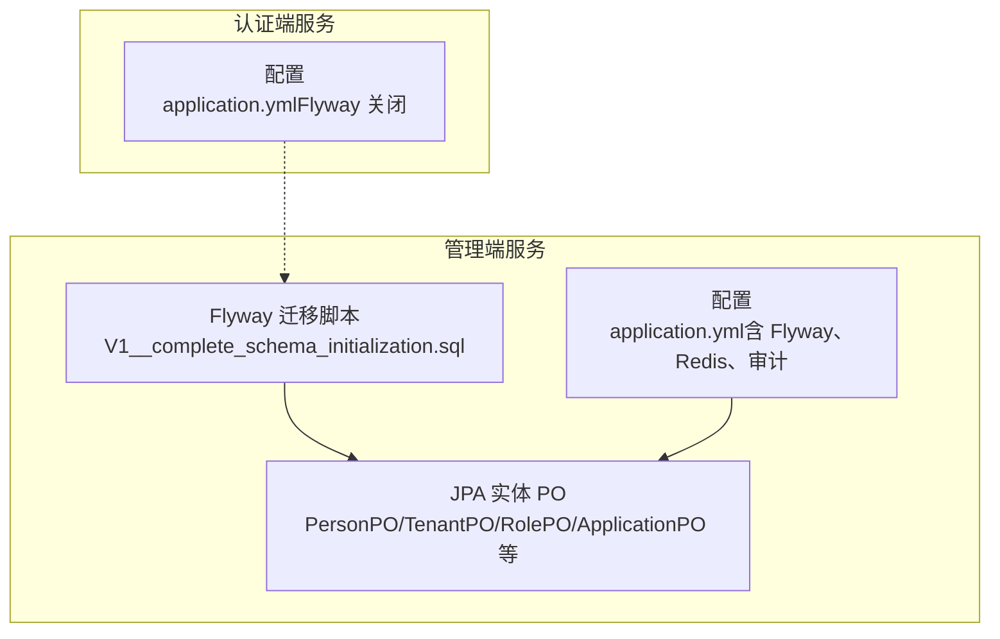
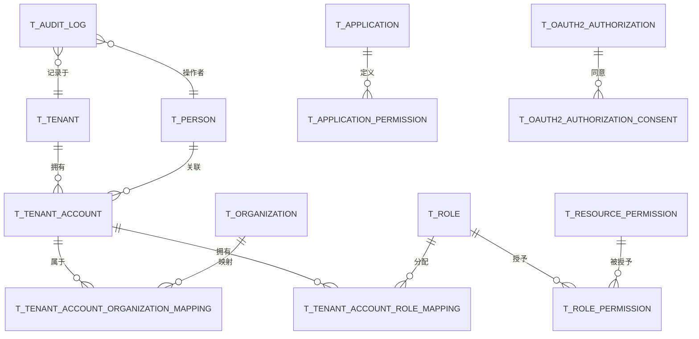
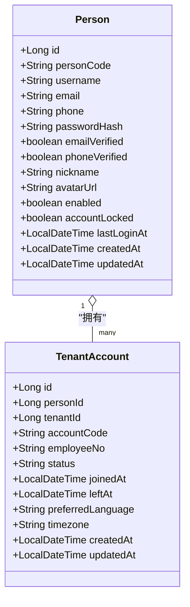
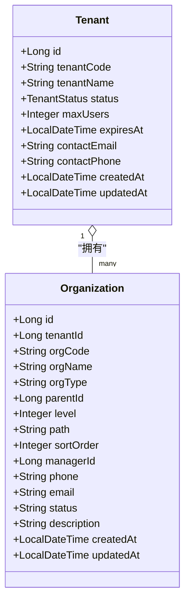
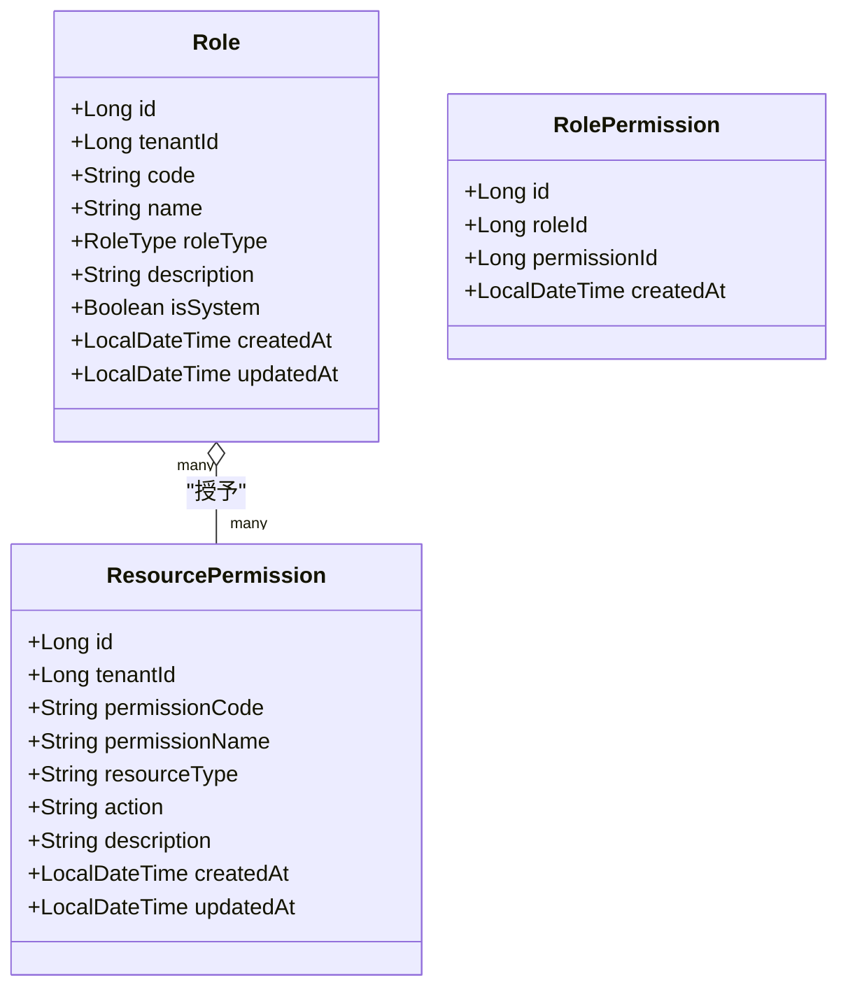
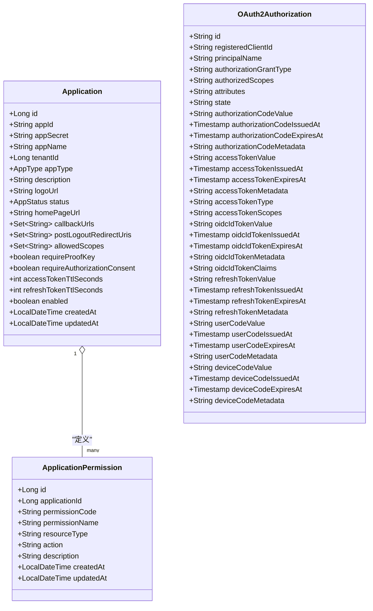
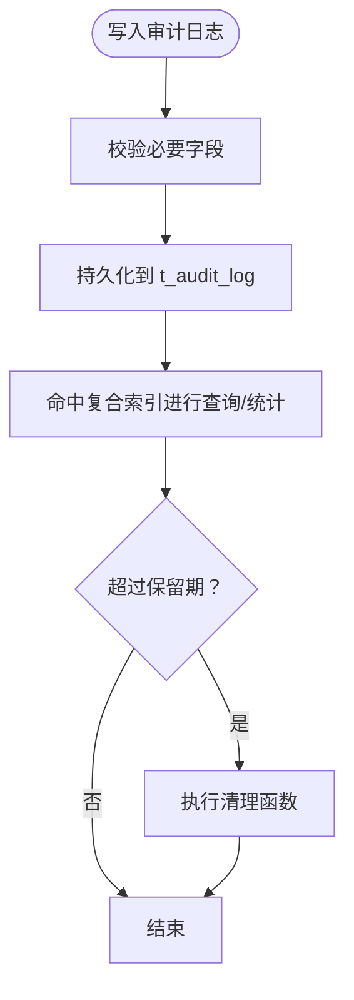
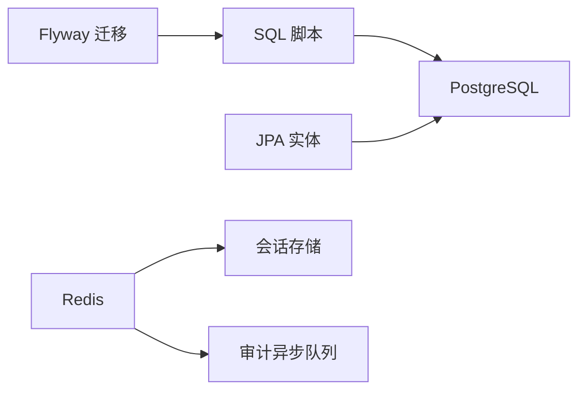

# 数据库设计

<cite>
**本文引用的文件**
- [V1__complete_schema_initialization.sql](file://iam-admin-server/src/main/resources/db/migration/V1__complete_schema_initialization.sql)
- [Person.java](file://iam-admin-server/src/main/java/iam/platform/admin/domain/model/entity/Person.java)
- [Tenant.java](file://iam-admin-server/src/main/java/iam/platform/admin/domain/model/entity/Tenant.java)
- [Role.java](file://iam-admin-server/src/main/java/iam/platform/admin/domain/model/entity/Role.java)
- [Application.java](file://iam-admin-server/src/main/java/iam/platform/admin/domain/model/entity/Application.java)
- [PersonPO.java](file://iam-admin-server/src/main/java/iam/platform/admin/infrastructure/persistence/entity/PersonPO.java)
- [TenantPO.java](file://iam-admin-server/src/main/java/iam/platform/admin/infrastructure/persistence/entity/TenantPO.java)
- [RolePO.java](file://iam-admin-server/src/main/java/iam/platform/admin/infrastructure/persistence/entity/RolePO.java)
- [ApplicationPO.java](file://iam-admin-server/src/main/java/iam/platform/admin/infrastructure/persistence/entity/ApplicationPO.java)
- [OrganizationPO.java](file://iam-admin-server/src/main/java/iam/platform/admin/infrastructure/persistence/entity/OrganizationPO.java)
- [TenantAccountPO.java](file://iam-admin-server/src/main/java/iam/platform/admin/infrastructure/persistence/entity/TenantAccountPO.java)
- [AuditLogPO.java](file://iam-admin-server/src/main/java/iam/platform/admin/infrastructure/persistence/entity/AuditLogPO.java)
- [application.yml（管理端）](file://iam-admin-server/src/main/resources/application.yml)
- [application.yml（认证端）](file://iam-auth-server/src/main/resources/application.yml)
</cite>

## 目录
1. [简介](#简介)
2. [项目结构](#项目结构)
3. [核心组件](#核心组件)
4. [架构总览](#架构总览)
5. [详细组件分析](#详细组件分析)
6. [依赖分析](#依赖分析)
7. [性能考量](#性能考量)
8. [故障排查指南](#故障排查指南)
9. [结论](#结论)
10. [附录](#附录)

## 简介
本文件系统化梳理 IAM 平台数据库设计，覆盖架构设计、表结构、实体关系、数据模型、迁移策略（Flyway）、数据访问模式、缓存策略、性能优化、主外键与索引约束、数据校验与业务规则、数据生命周期与归档、安全与隐私、以及迁移路径与版本管理策略。目标是帮助开发者与运维人员快速理解并高效维护数据库层。

## 项目结构
数据库相关的核心文件集中在管理端模块的 Flyway 迁移脚本与 JPA 实体定义中：
- 迁移脚本：iam-admin-server/src/main/resources/db/migration/V1__complete_schema_initialization.sql
- JPA 实体：iam-admin-server/src/main/java/.../infrastructure/persistence/entity 下的各 PO 类
- 配置文件：两个服务的 application.yml 中包含 Flyway、数据源、Redis、审计等配置

**图示来源**
- [V1__complete_schema_initialization.sql](file://iam-admin-server/src/main/resources/db/migration/V1__complete_schema_initialization.sql)
- [PersonPO.java](file://iam-admin-server/src/main/java/iam/platform/admin/infrastructure/persistence/entity/PersonPO.java)
- [TenantPO.java](file://iam-admin-server/src/main/java/iam/platform/admin/infrastructure/persistence/entity/TenantPO.java)
- [RolePO.java](file://iam-admin-server/src/main/java/iam/platform/admin/infrastructure/persistence/entity/RolePO.java)
- [ApplicationPO.java](file://iam-admin-server/src/main/java/iam/platform/admin/infrastructure/persistence/entity/ApplicationPO.java)
- [application.yml（管理端）](file://iam-admin-server/src/main/resources/application.yml)
- [application.yml（认证端）](file://iam-auth-server/src/main/resources/application.yml)

**章节来源**
- [V1__complete_schema_initialization.sql](file://iam-admin-server/src/main/resources/db/migration/V1__complete_schema_initialization.sql)
- [application.yml（管理端）](file://iam-admin-server/src/main/resources/application.yml)
- [application.yml（认证端）](file://iam-auth-server/src/main/resources/application.yml)

## 核心组件
- 用户与身份
  - Person（自然人全局身份）、TenantAccount（租户内账户）
- 多租户与组织
  - Tenant（租户）、Organization（组织树）
- 权限与角色
  - Role（角色）、ResourcePermission（资源级权限）、RolePermission（角色-权限映射）
- 应用与授权
  - Application（应用）、ApplicationPermission（应用级权限）
- 审计与会话
  - AuditLog（审计日志）、OAuth2 授权表（Spring Authorization Server）

**章节来源**
- [Person.java](file://iam-admin-server/src/main/java/iam/platform/admin/domain/model/entity/Person.java)
- [Tenant.java](file://iam-admin-server/src/main/java/iam/platform/admin/domain/model/entity/Tenant.java)
- [Role.java](file://iam-admin-server/src/main/java/iam/platform/admin/domain/model/entity/Role.java)
- [Application.java](file://iam-admin-server/src/main/java/iam/platform/admin/domain/model/entity/Application.java)
- [PersonPO.java](file://iam-admin-server/src/main/java/iam/platform/admin/infrastructure/persistence/entity/PersonPO.java)
- [TenantPO.java](file://iam-admin-server/src/main/java/iam/platform/admin/infrastructure/persistence/entity/TenantPO.java)
- [RolePO.java](file://iam-admin-server/src/main/java/iam/platform/admin/infrastructure/persistence/entity/RolePO.java)
- [ApplicationPO.java](file://iam-admin-server/src/main/java/iam/platform/admin/infrastructure/persistence/entity/ApplicationPO.java)
- [OrganizationPO.java](file://iam-admin-server/src/main/java/iam/platform/admin/infrastructure/persistence/entity/OrganizationPO.java)
- [TenantAccountPO.java](file://iam-admin-server/src/main/java/iam/platform/admin/infrastructure/persistence/entity/TenantAccountPO.java)
- [AuditLogPO.java](file://iam-admin-server/src/main/java/iam/platform/admin/infrastructure/persistence/entity/AuditLogPO.java)

## 架构总览
数据库采用 PostgreSQL，通过 Flyway 在管理端进行统一迁移；JPA 实体映射到 t_* 表，配合索引与触发器保障一致性与查询效率。认证端使用 Spring Authorization Server 的授权表存储 OAuth2 会话与同意信息。

**图示来源**
- [V1__complete_schema_initialization.sql](file://iam-admin-server/src/main/resources/db/migration/V1__complete_schema_initialization.sql)

## 详细组件分析

### 用户与身份：Person 与 TenantAccount
- 设计要点
  - Person 提供全局唯一标识（person_code）与登录名（username），支持邮箱/手机唯一性约束（可空但唯一索引）
  - TenantAccount 将 Person 映射到具体租户内的账户，支持员工号唯一性与状态管理
- 字段与约束
  - 唯一索引：person_code、username、email（非空时唯一）、phone（非空时唯一）
  - 时间戳：created_at、updated_at 由触发器自动更新
- 业务规则
  - 账户启用/锁定、邮箱/手机验证标记、最后登录时间
- 实体映射
  - JPA 实体字段与数据库列一一对应，注解声明长度、是否为空、唯一性

**图示来源**
- [Person.java](file://iam-admin-server/src/main/java/iam/platform/admin/domain/model/entity/Person.java)
- [TenantAccountPO.java](file://iam-admin-server/src/main/java/iam/platform/admin/infrastructure/persistence/entity/TenantAccountPO.java)
- [V1__complete_schema_initialization.sql](file://iam-admin-server/src/main/resources/db/migration/V1__complete_schema_initialization.sql)

**章节来源**
- [Person.java](file://iam-admin-server/src/main/java/iam/platform/admin/domain/model/entity/Person.java)
- [Tenant.java](file://iam-admin-server/src/main/java/iam/platform/admin/domain/model/entity/Tenant.java)
- [PersonPO.java](file://iam-admin-server/src/main/java/iam/platform/admin/infrastructure/persistence/entity/PersonPO.java)
- [TenantAccountPO.java](file://iam-admin-server/src/main/java/iam/platform/admin/infrastructure/persistence/entity/TenantAccountPO.java)
- [V1__complete_schema_initialization.sql](file://iam-admin-server/src/main/resources/db/migration/V1__complete_schema_initialization.sql)

### 租户与组织：Tenant 与 Organization
- 设计要点
  - Tenant 支持状态机（ACTIVE/SUSPENDED/DELETED）、到期时间、最大用户数
  - Organization 采用“物化路径”+层级+父子关系，支持经理、排序、状态
- 字段与约束
  - 唯一索引：tenant_code、(tenant_id, org_code)
  - 复合索引：parent_id、path、level、manager_id
- 业务规则
  - 组织树结构、唯一主部门约束（通过映射表唯一索引实现）

**图示来源**
- [Tenant.java](file://iam-admin-server/src/main/java/iam/platform/admin/domain/model/entity/Tenant.java)
- [OrganizationPO.java](file://iam-admin-server/src/main/java/iam/platform/admin/infrastructure/persistence/entity/OrganizationPO.java)
- [V1__complete_schema_initialization.sql](file://iam-admin-server/src/main/resources/db/migration/V1__complete_schema_initialization.sql)

**章节来源**
- [Tenant.java](file://iam-admin-server/src/main/java/iam/platform/admin/domain/model/entity/Tenant.java)
- [OrganizationPO.java](file://iam-admin-server/src/main/java/iam/platform/admin/infrastructure/persistence/entity/OrganizationPO.java)
- [V1__complete_schema_initialization.sql](file://iam-admin-server/src/main/resources/db/migration/V1__complete_schema_initialization.sql)

### 角色与权限：Role、ResourcePermission、RolePermission
- 设计要点
  - 全局角色与租户自定义角色区分（role_type、tenant_id）
  - 资源级权限（tenant_id 可空表示全局）
  - 角色-权限多对多映射
- 字段与约束
  - 唯一索引：role.code、(application_id, permission_code)、(tenant_id, permission_code)
  - 复合索引：role_id、permission_id
- 业务规则
  - 系统内置角色不可删除；全局角色继承 READ 权限时需按 action 过滤

**图示来源**
- [Role.java](file://iam-admin-server/src/main/java/iam/platform/admin/domain/model/entity/Role.java)
- [RolePO.java](file://iam-admin-server/src/main/java/iam/platform/admin/infrastructure/persistence/entity/RolePO.java)
- [V1__complete_schema_initialization.sql](file://iam-admin-server/src/main/resources/db/migration/V1__complete_schema_initialization.sql)

**章节来源**
- [Role.java](file://iam-admin-server/src/main/java/iam/platform/admin/domain/model/entity/Role.java)
- [RolePO.java](file://iam-admin-server/src/main/java/iam/platform/admin/infrastructure/persistence/entity/RolePO.java)
- [V1__complete_schema_initialization.sql](file://iam-admin-server/src/main/resources/db/migration/V1__complete_schema_initialization.sql)

### 应用与授权：Application、ApplicationPermission、OAuth2 表
- 设计要点
  - Application 升级自 OAuth2 Client，扩展回调地址、作用域、令牌有效期等
  - 应用级权限与资源级权限分离
  - 使用 Spring Authorization Server 表存储授权码、访问令牌、ID Token、刷新令牌与同意信息
- 字段与约束
  - 唯一索引：app_id、status、app_type
  - 复合索引：registered_client_id、principal_name、access_token、refresh_token
- 业务规则
  - PKCE 与授权同意开关；令牌 TTL 可配置

**图示来源**
- [Application.java](file://iam-admin-server/src/main/java/iam/platform/admin/domain/model/entity/Application.java)
- [ApplicationPO.java](file://iam-admin-server/src/main/java/iam/platform/admin/infrastructure/persistence/entity/ApplicationPO.java)
- [V1__complete_schema_initialization.sql](file://iam-admin-server/src/main/resources/db/migration/V1__complete_schema_initialization.sql)

**章节来源**
- [Application.java](file://iam-admin-server/src/main/java/iam/platform/admin/domain/model/entity/Application.java)
- [ApplicationPO.java](file://iam-admin-server/src/main/java/iam/platform/admin/infrastructure/persistence/entity/ApplicationPO.java)
- [V1__complete_schema_initialization.sql](file://iam-admin-server/src/main/resources/db/migration/V1__complete_schema_initialization.sql)

### 审计日志：AuditLog
- 设计要点
  - 记录事件类型、类别、资源、结果、错误信息、请求参数（敏感信息脱敏）
  - 多维索引支持高并发查询与统计
- 字段与约束
  - 复合索引：tenant_id、event_category、created_at；resource_type+resource_id；person_id；event_type 等
  - 提供清理函数按保留天数清理过期审计日志
- 业务规则
  - 保留周期可配置（默认 180 天）

**图示来源**
- [AuditLogPO.java](file://iam-admin-server/src/main/java/iam/platform/admin/infrastructure/persistence/entity/AuditLogPO.java)
- [V1__complete_schema_initialization.sql](file://iam-admin-server/src/main/resources/db/migration/V1__complete_schema_initialization.sql)

**章节来源**
- [AuditLogPO.java](file://iam-admin-server/src/main/java/iam/platform/admin/infrastructure/persistence/entity/AuditLogPO.java)
- [V1__complete_schema_initialization.sql](file://iam-admin-server/src/main/resources/db/migration/V1__complete_schema_initialization.sql)

## 依赖分析
- 迁移与版本管理
  - 管理端启用 Flyway，迁移脚本位于 classpath:db/migration，按顺序执行
  - 认证端关闭 Flyway，数据库初始化由管理端统一负责
- 数据访问与缓存
  - JPA 实体映射 t_* 表，Hibernate 自动维护 created_at/updated_at
  - Redis 用于会话存储与审计异步处理
- 外部依赖
  - PostgreSQL 作为主数据库
  - Spring Authorization Server 授权表用于 OAuth2 生命周期管理

**图示来源**
- [application.yml（管理端）](file://iam-admin-server/src/main/resources/application.yml)
- [application.yml（认证端）](file://iam-auth-server/src/main/resources/application.yml)

**章节来源**
- [application.yml（管理端）](file://iam-admin-server/src/main/resources/application.yml)
- [application.yml（认证端）](file://iam-auth-server/src/main/resources/application.yml)

## 性能考量
- 索引策略
  - 高选择性列建立单列索引：username、email、phone、app_id、tenant_code、org_code
  - 复合索引：(tenant_id, event_category, created_at)、(resource_type, resource_id)、(tenant_account_id, organization_id)
  - 物化路径与层级索引：path、level、parent_id、manager_id
- 触发器与时间戳
  - update_updated_at_column 触发器统一更新 updated_at，避免遗漏
- 查询优化建议
  - 审计日志查询优先使用复合索引
  - 分页查询时尽量基于索引列排序
  - 对高频过滤条件（status、type、tenant_id）保持索引
- 缓存策略
  - Redis 会话存储减少数据库压力
  - 审计日志异步写入，降低写放大

[本节为通用性能指导，无需特定文件引用]

## 故障排查指南
- Flyway 迁移失败
  - 检查迁移脚本是否在管理端正确部署且顺序无误
  - 确认数据库连接、用户权限与编码设置
- 审计日志异常
  - 查看审计保留天数配置与清理函数执行情况
  - 检查 Redis 连接与异步队列容量
- 登录与会话问题
  - 确认 Redis 会话存储可用
  - 核对 OAuth2 授权表中的令牌有效期与状态

**章节来源**
- [application.yml（管理端）](file://iam-admin-server/src/main/resources/application.yml)
- [application.yml（认证端）](file://iam-auth-server/src/main/resources/application.yml)

## 结论
该数据库设计以 Flyway 统一迁移、JPA 实体映射为核心，围绕用户、租户、组织、角色、权限、应用与审计构建了完整的多租户 IAM 数据模型。通过合理的索引、触发器与缓存策略，兼顾了查询性能与写入一致性。建议在生产环境持续监控审计日志清理与 Redis 异步队列，确保系统长期稳定运行。

## 附录

### 数据库迁移策略与版本管理
- 迁移工具：Flyway
- 启用位置：管理端 application.yml 中开启 flyway，并指定迁移脚本位置为 classpath:db/migration
- 执行顺序：按文件名顺序执行（当前仅包含 V1）
- 认证端：Flyway 关闭，不参与迁移

**章节来源**
- [application.yml（管理端）](file://iam-admin-server/src/main/resources/application.yml)
- [application.yml（认证端）](file://iam-auth-server/src/main/resources/application.yml)

### 主键、外键、索引与约束设计原则
- 主键
  - 使用自增序列（BIGSERIAL 或 IDENTITY）保证唯一性
- 外键
  - 明确引用关系，如 t_tenant_account.person_id → t_person.id
- 索引
  - 唯一索引：username、email（非空时唯一）、phone（非空时唯一）、tenant_code、app_id、(tenant_id, account_code)、(tenant_id, org_code)、(application_id, permission_code)、(tenant_id, permission_code)
  - 复合索引：(tenant_id, event_category, created_at)、(resource_type, resource_id)、(tenant_account_id, organization_id)、(role_id, permission_id)
- 约束
  - NOT NULL、UNIQUE、CHECK（如 status 枚举值）、枚举类型（如 role_type、app_type、event_category）

**章节来源**
- [V1__complete_schema_initialization.sql](file://iam-admin-server/src/main/resources/db/migration/V1__complete_schema_initialization.sql)

### 数据验证规则与业务规则
- 用户与账户
  - 唯一性：person_code、username、email（非空）、phone（非空）
  - 状态：enabled、account_locked；验证标志：email_verified、phone_verified
- 租户
  - 状态机：ACTIVE/SUSPENDED/DELETED；到期检查
- 组织
  - 物化路径与层级；唯一主部门（映射表唯一索引）
- 角色与权限
  - 系统内置角色不可删除；全局角色继承 READ 权限
- 应用
  - 回调地址、作用域、PKCE 与同意开关；令牌 TTL 可配置

**章节来源**
- [Person.java](file://iam-admin-server/src/main/java/iam/platform/admin/domain/model/entity/Person.java)
- [Tenant.java](file://iam-admin-server/src/main/java/iam/platform/admin/domain/model/entity/Tenant.java)
- [Role.java](file://iam-admin-server/src/main/java/iam/platform/admin/domain/model/entity/Role.java)
- [Application.java](file://iam-admin-server/src/main/java/iam/platform/admin/domain/model/entity/Application.java)
- [V1__complete_schema_initialization.sql](file://iam-admin-server/src/main/resources/db/migration/V1__complete_schema_initialization.sql)

### 数据生命周期、保留策略与归档规则
- 审计日志
  - 默认保留 180 天，提供清理函数按保留天数删除过期记录
- 其他表
  - 当前脚本未定义其他表的自动清理逻辑，建议结合业务需求制定策略

**章节来源**
- [V1__complete_schema_initialization.sql](file://iam-admin-server/src/main/resources/db/migration/V1__complete_schema_initialization.sql)
- [application.yml（管理端）](file://iam-admin-server/src/main/resources/application.yml)

### 数据安全、隐私与访问控制
- 敏感字段
  - 密码哈希：存储哈希值，不保存明文
  - 应用密钥：使用 EncryptedStringConverter 加密存储
  - 外部登录令牌：加密存储 access_token/refresh_token
- 访问控制
  - 审计日志记录关键操作与结果，便于追踪
  - Redis 会话存储与命名空间隔离

**章节来源**
- [ApplicationPO.java](file://iam-admin-server/src/main/java/iam/platform/admin/infrastructure/persistence/entity/ApplicationPO.java)
- [V1__complete_schema_initialization.sql](file://iam-admin-server/src/main/resources/db/migration/V1__complete_schema_initialization.sql)
- [application.yml（管理端）](file://iam-admin-server/src/main/resources/application.yml)

### 示例数据
- 默认角色：ROLE_USER、ROLE_ADMIN
- 默认租户：id=1，tenant_code='default'
- 系统权限：用户、租户、组织、角色、应用、权限、审计相关基础权限
- 管理员账户：admin（同时存在于 legacy t_user 与新模型 t_person/t_tenant_account）

**章节来源**
- [V1__complete_schema_initialization.sql](file://iam-admin-server/src/main/resources/db/migration/V1__complete_schema_initialization.sql)