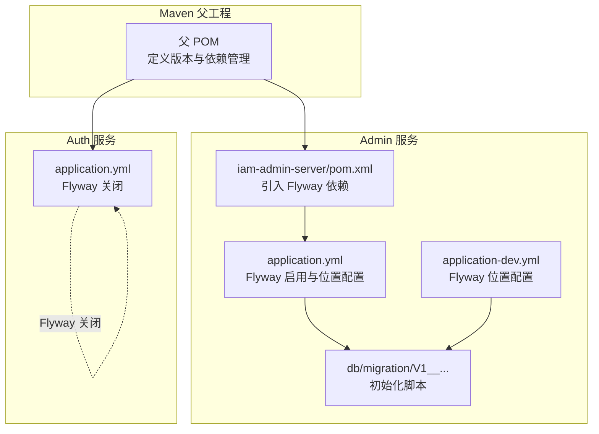
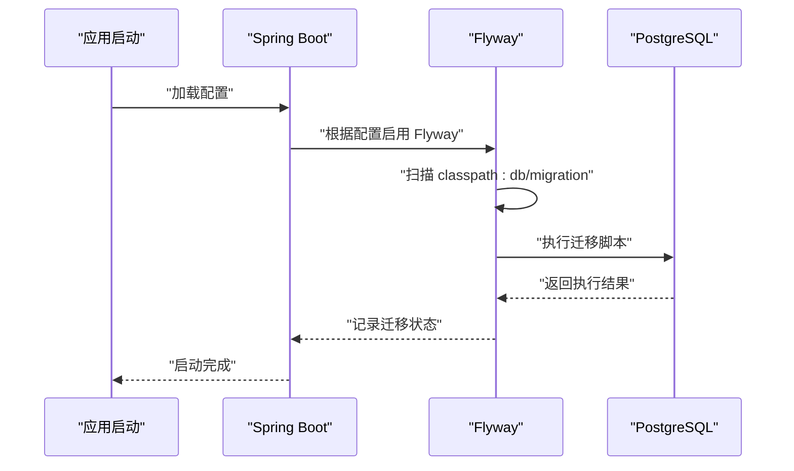
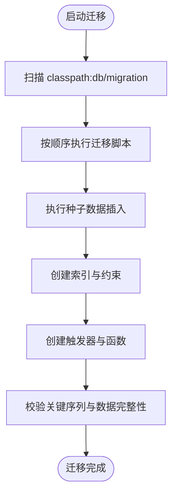
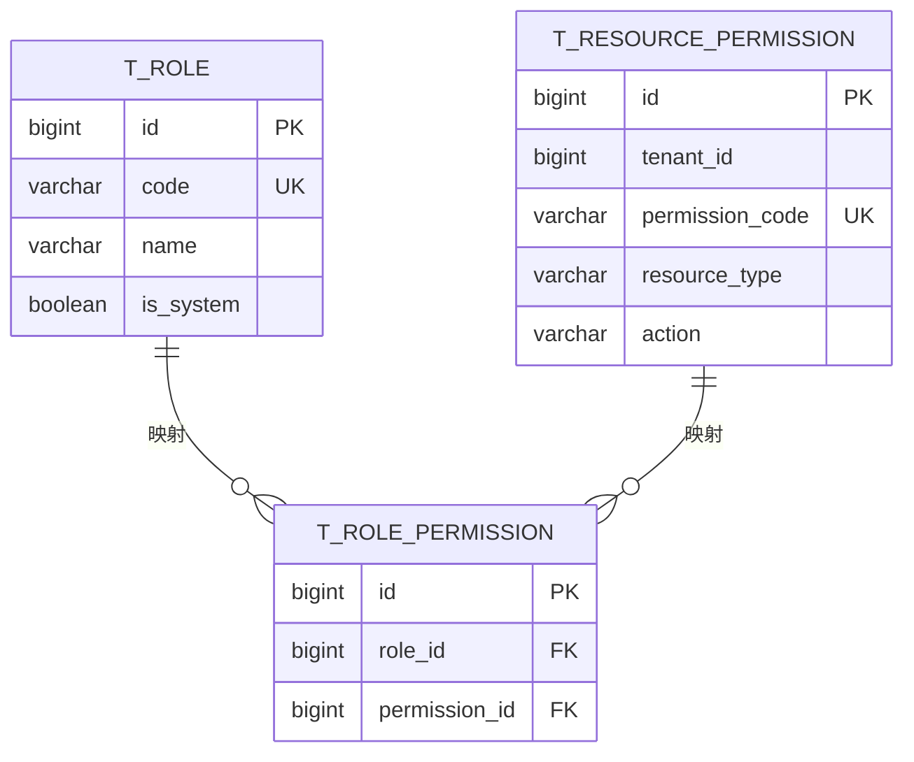
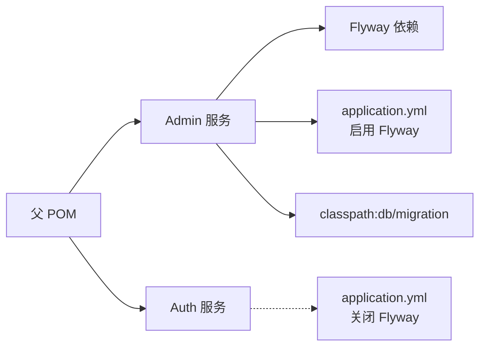

# 数据迁移策略

<cite>
**本文引用的文件**
- [pom.xml](file://pom.xml)
- [iam-admin-server/pom.xml](file://iam-admin-server/pom.xml)
- [iam-admin-server/src/main/resources/application.yml](file://iam-admin-server/src/main/resources/application.yml)
- [iam-admin-server/src/main/resources/application-dev.yml](file://iam-admin-server/src/main/resources/application-dev.yml)
- [iam-auth-server/src/main/resources/application.yml](file://iam-auth-server/src/main/resources/application.yml)
- [iam-admin-server/src/main/resources/db/migration/V1__complete_schema_initialization.sql](file://iam-admin-server/src/main/resources/db/migration/V1__complete_schema_initialization.sql)
- [README.md](file://README.md)
</cite>

## 目录
1. [简介](#简介)
2. [项目结构](#项目结构)
3. [核心组件](#核心组件)
4. [架构总览](#架构总览)
5. [详细组件分析](#详细组件分析)
6. [依赖关系分析](#依赖关系分析)
7. [性能考量](#性能考量)
8. [故障排查指南](#故障排查指南)
9. [结论](#结论)
10. [附录](#附录)

## 简介
本文件系统化阐述 IAM 平台的数据迁移策略，重点覆盖：
- Flyway 集成与配置
- 迁移脚本组织与版本管理
- 数据库版本演进路径与兼容性保障
- 种子数据管理（默认角色、系统权限、初始用户）
- 数据一致性保障（事务边界、约束检查、数据校验）
- 迁移监控与故障恢复
- 生产环境迁移指南（预生产验证、流量切换、备份策略）

## 项目结构
IAM 平台采用多模块 Maven 结构，数据库迁移由 Admin 服务负责，认证服务不主动执行迁移。Flyway 默认启用在 Admin 服务中，迁移脚本位于 classpath:db/migration。

**图表来源**
- [pom.xml:1-226](file://pom.xml#L1-L226)
- [iam-admin-server/pom.xml:1-150](file://iam-admin-server/pom.xml#L1-L150)
- [iam-admin-server/src/main/resources/application.yml:38-41](file://iam-admin-server/src/main/resources/application.yml#L38-L41)
- [iam-admin-server/src/main/resources/application-dev.yml:8](file://iam-admin-server/src/main/resources/application-dev.yml#L8)
- [iam-auth-server/src/main/resources/application.yml:38-39](file://iam-auth-server/src/main/resources/application.yml#L38-L39)

**章节来源**
- [pom.xml:1-226](file://pom.xml#L1-L226)
- [iam-admin-server/pom.xml:77-80](file://iam-admin-server/pom.xml#L77-L80)
- [iam-admin-server/src/main/resources/application.yml:38-41](file://iam-admin-server/src/main/resources/application.yml#L38-L41)
- [iam-admin-server/src/main/resources/application-dev.yml:8](file://iam-admin-server/src/main/resources/application-dev.yml#L8)
- [iam-auth-server/src/main/resources/application.yml:38-39](file://iam-auth-server/src/main/resources/application.yml#L38-L39)

## 核心组件
- Flyway 集成
  - Admin 服务显式引入 flyway-core 依赖，并在 application.yml 中启用 Flyway，指定迁移脚本位置为 classpath:db/migration。
  - Auth 服务 application.yml 显式关闭 Flyway，避免重复迁移。
- 迁移脚本组织
  - 当前仓库仅包含 V1 初始化脚本，用于一次性完成完整 schema 的初始化与种子数据注入。
  - README 提及历史脚本命名（如 V1__init_schema.sql、V2__seed_default_roles.sql），但实际资源目录中仅存在 V1 脚本。
- 版本管理策略
  - 采用单文件 V1 脚本合并历史多版本，简化版本演进路径；后续演进建议遵循语义化版本命名与幂等设计。

**章节来源**
- [iam-admin-server/pom.xml:77-80](file://iam-admin-server/pom.xml#L77-L80)
- [iam-admin-server/src/main/resources/application.yml:38-41](file://iam-admin-server/src/main/resources/application.yml#L38-L41)
- [iam-auth-server/src/main/resources/application.yml:38-39](file://iam-auth-server/src/main/resources/application.yml#L38-L39)
- [README.md:171-182](file://README.md#L171-L182)
- [iam-admin-server/src/main/resources/db/migration/V1__complete_schema_initialization.sql:1-720](file://iam-admin-server/src/main/resources/db/migration/V1__complete_schema_initialization.sql#L1-L720)

## 架构总览
下图展示迁移执行的关键路径：应用启动时由 Spring Boot 自动触发 Flyway 执行迁移，读取 classpath 下的迁移脚本并按顺序应用。

**图表来源**
- [iam-admin-server/src/main/resources/application.yml:38-41](file://iam-admin-server/src/main/resources/application.yml#L38-L41)
- [iam-admin-server/src/main/resources/application-dev.yml:8](file://iam-admin-server/src/main/resources/application-dev.yml#L8)

## 详细组件分析

### 迁移脚本组织与版本管理
- 当前版本演进
  - V1：一次性完成 schema 初始化与种子数据注入，包含触发器、函数、核心表、OAuth2 授权表、多租户表、组织与权限表、审计日志表以及默认角色、系统权限、初始用户等。
- 版本命名与演进建议
  - 建议后续版本采用 V2、V3…顺序命名，保持每个版本脚本的最小变更与幂等性，确保可回滚与可重复执行。
  - 对于破坏性变更，应提供升级与降级脚本对称设计，配合灰度发布与回滚预案。

**章节来源**
- [iam-admin-server/src/main/resources/db/migration/V1__complete_schema_initialization.sql:1-720](file://iam-admin-server/src/main/resources/db/migration/V1__complete_schema_initialization.sql#L1-L720)
- [README.md:171-182](file://README.md#L171-L182)

### 数据库版本演进与兼容性
- V1 覆盖范围
  - 核心实体：角色、人员、租户、租户账户、组织、应用、权限、审计日志等。
  - OAuth2 授权存储：oauth2_authorization、oauth2_authorization_consent。
  - 兼容性设计：保留 legacy 表（如 t_user、t_user_role）以兼容旧模型，同时引入新模型（t_person、t_tenant_account）并建立映射。
- 兼容性保障措施
  - 使用 ON CONFLICT DO NOTHING 避免重复插入种子数据。
  - 通过序列重置（setval）保证主键连续性与一致性。
  - 触发器自动维护 updated_at 字段，确保审计与一致性。

**图表来源**
- [iam-admin-server/src/main/resources/application.yml:38-41](file://iam-admin-server/src/main/resources/application.yml#L38-L41)
- [iam-admin-server/src/main/resources/db/migration/V1__complete_schema_initialization.sql:580-720](file://iam-admin-server/src/main/resources/db/migration/V1__complete_schema_initialization.sql#L580-L720)

**章节来源**
- [iam-admin-server/src/main/resources/db/migration/V1__complete_schema_initialization.sql:25-50](file://iam-admin-server/src/main/resources/db/migration/V1__complete_schema_initialization.sql#L25-L50)
- [iam-admin-server/src/main/resources/db/migration/V1__complete_schema_initialization.sql:580-720](file://iam-admin-server/src/main/resources/db/migration/V1__complete_schema_initialization.sql#L580-L720)

### 种子数据管理
- 默认角色
  - ROLE_USER、ROLE_ADMIN，标记为系统内置，不可删除。
- 系统权限
  - 全局权限集合（user、tenant、org、role、app、permission、audit 等），限定 tenant_id 为空。
- 初始用户
  - 旧模型：admin 用户（legacy t_user）。
  - 新模型：admin person 与对应租户账户（t_person、t_tenant_account），并赋予 ROLE_ADMIN。
- 种子数据策略
  - 使用 ON CONFLICT DO NOTHING 防止重复导入。
  - 通过 setval 重置序列，确保主键连续与一致性。
  - 将权限与角色映射批量插入，保证默认角色具备预期权限集。

**图表来源**
- [iam-admin-server/src/main/resources/db/migration/V1__complete_schema_initialization.sql:580-720](file://iam-admin-server/src/main/resources/db/migration/V1__complete_schema_initialization.sql#L580-L720)

**章节来源**
- [iam-admin-server/src/main/resources/db/migration/V1__complete_schema_initialization.sql:580-720](file://iam-admin-server/src/main/resources/db/migration/V1__complete_schema_initialization.sql#L580-L720)

### 数据一致性保障
- 事务边界
  - Flyway 在单个迁移脚本内按顺序执行，失败时整体回滚，确保原子性。
- 约束检查
  - 唯一索引与外键约束确保数据完整性（如角色编码唯一、人员唯一标识唯一、租户账户唯一等）。
- 数据验证
  - 触发器自动更新 updated_at，审计日志表记录关键操作，便于事后追溯。
  - 审计日志清理函数按保留期定期清理过期记录。

**章节来源**
- [iam-admin-server/src/main/resources/db/migration/V1__complete_schema_initialization.sql:25-50](file://iam-admin-server/src/main/resources/db/migration/V1__complete_schema_initialization.sql#L25-L50)
- [iam-admin-server/src/main/resources/db/migration/V1__complete_schema_initialization.sql:514-577](file://iam-admin-server/src/main/resources/db/migration/V1__complete_schema_initialization.sql#L514-L577)

### 迁移监控与故障恢复
- 迁移状态跟踪
  - Flyway 在数据库中维护迁移历史表，记录已执行版本与校验和，可用于状态核查。
- 错误处理
  - 迁移失败时，应定位具体脚本与错误信息，修复后重新执行。
- 手动干预机制
  - 可通过 Flyway CLI 或管理端点查看迁移状态，必要时进行回滚或补丁脚本处理。

**章节来源**
- [iam-admin-server/src/main/resources/application.yml:38-41](file://iam-admin-server/src/main/resources/application.yml#L38-L41)

## 依赖关系分析
- 模块间依赖
  - 父 POM 统一管理版本与依赖，Admin 服务引入 Flyway 依赖，Auth 服务关闭 Flyway。
- 配置耦合
  - Admin 服务通过 application.yml 指定 Flyway 位置，Dev 环境通过 application-dev.yml 覆盖位置。
  - Auth 服务关闭 Flyway，避免与 Admin 服务产生迁移冲突。

**图表来源**
- [pom.xml:1-226](file://pom.xml#L1-L226)
- [iam-admin-server/pom.xml:77-80](file://iam-admin-server/pom.xml#L77-L80)
- [iam-admin-server/src/main/resources/application.yml:38-41](file://iam-admin-server/src/main/resources/application.yml#L38-L41)
- [iam-auth-server/src/main/resources/application.yml:38-39](file://iam-auth-server/src/main/resources/application.yml#L38-L39)

**章节来源**
- [pom.xml:1-226](file://pom.xml#L1-L226)
- [iam-admin-server/pom.xml:77-80](file://iam-admin-server/pom.xml#L77-L80)
- [iam-admin-server/src/main/resources/application.yml:38-41](file://iam-admin-server/src/main/resources/application.yml#L38-L41)
- [iam-auth-server/src/main/resources/application.yml:38-39](file://iam-auth-server/src/main/resources/application.yml#L38-L39)

## 性能考量
- 迁移执行性能
  - 大型初始化脚本建议拆分为多个小版本，减少单次迁移时间窗口。
  - 合理设置数据库连接池参数，避免迁移期间锁竞争。
- 查询性能
  - V1 脚本已创建大量索引，建议在业务高峰期外执行迁移。
- 可观测性
  - 结合 Actuator 暴露的健康与指标端点，监控迁移前后数据库性能变化。

## 故障排查指南
- 常见问题
  - 迁移失败：检查具体错误日志，确认数据库连接、权限与脚本语法。
  - 重复执行：确认是否已存在迁移历史，避免重复插入种子数据。
  - 冲突迁移：确保 Admin 服务启用 Flyway，Auth 服务关闭 Flyway。
- 处理步骤
  - 查看迁移状态与历史记录。
  - 修复脚本后重新执行；必要时使用回滚与补丁脚本。
  - 回滚后验证数据一致性与权限映射。

**章节来源**
- [iam-admin-server/src/main/resources/application.yml:38-41](file://iam-admin-server/src/main/resources/application.yml#L38-L41)
- [iam-auth-server/src/main/resources/application.yml:38-39](file://iam-auth-server/src/main/resources/application.yml#L38-L39)

## 结论
IAM 平台当前采用单文件 V1 脚本完成数据库初始化与种子数据注入，Flyway 在 Admin 服务中启用，Auth 服务关闭以避免冲突。建议后续版本遵循最小变更、幂等与可回滚原则，完善迁移监控与故障恢复机制，确保生产环境的零停机与高可靠。

## 附录
- 生产环境迁移指南（建议流程）
  - 预生产验证
    - 在测试环境执行迁移，验证脚本与数据一致性。
    - 检查索引、约束与触发器是否生效。
  - 流量切换
    - 使用蓝绿或滚动发布，先迁移后切换流量。
    - 对于大表与长事务，分批处理并预留回滚窗口。
  - 数据备份
    - 迁移前进行逻辑备份，迁移后验证备份可用性。
  - 监控与告警
    - 关注迁移耗时、数据库连接池与慢查询。
    - 建立迁移失败告警与自动回滚机制。