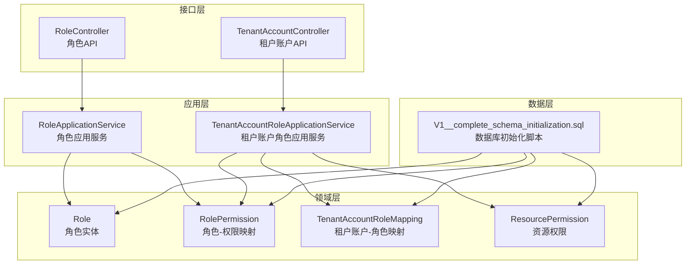
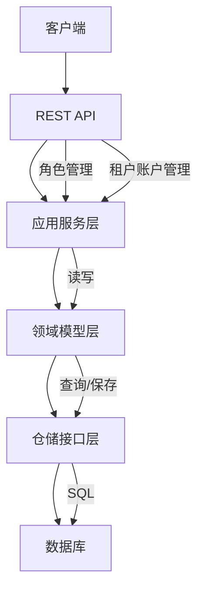
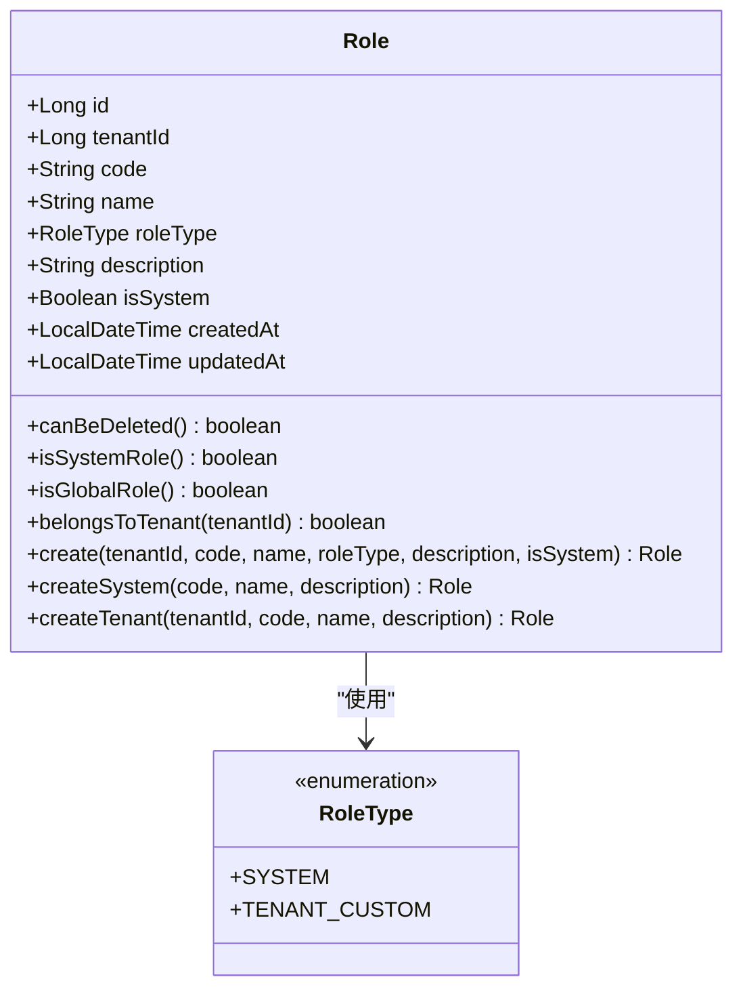
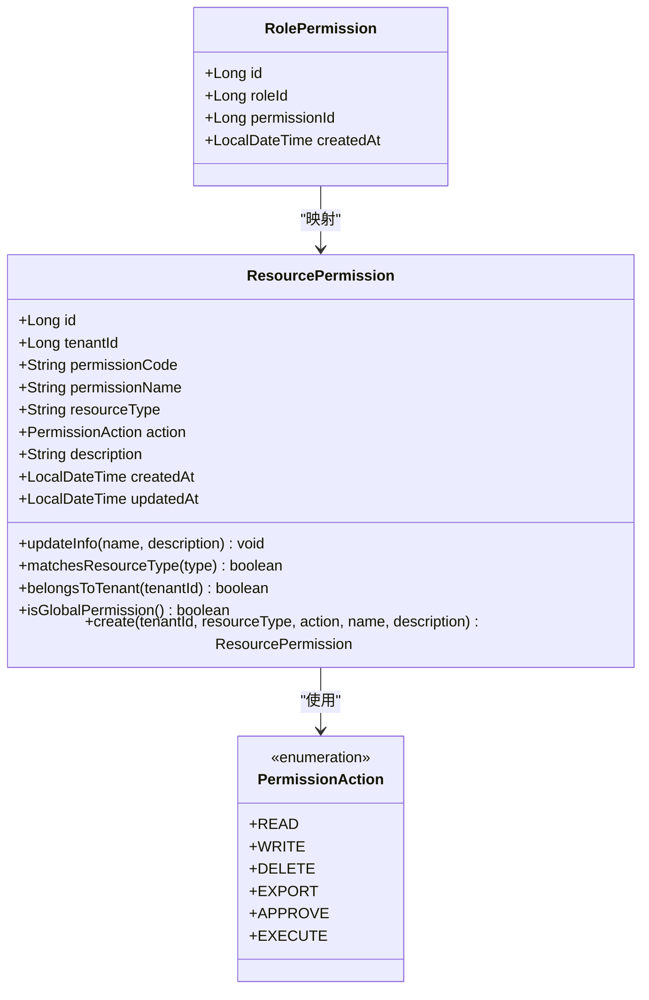
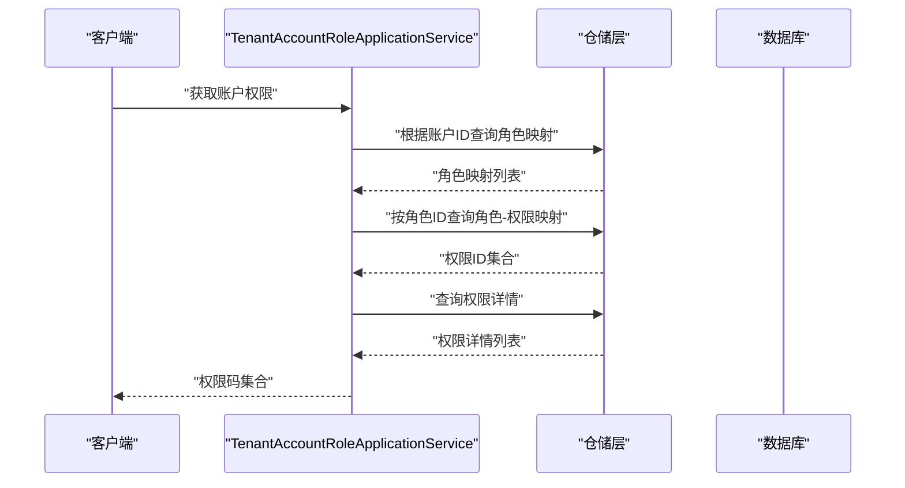
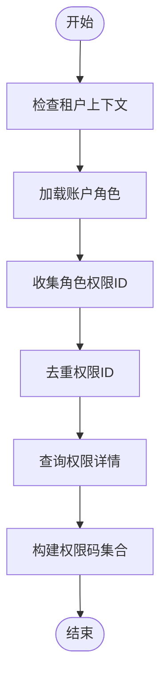
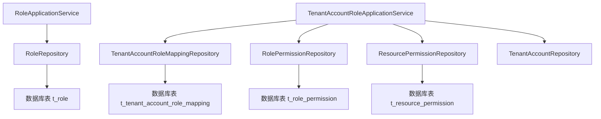
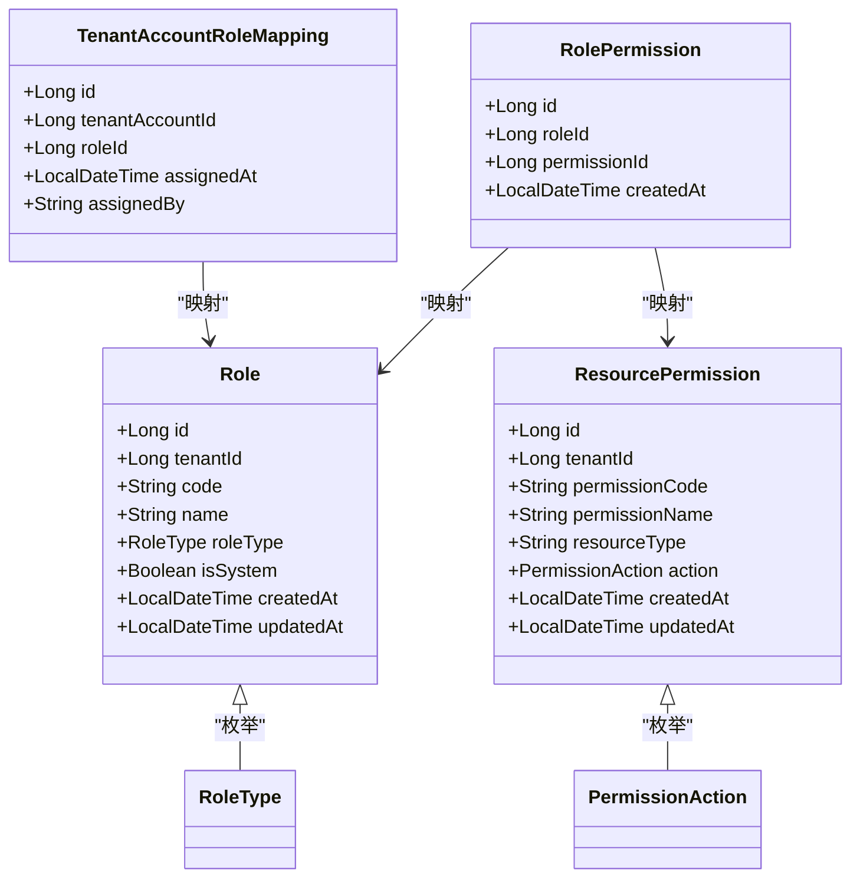
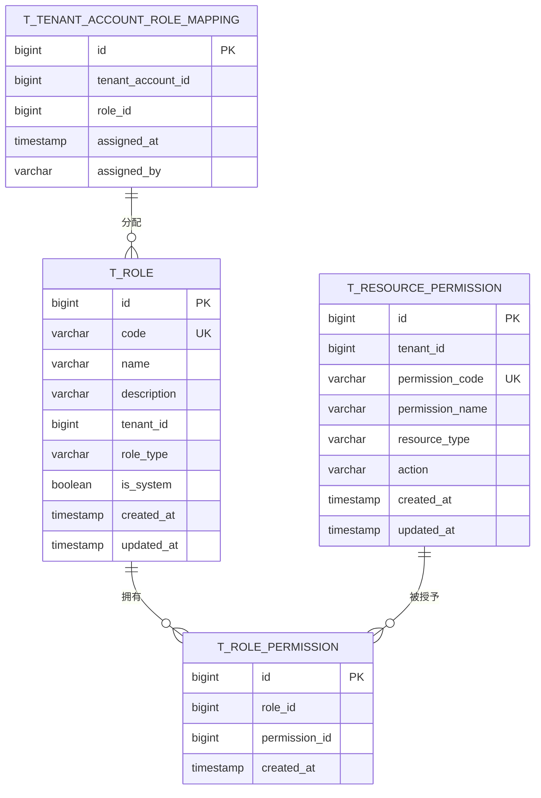

# RBAC框架设计

<cite>
**本文档引用的文件**
- [Role.java](file://iam-admin-server/src/main/java/iam/platform/admin/domain/model/entity/Role.java)
- [RolePermission.java](file://iam-admin-server/src/main/java/iam/platform/admin/domain/model/entity/RolePermission.java)
- [TenantAccountRoleMapping.java](file://iam-admin-server/src/main/java/iam/platform/admin/domain/model/entity/TenantAccountRoleMapping.java)
- [ResourcePermission.java](file://iam-admin-server/src/main/java/iam/platform/admin/domain/model/entity/ResourcePermission.java)
- [RoleApplicationService.java](file://iam-admin-server/src/main/java/iam/platform/admin/application/service/RoleApplicationService.java)
- [TenantAccountRoleApplicationService.java](file://iam-admin-server/src/main/java/iam/platform/admin/application/service/TenantAccountRoleApplicationService.java)
- [RoleRepository.java](file://iam-admin-server/src/main/java/iam/platform/admin/domain/repository/RoleRepository.java)
- [RolePermissionRepository.java](file://iam-admin-server/src/main/java/iam/platform/admin/domain/repository/RolePermissionRepository.java)
- [TenantAccountRoleMappingRepository.java](file://iam-admin-server/src/main/java/iam/platform/admin/domain/repository/TenantAccountRoleMappingRepository.java)
- [TenantAccountRepository.java](file://iam-admin-server/src/main/java/iam/platform/admin/domain/repository/TenantAccountRepository.java)
- [RoleController.java](file://iam-admin-server/src/main/java/iam/platform/admin/interfaces/rest/RoleController.java)
- [TenantAccountController.java](file://iam-admin-server/src/main/java/iam/platform/admin/interfaces/rest/TenantAccountController.java)
- [V1__complete_schema_initialization.sql](file://iam-admin-server/src/main/resources/db/migration/V1__complete_schema_initialization.sql)
- [RoleType.java](file://iam-common/src/main/java/iam/platform/common/model/enums/RoleType.java)
- [PermissionAction.java](file://iam-common/src/main/java/iam/platform/common/model/enums/PermissionAction.java)
</cite>

## 目录
1. [引言](#引言)
2. [项目结构](#项目结构)
3. [核心组件](#核心组件)
4. [架构概览](#架构概览)
5. [详细组件分析](#详细组件分析)
6. [依赖关系分析](#依赖关系分析)
7. [性能考虑](#性能考虑)
8. [故障排除指南](#故障排除指南)
9. [结论](#结论)
10. [附录](#附录)

## 引言
本文件全面阐述IAM平台中基于角色的访问控制（RBAC）模型设计与实现。该设计以多租户为核心背景，围绕角色实体、权限映射与租户账户角色映射展开，构建了支持全局角色与租户自定义角色的分层权限体系，并通过数据库层面的多对多关系实现权限的灵活组合与传递。

## 项目结构
RBAC功能主要分布在以下模块：
- 领域层：定义角色、权限、映射等实体及其行为方法
- 应用层：封装业务操作（角色创建/删除、角色分配/回收、权限查询）
- 接口层：REST API暴露角色与租户账户管理能力
- 数据层：SQL脚本定义角色、权限、映射的表结构与索引

**图表来源**
- [RoleController.java:24-57](file://iam-admin-server/src/main/java/iam/platform/admin/interfaces/rest/RoleController.java#L24-L57)
- [TenantAccountController.java:26-93](file://iam-admin-server/src/main/java/iam/platform/admin/interfaces/rest/TenantAccountController.java#L26-L93)
- [RoleApplicationService.java:20-83](file://iam-admin-server/src/main/java/iam/platform/admin/application/service/RoleApplicationService.java#L20-L83)
- [TenantAccountRoleApplicationService.java:32-144](file://iam-admin-server/src/main/java/iam/platform/admin/application/service/TenantAccountRoleApplicationService.java#L32-L144)
- [Role.java:16-82](file://iam-admin-server/src/main/java/iam/platform/admin/domain/model/entity/Role.java#L16-L82)
- [RolePermission.java:14-19](file://iam-admin-server/src/main/java/iam/platform/admin/domain/model/entity/RolePermission.java#L14-L19)
- [TenantAccountRoleMapping.java:14-20](file://iam-admin-server/src/main/java/iam/platform/admin/domain/model/entity/TenantAccountRoleMapping.java#L14-L20)
- [ResourcePermission.java:16-76](file://iam-admin-server/src/main/java/iam/platform/admin/domain/model/entity/ResourcePermission.java#L16-L76)
- [V1__complete_schema_initialization.sql:25-480](file://iam-admin-server/src/main/resources/db/migration/V1__complete_schema_initialization.sql#L25-L480)

**章节来源**
- [RoleController.java:24-57](file://iam-admin-server/src/main/java/iam/platform/admin/interfaces/rest/RoleController.java#L24-L57)
- [TenantAccountController.java:26-93](file://iam-admin-server/src/main/java/iam/platform/admin/interfaces/rest/TenantAccountController.java#L26-L93)
- [V1__complete_schema_initialization.sql:25-480](file://iam-admin-server/src/main/resources/db/migration/V1__complete_schema_initialization.sql#L25-L480)

## 核心组件
- 角色实体（Role）：包含角色标识、所属租户、角色编码、名称、类型（系统/租户自定义）、是否系统内置、创建/更新时间等字段；提供工厂方法创建系统角色与租户自定义角色，并包含角色可删除性、全局性判断等行为方法。
- 资源权限（ResourcePermission）：包含权限编码（格式为“资源类型:动作”）、权限名称、资源类型、动作（READ/WRITE/DELETE/EXPORT/APPROVE/EXECUTE）、描述及租户归属；提供权限信息更新与匹配方法。
- 角色-权限映射（RolePermission）：记录角色与权限的多对多关系，包含创建时间。
- 租户账户-角色映射（TenantAccountRoleMapping）：记录租户账户与角色的多对多关系，包含分配时间与分配人信息。
- 应用服务：
  - 角色应用服务（RoleApplicationService）：负责角色的创建、查询、列表与删除，包含唯一性校验与系统角色保护逻辑。
  - 租户账户角色应用服务（TenantAccountRoleApplicationService）：负责角色分配/回收、查询账户角色与权限、汇总权限码集合等。

**章节来源**
- [Role.java:16-82](file://iam-admin-server/src/main/java/iam/platform/admin/domain/model/entity/Role.java#L16-L82)
- [ResourcePermission.java:16-76](file://iam-admin-server/src/main/java/iam/platform/admin/domain/model/entity/ResourcePermission.java#L16-L76)
- [RolePermission.java:14-19](file://iam-admin-server/src/main/java/iam/platform/admin/domain/model/entity/RolePermission.java#L14-L19)
- [TenantAccountRoleMapping.java:14-20](file://iam-admin-server/src/main/java/iam/platform/admin/domain/model/entity/TenantAccountRoleMapping.java#L14-L20)
- [RoleApplicationService.java:24-75](file://iam-admin-server/src/main/java/iam/platform/admin/application/service/RoleApplicationService.java#L24-L75)
- [TenantAccountRoleApplicationService.java:43-127](file://iam-admin-server/src/main/java/iam/platform/admin/application/service/TenantAccountRoleApplicationService.java#L43-L127)

## 架构概览
RBAC架构采用分层设计，接口层通过应用服务协调领域层实体与数据层持久化，形成清晰的职责分离。权限计算采用“账户-角色-权限”的链式聚合，确保权限结果的准确性与一致性。

**图表来源**
- [RoleController.java:24-57](file://iam-admin-server/src/main/java/iam/platform/admin/interfaces/rest/RoleController.java#L24-L57)
- [TenantAccountController.java:26-93](file://iam-admin-server/src/main/java/iam/platform/admin/interfaces/rest/TenantAccountController.java#L26-L93)
- [RoleApplicationService.java:20-83](file://iam-admin-server/src/main/java/iam/platform/admin/application/service/RoleApplicationService.java#L20-L83)
- [TenantAccountRoleApplicationService.java:32-144](file://iam-admin-server/src/main/java/iam/platform/admin/application/service/TenantAccountRoleApplicationService.java#L32-L144)
- [RoleRepository.java:8-28](file://iam-admin-server/src/main/java/iam/platform/admin/domain/repository/RoleRepository.java#L8-L28)
- [RolePermissionRepository.java:7-21](file://iam-admin-server/src/main/java/iam/platform/admin/domain/repository/RolePermissionRepository.java#L7-L21)
- [TenantAccountRoleMappingRepository.java:8-24](file://iam-admin-server/src/main/java/iam/platform/admin/domain/repository/TenantAccountRoleMappingRepository.java#L8-L24)
- [TenantAccountRepository.java:10-32](file://iam-admin-server/src/main/java/iam/platform/admin/domain/repository/TenantAccountRepository.java#L10-L32)
- [V1__complete_schema_initialization.sql:418-480](file://iam-admin-server/src/main/resources/db/migration/V1__complete_schema_initialization.sql#L418-L480)

## 详细组件分析

### 角色实体设计
角色实体支持两种类型：系统内置（不可删除）与租户自定义。通过工厂方法确保角色创建时的关键字段校验与默认值设置。行为方法提供角色删除限制、全局角色判定与租户归属判断。

**图表来源**
- [Role.java:16-82](file://iam-admin-server/src/main/java/iam/platform/admin/domain/model/entity/Role.java#L16-L82)
- [RoleType.java:3-6](file://iam-common/src/main/java/iam/platform/common/model/enums/RoleType.java#L3-L6)

**章节来源**
- [Role.java:27-81](file://iam-admin-server/src/main/java/iam/platform/admin/domain/model/entity/Role.java#L27-L81)
- [RoleType.java:3-6](file://iam-common/src/main/java/iam/platform/common/model/enums/RoleType.java#L3-L6)

### 权限实体与权限映射机制
资源权限采用“资源类型:动作”的编码规范，动作枚举覆盖读取、写入、删除、导出、审批与执行等场景。角色-权限映射表实现角色到权限的多对多关系，支持按角色批量加载权限并进行去重聚合。

**图表来源**
- [ResourcePermission.java:16-76](file://iam-admin-server/src/main/java/iam/platform/admin/domain/model/entity/ResourcePermission.java#L16-L76)
- [RolePermission.java:14-19](file://iam-admin-server/src/main/java/iam/platform/admin/domain/model/entity/RolePermission.java#L14-L19)
- [PermissionAction.java:3-5](file://iam-common/src/main/java/iam/platform/common/model/enums/PermissionAction.java#L3-L5)

**章节来源**
- [ResourcePermission.java:27-76](file://iam-admin-server/src/main/java/iam/platform/admin/domain/model/entity/ResourcePermission.java#L27-L76)
- [PermissionAction.java:3-5](file://iam-common/src/main/java/iam/platform/common/model/enums/PermissionAction.java#L3-L5)

### 租户账户角色映射与权限聚合
租户账户-角色映射表实现租户账户与角色的多对多关系，支持角色分配与回收。权限聚合通过遍历账户关联的所有角色，收集其权限ID并去重后查询权限详情，最终返回权限码集合用于授权校验。

**图表来源**
- [TenantAccountRoleApplicationService.java:102-127](file://iam-admin-server/src/main/java/iam/platform/admin/application/service/TenantAccountRoleApplicationService.java#L102-L127)
- [RolePermissionRepository.java:10-16](file://iam-admin-server/src/main/java/iam/platform/admin/domain/repository/RolePermissionRepository.java#L10-L16)
- [TenantAccountRoleMappingRepository.java:13-17](file://iam-admin-server/src/main/java/iam/platform/admin/domain/repository/TenantAccountRoleMappingRepository.java#L13-L17)
- [V1__complete_schema_initialization.sql:448-480](file://iam-admin-server/src/main/resources/db/migration/V1__complete_schema_initialization.sql#L448-L480)

**章节来源**
- [TenantAccountRoleApplicationService.java:102-127](file://iam-admin-server/src/main/java/iam/platform/admin/application/service/TenantAccountRoleApplicationService.java#L102-L127)
- [TenantAccountRoleMappingRepository.java:8-24](file://iam-admin-server/src/main/java/iam/platform/admin/domain/repository/TenantAccountRoleMappingRepository.java#L8-L24)

### 多租户环境下的权限隔离与继承
- 全局角色与租户自定义角色：全局角色（tenant_id为空）与租户自定义角色（tenant_id非空）并存，系统内置角色不可删除，保障平台基础权限稳定。
- 权限继承：租户账户通过角色间接获得权限，角色可继承多个权限，权限可被多个角色共享，形成灵活的权限组合。
- 权限隔离：权限实体支持租户归属，全局权限（tenant_id为空）与租户内权限（tenant_id非空）分别生效，避免跨租户权限泄露。

**图表来源**
- [TenantAccountRoleApplicationService.java:102-127](file://iam-admin-server/src/main/java/iam/platform/admin/application/service/TenantAccountRoleApplicationService.java#L102-L127)
- [V1__complete_schema_initialization.sql:448-480](file://iam-admin-server/src/main/resources/db/migration/V1__complete_schema_initialization.sql#L448-L480)

**章节来源**
- [RoleApplicationService.java:51-60](file://iam-admin-server/src/main/java/iam/platform/admin/application/service/RoleApplicationService.java#L51-L60)
- [ResourcePermission.java:69-75](file://iam-admin-server/src/main/java/iam/platform/admin/domain/model/entity/ResourcePermission.java#L69-L75)

### 角色管理最佳实践
- 角色命名规范：建议采用“领域:职责”的语义化命名，如“user:read”、“tenant:manage”，便于权限治理与审计。
- 角色权限设计原则：遵循最小权限原则，优先使用全局只读角色作为基线，再通过租户自定义角色叠加必要权限；避免角色权限过度集中。
- 角色生命周期管理：系统内置角色仅能新增与停用，不建议删除；租户自定义角色应建立变更审批流程，定期审计与清理无效角色。

**章节来源**
- [RoleApplicationService.java:64-75](file://iam-admin-server/src/main/java/iam/platform/admin/application/service/RoleApplicationService.java#L64-L75)
- [Role.java:67-77](file://iam-admin-server/src/main/java/iam/platform/admin/domain/model/entity/Role.java#L67-L77)

## 依赖关系分析
RBAC模型的依赖关系清晰，应用服务依赖仓储接口，仓储接口对应数据库表，实体承载业务属性与行为。

**图表来源**
- [RoleApplicationService.java:22-22](file://iam-admin-server/src/main/java/iam/platform/admin/application/service/RoleApplicationService.java#L22-L22)
- [TenantAccountRoleApplicationService.java:34-38](file://iam-admin-server/src/main/java/iam/platform/admin/application/service/TenantAccountRoleApplicationService.java#L34-L38)
- [RoleRepository.java:8-28](file://iam-admin-server/src/main/java/iam/platform/admin/domain/repository/RoleRepository.java#L8-L28)
- [RolePermissionRepository.java:7-21](file://iam-admin-server/src/main/java/iam/platform/admin/domain/repository/RolePermissionRepository.java#L7-L21)
- [TenantAccountRoleMappingRepository.java:8-24](file://iam-admin-server/src/main/java/iam/platform/admin/domain/repository/TenantAccountRoleMappingRepository.java#L8-L24)
- [TenantAccountRepository.java:10-32](file://iam-admin-server/src/main/java/iam/platform/admin/domain/repository/TenantAccountRepository.java#L10-L32)
- [V1__complete_schema_initialization.sql:418-480](file://iam-admin-server/src/main/resources/db/migration/V1__complete_schema_initialization.sql#L418-L480)

**章节来源**
- [RoleRepository.java:8-28](file://iam-admin-server/src/main/java/iam/platform/admin/domain/repository/RoleRepository.java#L8-L28)
- [RolePermissionRepository.java:7-21](file://iam-admin-server/src/main/java/iam/platform/admin/domain/repository/RolePermissionRepository.java#L7-L21)
- [TenantAccountRoleMappingRepository.java:8-24](file://iam-admin-server/src/main/java/iam/platform/admin/domain/repository/TenantAccountRoleMappingRepository.java#L8-L24)
- [TenantAccountRepository.java:10-32](file://iam-admin-server/src/main/java/iam/platform/admin/domain/repository/TenantAccountRepository.java#L10-L32)

## 性能考虑
- 索引优化：角色、权限、映射表均建立必要的索引（如角色-租户、映射-角色、映射-账户），减少查询成本。
- 缓存策略：权限查询结果缓存于账户维度，角色分配/回收时主动失效缓存，保证权限状态一致性。
- 批量处理：权限聚合采用流式收集与去重，避免中间集合过大；建议在高并发场景下对热点账户实施本地缓存。

**章节来源**
- [TenantAccountRoleApplicationService.java:44-46](file://iam-admin-server/src/main/java/iam/platform/admin/application/service/TenantAccountRoleApplicationService.java#L44-L46)
- [V1__complete_schema_initialization.sql:38-480](file://iam-admin-server/src/main/resources/db/migration/V1__complete_schema_initialization.sql#L38-L480)

## 故障排除指南
- 角色重复：创建角色时需校验租户内或全局角色编码唯一性，若冲突需调整编码或选择不同租户。
- 系统角色保护：尝试删除系统内置角色将抛出异常，需通过管理手段恢复或创建替代角色。
- 映射重复：为租户账户分配角色前检查是否存在相同映射，避免重复分配。
- 权限缺失：确认角色已正确绑定所需权限，且权限未被回收；检查权限是否属于当前租户。

**章节来源**
- [RoleApplicationService.java:27-36](file://iam-admin-server/src/main/java/iam/platform/admin/application/service/RoleApplicationService.java#L27-L36)
- [RoleApplicationService.java:68-71](file://iam-admin-server/src/main/java/iam/platform/admin/application/service/RoleApplicationService.java#L68-L71)
- [TenantAccountRoleApplicationService.java:56-59](file://iam-admin-server/src/main/java/iam/platform/admin/application/service/TenantAccountRoleApplicationService.java#L56-L59)

## 结论
本RBAC框架以清晰的实体模型、严格的仓储接口与高效的权限聚合算法，实现了多租户环境下的权限隔离与灵活继承。通过全局角色与租户自定义角色的协同，以及“账户-角色-权限”的链式授权路径，满足了复杂业务场景下的权限管理需求。建议在实际部署中结合缓存与索引策略，持续优化权限查询性能，并建立完善的角色与权限治理流程。

## 附录

### UML类图（角色、权限、用户关系）

**图表来源**
- [Role.java:16-82](file://iam-admin-server/src/main/java/iam/platform/admin/domain/model/entity/Role.java#L16-L82)
- [ResourcePermission.java:16-76](file://iam-admin-server/src/main/java/iam/platform/admin/domain/model/entity/ResourcePermission.java#L16-L76)
- [TenantAccountRoleMapping.java:14-20](file://iam-admin-server/src/main/java/iam/platform/admin/domain/model/entity/TenantAccountRoleMapping.java#L14-L20)
- [RolePermission.java:14-19](file://iam-admin-server/src/main/java/iam/platform/admin/domain/model/entity/RolePermission.java#L14-L19)
- [RoleType.java:3-6](file://iam-common/src/main/java/iam/platform/common/model/enums/RoleType.java#L3-L6)
- [PermissionAction.java:3-5](file://iam-common/src/main/java/iam/platform/common/model/enums/PermissionAction.java#L3-L5)

### ER图（角色、权限、映射关系）

**图表来源**
- [V1__complete_schema_initialization.sql:25-480](file://iam-admin-server/src/main/resources/db/migration/V1__complete_schema_initialization.sql#L25-L480)