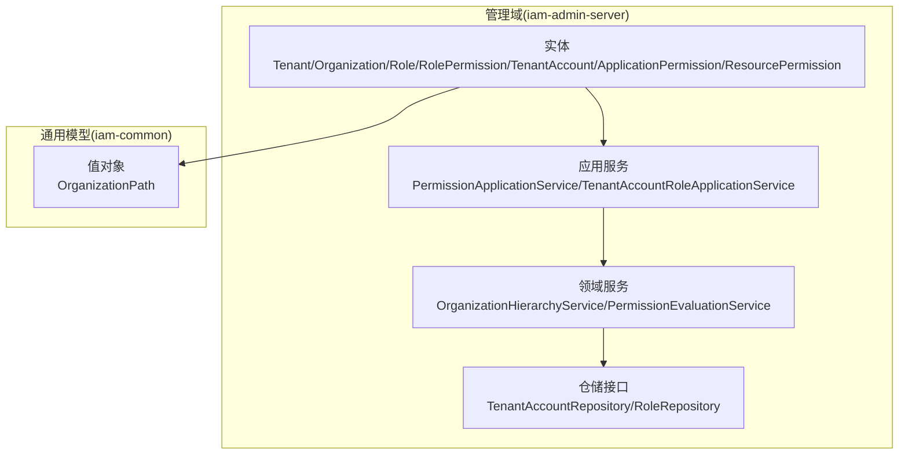
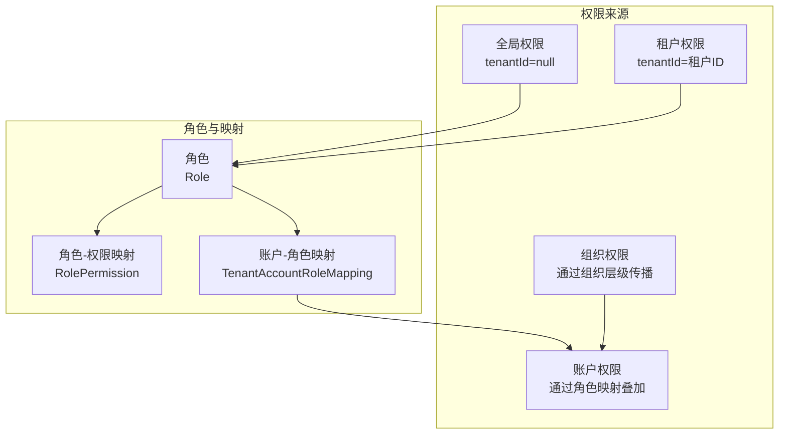
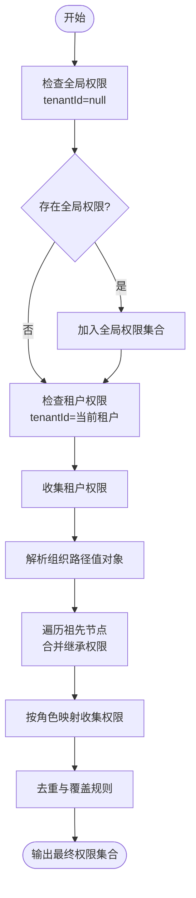
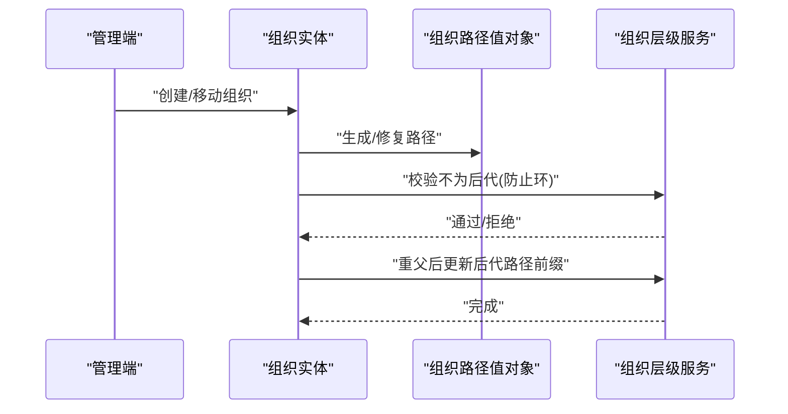
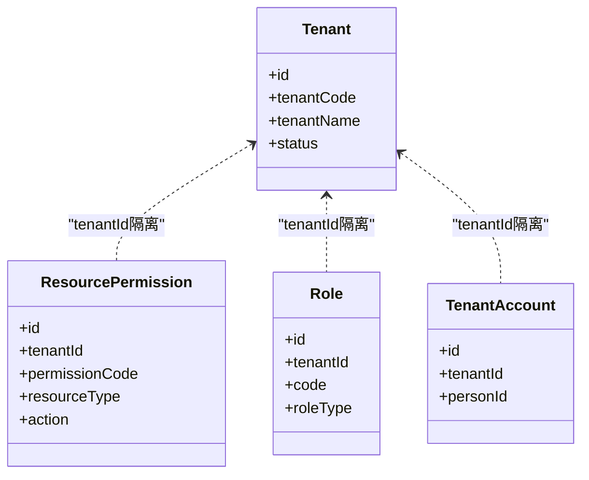
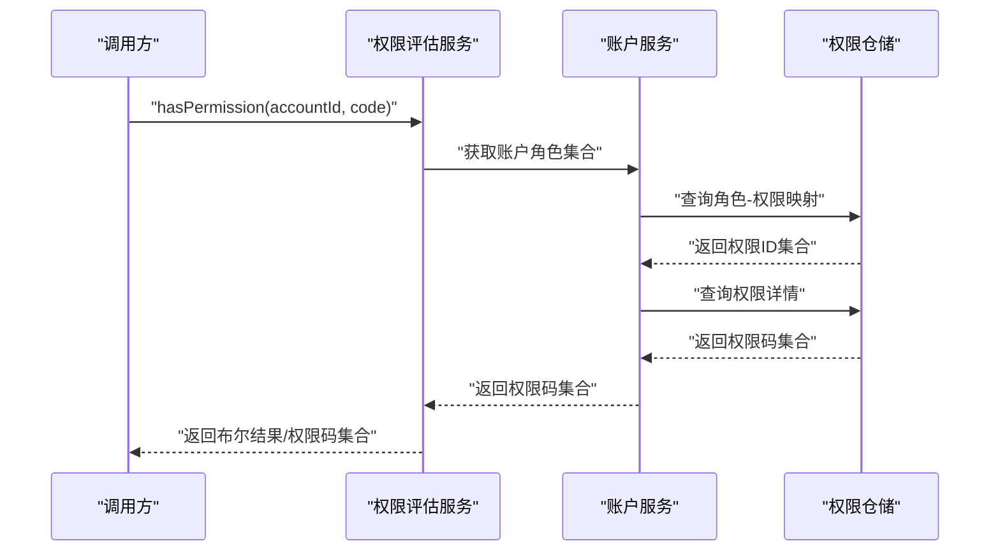
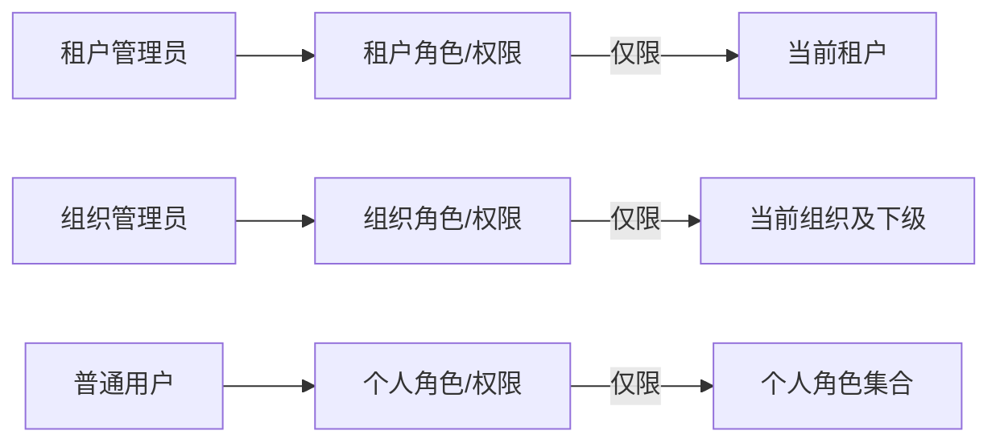
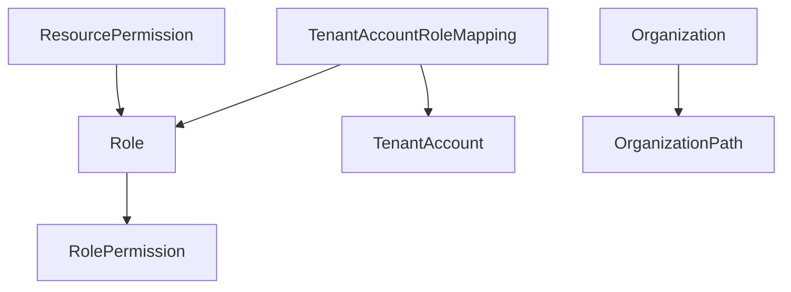

# 权限层次结构

<cite>
**本文引用的文件**
- [Tenant.java](file://iam-admin-server/src/main/java/iam/platform/admin/domain/model/entity/Tenant.java)
- [Organization.java](file://iam-admin-server/src/main/java/iam/platform/admin/domain/model/entity/Organization.java)
- [Role.java](file://iam-admin-server/src/main/java/iam/platform/admin/domain/model/entity/Role.java)
- [RolePermission.java](file://iam-admin-server/src/main/java/iam/platform/admin/domain/model/entity/RolePermission.java)
- [TenantAccount.java](file://iam-admin-server/src/main/java/iam/platform/admin/domain/model/entity/TenantAccount.java)
- [OrganizationHierarchyService.java](file://iam-admin-server/src/main/java/iam/platform/admin/domain/service/OrganizationHierarchyService.java)
- [PermissionEvaluationService.java](file://iam-admin-server/src/main/java/iam/platform/admin/domain/service/PermissionEvaluationService.java)
- [PermissionApplicationService.java](file://iam-admin-server/src/main/java/iam/platform/admin/application/service/PermissionApplicationService.java)
- [TenantAccountRoleApplicationService.java](file://iam-admin-server/src/main/java/iam/platform/admin/application/service/TenantAccountRoleApplicationService.java)
- [OrganizationPath.java](file://iam-common/src/main/java/iam/platform/common/model/valueobject/OrganizationPath.java)
- [ApplicationPermission.java](file://iam-admin-server/src/main/java/iam/platform/admin/domain/model/entity/ApplicationPermission.java)
- [ResourcePermission.java](file://iam-admin-server/src/main/java/iam/platform/admin/domain/model/entity/ResourcePermission.java)
- [TenantAccountRepository.java](file://iam-admin-server/src/main/java/iam/platform/admin/domain/repository/TenantAccountRepository.java)
- [RoleRepository.java](file://iam-admin-server/src/main/java/iam/platform/admin/domain/repository/RoleRepository.java)
</cite>

## 目录
1. [引言](#引言)
2. [项目结构](#项目结构)
3. [核心组件](#核心组件)
4. [架构总览](#架构总览)
5. [详细组件分析](#详细组件分析)
6. [依赖分析](#依赖分析)
7. [性能考量](#性能考量)
8. [故障排查指南](#故障排查指南)
9. [结论](#结论)
10. [附录](#附录)

## 引言
本文件系统化梳理 IAM 平台的权限层次结构设计，围绕“全局权限、租户权限、组织权限、账户权限”展开，阐明权限继承与覆盖规则、租户隔离机制、组织层级中的权限传播与限制，并给出安全考虑与多租户场景下的权限边界实践。文档以代码为依据，辅以图示帮助读者快速建立对权限体系的整体认知。

## 项目结构
本权限体系主要分布在管理域（iam-admin-server）与通用模型（iam-common）中：
- 管理域负责实体建模、应用服务编排、领域服务与仓储接口；
- 通用模型提供跨模块共享的值对象与枚举，如组织路径值对象。

**图表来源**
- [PermissionApplicationService.java:1-135](file://iam-admin-server/src/main/java/iam/platform/admin/application/service/PermissionApplicationService.java#L1-135)
- [TenantAccountRoleApplicationService.java:1-145](file://iam-admin-server/src/main/java/iam/platform/admin/application/service/TenantAccountRoleApplicationService.java#L1-145)
- [OrganizationHierarchyService.java:1-34](file://iam-admin-server/src/main/java/iam/platform/admin/domain/service/OrganizationHierarchyService.java#L1-34)
- [PermissionEvaluationService.java:1-54](file://iam-admin-server/src/main/java/iam/platform/admin/domain/service/PermissionEvaluationService.java#L1-54)
- [TenantAccountRepository.java:1-33](file://iam-admin-server/src/main/java/iam/platform/admin/domain/repository/TenantAccountRepository.java#L1-33)
- [RoleRepository.java:1-29](file://iam-admin-server/src/main/java/iam/platform/admin/domain/repository/RoleRepository.java#L1-29)
- [OrganizationPath.java:1-93](file://iam-common/src/main/java/iam/platform/common/model/valueobject/OrganizationPath.java#L1-93)

**章节来源**
- [PermissionApplicationService.java:1-135](file://iam-admin-server/src/main/java/iam/platform/admin/application/service/PermissionApplicationService.java#L1-135)
- [TenantAccountRoleApplicationService.java:1-145](file://iam-admin-server/src/main/java/iam/platform/admin/application/service/TenantAccountRoleApplicationService.java#L1-145)
- [OrganizationHierarchyService.java:1-34](file://iam-admin-server/src/main/java/iam/platform/admin/domain/service/OrganizationHierarchyService.java#L1-34)
- [PermissionEvaluationService.java:1-54](file://iam-admin-server/src/main/java/iam/platform/admin/domain/service/PermissionEvaluationService.java#L1-54)
- [TenantAccountRepository.java:1-33](file://iam-admin-server/src/main/java/iam/platform/admin/domain/repository/TenantAccountRepository.java#L1-33)
- [RoleRepository.java:1-29](file://iam-admin-server/src/main/java/iam/platform/admin/domain/repository/RoleRepository.java#L1-29)
- [OrganizationPath.java:1-93](file://iam-common/src/main/java/iam/platform/common/model/valueobject/OrganizationPath.java#L1-93)

## 核心组件
- 实体层：定义权限、角色、组织、租户、账户等核心领域对象及其行为与约束。
- 应用服务层：编排权限生命周期、角色分配、权限查询与校验。
- 领域服务层：组织层级校验与路径更新、权限评估接口。
- 仓储接口层：抽象持久化访问，支持按租户或全局维度查询。
- 值对象层：组织路径值对象，支撑组织层级与继承关系的表达。

**章节来源**
- [Tenant.java:1-117](file://iam-admin-server/src/main/java/iam/platform/admin/domain/model/entity/Tenant.java#L1-117)
- [Organization.java:1-217](file://iam-admin-server/src/main/java/iam/platform/admin/domain/model/entity/Organization.java#L1-217)
- [Role.java:1-83](file://iam-admin-server/src/main/java/iam/platform/admin/domain/model/entity/Role.java#L1-83)
- [RolePermission.java:1-20](file://iam-admin-server/src/main/java/iam/platform/admin/domain/model/entity/RolePermission.java#L1-20)
- [TenantAccount.java:1-131](file://iam-admin-server/src/main/java/iam/platform/admin/domain/model/entity/TenantAccount.java#L1-131)
- [ApplicationPermission.java:1-75](file://iam-admin-server/src/main/java/iam/platform/admin/domain/model/entity/ApplicationPermission.java#L1-75)
- [ResourcePermission.java:1-77](file://iam-admin-server/src/main/java/iam/platform/admin/domain/model/entity/ResourcePermission.java#L1-77)

## 架构总览
权限层次由“全局—租户—组织—账户”四级构成，采用“角色承载权限”的映射方式，结合组织层级进行权限继承与覆盖。应用服务负责权限与角色的创建、分配与查询；领域服务负责组织层级校验与权限评估；仓储接口提供按租户或全局的权限数据访问。

**图表来源**
- [Role.java](file://iam-admin-server/src/main/java/iam/platform/admin/domain/model/entity/Role.java#L18)
- [RolePermission.java:15-17](file://iam-admin-server/src/main/java/iam/platform/admin/domain/model/entity/RolePermission.java#L15-L17)
- [TenantAccountRoleApplicationService.java:103-127](file://iam-admin-server/src/main/java/iam/platform/admin/application/service/TenantAccountRoleApplicationService.java#L103-L127)
- [ResourcePermission.java](file://iam-admin-server/src/main/java/iam/platform/admin/domain/model/entity/ResourcePermission.java#L18)
- [ApplicationPermission.java](file://iam-admin-server/src/main/java/iam/platform/admin/domain/model/entity/ApplicationPermission.java#L18)

## 详细组件分析

### 权限层次与继承机制
- 全局权限：tenantId 为空，仅系统内置角色可承载，不随组织层级传播。
- 租户权限：tenantId 指向具体租户，可在租户内被角色承载与继承。
- 组织权限：通过组织层级路径（Materialized Path）表达父子关系，权限可通过组织上下文传播与覆盖。
- 账户权限：基于账户所拥有的角色集合，汇总得到最终可用权限集合。

**图表来源**
- [ResourcePermission.java:73-75](file://iam-admin-server/src/main/java/iam/platform/admin/domain/model/entity/ResourcePermission.java#L73-L75)
- [Role.java:75-77](file://iam-admin-server/src/main/java/iam/platform/admin/domain/model/entity/Role.java#L75-L77)
- [OrganizationPath.java:58-63](file://iam-common/src/main/java/iam/platform/common/model/valueobject/OrganizationPath.java#L58-L63)
- [TenantAccountRoleApplicationService.java:109-117](file://iam-admin-server/src/main/java/iam/platform/admin/application/service/TenantAccountRoleApplicationService.java#L109-L117)

**章节来源**
- [ResourcePermission.java:18-25](file://iam-admin-server/src/main/java/iam/platform/admin/domain/model/entity/ResourcePermission.java#L18-L25)
- [Role.java](file://iam-admin-server/src/main/java/iam/platform/admin/domain/model/entity/Role.java#L18)
- [OrganizationPath.java:11-11](file://iam-common/src/main/java/iam/platform/common/model/valueobject/OrganizationPath.java#L11-L11)
- [TenantAccountRoleApplicationService.java:103-127](file://iam-admin-server/src/main/java/iam/platform/admin/application/service/TenantAccountRoleApplicationService.java#L103-L127)

### 组织层级与权限传播
- 组织路径采用“分段路径”表达，根节点为“/tenantId”，子节点追加“/orgId”。
- 通过路径前缀判断祖先关系，实现自上而下的权限传播。
- 组织重父时，需校验不形成环路，并批量更新后代路径前缀。

**图表来源**
- [Organization.java:105-135](file://iam-admin-server/src/main/java/iam/platform/admin/domain/model/entity/Organization.java#L105-L135)
- [OrganizationPath.java:28-75](file://iam-common/src/main/java/iam/platform/common/model/valueobject/OrganizationPath.java#L28-L75)
- [OrganizationHierarchyService.java:22-32](file://iam-admin-server/src/main/java/iam/platform/admin/domain/service/OrganizationHierarchyService.java#L22-L32)

**章节来源**
- [Organization.java:38-96](file://iam-admin-server/src/main/java/iam/platform/admin/domain/model/entity/Organization.java#L38-L96)
- [Organization.java:119-135](file://iam-admin-server/src/main/java/iam/platform/admin/domain/model/entity/Organization.java#L119-L135)
- [OrganizationPath.java:58-75](file://iam-common/src/main/java/iam/platform/common/model/valueobject/OrganizationPath.java#L58-L75)
- [OrganizationHierarchyService.java:12-32](file://iam-admin-server/src/main/java/iam/platform/admin/domain/service/OrganizationHierarchyService.java#L12-L32)

### 租户隔离与权限边界
- 租户隔离体现在权限与角色均以 tenantId 作为作用域边界，避免跨租户访问。
- 应用服务在创建/查询权限时，严格限定在当前租户范围内，全局权限单独处理。
- 账户权限查询聚合角色映射，确保仅来自同一租户的角色与权限。

**图表来源**
- [Tenant.java:17-26](file://iam-admin-server/src/main/java/iam/platform/admin/domain/model/entity/Tenant.java#L17-L26)
- [ResourcePermission.java](file://iam-admin-server/src/main/java/iam/platform/admin/domain/model/entity/ResourcePermission.java#L18)
- [Role.java](file://iam-admin-server/src/main/java/iam/platform/admin/domain/model/entity/Role.java#L18)
- [TenantAccount.java:18-29](file://iam-admin-server/src/main/java/iam/platform/admin/domain/model/entity/TenantAccount.java#L18-L29)

**章节来源**
- [PermissionApplicationService.java:35-49](file://iam-admin-server/src/main/java/iam/platform/admin/application/service/PermissionApplicationService.java#L35-L49)
- [TenantAccountRoleApplicationService.java:103-118](file://iam-admin-server/src/main/java/iam/platform/admin/application/service/TenantAccountRoleApplicationService.java#L103-L118)
- [RoleRepository.java:21-23](file://iam-admin-server/src/main/java/iam/platform/admin/domain/repository/RoleRepository.java#L21-L23)

### 权限评估与覆盖规则
- 权限评估接口提供“拥有某权限/任一权限/全部权限/全部权限码”等能力。
- 账户权限集合由其角色映射汇聚而来，天然具备“叠加与去重”的特性。
- 覆盖规则建议：组织层级的显式赋权优先于继承；角色粒度的显式赋权优先于继承。

**图表来源**
- [PermissionEvaluationService.java:10-52](file://iam-admin-server/src/main/java/iam/platform/admin/domain/service/PermissionEvaluationService.java#L10-L52)
- [TenantAccountRoleApplicationService.java:103-127](file://iam-admin-server/src/main/java/iam/platform/admin/application/service/TenantAccountRoleApplicationService.java#L103-L127)

**章节来源**
- [PermissionEvaluationService.java:10-52](file://iam-admin-server/src/main/java/iam/platform/admin/domain/service/PermissionEvaluationService.java#L10-L52)
- [TenantAccountRoleApplicationService.java:103-127](file://iam-admin-server/src/main/java/iam/platform/admin/application/service/TenantAccountRoleApplicationService.java#L103-L127)

### 多租户场景下的权限边界
- 租户管理员：在租户范围内创建/分配角色与权限，无法越权访问其他租户资源。
- 组织管理员：在组织层级内进行人员与角色管理，权限受组织路径与角色映射约束。
- 普通用户：仅能获得其角色授予的权限，且受限于租户范围。

**图表来源**
- [Role.java:75-81](file://iam-admin-server/src/main/java/iam/platform/admin/domain/model/entity/Role.java#L75-L81)
- [Organization.java:189-211](file://iam-admin-server/src/main/java/iam/platform/admin/domain/model/entity/Organization.java#L189-L211)
- [TenantAccountRoleApplicationService.java:103-127](file://iam-admin-server/src/main/java/iam/platform/admin/application/service/TenantAccountRoleApplicationService.java#L103-L127)

**章节来源**
- [Role.java:75-81](file://iam-admin-server/src/main/java/iam/platform/admin/domain/model/entity/Role.java#L75-L81)
- [Organization.java:189-211](file://iam-admin-server/src/main/java/iam/platform/admin/domain/model/entity/Organization.java#L189-L211)
- [TenantAccountRoleApplicationService.java:103-127](file://iam-admin-server/src/main/java/iam/platform/admin/application/service/TenantAccountRoleApplicationService.java#L103-L127)

## 依赖分析
- 实体间依赖：组织依赖路径值对象；角色与权限通过映射实体关联；账户通过映射实体关联角色。
- 应用服务依赖仓储接口与领域服务，实现权限与角色的全生命周期管理。
- 仓储接口提供按租户或全局的查询能力，支撑权限隔离与继承。

**图表来源**
- [ResourcePermission.java](file://iam-admin-server/src/main/java/iam/platform/admin/domain/model/entity/ResourcePermission.java#L18)
- [Role.java](file://iam-admin-server/src/main/java/iam/platform/admin/domain/model/entity/Role.java#L18)
- [RolePermission.java:15-17](file://iam-admin-server/src/main/java/iam/platform/admin/domain/model/entity/RolePermission.java#L15-L17)
- [TenantAccountRoleApplicationService.java:103-118](file://iam-admin-server/src/main/java/iam/platform/admin/application/service/TenantAccountRoleApplicationService.java#L103-L118)
- [Organization.java](file://iam-admin-server/src/main/java/iam/platform/admin/domain/model/entity/Organization.java#L20)
- [OrganizationPath.java](file://iam-common/src/main/java/iam/platform/common/model/valueobject/OrganizationPath.java#L19)

**章节来源**
- [RolePermission.java:15-17](file://iam-admin-server/src/main/java/iam/platform/admin/domain/model/entity/RolePermission.java#L15-L17)
- [TenantAccountRoleApplicationService.java:103-118](file://iam-admin-server/src/main/java/iam/platform/admin/application/service/TenantAccountRoleApplicationService.java#L103-L118)
- [OrganizationPath.java](file://iam-common/src/main/java/iam/platform/common/model/valueobject/OrganizationPath.java#L19)

## 性能考量
- 权限查询去重：在聚合账户权限时，应先收集权限ID再统一查询，减少重复查询。
- 缓存策略：对账户权限结果进行缓存，配合角色变更时的失效策略，降低重复计算成本。
- 路径更新批量化：组织重父时，一次性替换路径前缀，避免多次往返数据库。
- 分页与过滤：权限列表查询应支持按资源类型与租户过滤，减少无效扫描。

## 故障排查指南
- 权限未生效
  - 检查角色是否正确分配到账户，以及角色是否已绑定目标权限。
  - 核对权限是否属于正确的租户范围。
- 组织重父失败
  - 排查是否形成环路（祖先节点包含目标节点）。
  - 确认路径前缀替换逻辑是否正确执行。
- 权限冲突
  - 同一资源类型的权限可能存在多来源，建议明确覆盖顺序（显式赋权优先）。
- 跨租户访问
  - 确认权限与角色的 tenantId 是否正确，避免误用全局权限。

**章节来源**
- [TenantAccountRoleApplicationService.java:47-71](file://iam-admin-server/src/main/java/iam/platform/admin/application/service/TenantAccountRoleApplicationService.java#L47-L71)
- [OrganizationHierarchyService.java:22-32](file://iam-admin-server/src/main/java/iam/platform/admin/domain/service/OrganizationHierarchyService.java#L22-L32)
- [PermissionApplicationService.java:35-49](file://iam-admin-server/src/main/java/iam/platform/admin/application/service/PermissionApplicationService.java#L35-L49)

## 结论
该权限体系以“租户隔离+角色承载+组织路径”为核心，实现了从全局到账户的清晰权限层次与继承链。通过严格的实体约束、应用服务编排与领域服务校验，系统在多租户环境下提供了可控的权限传播与覆盖机制。建议在生产环境中强化缓存与批处理策略，完善权限冲突与覆盖规则的文档化与审计日志，持续保障权限系统的安全性与可维护性。

## 附录
- 关键实体与职责
  - ResourcePermission：资源型权限，支持按租户或全局作用域管理。
  - ApplicationPermission：应用级权限，用于特定应用内的细粒度控制。
  - Role：角色，可为全局或租户定制，承载权限集合。
  - TenantAccount：租户账户，承载个人身份与角色映射。
  - Organization：组织，通过路径值对象表达层级关系，支撑权限传播。
- 值对象
  - OrganizationPath：组织路径值对象，提供祖先判断与路径前缀替换能力。

**章节来源**
- [ResourcePermission.java:18-25](file://iam-admin-server/src/main/java/iam/platform/admin/domain/model/entity/ResourcePermission.java#L18-L25)
- [ApplicationPermission.java:18-25](file://iam-admin-server/src/main/java/iam/platform/admin/domain/model/entity/ApplicationPermission.java#L18-L25)
- [Role.java](file://iam-admin-server/src/main/java/iam/platform/admin/domain/model/entity/Role.java#L18)
- [TenantAccount.java:18-29](file://iam-admin-server/src/main/java/iam/platform/admin/domain/model/entity/TenantAccount.java#L18-L29)
- [Organization.java](file://iam-admin-server/src/main/java/iam/platform/admin/domain/model/entity/Organization.java#L20)
- [OrganizationPath.java](file://iam-common/src/main/java/iam/platform/common/model/valueobject/OrganizationPath.java#L19)