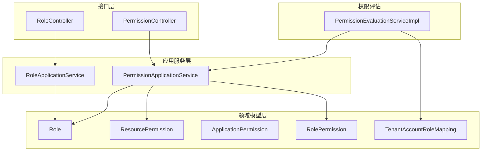
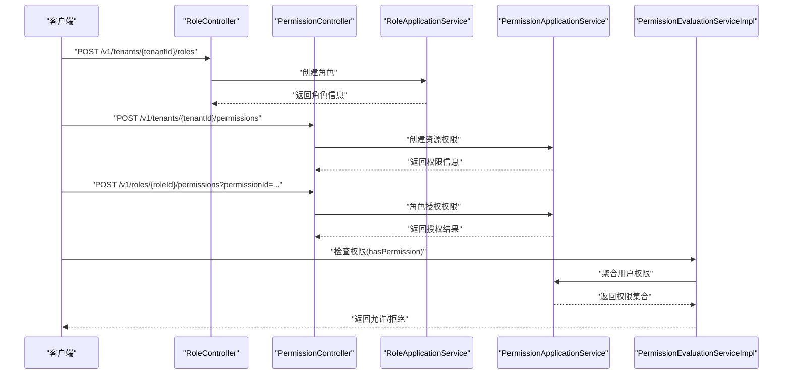
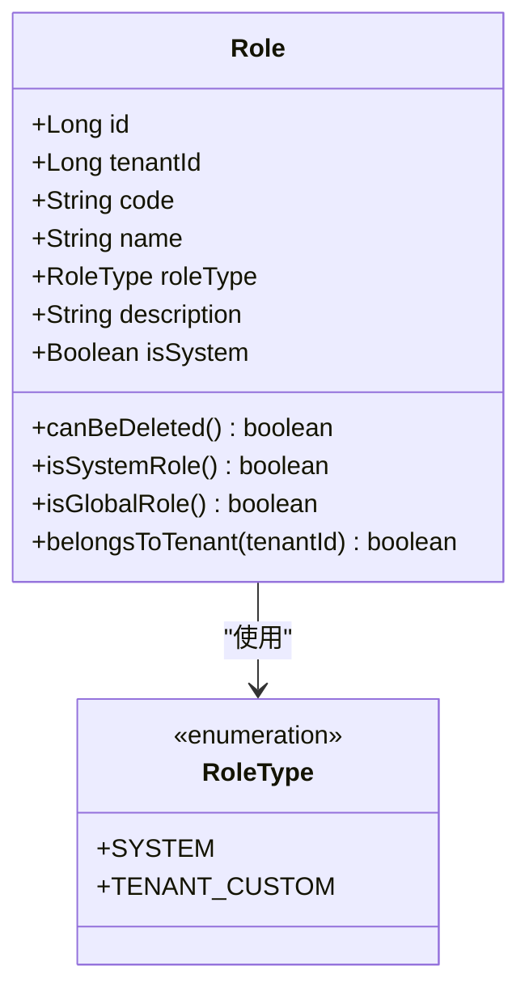
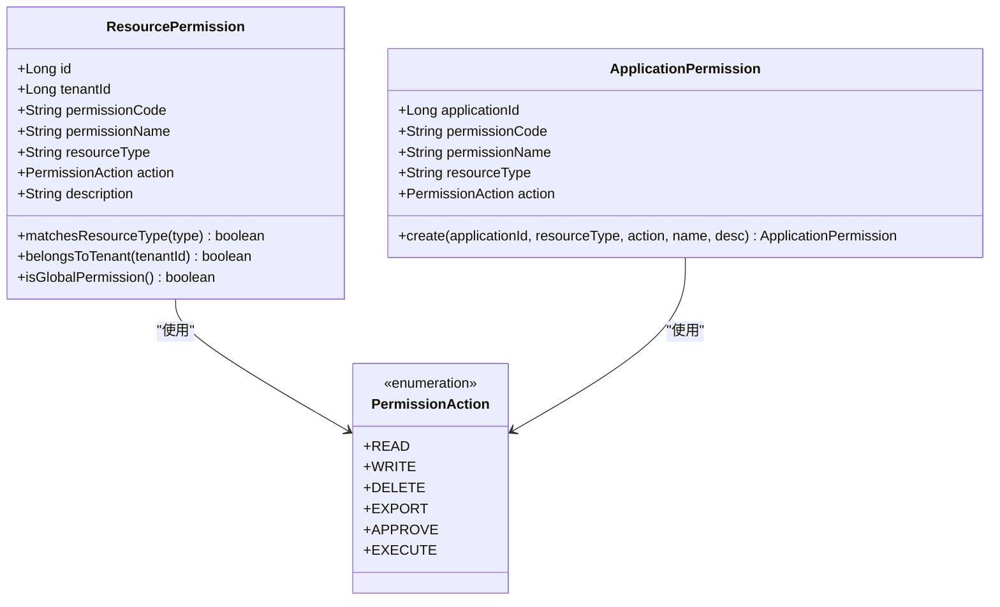
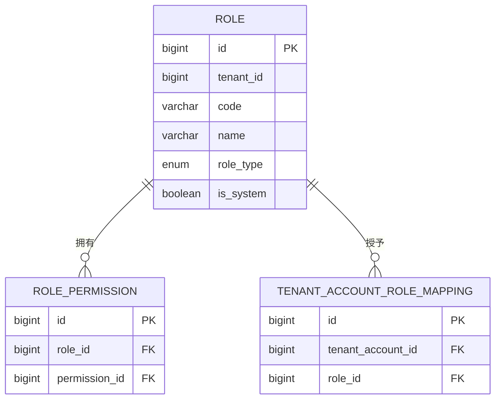
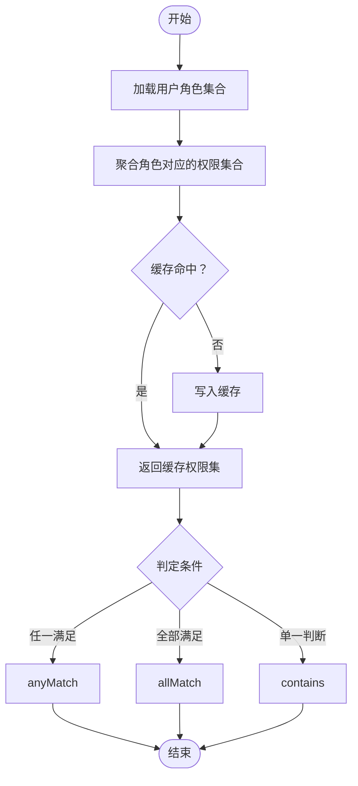
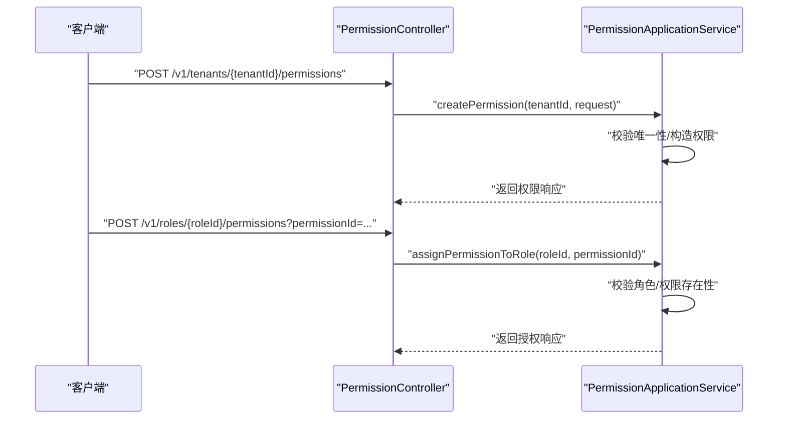
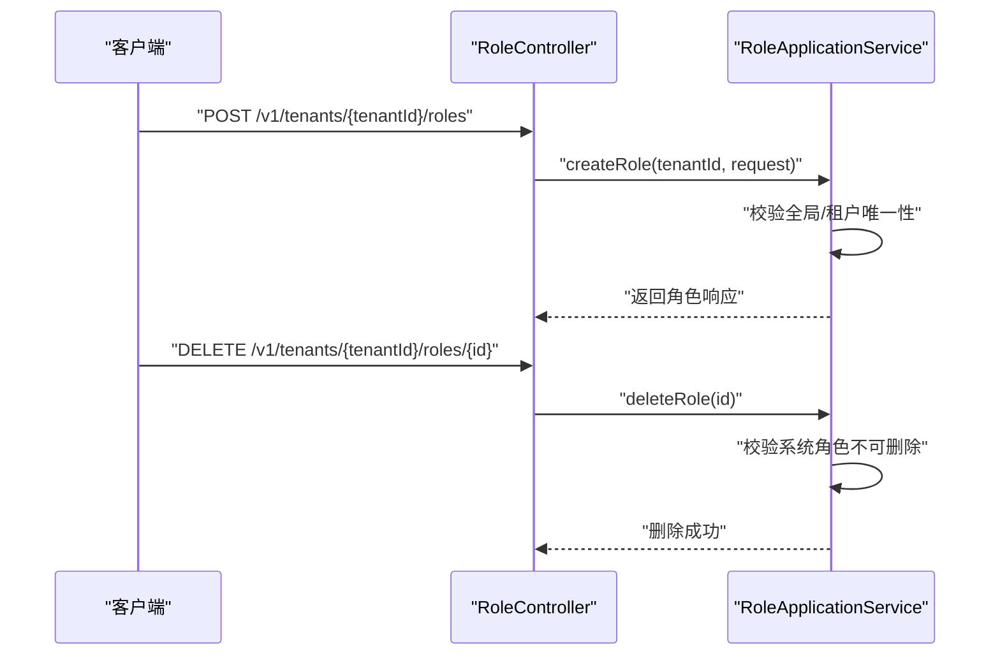
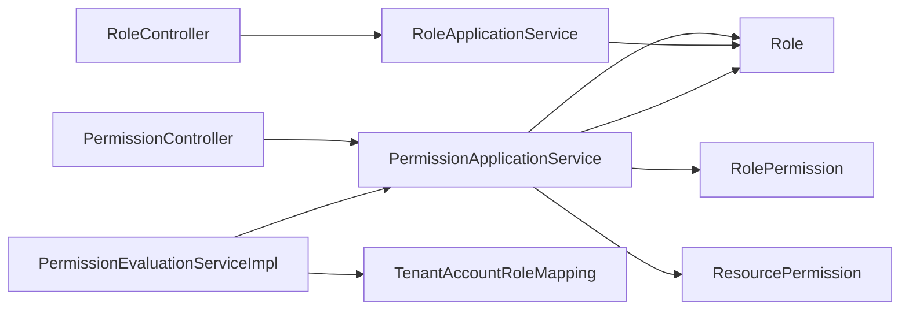

# 权限模型设计

<cite>
**本文引用的文件**
- [Role.java](file://iam-admin-server/src/main/java/iam/platform/admin/domain/model/entity/Role.java)
- [ApplicationPermission.java](file://iam-admin-server/src/main/java/iam/platform/admin/domain/model/entity/ApplicationPermission.java)
- [ResourcePermission.java](file://iam-admin-server/src/main/java/iam/platform/admin/domain/model/entity/ResourcePermission.java)
- [RolePermission.java](file://iam-admin-server/src/main/java/iam/platform/admin/domain/model/entity/RolePermission.java)
- [TenantAccountRoleMapping.java](file://iam-admin-server/src/main/java/iam/platform/admin/domain/model/entity/TenantAccountRoleMapping.java)
- [PermissionApplicationService.java](file://iam-admin-server/src/main/java/iam/platform/admin/application/service/PermissionApplicationService.java)
- [RoleApplicationService.java](file://iam-admin-server/src/main/java/iam/platform/admin/application/service/RoleApplicationService.java)
- [PermissionEvaluationServiceImpl.java](file://iam-admin-server/src/main/java/iam/platform/admin/domain/service/impl/PermissionEvaluationServiceImpl.java)
- [PermissionController.java](file://iam-admin-server/src/main/java/iam/platform/admin/interfaces/rest/PermissionController.java)
- [RoleController.java](file://iam-admin-server/src/main/java/iam/platform/admin/interfaces/rest/RoleController.java)
- [RoleType.java](file://iam-common/src/main/java/iam/platform/common/model/enums/RoleType.java)
- [PermissionAction.java](file://iam-common/src/main/java/iam/platform/common/model/enums/PermissionAction.java)
</cite>

## 目录
1. [引言](#引言)
2. [项目结构](#项目结构)
3. [核心组件](#核心组件)
4. [架构总览](#架构总览)
5. [详细组件分析](#详细组件分析)
6. [依赖分析](#依赖分析)
7. [性能考量](#性能考量)
8. [故障排查指南](#故障排查指南)
9. [结论](#结论)
10. [附录](#附录)

## 引言
本文件系统化梳理 IAM 平台的 RBAC 权限模型设计，聚焦以下关键主题：
- 角色与权限的多对多映射、角色层级（全局/租户）、系统内置角色与租户自定义角色
- 应用级权限与资源权限的定义与区别、作用域与继承策略
- 权限评估与缓存、权限组合（任一满足/全部满足）与拒绝策略
- 权限从定义到执行的完整流转：控制器 → 应用服务 → 领域模型/仓储 → 权限评估
- 安全设计要点：最小权限、权限审计、权限回收与删除限制

## 项目结构
本权限模型主要由“管理端”模块承载，核心围绕以下层次组织：
- 接口层：REST 控制器负责对外暴露权限与角色管理接口
- 应用服务层：封装业务编排与事务边界，协调仓储与领域模型
- 领域模型层：以实体为核心表达权限、角色、映射关系等
- 枚举与通用模型：角色类型、权限动作等跨模块共享

图表来源
- [RoleController.java:23-57](file://iam-admin-server/src/main/java/iam/platform/admin/interfaces/rest/RoleController.java#L23-L57)
- [PermissionController.java:25-88](file://iam-admin-server/src/main/java/iam/platform/admin/interfaces/rest/PermissionController.java#L25-L88)
- [RoleApplicationService.java:17-83](file://iam-admin-server/src/main/java/iam/platform/admin/application/service/RoleApplicationService.java#L17-L83)
- [PermissionApplicationService.java:22-134](file://iam-admin-server/src/main/java/iam/platform/admin/application/service/PermissionApplicationService.java#L22-L134)
- [Role.java:16-82](file://iam-admin-server/src/main/java/iam/platform/admin/domain/model/entity/Role.java#L16-L82)
- [ResourcePermission.java:16-76](file://iam-admin-server/src/main/java/iam/platform/admin/domain/model/entity/ResourcePermission.java#L16-L76)
- [ApplicationPermission.java:16-53](file://iam-admin-server/src/main/java/iam/platform/admin/domain/model/entity/ApplicationPermission.java#L16-L53)
- [RolePermission.java:14-19](file://iam-admin-server/src/main/java/iam/platform/admin/domain/model/entity/RolePermission.java#L14-L19)
- [TenantAccountRoleMapping.java:14-20](file://iam-admin-server/src/main/java/iam/platform/admin/domain/model/entity/TenantAccountRoleMapping.java#L14-L20)
- [PermissionEvaluationServiceImpl.java:16-52](file://iam-admin-server/src/main/java/iam/platform/admin/domain/service/impl/PermissionEvaluationServiceImpl.java#L16-L52)

章节来源
- [RoleController.java:23-57](file://iam-admin-server/src/main/java/iam/platform/admin/interfaces/rest/RoleController.java#L23-L57)
- [PermissionController.java:25-88](file://iam-admin-server/src/main/java/iam/platform/admin/interfaces/rest/PermissionController.java#L25-L88)
- [RoleApplicationService.java:17-83](file://iam-admin-server/src/main/java/iam/platform/admin/application/service/RoleApplicationService.java#L17-L83)
- [PermissionApplicationService.java:22-134](file://iam-admin-server/src/main/java/iam/platform/admin/application/service/PermissionApplicationService.java#L22-L134)

## 核心组件
- 角色（Role）
  - 支持全局角色与租户角色；系统内置角色不可删除；提供工厂方法创建系统角色与租户自定义角色
- 资源权限（ResourcePermission）
  - 租户作用域权限，权限编码格式为“资源类型:动作”，支持全局与租户两种级别
- 应用级权限（ApplicationPermission）
  - 应用作用域权限，权限编码格式为“应用标识:资源类型:动作”，用于应用内细粒度控制
- 角色-权限映射（RolePermission）
  - 多对多关系的中间表，记录角色与权限的绑定
- 租户账户-角色映射（TenantAccountRoleMapping）
  - 记录租户账户被赋予的角色，用于权限评估时聚合用户权限
- 权限评估服务（PermissionEvaluationServiceImpl）
  - 提供“是否拥有某权限/任一权限/全部权限”的判定，并通过缓存提升评估性能

章节来源
- [Role.java:16-82](file://iam-admin-server/src/main/java/iam/platform/admin/domain/model/entity/Role.java#L16-L82)
- [ResourcePermission.java:16-76](file://iam-admin-server/src/main/java/iam/platform/admin/domain/model/entity/ResourcePermission.java#L16-L76)
- [ApplicationPermission.java:16-53](file://iam-admin-server/src/main/java/iam/platform/admin/domain/model/entity/ApplicationPermission.java#L16-L53)
- [RolePermission.java:14-19](file://iam-admin-server/src/main/java/iam/platform/admin/domain/model/entity/RolePermission.java#L14-L19)
- [TenantAccountRoleMapping.java:14-20](file://iam-admin-server/src/main/java/iam/platform/admin/domain/model/entity/TenantAccountRoleMapping.java#L14-L20)
- [PermissionEvaluationServiceImpl.java:16-52](file://iam-admin-server/src/main/java/iam/platform/admin/domain/service/impl/PermissionEvaluationServiceImpl.java#L16-L52)

## 架构总览
下图展示了从接口到权限评估的完整调用链路，体现“定义—授权—评估—执行”的闭环。

图表来源
- [RoleController.java:23-57](file://iam-admin-server/src/main/java/iam/platform/admin/interfaces/rest/RoleController.java#L23-L57)
- [PermissionController.java:25-88](file://iam-admin-server/src/main/java/iam/platform/admin/interfaces/rest/PermissionController.java#L25-L88)
- [RoleApplicationService.java:17-83](file://iam-admin-server/src/main/java/iam/platform/admin/application/service/RoleApplicationService.java#L17-L83)
- [PermissionApplicationService.java:22-134](file://iam-admin-server/src/main/java/iam/platform/admin/application/service/PermissionApplicationService.java#L22-L134)
- [PermissionEvaluationServiceImpl.java:16-52](file://iam-admin-server/src/main/java/iam/platform/admin/domain/service/impl/PermissionEvaluationServiceImpl.java#L16-L52)

## 详细组件分析

### 角色与角色类型
- 角色类型枚举包含“系统内置”和“租户自定义”
- 全局角色不绑定租户，租户自定义角色必须绑定具体租户
- 系统内置角色不可删除，保障平台基础能力稳定

图表来源
- [Role.java:16-82](file://iam-admin-server/src/main/java/iam/platform/admin/domain/model/entity/Role.java#L16-L82)
- [RoleType.java:3-6](file://iam-common/src/main/java/iam/platform/common/model/enums/RoleType.java#L3-L6)

章节来源
- [Role.java:16-82](file://iam-admin-server/src/main/java/iam/platform/admin/domain/model/entity/Role.java#L16-L82)
- [RoleType.java:3-6](file://iam-common/src/main/java/iam/platform/common/model/enums/RoleType.java#L3-L6)

### 资源权限与应用级权限
- 资源权限（ResourcePermission）
  - 编码格式“资源类型:动作”，支持全局与租户作用域
  - 工厂方法生成权限并持久化
- 应用级权限（ApplicationPermission）
  - 编码格式“应用标识:资源类型:动作”，限定于应用范围
  - 工厂方法生成权限并持久化

图表来源
- [ResourcePermission.java:16-76](file://iam-admin-server/src/main/java/iam/platform/admin/domain/model/entity/ResourcePermission.java#L16-L76)
- [ApplicationPermission.java:16-53](file://iam-admin-server/src/main/java/iam/platform/admin/domain/model/entity/ApplicationPermission.java#L16-L53)
- [PermissionAction.java:3-5](file://iam-common/src/main/java/iam/platform/common/model/enums/PermissionAction.java#L3-L5)

章节来源
- [ResourcePermission.java:16-76](file://iam-admin-server/src/main/java/iam/platform/admin/domain/model/entity/ResourcePermission.java#L16-L76)
- [ApplicationPermission.java:16-53](file://iam-admin-server/src/main/java/iam/platform/admin/domain/model/entity/ApplicationPermission.java#L16-L53)
- [PermissionAction.java:3-5](file://iam-common/src/main/java/iam/platform/common/model/enums/PermissionAction.java#L3-L5)

### 角色-权限映射与租户账户-角色映射
- 角色-权限映射（RolePermission）建立角色与权限的多对多关系
- 租户账户-角色映射（TenantAccountRoleMapping）建立租户账户与角色的多对多关系，用于权限聚合

图表来源
- [Role.java:16-82](file://iam-admin-server/src/main/java/iam/platform/admin/domain/model/entity/Role.java#L16-L82)
- [RolePermission.java:14-19](file://iam-admin-server/src/main/java/iam/platform/admin/domain/model/entity/RolePermission.java#L14-L19)
- [TenantAccountRoleMapping.java:14-20](file://iam-admin-server/src/main/java/iam/platform/admin/domain/model/entity/TenantAccountRoleMapping.java#L14-L20)

章节来源
- [RolePermission.java:14-19](file://iam-admin-server/src/main/java/iam/platform/admin/domain/model/entity/RolePermission.java#L14-L19)
- [TenantAccountRoleMapping.java:14-20](file://iam-admin-server/src/main/java/iam/platform/admin/domain/model/entity/TenantAccountRoleMapping.java#L14-L20)

### 权限评估与组合策略
- 权限评估服务提供三种判定：
  - 是否拥有某权限
  - 是否拥有任一权限（或关系）
  - 是否拥有全部权限（与关系）
- 采用缓存存储用户权限集合，避免重复聚合计算

图表来源
- [PermissionEvaluationServiceImpl.java:16-52](file://iam-admin-server/src/main/java/iam/platform/admin/domain/service/impl/PermissionEvaluationServiceImpl.java#L16-L52)

章节来源
- [PermissionEvaluationServiceImpl.java:16-52](file://iam-admin-server/src/main/java/iam/platform/admin/domain/service/impl/PermissionEvaluationServiceImpl.java#L16-L52)

### 权限定义与授权流程（接口到应用服务）
- 接口层提供创建资源权限、查询权限列表、删除权限、角色授权/撤销权限等 REST 接口
- 应用服务层完成参数校验、唯一性约束、事务控制与审计日志

图表来源
- [PermissionController.java:25-88](file://iam-admin-server/src/main/java/iam/platform/admin/interfaces/rest/PermissionController.java#L25-L88)
- [PermissionApplicationService.java:22-134](file://iam-admin-server/src/main/java/iam/platform/admin/application/service/PermissionApplicationService.java#L22-L134)

章节来源
- [PermissionController.java:25-88](file://iam-admin-server/src/main/java/iam/platform/admin/interfaces/rest/PermissionController.java#L25-L88)
- [PermissionApplicationService.java:22-134](file://iam-admin-server/src/main/java/iam/platform/admin/application/service/PermissionApplicationService.java#L22-L134)

### 角色管理流程（接口到应用服务）
- 接口层提供创建/查询/删除角色的 REST 接口
- 应用服务层完成角色唯一性校验、系统内置角色删除限制等

图表来源
- [RoleController.java:23-57](file://iam-admin-server/src/main/java/iam/platform/admin/interfaces/rest/RoleController.java#L23-L57)
- [RoleApplicationService.java:17-83](file://iam-admin-server/src/main/java/iam/platform/admin/application/service/RoleApplicationService.java#L17-L83)

章节来源
- [RoleController.java:23-57](file://iam-admin-server/src/main/java/iam/platform/admin/interfaces/rest/RoleController.java#L23-L57)
- [RoleApplicationService.java:17-83](file://iam-admin-server/src/main/java/iam/platform/admin/application/service/RoleApplicationService.java#L17-L83)

## 依赖分析
- 控制器依赖应用服务，应用服务依赖仓储与领域模型
- 权限评估服务依赖应用服务以聚合用户权限
- 枚举（角色类型、权限动作）被多个模块复用

图表来源
- [RoleController.java:23-57](file://iam-admin-server/src/main/java/iam/platform/admin/interfaces/rest/RoleController.java#L23-L57)
- [PermissionController.java:25-88](file://iam-admin-server/src/main/java/iam/platform/admin/interfaces/rest/PermissionController.java#L25-L88)
- [RoleApplicationService.java:17-83](file://iam-admin-server/src/main/java/iam/platform/admin/application/service/RoleApplicationService.java#L17-L83)
- [PermissionApplicationService.java:22-134](file://iam-admin-server/src/main/java/iam/platform/admin/application/service/PermissionApplicationService.java#L22-L134)
- [PermissionEvaluationServiceImpl.java:16-52](file://iam-admin-server/src/main/java/iam/platform/admin/domain/service/impl/PermissionEvaluationServiceImpl.java#L16-L52)
- [RolePermission.java:14-19](file://iam-admin-server/src/main/java/iam/platform/admin/domain/model/entity/RolePermission.java#L14-L19)
- [ResourcePermission.java:16-76](file://iam-admin-server/src/main/java/iam/platform/admin/domain/model/entity/ResourcePermission.java#L16-L76)
- [Role.java:16-82](file://iam-admin-server/src/main/java/iam/platform/admin/domain/model/entity/Role.java#L16-L82)
- [TenantAccountRoleMapping.java:14-20](file://iam-admin-server/src/main/java/iam/platform/admin/domain/model/entity/TenantAccountRoleMapping.java#L14-L20)

章节来源
- [RoleController.java:23-57](file://iam-admin-server/src/main/java/iam/platform/admin/interfaces/rest/RoleController.java#L23-L57)
- [PermissionController.java:25-88](file://iam-admin-server/src/main/java/iam/platform/admin/interfaces/rest/PermissionController.java#L25-L88)
- [RoleApplicationService.java:17-83](file://iam-admin-server/src/main/java/iam/platform/admin/application/service/RoleApplicationService.java#L17-L83)
- [PermissionApplicationService.java:22-134](file://iam-admin-server/src/main/java/iam/platform/admin/application/service/PermissionApplicationService.java#L22-L134)
- [PermissionEvaluationServiceImpl.java:16-52](file://iam-admin-server/src/main/java/iam/platform/admin/domain/service/impl/PermissionEvaluationServiceImpl.java#L16-L52)

## 性能考量
- 权限评估缓存：对用户权限集合进行缓存，减少重复聚合与查询
- 批量判定：支持“任一满足/全部满足”的集合运算，降低多次评估开销
- 事务边界：权限创建/删除/授权/撤销均在应用服务层开启事务，保证一致性

## 故障排查指南
- 权限不存在/未分配
  - 现象：权限评估返回拒绝
  - 排查：确认权限是否存在、是否已授权给角色、角色是否已授予租户账户
- 角色删除失败
  - 现象：系统内置角色无法删除
  - 排查：确认角色类型为系统内置
- 权限编码冲突
  - 现象：创建权限时报唯一性错误
  - 排查：确认租户内权限编码唯一（或全局唯一），避免重复

章节来源
- [PermissionEvaluationServiceImpl.java:16-52](file://iam-admin-server/src/main/java/iam/platform/admin/domain/service/impl/PermissionEvaluationServiceImpl.java#L16-L52)
- [RoleApplicationService.java:17-83](file://iam-admin-server/src/main/java/iam/platform/admin/application/service/RoleApplicationService.java#L17-L83)
- [PermissionApplicationService.java:22-134](file://iam-admin-server/src/main/java/iam/platform/admin/application/service/PermissionApplicationService.java#L22-L134)

## 结论
该权限模型以 RBAC 为核心，结合全局/租户两级权限与应用级权限，形成清晰的权限层次结构。通过角色-权限与租户账户-角色的多对多映射，实现灵活的权限组合与继承。应用服务层承担严格的业务校验与审计，权限评估服务提供高性能的判定与缓存，整体设计兼顾安全、可维护与可扩展。

## 附录
- 安全设计要点
  - 最小权限：仅授予完成任务所需的最小权限集合
  - 权限审计：所有权限创建、删除、授权/撤销均记录审计事件
  - 权限回收：删除权限或撤销授权后，应确保缓存失效与权限重新评估
  - 冲突处理：权限编码在租户范围内唯一，避免同资源同动作的冲突