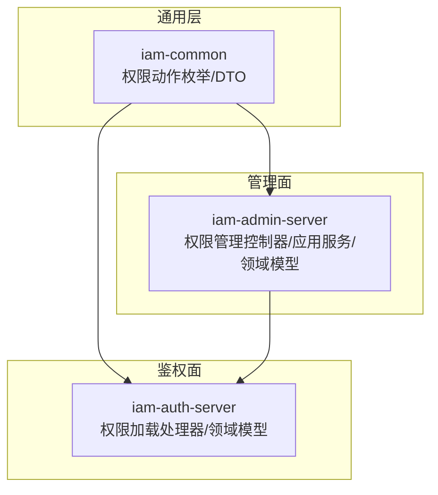
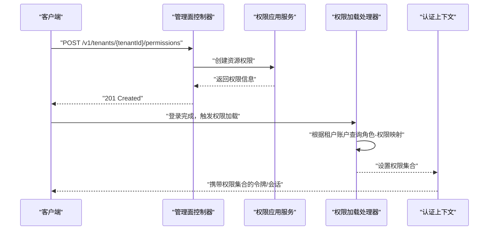
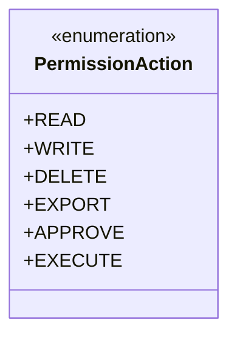
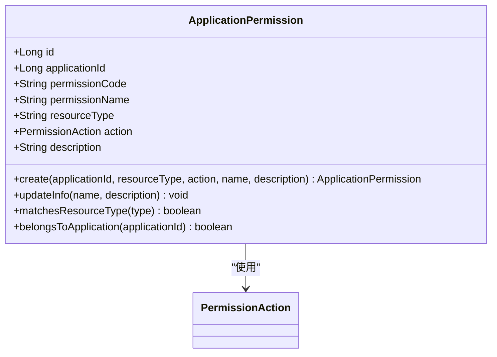
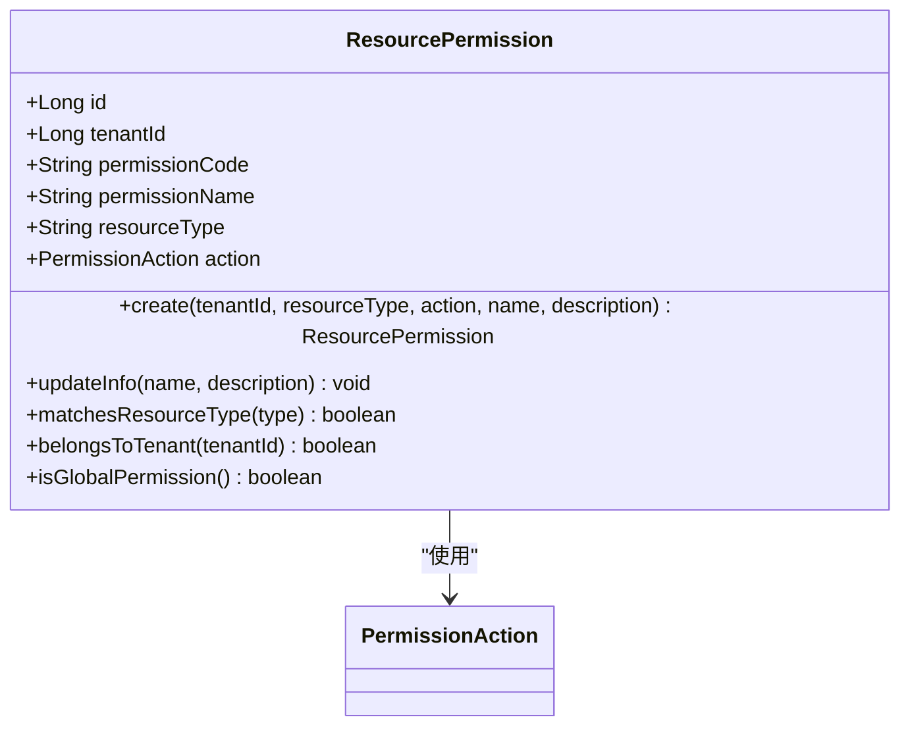
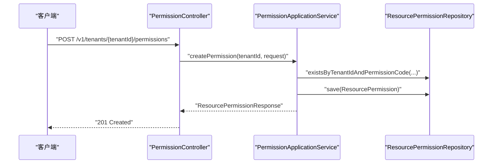
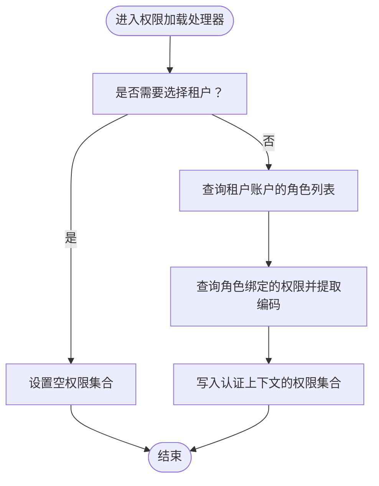
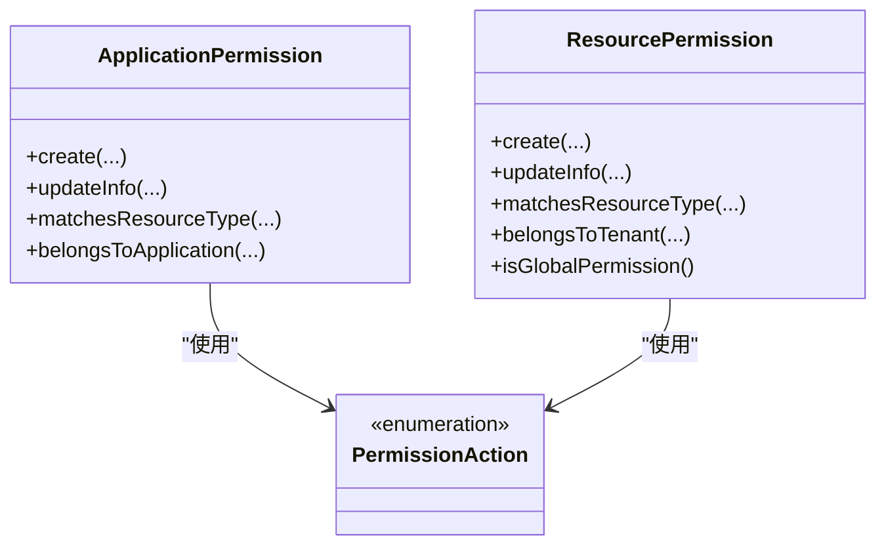
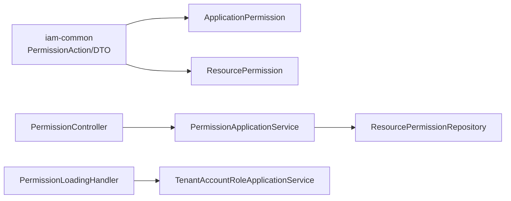

# 权限类型与分类

<cite>
**本文引用的文件**
- [PermissionAction.java](file://iam-common/src/main/java/iam/platform/common/model/enums/PermissionAction.java)
- [ApplicationPermission.java（管理端）](file://iam-admin-server/src/main/java/iam/platform/admin/domain/model/entity/ApplicationPermission.java)
- [ApplicationPermission.java（认证端）](file://iam-auth-server/src/main/java/iam/platform/auth/domain/model/entity/ApplicationPermission.java)
- [ResourcePermission.java（管理端）](file://iam-admin-server/src/main/java/iam/platform/admin/domain/model/entity/ResourcePermission.java)
- [ResourcePermission.java（认证端）](file://iam-auth-server/src/main/java/iam/platform/auth/domain/model/entity/ResourcePermission.java)
- [PermissionController.java](file://iam-admin-server/src/main/java/iam/platform/admin/interfaces/rest/PermissionController.java)
- [PermissionApplicationService.java](file://iam-admin-server/src/main/java/iam/platform/admin/application/service/PermissionApplicationService.java)
- [PermissionLoadingHandler.java](file://iam-auth-server/src/main/java/iam/platform/auth/application/service/pipeline/PermissionLoadingHandler.java)
- [CreateApplicationPermissionRequest.java](file://iam-common/src/main/java/iam/platform/common/dto/request/CreateApplicationPermissionRequest.java)
- [CreateResourcePermissionRequest.java](file://iam-common/src/main/java/iam/platform/common/dto/request/CreateResourcePermissionRequest.java)
- [ResourcePermissionResponse.java](file://iam-common/src/main/java/iam/platform/common/dto/response/ResourcePermissionResponse.java)
</cite>

## 目录
1. [引言](#引言)
2. [项目结构](#项目结构)
3. [核心组件](#核心组件)
4. [架构总览](#架构总览)
5. [详细组件分析](#详细组件分析)
6. [依赖分析](#依赖分析)
7. [性能考量](#性能考量)
8. [故障排查指南](#故障排查指南)
9. [结论](#结论)
10. [附录](#附录)

## 引言
本文件系统性梳理 IAM 平台中的“权限类型与分类”，围绕两类核心权限展开：应用级权限与资源权限。我们将解释它们的定义、设计目的、实现方式、以及在实际业务场景中的应用边界；同时给出权限动作枚举的设计思路与扩展建议，并通过图示呈现从抽象权限到具体权限的层次化映射关系。

## 项目结构
本仓库采用多模块分层架构，权限相关能力主要分布在以下模块：
- iam-common：通用模型与 DTO，包含权限动作枚举、请求/响应 DTO 等
- iam-admin-server：权限的管理面，提供权限的创建、查询、删除与角色授权等接口
- iam-auth-server：权限的鉴权面，负责在认证流程中加载用户权限集合
- iam-bff-server：前端网关，聚合后端服务接口，不直接参与权限模型定义

**图表来源**
- [PermissionAction.java:1-6](file://iam-common/src/main/java/iam/platform/common/model/enums/PermissionAction.java#L1-L6)
- [PermissionController.java:1-89](file://iam-admin-server/src/main/java/iam/platform/admin/interfaces/rest/PermissionController.java#L1-L89)
- [PermissionApplicationService.java:1-135](file://iam-admin-server/src/main/java/iam/platform/admin/application/service/PermissionApplicationService.java#L1-L135)
- [PermissionLoadingHandler.java:1-40](file://iam-auth-server/src/main/java/iam/platform/auth/application/service/pipeline/PermissionLoadingHandler.java#L1-L40)

**章节来源**
- [PermissionController.java:1-89](file://iam-admin-server/src/main/java/iam/platform/admin/interfaces/rest/PermissionController.java#L1-L89)
- [PermissionApplicationService.java:1-135](file://iam-admin-server/src/main/java/iam/platform/admin/application/service/PermissionApplicationService.java#L1-L135)

## 核心组件
- 权限动作枚举：统一定义标准操作类型，作为权限最小可组合单元
- 应用级权限：面向“应用”的权限维度，强调应用访问控制与功能权限
- 资源权限：面向“资源”的权限维度，强调对具体资源的操作与范围
- 权限管理 API：提供资源权限的创建、查询、删除与角色授权
- 权限加载流程：在认证流程中按租户账户加载其具备的权限集合

**章节来源**
- [PermissionAction.java:1-6](file://iam-common/src/main/java/iam/platform/common/model/enums/PermissionAction.java#L1-L6)
- [ApplicationPermission.java（管理端）:1-75](file://iam-admin-server/src/main/java/iam/platform/admin/domain/model/entity/ApplicationPermission.java#L1-L75)
- [ResourcePermission.java（管理端）:1-77](file://iam-admin-server/src/main/java/iam/platform/admin/domain/model/entity/ResourcePermission.java#L1-L77)
- [PermissionController.java:1-89](file://iam-admin-server/src/main/java/iam/platform/admin/interfaces/rest/PermissionController.java#L1-L89)
- [PermissionApplicationService.java:1-135](file://iam-admin-server/src/main/java/iam/platform/admin/application/service/PermissionApplicationService.java#L1-L135)
- [PermissionLoadingHandler.java:1-40](file://iam-auth-server/src/main/java/iam/platform/auth/application/service/pipeline/PermissionLoadingHandler.java#L1-L40)

## 架构总览
下图展示了权限类型在系统中的分布与流转：通用层提供权限动作与数据契约，管理面负责权限生命周期与角色授权，鉴权面在登录后按租户账户加载权限集合，供后续授权决策使用。

**图表来源**
- [PermissionController.java:35-41](file://iam-admin-server/src/main/java/iam/platform/admin/interfaces/rest/PermissionController.java#L35-L41)
- [PermissionApplicationService.java:31-49](file://iam-admin-server/src/main/java/iam/platform/admin/application/service/PermissionApplicationService.java#L31-L49)
- [PermissionLoadingHandler.java:20-33](file://iam-auth-server/src/main/java/iam/platform/auth/application/service/pipeline/PermissionLoadingHandler.java#L20-L33)

## 详细组件分析

### 权限动作枚举（PermissionAction）
- 设计目标：以标准化的动作集合作为权限最小可组合单元，便于跨模块一致表达“对某资源执行某操作”
- 可选动作：READ、WRITE、DELETE、EXPORT、APPROVE、EXECUTE
- 使用方式：在应用级权限与资源权限实体中统一引用，确保权限语义一致

**图表来源**
- [PermissionAction.java:1-6](file://iam-common/src/main/java/iam/platform/common/model/enums/PermissionAction.java#L1-L6)

**章节来源**
- [PermissionAction.java:1-6](file://iam-common/src/main/java/iam/platform/common/model/enums/PermissionAction.java#L1-L6)

### 应用级权限（ApplicationPermission）
- 定义：面向“应用”的权限维度，通常用于控制应用内的功能访问或应用间协作权限
- 关键字段：
  - 归属应用标识
  - 权限编码（自动生成规则）
  - 资源类型
  - 动作类型
  - 名称与描述
- 工厂方法：自动拼接权限编码，保证命名规范与唯一性
- 行为方法：更新信息、匹配资源类型、归属校验

**图表来源**
- [ApplicationPermission.java（管理端）:16-75](file://iam-admin-server/src/main/java/iam/platform/admin/domain/model/entity/ApplicationPermission.java#L16-L75)
- [ApplicationPermission.java（认证端）:16-75](file://iam-auth-server/src/main/java/iam/platform/auth/domain/model/entity/ApplicationPermission.java#L16-L75)
- [PermissionAction.java:1-6](file://iam-common/src/main/java/iam/platform/common/model/enums/PermissionAction.java#L1-L6)

**章节来源**
- [ApplicationPermission.java（管理端）:1-75](file://iam-admin-server/src/main/java/iam/platform/admin/domain/model/entity/ApplicationPermission.java#L1-L75)
- [ApplicationPermission.java（认证端）:1-75](file://iam-auth-server/src/main/java/iam/platform/auth/domain/model/entity/ApplicationPermission.java#L1-L75)

### 资源权限（ResourcePermission）
- 定义：面向“资源”的权限维度，明确对某一资源类型执行某一动作的授权范围
- 关键字段：
  - 归属租户（空值表示全局权限）
  - 权限编码（自动生成规则）
  - 资源类型
  - 动作类型
  - 名称与描述
- 工厂方法：自动拼接权限编码，保证命名规范与唯一性
- 行为方法：更新信息、匹配资源类型、归属校验、是否全局权限判断

**图表来源**
- [ResourcePermission.java（管理端）:16-77](file://iam-admin-server/src/main/java/iam/platform/admin/domain/model/entity/ResourcePermission.java#L16-L77)
- [ResourcePermission.java（认证端）:16-77](file://iam-auth-server/src/main/java/iam/platform/auth/domain/model/entity/ResourcePermission.java#L16-L77)
- [PermissionAction.java:1-6](file://iam-common/src/main/java/iam/platform/common/model/enums/PermissionAction.java#L1-L6)

**章节来源**
- [ResourcePermission.java（管理端）:1-77](file://iam-admin-server/src/main/java/iam/platform/admin/domain/model/entity/ResourcePermission.java#L1-L77)
- [ResourcePermission.java（认证端）:1-77](file://iam-auth-server/src/main/java/iam/platform/auth/domain/model/entity/ResourcePermission.java#L1-L77)

### 权限管理 API（资源权限）
- 接口职责：
  - 创建资源权限
  - 查询权限详情
  - 列表查询（支持按租户与资源类型过滤）
  - 删除权限
  - 角色-权限分配与移除
- 数据契约：
  - 请求：CreateResourcePermissionRequest
  - 响应：ResourcePermissionResponse

**图表来源**
- [PermissionController.java:35-41](file://iam-admin-server/src/main/java/iam/platform/admin/interfaces/rest/PermissionController.java#L35-L41)
- [PermissionApplicationService.java:31-49](file://iam-admin-server/src/main/java/iam/platform/admin/application/service/PermissionApplicationService.java#L31-L49)
- [CreateResourcePermissionRequest.java:1-30](file://iam-common/src/main/java/iam/platform/common/dto/request/CreateResourcePermissionRequest.java#L1-L30)
- [ResourcePermissionResponse.java:1-26](file://iam-common/src/main/java/iam/platform/common/dto/response/ResourcePermissionResponse.java#L1-L26)

**章节来源**
- [PermissionController.java:1-89](file://iam-admin-server/src/main/java/iam/platform/admin/interfaces/rest/PermissionController.java#L1-L89)
- [PermissionApplicationService.java:1-135](file://iam-admin-server/src/main/java/iam/platform/admin/application/service/PermissionApplicationService.java#L1-L135)
- [CreateResourcePermissionRequest.java:1-30](file://iam-common/src/main/java/iam/platform/common/dto/request/CreateResourcePermissionRequest.java#L1-L30)
- [ResourcePermissionResponse.java:1-26](file://iam-common/src/main/java/iam/platform/common/dto/response/ResourcePermissionResponse.java#L1-L26)

### 权限加载流程（鉴权面）
- 触发时机：登录成功后的鉴权流水线阶段
- 处理逻辑：
  - 若未选择租户，则跳过权限加载
  - 否则根据租户账户查询其角色-权限映射，提取权限编码集合
  - 将权限集合写入认证上下文，供后续授权检查使用

**图表来源**
- [PermissionLoadingHandler.java:20-33](file://iam-auth-server/src/main/java/iam/platform/auth/application/service/pipeline/PermissionLoadingHandler.java#L20-L33)

**章节来源**
- [PermissionLoadingHandler.java:1-40](file://iam-auth-server/src/main/java/iam/platform/auth/application/service/pipeline/PermissionLoadingHandler.java#L1-L40)

### 权限类型层次结构
从抽象到具体的映射关系如下：
- 抽象权限：权限动作（PermissionAction）
- 具体权限：
  - 应用级权限（ApplicationPermission）
  - 资源权限（ResourcePermission）

**图表来源**
- [PermissionAction.java:1-6](file://iam-common/src/main/java/iam/platform/common/model/enums/PermissionAction.java#L1-L6)
- [ApplicationPermission.java（管理端）:16-75](file://iam-admin-server/src/main/java/iam/platform/admin/domain/model/entity/ApplicationPermission.java#L16-L75)
- [ResourcePermission.java（管理端）:16-77](file://iam-admin-server/src/main/java/iam/platform/admin/domain/model/entity/ResourcePermission.java#L16-L77)

**章节来源**
- [PermissionAction.java:1-6](file://iam-common/src/main/java/iam/platform/common/model/enums/PermissionAction.java#L1-L6)
- [ApplicationPermission.java（管理端）:1-75](file://iam-admin-server/src/main/java/iam/platform/admin/domain/model/entity/ApplicationPermission.java#L1-L75)
- [ResourcePermission.java（管理端）:1-77](file://iam-admin-server/src/main/java/iam/platform/admin/domain/model/entity/ResourcePermission.java#L1-L77)

### 权限分类与业务场景
- 应用级权限（ApplicationPermission）
  - 场景：应用访问控制、应用功能权限、应用间协作授权
  - 设计考虑：以“应用+资源类型+动作”为维度，强调应用边界内的功能开关与协作范围
- 资源权限（ResourcePermission）
  - 场景：API 权限、UI 权限、数据权限
  - 设计考虑：以“租户+资源类型+动作”为维度，强调细粒度的资源操作控制与作用域隔离
- 权限动作（PermissionAction）
  - 设计考虑：统一动作语义，便于跨模块一致表达与扩展

**章节来源**
- [ApplicationPermission.java（管理端）:1-75](file://iam-admin-server/src/main/java/iam/platform/admin/domain/model/entity/ApplicationPermission.java#L1-L75)
- [ResourcePermission.java（管理端）:1-77](file://iam-admin-server/src/main/java/iam/platform/admin/domain/model/entity/ResourcePermission.java#L1-L77)
- [PermissionAction.java:1-6](file://iam-common/src/main/java/iam/platform/common/model/enums/PermissionAction.java#L1-L6)

## 依赖分析
- 权限动作枚举被应用级权限与资源权限共同依赖，确保权限语义一致性
- 管理面控制器依赖应用服务进行权限生命周期管理
- 鉴权面处理器依赖租户账户-角色服务加载权限集合
- 请求/响应 DTO 在通用层定义，避免重复与耦合

**图表来源**
- [PermissionAction.java:1-6](file://iam-common/src/main/java/iam/platform/common/model/enums/PermissionAction.java#L1-L6)
- [ApplicationPermission.java（管理端）:1-75](file://iam-admin-server/src/main/java/iam/platform/admin/domain/model/entity/ApplicationPermission.java#L1-L75)
- [ResourcePermission.java（管理端）:1-77](file://iam-admin-server/src/main/java/iam/platform/admin/domain/model/entity/ResourcePermission.java#L1-L77)
- [PermissionController.java:1-89](file://iam-admin-server/src/main/java/iam/platform/admin/interfaces/rest/PermissionController.java#L1-L89)
- [PermissionApplicationService.java:1-135](file://iam-admin-server/src/main/java/iam/platform/admin/application/service/PermissionApplicationService.java#L1-L135)
- [PermissionLoadingHandler.java:1-40](file://iam-auth-server/src/main/java/iam/platform/auth/application/service/pipeline/PermissionLoadingHandler.java#L1-L40)

**章节来源**
- [PermissionController.java:1-89](file://iam-admin-server/src/main/java/iam/platform/admin/interfaces/rest/PermissionController.java#L1-L89)
- [PermissionApplicationService.java:1-135](file://iam-admin-server/src/main/java/iam/platform/admin/application/service/PermissionApplicationService.java#L1-L135)
- [PermissionLoadingHandler.java:1-40](file://iam-auth-server/src/main/java/iam/platform/auth/application/service/pipeline/PermissionLoadingHandler.java#L1-L40)

## 性能考量
- 权限唯一性校验：在创建资源权限时按租户维度校验权限编码唯一性，避免全局冲突带来的查询压力
- 权限加载：鉴权阶段按租户账户一次性加载权限集合，减少后续授权检查的数据库访问次数
- 批量查询：列表接口支持按资源类型与租户过滤，降低无效数据传输与处理开销

**章节来源**
- [PermissionApplicationService.java:35-49](file://iam-admin-server/src/main/java/iam/platform/admin/application/service/PermissionApplicationService.java#L35-L49)
- [PermissionLoadingHandler.java:20-33](file://iam-auth-server/src/main/java/iam/platform/auth/application/service/pipeline/PermissionLoadingHandler.java#L20-L33)

## 故障排查指南
- 权限创建失败（已存在）：确认租户维度下的权限编码是否重复，必要时调整资源类型或动作
- 权限不存在：确认 ID 是否正确，或是否已被删除
- 角色未找到：确认角色 ID 是否有效
- 权限已分配：确认角色-权限映射是否已存在，避免重复授权
- 未选择租户导致权限为空：确认登录流程已完成租户选择步骤

**章节来源**
- [PermissionApplicationService.java:38-40](file://iam-admin-server/src/main/java/iam/platform/admin/application/service/PermissionApplicationService.java#L38-L40)
- [PermissionApplicationService.java:84-96](file://iam-admin-server/src/main/java/iam/platform/admin/application/service/PermissionApplicationService.java#L84-L96)
- [PermissionApplicationService.java:105-108](file://iam-admin-server/src/main/java/iam/platform/admin/application/service/PermissionApplicationService.java#L105-L108)
- [PermissionLoadingHandler.java:22-26](file://iam-auth-server/src/main/java/iam/platform/auth/application/service/pipeline/PermissionLoadingHandler.java#L22-L26)

## 结论
本文件系统化阐述了 IAM 平台的权限类型与分类：以权限动作枚举为最小语义单元，构建应用级权限与资源权限两大维度，并通过管理面 API 与鉴权面流程实现权限的全生命周期管理与运行时加载。该设计兼顾了应用边界内的功能控制与资源粒度的精细化授权，适用于 API、UI、数据等多类业务场景。

## 附录
- 权限动作扩展建议：若需新增动作（如 IMPORT、SHARE），可在枚举中扩展并在各模块同步适配
- 编码规范：应用级权限与资源权限均提供工厂方法生成规范化的权限编码，建议严格遵循