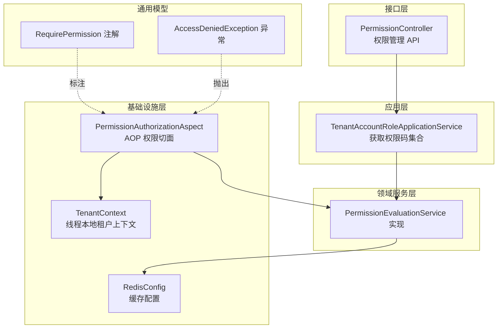
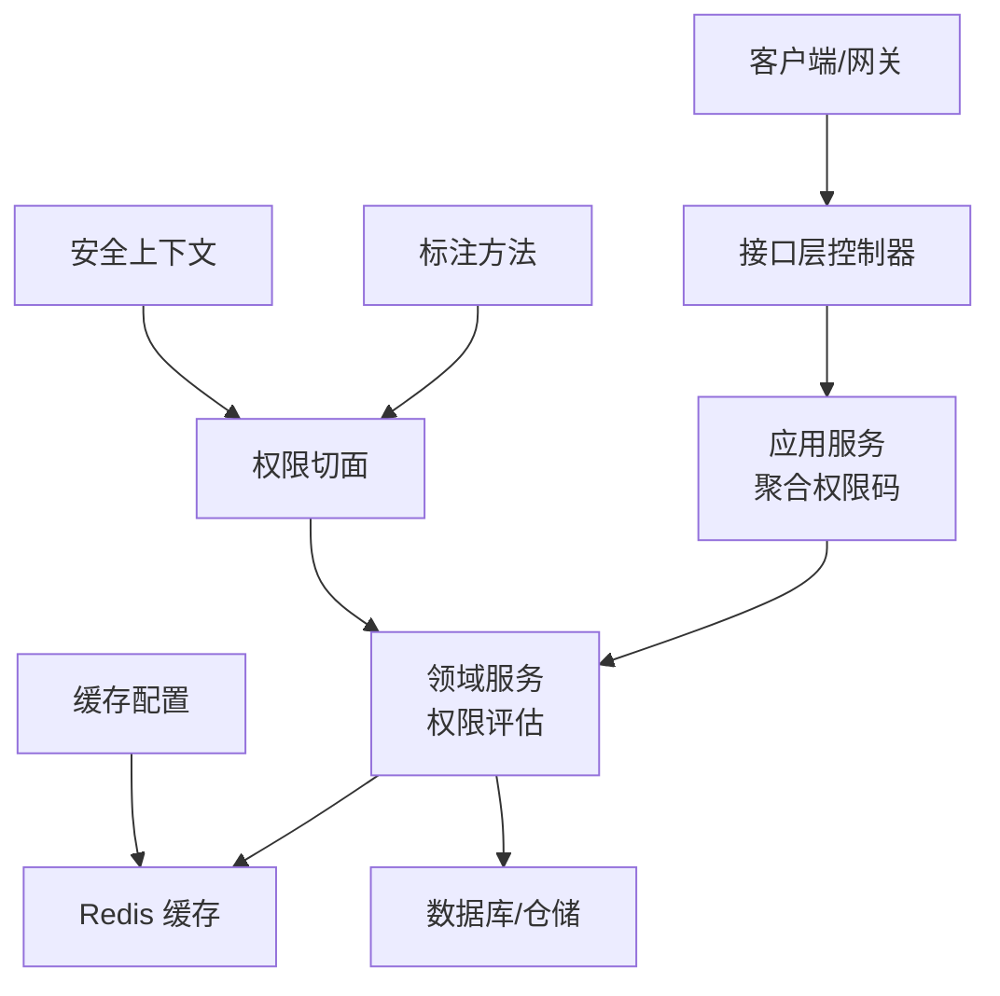
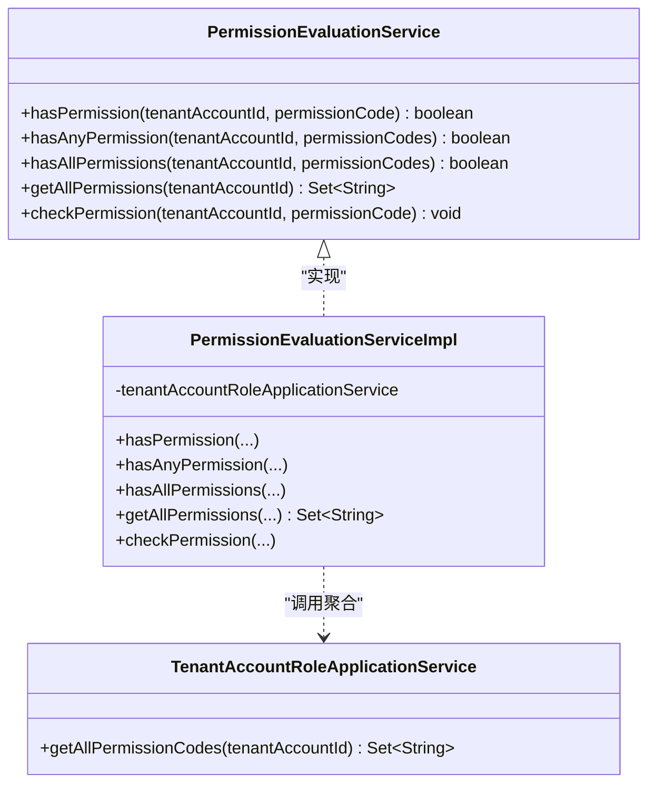
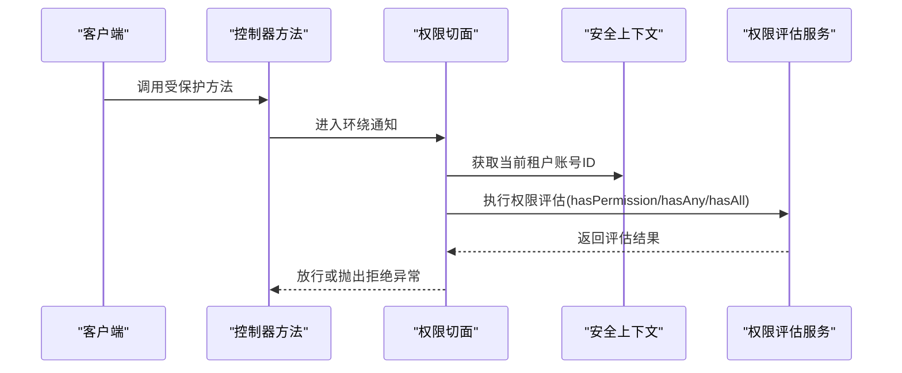
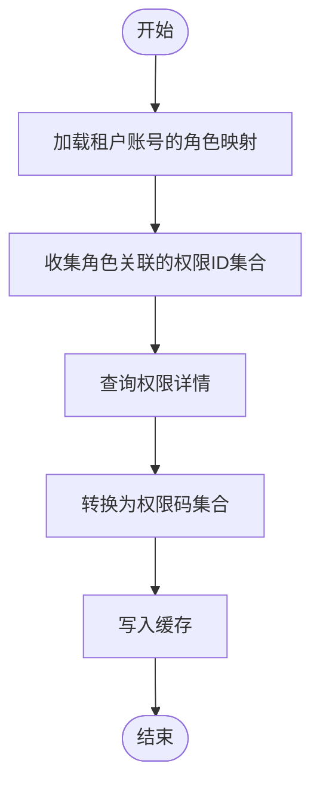
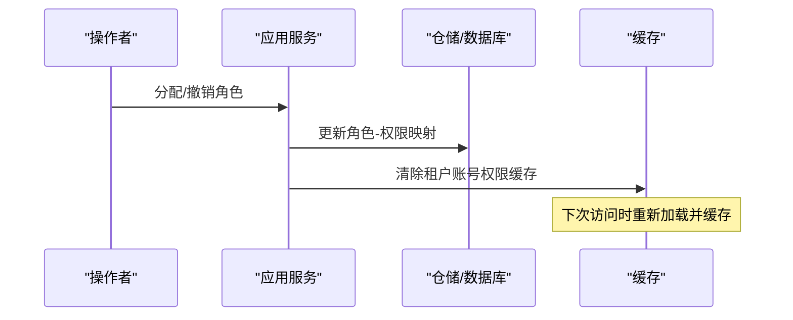
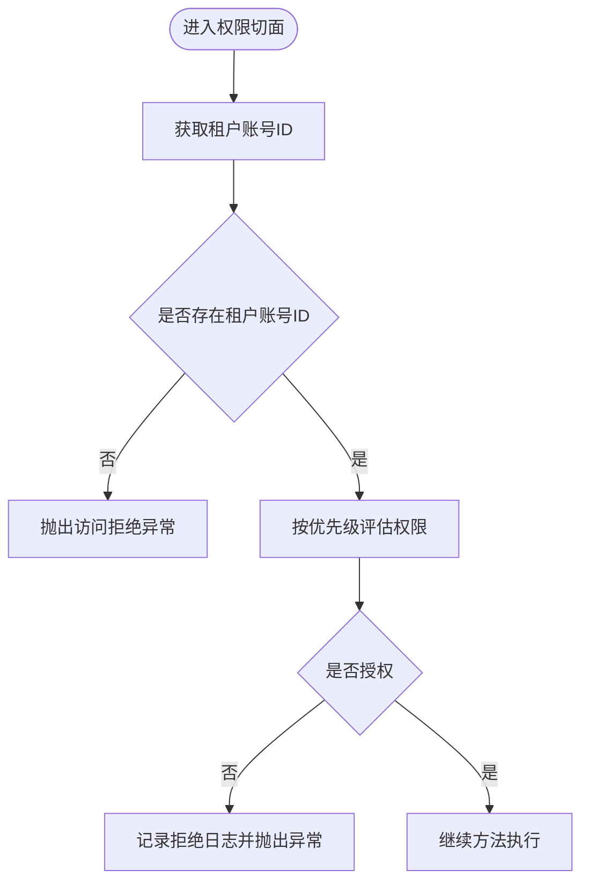
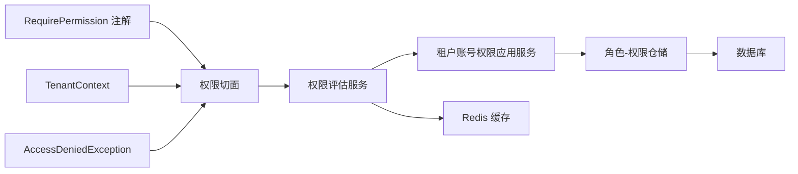

# 权限评估机制

<cite>
**本文引用的文件**   
- [PermissionEvaluationServiceImpl.java](file://iam-admin-server/src/main/java/iam/platform/admin/domain/service/impl/PermissionEvaluationServiceImpl.java)
- [PermissionAuthorizationAspect.java](file://iam-admin-server/src/main/java/iam/platform/admin/infrastructure/aspect/PermissionAuthorizationAspect.java)
- [RequirePermission.java](file://iam-common/src/main/java/iam/platform/common/model/annotation/RequirePermission.java)
- [PermissionEvaluationService.java](file://iam-admin-server/src/main/java/iam/platform/admin/domain/service/PermissionEvaluationService.java)
- [TenantAccountRoleApplicationService.java](file://iam-admin-server/src/main/java/iam/platform/admin/application/service/TenantAccountRoleApplicationService.java)
- [TenantContext.java](file://iam-admin-server/src/main/java/iam/platform/admin/infrastructure/security/TenantContext.java)
- [RedisConfig.java（管理端）](file://iam-admin-server/src/main/java/iam/platform/admin/infrastructure/config/RedisConfig.java)
- [PermissionController.java](file://iam-admin-server/src/main/java/iam/platform/admin/interfaces/rest/PermissionController.java)
- [AccessDeniedException.java](file://iam-common/src/main/java/iam/platform/common/model/exception/AccessDeniedException.java)
- [PermissionApplicationService.java](file://iam-admin-server/src/main/java/iam/platform/admin/application/service/PermissionApplicationService.java)
- [RolePermission.java](file://iam-admin-server/src/main/java/iam/platform/admin/domain/model/entity/RolePermission.java)
- [RolePermissionRepository.java](file://iam-admin-server/src/main/java/iam/platform/admin/domain/repository/RolePermissionRepository.java)
</cite>

## 目录
1. [简介](#简介)
2. [项目结构](#项目结构)
3. [核心组件](#核心组件)
4. [架构总览](#架构总览)
5. [详细组件分析](#详细组件分析)
6. [依赖分析](#依赖分析)
7. [性能考量](#性能考量)
8. [故障排查指南](#故障排查指南)
9. [结论](#结论)
10. [附录](#附录)

## 简介
本文件系统性阐述 IAM 平台中的权限评估机制，覆盖权限计算算法、权限缓存策略、权限决策过程、权限切面设计、权限查询与组合、冲突处理、以及高并发场景下的线程安全与性能优化策略。文档以代码为依据，结合类图、序列图与流程图，帮助读者快速理解从“权限请求”到“权限决策”的完整链路。

## 项目结构
权限评估相关能力主要分布在以下模块与层次：
- 应用层：负责权限数据的读取与聚合（如租户账号权限码集合），并触发缓存失效。
- 领域服务层：提供权限评估接口与实现，封装权限判断逻辑与缓存调用。
- 基础设施层：AOP 切面拦截标注方法，执行权限前置校验；安全上下文提供当前租户账号信息；Redis 缓存配置统一管理缓存行为。
- 接口层：对外暴露权限管理 API，支撑权限的增删改查与角色-权限映射维护。

图表来源
- [TenantAccountRoleApplicationService.java:103-127](file://iam-admin-server/src/main/java/iam/platform/admin/application/service/TenantAccountRoleApplicationService.java#L103-L127)
- [PermissionEvaluationServiceImpl.java:20-42](file://iam-admin-server/src/main/java/iam/platform/admin/domain/service/impl/PermissionEvaluationServiceImpl.java#L20-L42)
- [PermissionAuthorizationAspect.java:30-49](file://iam-admin-server/src/main/java/iam/platform/admin/infrastructure/aspect/PermissionAuthorizationAspect.java#L30-L49)
- [TenantContext.java:31-36](file://iam-admin-server/src/main/java/iam/platform/admin/infrastructure/security/TenantContext.java#L31-L36)
- [RedisConfig.java（管理端）:19-28](file://iam-admin-server/src/main/java/iam/platform/admin/infrastructure/config/RedisConfig.java#L19-L28)
- [PermissionController.java:35-87](file://iam-admin-server/src/main/java/iam/platform/admin/interfaces/rest/PermissionController.java#L35-L87)
- [RequirePermission.java:17-34](file://iam-common/src/main/java/iam/platform/common/model/annotation/RequirePermission.java#L17-L34)
- [AccessDeniedException.java:6-19](file://iam-common/src/main/java/iam/platform/common/model/exception/AccessDeniedException.java#L6-L19)

章节来源
- [PermissionEvaluationServiceImpl.java:1-53](file://iam-admin-server/src/main/java/iam/platform/admin/domain/service/impl/PermissionEvaluationServiceImpl.java#L1-L53)
- [PermissionAuthorizationAspect.java:1-79](file://iam-admin-server/src/main/java/iam/platform/admin/infrastructure/aspect/PermissionAuthorizationAspect.java#L1-L79)
- [RequirePermission.java:1-35](file://iam-common/src/main/java/iam/platform/common/model/annotation/RequirePermission.java#L1-L35)
- [PermissionEvaluationService.java:1-54](file://iam-admin-server/src/main/java/iam/platform/admin/domain/service/PermissionEvaluationService.java#L1-L54)
- [TenantAccountRoleApplicationService.java:1-145](file://iam-admin-server/src/main/java/iam/platform/admin/application/service/TenantAccountRoleApplicationService.java#L1-L145)
- [TenantContext.java:1-45](file://iam-admin-server/src/main/java/iam/platform/admin/infrastructure/security/TenantContext.java#L1-L45)
- [RedisConfig.java（管理端）:1-30](file://iam-admin-server/src/main/java/iam/platform/admin/infrastructure/config/RedisConfig.java#L1-L30)
- [PermissionController.java:1-89](file://iam-admin-server/src/main/java/iam/platform/admin/interfaces/rest/PermissionController.java#L1-L89)
- [AccessDeniedException.java:1-25](file://iam-common/src/main/java/iam/platform/common/model/exception/AccessDeniedException.java#L1-L25)
- [PermissionApplicationService.java:1-135](file://iam-admin-server/src/main/java/iam/platform/admin/application/service/PermissionApplicationService.java#L1-L135)
- [RolePermission.java:1-20](file://iam-admin-server/src/main/java/iam/platform/admin/domain/model/entity/RolePermission.java#L1-L20)
- [RolePermissionRepository.java:1-22](file://iam-admin-server/src/main/java/iam/platform/admin/domain/repository/RolePermissionRepository.java#L1-L22)

## 核心组件
- 权限评估服务接口与实现：定义并实现权限判断、权限集合获取、权限校验等能力，支持单个、任一、全部权限判断，并通过注解驱动缓存。
- 权限评估切面：基于 AOP 在标注方法前执行权限检查，支持单权限、任一权限集合（OR）、全部权限集合（AND）三种策略。
- 租户账号权限聚合服务：根据租户账号的角色映射，聚合其拥有的资源权限并输出权限码集合，同时在角色变更时触发缓存失效。
- 安全上下文：线程本地存储当前租户账号 ID，供切面与评估服务使用。
- 缓存配置：启用 Redis 缓存，设置默认 TTL、键前缀与序列化策略，统一管理权限缓存。
- 权限注解：声明式权限控制的元数据，描述所需权限的表达方式。
- 异常模型：访问拒绝异常，携带被拒绝的权限标识，便于上层统一处理。

章节来源
- [PermissionEvaluationService.java:8-53](file://iam-admin-server/src/main/java/iam/platform/admin/domain/service/PermissionEvaluationService.java#L8-L53)
- [PermissionEvaluationServiceImpl.java:16-52](file://iam-admin-server/src/main/java/iam/platform/admin/domain/service/impl/PermissionEvaluationServiceImpl.java#L16-L52)
- [PermissionAuthorizationAspect.java:21-78](file://iam-admin-server/src/main/java/iam/platform/admin/infrastructure/aspect/PermissionAuthorizationAspect.java#L21-L78)
- [TenantAccountRoleApplicationService.java:103-127](file://iam-admin-server/src/main/java/iam/platform/admin/application/service/TenantAccountRoleApplicationService.java#L103-L127)
- [TenantContext.java:7-44](file://iam-admin-server/src/main/java/iam/platform/admin/infrastructure/security/TenantContext.java#L7-L44)
- [RedisConfig.java（管理端）:15-28](file://iam-admin-server/src/main/java/iam/platform/admin/infrastructure/config/RedisConfig.java#L15-L28)
- [RequirePermission.java:14-34](file://iam-common/src/main/java/iam/platform/common/model/annotation/RequirePermission.java#L14-L34)
- [AccessDeniedException.java:6-24](file://iam-common/src/main/java/iam/platform/common/model/exception/AccessDeniedException.java#L6-L24)

## 架构总览
下图展示了权限评估在系统中的交互关系：接口层发起业务请求，应用层聚合权限码，领域服务层进行权限判断与缓存，AOP 切面在方法执行前进行拦截校验，安全上下文提供租户账号信息，缓存配置保障缓存行为。

图表来源
- [PermissionController.java:35-87](file://iam-admin-server/src/main/java/iam/platform/admin/interfaces/rest/PermissionController.java#L35-L87)
- [TenantAccountRoleApplicationService.java:103-127](file://iam-admin-server/src/main/java/iam/platform/admin/application/service/TenantAccountRoleApplicationService.java#L103-L127)
- [PermissionEvaluationServiceImpl.java:20-42](file://iam-admin-server/src/main/java/iam/platform/admin/domain/service/impl/PermissionEvaluationServiceImpl.java#L20-L42)
- [PermissionAuthorizationAspect.java:30-49](file://iam-admin-server/src/main/java/iam/platform/admin/infrastructure/aspect/PermissionAuthorizationAspect.java#L30-L49)
- [TenantContext.java:31-36](file://iam-admin-server/src/main/java/iam/platform/admin/infrastructure/security/TenantContext.java#L31-L36)
- [RedisConfig.java（管理端）:19-28](file://iam-admin-server/src/main/java/iam/platform/admin/infrastructure/config/RedisConfig.java#L19-L28)

## 详细组件分析

### 权限评估服务与算法
- 单权限判断：在已获取的权限集合中直接查找目标权限码。
- 任一权限判断：对权限码集合进行任意匹配，满足即通过。
- 全部权限判断：对权限码集合进行全部匹配，缺一不可。
- 权限集合获取：通过应用服务聚合角色-权限映射，返回权限码集合，并由缓存注解进行缓存。

图表来源
- [PermissionEvaluationService.java:8-53](file://iam-admin-server/src/main/java/iam/platform/admin/domain/service/PermissionEvaluationService.java#L8-L53)
- [PermissionEvaluationServiceImpl.java:16-52](file://iam-admin-server/src/main/java/iam/platform/admin/domain/service/impl/PermissionEvaluationServiceImpl.java#L16-L52)
- [TenantAccountRoleApplicationService.java:123-127](file://iam-admin-server/src/main/java/iam/platform/admin/application/service/TenantAccountRoleApplicationService.java#L123-L127)

章节来源
- [PermissionEvaluationService.java:8-53](file://iam-admin-server/src/main/java/iam/platform/admin/domain/service/PermissionEvaluationService.java#L8-L53)
- [PermissionEvaluationServiceImpl.java:20-52](file://iam-admin-server/src/main/java/iam/platform/admin/domain/service/impl/PermissionEvaluationServiceImpl.java#L20-L52)
- [TenantAccountRoleApplicationService.java:103-127](file://iam-admin-server/src/main/java/iam/platform/admin/application/service/TenantAccountRoleApplicationService.java#L103-L127)

### 权限切面设计与拦截流程
- 方法拦截：对标注了权限注解的方法进行环绕拦截。
- 上下文获取：从安全上下文中获取当前租户账号 ID。
- 权限评估：优先级顺序为“单权限”、“全部权限集合（AND）”、“任一权限集合（OR）”，若均不满足则拒绝。
- 异常处理：抛出访问拒绝异常，便于全局异常处理器统一处理。

图表来源
- [PermissionAuthorizationAspect.java:30-49](file://iam-admin-server/src/main/java/iam/platform/admin/infrastructure/aspect/PermissionAuthorizationAspect.java#L30-L49)
- [TenantContext.java:31-36](file://iam-admin-server/src/main/java/iam/platform/admin/infrastructure/security/TenantContext.java#L31-L36)
- [PermissionEvaluationServiceImpl.java:20-36](file://iam-admin-server/src/main/java/iam/platform/admin/domain/service/impl/PermissionEvaluationServiceImpl.java#L20-L36)

章节来源
- [PermissionAuthorizationAspect.java:17-78](file://iam-admin-server/src/main/java/iam/platform/admin/infrastructure/aspect/PermissionAuthorizationAspect.java#L17-L78)
- [RequirePermission.java:9-34](file://iam-common/src/main/java/iam/platform/common/model/annotation/RequirePermission.java#L9-L34)
- [TenantContext.java:7-44](file://iam-admin-server/src/main/java/iam/platform/admin/infrastructure/security/TenantContext.java#L7-L44)
- [AccessDeniedException.java:6-24](file://iam-common/src/main/java/iam/platform/common/model/exception/AccessDeniedException.java#L6-L24)

### 权限查询、组合与冲突处理
- 权限查询：应用服务根据租户账号 ID 获取其角色映射，再聚合角色所关联的资源权限，最终输出权限码集合。
- 权限组合：支持单权限、任一权限集合（OR）、全部权限集合（AND）三种组合策略，优先级明确。
- 冲突处理：当角色或权限发生变更时，通过缓存注解触发缓存失效，确保后续评估使用最新权限集合。

图表来源
- [TenantAccountRoleApplicationService.java:103-127](file://iam-admin-server/src/main/java/iam/platform/admin/application/service/TenantAccountRoleApplicationService.java#L103-L127)
- [PermissionEvaluationServiceImpl.java:39-42](file://iam-admin-server/src/main/java/iam/platform/admin/domain/service/impl/PermissionEvaluationServiceImpl.java#L39-L42)

章节来源
- [TenantAccountRoleApplicationService.java:103-127](file://iam-admin-server/src/main/java/iam/platform/admin/application/service/TenantAccountRoleApplicationService.java#L103-L127)
- [PermissionApplicationService.java:81-111](file://iam-admin-server/src/main/java/iam/platform/admin/application/service/PermissionApplicationService.java#L81-L111)
- [RolePermissionRepository.java:10-16](file://iam-admin-server/src/main/java/iam/platform/admin/domain/repository/RolePermissionRepository.java#L10-L16)
- [RolePermission.java:14-18](file://iam-admin-server/src/main/java/iam/platform/admin/domain/model/entity/RolePermission.java#L14-L18)

### 权限缓存策略与失效机制
- 缓存键：以租户账号 ID 作为缓存键，保证不同租户账号的权限隔离。
- 缓存注解：在权限集合获取方法上使用缓存注解，自动缓存权限码集合。
- 失效策略：在角色分配/撤销等导致权限变化的操作中，显式清除对应租户账号的权限缓存，确保一致性。
- 缓存配置：统一的 Redis 缓存管理器，设置默认 TTL、禁用空值缓存、键前缀与 JSON 序列化。

图表来源
- [TenantAccountRoleApplicationService.java:44-46](file://iam-admin-server/src/main/java/iam/platform/admin/application/service/TenantAccountRoleApplicationService.java#L44-L46)
- [TenantAccountRoleApplicationService.java:77-85](file://iam-admin-server/src/main/java/iam/platform/admin/application/service/TenantAccountRoleApplicationService.java#L77-L85)
- [PermissionEvaluationServiceImpl.java:39-42](file://iam-admin-server/src/main/java/iam/platform/admin/domain/service/impl/PermissionEvaluationServiceImpl.java#L39-L42)
- [RedisConfig.java（管理端）:19-28](file://iam-admin-server/src/main/java/iam/platform/admin/infrastructure/config/RedisConfig.java#L19-L28)

章节来源
- [PermissionEvaluationServiceImpl.java:39-42](file://iam-admin-server/src/main/java/iam/platform/admin/domain/service/impl/PermissionEvaluationServiceImpl.java#L39-L42)
- [TenantAccountRoleApplicationService.java:44-46](file://iam-admin-server/src/main/java/iam/platform/admin/application/service/TenantAccountRoleApplicationService.java#L44-L46)
- [TenantAccountRoleApplicationService.java:77-85](file://iam-admin-server/src/main/java/iam/platform/admin/application/service/TenantAccountRoleApplicationService.java#L77-L85)
- [RedisConfig.java（管理端）:15-28](file://iam-admin-server/src/main/java/iam/platform/admin/infrastructure/config/RedisConfig.java#L15-L28)

### 权限决策过程与拒绝处理
- 决策入口：标注了权限注解的方法进入切面，先校验租户上下文，再按优先级评估权限。
- 拒绝路径：若未满足权限要求，记录告警日志并抛出访问拒绝异常，交由全局异常处理器处理。
- 通过路径：满足条件后放行方法执行。

图表来源
- [PermissionAuthorizationAspect.java:30-49](file://iam-admin-server/src/main/java/iam/platform/admin/infrastructure/aspect/PermissionAuthorizationAspect.java#L30-L49)
- [AccessDeniedException.java:6-24](file://iam-common/src/main/java/iam/platform/common/model/exception/AccessDeniedException.java#L6-L24)

章节来源
- [PermissionAuthorizationAspect.java:30-64](file://iam-admin-server/src/main/java/iam/platform/admin/infrastructure/aspect/PermissionAuthorizationAspect.java#L30-L64)
- [AccessDeniedException.java:6-24](file://iam-common/src/main/java/iam/platform/common/model/exception/AccessDeniedException.java#L6-L24)

## 依赖分析
- 权限评估服务依赖于应用服务以获取权限码集合；应用服务依赖仓储层进行角色-权限映射与权限详情查询。
- 权限切面依赖权限评估服务与安全上下文；注解提供权限策略描述；异常用于统一拒绝处理。
- 缓存配置为权限评估提供统一的缓存行为，避免重复查询数据库。

图表来源
- [RequirePermission.java:17-34](file://iam-common/src/main/java/iam/platform/common/model/annotation/RequirePermission.java#L17-L34)
- [PermissionAuthorizationAspect.java:28-49](file://iam-admin-server/src/main/java/iam/platform/admin/infrastructure/aspect/PermissionAuthorizationAspect.java#L28-L49)
- [TenantContext.java:31-36](file://iam-admin-server/src/main/java/iam/platform/admin/infrastructure/security/TenantContext.java#L31-L36)
- [PermissionEvaluationServiceImpl.java:18-41](file://iam-admin-server/src/main/java/iam/platform/admin/domain/service/impl/PermissionEvaluationServiceImpl.java#L18-L41)
- [TenantAccountRoleApplicationService.java:34-38](file://iam-admin-server/src/main/java/iam/platform/admin/application/service/TenantAccountRoleApplicationService.java#L34-L38)
- [RolePermissionRepository.java:10-16](file://iam-admin-server/src/main/java/iam/platform/admin/domain/repository/RolePermissionRepository.java#L10-L16)
- [AccessDeniedException.java:6-24](file://iam-common/src/main/java/iam/platform/common/model/exception/AccessDeniedException.java#L6-L24)

章节来源
- [PermissionEvaluationServiceImpl.java:16-42](file://iam-admin-server/src/main/java/iam/platform/admin/domain/service/impl/PermissionEvaluationServiceImpl.java#L16-L42)
- [TenantAccountRoleApplicationService.java:34-38](file://iam-admin-server/src/main/java/iam/platform/admin/application/service/TenantAccountRoleApplicationService.java#L34-L38)
- [RolePermissionRepository.java:10-16](file://iam-admin-server/src/main/java/iam/platform/admin/domain/repository/RolePermissionRepository.java#L10-L16)
- [PermissionAuthorizationAspect.java:28-49](file://iam-admin-server/src/main/java/iam/platform/admin/infrastructure/aspect/PermissionAuthorizationAspect.java#L28-L49)
- [RequirePermission.java:17-34](file://iam-common/src/main/java/iam/platform/common/model/annotation/RequirePermission.java#L17-L34)
- [AccessDeniedException.java:6-24](file://iam-common/src/main/java/iam/platform/common/model/exception/AccessDeniedException.java#L6-L24)

## 性能考量
- 批量权限查询：通过应用服务一次性聚合角色-权限映射，减少多次往返数据库的开销。
- 权限预计算：将权限码集合放入缓存，避免每次请求都进行数据库查询。
- 权限索引设计：角色-权限映射表应建立合适的索引（如按角色 ID、权限 ID 查询），降低聚合成本。
- 线程安全：使用线程本地存储保存租户账号上下文，避免跨线程污染。
- 锁机制：在高并发场景下，建议对关键写操作（如角色分配/撤销）采用分布式锁或幂等设计，防止脏写。
- 性能监控：建议埋点统计权限评估命中率、缓存 TTL、数据库查询耗时与异常率，持续优化缓存策略与查询路径。

## 故障排查指南
- 无租户上下文：切面在无法获取租户账号 ID 时会直接拒绝，需检查登录流程与安全过滤器是否正确设置上下文。
- 权限拒绝异常：当评估失败时会抛出访问拒绝异常，可通过异常消息与日志定位具体缺失的权限码。
- 缓存不一致：角色变更后需确保缓存失效生效，检查缓存注解与缓存键是否正确。
- 数据不一致：角色-权限映射变更后未清理缓存，导致评估仍使用旧权限集合，需确认应用服务的缓存失效逻辑。

章节来源
- [PermissionAuthorizationAspect.java:33-38](file://iam-admin-server/src/main/java/iam/platform/admin/infrastructure/aspect/PermissionAuthorizationAspect.java#L33-L38)
- [AccessDeniedException.java:11-19](file://iam-common/src/main/java/iam/platform/common/model/exception/AccessDeniedException.java#L11-L19)
- [TenantAccountRoleApplicationService.java:44-46](file://iam-admin-server/src/main/java/iam/platform/admin/application/service/TenantAccountRoleApplicationService.java#L44-L46)
- [TenantContext.java:31-36](file://iam-admin-server/src/main/java/iam/platform/admin/infrastructure/security/TenantContext.java#L31-L36)

## 结论
该权限评估机制通过“注解 + AOP + 缓存 + 应用聚合”的组合，实现了声明式的权限拦截、高效的权限判断与可维护的权限管理。在高并发场景下，配合合理的缓存策略、线程安全设计与性能监控，能够稳定支撑权限评估需求。建议在生产环境中进一步完善缓存命中率监控、分布式锁与幂等设计，以提升整体可靠性与性能。

## 附录
- 权限管理 API：提供权限的创建、查询、删除与角色-权限映射的维护，支撑权限评估的数据基础。
- 角色-权限映射实体与仓储：承载权限与角色之间的多对多关系，是权限聚合的关键数据结构。

章节来源
- [PermissionController.java:35-87](file://iam-admin-server/src/main/java/iam/platform/admin/interfaces/rest/PermissionController.java#L35-L87)
- [PermissionApplicationService.java:81-118](file://iam-admin-server/src/main/java/iam/platform/admin/application/service/PermissionApplicationService.java#L81-L118)
- [RolePermission.java:14-18](file://iam-admin-server/src/main/java/iam/platform/admin/domain/model/entity/RolePermission.java#L14-L18)
- [RolePermissionRepository.java:10-16](file://iam-admin-server/src/main/java/iam/platform/admin/domain/repository/RolePermissionRepository.java#L10-L16)