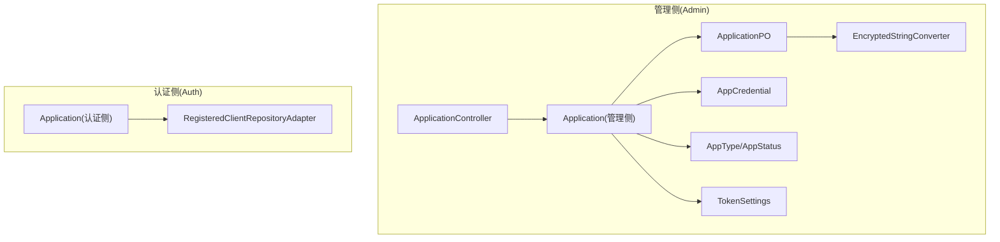
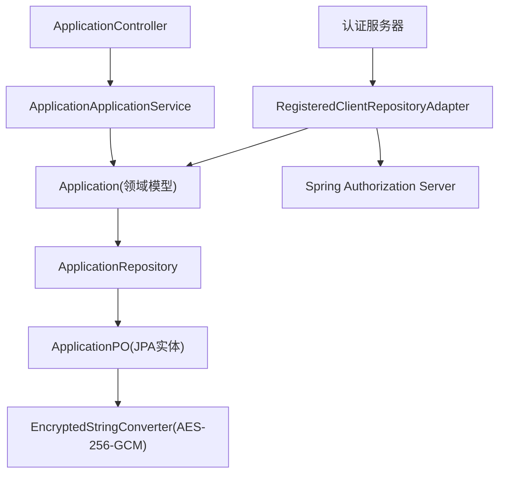
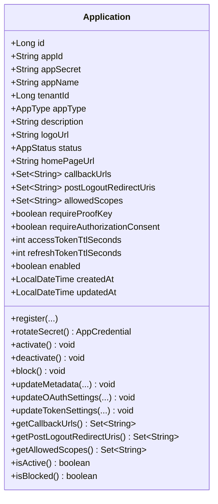
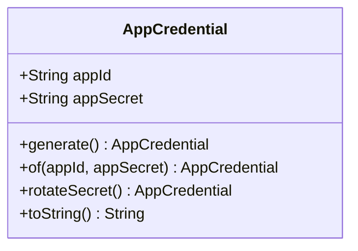
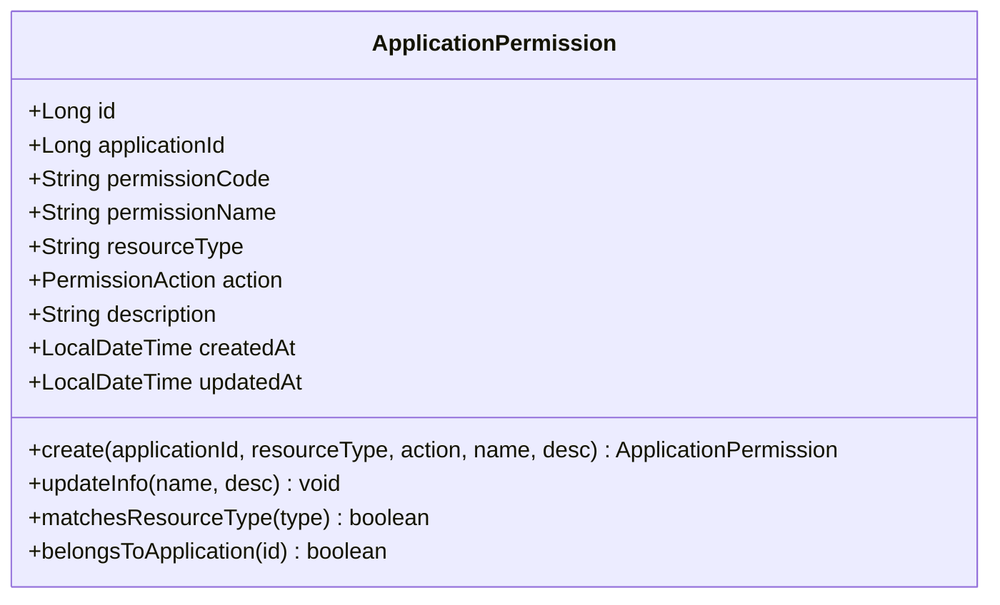
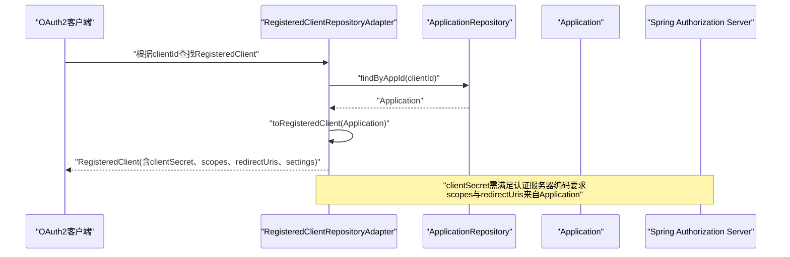
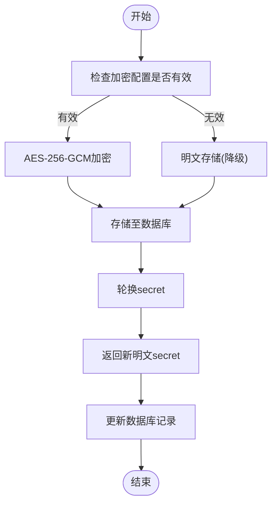
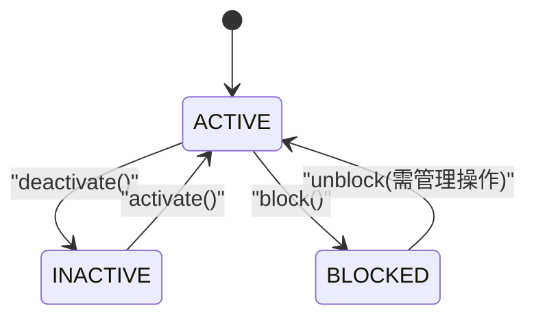
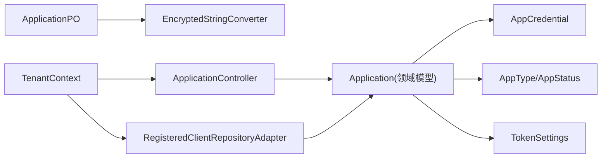

# Application应用实体

<cite>
**本文档引用的文件**
- [Application.java](file://iam-admin-server/src/main/java/iam/platform/admin/domain/model/entity/Application.java)
- [Application.java](file://iam-auth-server/src/main/java/iam/platform/auth/domain/model/entity/Application.java)
- [ApplicationPermission.java](file://iam-admin-server/src/main/java/iam/platform/admin/domain/model/entity/ApplicationPermission.java)
- [ApplicationPermission.java](file://iam-auth-server/src/main/java/iam/platform/auth/domain/model/entity/ApplicationPermission.java)
- [AppCredential.java](file://iam-common/src/main/java/iam/platform/common/model/valueobject/AppCredential.java)
- [AppType.java](file://iam-common/src/main/java/iam/platform/common/model/enums/AppType.java)
- [AppStatus.java](file://iam-common/src/main/java/iam/platform/common/model/enums/AppStatus.java)
- [TokenSettings.java](file://iam-common/src/main/java/iam/platform/common/model/valueobject/TokenSettings.java)
- [ApplicationController.java](file://iam-admin-server/src/main/java/iam/platform/admin/interfaces/rest/ApplicationController.java)
- [CreateApplicationRequest.java](file://iam-common/src/main/java/iam/platform/common/dto/request/CreateApplicationRequest.java)
- [ApplicationPO.java](file://iam-admin-server/src/main/java/iam/platform/admin/infrastructure/persistence/entity/ApplicationPO.java)
- [RegisteredClientRepositoryAdapter.java](file://iam-auth-server/src/main/java/iam/platform/auth/infrastructure/security/RegisteredClientRepositoryAdapter.java)
- [EncryptedStringConverter.java](file://iam-admin-server/src/main/java/iam/platform/admin/infrastructure/persistence/converter/EncryptedStringConverter.java)
- [TenantContext.java](file://iam-admin-server/src/main/java/iam/platform/admin/infrastructure/security/TenantContext.java)
- [TenantContext.java](file://iam-auth-server/src/main/java/iam/platform/auth/infrastructure/security/TenantContext.java)
</cite>

## 目录
1. [简介](#简介)
2. [项目结构](#项目结构)
3. [核心组件](#核心组件)
4. [架构总览](#架构总览)
5. [详细组件分析](#详细组件分析)
6. [依赖关系分析](#依赖关系分析)
7. [性能考量](#性能考量)
8. [故障排查指南](#故障排查指南)
9. [结论](#结论)
10. [附录](#附录)

## 简介
本文件围绕Application应用实体进行系统性梳理，重点阐述其在统一认证平台中的关键作用与设计考量。内容涵盖应用标识符、名称、描述、类型（Web/Mobile/API/第三方）、状态（启用/禁用/审核中/封禁）等核心属性；应用与权限的关联关系及应用级权限控制模型；应用凭证（client_id/client_secret）的生成、轮换与安全存储策略；应用生命周期管理（创建、配置、启用/停用/封禁）；业务规则（域名白名单、回调地址校验、权限范围限制等）；以及与认证服务器的交互关系（OAuth2客户端注册与验证）。同时，补充多租户环境下的配置与权限隔离机制。

## 项目结构
Application实体横跨管理侧与认证侧，分别位于两个子系统中，保持一致的领域模型定义，并通过各自的基础设施层完成持久化与安全集成。

图表来源
- [Application.java:21-41](file://iam-admin-server/src/main/java/iam/platform/admin/domain/model/entity/Application.java#L21-L41)
- [ApplicationPO.java:23-105](file://iam-admin-server/src/main/java/iam/platform/admin/infrastructure/persistence/entity/ApplicationPO.java#L23-L105)
- [AppCredential.java:14-36](file://iam-common/src/main/java/iam/platform/common/model/valueobject/AppCredential.java#L14-L36)
- [AppType.java:3-5](file://iam-common/src/main/java/iam/platform/common/model/enums/AppType.java#L3-L5)
- [AppStatus.java:3-5](file://iam-common/src/main/java/iam/platform/common/model/enums/AppStatus.java#L3-L5)
- [TokenSettings.java:13-48](file://iam-common/src/main/java/iam/platform/common/model/valueobject/TokenSettings.java#L13-L48)
- [ApplicationController.java:32-138](file://iam-admin-server/src/main/java/iam/platform/admin/interfaces/rest/ApplicationController.java#L32-L138)
- [EncryptedStringConverter.java:17-65](file://iam-admin-server/src/main/java/iam/platform/admin/infrastructure/persistence/converter/EncryptedStringConverter.java#L17-L65)
- [RegisteredClientRepositoryAdapter.java:20-99](file://iam-auth-server/src/main/java/iam/platform/auth/infrastructure/security/RegisteredClientRepositoryAdapter.java#L20-L99)

章节来源
- [Application.java:21-41](file://iam-admin-server/src/main/java/iam/platform/admin/domain/model/entity/Application.java#L21-L41)
- [Application.java:21-41](file://iam-auth-server/src/main/java/iam/platform/auth/domain/model/entity/Application.java#L21-L41)
- [ApplicationController.java:32-138](file://iam-admin-server/src/main/java/iam/platform/admin/interfaces/rest/ApplicationController.java#L32-L138)

## 核心组件
- 应用实体(Application): 定义应用标识符、名称、描述、类型、状态、主页URL、Logo、回调地址、退出后重定向URI、允许的作用域、PKCE与授权同意要求、令牌TTL、启用状态、租户归属、时间戳等属性，并提供注册、凭证轮换、状态变更、元数据更新、OAuth设置更新、令牌TTL更新等行为方法。
- 应用凭证(AppCredential): 值对象，封装client_id与client_secret的生成、重建与轮换逻辑，确保凭证安全性与可追踪性。
- 应用权限(ApplicationPermission): 应用级权限模型，包含权限编码、资源类型、操作动作、描述等，支持按应用维度进行权限管理。
- 枚举类型(AppType/AppStatus): 规范应用类型与状态取值，保证系统一致性。
- 令牌设置(TokenSettings): 封装访问令牌与刷新令牌的TTL配置，提供默认值与校验。
- 控制器(ApplicationController): 提供应用的CRUD、状态管理、凭证轮换、权限管理等REST接口。
- 实体映射(ApplicationPO): 管理侧持久化实体，包含加密转换器用于client_secret的安全存储。
- 认证适配器(RegisteredClientRepositoryAdapter): 认证侧将Application实体适配为Spring Authorization Server的RegisteredClient，完成OAuth2客户端注册与验证。
- 加密转换器(EncryptedStringConverter): AES-256-GCM对称加密实现，保障client_secret在数据库中的安全存储。
- 租户上下文(TenantContext): 多租户请求生命周期内的上下文存储，支撑权限隔离与租户边界控制。

章节来源
- [Application.java:21-210](file://iam-admin-server/src/main/java/iam/platform/admin/domain/model/entity/Application.java#L21-L210)
- [Application.java:21-210](file://iam-auth-server/src/main/java/iam/platform/auth/domain/model/entity/Application.java#L21-L210)
- [AppCredential.java:14-66](file://iam-common/src/main/java/iam/platform/common/model/valueobject/AppCredential.java#L14-L66)
- [ApplicationPermission.java:16-74](file://iam-admin-server/src/main/java/iam/platform/admin/domain/model/entity/ApplicationPermission.java#L16-L74)
- [ApplicationPermission.java:16-74](file://iam-auth-server/src/main/java/iam/platform/auth/domain/model/entity/ApplicationPermission.java#L16-L74)
- [AppType.java:3-5](file://iam-common/src/main/java/iam/platform/common/model/enums/AppType.java#L3-L5)
- [AppStatus.java:3-5](file://iam-common/src/main/java/iam/platform/common/model/enums/AppStatus.java#L3-L5)
- [TokenSettings.java:13-62](file://iam-common/src/main/java/iam/platform/common/model/valueobject/TokenSettings.java#L13-L62)
- [ApplicationController.java:32-138](file://iam-admin-server/src/main/java/iam/platform/admin/interfaces/rest/ApplicationController.java#L32-L138)
- [ApplicationPO.java:23-117](file://iam-admin-server/src/main/java/iam/platform/admin/infrastructure/persistence/entity/ApplicationPO.java#L23-L117)
- [RegisteredClientRepositoryAdapter.java:20-99](file://iam-auth-server/src/main/java/iam/platform/auth/infrastructure/security/RegisteredClientRepositoryAdapter.java#L20-L99)
- [EncryptedStringConverter.java:17-108](file://iam-admin-server/src/main/java/iam/platform/admin/infrastructure/persistence/converter/EncryptedStringConverter.java#L17-L108)
- [TenantContext.java:7-44](file://iam-admin-server/src/main/java/iam/platform/admin/infrastructure/security/TenantContext.java#L7-L44)
- [TenantContext.java:7-44](file://iam-auth-server/src/main/java/iam/platform/auth/infrastructure/security/TenantContext.java#L7-L44)

## 架构总览
Application实体在系统中的交互关系如下：

图表来源
- [ApplicationController.java:32-138](file://iam-admin-server/src/main/java/iam/platform/admin/interfaces/rest/ApplicationController.java#L32-L138)
- [Application.java:21-210](file://iam-admin-server/src/main/java/iam/platform/admin/domain/model/entity/Application.java#L21-L210)
- [ApplicationPO.java:23-117](file://iam-admin-server/src/main/java/iam/platform/admin/infrastructure/persistence/entity/ApplicationPO.java#L23-L117)
- [EncryptedStringConverter.java:17-108](file://iam-admin-server/src/main/java/iam/platform/admin/infrastructure/persistence/converter/EncryptedStringConverter.java#L17-L108)
- [RegisteredClientRepositoryAdapter.java:20-99](file://iam-auth-server/src/main/java/iam/platform/auth/infrastructure/security/RegisteredClientRepositoryAdapter.java#L20-L99)

## 详细组件分析

### 应用实体(Application)分析
- 属性设计
  - 标识与归属: appId、appSecret、tenantId
  - 描述信息: appName、description、logoUrl、homePageUrl
  - 类型与状态: appType、status、enabled
  - OAuth2配置: callbackUrls、postLogoutRedirectUris、allowedScopes、requireProofKey、requireAuthorizationConsent
  - 令牌配置: accessTokenTtlSeconds、refreshTokenTtlSeconds
  - 时间戳: createdAt、updatedAt
- 工厂方法
  - register: 自动生成client_id/client_secret，设置初始状态为ACTIVE，拷贝传入的OAuth2与令牌配置
- 凭证管理
  - rotateSecret: 保持appId不变，生成新的appSecret并更新时间戳
- 生命周期
  - activate/deactivate/block: 状态机约束，仅ACTIVE可停用，BLOCKED不可激活
- 行为方法
  - updateMetadata/updateOAuthSettings/updateTokenSettings: 支持增量更新
- 查询方法
  - getCallbackUrls/getPostLogoutRedirectUris/getAllowedScopes: 懒初始化空集合
  - isActive/isBlocked: 状态查询

图表来源
- [Application.java:21-210](file://iam-admin-server/src/main/java/iam/platform/admin/domain/model/entity/Application.java#L21-L210)
- [Application.java:21-210](file://iam-auth-server/src/main/java/iam/platform/auth/domain/model/entity/Application.java#L21-L210)

章节来源
- [Application.java:21-210](file://iam-admin-server/src/main/java/iam/platform/admin/domain/model/entity/Application.java#L21-L210)
- [Application.java:21-210](file://iam-auth-server/src/main/java/iam/platform/auth/domain/model/entity/Application.java#L21-L210)

### 应用凭证(AppCredential)分析
- 生成策略
  - appId: 16字符字母数字随机串
  - appSecret: 高熵随机串（长度大于64字符）
- 重建与轮换
  - of: 从持久化值重建凭证对象
  - rotateSecret: 保持appId不变，生成新appSecret
- 安全性
  - 仅在创建与轮换时返回明文secret，其余场景以保护形式显示

图表来源
- [AppCredential.java:14-66](file://iam-common/src/main/java/iam/platform/common/model/valueobject/AppCredential.java#L14-L66)

章节来源
- [AppCredential.java:14-66](file://iam-common/src/main/java/iam/platform/common/model/valueobject/AppCredential.java#L14-L66)

### 应用权限(ApplicationPermission)分析
- 设计要点
  - 归属: applicationId
  - 编码: 自动规则生成（避免冲突）
  - 资源与动作: resourceType + action
  - 元信息: permissionName、description
- 行为
  - create: 参数校验与自动编码
  - updateInfo: 名称与描述更新
  - 匹配: matchesResourceType、belongsToApplication

图表来源
- [ApplicationPermission.java:16-74](file://iam-admin-server/src/main/java/iam/platform/admin/domain/model/entity/ApplicationPermission.java#L16-L74)
- [ApplicationPermission.java:16-74](file://iam-auth-server/src/main/java/iam/platform/auth/domain/model/entity/ApplicationPermission.java#L16-L74)

章节来源
- [ApplicationPermission.java:16-74](file://iam-admin-server/src/main/java/iam/platform/admin/domain/model/entity/ApplicationPermission.java#L16-L74)
- [ApplicationPermission.java:16-74](file://iam-auth-server/src/main/java/iam/platform/auth/domain/model/entity/ApplicationPermission.java#L16-L74)

### OAuth2客户端注册与验证流程
认证侧通过RegisteredClientRepositoryAdapter将Application实体适配为RegisteredClient，完成OAuth2客户端注册与验证。

图表来源
- [RegisteredClientRepositoryAdapter.java:24-99](file://iam-auth-server/src/main/java/iam/platform/auth/infrastructure/security/RegisteredClientRepositoryAdapter.java#L24-L99)
- [Application.java:21-210](file://iam-auth-server/src/main/java/iam/platform/auth/domain/model/entity/Application.java#L21-L210)

章节来源
- [RegisteredClientRepositoryAdapter.java:24-99](file://iam-auth-server/src/main/java/iam/platform/auth/infrastructure/security/RegisteredClientRepositoryAdapter.java#L24-L99)

### 凭证安全存储与轮换
- 存储策略
  - 数据库字段采用AES-256-GCM加密存储（IV+密文组合）
  - 启用条件：配置密钥长度为32字节，否则降级为明文存储并记录告警
- 轮换策略
  - 仅在创建与轮换时返回明文secret
  - 轮换后立即更新数据库记录，旧secret失效

图表来源
- [EncryptedStringConverter.java:28-65](file://iam-admin-server/src/main/java/iam/platform/admin/infrastructure/persistence/converter/EncryptedStringConverter.java#L28-L65)
- [ApplicationPO.java:35-37](file://iam-admin-server/src/main/java/iam/platform/admin/infrastructure/persistence/entity/ApplicationPO.java#L35-L37)
- [AppCredential.java:56-60](file://iam-common/src/main/java/iam/platform/common/model/valueobject/AppCredential.java#L56-L60)

章节来源
- [EncryptedStringConverter.java:28-108](file://iam-admin-server/src/main/java/iam/platform/admin/infrastructure/persistence/converter/EncryptedStringConverter.java#L28-L108)
- [ApplicationPO.java:35-37](file://iam-admin-server/src/main/java/iam/platform/admin/infrastructure/persistence/entity/ApplicationPO.java#L35-L37)
- [AppCredential.java:56-60](file://iam-common/src/main/java/iam/platform/common/model/valueobject/AppCredential.java#L56-L60)

### 生命周期管理
- 创建: register工厂方法自动生成凭证与默认配置，状态为ACTIVE
- 更新: 支持元数据、OAuth2设置、令牌TTL的增量更新
- 启用/停用/封禁: 状态机约束，防止非法状态转换
- 删除: 通过控制器删除接口执行

图表来源
- [Application.java:99-125](file://iam-admin-server/src/main/java/iam/platform/admin/domain/model/entity/Application.java#L99-L125)
- [Application.java:99-125](file://iam-auth-server/src/main/java/iam/platform/auth/domain/model/entity/Application.java#L99-L125)

章节来源
- [Application.java:99-125](file://iam-admin-server/src/main/java/iam/platform/admin/domain/model/entity/Application.java#L99-L125)
- [Application.java:99-125](file://iam-auth-server/src/main/java/iam/platform/auth/domain/model/entity/Application.java#L99-L125)

### 业务规则与安全机制
- 回调地址与退出URI校验
  - 注册时要求至少一个回调地址与作用域
  - 认证适配器将allowedScopes与callbackUrls注入RegisteredClient
- 授权同意与PKCE
  - requireAuthorizationConsent与requireProofKey由应用配置决定
- 令牌TTL
  - TokenSettings提供默认值与正数校验，支持按应用定制
- 多租户隔离
  - Application包含tenantId，控制器与上下文均基于租户维度进行隔离

章节来源
- [CreateApplicationRequest.java:31-42](file://iam-common/src/main/java/iam/platform/common/dto/request/CreateApplicationRequest.java#L31-L42)
- [ApplicationController.java:38-84](file://iam-admin-server/src/main/java/iam/platform/admin/interfaces/rest/ApplicationController.java#L38-L84)
- [RegisteredClientRepositoryAdapter.java:80-96](file://iam-auth-server/src/main/java/iam/platform/auth/infrastructure/security/RegisteredClientRepositoryAdapter.java#L80-L96)
- [TokenSettings.java:36-48](file://iam-common/src/main/java/iam/platform/common/model/valueobject/TokenSettings.java#L36-L48)
- [Application.java:26-38](file://iam-admin-server/src/main/java/iam/platform/admin/domain/model/entity/Application.java#L26-L38)
- [Application.java:26-38](file://iam-auth-server/src/main/java/iam/platform/auth/domain/model/entity/Application.java#L26-L38)
- [TenantContext.java:7-44](file://iam-admin-server/src/main/java/iam/platform/admin/infrastructure/security/TenantContext.java#L7-L44)
- [TenantContext.java:7-44](file://iam-auth-server/src/main/java/iam/platform/auth/infrastructure/security/TenantContext.java#L7-L44)

## 依赖关系分析
- 管理侧依赖
  - Application依赖AppCredential、AppType、AppStatus、TokenSettings
  - ApplicationPO通过EncryptedStringConverter实现client_secret加密存储
  - ApplicationController提供REST接口，调用应用服务层
- 认证侧依赖
  - RegisteredClientRepositoryAdapter将Application适配为RegisteredClient，驱动OAuth2客户端注册与验证
- 多租户依赖
  - TenantContext在线程级别维护当前租户上下文，贯穿请求生命周期

图表来源
- [Application.java:21-210](file://iam-admin-server/src/main/java/iam/platform/admin/domain/model/entity/Application.java#L21-L210)
- [AppCredential.java:14-66](file://iam-common/src/main/java/iam/platform/common/model/valueobject/AppCredential.java#L14-L66)
- [AppType.java:3-5](file://iam-common/src/main/java/iam/platform/common/model/enums/AppType.java#L3-L5)
- [AppStatus.java:3-5](file://iam-common/src/main/java/iam/platform/common/model/enums/AppStatus.java#L3-L5)
- [TokenSettings.java:13-62](file://iam-common/src/main/java/iam/platform/common/model/valueobject/TokenSettings.java#L13-L62)
- [ApplicationPO.java:23-117](file://iam-admin-server/src/main/java/iam/platform/admin/infrastructure/persistence/entity/ApplicationPO.java#L23-L117)
- [EncryptedStringConverter.java:17-108](file://iam-admin-server/src/main/java/iam/platform/admin/infrastructure/persistence/converter/EncryptedStringConverter.java#L17-L108)
- [ApplicationController.java:32-138](file://iam-admin-server/src/main/java/iam/platform/admin/interfaces/rest/ApplicationController.java#L32-L138)
- [RegisteredClientRepositoryAdapter.java:20-99](file://iam-auth-server/src/main/java/iam/platform/auth/infrastructure/security/RegisteredClientRepositoryAdapter.java#L20-L99)
- [TenantContext.java:7-44](file://iam-admin-server/src/main/java/iam/platform/admin/infrastructure/security/TenantContext.java#L7-L44)
- [TenantContext.java:7-44](file://iam-auth-server/src/main/java/iam/platform/auth/infrastructure/security/TenantContext.java#L7-L44)

章节来源
- [Application.java:21-210](file://iam-admin-server/src/main/java/iam/platform/admin/domain/model/entity/Application.java#L21-L210)
- [ApplicationPO.java:23-117](file://iam-admin-server/src/main/java/iam/platform/admin/infrastructure/persistence/entity/ApplicationPO.java#L23-L117)
- [ApplicationController.java:32-138](file://iam-admin-server/src/main/java/iam/platform/admin/interfaces/rest/ApplicationController.java#L32-L138)
- [RegisteredClientRepositoryAdapter.java:20-99](file://iam-auth-server/src/main/java/iam/platform/auth/infrastructure/security/RegisteredClientRepositoryAdapter.java#L20-L99)
- [EncryptedStringConverter.java:17-108](file://iam-admin-server/src/main/java/iam/platform/admin/infrastructure/persistence/converter/EncryptedStringConverter.java#L17-L108)
- [TenantContext.java:7-44](file://iam-admin-server/src/main/java/iam/platform/admin/infrastructure/security/TenantContext.java#L7-L44)

## 性能考量
- 凭证生成与轮换
  - 使用高熵随机数生成，确保安全性的同时注意系统熵池充足
- 加密开销
  - AES-256-GCM加解密在生产环境建议配合硬件加速或KMS
- ORM与缓存
  - 对频繁读取的应用配置可结合Redis缓存，减少数据库压力
- 并发控制
  - 凭证轮换与状态变更应采用乐观锁或分布式锁，避免竞态

## 故障排查指南
- 凭证无法轮换
  - 检查AppCredential的of与rotateSecret调用链路，确认未在非创建/轮换场景暴露明文secret
- 客户端注册失败
  - 核对RegisteredClientRepositoryAdapter中clientSecret编码方式与认证服务器配置一致
  - 确认allowedScopes与callbackUrls已正确注入
- 密文解密异常
  - 检查EncryptionProperties密钥配置长度与格式，确认AES-256-GCM参数正确
  - 关注日志中“密钥无效”告警
- 状态机异常
  - BLOCKED应用不可激活；仅ACTIVE应用可停用；遵循状态迁移约束

章节来源
- [AppCredential.java:56-60](file://iam-common/src/main/java/iam/platform/common/model/valueobject/AppCredential.java#L56-L60)
- [RegisteredClientRepositoryAdapter.java:56-65](file://iam-auth-server/src/main/java/iam/platform/auth/infrastructure/security/RegisteredClientRepositoryAdapter.java#L56-L65)
- [EncryptedStringConverter.java:34-40](file://iam-admin-server/src/main/java/iam/platform/admin/infrastructure/persistence/converter/EncryptedStringConverter.java#L34-L40)
- [Application.java:99-125](file://iam-admin-server/src/main/java/iam/platform/admin/domain/model/entity/Application.java#L99-L125)

## 结论
Application应用实体在统一认证平台中承担核心角色：既作为管理侧的业务实体，又作为认证侧的OAuth2客户端载体。通过严谨的状态机、完善的凭证管理与安全存储策略、清晰的业务规则与多租户隔离机制，实现了从创建到运行期全生命周期的可控治理。结合认证适配器与加密转换器，系统在功能完整性与安全性之间取得平衡，满足企业级应用场景的需求。

## 附录
- 关键接口路径参考
  - 应用创建: [ApplicationController.java:38-44](file://iam-admin-server/src/main/java/iam/platform/admin/interfaces/rest/ApplicationController.java#L38-L44)
  - 凭证轮换: [ApplicationController.java:86-91](file://iam-admin-server/src/main/java/iam/platform/admin/interfaces/rest/ApplicationController.java#L86-L91)
  - 应用状态管理: [ApplicationController.java:95-114](file://iam-admin-server/src/main/java/iam/platform/admin/interfaces/rest/ApplicationController.java#L95-L114)
  - 应用权限管理: [ApplicationController.java:118-137](file://iam-admin-server/src/main/java/iam/platform/admin/interfaces/rest/ApplicationController.java#L118-L137)
- 数据模型映射参考
  - 应用实体映射: [ApplicationPO.java:23-117](file://iam-admin-server/src/main/java/iam/platform/admin/infrastructure/persistence/entity/ApplicationPO.java#L23-L117)
- 安全配置参考
  - 凭证加密转换器: [EncryptedStringConverter.java:17-108](file://iam-admin-server/src/main/java/iam/platform/admin/infrastructure/persistence/converter/EncryptedStringConverter.java#L17-L108)
- 多租户上下文参考
  - 租户上下文: [TenantContext.java:7-44](file://iam-admin-server/src/main/java/iam/platform/admin/infrastructure/security/TenantContext.java#L7-L44), [TenantContext.java:7-44](file://iam-auth-server/src/main/java/iam/platform/auth/infrastructure/security/TenantContext.java#L7-L44)