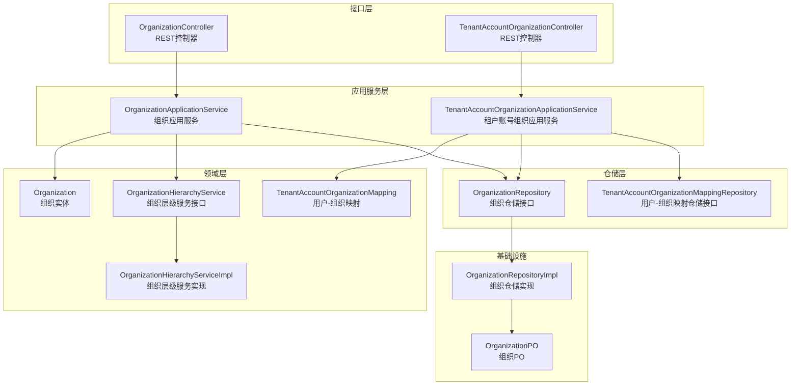
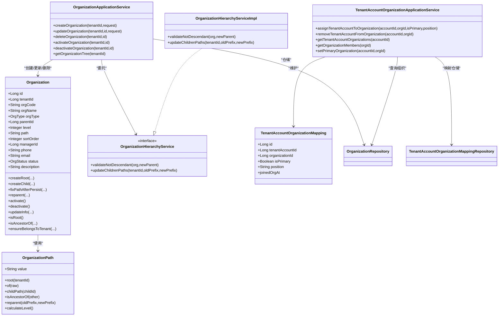
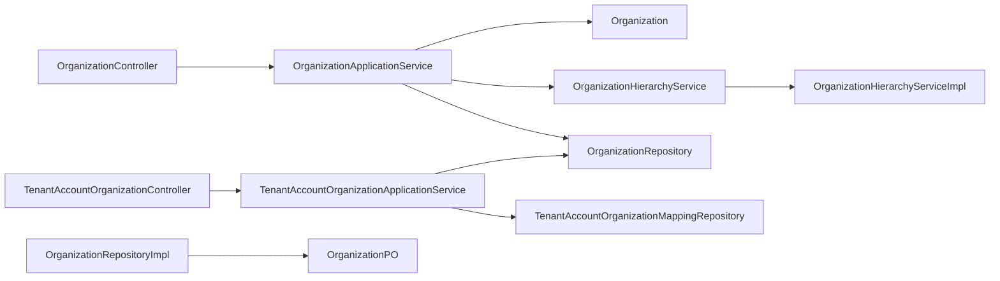
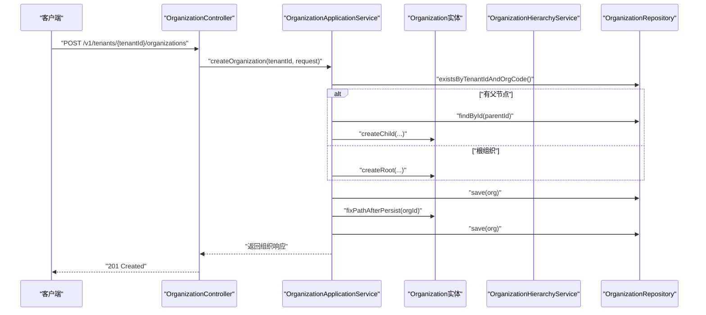
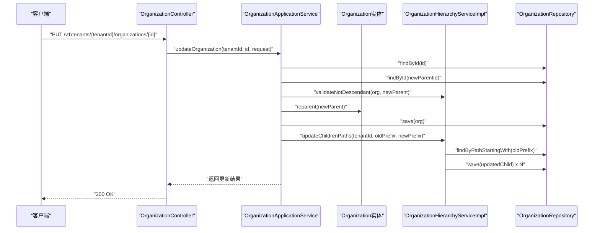
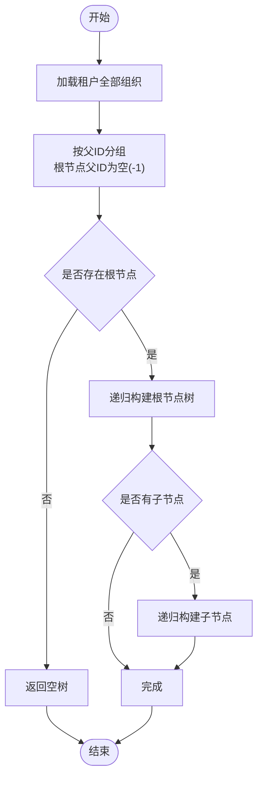

# Organization组织实体

<cite>
**本文引用的文件**
- [Organization.java](file://iam-admin-server/src/main/java/iam/platform/admin/domain/model/entity/Organization.java)
- [TenantAccountOrganizationMapping.java](file://iam-admin-server/src/main/java/iam/platform/admin/domain/model/entity/TenantAccountOrganizationMapping.java)
- [OrganizationRepository.java](file://iam-admin-server/src/main/java/iam/platform/admin/domain/repository/OrganizationRepository.java)
- [TenantAccountOrganizationMappingRepository.java](file://iam-admin-server/src/main/java/iam/platform/admin/domain/repository/TenantAccountOrganizationMappingRepository.java)
- [OrganizationApplicationService.java](file://iam-admin-server/src/main/java/iam/platform/admin/application/service/OrganizationApplicationService.java)
- [OrganizationHierarchyService.java](file://iam-admin-server/src/main/java/iam/platform/admin/domain/service/OrganizationHierarchyService.java)
- [OrganizationHierarchyServiceImpl.java](file://iam-admin-server/src/main/java/iam/platform/admin/domain/service/impl/OrganizationHierarchyServiceImpl.java)
- [OrganizationController.java](file://iam-admin-server/src/main/java/iam/platform/admin/interfaces/rest/OrganizationController.java)
- [OrganizationPO.java](file://iam-admin-server/src/main/java/iam/platform/admin/infrastructure/persistence/entity/OrganizationPO.java)
- [OrganizationRepositoryImpl.java](file://iam-admin-server/src/main/java/iam/platform/admin/infrastructure/persistence/impl/OrganizationRepositoryImpl.java)
- [TenantAccountOrganizationApplicationService.java](file://iam-admin-server/src/main/java/iam/platform/admin/application/service/TenantAccountOrganizationApplicationService.java)
- [TenantAccountOrganizationController.java](file://iam-admin-server/src/main/java/iam/platform/admin/interfaces/rest/TenantAccountOrganizationController.java)
- [OrgType.java](file://iam-common/src/main/java/iam/platform/common/model/enums/OrgType.java)
- [OrgStatus.java](file://iam-common/src/main/java/iam/platform/common/model/enums/OrgStatus.java)
- [OrganizationPath.java](file://iam-common/src/main/java/iam/platform/common/model/valueobject/OrganizationPath.java)
- [AssignOrganizationRequest.java](file://iam-common/src/main/java/iam/platform/common/dto/request/AssignOrganizationRequest.java)
- [V1__complete_schema_initialization.sql](file://iam-admin-server/src/main/resources/db/migration/V1__complete_schema_initialization.sql)
</cite>

## 目录
1. [简介](#简介)
2. [项目结构](#项目结构)
3. [核心组件](#核心组件)
4. [架构总览](#架构总览)
5. [详细组件分析](#详细组件分析)
6. [依赖关系分析](#依赖关系分析)
7. [性能考量](#性能考量)
8. [故障排查指南](#故障排查指南)
9. [结论](#结论)
10. [附录](#附录)

## 简介
本文件系统性阐述Organization组织实体在企业级IAM平台中的设计与实现，覆盖组织层级结构、组织类型与状态、树形层级路径设计、父子关系与多级嵌套、组织与用户的映射关系、业务规则与权限继承机制、以及组织管理操作（创建、调整、合并、删除）的实现细节。文档同时给出架构图、序列图与流程图，帮助读者快速理解组织实体在大型企业架构中的扩展性与性能优化策略。

## 项目结构
组织实体相关代码分布在admin域的领域模型、应用服务、基础设施持久化层，并通过REST接口对外暴露；同时配合通用模块中的枚举与值对象，形成完整的组织建模与实现。

图表来源
- [OrganizationController.java:25-83](file://iam-admin-server/src/main/java/iam/platform/admin/interfaces/rest/OrganizationController.java#L25-L83)
- [TenantAccountOrganizationController.java:24-76](file://iam-admin-server/src/main/java/iam/platform/admin/interfaces/rest/TenantAccountOrganizationController.java#L24-L76)
- [OrganizationApplicationService.java:24-190](file://iam-admin-server/src/main/java/iam/platform/admin/application/service/OrganizationApplicationService.java#L24-L190)
- [TenantAccountOrganizationApplicationService.java:24-175](file://iam-admin-server/src/main/java/iam/platform/admin/application/service/TenantAccountOrganizationApplicationService.java#L24-L175)
- [Organization.java:14-216](file://iam-admin-server/src/main/java/iam/platform/admin/domain/model/entity/Organization.java#L14-L216)
- [TenantAccountOrganizationMapping.java:10-21](file://iam-admin-server/src/main/java/iam/platform/admin/domain/model/entity/TenantAccountOrganizationMapping.java#L10-L21)
- [OrganizationHierarchyService.java:10-33](file://iam-admin-server/src/main/java/iam/platform/admin/domain/service/OrganizationHierarchyService.java#L10-L33)
- [OrganizationHierarchyServiceImpl.java:13-72](file://iam-admin-server/src/main/java/iam/platform/admin/domain/service/impl/OrganizationHierarchyServiceImpl.java#L13-L72)
- [OrganizationRepository.java:8-24](file://iam-admin-server/src/main/java/iam/platform/admin/domain/repository/OrganizationRepository.java#L8-L24)
- [TenantAccountOrganizationMappingRepository.java:8-27](file://iam-admin-server/src/main/java/iam/platform/admin/domain/repository/TenantAccountOrganizationMappingRepository.java#L8-L27)
- [OrganizationPO.java:17-97](file://iam-admin-server/src/main/java/iam/platform/admin/infrastructure/persistence/entity/OrganizationPO.java#L17-L97)
- [OrganizationRepositoryImpl.java:16-97](file://iam-admin-server/src/main/java/iam/platform/admin/infrastructure/persistence/impl/OrganizationRepositoryImpl.java#L16-L97)

章节来源
- [OrganizationController.java:25-83](file://iam-admin-server/src/main/java/iam/platform/admin/interfaces/rest/OrganizationController.java#L25-L83)
- [OrganizationApplicationService.java:24-190](file://iam-admin-server/src/main/java/iam/platform/admin/application/service/OrganizationApplicationService.java#L24-L190)
- [Organization.java:14-216](file://iam-admin-server/src/main/java/iam/platform/admin/domain/model/entity/Organization.java#L14-L216)

## 核心组件
- 组织实体：封装组织的基本属性（编码、名称、类型、排序、负责人、联系方式、状态、描述）与层级行为（根/子节点创建、路径修复、重父、激活/停用、信息更新、祖先判断、租户归属校验）。
- 组织层级服务：负责重父校验与后代路径批量更新。
- 用户-组织映射：记录租户账号在组织中的归属、主组织标记与职位信息。
- 应用服务：编排组织生命周期与权限继承相关的业务规则。
- 接口层：提供REST API以支撑组织与用户组织管理。
- 值对象与枚举：组织路径值对象与组织类型/状态枚举。

章节来源
- [Organization.java:18-216](file://iam-admin-server/src/main/java/iam/platform/admin/domain/model/entity/Organization.java#L18-L216)
- [OrganizationHierarchyService.java:10-33](file://iam-admin-server/src/main/java/iam/platform/admin/domain/service/OrganizationHierarchyService.java#L10-L33)
- [OrganizationHierarchyServiceImpl.java:13-72](file://iam-admin-server/src/main/java/iam/platform/admin/domain/service/impl/OrganizationHierarchyServiceImpl.java#L13-L72)
- [TenantAccountOrganizationMapping.java:10-21](file://iam-admin-server/src/main/java/iam/platform/admin/domain/model/entity/TenantAccountOrganizationMapping.java#L10-L21)
- [OrganizationApplicationService.java:24-190](file://iam-admin-server/src/main/java/iam/platform/admin/application/service/OrganizationApplicationService.java#L24-L190)
- [OrganizationController.java:25-83](file://iam-admin-server/src/main/java/iam/platform/admin/interfaces/rest/OrganizationController.java#L25-L83)
- [OrgType.java:3-5](file://iam-common/src/main/java/iam/platform/common/model/enums/OrgType.java#L3-L5)
- [OrgStatus.java:3-5](file://iam-common/src/main/java/iam/platform/common/model/enums/OrgStatus.java#L3-L5)
- [OrganizationPath.java:15-92](file://iam-common/src/main/java/iam/platform/common/model/valueobject/OrganizationPath.java#L15-L92)

## 架构总览
组织实体采用DDD分层架构，领域模型承载业务不变量，应用服务协调跨边界操作，仓储抽象数据访问，接口层暴露REST能力。组织层级通过Materialized Path（物化路径）存储，结合领域服务实现高效的祖先/后代判定与路径批量更新。

图表来源
- [Organization.java:18-216](file://iam-admin-server/src/main/java/iam/platform/admin/domain/model/entity/Organization.java#L18-L216)
- [OrganizationPath.java:15-92](file://iam-common/src/main/java/iam/platform/common/model/valueobject/OrganizationPath.java#L15-L92)
- [OrganizationHierarchyService.java:10-33](file://iam-admin-server/src/main/java/iam/platform/admin/domain/service/OrganizationHierarchyService.java#L10-L33)
- [OrganizationHierarchyServiceImpl.java:13-72](file://iam-admin-server/src/main/java/iam/platform/admin/domain/service/impl/OrganizationHierarchyServiceImpl.java#L13-L72)
- [TenantAccountOrganizationMapping.java:10-21](file://iam-admin-server/src/main/java/iam/platform/admin/domain/model/entity/TenantAccountOrganizationMapping.java#L10-L21)
- [OrganizationApplicationService.java:24-190](file://iam-admin-server/src/main/java/iam/platform/admin/application/service/OrganizationApplicationService.java#L24-L190)
- [TenantAccountOrganizationApplicationService.java:24-175](file://iam-admin-server/src/main/java/iam/platform/admin/application/service/TenantAccountOrganizationApplicationService.java#L24-L175)

## 详细组件分析

### 组织实体（Organization）
- 基本属性：组织编码、名称、类型、排序、负责人、联系方式、状态、描述、租户标识、父节点、层级、路径。
- 工厂方法：createRoot用于创建租户根组织；createChild用于在指定父节点下创建子组织。
- 路径修复：fixPathAfterPersist在首次保存后根据真实ID补全路径，确保路径唯一且可解析。
- 重父逻辑：reparent在新父节点校验通过后更新层级与路径前缀。
- 状态管理：activate/deactivate切换组织启用/停用状态。
- 查询与断言：isRoot/isAncestorOf/ensureBelongsToTenant辅助树形结构与租户隔离。
- 复杂度：路径计算与祖先判断基于字符串前缀匹配，时间复杂度O(k)，k为路径段数；批量路径更新遍历后代，最坏O(n)。

章节来源
- [Organization.java:18-216](file://iam-admin-server/src/main/java/iam/platform/admin/domain/model/entity/Organization.java#L18-L216)
- [OrgType.java:3-5](file://iam-common/src/main/java/iam/platform/common/model/enums/OrgType.java#L3-L5)
- [OrgStatus.java:3-5](file://iam-common/src/main/java/iam/platform/common/model/enums/OrgStatus.java#L3-L5)
- [OrganizationPath.java:15-92](file://iam-common/src/main/java/iam/platform/common/model/valueobject/OrganizationPath.java#L15-L92)

### 组织层级服务（OrganizationHierarchyService/Impl）
- 校验重父：validateNotDescendant防止循环引用，既通过实体方法判断祖先关系，也通过路径前缀二次校验。
- 批量更新后代路径：updateChildrenPaths在重父后替换旧路径前缀为新前缀，并同步更新层级。

章节来源
- [OrganizationHierarchyService.java:10-33](file://iam-admin-server/src/main/java/iam/platform/admin/domain/service/OrganizationHierarchyService.java#L10-L33)
- [OrganizationHierarchyServiceImpl.java:13-72](file://iam-admin-server/src/main/java/iam/platform/admin/domain/service/impl/OrganizationHierarchyServiceImpl.java#L13-L72)

### 用户-组织映射（TenantAccountOrganizationMapping）
- 映射字段：租户账号ID、组织ID、是否主组织、职位、加入时间。
- 主组织约束：同一账号只能有一个主组织，设置新主组织时会取消其他主组织标记。
- 成员查询：支持按账号查询所属组织、按组织查询成员列表。

章节来源
- [TenantAccountOrganizationMapping.java:10-21](file://iam-admin-server/src/main/java/iam/platform/admin/domain/model/entity/TenantAccountOrganizationMapping.java#L10-L21)
- [TenantAccountOrganizationApplicationService.java:24-175](file://iam-admin-server/src/main/java/iam/platform/admin/application/service/TenantAccountOrganizationApplicationService.java#L24-L175)
- [AssignOrganizationRequest.java:11-18](file://iam-common/src/main/java/iam/platform/common/dto/request/AssignOrganizationRequest.java#L11-L18)

### 应用服务（OrganizationApplicationService）
- 组织创建：校验编码唯一性，调用工厂方法创建根或子组织，保存后修复路径，返回响应。
- 组织更新：校验租户归属，委托实体更新属性；若变更父节点，先验证非后代，再执行重父并批量更新后代路径。
- 组织删除：校验租户归属，禁止删除仍有子组织的节点。
- 启用/停用：直接切换状态并持久化。
- 组织树构建：按父ID分组构建树形结构，便于前端渲染。

章节来源
- [OrganizationApplicationService.java:24-190](file://iam-admin-server/src/main/java/iam/platform/admin/application/service/OrganizationApplicationService.java#L24-L190)

### 接口层（REST）
- 组织API：创建、查询、更新、删除、启用、停用、获取组织树。
- 用户组织API：分配账号到组织、移除、查询账号所属组织、设置主组织、查询组织成员。

章节来源
- [OrganizationController.java:25-83](file://iam-admin-server/src/main/java/iam/platform/admin/interfaces/rest/OrganizationController.java#L25-L83)
- [TenantAccountOrganizationController.java:24-76](file://iam-admin-server/src/main/java/iam/platform/admin/interfaces/rest/TenantAccountOrganizationController.java#L24-L76)

### 数据模型与持久化
- 实体类OrganizationPO映射数据库表t_organization，包含所有组织字段与时间戳。
- 仓储实现OrganizationRepositoryImpl负责领域模型与PO之间的转换，提供按租户、父节点、路径前缀等查询。
- 数据库初始化脚本定义了组织表结构与索引，保障查询效率与约束。

章节来源
- [OrganizationPO.java:17-97](file://iam-admin-server/src/main/java/iam/platform/admin/infrastructure/persistence/entity/OrganizationPO.java#L17-L97)
- [OrganizationRepositoryImpl.java:16-97](file://iam-admin-server/src/main/java/iam/platform/admin/infrastructure/persistence/impl/OrganizationRepositoryImpl.java#L16-L97)
- [OrganizationRepository.java:8-24](file://iam-admin-server/src/main/java/iam/platform/admin/domain/repository/OrganizationRepository.java#L8-L24)
- [V1__complete_schema_initialization.sql:450-478](file://iam-admin-server/src/main/resources/db/migration/V1__complete_schema_initialization.sql#L450-L478)

### 权限继承与组织关系
- 组织作为权限继承的载体：用户在组织中的位置（树形层级）决定了其权限的传递范围。组织层级的路径前缀可用于快速判定“是否在某组织下”，从而进行权限的自动传播。
- 角色与权限：用户的角色通过租户账号-角色映射获得，而组织作为角色授权的上下文，结合组织树可实现自上而下的权限继承。
- 实现要点：组织树查询与路径前缀匹配是权限判定的关键；重父后的批量路径更新确保权限判定一致性。

章节来源
- [OrganizationApplicationService.java:153-177](file://iam-admin-server/src/main/java/iam/platform/admin/application/service/OrganizationApplicationService.java#L153-L177)
- [OrganizationHierarchyServiceImpl.java:35-71](file://iam-admin-server/src/main/java/iam/platform/admin/domain/service/impl/OrganizationHierarchyServiceImpl.java#L35-L71)
- [OrganizationPath.java:56-86](file://iam-common/src/main/java/iam/platform/common/model/valueobject/OrganizationPath.java#L56-L86)

## 依赖关系分析
- 组织实体依赖值对象OrganizationPath进行路径计算与层级推导。
- 应用服务依赖仓储与层级服务完成组织生命周期管理。
- 用户-组织映射应用服务依赖组织与用户仓储，维护账号与组织的多对多关系及主组织约束。
- 接口层分别依赖两个应用服务，提供REST API。

图表来源
- [OrganizationController.java:25-83](file://iam-admin-server/src/main/java/iam/platform/admin/interfaces/rest/OrganizationController.java#L25-L83)
- [TenantAccountOrganizationController.java:24-76](file://iam-admin-server/src/main/java/iam/platform/admin/interfaces/rest/TenantAccountOrganizationController.java#L24-L76)
- [OrganizationApplicationService.java:24-190](file://iam-admin-server/src/main/java/iam/platform/admin/application/service/OrganizationApplicationService.java#L24-L190)
- [TenantAccountOrganizationApplicationService.java:24-175](file://iam-admin-server/src/main/java/iam/platform/admin/application/service/TenantAccountOrganizationApplicationService.java#L24-L175)
- [OrganizationRepositoryImpl.java:16-97](file://iam-admin-server/src/main/java/iam/platform/admin/infrastructure/persistence/impl/OrganizationRepositoryImpl.java#L16-L97)
- [OrganizationPO.java:17-97](file://iam-admin-server/src/main/java/iam/platform/admin/infrastructure/persistence/entity/OrganizationPO.java#L17-L97)

## 性能考量
- 物化路径查询：路径前缀匹配O(k)（k为路径段数），适合频繁的祖先/后代判定与树遍历。
- 批量路径更新：重父后对后代进行批量更新，复杂度O(n)；建议在事务中一次性处理，减少多次往返。
- 索引策略：组织表应确保对tenant_id、parent_id、path建立合适索引，提升查询与范围扫描性能。
- 分页与树构建：树构建采用一次全量查询+内存分组，适合中大型组织规模；超大规模可考虑分页与缓存。
- 并发控制：主组织设置需在事务内保证唯一性，避免并发冲突导致的重复主组织。

## 故障排查指南
- 组织编码冲突：创建时若同租户下编码重复，抛出冲突异常。请检查租户维度的唯一性约束。
- 禁止删除有子组织的节点：删除前需先迁移或删除子组织，否则抛出冲突异常。
- 重父循环引用：尝试将组织移动到其后代会导致非法状态异常。请确认新父节点不为当前组织的后代。
- 路径修复失败：首次保存后必须调用路径修复方法，否则路径不完整导致查询异常。
- 主组织重复：同一账号只能有一个主组织，设置新主组织会自动取消其他主组织标记。

章节来源
- [OrganizationApplicationService.java:34-66](file://iam-admin-server/src/main/java/iam/platform/admin/application/service/OrganizationApplicationService.java#L34-L66)
- [OrganizationApplicationService.java:114-129](file://iam-admin-server/src/main/java/iam/platform/admin/application/service/OrganizationApplicationService.java#L114-L129)
- [OrganizationHierarchyServiceImpl.java:19-33](file://iam-admin-server/src/main/java/iam/platform/admin/domain/service/impl/OrganizationHierarchyServiceImpl.java#L19-L33)
- [TenantAccountOrganizationApplicationService.java:54-73](file://iam-admin-server/src/main/java/iam/platform/admin/application/service/TenantAccountOrganizationApplicationService.java#L54-L73)

## 结论
Organization组织实体通过清晰的领域模型、完善的层级服务与严格的业务规则，实现了企业级组织架构的稳定管理。物化路径设计兼顾查询效率与易维护性，配合用户-组织映射与权限评估体系，能够有效支撑权限的自动继承与传播。在大型企业场景中，建议结合索引优化、分页与缓存策略，持续监控重父批量更新的事务开销，确保系统在高并发与大规模组织下的稳定性与性能。

## 附录

### 组织创建与重父流程（序列图）

图表来源
- [OrganizationController.java:33-40](file://iam-admin-server/src/main/java/iam/platform/admin/interfaces/rest/OrganizationController.java#L33-L40)
- [OrganizationApplicationService.java:32-66](file://iam-admin-server/src/main/java/iam/platform/admin/application/service/OrganizationApplicationService.java#L32-L66)
- [Organization.java:38-96](file://iam-admin-server/src/main/java/iam/platform/admin/domain/model/entity/Organization.java#L38-L96)

### 组织重父与后代路径更新（序列图）

图表来源
- [OrganizationController.java:49-55](file://iam-admin-server/src/main/java/iam/platform/admin/interfaces/rest/OrganizationController.java#L49-L55)
- [OrganizationApplicationService.java:74-112](file://iam-admin-server/src/main/java/iam/platform/admin/application/service/OrganizationApplicationService.java#L74-L112)
- [OrganizationHierarchyServiceImpl.java:35-71](file://iam-admin-server/src/main/java/iam/platform/admin/domain/service/impl/OrganizationHierarchyServiceImpl.java#L35-L71)

### 组织树构建流程（流程图）

图表来源
- [OrganizationApplicationService.java:153-177](file://iam-admin-server/src/main/java/iam/platform/admin/application/service/OrganizationApplicationService.java#L153-L177)