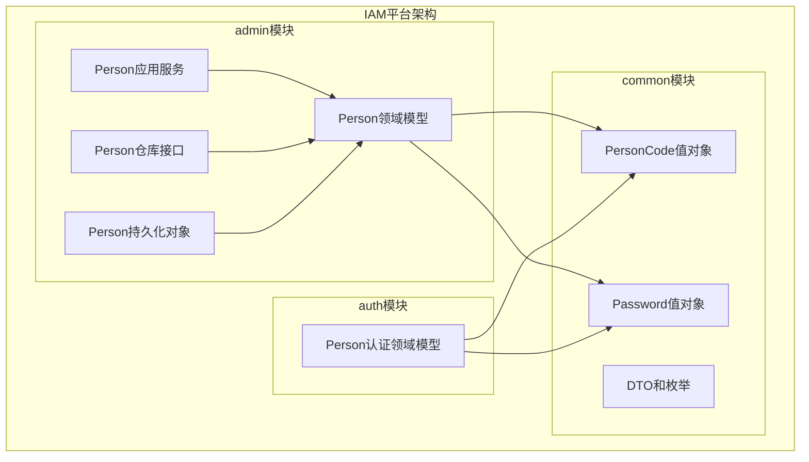
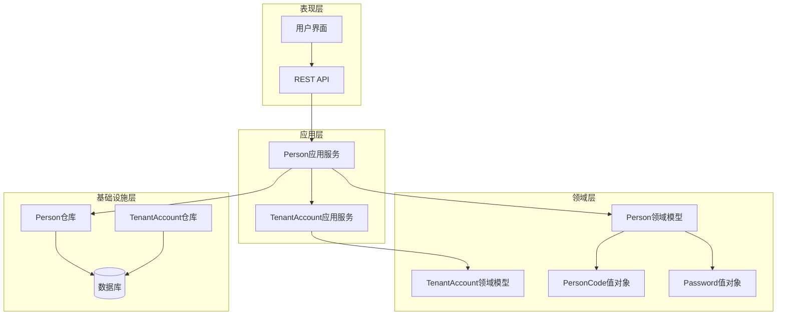
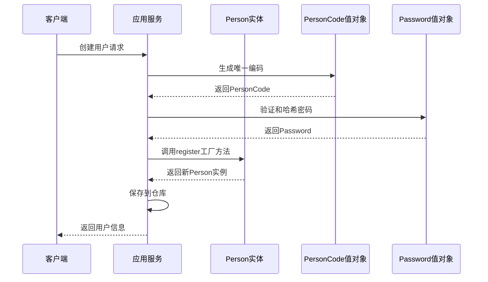
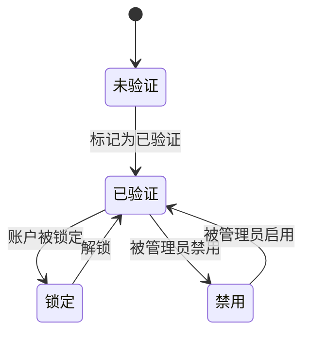
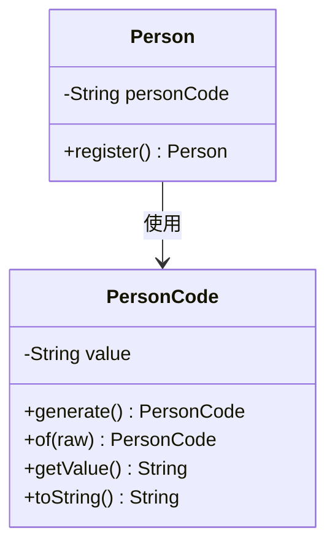
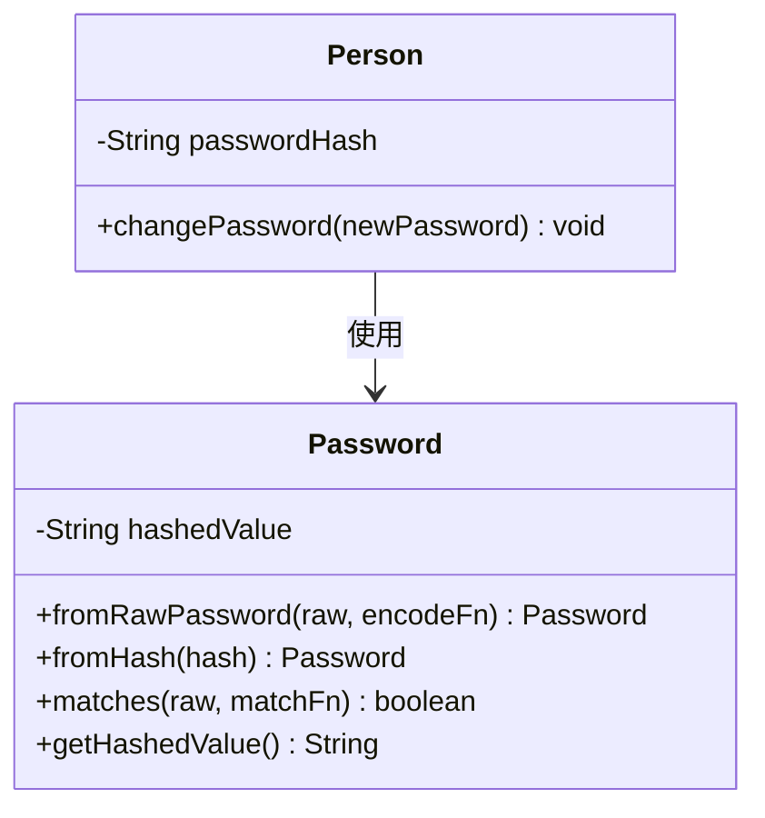
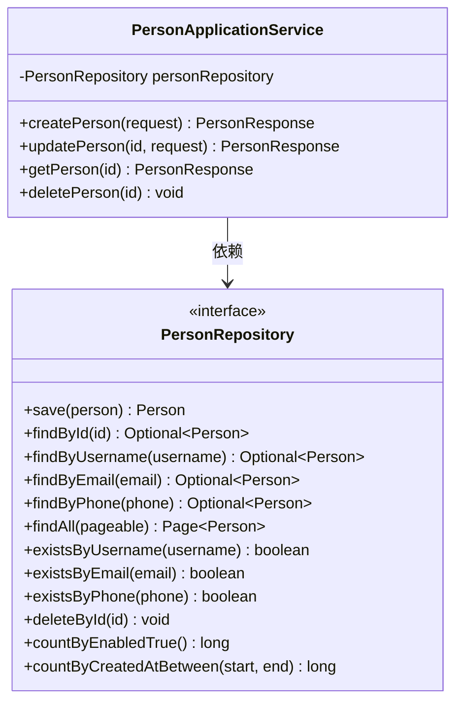
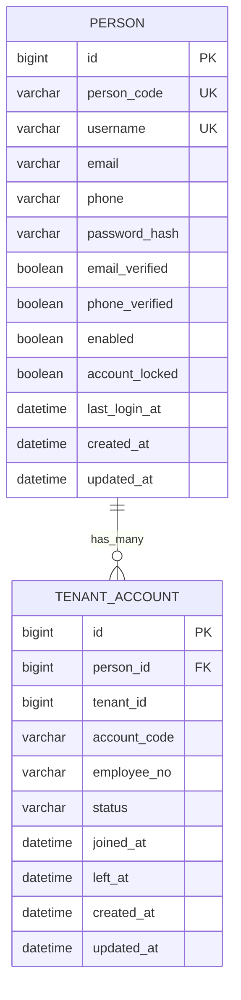
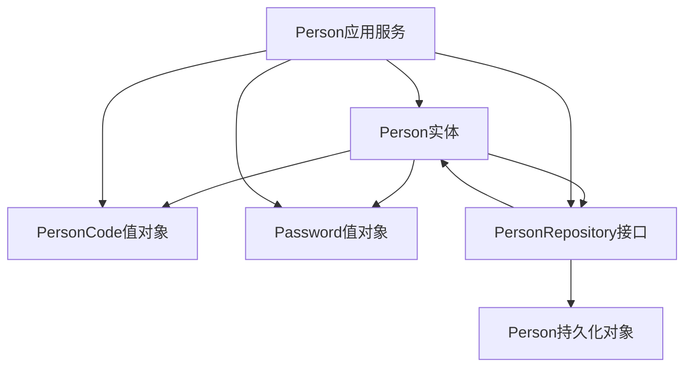

# Person用户实体

<cite>
**本文档引用的文件**
- [Person.java](file://iam-admin-server/src/main/java/iam/platform/admin/domain/model/entity/Person.java)
- [Person.java](file://iam-auth-server/src/main/java/iam/platform/auth/domain/model/entity/Person.java)
- [PersonRepository.java](file://iam-admin-server/src/main/java/iam/platform/admin/domain/repository/PersonRepository.java)
- [PersonPO.java](file://iam-admin-server/src/main/java/iam/platform/admin/infrastructure/persistence/entity/PersonPO.java)
- [PersonCode.java](file://iam-common/src/main/java/iam/platform/common/model/valueobject/PersonCode.java)
- [Password.java](file://iam-common/src/main/java/iam/platform/common/model/valueobject/Password.java)
- [PersonApplicationService.java](file://iam-admin-server/src/main/java/iam/platform/admin/application/service/PersonApplicationService.java)
- [CreatePersonRequest.java](file://iam-common/src/main/java/iam/platform/common/dto/request/CreatePersonRequest.java)
- [PersonResponse.java](file://iam-common/src/main/java/iam/platform/common/dto/response/PersonResponse.java)
- [TenantAccount.java](file://iam-admin-server/src/main/java/iam/platform/admin/domain/model/entity/TenantAccount.java)
- [TenantAccountPO.java](file://iam-admin-server/src/main/java/iam/platform/admin/infrastructure/persistence/entity/TenantAccountPO.java)
</cite>

## 目录
1. [简介](#简介)
2. [项目结构](#项目结构)
3. [核心组件](#核心组件)
4. [架构概览](#架构概览)
5. [详细组件分析](#详细组件分析)
6. [依赖关系分析](#依赖关系分析)
7. [性能考虑](#性能考虑)
8. [故障排除指南](#故障排除指南)
9. [结论](#结论)

## 简介

Person用户实体是IAM平台中的核心领域模型，代表系统中的个人用户。该实体采用DDD（领域驱动设计）原则构建，包含了完整的用户生命周期管理和状态控制机制。本文档将深入分析Person实体的设计理念、核心字段定义、状态管理机制、行为方法以及与其他实体的关系映射。

## 项目结构

IAM平台采用多模块架构，Person实体在不同模块中都有相应的实现：

**图表来源**
- [Person.java:1-158](file://iam-admin-server/src/main/java/iam/platform/admin/domain/model/entity/Person.java#L1-L158)
- [Person.java:1-158](file://iam-auth-server/src/main/java/iam/platform/auth/domain/model/entity/Person.java#L1-L158)

**章节来源**
- [Person.java:1-158](file://iam-admin-server/src/main/java/iam/platform/admin/domain/model/entity/Person.java#L1-L158)
- [Person.java:1-158](file://iam-auth-server/src/main/java/iam/platform/auth/domain/model/entity/Person.java#L1-L158)

## 核心组件

### Person实体设计理念

Person实体遵循以下设计原则：

1. **值对象封装**：使用PersonCode和Password等值对象确保数据完整性
2. **不变量保护**：通过静态工厂方法和守卫条件确保实体状态的有效性
3. **职责分离**：将业务逻辑集中在领域模型中，避免贫血模型
4. **状态机设计**：明确的状态转换和验证机制

### 核心字段定义

Person实体包含以下关键属性：

| 字段名 | 类型 | 描述 | 约束 |
|--------|------|------|------|
| id | Long | 主键标识 | 自增 |
| personCode | String | 用户唯一编码 | 唯一，格式：PERSON-XXXXXXXX |
| username | String | 用户名 | 唯一，3-100字符 |
| email | String | 邮箱地址 | 可选，255字符内 |
| phone | String | 手机号码 | 可选，20字符内 |
| passwordHash | String | 密码哈希值 | 必填，255字符内 |
| emailVerified | Boolean | 邮箱验证状态 | 默认false |
| phoneVerified | Boolean | 手机验证状态 | 默认false |
| nickname | String | 昵称 | 可选，100字符内 |
| avatarUrl | String | 头像URL | 可选，512字符内 |
| enabled | Boolean | 启用状态 | 默认true |
| accountLocked | Boolean | 账户锁定状态 | 默认false |
| lastLoginAt | LocalDateTime | 最后登录时间 | 可选 |
| createdAt | LocalDateTime | 创建时间 | 只读 |
| updatedAt | LocalDateTime | 更新时间 | 只读 |

**章节来源**
- [Person.java:17-32](file://iam-admin-server/src/main/java/iam/platform/admin/domain/model/entity/Person.java#L17-L32)
- [PersonPO.java:21-84](file://iam-admin-server/src/main/java/iam/platform/admin/infrastructure/persistence/entity/PersonPO.java#L21-L84)

## 架构概览

Person实体在整个系统中的位置和交互关系：

**图表来源**
- [PersonApplicationService.java:25-29](file://iam-admin-server/src/main/java/iam/platform/admin/application/service/PersonApplicationService.java#L25-L29)
- [PersonRepository.java:9-33](file://iam-admin-server/src/main/java/iam/platform/admin/domain/repository/PersonRepository.java#L9-L33)

## 详细组件分析

### Person领域模型

Person领域模型是整个用户系统的中心，包含了完整的业务逻辑：

#### 工厂方法设计模式

Person实体使用静态工厂方法`register`来创建新的用户实例，这体现了工厂方法设计模式的最佳实践：

**图表来源**
- [Person.java:36-56](file://iam-admin-server/src/main/java/iam/platform/admin/domain/model/entity/Person.java#L36-L56)
- [PersonApplicationService.java:34-51](file://iam-admin-server/src/main/java/iam/platform/admin/application/service/PersonApplicationService.java#L34-L51)

#### 状态管理机制

Person实体实现了完整的状态管理机制，包括：

1. **启用/禁用状态**：通过`enabled`字段控制用户是否可以登录
2. **锁定/解锁状态**：通过`accountLocked`字段防止恶意登录尝试
3. **验证状态**：通过`emailVerified`和`phoneVerified`字段跟踪验证进度

**图表来源**
- [Person.java:105-132](file://iam-admin-server/src/main/java/iam/platform/admin/domain/model/entity/Person.java#L105-L132)

#### 行为方法设计

Person实体提供了丰富的业务行为方法：

| 方法名 | 功能描述 | 参数 | 返回值 |
|--------|----------|------|--------|
| register | 注册新用户 | username, email, phone, password, nickname, avatarUrl | Person实例 |
| updateProfile | 更新个人资料 | nickname, avatarUrl | void |
| changeEmail | 修改邮箱地址 | newEmail | void |
| changePhone | 修改手机号码 | newPhone | void |
| changePassword | 修改密码 | newPassword | void |
| enable | 启用账户 | - | void |
| disable | 禁用账户 | - | void |
| lock | 锁定账户 | - | void |
| unlock | 解锁账户 | - | void |
| recordLogin | 记录登录时间 | - | void |
| markEmailVerified | 标记邮箱已验证 | - | void |
| markPhoneVerified | 标记手机已验证 | - | void |

**章节来源**
- [Person.java:36-156](file://iam-admin-server/src/main/java/iam/platform/admin/domain/model/entity/Person.java#L36-L156)

### PersonCode值对象

PersonCode值对象确保了用户编码的唯一性和格式正确性：

**图表来源**
- [PersonCode.java:16-49](file://iam-common/src/main/java/iam/platform/common/model/valueobject/PersonCode.java#L16-L49)
- [Person.java:44-44](file://iam-admin-server/src/main/java/iam/platform/admin/domain/model/entity/Person.java#L44-L44)

PersonCode的生成规则：
- 格式：`PERSON-` + 8个大写字母数字字符
- 通过UUID生成唯一标识符
- 使用正则表达式验证格式

**章节来源**
- [PersonCode.java:10-49](file://iam-common/src/main/java/iam/platform/common/model/valueobject/PersonCode.java#L10-L49)

### Password值对象

Password值对象封装了密码的验证和哈希处理：

**图表来源**
- [Password.java:17-83](file://iam-common/src/main/java/iam/platform/common/model/valueobject/Password.java#L17-L83)
- [Person.java:96-99](file://iam-admin-server/src/main/java/iam/platform/admin/domain/model/entity/Person.java#L96-L99)

Password的验证策略：
- 最少8个字符
- 至少包含一个大写字母
- 至少包含一个小写字母
- 至少包含一个数字

**章节来源**
- [Password.java:28-83](file://iam-common/src/main/java/iam/platform/common/model/valueobject/Password.java#L28-L83)

### PersonRepository仓库接口

PersonRepository定义了用户数据访问的抽象接口：

**图表来源**
- [PersonRepository.java:9-33](file://iam-admin-server/src/main/java/iam/platform/admin/domain/repository/PersonRepository.java#L9-L33)
- [PersonApplicationService.java:27-29](file://iam-admin-server/src/main/java/iam/platform/admin/application/service/PersonApplicationService.java#L27-L29)

**章节来源**
- [PersonRepository.java:1-34](file://iam-admin-server/src/main/java/iam/platform/admin/domain/repository/PersonRepository.java#L1-L34)

### Person持久化对象

PersonPO是Person实体的JPA持久化映射：

| 数据库列 | Java字段 | 类型 | 约束 | 描述 |
|----------|----------|------|------|------|
| id | id | Long | 主键 | 自增主键 |
| person_code | personCode | String | 非空，唯一 | 用户唯一编码 |
| username | username | String | 非空，唯一 | 用户名 |
| email | email | String | 可空 | 邮箱地址 |
| phone | phone | String | 可空 | 手机号码 |
| password_hash | passwordHash | String | 非空 | 密码哈希值 |
| email_verified | emailVerified | Boolean | 非空 | 邮箱验证状态 |
| phone_verified | phoneVerified | Boolean | 非空 | 手机验证状态 |
| nickname | nickname | String | 可空 | 昵称 |
| avatar_url | avatarUrl | String | 可空 | 头像URL |
| enabled | enabled | Boolean | 非空 | 启用状态 |
| account_locked | accountLocked | Boolean | 非空 | 账户锁定状态 |
| last_login_at | lastLoginAt | LocalDateTime | 可空 | 最后登录时间 |
| created_at | createdAt | LocalDateTime | 非空，只读 | 创建时间 |
| updated_at | updatedAt | LocalDateTime | 非空 | 更新时间 |

**章节来源**
- [PersonPO.java:21-96](file://iam-admin-server/src/main/java/iam/platform/admin/infrastructure/persistence/entity/PersonPO.java#L21-L96)

### 与TenantAccount的关系映射

Person实体与TenantAccount之间存在一对多的关系：

**图表来源**
- [Person.java:18-19](file://iam-admin-server/src/main/java/iam/platform/admin/domain/model/entity/Person.java#L18-L19)
- [TenantAccount.java:19-20](file://iam-admin-server/src/main/java/iam/platform/admin/domain/model/entity/TenantAccount.java#L19-L20)
- [TenantAccountPO.java:29-30](file://iam-admin-server/src/main/java/iam/platform/admin/infrastructure/persistence/entity/TenantAccountPO.java#L29-L30)

**章节来源**
- [TenantAccount.java:17-32](file://iam-admin-server/src/main/java/iam/platform/admin/domain/model/entity/TenantAccount.java#L17-L32)
- [TenantAccountPO.java:17-53](file://iam-admin-server/src/main/java/iam/platform/admin/infrastructure/persistence/entity/TenantAccountPO.java#L17-L53)

## 依赖关系分析

### 内部依赖关系

**图表来源**
- [Person.java:7-9](file://iam-admin-server/src/main/java/iam/platform/admin/domain/model/entity/Person.java#L7-L9)
- [PersonApplicationService.java:17-19](file://iam-admin-server/src/main/java/iam/platform/admin/application/service/PersonApplicationService.java#L17-L19)

### 外部依赖关系

Person实体依赖于以下外部组件：

1. **Lombok**：简化Java代码，提供注解支持
2. **Spring Security**：密码编码和匹配功能
3. **Hibernate/JPA**：数据持久化和映射
4. **Validation API**：参数验证

**章节来源**
- [Person.java:3-11](file://iam-admin-server/src/main/java/iam/platform/admin/domain/model/entity/Person.java#L3-L11)
- [PersonApplicationService.java:7-8](file://iam-admin-server/src/main/java/iam/platform/admin/application/service/PersonApplicationService.java#L7-L8)

## 性能考虑

### 查询优化

1. **索引策略**：
   - `person_code`：唯一索引，用于快速查找
   - `username`：唯一索引，用于登录验证
   - `email`：普通索引，用于邮箱查询
   - `phone`：普通索引，用于手机号查询

2. **分页查询**：
   - 使用`Pageable`接口支持大数据量分页
   - 提供专门的统计查询方法

### 缓存策略

1. **会话缓存**：Spring Security自动管理用户会话
2. **查询结果缓存**：对于不频繁变化的数据可考虑缓存
3. **配置缓存**：用户偏好设置可缓存

### 并发控制

1. **乐观锁**：使用`@Version`注解防止并发更新冲突
2. **事务管理**：使用`@Transactional`注解确保数据一致性
3. **线程安全**：值对象不可变性保证线程安全

## 故障排除指南

### 常见问题及解决方案

#### 用户名重复错误
**症状**：创建用户时抛出用户名重复异常
**原因**：用户名已被其他用户使用
**解决方案**：检查用户名唯一性服务，提供替代用户名

#### 密码格式错误
**症状**：密码验证失败
**原因**：密码不符合安全策略
**解决方案**：检查密码策略验证逻辑

#### 邮箱或手机号重复
**症状**：邮箱或手机号重复验证失败
**原因**：邮箱或手机号已被其他用户使用
**解决方案**：提供唯一性检查和错误提示

#### 账户状态异常
**症状**：用户无法登录
**原因**：账户被禁用或锁定
**解决方案**：检查账户状态，必要时联系管理员

**章节来源**
- [PersonApplicationService.java:35-38](file://iam-admin-server/src/main/java/iam/platform/admin/application/service/PersonApplicationService.java#L35-L38)
- [PersonApplicationService.java:69-78](file://iam-admin-server/src/main/java/iam/platform/admin/application/service/PersonApplicationService.java#L69-L78)

## 结论

Person用户实体是IAM平台的核心组成部分，它成功地将DDD原则应用于实际业务场景中。通过值对象的使用、工厂方法的设计模式、完整的状态管理和丰富的业务行为，Person实体为整个系统提供了坚实的基础。

该实体的设计充分考虑了安全性、可维护性和扩展性，为未来的功能扩展和性能优化奠定了良好的基础。通过清晰的职责分离和严格的约束验证，确保了系统的稳定性和可靠性。

建议在未来的发展中：
1. 继续完善审计日志功能
2. 增强安全监控和异常处理
3. 优化查询性能和缓存策略
4. 扩展多租户支持能力