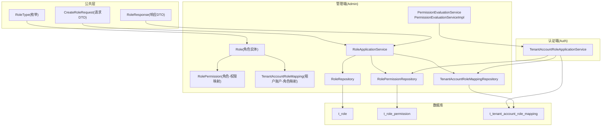
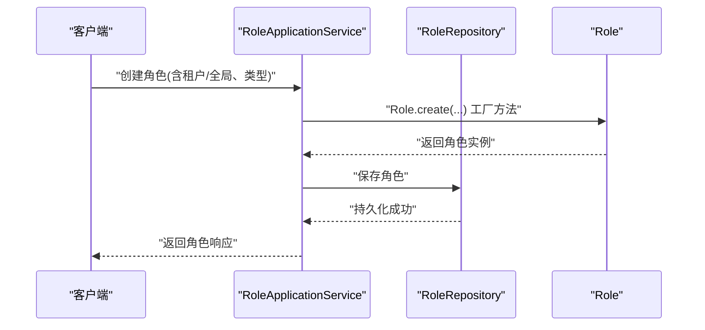
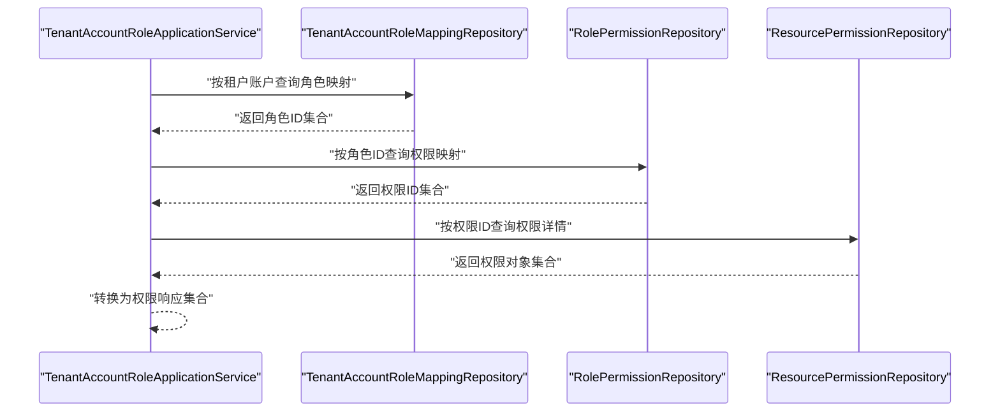
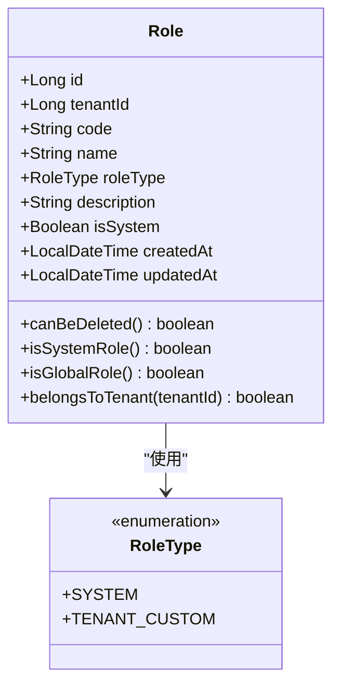
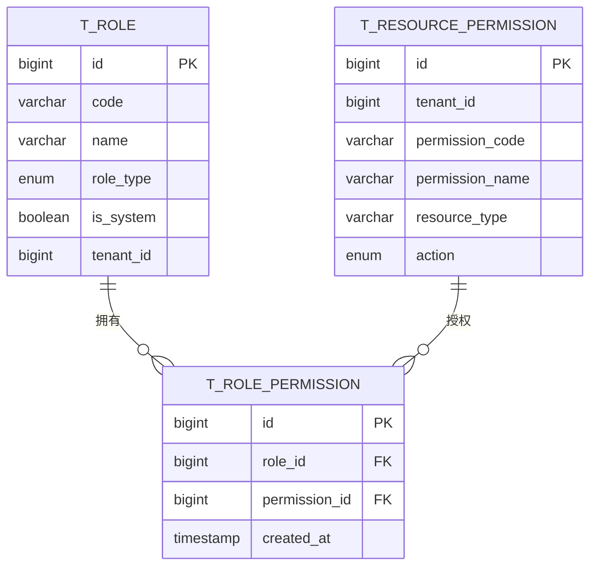
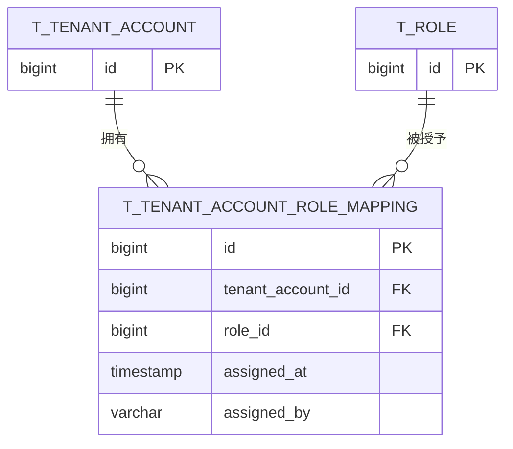
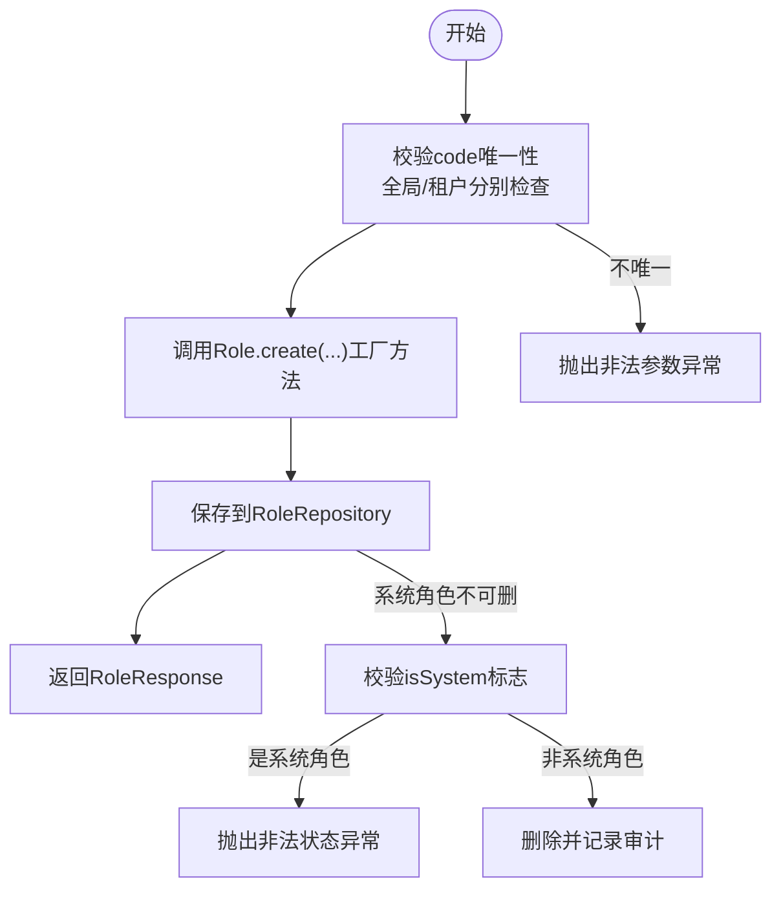
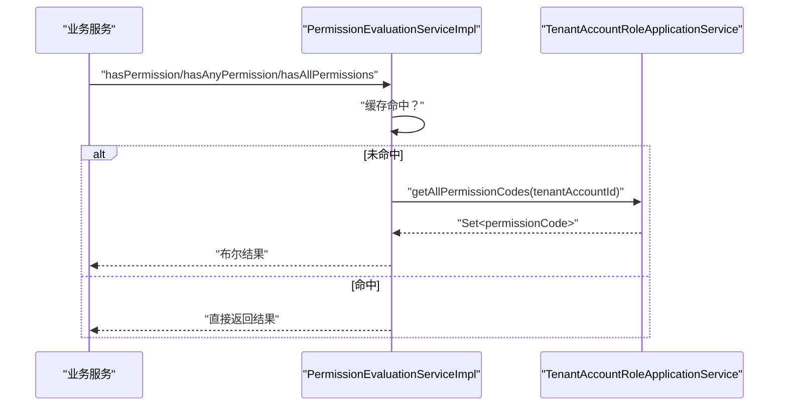
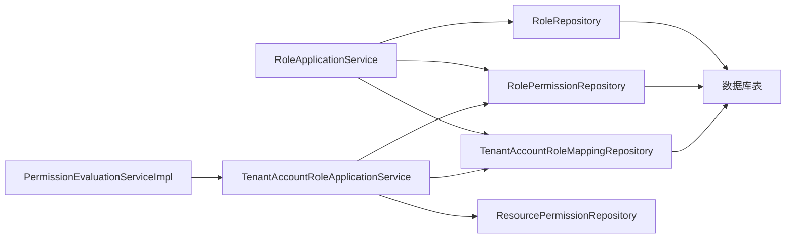

# Role角色实体

<cite>
**本文引用的文件**
- [Role.java](file://iam-admin-server/src/main/java/iam/platform/admin/domain/model/entity/Role.java)
- [RoleType.java](file://iam-common/src/main/java/iam/platform/common/model/enums/RoleType.java)
- [RolePermission.java](file://iam-admin-server/src/main/java/iam/platform/admin/domain/model/entity/RolePermission.java)
- [TenantAccountRoleMapping.java](file://iam-admin-server/src/main/java/iam/platform/admin/domain/model/entity/TenantAccountRoleMapping.java)
- [RoleRepository.java](file://iam-admin-server/src/main/java/iam/platform/admin/domain/repository/RoleRepository.java)
- [RolePermissionRepository.java](file://iam-admin-server/src/main/java/iam/platform/admin/domain/repository/RolePermissionRepository.java)
- [TenantAccountRoleMappingRepository.java](file://iam-admin-server/src/main/java/iam/platform/admin/domain/repository/TenantAccountRoleMappingRepository.java)
- [RoleApplicationService.java](file://iam-admin-server/src/main/java/iam/platform/admin/application/service/RoleApplicationService.java)
- [CreateRoleRequest.java](file://iam-common/src/main/java/iam/platform/common/dto/request/CreateRoleRequest.java)
- [RoleResponse.java](file://iam-common/src/main/java/iam/platform/common/dto/response/RoleResponse.java)
- [PermissionEvaluationService.java](file://iam-admin-server/src/main/java/iam/platform/admin/domain/service/PermissionEvaluationService.java)
- [PermissionEvaluationServiceImpl.java](file://iam-admin-server/src/main/java/iam/platform/admin/domain/service/impl/PermissionEvaluationServiceImpl.java)
- [TenantAccountRoleApplicationService.java](file://iam-auth-server/src/main/java/iam/platform/auth/application/service/TenantAccountRoleApplicationService.java)
- [V1__complete_schema_initialization.sql](file://iam-admin-server/src/main/resources/db/migration/V1__complete_schema_initialization.sql)
</cite>

## 目录
1. [简介](#简介)
2. [项目结构](#项目结构)
3. [核心组件](#核心组件)
4. [架构总览](#架构总览)
5. [详细组件分析](#详细组件分析)
6. [依赖分析](#依赖分析)
7. [性能考量](#性能考量)
8. [故障排查指南](#故障排查指南)
9. [结论](#结论)
10. [附录](#附录)

## 简介
本文件系统性梳理IAM平台中Role角色实体在RBAC权限模型中的核心地位与设计原理，覆盖角色标识符、角色名称、角色描述、角色类型（内置/自定义）等属性；解析角色与权限的多对多映射关系（RolePermission）；阐释角色继承与层级关系的设计思路（通过组合与复用实现）；说明角色状态管理机制（启用/禁用与有效性校验）；给出角色业务规则（全局/租户级别、优先级与冲突处理）；并详述角色与用户的映射关系（TenantAccountRoleMapping）及动态分配实现；最后总结角色在权限评估中的作用与性能优化策略。

## 项目结构
围绕Role角色实体的关键文件分布于以下模块与包：
- 领域模型与仓库：iam-admin-server 的 domain 层
- 应用服务与控制器：iam-admin-server 的 application 与 interfaces 层
- 枚举与DTO：iam-common 的 model 与 dto 层
- 认证侧查询服务：iam-auth-server 的 application 层
- 数据库迁移脚本：iam-admin-server 的 resources/db/migration

图表来源
- [Role.java:16-82](file://iam-admin-server/src/main/java/iam/platform/admin/domain/model/entity/Role.java#L16-L82)
- [RolePermission.java:14-19](file://iam-admin-server/src/main/java/iam/platform/admin/domain/model/entity/RolePermission.java#L14-L19)
- [TenantAccountRoleMapping.java:14-20](file://iam-admin-server/src/main/java/iam/platform/admin/domain/model/entity/TenantAccountRoleMapping.java#L14-L20)
- [RoleRepository.java:8-28](file://iam-admin-server/src/main/java/iam/platform/admin/domain/repository/RoleRepository.java#L8-L28)
- [RolePermissionRepository.java:7-21](file://iam-admin-server/src/main/java/iam/platform/admin/domain/repository/RolePermissionRepository.java#L7-L21)
- [TenantAccountRoleMappingRepository.java:8-24](file://iam-admin-server/src/main/java/iam/platform/admin/domain/repository/TenantAccountRoleMappingRepository.java#L8-L24)
- [RoleApplicationService.java:20-83](file://iam-admin-server/src/main/java/iam/platform/admin/application/service/RoleApplicationService.java#L20-L83)
- [PermissionEvaluationService.java:8-53](file://iam-admin-server/src/main/java/iam/platform/admin/domain/service/PermissionEvaluationService.java#L8-L53)
- [PermissionEvaluationServiceImpl.java:16-52](file://iam-admin-server/src/main/java/iam/platform/admin/domain/service/impl/PermissionEvaluationServiceImpl.java#L16-L52)
- [TenantAccountRoleApplicationService.java:26-66](file://iam-auth-server/src/main/java/iam/platform/auth/application/service/TenantAccountRoleApplicationService.java#L26-L66)
- [RoleType.java:3-6](file://iam-common/src/main/java/iam/platform/common/model/enums/RoleType.java#L3-L6)
- [CreateRoleRequest.java:15-29](file://iam-common/src/main/java/iam/platform/common/dto/request/CreateRoleRequest.java#L15-L29)
- [RoleResponse.java:15-25](file://iam-common/src/main/java/iam/platform/common/dto/response/RoleResponse.java#L15-L25)
- [V1__complete_schema_initialization.sql:448-477](file://iam-admin-server/src/main/resources/db/migration/V1__complete_schema_initialization.sql#L448-L477)

章节来源
- [Role.java:1-83](file://iam-admin-server/src/main/java/iam/platform/admin/domain/model/entity/Role.java#L1-L83)
- [RoleType.java:1-7](file://iam-common/src/main/java/iam/platform/common/model/enums/RoleType.java#L1-L7)
- [RolePermission.java:1-20](file://iam-admin-server/src/main/java/iam/platform/admin/domain/model/entity/RolePermission.java#L1-L20)
- [TenantAccountRoleMapping.java:1-21](file://iam-admin-server/src/main/java/iam/platform/admin/domain/model/entity/TenantAccountRoleMapping.java#L1-L21)
- [RoleRepository.java:1-29](file://iam-admin-server/src/main/java/iam/platform/admin/domain/repository/RoleRepository.java#L1-L29)
- [RolePermissionRepository.java:1-22](file://iam-admin-server/src/main/java/iam/platform/admin/domain/repository/RolePermissionRepository.java#L1-L22)
- [TenantAccountRoleMappingRepository.java:1-25](file://iam-admin-server/src/main/java/iam/platform/admin/domain/repository/TenantAccountRoleMappingRepository.java#L1-L25)
- [RoleApplicationService.java:1-84](file://iam-admin-server/src/main/java/iam/platform/admin/application/service/RoleApplicationService.java#L1-L84)
- [CreateRoleRequest.java:1-30](file://iam-common/src/main/java/iam/platform/common/dto/request/CreateRoleRequest.java#L1-L30)
- [RoleResponse.java:1-26](file://iam-common/src/main/java/iam/platform/common/dto/response/RoleResponse.java#L1-L26)
- [PermissionEvaluationService.java:1-54](file://iam-admin-server/src/main/java/iam/platform/admin/domain/service/PermissionEvaluationService.java#L1-L54)
- [PermissionEvaluationServiceImpl.java:1-53](file://iam-admin-server/src/main/java/iam/platform/admin/domain/service/impl/PermissionEvaluationServiceImpl.java#L1-L53)
- [TenantAccountRoleApplicationService.java:1-67](file://iam-auth-server/src/main/java/iam/platform/auth/application/service/TenantAccountRoleApplicationService.java#L1-L67)
- [V1__complete_schema_initialization.sql:448-477](file://iam-admin-server/src/main/resources/db/migration/V1__complete_schema_initialization.sql#L448-L477)

## 核心组件
- 角色实体 Role：承载角色标识符、名称、描述、类型（内置/自定义）、归属租户（全局或租户级）等属性，并提供工厂方法与行为判断（可删除、是否系统角色、是否全局角色、是否属于某租户）。
- 角色类型枚举 RoleType：区分 SYSTEM（系统内置）与 TENANT_CUSTOM（租户自定义）两类角色。
- 角色-权限映射 RolePermission：实现角色与权限的多对多关系，支持按角色/权限维度查询与删除。
- 租户账户-角色映射 TenantAccountRoleMapping：实现用户与角色的多对多关系，记录分配时间与分配人，支撑动态角色分配。
- 角色仓储 RoleRepository：提供基于租户与编码的唯一性约束、全局/租户/跨域查询能力。
- 权限评估服务 PermissionEvaluationService 及其实现 PermissionEvaluationServiceImpl：封装权限判定逻辑，提供缓存以提升性能。
- 认证侧读取服务 TenantAccountRoleApplicationService：从映射与权限表中聚合用户权限集合，供认证流程使用。

章节来源
- [Role.java:16-82](file://iam-admin-server/src/main/java/iam/platform/admin/domain/model/entity/Role.java#L16-L82)
- [RoleType.java:3-6](file://iam-common/src/main/java/iam/platform/common/model/enums/RoleType.java#L3-L6)
- [RolePermission.java:14-19](file://iam-admin-server/src/main/java/iam/platform/admin/domain/model/entity/RolePermission.java#L14-L19)
- [TenantAccountRoleMapping.java:14-20](file://iam-admin-server/src/main/java/iam/platform/admin/domain/model/entity/TenantAccountRoleMapping.java#L14-L20)
- [RoleRepository.java:8-28](file://iam-admin-server/src/main/java/iam/platform/admin/domain/repository/RoleRepository.java#L8-L28)
- [PermissionEvaluationService.java:8-53](file://iam-admin-server/src/main/java/iam/platform/admin/domain/service/PermissionEvaluationService.java#L8-L53)
- [PermissionEvaluationServiceImpl.java:16-52](file://iam-admin-server/src/main/java/iam/platform/admin/domain/service/impl/PermissionEvaluationServiceImpl.java#L16-L52)
- [TenantAccountRoleApplicationService.java:26-66](file://iam-auth-server/src/main/java/iam/platform/auth/application/service/TenantAccountRoleApplicationService.java#L26-L66)

## 架构总览
下图展示了角色实体在RBAC模型中的位置与交互关系，以及权限评估的整体流程。

图表来源
- [RoleApplicationService.java:24-43](file://iam-admin-server/src/main/java/iam/platform/admin/application/service/RoleApplicationService.java#L24-L43)
- [Role.java:28-48](file://iam-admin-server/src/main/java/iam/platform/admin/domain/model/entity/Role.java#L28-L48)
- [RoleRepository.java:9-11](file://iam-admin-server/src/main/java/iam/platform/admin/domain/repository/RoleRepository.java#L9-L11)

图表来源
- [TenantAccountRoleApplicationService.java:35-56](file://iam-auth-server/src/main/java/iam/platform/auth/application/service/TenantAccountRoleApplicationService.java#L35-L56)
- [TenantAccountRoleMappingRepository.java:13-15](file://iam-admin-server/src/main/java/iam/platform/admin/domain/repository/TenantAccountRoleMappingRepository.java#L13-L15)
- [RolePermissionRepository.java:10-12](file://iam-admin-server/src/main/java/iam/platform/admin/domain/repository/RolePermissionRepository.java#L10-L12)
- [V1__complete_schema_initialization.sql:448-477](file://iam-admin-server/src/main/resources/db/migration/V1__complete_schema_initialization.sql#L448-L477)

## 详细组件分析

### 角色实体 Role 设计
- 属性定义
  - 标识符与归属：id、tenantId（全局角色为null）
  - 唯一标识：code（全局或租户内唯一）
  - 名称与描述：name、description
  - 类型与状态：roleType（SYSTEM/TENANT_CUSTOM）、isSystem（系统内置不可删除）
  - 时间戳：createdAt、updatedAt
- 工厂方法
  - create：统一创建入口，执行非空校验并设置默认值
  - createSystem：创建全局系统内置角色
  - createTenant：创建租户自定义角色，要求提供tenantId
- 行为方法
  - canBeDeleted：系统角色不可删除
  - isSystemRole：判断是否系统角色
  - isGlobalRole：判断是否全局角色
  - belongsToTenant：判断角色是否属于某租户

图表来源
- [Role.java:16-82](file://iam-admin-server/src/main/java/iam/platform/admin/domain/model/entity/Role.java#L16-L82)
- [RoleType.java:3-6](file://iam-common/src/main/java/iam/platform/common/model/enums/RoleType.java#L3-L6)

章节来源
- [Role.java:16-82](file://iam-admin-server/src/main/java/iam/platform/admin/domain/model/entity/Role.java#L16-L82)
- [RoleType.java:3-6](file://iam-common/src/main/java/iam/platform/common/model/enums/RoleType.java#L3-L6)

### 角色-权限映射 RolePermission
- 多对多关系：通过中间表 t_role_permission 实现
- 关键字段：roleId、permissionId、createdAt
- 仓储能力：按角色/权限查询、存在性检查、按角色或权限删除
- 设计要点：外键约束保证级联删除，唯一索引避免重复绑定

图表来源
- [V1__complete_schema_initialization.sql:448-462](file://iam-admin-server/src/main/resources/db/migration/V1__complete_schema_initialization.sql#L448-L462)
- [RolePermission.java:14-19](file://iam-admin-server/src/main/java/iam/platform/admin/domain/model/entity/RolePermission.java#L14-L19)
- [RolePermissionRepository.java:7-21](file://iam-admin-server/src/main/java/iam/platform/admin/domain/repository/RolePermissionRepository.java#L7-L21)

章节来源
- [RolePermission.java:14-19](file://iam-admin-server/src/main/java/iam/platform/admin/domain/model/entity/RolePermission.java#L14-L19)
- [RolePermissionRepository.java:7-21](file://iam-admin-server/src/main/java/iam/platform/admin/domain/repository/RolePermissionRepository.java#L7-L21)
- [V1__complete_schema_initialization.sql:448-462](file://iam-admin-server/src/main/resources/db/migration/V1__complete_schema_initialization.sql#L448-L462)

### 租户账户-角色映射 TenantAccountRoleMapping
- 多对多关系：通过中间表 t_tenant_account_role_mapping 实现
- 关键字段：tenantAccountId、roleId、assignedAt、assignedBy
- 仓储能力：按账户/角色查询、存在性检查、按账户或角色删除
- 动态分配：支持运行时为用户授予/撤销角色，记录分配信息

图表来源
- [V1__complete_schema_initialization.sql:463-477](file://iam-admin-server/src/main/resources/db/migration/V1__complete_schema_initialization.sql#L463-L477)
- [TenantAccountRoleMapping.java:14-20](file://iam-admin-server/src/main/java/iam/platform/admin/domain/model/entity/TenantAccountRoleMapping.java#L14-L20)
- [TenantAccountRoleMappingRepository.java:8-24](file://iam-admin-server/src/main/java/iam/platform/admin/domain/repository/TenantAccountRoleMappingRepository.java#L8-L24)

章节来源
- [TenantAccountRoleMapping.java:14-20](file://iam-admin-server/src/main/java/iam/platform/admin/domain/model/entity/TenantAccountRoleMapping.java#L14-L20)
- [TenantAccountRoleMappingRepository.java:8-24](file://iam-admin-server/src/main/java/iam/platform/admin/domain/repository/TenantAccountRoleMappingRepository.java#L8-L24)
- [V1__complete_schema_initialization.sql:463-477](file://iam-admin-server/src/main/resources/db/migration/V1__complete_schema_initialization.sql#L463-L477)

### 角色应用服务 RoleApplicationService
- 创建角色：校验全局/租户内的code唯一性，调用工厂方法创建，保存并返回响应
- 查询角色：按ID查找，不存在抛出异常
- 列出角色：租户上下文下返回租户角色+全局角色；全局上下文返回全部
- 删除角色：系统角色不可删除，否则删除并记录审计

图表来源
- [RoleApplicationService.java:24-75](file://iam-admin-server/src/main/java/iam/platform/admin/application/service/RoleApplicationService.java#L24-L75)
- [Role.java:28-48](file://iam-admin-server/src/main/java/iam/platform/admin/domain/model/entity/Role.java#L28-L48)
- [RoleRepository.java:13-15](file://iam-admin-server/src/main/java/iam/platform/admin/domain/repository/RoleRepository.java#L13-L15)

章节来源
- [RoleApplicationService.java:24-75](file://iam-admin-server/src/main/java/iam/platform/admin/application/service/RoleApplicationService.java#L24-L75)
- [CreateRoleRequest.java:15-29](file://iam-common/src/main/java/iam/platform/common/dto/request/CreateRoleRequest.java#L15-L29)
- [RoleResponse.java:15-25](file://iam-common/src/main/java/iam/platform/common/dto/response/RoleResponse.java#L15-L25)

### 权限评估与角色继承/层级
- 权限评估链路
  - PermissionEvaluationServiceImpl 使用缓存获取用户权限集合
  - TenantAccountRoleApplicationService 通过映射与权限表聚合权限码
  - 支持单个/任一/全部权限校验
- 角色继承与层级
  - 当前设计采用“组合式继承”：通过多个角色叠加获得权限集合，而非显式的父子层级
  - 用户可同时拥有多个角色，权限集合为各角色权限的并集
  - 该设计简化了权限计算，便于缓存与批量校验

图表来源
- [PermissionEvaluationServiceImpl.java:20-51](file://iam-admin-server/src/main/java/iam/platform/admin/domain/service/impl/PermissionEvaluationServiceImpl.java#L20-L51)
- [TenantAccountRoleApplicationService.java:52-55](file://iam-auth-server/src/main/java/iam/platform/auth/application/service/TenantAccountRoleApplicationService.java#L52-L55)

章节来源
- [PermissionEvaluationService.java:8-53](file://iam-admin-server/src/main/java/iam/platform/admin/domain/service/PermissionEvaluationService.java#L8-L53)
- [PermissionEvaluationServiceImpl.java:16-52](file://iam-admin-server/src/main/java/iam/platform/admin/domain/service/impl/PermissionEvaluationServiceImpl.java#L16-L52)
- [TenantAccountRoleApplicationService.java:26-66](file://iam-auth-server/src/main/java/iam/platform/auth/application/service/TenantAccountRoleApplicationService.java#L26-L66)

### 角色状态管理与有效性检查
- 状态：isSystem 标识系统内置角色，不可删除
- 有效性：全局角色 tenantId 为空；租户角色必须有有效 tenantId
- 业务规则：删除前校验 isSystem；查询时按租户/全局过滤

章节来源
- [Role.java:67-81](file://iam-admin-server/src/main/java/iam/platform/admin/domain/model/entity/Role.java#L67-L81)
- [RoleApplicationService.java:64-75](file://iam-admin-server/src/main/java/iam/platform/admin/application/service/RoleApplicationService.java#L64-L75)

### 角色范围、优先级与冲突处理
- 角色范围
  - 全局角色：tenantId 为空，适用于整个系统
  - 租户角色：tenantId 非空，仅在所属租户生效
- 冲突处理
  - 同一租户内 code 唯一；全局范围内 code 唯一
  - 若发生重复，创建时抛出非法参数异常
- 优先级
  - 当前实现未引入显式优先级；权限集合为多角色并集，遵循“叠加即得”的原则

章节来源
- [RoleRepository.java:13-23](file://iam-admin-server/src/main/java/iam/platform/admin/domain/repository/RoleRepository.java#L13-L23)
- [RoleApplicationService.java:27-36](file://iam-admin-server/src/main/java/iam/platform/admin/application/service/RoleApplicationService.java#L27-L36)

### 角色与用户的动态映射
- 动态分配：通过 TenantAccountRoleMapping 在运行时为用户授予/撤销角色
- 分配信息：记录 assignedAt 与 assignedBy，便于审计与追踪
- 查询路径：TenantAccountRoleApplicationService 依据映射与角色-权限表聚合权限

章节来源
- [TenantAccountRoleMapping.java:14-20](file://iam-admin-server/src/main/java/iam/platform/admin/domain/model/entity/TenantAccountRoleMapping.java#L14-L20)
- [TenantAccountRoleMappingRepository.java:13-15](file://iam-admin-server/src/main/java/iam/platform/admin/domain/repository/TenantAccountRoleMappingRepository.java#L13-L15)
- [TenantAccountRoleApplicationService.java:35-56](file://iam-auth-server/src/main/java/iam/platform/auth/application/service/TenantAccountRoleApplicationService.java#L35-L56)

## 依赖分析
- 内聚与耦合
  - Role 与 RoleType 强内聚，行为方法集中于实体
  - 应用服务 RoleApplicationService 依赖仓储接口，保持领域逻辑与基础设施解耦
  - 权限评估服务通过认证侧只读服务间接访问映射与权限表，避免跨模块写操作
- 外部依赖
  - 数据库表 t_role、t_role_permission、t_tenant_account_role_mapping 提供持久化基础
  - 缓存注解用于提升权限评估性能

图表来源
- [RoleApplicationService.java:22-22](file://iam-admin-server/src/main/java/iam/platform/admin/application/service/RoleApplicationService.java#L22-L22)
- [PermissionEvaluationServiceImpl.java:18-18](file://iam-admin-server/src/main/java/iam/platform/admin/domain/service/impl/PermissionEvaluationServiceImpl.java#L18-L18)
- [TenantAccountRoleApplicationService.java:28-30](file://iam-auth-server/src/main/java/iam/platform/auth/application/service/TenantAccountRoleApplicationService.java#L28-L30)

章节来源
- [RoleApplicationService.java:22-22](file://iam-admin-server/src/main/java/iam/platform/admin/application/service/RoleApplicationService.java#L22-L22)
- [PermissionEvaluationServiceImpl.java:18-18](file://iam-admin-server/src/main/java/iam/platform/admin/domain/service/impl/PermissionEvaluationServiceImpl.java#L18-L18)
- [TenantAccountRoleApplicationService.java:28-30](file://iam-auth-server/src/main/java/iam/platform/auth/application/service/TenantAccountRoleApplicationService.java#L28-L30)

## 性能考量
- 缓存策略
  - 使用缓存存储用户权限集合，减少数据库查询次数
  - 缓存键为租户账户ID，避免跨用户污染
- 索引与查询
  - t_role_permission 与 t_tenant_account_role_mapping 建有复合索引，加速按角色/权限与按账户/角色的查询
- 批量评估
  - 提供批量权限校验接口，降低多次往返开销
- 建议
  - 在高并发场景下，结合分布式缓存与缓存失效策略
  - 对频繁变更的角色/权限进行批量刷新，避免脏读

章节来源
- [PermissionEvaluationServiceImpl.java:39-42](file://iam-admin-server/src/main/java/iam/platform/admin/domain/service/impl/PermissionEvaluationServiceImpl.java#L39-L42)
- [V1__complete_schema_initialization.sql:458-475](file://iam-admin-server/src/main/resources/db/migration/V1__complete_schema_initialization.sql#L458-L475)

## 故障排查指南
- 创建角色失败（重复code）
  - 现象：抛出非法参数异常
  - 排查：确认全局或租户内是否存在同名code
- 删除角色失败（系统角色）
  - 现象：抛出非法状态异常
  - 排查：确认角色 isSystem 标志
- 权限校验失败
  - 现象：抛出访问拒绝异常
  - 排查：确认用户是否被授予对应角色；确认角色是否已授权相应权限；检查缓存是否过期

章节来源
- [RoleApplicationService.java:30-36](file://iam-admin-server/src/main/java/iam/platform/admin/application/service/RoleApplicationService.java#L30-L36)
- [RoleApplicationService.java:68-71](file://iam-admin-server/src/main/java/iam/platform/admin/application/service/RoleApplicationService.java#L68-L71)
- [PermissionEvaluationServiceImpl.java:44-51](file://iam-admin-server/src/main/java/iam/platform/admin/domain/service/impl/PermissionEvaluationServiceImpl.java#L44-L51)

## 结论
Role角色实体在IAM平台的RBAC模型中承担核心地位：通过清晰的属性定义与工厂方法确保一致性；借助RolePermission与TenantAccountRoleMapping实现灵活的多对多映射；通过组合式继承与权限缓存满足动态分配与高性能评估需求。系统在全局/租户范围内的唯一性约束与状态控制保障了角色治理的规范性。

## 附录
- 数据库初始化脚本中包含默认系统角色与系统权限种子数据，便于快速验证RBAC链路
- 建议在生产环境启用审计日志与缓存监控，持续优化权限评估性能

章节来源
- [V1__complete_schema_initialization.sql:582-635](file://iam-admin-server/src/main/resources/db/migration/V1__complete_schema_initialization.sql#L582-L635)