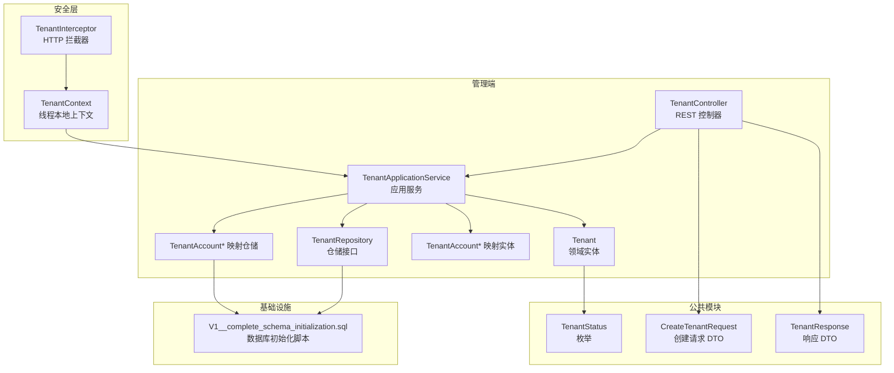
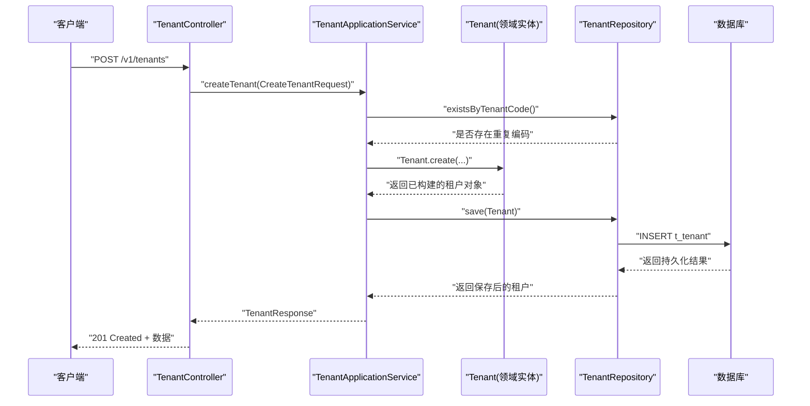
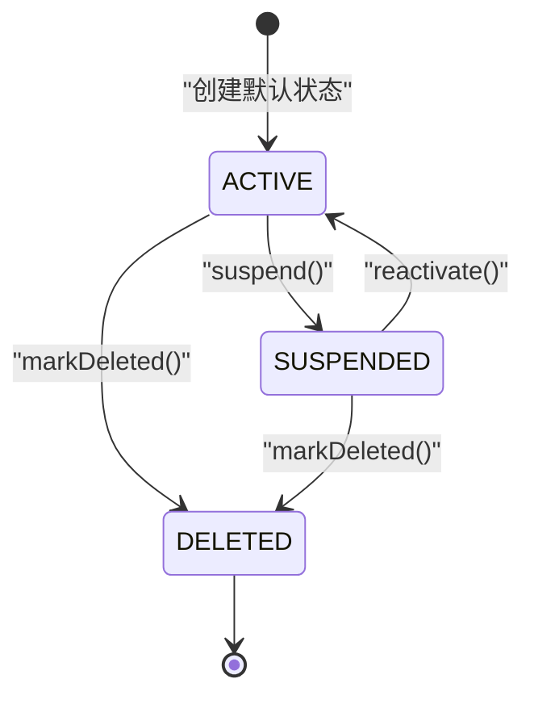
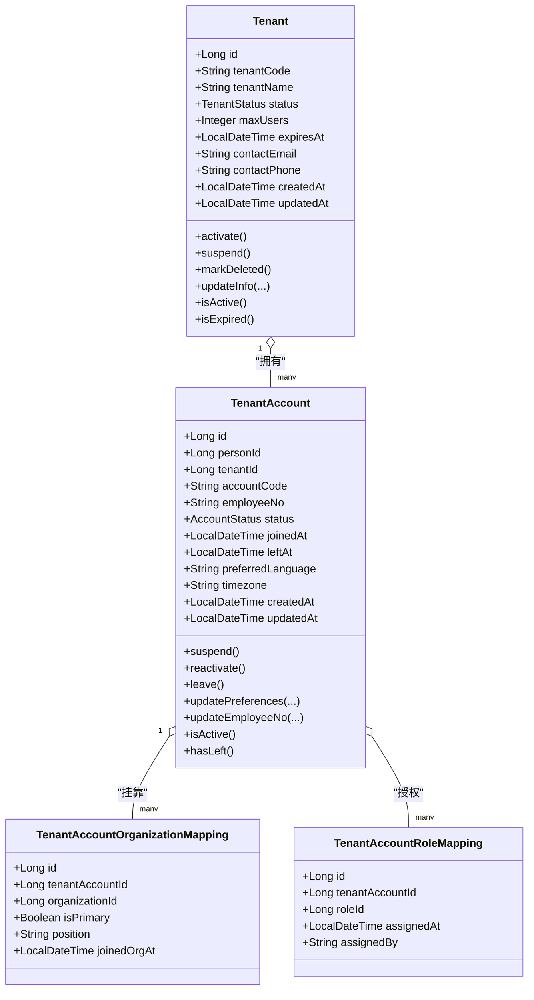
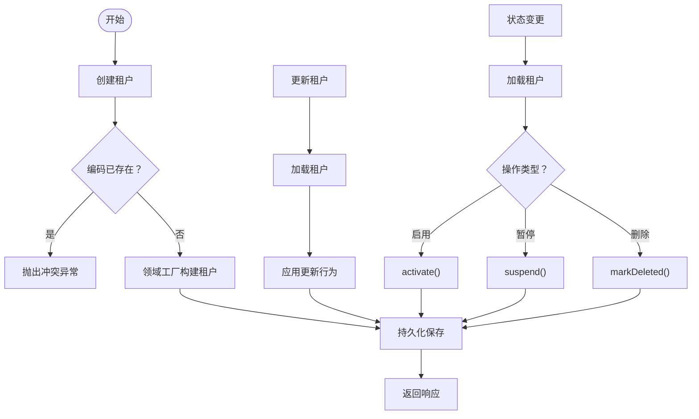
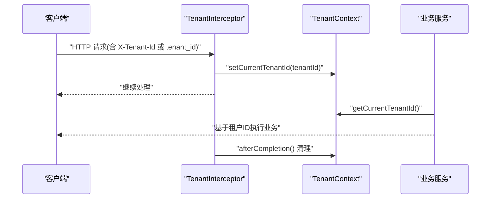
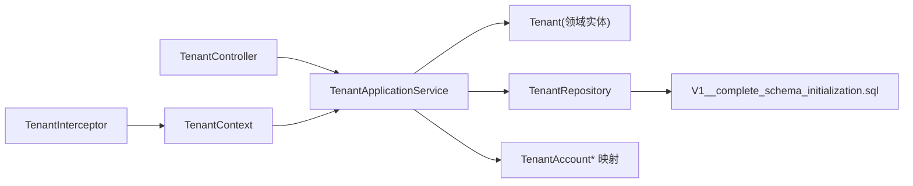
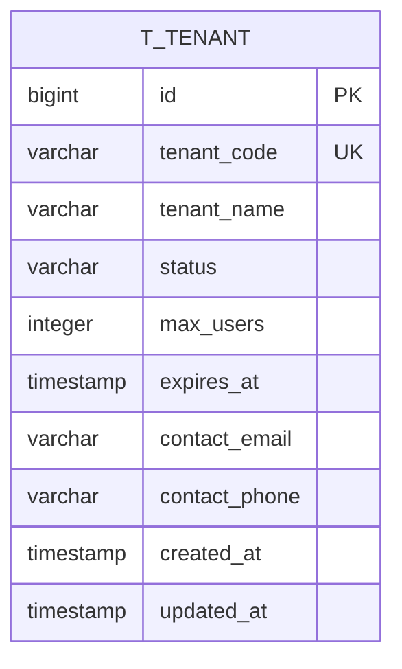

# 租户实体

<cite>
**本文引用的文件**
- [Tenant.java](file://iam-admin-server/src/main/java/iam/platform/admin/domain/model/entity/Tenant.java)
- [TenantStatus.java](file://iam-common/src/main/java/iam/platform/common/model/enums/TenantStatus.java)
- [CreateTenantRequest.java](file://iam-common/src/main/java/iam/platform/common/dto/request/CreateTenantRequest.java)
- [TenantResponse.java](file://iam-common/src/main/java/iam/platform/common/dto/response/TenantResponse.java)
- [TenantApplicationService.java](file://iam-admin-server/src/main/java/iam/platform/admin/application/service/TenantApplicationService.java)
- [TenantController.java](file://iam-admin-server/src/main/java/iam/platform/admin/interfaces/rest/TenantController.java)
- [TenantRepository.java](file://iam-admin-server/src/main/java/iam/platform/admin/domain/repository/TenantRepository.java)
- [TenantAccount.java](file://iam-admin-server/src/main/java/iam/platform/admin/domain/model/entity/TenantAccount.java)
- [TenantAccountApplicationService.java](file://iam-admin-server/src/main/java/iam/platform/admin/application/service/TenantAccountApplicationService.java)
- [TenantAccountRepository.java](file://iam-admin-server/src/main/java/iam/platform/admin/domain/repository/TenantAccountRepository.java)
- [TenantAccountOrganizationMapping.java](file://iam-admin-server/src/main/java/iam/platform/admin/domain/model/entity/TenantAccountOrganizationMapping.java)
- [TenantAccountOrganizationMappingRepository.java](file://iam-admin-server/src/main/java/iam/platform/admin/domain/repository/TenantAccountOrganizationMappingRepository.java)
- [TenantAccountRoleMapping.java](file://iam-admin-server/src/main/java/iam/platform/admin/domain/model/entity/TenantAccountRoleMapping.java)
- [TenantAccountRoleMappingRepository.java](file://iam-admin-server/src/main/java/iam/platform/admin/domain/repository/TenantAccountRoleMappingRepository.java)
- [TenantContext.java](file://iam-admin-server/src/main/java/iam/platform/admin/infrastructure/security/TenantContext.java)
- [TenantInterceptor.java](file://iam-admin-server/src/main/java/iam/platform/admin/infrastructure/security/TenantInterceptor.java)
- [V1__complete_schema_initialization.sql](file://iam-admin-server/src/main/resources/db/migration/V1__complete_schema_initialization.sql)
</cite>

## 目录
1. [简介](#简介)
2. [项目结构](#项目结构)
3. [核心组件](#核心组件)
4. [架构总览](#架构总览)
5. [详细组件分析](#详细组件分析)
6. [依赖分析](#依赖分析)
7. [性能考量](#性能考量)
8. [故障排查指南](#故障排查指南)
9. [结论](#结论)
10. [附录](#附录)

## 简介
本文件围绕“租户”实体展开，系统性阐述其在多租户架构中的核心地位与设计要点，覆盖以下主题：
- 唯一标识与基础属性：租户编码、名称、描述联系人信息、配额与过期时间等
- 状态管理：启用/暂停/删除的状态机与业务约束
- 生命周期：创建、激活、停用、软删除等关键节点
- 隔离机制：通过请求上下文注入与线程本地存储实现跨模块的租户隔离
- 关系映射：租户与用户、组织、角色的关联模型及映射表设计
- 业务规则与约束：租户级权限控制、资源上限与到期校验
- 架构定位：在管理端与鉴权端的职责划分与交互关系

## 项目结构
租户实体位于管理端领域层，配合应用服务、控制器、仓库与数据库脚本共同构成完整的租户能力闭环；同时在安全层通过拦截器与上下文实现跨模块的租户识别与隔离。

**图表来源**
- [TenantController.java:1-90](file://iam-admin-server/src/main/java/iam/platform/admin/interfaces/rest/TenantController.java#L1-L90)
- [TenantApplicationService.java:1-130](file://iam-admin-server/src/main/java/iam/platform/admin/application/service/TenantApplicationService.java#L1-L130)
- [Tenant.java:1-117](file://iam-admin-server/src/main/java/iam/platform/admin/domain/model/entity/Tenant.java#L1-L117)
- [TenantRepository.java:1-27](file://iam-admin-server/src/main/java/iam/platform/admin/domain/repository/TenantRepository.java#L1-L27)
- [TenantAccountOrganizationMapping.java:1-22](file://iam-admin-server/src/main/java/iam/platform/admin/domain/model/entity/TenantAccountOrganizationMapping.java#L1-L22)
- [TenantAccountRoleMapping.java:1-21](file://iam-admin-server/src/main/java/iam/platform/admin/domain/model/entity/TenantAccountRoleMapping.java#L1-L21)
- [TenantStatus.java:1-6](file://iam-common/src/main/java/iam/platform/common/model/enums/TenantStatus.java#L1-L6)
- [CreateTenantRequest.java:1-43](file://iam-common/src/main/java/iam/platform/common/dto/request/CreateTenantRequest.java#L1-L43)
- [TenantResponse.java:1-27](file://iam-common/src/main/java/iam/platform/common/dto/response/TenantResponse.java#L1-L27)
- [TenantInterceptor.java:1-51](file://iam-admin-server/src/main/java/iam/platform/admin/infrastructure/security/TenantInterceptor.java#L1-L51)
- [TenantContext.java:1-45](file://iam-admin-server/src/main/java/iam/platform/admin/infrastructure/security/TenantContext.java#L1-L45)
- [V1__complete_schema_initialization.sql:176-208](file://iam-admin-server/src/main/resources/db/migration/V1__complete_schema_initialization.sql#L176-L208)

**章节来源**
- [TenantController.java:1-90](file://iam-admin-server/src/main/java/iam/platform/admin/interfaces/rest/TenantController.java#L1-L90)
- [TenantApplicationService.java:1-130](file://iam-admin-server/src/main/java/iam/platform/admin/application/service/TenantApplicationService.java#L1-L130)
- [Tenant.java:1-117](file://iam-admin-server/src/main/java/iam/platform/admin/domain/model/entity/Tenant.java#L1-L117)
- [TenantRepository.java:1-27](file://iam-admin-server/src/main/java/iam/platform/admin/domain/repository/TenantRepository.java#L1-L27)
- [TenantAccountOrganizationMapping.java:1-22](file://iam-admin-server/src/main/java/iam/platform/admin/domain/model/entity/TenantAccountOrganizationMapping.java#L1-L22)
- [TenantAccountRoleMapping.java:1-21](file://iam-admin-server/src/main/java/iam/platform/admin/domain/model/entity/TenantAccountRoleMapping.java#L1-L21)
- [TenantStatus.java:1-6](file://iam-common/src/main/java/iam/platform/common/model/enums/TenantStatus.java#L1-L6)
- [CreateTenantRequest.java:1-43](file://iam-common/src/main/java/iam/platform/common/dto/request/CreateTenantRequest.java#L1-L43)
- [TenantResponse.java:1-27](file://iam-common/src/main/java/iam/platform/common/dto/response/TenantResponse.java#L1-L27)
- [TenantInterceptor.java:1-51](file://iam-admin-server/src/main/java/iam/platform/admin/infrastructure/security/TenantInterceptor.java#L1-L51)
- [TenantContext.java:1-45](file://iam-admin-server/src/main/java/iam/platform/admin/infrastructure/security/TenantContext.java#L1-L45)
- [V1__complete_schema_initialization.sql:176-208](file://iam-admin-server/src/main/resources/db/migration/V1__complete_schema_initialization.sql#L176-L208)

## 核心组件
- 领域实体：租户实体承载租户的唯一标识、名称、状态、配额、联系信息与过期时间等属性，并内置状态机与行为方法，保证业务规则在实体内落地。
- 应用服务：封装租户的创建、查询、更新、状态变更与分页列表等用例，协调仓储与领域实体，记录审计日志。
- 控制器：暴露REST API，负责参数校验、权限注解与响应包装。
- 仓储接口：抽象持久化操作，支持按编码查询、分页检索、计数与存在性检查等。
- 安全上下文：通过HTTP拦截器提取租户标识，写入线程本地上下文，贯穿请求生命周期，为后续鉴权与数据隔离提供依据。
- 映射实体：租户账户-组织映射与租户账户-角色映射，用于建立租户内人员与组织、角色的多对多关系。

**章节来源**
- [Tenant.java:1-117](file://iam-admin-server/src/main/java/iam/platform/admin/domain/model/entity/Tenant.java#L1-L117)
- [TenantApplicationService.java:1-130](file://iam-admin-server/src/main/java/iam/platform/admin/application/service/TenantApplicationService.java#L1-L130)
- [TenantController.java:1-90](file://iam-admin-server/src/main/java/iam/platform/admin/interfaces/rest/TenantController.java#L1-L90)
- [TenantRepository.java:1-27](file://iam-admin-server/src/main/java/iam/platform/admin/domain/repository/TenantRepository.java#L1-L27)
- [TenantContext.java:1-45](file://iam-admin-server/src/main/java/iam/platform/admin/infrastructure/security/TenantContext.java#L1-L45)
- [TenantInterceptor.java:1-51](file://iam-admin-server/src/main/java/iam/platform/admin/infrastructure/security/TenantInterceptor.java#L1-L51)
- [TenantAccountOrganizationMapping.java:1-22](file://iam-admin-server/src/main/java/iam/platform/admin/domain/model/entity/TenantAccountOrganizationMapping.java#L1-L22)
- [TenantAccountRoleMapping.java:1-21](file://iam-admin-server/src/main/java/iam/platform/admin/domain/model/entity/TenantAccountRoleMapping.java#L1-L21)

## 架构总览
租户实体在系统中的定位与交互如下：
- 管理端负责租户的全生命周期管理与展示，应用服务调用领域实体执行业务规则，仓储负责持久化。
- 安全拦截器在请求进入时解析租户上下文，确保后续鉴权与数据访问均基于当前租户。
- 公共模块提供统一的枚举与DTO，保障跨模块契约一致。

**图表来源**
- [TenantController.java:34-40](file://iam-admin-server/src/main/java/iam/platform/admin/interfaces/rest/TenantController.java#L34-L40)
- [TenantApplicationService.java:31-48](file://iam-admin-server/src/main/java/iam/platform/admin/application/service/TenantApplicationService.java#L31-L48)
- [Tenant.java:33-48](file://iam-admin-server/src/main/java/iam/platform/admin/domain/model/entity/Tenant.java#L33-L48)
- [TenantRepository.java:11-19](file://iam-admin-server/src/main/java/iam/platform/admin/domain/repository/TenantRepository.java#L11-L19)
- [V1__complete_schema_initialization.sql:176-190](file://iam-admin-server/src/main/resources/db/migration/V1__complete_schema_initialization.sql#L176-L190)

## 详细组件分析

### 租户实体与状态机
- 唯一标识与基础属性：包含租户编码、名称、状态、最大用户数、到期时间、联系邮箱与电话、创建/更新时间等。
- 工厂方法：创建租户时默认状态为启用，并对必填字段进行校验。
- 状态机：
  - 启用：仅允许非删除状态的租户启用
  - 暂停：仅允许启用状态的租户暂停
  - 删除：仅允许非启用状态的租户删除（需先暂停）
- 行为方法：支持更新租户信息（名称、配额、联系方式、到期时间），并自动更新时间戳。
- 查询方法：提供启用态判断与到期判断。

**图表来源**
- [Tenant.java:55-80](file://iam-admin-server/src/main/java/iam/platform/admin/domain/model/entity/Tenant.java#L55-L80)
- [TenantStatus.java:3-5](file://iam-common/src/main/java/iam/platform/common/model/enums/TenantStatus.java#L3-L5)

**章节来源**
- [Tenant.java:1-117](file://iam-admin-server/src/main/java/iam/platform/admin/domain/model/entity/Tenant.java#L1-L117)
- [TenantStatus.java:1-6](file://iam-common/src/main/java/iam/platform/common/model/enums/TenantStatus.java#L1-L6)

### 租户与用户、组织、角色的关系映射
- 租户账户-组织映射：记录租户账户在组织内的岗位、是否主岗、加入组织时间等信息，支持多组织挂载与主岗标记。
- 租户账户-角色映射：记录账户被授予的角色、分配时间与经办人，支持多角色授权。
- 这些映射实体作为独立的领域值对象，通过对应的仓储进行CRUD与存在性检查，支撑复杂的权限与组织关系管理。

**图表来源**
- [Tenant.java:1-117](file://iam-admin-server/src/main/java/iam/platform/admin/domain/model/entity/Tenant.java#L1-L117)
- [TenantAccount.java:1-131](file://iam-admin-server/src/main/java/iam/platform/admin/domain/model/entity/TenantAccount.java#L1-L131)
- [TenantAccountOrganizationMapping.java:1-22](file://iam-admin-server/src/main/java/iam/platform/admin/domain/model/entity/TenantAccountOrganizationMapping.java#L1-L22)
- [TenantAccountRoleMapping.java:1-21](file://iam-admin-server/src/main/java/iam/platform/admin/domain/model/entity/TenantAccountRoleMapping.java#L1-L21)

**章节来源**
- [TenantAccountOrganizationMapping.java:1-22](file://iam-admin-server/src/main/java/iam/platform/admin/domain/model/entity/TenantAccountOrganizationMapping.java#L1-L22)
- [TenantAccountRoleMapping.java:1-21](file://iam-admin-server/src/main/java/iam/platform/admin/domain/model/entity/TenantAccountRoleMapping.java#L1-L21)
- [TenantAccountOrganizationMappingRepository.java:1-28](file://iam-admin-server/src/main/java/iam/platform/admin/domain/repository/TenantAccountOrganizationMappingRepository.java#L1-L28)
- [TenantAccountRoleMappingRepository.java:1-25](file://iam-admin-server/src/main/java/iam/platform/admin/domain/repository/TenantAccountRoleMappingRepository.java#L1-L25)

### 租户生命周期管理
- 创建：校验租户编码唯一性，调用领域工厂方法创建并持久化，返回标准化响应。
- 更新：根据请求更新租户信息，持久化后返回最新视图。
- 状态变更：支持启用与暂停；删除采用软删除策略，要求先暂停再删除。
- 列表：分页查询所有租户，聚合当前用户数（活跃+暂停）。

**图表来源**
- [TenantApplicationService.java:31-85](file://iam-admin-server/src/main/java/iam/platform/admin/application/service/TenantApplicationService.java#L31-L85)
- [Tenant.java:33-105](file://iam-admin-server/src/main/java/iam/platform/admin/domain/model/entity/Tenant.java#L33-L105)

**章节来源**
- [TenantApplicationService.java:1-130](file://iam-admin-server/src/main/java/iam/platform/admin/application/service/TenantApplicationService.java#L1-L130)
- [TenantController.java:1-90](file://iam-admin-server/src/main/java/iam/platform/admin/interfaces/rest/TenantController.java#L1-L90)

### 租户隔离机制
- 请求入口：拦截器从请求头或查询参数中读取租户ID，填充到线程本地上下文。
- 上下文持有：在请求处理期间，后续的鉴权、审计与业务逻辑可读取当前租户ID，确保操作限定在该租户范围内。
- 清理机制：请求完成后清理上下文，避免线程复用导致的数据泄露。

**图表来源**
- [TenantInterceptor.java:23-49](file://iam-admin-server/src/main/java/iam/platform/admin/infrastructure/security/TenantInterceptor.java#L23-L49)
- [TenantContext.java:7-44](file://iam-admin-server/src/main/java/iam/platform/admin/infrastructure/security/TenantContext.java#L7-L44)

**章节来源**
- [TenantInterceptor.java:1-51](file://iam-admin-server/src/main/java/iam/platform/admin/infrastructure/security/TenantInterceptor.java#L1-L51)
- [TenantContext.java:1-45](file://iam-admin-server/src/main/java/iam/platform/admin/infrastructure/security/TenantContext.java#L1-L45)

### 业务规则与约束
- 租户编码唯一且格式约束：小写字母、数字、连字符，长度范围校验。
- 租户名称长度约束与必填校验。
- 最大用户数最小值约束。
- 联系邮箱格式校验。
- 到期时间必须在未来。
- 租户状态变更的前置条件：启用不可对已删除租户生效；暂停仅限启用租户；删除需先暂停。
- 当前用户数统计：活跃+暂停两类状态计数，用于响应体展示。

**章节来源**
- [CreateTenantRequest.java:21-42](file://iam-common/src/main/java/iam/platform/common/dto/request/CreateTenantRequest.java#L21-L42)
- [TenantApplicationService.java:117-128](file://iam-admin-server/src/main/java/iam/platform/admin/application/service/TenantApplicationService.java#L117-L128)
- [Tenant.java:55-80](file://iam-admin-server/src/main/java/iam/platform/admin/domain/model/entity/Tenant.java#L55-L80)

## 依赖分析
- 内聚性：租户实体内聚了状态机与行为方法，职责清晰；应用服务负责编排与事务边界。
- 耦合度：应用服务依赖仓储接口，仓储依赖数据库脚本；安全上下文通过拦截器注入，不直接耦合业务逻辑。
- 外部依赖：公共模块提供枚举与DTO，确保跨模块一致性；数据库脚本定义表结构与索引。

**图表来源**
- [TenantController.java:1-90](file://iam-admin-server/src/main/java/iam/platform/admin/interfaces/rest/TenantController.java#L1-L90)
- [TenantApplicationService.java:1-130](file://iam-admin-server/src/main/java/iam/platform/admin/application/service/TenantApplicationService.java#L1-L130)
- [Tenant.java:1-117](file://iam-admin-server/src/main/java/iam/platform/admin/domain/model/entity/Tenant.java#L1-L117)
- [TenantRepository.java:1-27](file://iam-admin-server/src/main/java/iam/platform/admin/domain/repository/TenantRepository.java#L1-L27)
- [TenantInterceptor.java:1-51](file://iam-admin-server/src/main/java/iam/platform/admin/infrastructure/security/TenantInterceptor.java#L1-L51)
- [TenantContext.java:1-45](file://iam-admin-server/src/main/java/iam/platform/admin/infrastructure/security/TenantContext.java#L1-L45)
- [V1__complete_schema_initialization.sql:176-208](file://iam-admin-server/src/main/resources/db/migration/V1__complete_schema_initialization.sql#L176-L208)

**章节来源**
- [TenantController.java:1-90](file://iam-admin-server/src/main/java/iam/platform/admin/interfaces/rest/TenantController.java#L1-L90)
- [TenantApplicationService.java:1-130](file://iam-admin-server/src/main/java/iam/platform/admin/application/service/TenantApplicationService.java#L1-L130)
- [TenantRepository.java:1-27](file://iam-admin-server/src/main/java/iam/platform/admin/domain/repository/TenantRepository.java#L1-L27)
- [TenantInterceptor.java:1-51](file://iam-admin-server/src/main/java/iam/platform/admin/infrastructure/security/TenantInterceptor.java#L1-L51)
- [TenantContext.java:1-45](file://iam-admin-server/src/main/java/iam/platform/admin/infrastructure/security/TenantContext.java#L1-L45)
- [V1__complete_schema_initialization.sql:176-208](file://iam-admin-server/src/main/resources/db/migration/V1__complete_schema_initialization.sql#L176-L208)

## 性能考量
- 分页查询：列表接口使用分页参数，避免一次性加载大量租户数据。
- 计数聚合：当前用户数通过两个状态计数组合计算，建议在数据库层面维护统计字段或定期物化视图以降低查询成本。
- 索引优化：租户编码建立唯一索引，提升按编码查询效率。
- 线程本地上下文：避免频繁传递租户ID，减少参数传播开销。

## 故障排查指南
- 创建失败（编码冲突）：检查租户编码是否重复，确认唯一性约束。
- 状态变更异常：确认当前租户状态满足前置条件（启用不可对已删除租户生效；暂停仅限启用租户；删除需先暂停）。
- 查询不到租户：确认租户ID正确，以及租户未被软删除。
- 隔离问题：检查请求头或参数是否正确传入租户ID，拦截器是否生效，上下文是否被清理。

**章节来源**
- [TenantApplicationService.java:32-34](file://iam-admin-server/src/main/java/iam/platform/admin/application/service/TenantApplicationService.java#L32-L34)
- [Tenant.java:55-80](file://iam-admin-server/src/main/java/iam/platform/admin/domain/model/entity/Tenant.java#L55-L80)
- [TenantInterceptor.java:23-49](file://iam-admin-server/src/main/java/iam/platform/admin/infrastructure/security/TenantInterceptor.java#L23-L49)

## 结论
租户实体在本多租户平台中承担核心角色：以领域驱动的方式定义租户的唯一标识、状态与行为，结合应用服务与仓储实现完整的生命周期管理；通过安全拦截器与线程本地上下文实现跨模块的租户隔离；借助映射实体与仓储支撑复杂的组织与角色关系。整体设计在可维护性、可扩展性与安全性之间取得平衡，为上层权限体系与业务功能提供坚实基础。

## 附录
- 数据模型概览（对应数据库脚本）

**图表来源**
- [V1__complete_schema_initialization.sql:176-190](file://iam-admin-server/src/main/resources/db/migration/V1__complete_schema_initialization.sql#L176-L190)