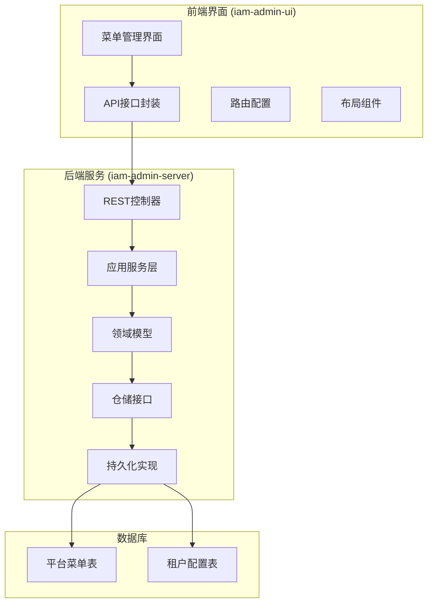
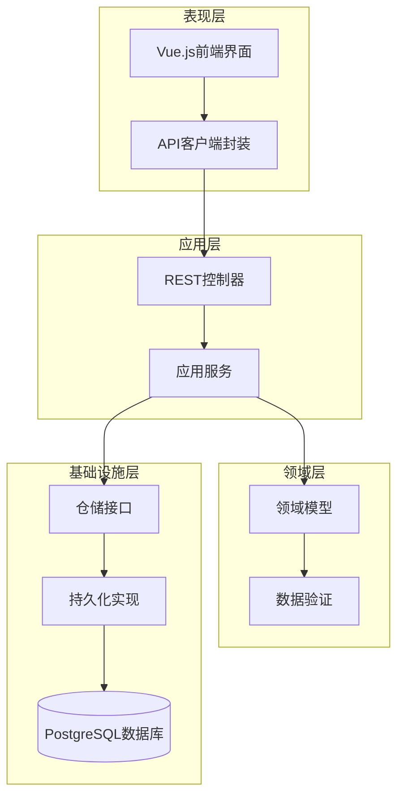
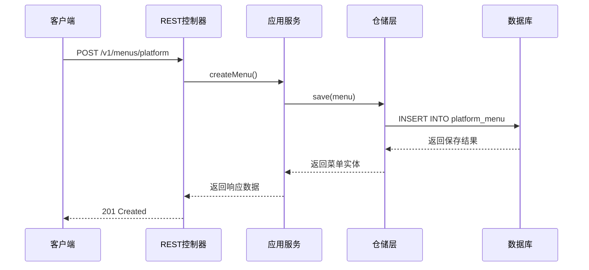
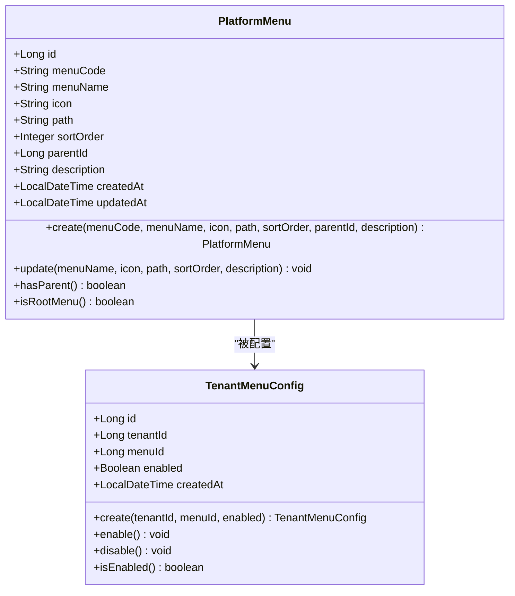
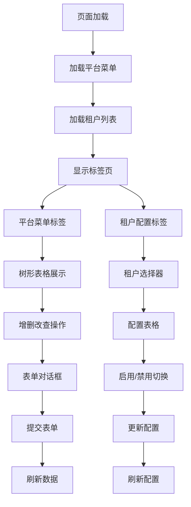
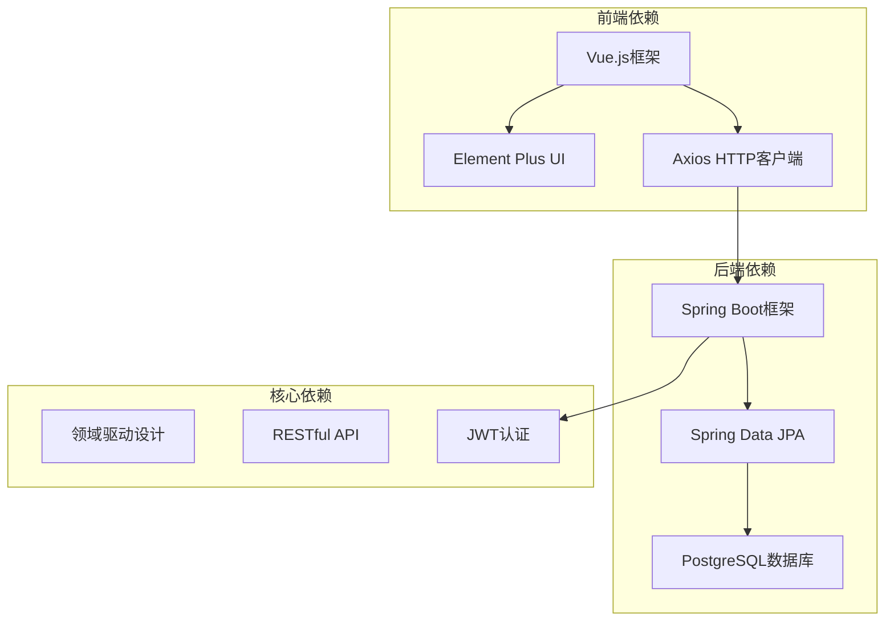

# 平台菜单管理

<cite>
**本文档引用的文件**
- [TenantMenuController.java](file://iam-admin-server/src/main/java/iam/platform/admin/interfaces/rest/TenantMenuController.java)
- [TenantMenuApplicationService.java](file://iam-admin-server/src/main/java/iam/platform/admin/application/service/TenantMenuApplicationService.java)
- [PlatformMenu.java](file://iam-admin-server/src/main/java/iam/platform/admin/domain/model/entity/PlatformMenu.java)
- [TenantMenuConfig.java](file://iam-admin-server/src/main/java/iam/platform/admin/domain/model/entity/TenantMenuConfig.java)
- [PlatformMenuRepository.java](file://iam-admin-server/src/main/java/iam/platform/admin/domain/repository/PlatformMenuRepository.java)
- [TenantMenuConfigRepository.java](file://iam-admin-server/src/main/java/iam/platform/admin/domain/repository/TenantMenuConfigRepository.java)
- [PlatformMenuRepositoryImpl.java](file://iam-admin-server/src/main/java/iam/platform/admin/infrastructure/persistence/impl/PlatformMenuRepositoryImpl.java)
- [TenantMenuConfigRepositoryImpl.java](file://iam-admin-server/src/main/java/iam/platform/admin/infrastructure/persistence/impl/TenantMenuConfigRepositoryImpl.java)
- [MenuManagement.vue](file://iam-admin-ui/src/views/MenuManagement.vue)
- [SidebarMenu.vue](file://iam-admin-ui/src/components/layout/SidebarMenu.vue)
- [admin.js](file://iam-admin-ui/src/api/admin.js)
- [index.js](file://iam-admin-ui/src/router/index.js)
- [V1__complete_schema_initialization.sql](file://iam-admin-server/src/main/resources/db/migration/V1__complete_schema_initialization.sql)
</cite>

## 目录
1. [简介](#简介)
2. [项目结构](#项目结构)
3. [核心组件](#核心组件)
4. [架构概览](#架构概览)
5. [详细组件分析](#详细组件分析)
6. [依赖关系分析](#依赖关系分析)
7. [性能考虑](#性能考虑)
8. [故障排除指南](#故障排除指南)
9. [结论](#结论)

## 简介

平台菜单管理系统是IAM（身份和访问管理）平台的核心功能模块之一，负责管理平台级菜单定义以及为不同租户配置菜单可见性。该系统采用分层架构设计，支持多租户环境下的菜单个性化配置，确保不同租户可以看到不同的菜单组合。

系统主要包含两个核心功能：
- **平台菜单管理**：创建、维护和管理全局可用的菜单项
- **租户菜单配置**：为特定租户启用或禁用平台菜单项

## 项目结构

基于仓库的实际结构，菜单管理系统分布在以下模块中：

**图表来源**
- [MenuManagement.vue:1-265](file://iam-admin-ui/src/views/MenuManagement.vue#L1-L265)
- [TenantMenuController.java:1-102](file://iam-admin-server/src/main/java/iam/platform/admin/interfaces/rest/TenantMenuController.java#L1-L102)
- [PlatformMenu.java:1-89](file://iam-admin-server/src/main/java/iam/platform/admin/domain/model/entity/PlatformMenu.java#L1-L89)

**章节来源**
- [MenuManagement.vue:1-265](file://iam-admin-ui/src/views/MenuManagement.vue#L1-L265)
- [TenantMenuController.java:1-102](file://iam-admin-server/src/main/java/iam/platform/admin/interfaces/rest/TenantMenuController.java#L1-L102)

## 核心组件

### 后端核心组件

系统采用DDD（领域驱动设计）架构，包含以下核心组件：

#### REST控制器层
- **TenantMenuController**：提供REST API接口，处理菜单管理相关请求
- 支持平台菜单的CRUD操作
- 支持租户菜单配置的启用/禁用操作

#### 应用服务层
- **TenantMenuApplicationService**：业务逻辑处理，协调领域模型和仓储层
- 实现事务管理和业务规则验证
- 提供数据转换和响应封装

#### 领域模型层
- **PlatformMenu**：平台菜单实体，包含菜单的基本属性和行为
- **TenantMenuConfig**：租户菜单配置实体，控制菜单可见性
- 实现数据验证和业务逻辑

#### 仓储接口层
- **PlatformMenuRepository**：平台菜单数据访问接口
- **TenantMenuConfigRepository**：租户菜单配置数据访问接口
- 定义数据查询和操作规范

**章节来源**
- [TenantMenuController.java:15-102](file://iam-admin-server/src/main/java/iam/platform/admin/interfaces/rest/TenantMenuController.java#L15-L102)
- [TenantMenuApplicationService.java:18-130](file://iam-admin-server/src/main/java/iam/platform/admin/application/service/TenantMenuApplicationService.java#L18-L130)

## 架构概览

系统采用分层架构设计，确保关注点分离和代码可维护性：

**图表来源**
- [TenantMenuController.java:15-102](file://iam-admin-server/src/main/java/iam/platform/admin/interfaces/rest/TenantMenuController.java#L15-L102)
- [TenantMenuApplicationService.java:18-130](file://iam-admin-server/src/main/java/iam/platform/admin/application/service/TenantMenuApplicationService.java#L18-L130)
- [PlatformMenuRepositoryImpl.java:18-67](file://iam-admin-server/src/main/java/iam/platform/admin/infrastructure/persistence/impl/PlatformMenuRepositoryImpl.java#L18-L67)

## 详细组件分析

### REST API接口设计

系统提供完整的REST API接口来管理菜单：

#### 平台菜单管理接口
- `POST /v1/menus/platform`：创建平台菜单
- `GET /v1/menus/platform/{id}`：获取指定菜单
- `GET /v1/menus/platform`：获取所有菜单
- `PUT /v1/menus/platform/{id}`：更新菜单
- `DELETE /v1/menus/platform/{id}`：删除菜单

#### 租户菜单配置接口
- `POST /v1/menus/tenant/{tenantId}/menu/{menuId}`：配置租户菜单
- `GET /v1/menus/tenant/{tenantId}`：获取租户所有菜单配置
- `GET /v1/menus/tenant/{tenantId}/enabled`：获取租户启用的菜单
- `DELETE /v1/menus/tenant/{tenantId}/menu/{menuId}`：移除租户菜单

**图表来源**
- [TenantMenuController.java:25-38](file://iam-admin-server/src/main/java/iam/platform/admin/interfaces/rest/TenantMenuController.java#L25-L38)
- [TenantMenuApplicationService.java:25-33](file://iam-admin-server/src/main/java/iam/platform/admin/application/service/TenantMenuApplicationService.java#L25-L33)

**章节来源**
- [TenantMenuController.java:25-100](file://iam-admin-server/src/main/java/iam/platform/admin/interfaces/rest/TenantMenuController.java#L25-L100)

### 领域模型设计

#### 平台菜单实体
平台菜单实体包含以下核心属性：
- 菜单标识符（自动生成）
- 菜单编码（唯一标识）
- 菜单名称
- 图标样式
- 路由路径
- 排序权重
- 父级菜单ID（支持树形结构）
- 描述信息
- 创建和更新时间戳

**图表来源**
- [PlatformMenu.java:18-88](file://iam-admin-server/src/main/java/iam/platform/admin/domain/model/entity/PlatformMenu.java#L18-L88)
- [TenantMenuConfig.java:19-64](file://iam-admin-server/src/main/java/iam/platform/admin/domain/model/entity/TenantMenuConfig.java#L19-L64)

**章节来源**
- [PlatformMenu.java:35-88](file://iam-admin-server/src/main/java/iam/platform/admin/domain/model/entity/PlatformMenu.java#L35-L88)
- [TenantMenuConfig.java:31-64](file://iam-admin-server/src/main/java/iam/platform/admin/domain/model/entity/TenantMenuConfig.java#L31-L64)

### 前端界面组件

#### 菜单管理界面
前端提供直观的菜单管理界面，支持以下功能：
- 平台菜单的树形展示
- 菜单的增删改查操作
- 租户菜单配置的开关控制
- 实时的数据同步和状态反馈

**图表来源**
- [MenuManagement.vue:149-246](file://iam-admin-ui/src/views/MenuManagement.vue#L149-L246)
- [admin.js:84-101](file://iam-admin-ui/src/api/admin.js#L84-L101)

**章节来源**
- [MenuManagement.vue:1-265](file://iam-admin-ui/src/views/MenuManagement.vue#L1-L265)
- [admin.js:84-101](file://iam-admin-ui/src/api/admin.js#L84-L101)

## 依赖关系分析

系统各层之间的依赖关系清晰明确：

**图表来源**
- [MenuManagement.vue:108-147](file://iam-admin-ui/src/views/MenuManagement.vue#L108-L147)
- [TenantMenuController.java:15-18](file://iam-admin-server/src/main/java/iam/platform/admin/interfaces/rest/TenantMenuController.java#L15-L18)

**章节来源**
- [index.js:1-72](file://iam-admin-ui/src/router/index.js#L1-L72)
- [SidebarMenu.vue:1-55](file://iam-admin-ui/src/components/layout/SidebarMenu.vue#L1-L55)

## 性能考虑

### 数据库优化策略
- 使用索引优化常用查询（菜单编码、父级ID、排序字段）
- 实现分页查询支持大数据量场景
- 采用连接池管理数据库连接
- 实现缓存机制减少重复查询

### 前端性能优化
- 使用虚拟滚动处理大量菜单数据
- 实现懒加载避免一次性加载所有数据
- 采用防抖机制优化频繁操作
- 实现本地存储提升用户体验

### 后端性能优化
- 使用事务管理保证数据一致性
- 实现批量操作减少数据库往返
- 采用异步处理非关键任务
- 实现请求限流防止系统过载

## 故障排除指南

### 常见问题及解决方案

#### 菜单创建失败
**问题症状**：创建菜单时报错，返回错误信息
**可能原因**：
- 菜单编码重复
- 必填字段缺失
- 数据库连接异常

**解决步骤**：
1. 检查菜单编码是否唯一
2. 验证必填字段是否完整
3. 确认数据库连接状态
4. 查看后端日志获取详细错误信息

#### 菜单配置不生效
**问题症状**：租户无法看到配置的菜单
**可能原因**：
- 菜单配置未正确保存
- 租户状态异常
- 权限不足

**解决步骤**：
1. 验证租户菜单配置状态
2. 检查租户是否处于激活状态
3. 确认当前用户具有相应权限
4. 清除浏览器缓存重新登录

#### 前端界面加载缓慢
**问题症状**：菜单管理界面加载时间过长
**可能原因**：
- 数据量过大
- 网络延迟
- 浏览器性能问题

**解决步骤**：
1. 检查网络连接质量
2. 清理浏览器缓存
3. 分页加载大量数据
4. 优化数据库查询性能

**章节来源**
- [TenantMenuApplicationService.java:35-60](file://iam-admin-server/src/main/java/iam/platform/admin/application/service/TenantMenuApplicationService.java#L35-L60)
- [MenuManagement.vue:227-236](file://iam-admin-ui/src/views/MenuManagement.vue#L227-L236)

## 结论

平台菜单管理系统通过清晰的分层架构和DDD设计原则，实现了功能完善、易于维护的菜单管理功能。系统支持多租户环境下的灵活配置，能够满足不同业务场景的需求。

### 主要优势
- **模块化设计**：各层职责明确，便于维护和扩展
- **数据一致性**：通过事务管理和数据验证确保数据完整性
- **用户体验**：提供直观的前端界面和实时的操作反馈
- **性能优化**：采用多种优化策略提升系统响应速度

### 技术特点
- 基于Spring Boot和Vue.js的现代化技术栈
- 完整的RESTful API设计
- 支持树形菜单结构
- 多租户权限控制
- 完善的日志记录和错误处理机制

该系统为IAM平台提供了坚实的基础功能支撑，为后续的功能扩展和业务发展奠定了良好的技术基础。