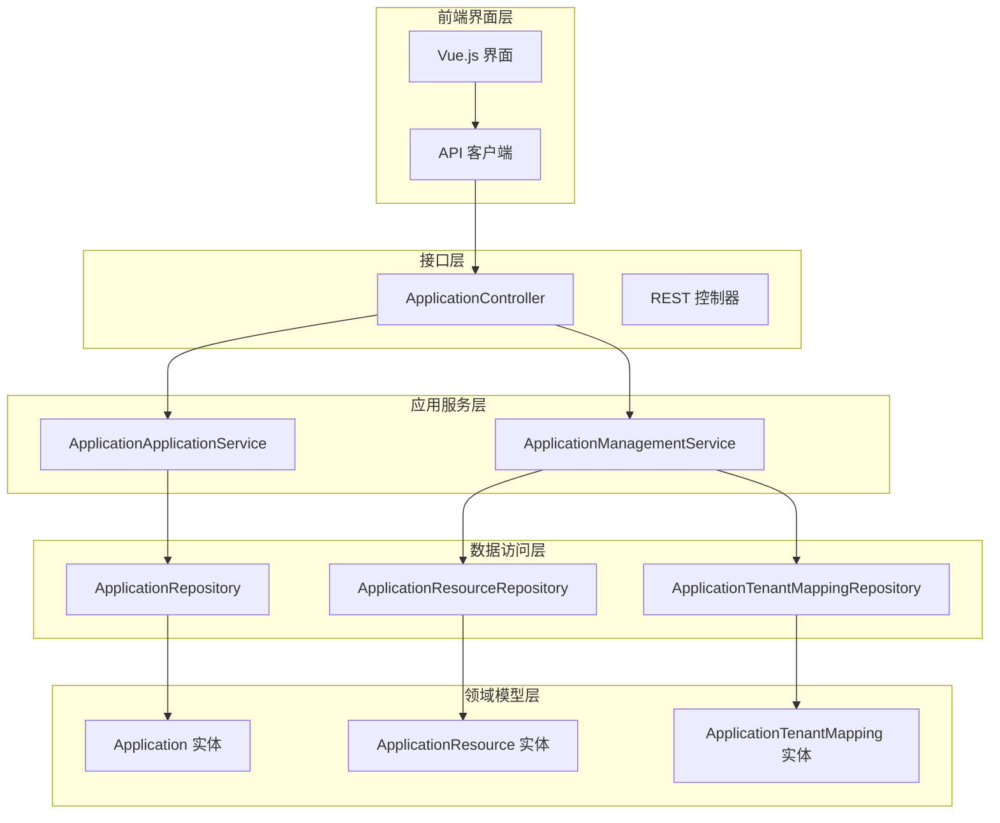
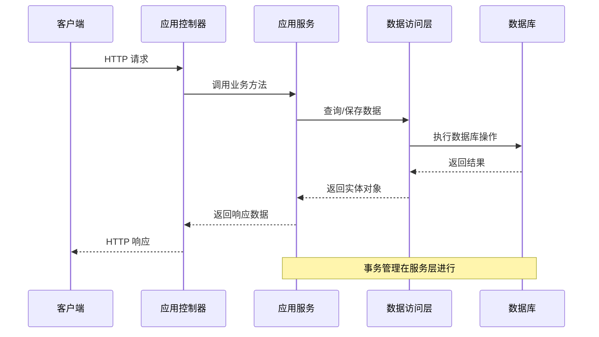
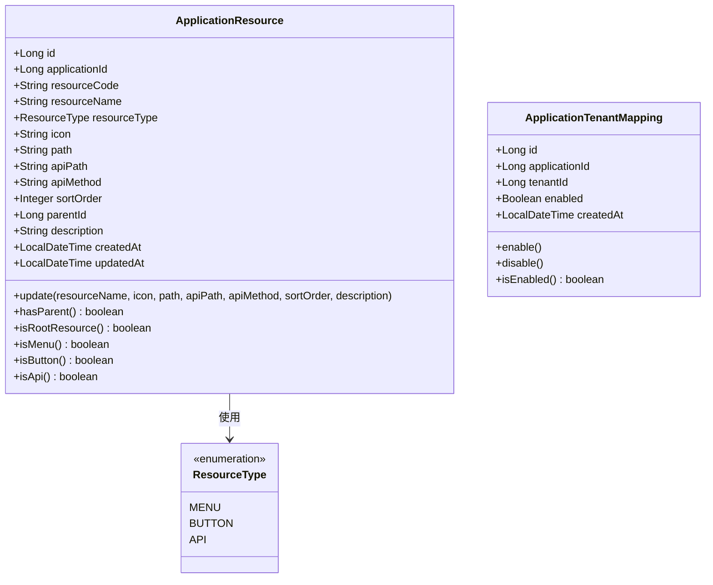
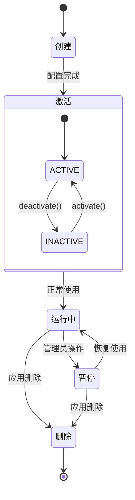
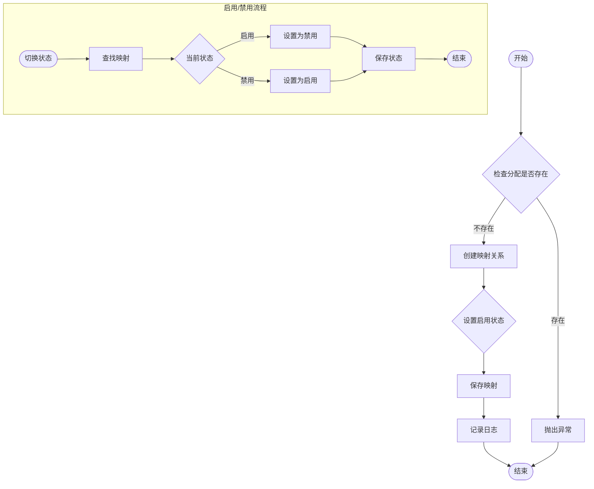
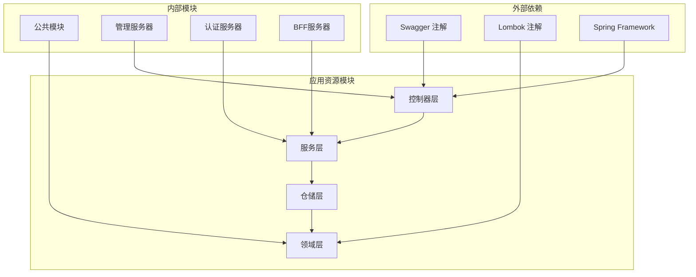

# 应用资源管理

<cite>
**本文档引用的文件**
- [ApplicationController.java](file://iam-admin-server/src/main/java/iam/platform/admin/interfaces/rest/ApplicationController.java)
- [ApplicationManagementService.java](file://iam-admin-server/src/main/java/iam/platform/admin/application/service/ApplicationManagementService.java)
- [ApplicationApplicationService.java](file://iam-admin-server/src/main/java/iam/platform/admin/application/service/ApplicationApplicationService.java)
- [Application.java](file://iam-admin-server/src/main/java/iam/platform/admin/domain/model/entity/Application.java)
- [ApplicationResource.java](file://iam-admin-server/src/main/java/iam/platform/admin/domain/model/entity/ApplicationResource.java)
- [ApplicationTenantMapping.java](file://iam-admin-server/src/main/java/iam/platform/admin/domain/model/entity/ApplicationTenantMapping.java)
- [ApplicationRepository.java](file://iam-admin-server/src/main/java/iam/platform/admin/domain/repository/ApplicationRepository.java)
- [ApplicationResourceRepository.java](file://iam-admin-server/src/main/java/iam/platform/admin/domain/repository/ApplicationResourceRepository.java)
- [ApplicationTenantMappingRepository.java](file://iam-admin-server/src/main/java/iam/platform/admin/domain/repository/ApplicationTenantMappingRepository.java)
- [ResourceType.java](file://iam-common/src/main/java/iam/platform/common/model/enums/ResourceType.java)
- [ApplicationList.vue](file://iam-admin-ui/src/views/ApplicationList.vue)
- [admin.js](file://iam-admin-ui/src/api/admin.js)
- [application.yml](file://iam-admin-server/src/main/resources/application.yml)
</cite>

## 目录
1. [简介](#简介)
2. [项目结构](#项目结构)
3. [核心组件](#核心组件)
4. [架构概览](#架构概览)
5. [详细组件分析](#详细组件分析)
6. [依赖关系分析](#依赖关系分析)
7. [性能考虑](#性能考虑)
8. [故障排除指南](#故障排除指南)
9. [结论](#结论)

## 简介

应用资源管理系统是IAM平台中的核心模块，负责管理应用程序的资源定义、权限控制以及租户分配。该系统提供了完整的应用生命周期管理功能，包括应用创建、资源配置、权限管理和租户分配等核心能力。

系统采用分层架构设计，通过REST API提供统一的接口，支持多种认证协议（OAuth2、OIDC、CAS、SAML），并具备完善的审计日志和安全控制机制。

## 项目结构

IAM平台采用多模块架构，应用资源管理模块位于`iam-admin-server`子系统中，主要包含以下层次：

**图表来源**
- [ApplicationController.java:1-136](file://iam-admin-server/src/main/java/iam/platform/admin/interfaces/rest/ApplicationController.java#L1-L136)
- [ApplicationManagementService.java:1-160](file://iam-admin-server/src/main/java/iam/platform/admin/application/service/ApplicationManagementService.java#L1-L160)
- [ApplicationApplicationService.java:1-295](file://iam-admin-server/src/main/java/iam/platform/admin/application/service/ApplicationApplicationService.java#L1-L295)

**章节来源**
- [ApplicationController.java:1-136](file://iam-admin-server/src/main/java/iam/platform/admin/interfaces/rest/ApplicationController.java#L1-L136)
- [application.yml:1-102](file://iam-admin-server/src/main/resources/application.yml#L1-L102)

## 核心组件

### 应用控制器层

应用控制器提供REST API接口，处理HTTP请求并调用相应的业务服务。主要功能包括：

- **应用资源管理**：创建、查询、更新、删除应用资源
- **租户分配管理**：应用与租户的关联、启用/禁用控制
- **权限控制**：基于注解的权限验证和审计日志记录

### 应用服务层

应用服务层包含两个核心服务：

1. **ApplicationApplicationService**：处理应用基本操作（创建、更新、删除）
2. **ApplicationManagementService**：处理应用资源和租户映射管理

### 领域模型层

系统定义了三个核心实体：

1. **Application**：应用基本信息和状态管理
2. **ApplicationResource**：应用资源定义（菜单、按钮、API）
3. **ApplicationTenantMapping**：应用-租户映射关系

**章节来源**
- [ApplicationController.java:24-135](file://iam-admin-server/src/main/java/iam/platform/admin/interfaces/rest/ApplicationController.java#L24-L135)
- [ApplicationManagementService.java:24-123](file://iam-admin-server/src/main/java/iam/platform/admin/application/service/ApplicationManagementService.java#L24-L123)
- [ApplicationApplicationService.java:35-185](file://iam-admin-server/src/main/java/iam/platform/admin/application/service/ApplicationApplicationService.java#L35-L185)

## 架构概览

应用资源管理系统采用经典的分层架构，确保关注点分离和代码可维护性：

**图表来源**
- [ApplicationController.java:29-84](file://iam-admin-server/src/main/java/iam/platform/admin/interfaces/rest/ApplicationController.java#L29-L84)
- [ApplicationManagementService.java:26-72](file://iam-admin-server/src/main/java/iam/platform/admin/application/service/ApplicationManagementService.java#L26-L72)

系统支持多种认证协议，包括OAuth2授权码模式、OIDC授权码模式、CAS和SAML协议，满足不同场景下的身份认证需求。

**章节来源**
- [Application.java:48-78](file://iam-admin-server/src/main/java/iam/platform/admin/domain/model/entity/Application.java#L48-L78)
- [ResourceType.java:6-10](file://iam-common/src/main/java/iam/platform/common/model/enums/ResourceType.java#L6-L10)

## 详细组件分析

### 应用资源实体分析

应用资源实体是系统的核心数据模型，支持三种资源类型：

**图表来源**
- [ApplicationResource.java:19-118](file://iam-admin-server/src/main/java/iam/platform/admin/domain/model/entity/ApplicationResource.java#L19-L118)
- [ApplicationTenantMapping.java:19-64](file://iam-admin-server/src/main/java/iam/platform/admin/domain/model/entity/ApplicationTenantMapping.java#L19-L64)
- [ResourceType.java:6-10](file://iam-common/src/main/java/iam/platform/common/model/enums/ResourceType.java#L6-L10)

### 应用生命周期管理

应用生命周期管理涵盖了从创建到删除的完整过程：

**图表来源**
- [Application.java:99-125](file://iam-admin-server/src/main/java/iam/platform/admin/domain/model/entity/Application.java#L99-L125)
- [ApplicationApplicationService.java:170-185](file://iam-admin-server/src/main/java/iam/platform/admin/application/service/ApplicationApplicationService.java#L170-L185)

### 租户分配管理流程

租户分配管理提供了灵活的应用权限控制机制：

**图表来源**
- [ApplicationManagementService.java:76-116](file://iam-admin-server/src/main/java/iam/platform/admin/application/service/ApplicationManagementService.java#L76-L116)
- [ApplicationTenantMapping.java:48-57](file://iam-admin-server/src/main/java/iam/platform/admin/domain/model/entity/ApplicationTenantMapping.java#L48-L57)

**章节来源**
- [ApplicationResource.java:40-64](file://iam-admin-server/src/main/java/iam/platform/admin/domain/model/entity/ApplicationResource.java#L40-L64)
- [ApplicationTenantMapping.java:31-41](file://iam-admin-server/src/main/java/iam/platform/admin/domain/model/entity/ApplicationTenantMapping.java#L31-L41)

## 依赖关系分析

系统采用清晰的依赖层次结构，确保模块间的松耦合：

**图表来源**
- [ApplicationController.java:3-12](file://iam-admin-server/src/main/java/iam/platform/admin/interfaces/rest/ApplicationController.java#L3-L12)
- [ApplicationManagementService.java:3-12](file://iam-admin-server/src/main/java/iam/platform/admin/application/service/ApplicationManagementService.java#L3-L12)

系统使用Flyway进行数据库迁移管理，支持版本化的数据库结构变更。Redis用于会话存储和缓存，PostgreSQL作为主数据库存储所有业务数据。

**章节来源**
- [application.yml:38-41](file://iam-admin-server/src/main/resources/application.yml#L38-L41)
- [application.yml:34-37](file://iam-admin-server/src/main/resources/application.yml#L34-L37)

## 性能考虑

应用资源管理系统在设计时充分考虑了性能优化：

### 数据库优化策略
- 使用索引优化常用查询（应用ID、租户ID、资源类型）
- 分页查询支持大数据量场景
- 连接池配置优化（最大连接数、空闲超时）

### 缓存策略
- Redis缓存热点数据
- 会话状态持久化
- 减少数据库查询次数

### 并发控制
- 事务边界明确
- 幂等性设计
- 错误重试机制

## 故障排除指南

### 常见问题及解决方案

**应用创建失败**
- 检查应用名称是否为空
- 验证令牌设置参数
- 确认租户ID有效性

**资源管理异常**
- 验证资源编码唯一性
- 检查资源类型参数
- 确认父级资源存在性

**租户分配错误**
- 检查应用-租户映射是否已存在
- 验证租户状态
- 确认权限配置

**章节来源**
- [ApplicationManagementService.java:79-82](file://iam-admin-server/src/main/java/iam/platform/admin/application/service/ApplicationManagementService.java#L79-L82)
- [ApplicationResourceRepository.java:15-25](file://iam-admin-server/src/main/java/iam/platform/admin/domain/repository/ApplicationResourceRepository.java#L15-L25)

## 结论

应用资源管理系统是一个功能完整、架构清晰的IAM平台核心模块。系统通过分层设计实现了关注点分离，支持多种认证协议，具备完善的权限控制和审计功能。

主要特点包括：
- **模块化设计**：清晰的分层架构便于维护和扩展
- **多协议支持**：兼容OAuth2、OIDC、CAS、SAML等多种认证协议
- **灵活的权限控制**：支持细粒度的资源权限管理
- **完善的审计机制**：所有关键操作都有详细的审计日志
- **高性能设计**：合理的数据库设计和缓存策略

该系统为IAM平台提供了坚实的应用资源管理基础，支持企业级的多租户应用场景。