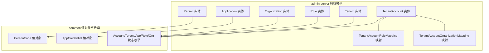
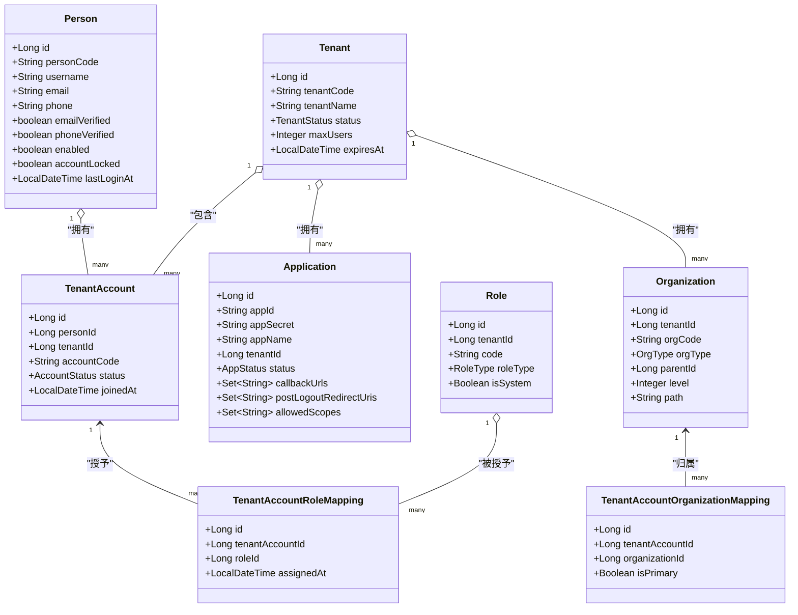
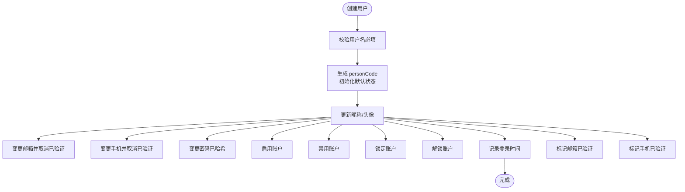
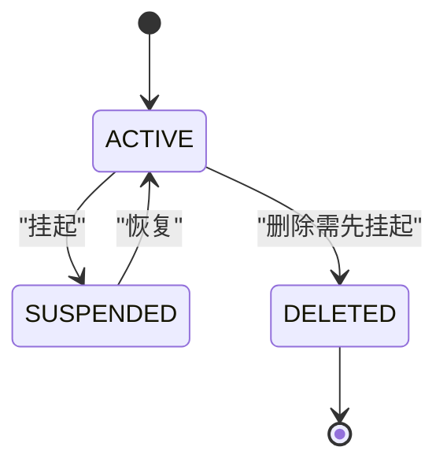
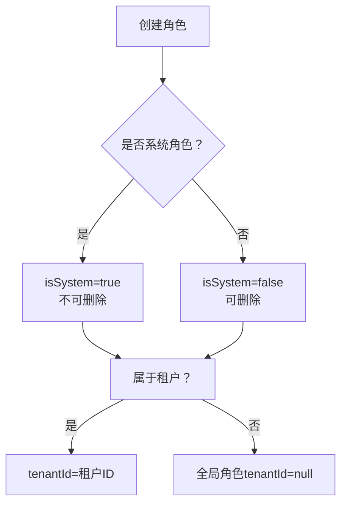
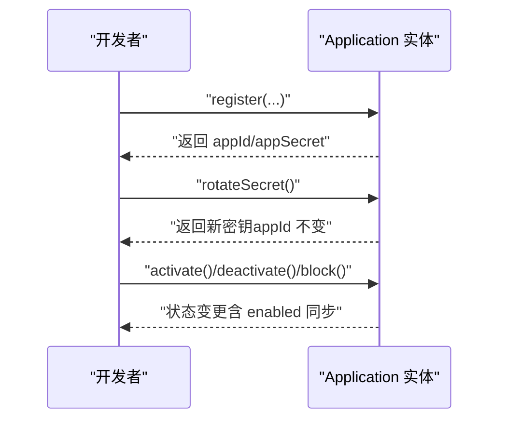
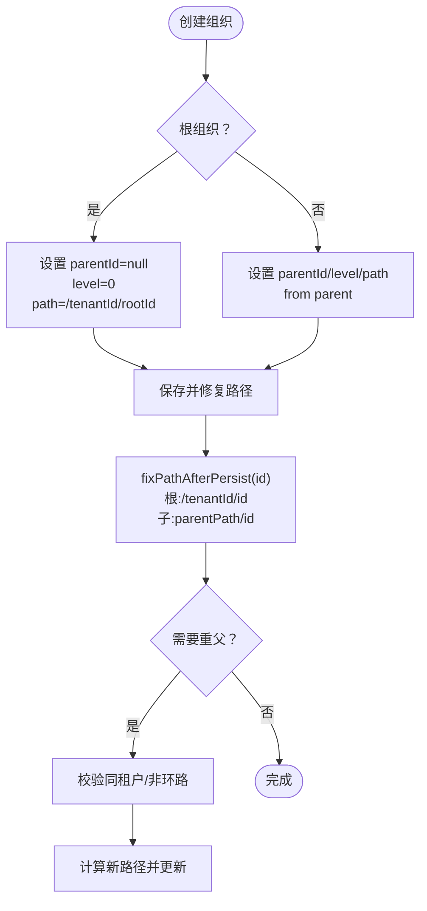
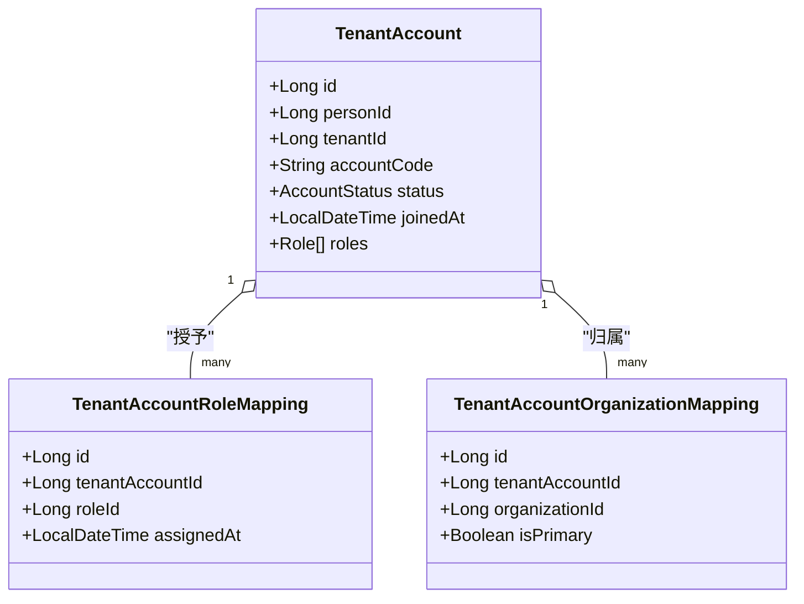
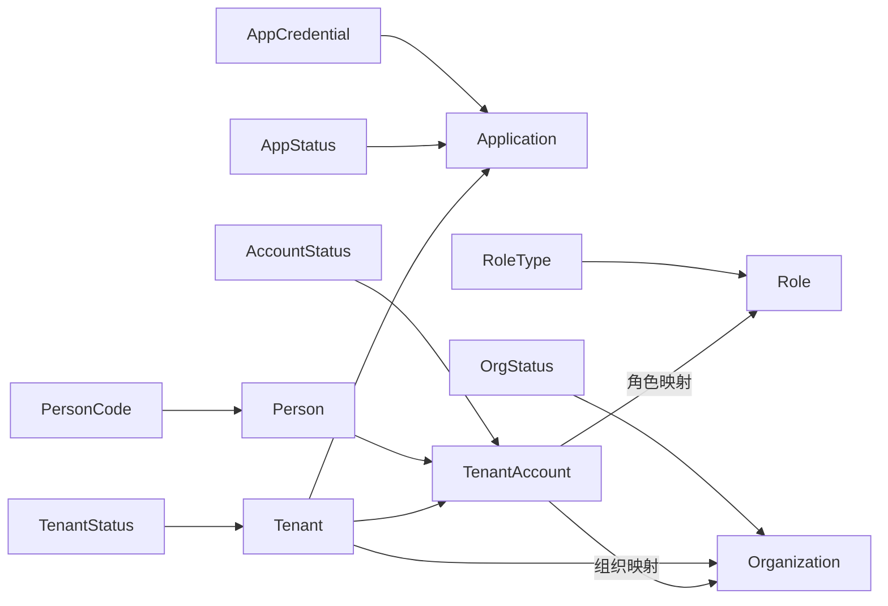

# 核心实体设计

<cite>
**本文引用的文件**
- [Person.java](file://iam-admin-server/src/main/java/iam/platform/admin/domain/model/entity/Person.java)
- [Tenant.java](file://iam-admin-server/src/main/java/iam/platform/admin/domain/model/entity/Tenant.java)
- [Role.java](file://iam-admin-server/src/main/java/iam/platform/admin/domain/model/entity/Role.java)
- [Application.java](file://iam-admin-server/src/main/java/iam/platform/admin/domain/model/entity/Application.java)
- [Organization.java](file://iam-admin-server/src/main/java/iam/platform/admin/domain/model/entity/Organization.java)
- [TenantAccount.java](file://iam-admin-server/src/main/java/iam/platform/admin/domain/model/entity/TenantAccount.java)
- [TenantAccountOrganizationMapping.java](file://iam-admin-server/src/main/java/iam/platform/admin/domain/model/entity/TenantAccountOrganizationMapping.java)
- [TenantAccountRoleMapping.java](file://iam-admin-server/src/main/java/iam/platform/admin/domain/model/entity/TenantAccountRoleMapping.java)
- [PersonCode.java](file://iam-common/src/main/java/iam/platform/common/model/valueobject/PersonCode.java)
- [AppCredential.java](file://iam-common/src/main/java/iam/platform/common/model/valueobject/AppCredential.java)
- [AccountStatus.java](file://iam-common/src/main/java/iam/platform/common/model/enums/AccountStatus.java)
- [TenantStatus.java](file://iam-common/src/main/java/iam/platform/common/model/enums/TenantStatus.java)
- [AppStatus.java](file://iam-common/src/main/java/iam/platform/common/model/enums/AppStatus.java)
- [RoleType.java](file://iam-common/src/main/java/iam/platform/common/model/enums/RoleType.java)
- [OrgStatus.java](file://iam-common/src/main/java/iam/platform/common/model/enums/OrgStatus.java)
</cite>

## 目录
1. [简介](#简介)
2. [项目结构](#项目结构)
3. [核心组件](#核心组件)
4. [架构总览](#架构总览)
5. [详细组件分析](#详细组件分析)
6. [依赖分析](#依赖分析)
7. [性能考量](#性能考量)
8. [故障排查指南](#故障排查指南)
9. [结论](#结论)
10. [附录](#附录)

## 简介
本文件系统性梳理 IAM 平台中最关键的业务实体设计，覆盖用户（Person）、租户（Tenant）、角色（Role）、应用（Application）、组织（Organization）及人员在租户中的账户（TenantAccount）与其映射关系（角色映射、组织映射）。重点阐述各实体的业务含义、唯一标识设计、状态管理与生命周期、字段约束与校验规则，并通过 ERD 图与类图展示实体间复杂关系，最后给出字段命名规范、索引策略与性能优化建议。

## 项目结构
围绕核心实体，代码采用“领域模型 + 值对象 + 枚举”的分层组织方式：
- 领域模型：位于 admin-server 的 domain/model/entity 下，承载业务行为与不变式。
- 值对象：位于 common/model/valueobject 下，封装强一致的标识与凭证。
- 枚举：位于 common/model/enums 下，统一状态与类型语义。

**图示来源**
- [Person.java:1-158](file://iam-admin-server/src/main/java/iam/platform/admin/domain/model/entity/Person.java#L1-L158)
- [Tenant.java:1-117](file://iam-admin-server/src/main/java/iam/platform/admin/domain/model/entity/Tenant.java#L1-L117)
- [Role.java:1-83](file://iam-admin-server/src/main/java/iam/platform/admin/domain/model/entity/Role.java#L1-L83)
- [Application.java:1-211](file://iam-admin-server/src/main/java/iam/platform/admin/domain/model/entity/Application.java#L1-L211)
- [Organization.java:1-217](file://iam-admin-server/src/main/java/iam/platform/admin/domain/model/entity/Organization.java#L1-L217)
- [TenantAccount.java:1-131](file://iam-admin-server/src/main/java/iam/platform/admin/domain/model/entity/TenantAccount.java#L1-L131)
- [TenantAccountRoleMapping.java:1-21](file://iam-admin-server/src/main/java/iam/platform/admin/domain/model/entity/TenantAccountRoleMapping.java#L1-L21)
- [TenantAccountOrganizationMapping.java:1-22](file://iam-admin-server/src/main/java/iam/platform/admin/domain/model/entity/TenantAccountOrganizationMapping.java#L1-L22)
- [PersonCode.java:1-51](file://iam-common/src/main/java/iam/platform/common/model/valueobject/PersonCode.java#L1-L51)
- [AppCredential.java:1-67](file://iam-common/src/main/java/iam/platform/common/model/valueobject/AppCredential.java#L1-L67)
- [AccountStatus.java:1-6](file://iam-common/src/main/java/iam/platform/common/model/enums/AccountStatus.java#L1-L6)
- [TenantStatus.java:1-6](file://iam-common/src/main/java/iam/platform/common/model/enums/TenantStatus.java#L1-L6)
- [AppStatus.java:1-6](file://iam-common/src/main/java/iam/platform/common/model/enums/AppStatus.java#L1-L6)
- [RoleType.java:1-7](file://iam-common/src/main/java/iam/platform/common/model/enums/RoleType.java#L1-L7)
- [OrgStatus.java:1-6](file://iam-common/src/main/java/iam/platform/common/model/enums/OrgStatus.java#L1-L6)

**章节来源**
- [Person.java:1-158](file://iam-admin-server/src/main/java/iam/platform/admin/domain/model/entity/Person.java#L1-L158)
- [Tenant.java:1-117](file://iam-admin-server/src/main/java/iam/platform/admin/domain/model/entity/Tenant.java#L1-L117)
- [Role.java:1-83](file://iam-admin-server/src/main/java/iam/platform/admin/domain/model/entity/Role.java#L1-L83)
- [Application.java:1-211](file://iam-admin-server/src/main/java/iam/platform/admin/domain/model/entity/Application.java#L1-L211)
- [Organization.java:1-217](file://iam-admin-server/src/main/java/iam/platform/admin/domain/model/entity/Organization.java#L1-L217)
- [TenantAccount.java:1-131](file://iam-admin-server/src/main/java/iam/platform/admin/domain/model/entity/TenantAccount.java#L1-L131)
- [TenantAccountRoleMapping.java:1-21](file://iam-admin-server/src/main/java/iam/platform/admin/domain/model/entity/TenantAccountRoleMapping.java#L1-L21)
- [TenantAccountOrganizationMapping.java:1-22](file://iam-admin-server/src/main/java/iam/platform/admin/domain/model/entity/TenantAccountOrganizationMapping.java#L1-L22)
- [PersonCode.java:1-51](file://iam-common/src/main/java/iam/platform/common/model/valueobject/PersonCode.java#L1-L51)
- [AppCredential.java:1-67](file://iam-common/src/main/java/iam/platform/common/model/valueobject/AppCredential.java#L1-L67)
- [AccountStatus.java:1-6](file://iam-common/src/main/java/iam/platform/common/model/enums/AccountStatus.java#L1-L6)
- [TenantStatus.java:1-6](file://iam-common/src/main/java/iam/platform/common/model/enums/TenantStatus.java#L1-L6)
- [AppStatus.java:1-6](file://iam-common/src/main/java/iam/platform/common/model/enums/AppStatus.java#L1-L6)
- [RoleType.java:1-7](file://iam-common/src/main/java/iam/platform/common/model/enums/RoleType.java#L1-L7)
- [OrgStatus.java:1-6](file://iam-common/src/main/java/iam/platform/common/model/enums/OrgStatus.java#L1-L6)

## 核心组件
本节从“业务含义、唯一标识、状态与生命周期、字段约束与校验”四个维度，逐项解析核心实体。

- Person（用户）
  - 业务含义：平台内真实用户主体，承载登录凭据、个人资料与账户状态。
  - 唯一标识：personCode（值对象），格式为固定前缀加 8 位大写字母数字组合；持久化主键为 Long id。
  - 状态与生命周期：启用/禁用、锁定/解锁、邮箱/手机已验证标记；记录最近登录时间。
  - 字段约束与校验：注册时用户名必填；更新资料、变更邮箱/手机、修改密码均进行非空校验；更新时间自动维护。
  - 关键行为：注册、更新资料、变更邮箱/手机/密码、启用/禁用、锁定/解锁、记录登录、标记已验证。
  
  **章节来源**
  - [Person.java:1-158](file://iam-admin-server/src/main/java/iam/platform/admin/domain/model/entity/Person.java#L1-L158)
  - [PersonCode.java:1-51](file://iam-common/src/main/java/iam/platform/common/model/valueobject/PersonCode.java#L1-L51)

- Tenant（租户）
  - 业务含义：多租户隔离的基本单位，代表一个客户或业务单元。
  - 唯一标识：tenantCode（业务编码）+ 持久化主键 id。
  - 状态与生命周期：ACTIVE/SUSPENDED/DELETED；激活需非已删除；仅 ACTIVE 可挂起；仅 ACTIVE 可删除（需先挂起）。
  - 字段约束与校验：租户名必填；默认最大用户数可为空则取默认值；到期时间可为空；更新信息支持部分字段。
  - 关键行为：创建、激活/挂起/删除、更新信息、查询是否活跃/是否过期。
  
  **章节来源**
  - [Tenant.java:1-117](file://iam-admin-server/src/main/java/iam/platform/admin/domain/model/entity/Tenant.java#L1-L117)
  - [TenantStatus.java:1-6](file://iam-common/src/main/java/iam/platform/common/model/enums/TenantStatus.java#L1-L6)

- Role（角色）
  - 业务含义：权限集合的抽象，分为系统内置与租户自定义两类。
  - 唯一标识：code（租户内唯一）+ 持久化主键 id。
  - 状态与生命周期：由实体属性表达，不单独建状态机；系统内置角色不可删除。
  - 字段约束与校验：code/name 必填；type 必填；系统角色标志可空则默认非系统角色；租户角色必须绑定 tenantId。
  - 关键行为：创建系统角色/租户角色、判断可删除性、是否系统角色/全局角色、是否属于某租户。
  
  **章节来源**
  - [Role.java:1-83](file://iam-admin-server/src/main/java/iam/platform/admin/domain/model/entity/Role.java#L1-L83)
  - [RoleType.java:1-7](file://iam-common/src/main/java/iam/platform/common/model/enums/RoleType.java#L1-L7)

- Application（应用）
  - 业务含义：接入认证系统的第三方应用，承载 OAuth2/oidc 配置。
  - 唯一标识：appId（值对象）+ 持久化主键 id；应用密钥 appSecret 不直接暴露。
  - 状态与生命周期：ACTIVE/INACTIVE/REVIEWING/BLOCKED；激活需非 BLOCKED；仅 ACTIVE 可停用；BLOCKED 不可激活。
  - 字段约束与校验：应用名必填；令牌有效期设置必填；回调地址、登出回调、允许作用域以集合形式存储；支持 PKCE 与授权同意。
  - 关键行为：注册（生成凭据与默认配置）、轮换密钥、激活/停用/封禁、更新元数据/OAuth 设置/令牌 TTL、查询状态。
  
  **章节来源**
  - [Application.java:1-211](file://iam-admin-server/src/main/java/iam/platform/admin/domain/model/entity/Application.java#L1-L211)
  - [AppCredential.java:1-67](file://iam-common/src/main/java/iam/platform/common/model/valueobject/AppCredential.java#L1-L67)
  - [AppStatus.java:1-6](file://iam-common/src/main/java/iam/platform/common/model/enums/AppStatus.java#L1-L6)

- Organization（组织）
  - 业务含义：组织架构树，支持层级父子关系与路径编码，用于权限归属与可见性控制。
  - 唯一标识：orgCode（租户内唯一）+ 持久化主键 id。
  - 状态与生命周期：ACTIVE/INACTIVE；支持激活/停用。
  - 字段约束与校验：根组织无父节点；子组织必须与父组织同租户；路径 path 在持久化后修正为“/tenantId/id”或“parentPath/id”；禁止环路移动到后代。
  - 关键行为：创建根/子组织、修复路径（持久化后）、重父（reparent）、激活/停用、更新信息、判断是否根节点/是否某组织祖先。
  
  **章节来源**
  - [Organization.java:1-217](file://iam-admin-server/src/main/java/iam/platform/admin/domain/model/entity/Organization.java#L1-L217)
  - [OrgStatus.java:1-6](file://iam-common/src/main/java/iam/platform/common/model/enums/OrgStatus.java#L1-L6)

- TenantAccount（租户账户）
  - 业务含义：Person 在特定 Tenant 中的实例化账户，承载加入时间、状态、偏好设置与延迟加载的角色列表。
  - 唯一标识：accountCode（租户内唯一）+ 持久化主键 id。
  - 状态与生命周期：ACTIVE/SUSPENDED/LEFT；仅 ACTIVE 可挂起；仅 SUSPENDED 可恢复；LEFT 不可逆。
  - 字段约束与校验：personId、tenantId、accountCode 必填；默认语言与时区预设；加入时间为创建时赋值。
  - 关键行为：创建、挂起/恢复/离职、更新偏好/工号、查询状态。
  
  **章节来源**
  - [TenantAccount.java:1-131](file://iam-admin-server/src/main/java/iam/platform/admin/domain/model/entity/TenantAccount.java#L1-L131)
  - [AccountStatus.java:1-6](file://iam-common/src/main/java/iam/platform/common/model/enums/AccountStatus.java#L1-L6)

- TenantAccountOrganizationMapping（租户账户-组织映射）
  - 业务含义：人员在组织内的归属映射，支持主属岗位与加入组织时间等扩展信息。
  - 唯一标识：id + (tenantAccountId, organizationId) 组合键（逻辑唯一性）。
  - 字段约束与校验：tenantAccountId、organizationId 必填；isPrimary 表示主属；position 记录岗位名称；joinedOrgAt 记录加入时间。
  
  **章节来源**
  - [TenantAccountOrganizationMapping.java:1-22](file://iam-admin-server/src/main/java/iam/platform/admin/domain/model/entity/TenantAccountOrganizationMapping.java#L1-L22)

- TenantAccountRoleMapping（租户账户-角色映射）
  - 业务含义：人员在租户内被授予的角色映射，记录授予时间与授予人。
  - 唯一标识：id + (tenantAccountId, roleId) 组合键（逻辑唯一性）。
  - 字段约束与校验：tenantAccountId、roleId 必填；assignedAt 记录授予时间；assignedBy 记录授予人。
  
  **章节来源**
  - [TenantAccountRoleMapping.java:1-21](file://iam-admin-server/src/main/java/iam/platform/admin/domain/model/entity/TenantAccountRoleMapping.java#L1-L21)

## 架构总览
下图展示核心实体与映射关系的整体架构，体现“用户—租户账户—角色/组织”的多对多映射设计与状态约束。

**图示来源**
- [Person.java:1-158](file://iam-admin-server/src/main/java/iam/platform/admin/domain/model/entity/Person.java#L1-L158)
- [Tenant.java:1-117](file://iam-admin-server/src/main/java/iam/platform/admin/domain/model/entity/Tenant.java#L1-L117)
- [Role.java:1-83](file://iam-admin-server/src/main/java/iam/platform/admin/domain/model/entity/Role.java#L1-L83)
- [Application.java:1-211](file://iam-admin-server/src/main/java/iam/platform/admin/domain/model/entity/Application.java#L1-L211)
- [Organization.java:1-217](file://iam-admin-server/src/main/java/iam/platform/admin/domain/model/entity/Organization.java#L1-L217)
- [TenantAccount.java:1-131](file://iam-admin-server/src/main/java/iam/platform/admin/domain/model/entity/TenantAccount.java#L1-L131)
- [TenantAccountRoleMapping.java:1-21](file://iam-admin-server/src/main/java/iam/platform/admin/domain/model/entity/TenantAccountRoleMapping.java#L1-L21)
- [TenantAccountOrganizationMapping.java:1-22](file://iam-admin-server/src/main/java/iam/platform/admin/domain/model/entity/TenantAccountOrganizationMapping.java#L1-L22)

## 详细组件分析

### Person（用户）实体
- 设计要点
  - 使用值对象 PersonCode 保证全局唯一且格式受控。
  - 密码以哈希形式存储，避免明文泄露风险。
  - 账户状态（启用/锁定）与验证状态（邮箱/手机）分离，便于审计与合规。
- 生命周期流程

**图示来源**
- [Person.java:36-156](file://iam-admin-server/src/main/java/iam/platform/admin/domain/model/entity/Person.java#L36-L156)
- [PersonCode.java:27-44](file://iam-common/src/main/java/iam/platform/common/model/valueobject/PersonCode.java#L27-L44)

**章节来源**
- [Person.java:1-158](file://iam-admin-server/src/main/java/iam/platform/admin/domain/model/entity/Person.java#L1-L158)
- [PersonCode.java:1-51](file://iam-common/src/main/java/iam/platform/common/model/valueobject/PersonCode.java#L1-L51)

### Tenant（租户）实体
- 设计要点
  - 通过状态机约束生命周期：仅 ACTIVE 可挂起；仅 ACTIVE 可删除（需先挂起）；BLOCKED 不可激活。
  - 默认最大用户数与到期时间可空，便于灵活配置。
- 生命周期流程

**图示来源**
- [Tenant.java:52-80](file://iam-admin-server/src/main/java/iam/platform/admin/domain/model/entity/Tenant.java#L52-L80)
- [TenantStatus.java:1-6](file://iam-common/src/main/java/iam/platform/common/model/enums/TenantStatus.java#L1-L6)

**章节来源**
- [Tenant.java:1-117](file://iam-admin-server/src/main/java/iam/platform/admin/domain/model/entity/Tenant.java#L1-L117)
- [TenantStatus.java:1-6](file://iam-common/src/main/java/iam/platform/common/model/enums/TenantStatus.java#L1-L6)

### Role（角色）实体
- 设计要点
  - 支持 SYSTEM 与 TENANT_CUSTOM 两类角色；系统内置角色不可删除。
  - 全局角色 tenantId 为空，租户角色必须绑定租户。
- 角色类型与可删除性判定

**图示来源**
- [Role.java:29-81](file://iam-admin-server/src/main/java/iam/platform/admin/domain/model/entity/Role.java#L29-L81)
- [RoleType.java:1-7](file://iam-common/src/main/java/iam/platform/common/model/enums/RoleType.java#L1-L7)

**章节来源**
- [Role.java:1-83](file://iam-admin-server/src/main/java/iam/platform/admin/domain/model/entity/Role.java#L1-L83)
- [RoleType.java:1-7](file://iam-common/src/main/java/iam/platform/common/model/enums/RoleType.java#L1-L7)

### Application（应用）实体
- 设计要点
  - 凭证使用值对象 AppCredential，支持轮换密钥而不改变 appId。
  - OAuth2 设置以集合存储，便于扩展与治理。
  - 状态机约束激活/停用/封禁的先后顺序。
- 应用生命周期序列

**图示来源**
- [Application.java:45-125](file://iam-admin-server/src/main/java/iam/platform/admin/domain/model/entity/Application.java#L45-L125)
- [AppCredential.java:26-60](file://iam-common/src/main/java/iam/platform/common/model/valueobject/AppCredential.java#L26-L60)
- [AppStatus.java:1-6](file://iam-common/src/main/java/iam/platform/common/model/enums/AppStatus.java#L1-L6)

**章节来源**
- [Application.java:1-211](file://iam-admin-server/src/main/java/iam/platform/admin/domain/model/entity/Application.java#L1-L211)
- [AppCredential.java:1-67](file://iam-common/src/main/java/iam/platform/common/model/valueobject/AppCredential.java#L1-L67)
- [AppStatus.java:1-6](file://iam-common/src/main/java/iam/platform/common/model/enums/AppStatus.java#L1-L6)

### Organization（组织）实体
- 设计要点
  - 使用路径编码（OrganizationPath）构建层级关系，支持快速祖先/后代判断。
  - 持久化后修复路径，确保路径包含真实 id。
  - 重父（reparent）时校验租户一致性与禁止环路。
- 组织树操作流程

**图示来源**
- [Organization.java:38-135](file://iam-admin-server/src/main/java/iam/platform/admin/domain/model/entity/Organization.java#L38-L135)

**章节来源**
- [Organization.java:1-217](file://iam-admin-server/src/main/java/iam/platform/admin/domain/model/entity/Organization.java#L1-L217)

### TenantAccount（租户账户）与映射
- 设计要点
  - 一对一关联 Person 与 Tenant，形成“人员在租户中的实例化账户”。
  - 角色映射与组织映射均为多对多的弱耦合连接表，支持延迟加载角色列表。
  - 默认语言与时区预设，减少重复配置。
- 多对多关系与状态机

**图示来源**
- [TenantAccount.java:1-131](file://iam-admin-server/src/main/java/iam/platform/admin/domain/model/entity/TenantAccount.java#L1-L131)
- [TenantAccountRoleMapping.java:1-21](file://iam-admin-server/src/main/java/iam/platform/admin/domain/model/entity/TenantAccountRoleMapping.java#L1-L21)
- [TenantAccountOrganizationMapping.java:1-22](file://iam-admin-server/src/main/java/iam/platform/admin/domain/model/entity/TenantAccountOrganizationMapping.java#L1-L22)
- [AccountStatus.java:1-6](file://iam-common/src/main/java/iam/platform/common/model/enums/AccountStatus.java#L1-L6)

**章节来源**
- [TenantAccount.java:1-131](file://iam-admin-server/src/main/java/iam/platform/admin/domain/model/entity/TenantAccount.java#L1-L131)
- [TenantAccountRoleMapping.java:1-21](file://iam-admin-server/src/main/java/iam/platform/admin/domain/model/entity/TenantAccountRoleMapping.java#L1-L21)
- [TenantAccountOrganizationMapping.java:1-22](file://iam-admin-server/src/main/java/iam/platform/admin/domain/model/entity/TenantAccountOrganizationMapping.java#L1-L22)
- [AccountStatus.java:1-6](file://iam-common/src/main/java/iam/platform/common/model/enums/AccountStatus.java#L1-L6)

## 依赖分析
- 值对象与枚举
  - PersonCode：用于 Person 的唯一标识，格式严格校验。
  - AppCredential：用于 Application 的凭据生成与轮换。
  - 状态枚举：AccountStatus、TenantStatus、AppStatus、RoleType、OrgStatus 提供统一语义。
- 实体间依赖
  - TenantAccount 强依赖 Person 与 Tenant。
  - Organization 强依赖 Tenant。
  - Application 强依赖 Tenant。
  - 角色与组织映射通过外键连接到 TenantAccount，形成多对多关系。
- 循环依赖
  - 当前设计未见循环依赖；映射表仅持有外键，避免双向导航导致的环。

**图示来源**
- [PersonCode.java:1-51](file://iam-common/src/main/java/iam/platform/common/model/valueobject/PersonCode.java#L1-L51)
- [AppCredential.java:1-67](file://iam-common/src/main/java/iam/platform/common/model/valueobject/AppCredential.java#L1-L67)
- [AccountStatus.java:1-6](file://iam-common/src/main/java/iam/platform/common/model/enums/AccountStatus.java#L1-L6)
- [TenantStatus.java:1-6](file://iam-common/src/main/java/iam/platform/common/model/enums/TenantStatus.java#L1-L6)
- [RoleType.java:1-7](file://iam-common/src/main/java/iam/platform/common/model/enums/RoleType.java#L1-L7)
- [OrgStatus.java:1-6](file://iam-common/src/main/java/iam/platform/common/model/enums/OrgStatus.java#L1-L6)
- [Person.java:1-158](file://iam-admin-server/src/main/java/iam/platform/admin/domain/model/entity/Person.java#L1-L158)
- [Tenant.java:1-117](file://iam-admin-server/src/main/java/iam/platform/admin/domain/model/entity/Tenant.java#L1-L117)
- [Role.java:1-83](file://iam-admin-server/src/main/java/iam/platform/admin/domain/model/entity/Role.java#L1-L83)
- [Application.java:1-211](file://iam-admin-server/src/main/java/iam/platform/admin/domain/model/entity/Application.java#L1-L211)
- [Organization.java:1-217](file://iam-admin-server/src/main/java/iam/platform/admin/domain/model/entity/Organization.java#L1-L217)
- [TenantAccount.java:1-131](file://iam-admin-server/src/main/java/iam/platform/admin/domain/model/entity/TenantAccount.java#L1-L131)
- [TenantAccountRoleMapping.java:1-21](file://iam-admin-server/src/main/java/iam/platform/admin/domain/model/entity/TenantAccountRoleMapping.java#L1-L21)
- [TenantAccountOrganizationMapping.java:1-22](file://iam-admin-server/src/main/java/iam/platform/admin/domain/model/entity/TenantAccountOrganizationMapping.java#L1-L22)

**章节来源**
- [PersonCode.java:1-51](file://iam-common/src/main/java/iam/platform/common/model/valueobject/PersonCode.java#L1-L51)
- [AppCredential.java:1-67](file://iam-common/src/main/java/iam/platform/common/model/valueobject/AppCredential.java#L1-L67)
- [AccountStatus.java:1-6](file://iam-common/src/main/java/iam/platform/common/model/enums/AccountStatus.java#L1-L6)
- [TenantStatus.java:1-6](file://iam-common/src/main/java/iam/platform/common/model/enums/TenantStatus.java#L1-L6)
- [RoleType.java:1-7](file://iam-common/src/main/java/iam/platform/common/model/enums/RoleType.java#L1-L7)
- [OrgStatus.java:1-6](file://iam-common/src/main/java/iam/platform/common/model/enums/OrgStatus.java#L1-L6)
- [Person.java:1-158](file://iam-admin-server/src/main/java/iam/platform/admin/domain/model/entity/Person.java#L1-L158)
- [Tenant.java:1-117](file://iam-admin-server/src/main/java/iam/platform/admin/domain/model/entity/Tenant.java#L1-L117)
- [Role.java:1-83](file://iam-admin-server/src/main/java/iam/platform/admin/domain/model/entity/Role.java#L1-L83)
- [Application.java:1-211](file://iam-admin-server/src/main/java/iam/platform/admin/domain/model/entity/Application.java#L1-L211)
- [Organization.java:1-217](file://iam-admin-server/src/main/java/iam/platform/admin/domain/model/entity/Organization.java#L1-L217)
- [TenantAccount.java:1-131](file://iam-admin-server/src/main/java/iam/platform/admin/domain/model/entity/TenantAccount.java#L1-L131)
- [TenantAccountRoleMapping.java:1-21](file://iam-admin-server/src/main/java/iam/platform/admin/domain/model/entity/TenantAccountRoleMapping.java#L1-L21)
- [TenantAccountOrganizationMapping.java:1-22](file://iam-admin-server/src/main/java/iam/platform/admin/domain/model/entity/TenantAccountOrganizationMapping.java#L1-L22)

## 性能考量
- 字段命名规范
  - 主键统一使用 id；业务编码统一使用 Code 结尾（如 personCode、tenantCode、orgCode）。
  - 时间戳统一使用 createdAt/updatedAt；加入/离开时间使用 joinedAt/leftAt。
- 索引策略
  - 唯一性索引：personCode（用户）、tenantCode（租户）、orgCode（组织）、accountCode（租户账户）、appId（应用）。
  - 外键索引：tenantId、personId、roleId、organizationId、applicationId。
  - 范围/过滤索引：expiresAt（租户到期）、lastLoginAt（用户登录）、assignedAt（角色授予时间）。
- 查询优化
  - 角色列表采用延迟加载（transient List<Role>），按需加载，降低热路径开销。
  - 组织路径基于字符串前缀匹配，结合路径长度与排序字段提升层级查询效率。
- 缓存与一致性
  - 应用凭据轮换后立即失效旧密钥，避免缓存命中导致的安全问题。
  - 租户状态变更同步影响应用与账户的 enabled 字段，确保查询一致性。

## 故障排查指南
- 常见错误与定位
  - 用户注册失败：检查用户名是否为空；确认 PersonCode 生成与校验逻辑。
  - 租户状态异常：确认当前状态是否满足激活/挂起/删除前置条件。
  - 应用无法激活：检查是否处于 BLOCKED 状态；仅 ACTIVE 可停用。
  - 组织重父失败：检查是否移动到自身后代；确认与目标父节点同租户。
  - 租户账户状态异常：仅 ACTIVE 可挂起；仅 SUSPENDED 可恢复；LEFT 不可逆。
- 排查步骤
  - 核对实体状态机前置条件与 Guard 抛错信息。
  - 检查映射表是否存在重复或缺失记录（如角色/组织映射）。
  - 对关键字段（code、appId、tenantCode）执行唯一性校验。
  - 审计日志：关注 updatedAt 与关键状态变更时间点。

**章节来源**
- [Person.java:36-156](file://iam-admin-server/src/main/java/iam/platform/admin/domain/model/entity/Person.java#L36-L156)
- [Tenant.java:52-80](file://iam-admin-server/src/main/java/iam/platform/admin/domain/model/entity/Tenant.java#L52-L80)
- [Application.java:96-125](file://iam-admin-server/src/main/java/iam/platform/admin/domain/model/entity/Application.java#L96-L125)
- [Organization.java:120-135](file://iam-admin-server/src/main/java/iam/platform/admin/domain/model/entity/Organization.java#L120-L135)
- [TenantAccount.java:62-91](file://iam-admin-server/src/main/java/iam/platform/admin/domain/model/entity/TenantAccount.java#L62-L91)

## 结论
本设计以“值对象 + 枚举 + 明确状态机 + 清晰映射”为核心，确保了身份与权限体系在多租户场景下的可扩展性与可维护性。通过严格的字段约束与生命周期管理，有效降低了业务风险；通过延迟加载与合理的索引策略，兼顾了性能与可用性。建议在后续版本中持续完善审计日志与监控告警，进一步增强可观测性。

## 附录
- 最佳实践清单
  - 唯一标识：优先使用值对象（PersonCode、AppCredential）生成与校验。
  - 状态机：所有跨状态转换均需前置校验，避免非法状态。
  - 映射设计：多对多通过独立映射表承载，支持扩展字段与延迟加载。
  - 索引策略：围绕业务高频查询字段建立唯一/范围/过滤索引。
  - 数据安全：敏感字段（如密码哈希、密钥）仅在必要时暴露，轮换后立即失效旧值。