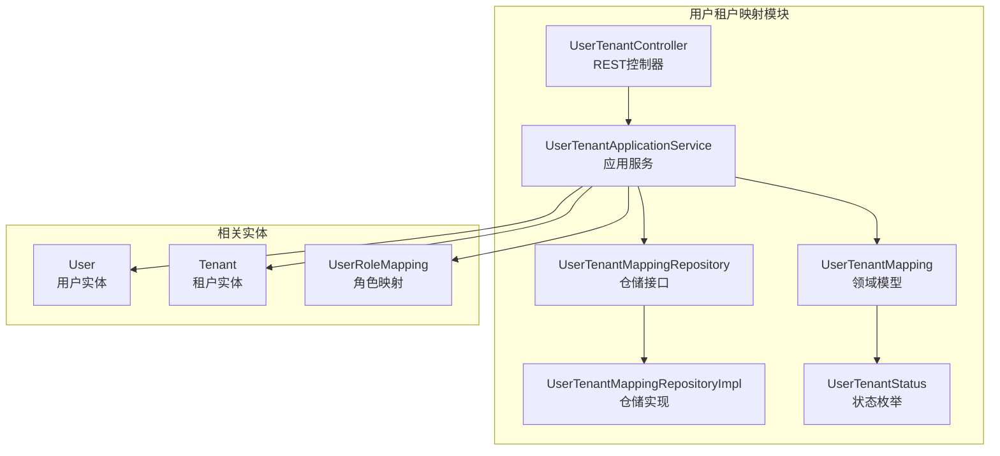
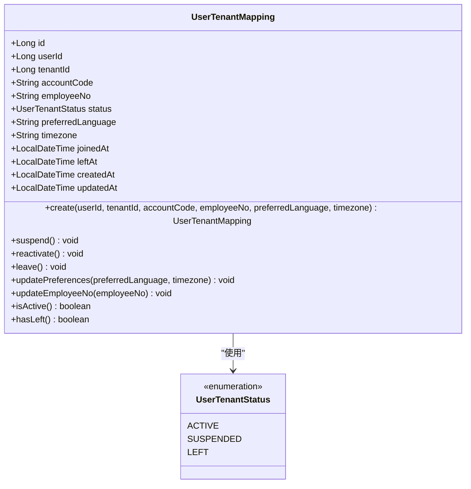
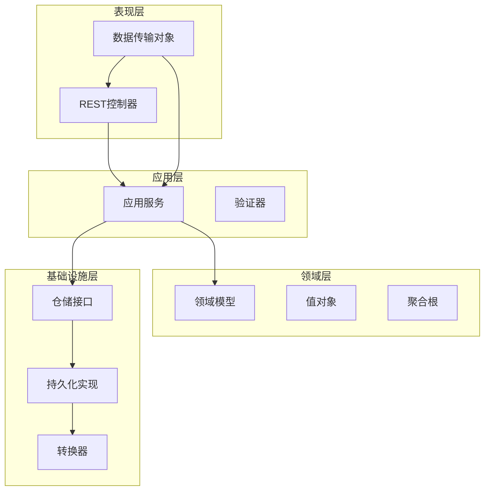
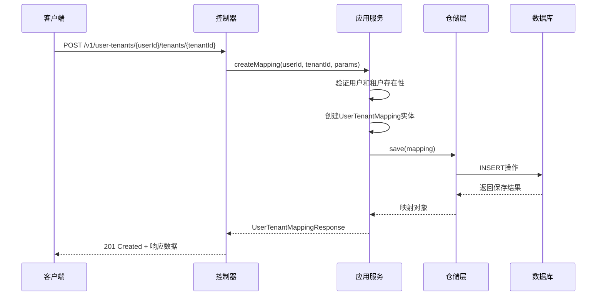
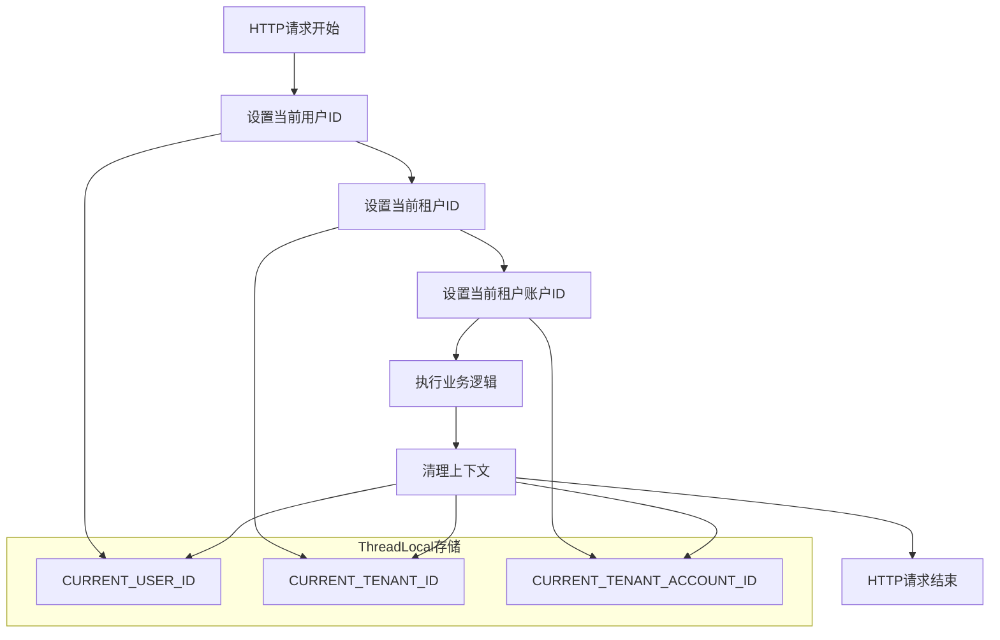
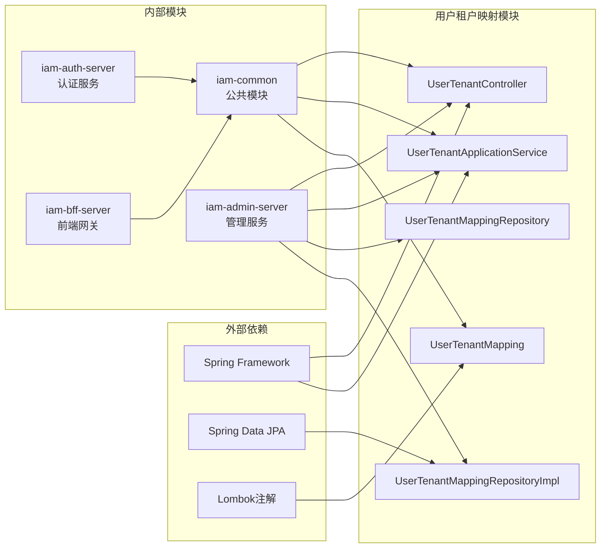
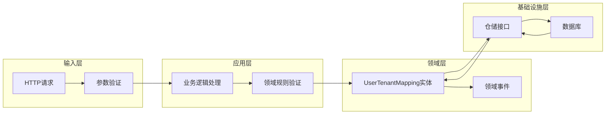

# 用户租户映射

<cite>
**本文档引用的文件**
- [UserTenantMapping.java](file://iam-admin-server/src/main/java/iam/platform/admin/domain/model/entity/UserTenantMapping.java)
- [UserTenantMappingRepository.java](file://iam-admin-server/src/main/java/iam/platform/admin/domain/repository/UserTenantMappingRepository.java)
- [UserTenantApplicationService.java](file://iam-admin-server/src/main/java/iam/platform/admin/application/service/UserTenantApplicationService.java)
- [UserTenantController.java](file://iam-admin-server/src/main/java/iam/platform/admin/interfaces/rest/UserTenantController.java)
- [UserTenantMappingRepositoryImpl.java](file://iam-admin-server/src/main/java/iam/platform/admin/infrastructure/persistence/impl/UserTenantMappingRepositoryImpl.java)
- [UserTenantStatus.java](file://iam-common/src/main/java/iam/platform/common/model/enums/UserTenantStatus.java)
- [UserRoleMapping.java](file://iam-admin-server/src/main/java/iam/platform/admin/domain/model/entity/UserRoleMapping.java)
- [UserRoleMappingRepository.java](file://iam-admin-server/src/main/java/iam/platform/admin/domain/repository/UserRoleMappingRepository.java)
- [TenantContext.java](file://iam-admin-server/src/main/java/iam/platform/admin/infrastructure/security/TenantContext.java)
- [Tenant.java](file://iam-admin-server/src/main/java/iam/platform/admin/domain/model/entity/Tenant.java)
- [TenantRepository.java](file://iam-admin-server/src/main/java/iam/platform/admin/domain/repository/TenantRepository.java)
- [UserRepository.java](file://iam-admin-server/src/main/java/iam/platform/admin/domain/repository/UserRepository.java)
</cite>

## 目录
1. [简介](#简介)
2. [项目结构](#项目结构)
3. [核心组件](#核心组件)
4. [架构概览](#架构概览)
5. [详细组件分析](#详细组件分析)
6. [依赖关系分析](#依赖关系分析)
7. [性能考虑](#性能考虑)
8. [故障排除指南](#故障排除指南)
9. [结论](#结论)

## 简介

用户租户映射是IAM（身份和访问管理）平台中的核心功能模块，负责管理用户与租户之间的关联关系。该系统实现了多租户架构中的用户权限控制，确保用户只能访问其被授权的租户资源。

本系统采用分层架构设计，包含领域模型、应用服务、接口层和基础设施层，通过清晰的职责分离实现了用户租户映射的完整生命周期管理。

## 项目结构

IAM平台采用微服务架构，用户租户映射功能主要集中在iam-admin-server模块中：



**图表来源**
- [UserTenantController.java:1-100](file://iam-admin-server/src/main/java/iam/platform/admin/interfaces/rest/UserTenantController.java#L1-L100)
- [UserTenantApplicationService.java:1-146](file://iam-admin-server/src/main/java/iam/platform/admin/application/service/UserTenantApplicationService.java#L1-L146)
- [UserTenantMapping.java:1-123](file://iam-admin-server/src/main/java/iam/platform/admin/domain/model/entity/UserTenantMapping.java#L1-L123)

**章节来源**
- [UserTenantController.java:1-100](file://iam-admin-server/src/main/java/iam/platform/admin/interfaces/rest/UserTenantController.java#L1-L100)
- [UserTenantApplicationService.java:1-146](file://iam-admin-server/src/main/java/iam/platform/admin/application/service/UserTenantApplicationService.java#L1-L146)

## 核心组件

### 用户租户映射实体

UserTenantMapping是系统的核心领域模型，代表用户与租户之间的直接关联关系：



**图表来源**
- [UserTenantMapping.java:1-123](file://iam-admin-server/src/main/java/iam/platform/admin/domain/model/entity/UserTenantMapping.java#L1-L123)
- [UserTenantStatus.java:1-11](file://iam-common/src/main/java/iam/platform/common/model/enums/UserTenantStatus.java#L1-L11)

### 应用服务层

UserTenantApplicationService提供了完整的用户租户映射业务逻辑：

| 方法 | 功能描述 | 事务性 |
|------|----------|--------|
| createMapping | 创建用户租户映射关系 | 是 |
| getMapping | 获取映射详情 | 否 |
| getByUserId | 查询用户的所有租户映射 | 否 |
| getByTenantId | 分页查询租户的用户映射 | 否 |
| suspendMapping | 暂停映射关系 | 是 |
| reactivateMapping | 重新激活映射关系 | 是 |
| leaveTenant | 用户离开租户 | 是 |
| assignRole | 分配角色给用户 | 是 |
| revokeRole | 撤销用户角色 | 是 |

**章节来源**
- [UserTenantApplicationService.java:1-146](file://iam-admin-server/src/main/java/iam/platform/admin/application/service/UserTenantApplicationService.java#L1-L146)

## 架构概览

系统采用经典的四层架构模式，实现了清晰的关注点分离：



**图表来源**
- [UserTenantController.java:1-100](file://iam-admin-server/src/main/java/iam/platform/admin/interfaces/rest/UserTenantController.java#L1-L100)
- [UserTenantApplicationService.java:1-146](file://iam-admin-server/src/main/java/iam/platform/admin/application/service/UserTenantApplicationService.java#L1-L146)
- [UserTenantMappingRepositoryImpl.java:1-75](file://iam-admin-server/src/main/java/iam/platform/admin/infrastructure/persistence/impl/UserTenantMappingRepositoryImpl.java#L1-L75)

## 详细组件分析

### REST API接口

UserTenantController提供了完整的用户租户映射管理接口：



**图表来源**
- [UserTenantController.java:24-32](file://iam-admin-server/src/main/java/iam/platform/admin/interfaces/rest/UserTenantController.java#L24-L32)
- [UserTenantApplicationService.java:32-47](file://iam-admin-server/src/main/java/iam/platform/admin/application/service/UserTenantApplicationService.java#L32-L47)

### 租户上下文管理

TenantContext提供线程本地存储，维护当前请求的租户上下文信息：



**图表来源**
- [TenantContext.java:1-45](file://iam-admin-server/src/main/java/iam/platform/admin/infrastructure/security/TenantContext.java#L1-L45)

**章节来源**
- [UserTenantController.java:1-100](file://iam-admin-server/src/main/java/iam/platform/admin/interfaces/rest/UserTenantController.java#L1-L100)
- [UserTenantApplicationService.java:1-146](file://iam-admin-server/src/main/java/iam/platform/admin/application/service/UserTenantApplicationService.java#L1-L146)
- [TenantContext.java:1-45](file://iam-admin-server/src/main/java/iam/platform/admin/infrastructure/security/TenantContext.java#L1-L45)

## 依赖关系分析

系统各层之间的依赖关系清晰明确：



**图表来源**
- [UserTenantMapping.java:1-123](file://iam-admin-server/src/main/java/iam/platform/admin/domain/model/entity/UserTenantMapping.java#L1-L123)
- [UserTenantApplicationService.java:1-146](file://iam-admin-server/src/main/java/iam/platform/admin/application/service/UserTenantApplicationService.java#L1-L146)

### 数据流分析

用户租户映射的数据流遵循标准的DDD（领域驱动设计）模式：



**图表来源**
- [UserTenantApplicationService.java:32-47](file://iam-admin-server/src/main/java/iam/platform/admin/application/service/UserTenantApplicationService.java#L32-L47)
- [UserTenantMappingRepositoryImpl.java:24-29](file://iam-admin-server/src/main/java/iam/platform/admin/infrastructure/persistence/impl/UserTenantMappingRepositoryImpl.java#L24-L29)

**章节来源**
- [UserTenantMappingRepository.java:1-29](file://iam-admin-server/src/main/java/iam/platform/admin/domain/repository/UserTenantMappingRepository.java#L1-L29)
- [UserTenantMappingRepositoryImpl.java:1-75](file://iam-admin-server/src/main/java/iam/platform/admin/infrastructure/persistence/impl/UserTenantMappingRepositoryImpl.java#L1-L75)

## 性能考虑

### 查询优化策略

1. **索引设计**
   - userId和tenantId组合索引用于快速查找用户的所有租户映射
   - tenantId单独索引支持租户维度的分页查询
   - 复合索引优化常用查询模式

2. **分页查询**
   - 使用Spring Data的Pageable接口实现高效分页
   - 限制默认页面大小防止内存溢出
   - 提供count查询优化分页性能

3. **缓存策略**
   - 对频繁访问的用户租户映射进行缓存
   - 利用租户上下文减少重复查询
   - 实现适当的缓存失效机制

### 事务管理

系统采用声明式事务管理，确保数据一致性：

- 所有写操作（创建、更新、删除）都在事务中执行
- 读操作默认不开启事务，提高查询性能
- 事务边界清晰，避免长事务阻塞

## 故障排除指南

### 常见问题及解决方案

| 问题类型 | 症状 | 可能原因 | 解决方案 |
|----------|------|----------|----------|
| 用户不存在 | 抛出UserNotFoundException | 用户ID无效或不存在 | 验证用户存在性，检查用户状态 |
| 租户不存在 | 抛出TenantNotFoundException | 租户ID无效或不存在 | 验证租户存在性，检查租户状态 |
| 映射已存在 | 抛出RuntimeException | 用户已在目标租户中 | 检查现有映射，使用唯一约束 |
| 权限不足 | 访问被拒绝 | 缺少必要的权限 | 检查用户角色和权限分配 |
| 并发冲突 | 事务回滚 | 多个请求同时修改同一记录 | 实现乐观锁或重试机制 |

### 调试建议

1. **启用详细日志**
   ```properties
   logging.level.iam.platform.admin=DEBUG
   logging.level.org.springframework.data=DEBUG
   ```

2. **监控指标**
   - 请求响应时间
   - 数据库连接池使用率
   - 缓存命中率
   - 错误率统计

3. **性能分析**
   - 使用APM工具监控慢查询
   - 分析事务执行时间
   - 监控内存使用情况

**章节来源**
- [UserTenantApplicationService.java:35-40](file://iam-admin-server/src/main/java/iam/platform/admin/application/service/UserTenantApplicationService.java#L35-L40)
- [UserTenantApplicationService.java:69-75](file://iam-admin-server/src/main/java/iam/platform/admin/application/service/UserTenantApplicationService.java#L69-L75)

## 结论

用户租户映射系统通过清晰的分层架构和DDD设计原则，成功实现了多租户环境下的用户权限管理。系统具有以下特点：

1. **架构清晰**：四层架构设计明确了各层职责，便于维护和扩展
2. **功能完整**：覆盖了用户租户映射的全生命周期管理
3. **性能优化**：通过合理的索引设计和分页查询提升性能
4. **安全保障**：完善的权限控制和审计机制确保系统安全

该系统为IAM平台的多租户功能奠定了坚实基础，支持企业级应用的身份管理和访问控制需求。