# 用户角色映射

<cite>
**本文档引用的文件**
- [User.java](file://iam-admin-server/src/main/java/iam/platform/admin/domain/model/entity/User.java)
- [Role.java](file://iam-admin-server/src/main/java/iam/platform/admin/domain/model/entity/Role.java)
- [UserRoleMapping.java](file://iam-admin-server/src/main/java/iam/platform/admin/domain/model/entity/UserRoleMapping.java)
- [TenantAccountRoleMapping.java](file://iam-admin-server/src/main/java/iam/platform/admin/domain/model/entity/TenantAccountRoleMapping.java)
- [RoleApplicationService.java](file://iam-admin-server/src/main/java/iam/platform/admin/application/service/RoleApplicationService.java)
- [UserApplicationService.java](file://iam-admin-server/src/main/java/iam/platform/admin/application/service/UserApplicationService.java)
- [TenantAccountRoleApplicationService.java](file://iam-admin-server/src/main/java/iam/platform/admin/application/service/TenantAccountRoleApplicationService.java)
- [TenantAccountApplicationService.java](file://iam-admin-server/src/main/java/iam/platform/admin/application/service/TenantAccountApplicationService.java)
- [UserRoleMappingRepository.java](file://iam-admin-server/src/main/java/iam/platform/admin/domain/repository/UserRoleMappingRepository.java)
- [TenantAccountRoleMappingRepository.java](file://iam-admin-server/src/main/java/iam/platform/admin/domain/repository/TenantAccountRoleMappingRepository.java)
- [RoleController.java](file://iam-admin-server/src/main/java/iam/platform/admin/interfaces/rest/RoleController.java)
- [UserController.java](file://iam-admin-server/src/main/java/iam/platform/admin/interfaces/rest/UserController.java)
- [TenantAccountController.java](file://iam-admin-server/src/main/java/iam/platform/admin/interfaces/rest/TenantAccountController.java)
- [V1__complete_schema_initialization.sql](file://iam-admin-server/src/main/resources/db/migration/V1__complete_schema_initialization.sql)
</cite>

## 目录
1. [简介](#简介)
2. [项目结构](#项目结构)
3. [核心组件](#核心组件)
4. [架构概览](#架构概览)
5. [详细组件分析](#详细组件分析)
6. [依赖关系分析](#依赖关系分析)
7. [性能考虑](#性能考虑)
8. [故障排除指南](#故障排除指南)
9. [结论](#结论)

## 简介

本文件详细分析IAM平台中的用户角色映射机制。该系统采用多租户架构设计，通过清晰的分层架构实现了用户、角色、权限之间的复杂映射关系。系统支持全局角色和租户自定义角色，提供完整的用户角色分配、撤销、查询等功能。

## 项目结构

IAM平台采用典型的分层架构设计，主要包含以下层次：

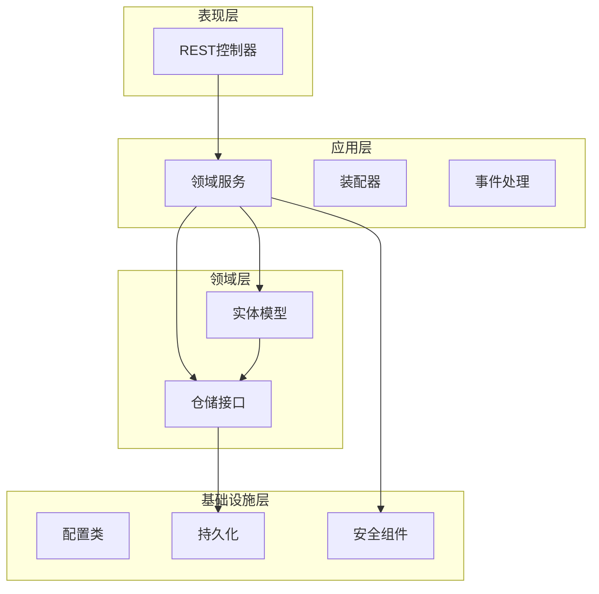

**图表来源**
- [RoleApplicationService.java:1-84](file://iam-admin-server/src/main/java/iam/platform/admin/application/service/RoleApplicationService.java#L1-84)
- [UserApplicationService.java:1-122](file://iam-admin-server/src/main/java/iam/platform/admin/application/service/UserApplicationService.java#L1-122)
- [TenantAccountRoleApplicationService.java:1-157](file://iam-admin-server/src/main/java/iam/platform/admin/application/service/TenantAccountRoleApplicationService.java#L1-157)

**章节来源**
- [RoleApplicationService.java:1-84](file://iam-admin-server/src/main/java/iam/platform/admin/application/service/RoleApplicationService.java#L1-84)
- [UserApplicationService.java:1-122](file://iam-admin-server/src/main/java/iam/platform/admin/application/service/UserApplicationService.java#L1-122)
- [TenantAccountRoleApplicationService.java:1-157](file://iam-admin-server/src/main/java/iam/platform/admin/application/service/TenantAccountRoleApplicationService.java#L1-157)

## 核心组件

系统的核心组件围绕用户角色映射展开，主要包括：

### 用户管理组件
- **User实体**：管理用户基本信息和状态
- **UserApplicationService**：提供用户创建、更新、删除等操作
- **UserController**：REST API接口层

### 角色管理组件  
- **Role实体**：管理角色定义和类型
- **RoleApplicationService**：提供角色创建、查询、删除等操作
- **RoleController**：角色管理API接口

### 租户账户组件
- **TenantAccount实体**：管理用户在特定租户中的身份
- **TenantAccountApplicationService**：租户账户生命周期管理
- **TenantAccountController**：租户账户API接口

### 角色映射组件
- **UserRoleMapping实体**：用户-角色映射（遗留模式）
- **TenantAccountRoleMapping实体**：租户账户-角色映射（新模型）
- **相关仓储接口**：提供映射关系的CRUD操作

**章节来源**
- [User.java:1-158](file://iam-admin-server/src/main/java/iam/platform/admin/domain/model/entity/User.java#L1-158)
- [Role.java:1-83](file://iam-admin-server/src/main/java/iam/platform/admin/domain/model/entity/Role.java#L1-83)
- [TenantAccount.java:1-122](file://iam-admin-server/src/main/java/iam/platform/admin/domain/model/entity/TenantAccount.java#L1-122)
- [UserRoleMapping.java:1-51](file://iam-admin-server/src/main/java/iam/platform/admin/domain/model/entity/UserRoleMapping.java#L1-51)
- [TenantAccountRoleMapping.java:1-21](file://iam-admin-server/src/main/java/iam/platform/admin/domain/model/entity/TenantAccountRoleMapping.java#L1-21)

## 架构概览

系统采用DDD（领域驱动设计）架构，实现了清晰的职责分离和可扩展性：

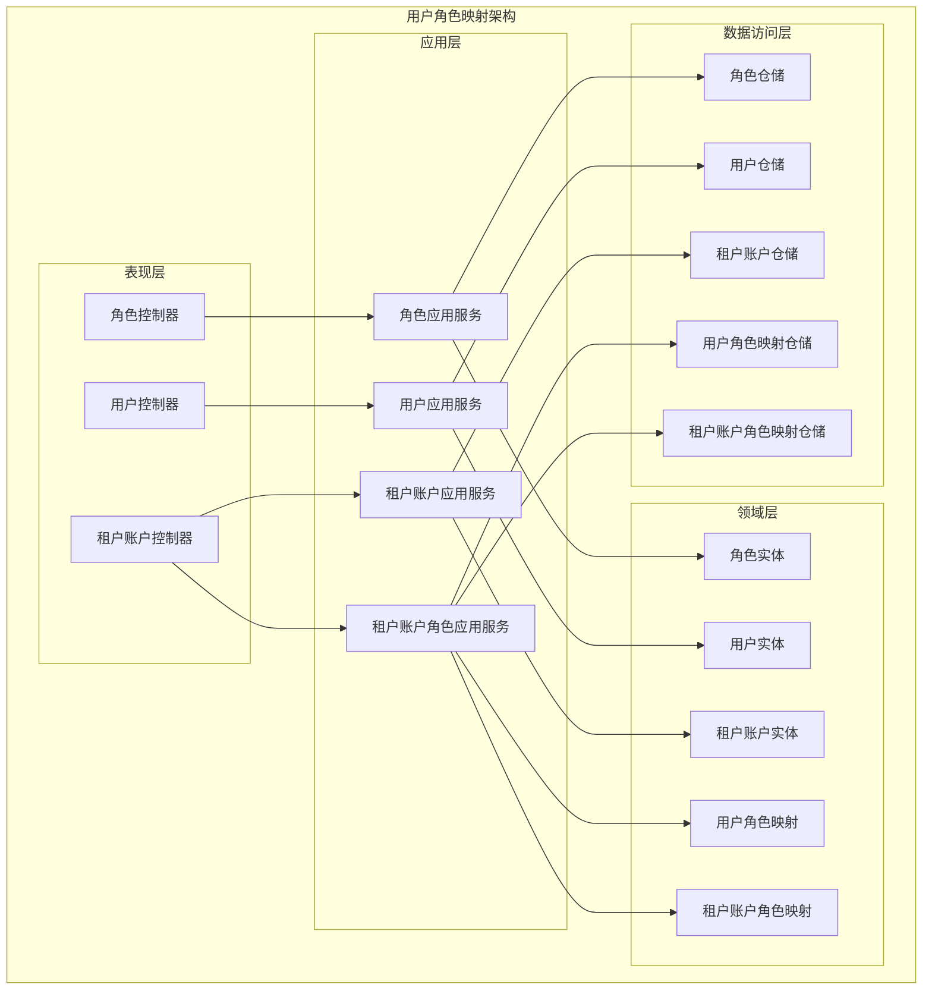

**图表来源**
- [RoleController.java:1-58](file://iam-admin-server/src/main/java/iam/platform/admin/interfaces/rest/RoleController.java#L1-58)
- [UserController.java:1-68](file://iam-admin-server/src/main/java/iam/platform/admin/interfaces/rest/UserController.java#L1-68)
- [TenantAccountController.java:1-94](file://iam-admin-server/src/main/java/iam/platform/admin/interfaces/rest/TenantAccountController.java#L1-94)
- [RoleApplicationService.java:1-84](file://iam-admin-server/src/main/java/iam/platform/admin/application/service/RoleApplicationService.java#L1-84)
- [UserApplicationService.java:1-122](file://iam-admin-server/src/main/java/iam/platform/admin/application/service/UserApplicationService.java#L1-122)
- [TenantAccountRoleApplicationService.java:1-157](file://iam-admin-server/src/main/java/iam/platform/admin/application/service/TenantAccountRoleApplicationService.java#L1-157)

## 详细组件分析

### 用户实体分析

用户实体是系统的基础实体，负责管理用户的基本信息和状态：

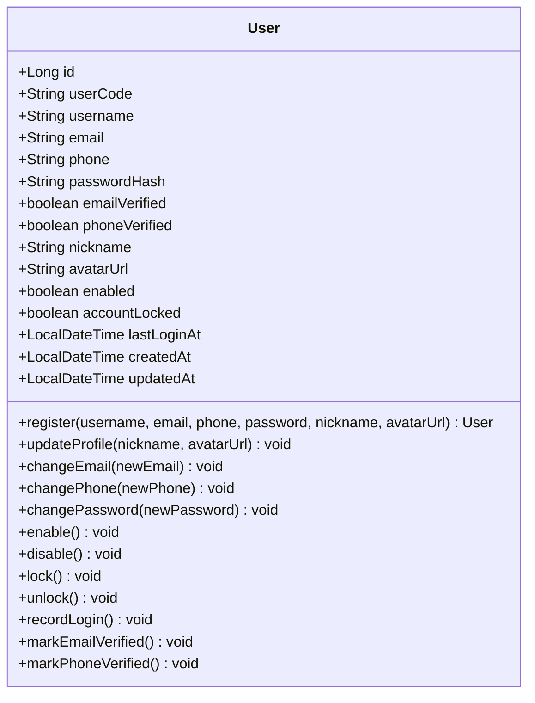

**图表来源**
- [User.java:17-158](file://iam-admin-server/src/main/java/iam/platform/admin/domain/model/entity/User.java#L17-158)

用户实体提供了完整的用户生命周期管理功能，包括注册、状态变更、资料更新等操作。所有操作都通过工厂方法和行为方法实现，确保数据的一致性和完整性。

**章节来源**
- [User.java:1-158](file://iam-admin-server/src/main/java/iam/platform/admin/domain/model/entity/User.java#L1-158)

### 角色实体分析

角色实体支持全局角色和租户自定义角色两种类型：

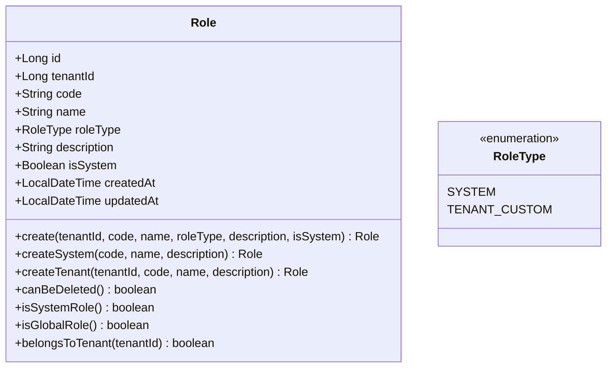

**图表来源**
- [Role.java:16-83](file://iam-admin-server/src/main/java/iam/platform/admin/domain/model/entity/Role.java#L16-83)

角色实体的设计体现了多租户架构的特点，支持系统内置角色和租户自定义角色的区分管理。

**章节来源**
- [Role.java:1-83](file://iam-admin-server/src/main/java/iam/platform/admin/domain/model/entity/Role.java#L1-83)

### 租户账户实体分析

租户账户实体管理用户在特定租户中的身份信息：

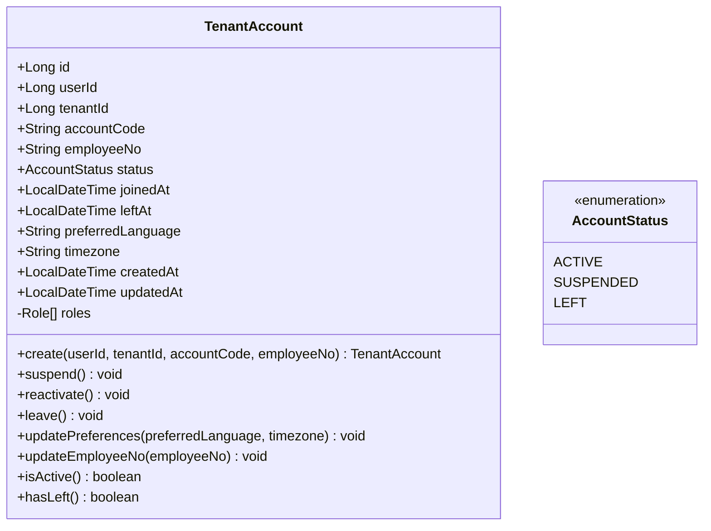

**图表来源**
- [TenantAccount.java:17-122](file://iam-admin-server/src/main/java/iam/platform/admin/domain/model/entity/TenantAccount.java#L17-122)

租户账户实体实现了完整的账户生命周期管理，支持激活、暂停、离职等状态转换。

**章节来源**
- [TenantAccount.java:1-122](file://iam-admin-server/src/main/java/iam/platform/admin/domain/model/entity/TenantAccount.java#L1-122)

### 角色映射实体分析

系统提供了两种角色映射机制：

#### 用户-角色映射（遗留模式）

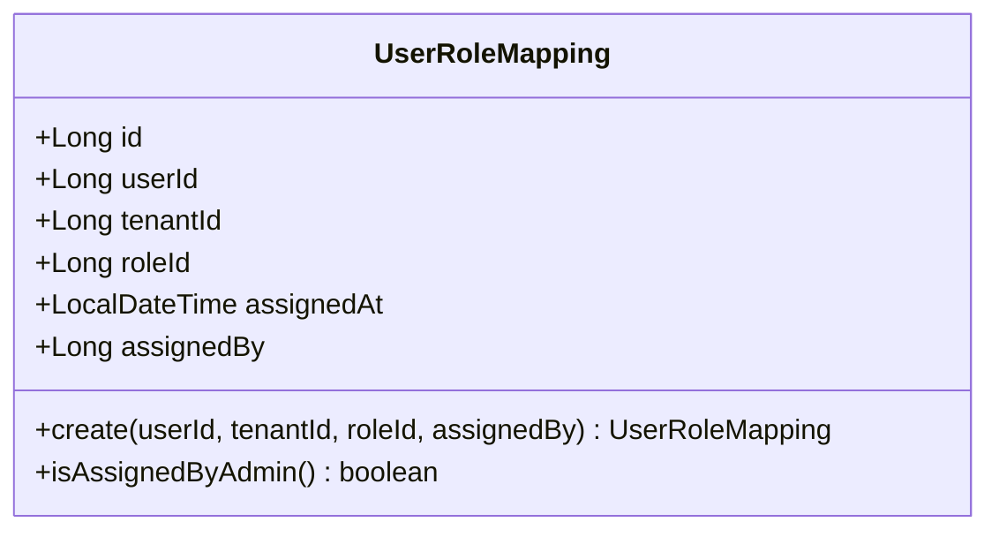

**图表来源**
- [UserRoleMapping.java:18-51](file://iam-admin-server/src/main/java/iam/platform/admin/domain/model/entity/UserRoleMapping.java#L18-51)

#### 租户账户-角色映射（新模型）

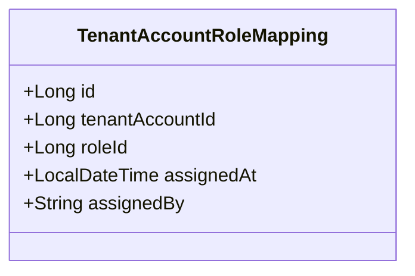

**图表来源**
- [TenantAccountRoleMapping.java:14-21](file://iam-admin-server/src/main/java/iam/platform/admin/domain/model/entity/TenantAccountRoleMapping.java#L14-21)

**章节来源**
- [UserRoleMapping.java:1-51](file://iam-admin-server/src/main/java/iam/platform/admin/domain/model/entity/UserRoleMapping.java#L1-51)
- [TenantAccountRoleMapping.java:1-21](file://iam-admin-server/src/main/java/iam/platform/admin/domain/model/entity/TenantAccountRoleMapping.java#L1-21)

### 应用服务层分析

#### 角色应用服务

角色应用服务提供完整的角色管理功能：

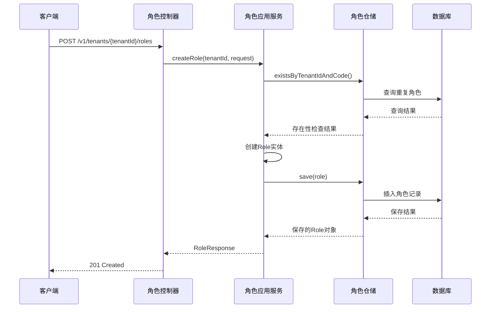

**图表来源**
- [RoleController.java:31-37](file://iam-admin-server/src/main/java/iam/platform/admin/interfaces/rest/RoleController.java#L31-37)
- [RoleApplicationService.java:24-43](file://iam-admin-server/src/main/java/iam/platform/admin/application/service/RoleApplicationService.java#L24-43)

#### 用户应用服务

用户应用服务负责用户全生命周期管理：

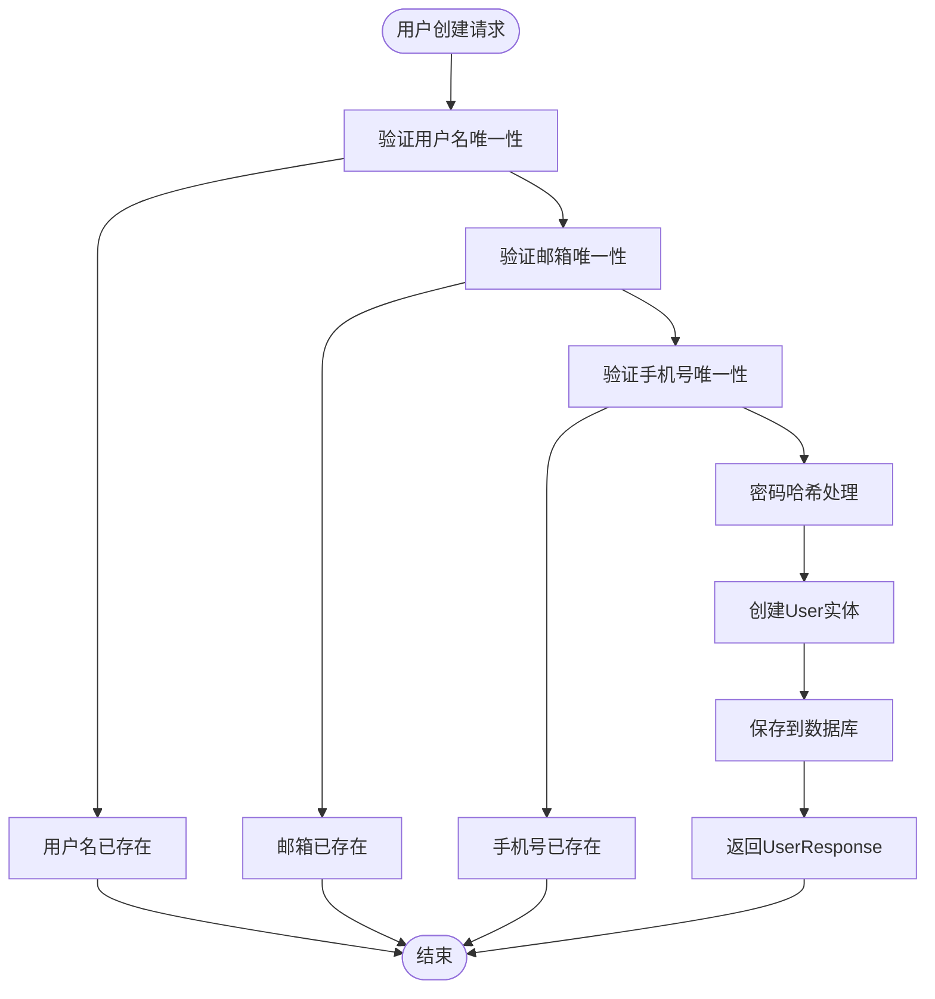

**图表来源**
- [UserApplicationService.java:31-51](file://iam-admin-server/src/main/java/iam/platform/admin/application/service/UserApplicationService.java#L31-51)

#### 租户账户角色应用服务

租户账户角色应用服务提供角色分配和权限查询功能：

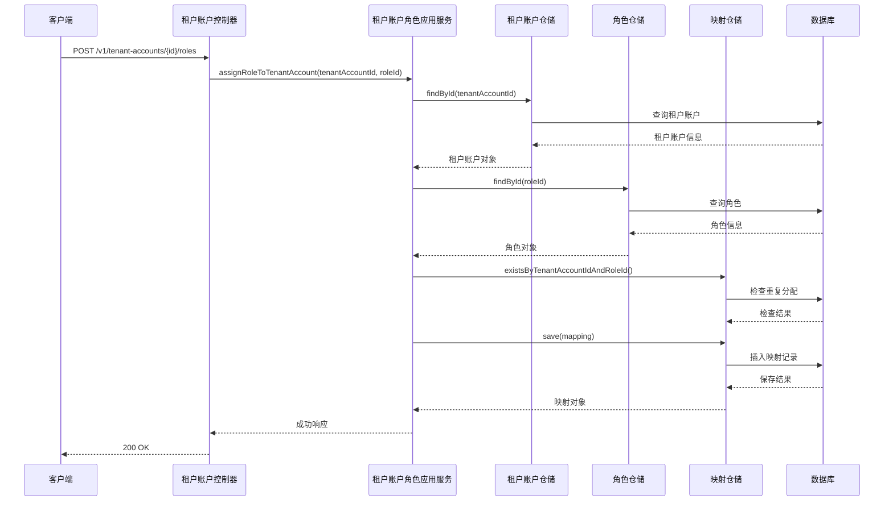

**图表来源**
- [TenantAccountRoleApplicationService.java:43-75](file://iam-admin-server/src/main/java/iam/platform/admin/application/service/TenantAccountRoleApplicationService.java#L43-75)

**章节来源**
- [RoleApplicationService.java:1-84](file://iam-admin-server/src/main/java/iam/platform/admin/application/service/RoleApplicationService.java#L1-84)
- [UserApplicationService.java:1-122](file://iam-admin-server/src/main/java/iam/platform/admin/application/service/UserApplicationService.java#L1-122)
- [TenantAccountRoleApplicationService.java:1-157](file://iam-admin-server/src/main/java/iam/platform/admin/application/service/TenantAccountRoleApplicationService.java#L1-157)

### 数据库架构分析

系统采用PostgreSQL数据库，支持完整的多租户角色映射功能：

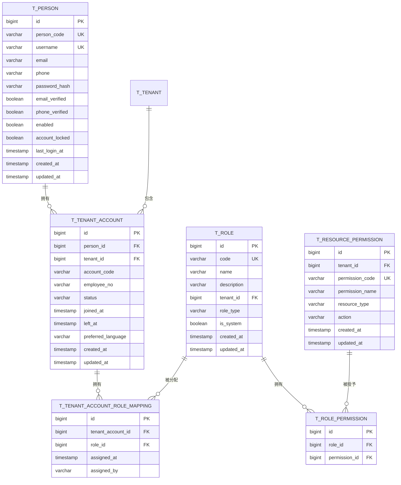

**图表来源**
- [V1__complete_schema_initialization.sql:25-480](file://iam-admin-server/src/main/resources/db/migration/V1__complete_schema_initialization.sql#L25-480)

数据库设计支持复杂的多对多关系，通过中间表实现灵活的角色权限映射。

**章节来源**
- [V1__complete_schema_initialization.sql:1-720](file://iam-admin-server/src/main/resources/db/migration/V1__complete_schema_initialization.sql#L1-720)

## 依赖关系分析

系统采用清晰的依赖层次结构，遵循依赖倒置原则：

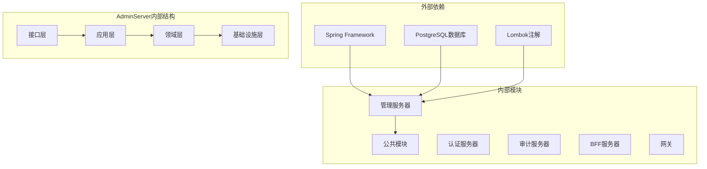

**图表来源**
- [RoleApplicationService.java:1-84](file://iam-admin-server/src/main/java/iam/platform/admin/application/service/RoleApplicationService.java#L1-84)
- [UserApplicationService.java:1-122](file://iam-admin-server/src/main/java/iam/platform/admin/application/service/UserApplicationService.java#L1-122)
- [TenantAccountRoleApplicationService.java:1-157](file://iam-admin-server/src/main/java/iam/platform/admin/application/service/TenantAccountRoleApplicationService.java#L1-157)

系统的主要依赖关系包括：
- **Spring Framework**：提供IoC容器、事务管理、安全框架
- **PostgreSQL**：作为主要的数据存储
- **Lombok**：简化Java代码，减少样板代码
- **Swagger**：提供API文档生成

**章节来源**
- [RoleApplicationService.java:1-84](file://iam-admin-server/src/main/java/iam/platform/admin/application/service/RoleApplicationService.java#L1-84)
- [UserApplicationService.java:1-122](file://iam-admin-server/src/main/java/iam/platform/admin/application/service/UserApplicationService.java#L1-122)
- [TenantAccountRoleApplicationService.java:1-157](file://iam-admin-server/src/main/java/iam/platform/admin/application/service/TenantAccountRoleApplicationService.java#L1-157)

## 性能考虑

系统在设计时充分考虑了性能优化：

### 缓存策略
- **权限缓存**：租户账户权限结果缓存，减少重复计算
- **角色缓存**：常用角色信息缓存
- **配置缓存**：系统配置和策略缓存

### 数据库优化
- **索引优化**：为常用查询字段建立索引
- **连接池**：使用连接池管理数据库连接
- **批量操作**：支持批量角色分配和撤销

### 异步处理
- **审计日志异步写入**：避免阻塞主业务流程
- **邮件通知异步发送**：提升用户体验

## 故障排除指南

### 常见问题及解决方案

#### 用户创建失败
**问题**：用户创建时报用户名或邮箱已存在
**原因**：唯一性约束冲突
**解决**：检查输入参数的唯一性，修改为未使用的值

#### 角色分配异常
**问题**：角色分配时报角色已存在
**原因**：重复的角色分配
**解决**：检查租户账户是否已拥有该角色

#### 权限查询错误
**问题**：获取权限列表为空
**原因**：租户账户没有分配任何角色
**解决**：先为租户账户分配角色，再查询权限

**章节来源**
- [UserApplicationService.java:31-51](file://iam-admin-server/src/main/java/iam/platform/admin/application/service/UserApplicationService.java#L31-51)
- [TenantAccountRoleApplicationService.java:43-75](file://iam-admin-server/src/main/java/iam/platform/admin/application/service/TenantAccountRoleApplicationService.java#L43-75)

## 结论

IAM平台的用户角色映射系统通过清晰的分层架构和DDD设计原则，实现了灵活、可扩展的多租户角色管理功能。系统支持全局角色和租户自定义角色，提供完整的用户生命周期管理和权限控制机制。

主要特点包括：
- **清晰的架构分层**：表现层、应用层、领域层职责明确
- **灵活的映射机制**：支持多种角色映射模式
- **完善的权限控制**：基于角色的权限管理和审计追踪
- **良好的扩展性**：易于添加新的角色类型和权限规则
- **高性能设计**：通过缓存和优化策略提升系统性能

该系统为企业级应用提供了坚实的身份认证和授权基础，能够满足复杂的多租户应用场景需求。