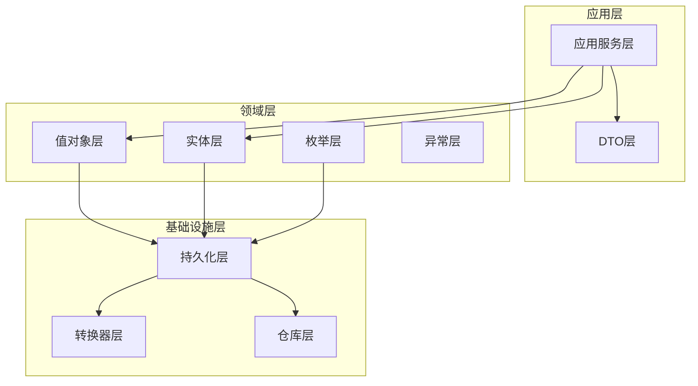
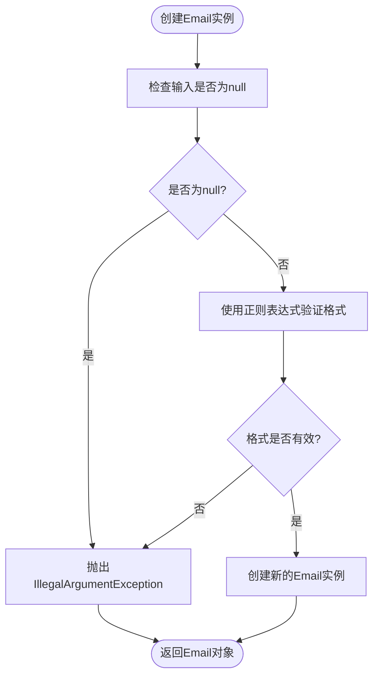
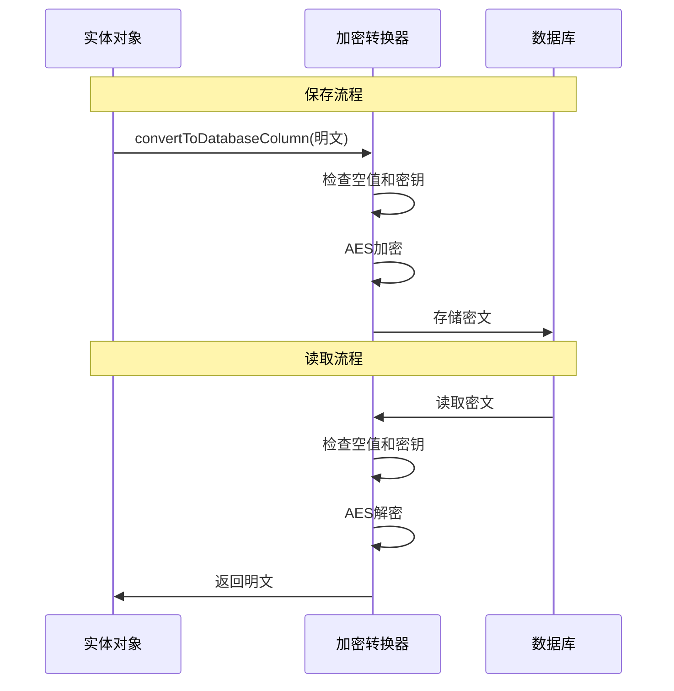
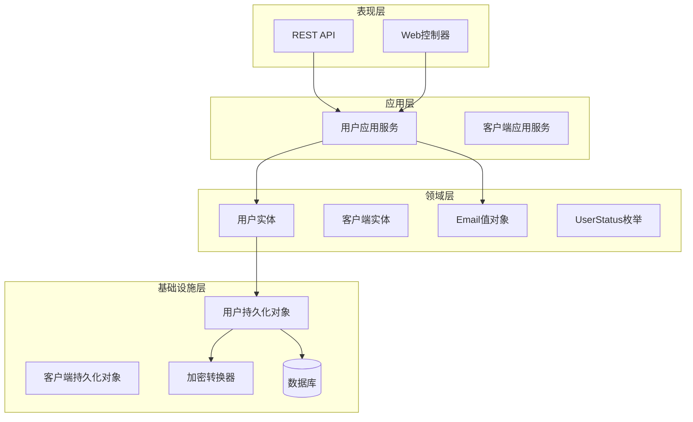
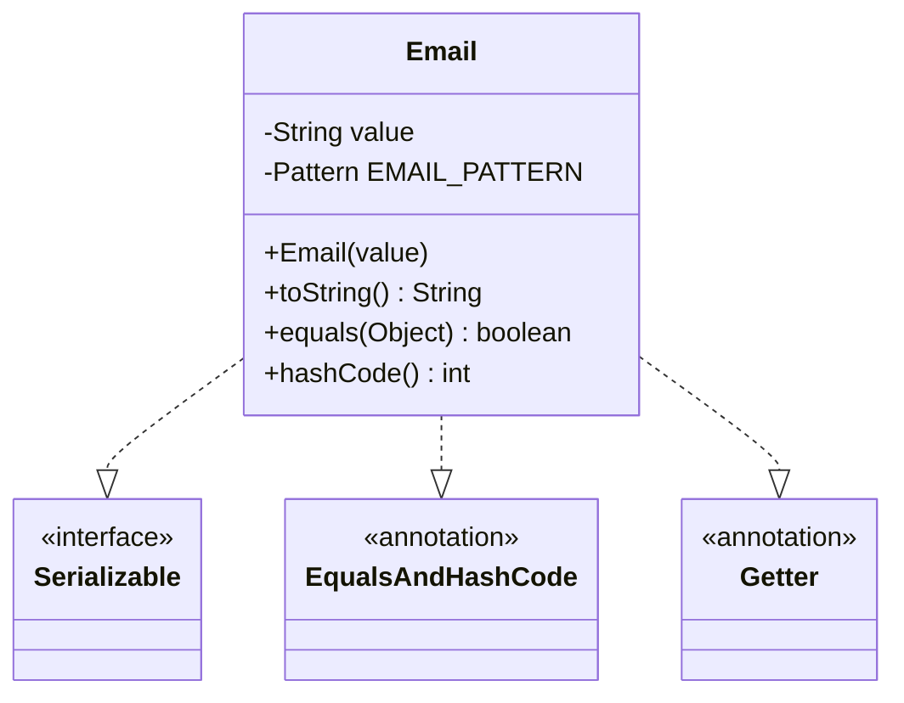
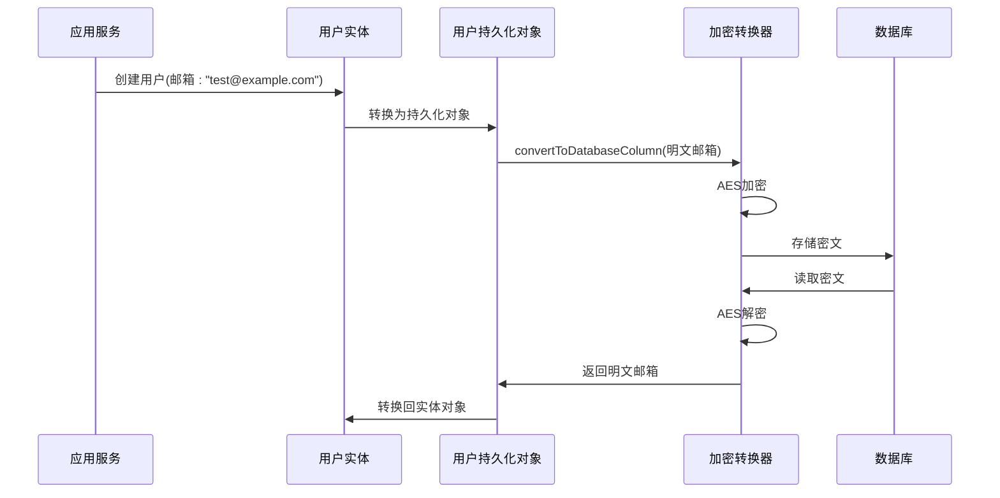
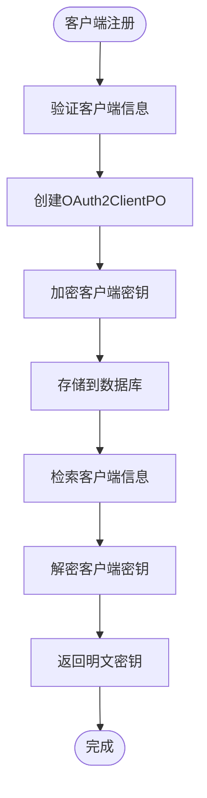
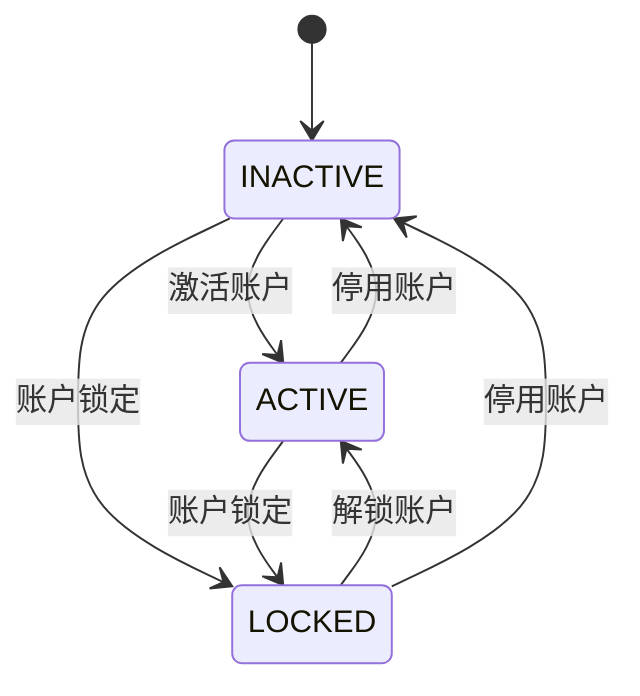
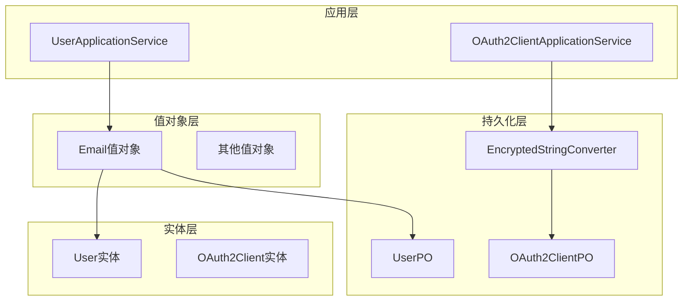

# 值对象设计

<cite>
**本文档引用的文件**
- [Email.java](file://src/main/java/sso/oidc/domain/model/valueobject/Email.java)
- [EncryptedStringConverter.java](file://src/main/java/sso/oidc/infrastructure/persistence/converter/EncryptedStringConverter.java)
- [UserStatus.java](file://src/main/java/sso/oidc/domain/model/enums/UserStatus.java)
- [User.java](file://src/main/java/sso/oidc/domain/model/entity/User.java)
- [OAuth2Client.java](file://src/main/java/sso/oidc/domain/model/entity/OAuth2Client.java)
- [UserPO.java](file://src/main/java/sso/oidc/infrastructure/persistence/entity/UserPO.java)
- [OAuth2ClientPO.java](file://src/main/java/sso/oidc/infrastructure/persistence/entity/OAuth2ClientPO.java)
- [CreateUserRequest.java](file://src/main/java/sso/oidc/application/dto/request/CreateUserRequest.java)
- [UserApplicationService.java](file://src/main/java/sso/oidc/application/service/UserApplicationService.java)
- [UserAlreadyExistsException.java](file://src/main/java/sso/oidc/domain/model/exception/UserAlreadyExistsException.java)
- [BusinessException.java](file://src/main/java/sso/oidc/domain/model/exception/BusinessException.java)
- [application.yml](file://src/main/resources/application.yml)
</cite>

## 目录
1. [引言](#引言)
2. [项目结构](#项目结构)
3. [核心组件](#核心组件)
4. [架构概览](#架构概览)
5. [详细组件分析](#详细组件分析)
6. [依赖分析](#依赖分析)
7. [性能考虑](#性能考虑)
8. [故障排除指南](#故障排除指南)
9. [结论](#结论)
10. [附录](#附录)

## 引言

本文件为IAM Platform认证服务的值对象设计文档，深入解释值对象的设计原则和应用场景。值对象是DDD（领域驱动设计）中的重要概念，具有以下特征：
- 不可变性：一旦创建就不能修改
- 通过值相等性进行比较
- 无标识符，可以被替换
- 提供领域内有意义的抽象

本文将以Email值对象为例，详细说明不可变对象的设计模式，包括构造方法、验证逻辑和转换机制。同时阐述枚举类型UserStatus的设计和业务含义，以及值对象在数据持久化中的转换器实现EncryptedStringConverter的工作原理。

## 项目结构

IAM Platform认证服务采用分层架构，值对象主要位于领域模型层：

**图表来源**
- [UserApplicationService.java:1-165](file://src/main/java/sso/oidc/application/service/UserApplicationService.java#L1-L165)
- [Email.java:1-31](file://src/main/java/sso/oidc/domain/model/valueobject/Email.java#L1-L31)

**章节来源**
- [UserApplicationService.java:1-165](file://src/main/java/sso/oidc/application/service/UserApplicationService.java#L1-L165)
- [Email.java:1-31](file://src/main/java/sso/oidc/domain/model/valueobject/Email.java#L1-L31)

## 核心组件

### Email值对象

Email值对象是本系统中最重要的值对象，实现了不可变性和数据验证的核心功能。

#### 设计原则
- **不可变性**：使用final字段存储值，提供只读访问器
- **验证约束**：在构造函数中执行严格的格式验证
- **统一表示**：通过toString()方法提供标准字符串表示
- **相等性比较**：基于值而非引用进行比较

#### 构造方法与验证逻辑

**图表来源**
- [Email.java:19-24](file://src/main/java/sso/oidc/domain/model/valueobject/Email.java#L19-L24)

#### 转换机制
Email值对象通过toString()方法提供标准字符串表示，便于与其他组件交互。

**章节来源**
- [Email.java:1-31](file://src/main/java/sso/oidc/domain/model/valueobject/Email.java#L1-L31)

### EncryptedStringConverter转换器

EncryptedStringConverter实现了JPA AttributeConverter接口，负责敏感数据的加密和解密。

#### 工作原理
- **加密过程**：convertToDatabaseColumn()方法在保存到数据库前进行加密
- **解密过程**：convertToEntityAttribute()方法在从数据库读取后进行解密
- **密钥管理**：从环境变量ENCRYPTION_KEY获取加密密钥
- **算法选择**：使用AES对称加密算法

**图表来源**
- [EncryptedStringConverter.java:11-33](file://src/main/java/sso/oidc/infrastructure/persistence/converter/EncryptedStringConverter.java#L11-L33)

**章节来源**
- [EncryptedStringConverter.java:1-52](file://src/main/java/sso/oidc/infrastructure/persistence/converter/EncryptedStringConverter.java#L1-L52)

### UserStatus枚举

UserStatus枚举定义了用户的状态类型，提供了清晰的业务语义。

#### 状态定义
- **ACTIVE**：用户账户处于激活状态
- **INACTIVE**：用户账户处于非激活状态  
- **LOCKED**：用户账户被锁定

这些状态值为业务逻辑提供了明确的边界条件，便于进行状态管理和权限控制。

**章节来源**
- [UserStatus.java:1-8](file://src/main/java/sso/oidc/domain/model/enums/UserStatus.java#L1-L8)

## 架构概览

值对象在整个系统架构中的位置和作用：

**图表来源**
- [UserApplicationService.java:36-63](file://src/main/java/sso/oidc/application/service/UserApplicationService.java#L36-L63)
- [UserPO.java:32-34](file://src/main/java/sso/oidc/infrastructure/persistence/entity/UserPO.java#L32-L34)

**章节来源**
- [UserApplicationService.java:36-63](file://src/main/java/sso/oidc/application/service/UserApplicationService.java#L36-L63)
- [UserPO.java:32-34](file://src/main/java/sso/oidc/infrastructure/persistence/entity/UserPO.java#L32-L34)

## 详细组件分析

### Email值对象深度分析

#### 类设计结构

**图表来源**
- [Email.java:9-30](file://src/main/java/sso/oidc/domain/model/valueobject/Email.java#L9-L30)

#### 验证机制详解

Email值对象使用正则表达式进行格式验证，确保邮箱地址的有效性。验证规则包括：
- 支持字母、数字、点号、下划线和连字符
- 必须包含@符号
- 支持域名部分的点号分隔

这种设计确保了数据的完整性和一致性，避免了无效邮箱地址进入系统。

**章节来源**
- [Email.java:14-24](file://src/main/java/sso/oidc/domain/model/valueobject/Email.java#L14-L24)

### 用户实体与值对象的关系

用户实体在领域模型中直接使用字符串类型的邮箱字段，但在持久化层通过转换器进行加密处理。

**图表来源**
- [UserApplicationService.java:47-54](file://src/main/java/sso/oidc/application/service/UserApplicationService.java#L47-L54)
- [UserPO.java:66-74](file://src/main/java/sso/oidc/infrastructure/persistence/entity/UserPO.java#L66-L74)

**章节来源**
- [UserApplicationService.java:47-54](file://src/main/java/sso/oidc/application/service/UserApplicationService.java#L47-L54)
- [UserPO.java:66-74](file://src/main/java/sso/oidc/infrastructure/persistence/entity/UserPO.java#L66-L74)

### OAuth2客户端的值对象应用

OAuth2客户端实体展示了值对象在复杂业务场景中的应用，特别是敏感信息的保护。

#### 敏感数据保护机制

**图表来源**
- [OAuth2ClientPO.java:33-35](file://src/main/java/sso/oidc/infrastructure/persistence/entity/OAuth2ClientPO.java#L33-L35)
- [EncryptedStringConverter.java:12-33](file://src/main/java/sso/oidc/infrastructure/persistence/converter/EncryptedStringConverter.java#L12-L33)

**章节来源**
- [OAuth2ClientPO.java:33-35](file://src/main/java/sso/oidc/infrastructure/persistence/entity/OAuth2ClientPO.java#L33-L35)
- [EncryptedStringConverter.java:12-33](file://src/main/java/sso/oidc/infrastructure/persistence/converter/EncryptedStringConverter.java#L12-L33)

### 枚举类型的应用场景

UserStatus枚举在多个业务场景中发挥作用：

#### 状态流转图

**图表来源**
- [UserStatus.java:3-7](file://src/main/java/sso/oidc/domain/model/enums/UserStatus.java#L3-L7)

**章节来源**
- [UserStatus.java:3-7](file://src/main/java/sso/oidc/domain/model/enums/UserStatus.java#L3-L7)

## 依赖分析

值对象之间的依赖关系和耦合度分析：

**图表来源**
- [User.java:18-19](file://src/main/java/sso/oidc/domain/model/entity/User.java#L18-L19)
- [UserPO.java:33-34](file://src/main/java/sso/oidc/infrastructure/persistence/entity/UserPO.java#L33-L34)

**章节来源**
- [User.java:18-19](file://src/main/java/sso/oidc/domain/model/entity/User.java#L18-L19)
- [UserPO.java:33-34](file://src/main/java/sso/oidc/infrastructure/persistence/entity/UserPO.java#L33-L34)

## 性能考虑

### 值对象的性能特性

1. **内存占用**：值对象通常比实体轻量，因为它们不包含持久化标识符
2. **比较效率**：基于值的相等性比较比基于引用的比较更高效
3. **缓存友好**：不可变性使得值对象更容易被缓存和共享

### 加密转换器的性能影响

- **CPU开销**：AES加密/解密操作会增加处理时间
- **内存使用**：加密过程需要额外的内存空间
- **I/O影响**：加密后的数据大小可能略有增加

**优化建议**：
- 使用连接池减少加密操作的开销
- 对频繁使用的值对象进行缓存
- 在批量操作时考虑批处理加密

## 故障排除指南

### 常见问题及解决方案

#### Email验证失败
**问题**：创建Email实例时抛出IllegalArgumentException
**原因**：邮箱格式不符合正则表达式要求
**解决**：检查邮箱格式，确保包含有效的@符号和域名

#### 加密密钥配置错误
**问题**：EncryptedStringConverter抛出运行时异常
**原因**：ENCRYPTION_KEY环境变量未正确设置或为空
**解决**：在application.yml中正确配置加密密钥

#### 数据库连接问题
**问题**：值对象转换过程中出现数据库连接异常
**原因**：数据库配置错误或网络问题
**解决**：检查数据库连接参数和网络连通性

**章节来源**
- [Email.java:20-22](file://src/main/java/sso/oidc/domain/model/valueobject/Email.java#L20-L22)
- [EncryptedStringConverter.java:13-20](file://src/main/java/sso/oidc/infrastructure/persistence/converter/EncryptedStringConverter.java#L13-L20)
- [application.yml:54](file://src/main/resources/application.yml#L54)

## 结论

值对象设计在IAM Platform认证服务中发挥了重要作用，通过以下方式提升了系统的质量：

1. **数据完整性**：通过严格的验证机制确保数据的有效性
2. **领域建模**：提供有意义的业务抽象，使代码更具表达力
3. **安全性**：通过加密转换器保护敏感数据
4. **可维护性**：不可变性减少了并发访问的问题
5. **可测试性**：简单的数据结构便于单元测试

值对象的设计原则和实现模式为其他类似系统提供了良好的参考模板。通过合理使用值对象，可以显著提升系统的可靠性、安全性和可维护性。

## 附录

### 最佳实践清单

#### 值对象设计最佳实践
- 确保完全的不可变性
- 在构造函数中执行所有验证
- 提供清晰的toString()实现
- 使用相等性而非标识符进行比较
- 避免在值对象中存储状态变化

#### 使用示例
- Email值对象：用于用户邮箱地址的验证和存储
- UserStatus枚举：用于用户状态管理
- EncryptedStringConverter：用于敏感数据的加密存储

#### 常见陷阱避免
- 避免在值对象中存储可变状态
- 不要将值对象作为实体的标识符
- 确保转换器的一致性（加密和解密必须匹配）
- 注意性能影响，特别是在大量数据处理时