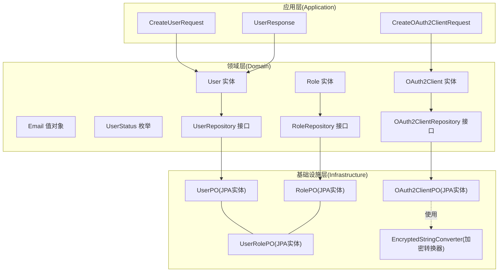
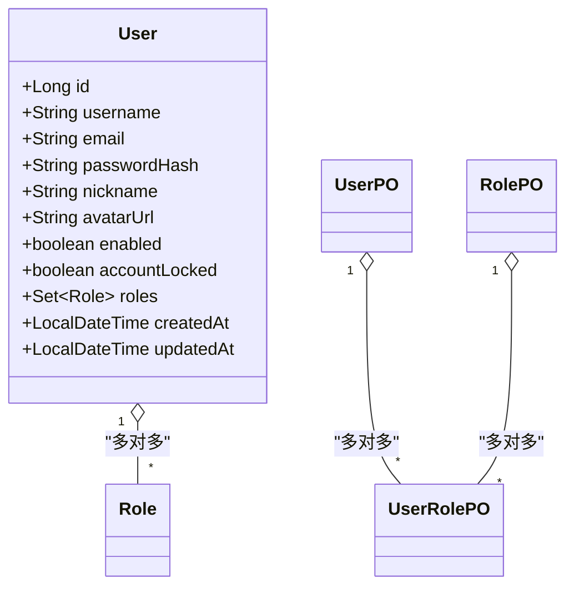
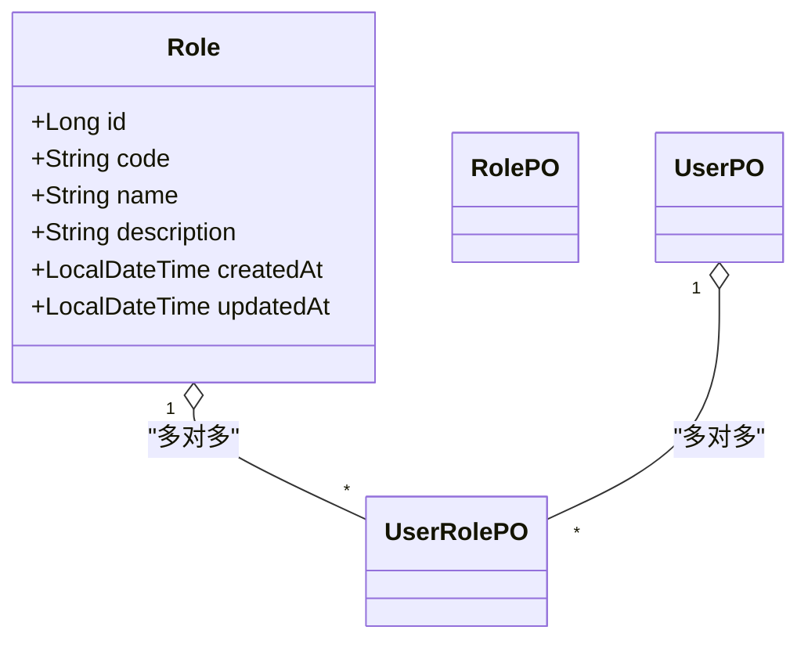
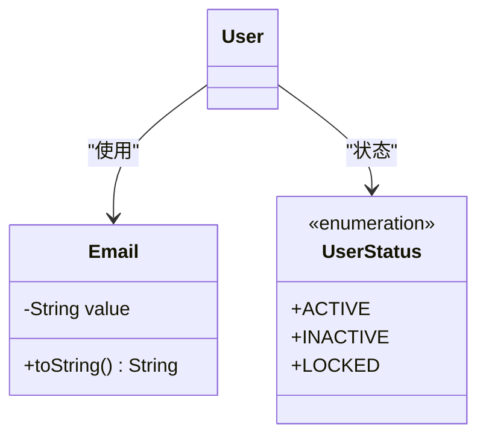
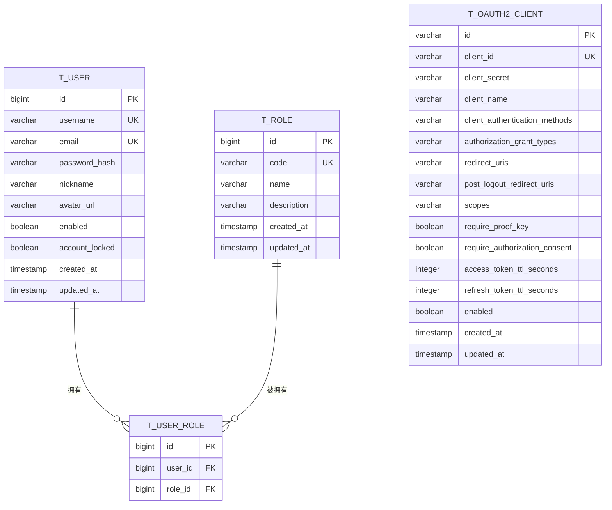
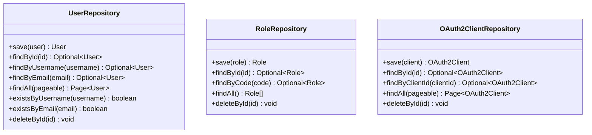
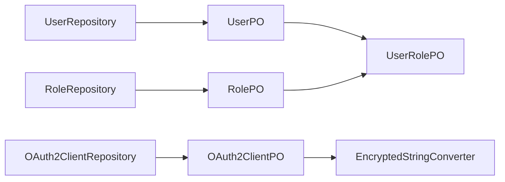

# 实体设计

<cite>
**本文引用的文件**
- [User.java](file://src/main/java/sso/oidc/domain/model/entity/User.java)
- [Role.java](file://src/main/java/sso/oidc/domain/model/entity/Role.java)
- [OAuth2Client.java](file://src/main/java/sso/oidc/domain/model/entity/OAuth2Client.java)
- [Email.java](file://src/main/java/sso/oidc/domain/model/valueobject/Email.java)
- [UserStatus.java](file://src/main/java/sso/oidc/domain/model/enums/UserStatus.java)
- [UserRepository.java](file://src/main/java/sso/oidc/domain/repository/UserRepository.java)
- [RoleRepository.java](file://src/main/java/sso/oidc/domain/repository/RoleRepository.java)
- [OAuth2ClientRepository.java](file://src/main/java/sso/oidc/domain/repository/OAuth2ClientRepository.java)
- [UserPO.java](file://src/main/java/sso/oidc/infrastructure/persistence/entity/UserPO.java)
- [RolePO.java](file://src/main/java/sso/oidc/infrastructure/persistence/entity/RolePO.java)
- [OAuth2ClientPO.java](file://src/main/java/sso/oidc/infrastructure/persistence/entity/OAuth2ClientPO.java)
- [UserRolePO.java](file://src/main/java/sso/oidc/infrastructure/persistence/entity/UserRolePO.java)
- [EncryptedStringConverter.java](file://src/main/java/sso/oidc/infrastructure/persistence/converter/EncryptedStringConverter.java)
- [CreateUserRequest.java](file://src/main/java/sso/oidc/application/dto/request/CreateUserRequest.java)
- [CreateOAuth2ClientRequest.java](file://src/main/java/sso/oidc/application/dto/request/CreateOAuth2ClientRequest.java)
- [UserResponse.java](file://src/main/java/sso/oidc/application/dto/response/UserResponse.java)
</cite>

## 目录
1. [引言](#引言)
2. [项目结构](#项目结构)
3. [核心组件](#核心组件)
4. [架构总览](#架构总览)
5. [详细组件分析](#详细组件分析)
6. [依赖分析](#依赖分析)
7. [性能考虑](#性能考虑)
8. [故障排查指南](#故障排查指南)
9. [结论](#结论)
10. [附录](#附录)

## 引言
本文件面向IAM Platform认证服务的实体设计，系统化梳理领域模型中的核心实体：User（用户）、Role（角色）、OAuth2Client（OAuth2客户端），并阐明其业务规则、行为方法与状态管理；同时说明实体间关系映射（一对一、一对多、多对多）的实现方式，以及生命周期管理、验证规则与不变性约束。此外，文档还覆盖仓储接口的设计模式与数据访问抽象，并通过类图与UML图表直观展示实体结构与交互关系，最后给出实体使用示例与最佳实践指导。

## 项目结构
围绕实体设计，代码库采用分层与DDD（领域驱动设计）风格组织：
- 领域层（Domain）
  - Model：实体、值对象、枚举、异常、值对象等
  - Repository：仓储接口，定义数据访问契约
- 基础设施层（Infrastructure）
  - Persistence：JPA实体（PO）、转换器、仓库实现
  - Security：安全配置与适配器
- 应用层（Application）
  - DTO：请求/响应对象，承载参数校验与传输结构
- 接口层（Interfaces）
  - REST控制器与Web控制器，暴露业务能力



图表来源
- [User.java:1-36](file://src/main/java/sso/oidc/domain/model/entity/User.java#L1-L36)
- [Role.java:1-22](file://src/main/java/sso/oidc/domain/model/entity/Role.java#L1-L22)
- [OAuth2Client.java:1-69](file://src/main/java/sso/oidc/domain/model/entity/OAuth2Client.java#L1-L69)
- [Email.java:1-31](file://src/main/java/sso/oidc/domain/model/valueobject/Email.java#L1-L31)
- [UserStatus.java:1-8](file://src/main/java/sso/oidc/domain/model/enums/UserStatus.java#L1-L8)
- [UserRepository.java:1-26](file://src/main/java/sso/oidc/domain/repository/UserRepository.java#L1-L26)
- [RoleRepository.java:1-19](file://src/main/java/sso/oidc/domain/repository/RoleRepository.java#L1-L19)
- [OAuth2ClientRepository.java:1-20](file://src/main/java/sso/oidc/domain/repository/OAuth2ClientRepository.java#L1-L20)
- [UserPO.java:1-76](file://src/main/java/sso/oidc/infrastructure/persistence/entity/UserPO.java#L1-L76)
- [RolePO.java:1-53](file://src/main/java/sso/oidc/infrastructure/persistence/entity/RolePO.java#L1-L53)
- [OAuth2ClientPO.java:1-101](file://src/main/java/sso/oidc/infrastructure/persistence/entity/OAuth2ClientPO.java#L1-L101)
- [UserRolePO.java:1-36](file://src/main/java/sso/oidc/infrastructure/persistence/entity/UserRolePO.java#L1-L36)
- [EncryptedStringConverter.java](file://src/main/java/sso/oidc/infrastructure/persistence/converter/EncryptedStringConverter.java)

章节来源
- [User.java:1-36](file://src/main/java/sso/oidc/domain/model/entity/User.java#L1-L36)
- [Role.java:1-22](file://src/main/java/sso/oidc/domain/model/entity/Role.java#L1-L22)
- [OAuth2Client.java:1-69](file://src/main/java/sso/oidc/domain/model/entity/OAuth2Client.java#L1-L69)
- [UserRepository.java:1-26](file://src/main/java/sso/oidc/domain/repository/UserRepository.java#L1-L26)
- [RoleRepository.java:1-19](file://src/main/java/sso/oidc/domain/repository/RoleRepository.java#L1-L19)
- [OAuth2ClientRepository.java:1-20](file://src/main/java/sso/oidc/domain/repository/OAuth2ClientRepository.java#L1-L20)

## 核心组件
本节聚焦三大核心实体及其关键属性与行为：

- User（用户）
  - 关键属性：标识、用户名、邮箱、密码哈希、昵称、头像URL、启用状态、账户锁定、角色集合、创建/更新时间
  - 行为与状态：提供角色集合的惰性初始化，确保空集合不为null；支持启用/锁定状态管理
  - 业务规则：用户名与邮箱唯一；可关联多个角色，形成多对多关系
  - 生命周期：由仓储接口进行保存、查询、删除与存在性检查

- Role（角色）
  - 关键属性：标识、角色编码（唯一）、名称、描述、创建/更新时间
  - 行为与状态：作为独立实体，用于权限标识与分配
  - 业务规则：角色编码唯一；可被多个用户拥有
  - 生命周期：由仓储接口进行保存、查询、删除与按编码查询

- OAuth2Client（OAuth2客户端）
  - 关键属性：标识、clientId（唯一）、clientSecret（加密存储）、clientName、认证方式集合、授权类型集合、重定向URI集合、登出后重定向URI集合、作用域集合、是否要求PKCE、是否要求授权同意、访问令牌与刷新令牌有效期、启用状态、创建/更新时间
  - 行为与状态：提供各集合属性的惰性初始化；clientSecret通过加密转换器持久化
  - 业务规则：clientId唯一；集合字段用于控制授权流程与安全策略
  - 生命周期：由仓储接口进行保存、查询、删除与按clientId查询

章节来源
- [User.java:16-35](file://src/main/java/sso/oidc/domain/model/entity/User.java#L16-L35)
- [Role.java:14-21](file://src/main/java/sso/oidc/domain/model/entity/Role.java#L14-L21)
- [OAuth2Client.java:16-68](file://src/main/java/sso/oidc/domain/model/entity/OAuth2Client.java#L16-L68)
- [UserRepository.java:9-25](file://src/main/java/sso/oidc/domain/repository/UserRepository.java#L9-L25)
- [RoleRepository.java:8-18](file://src/main/java/sso/oidc/domain/repository/RoleRepository.java#L8-L18)
- [OAuth2ClientRepository.java:9-19](file://src/main/java/sso/oidc/domain/repository/OAuth2ClientRepository.java#L9-L19)

## 架构总览
下图展示实体与仓储接口之间的关系，以及持久化对象（PO）如何映射到数据库表，体现DDD分层与数据访问抽象：

```mermaid
classDiagram
class User {
+Long id
+String username
+String email
+String passwordHash
+String nickname
+String avatarUrl
+boolean enabled
+boolean accountLocked
+Set~Role~ roles
+LocalDateTime createdAt
+LocalDateTime updatedAt
}
class Role {
+Long id
+String code
+String name
+String description
+LocalDateTime createdAt
+LocalDateTime updatedAt
}
class OAuth2Client {
+String id
+String clientId
+String clientSecret
+String clientName
+Set~String~ clientAuthenticationMethods
+Set~String~ authorizationGrantTypes
+Set~String~ redirectUris
+Set~String~ postLogoutRedirectUris
+Set~String~ scopes
+boolean requireProofKey
+boolean requireAuthorizationConsent
+int accessTokenTtlSeconds
+int refreshTokenTtlSeconds
+boolean enabled
+LocalDateTime createdAt
+LocalDateTime updatedAt
}
class UserPO
class RolePO
class OAuth2ClientPO
class UserRolePO
class EncryptedStringConverter
UserPO "1" o-- "*" UserRolePO : "多对多关联"
RolePO "1" o-- "*" UserRolePO : "多对多关联"
OAuth2ClientPO ||--|| OAuth2Client : "映射"
OAuth2ClientPO ||--|| EncryptedStringConverter : "使用"
```

图表来源
- [User.java:16-35](file://src/main/java/sso/oidc/domain/model/entity/User.java#L16-L35)
- [Role.java:14-21](file://src/main/java/sso/oidc/domain/model/entity/Role.java#L14-L21)
- [OAuth2Client.java:16-68](file://src/main/java/sso/oidc/domain/model/entity/OAuth2Client.java#L16-L68)
- [UserPO.java:21-76](file://src/main/java/sso/oidc/infrastructure/persistence/entity/UserPO.java#L21-L76)
- [RolePO.java:21-53](file://src/main/java/sso/oidc/infrastructure/persistence/entity/RolePO.java#L21-L53)
- [OAuth2ClientPO.java:22-101](file://src/main/java/sso/oidc/infrastructure/persistence/entity/OAuth2ClientPO.java#L22-L101)
- [UserRolePO.java:17-35](file://src/main/java/sso/oidc/infrastructure/persistence/entity/UserRolePO.java#L17-L35)
- [EncryptedStringConverter.java](file://src/main/java/sso/oidc/infrastructure/persistence/converter/EncryptedStringConverter.java)

## 详细组件分析

### 用户实体 User 分析
- 设计理念
  - 聚合根：用户聚合包含身份信息、认证凭据（哈希）、个人资料、启用状态与角色集合
  - 不变性：用户名与邮箱在领域层通过唯一性约束保障；在应用层通过仓储接口的存在性检查进一步强化
  - 状态管理：enabled与accountLocked用于账户级控制；createdAt/updatedAt用于审计
- 属性与验证
  - 角色集合惰性初始化，避免空指针
  - 与Role构成多对多关系，通过UserRolePO中间表实现
- 业务规则
  - 用户名与邮箱唯一
  - 支持启用/锁定状态切换
- 生命周期
  - 通过UserRepository进行保存、查询、删除与存在性检查



图表来源
- [User.java:16-35](file://src/main/java/sso/oidc/domain/model/entity/User.java#L16-L35)
- [Role.java:14-21](file://src/main/java/sso/oidc/domain/model/entity/Role.java#L14-L21)
- [UserRolePO.java:17-35](file://src/main/java/sso/oidc/infrastructure/persistence/entity/UserRolePO.java#L17-L35)

章节来源
- [User.java:16-35](file://src/main/java/sso/oidc/domain/model/entity/User.java#L16-L35)
- [UserRepository.java:9-25](file://src/main/java/sso/oidc/domain/repository/UserRepository.java#L9-L25)
- [UserRolePO.java:17-35](file://src/main/java/sso/oidc/infrastructure/persistence/entity/UserRolePO.java#L17-L35)

### 角色实体 Role 分析
- 设计理念
  - 独立实体：角色用于权限标识，与用户多对多关联
  - 唯一性：code字段唯一，便于程序化授权判断
- 属性与验证
  - code、name、description具备合理长度限制
- 业务规则
  - code唯一；可被多个用户拥有
- 生命周期
  - 通过RoleRepository进行保存、查询、删除与按code查询



图表来源
- [Role.java:14-21](file://src/main/java/sso/oidc/domain/model/entity/Role.java#L14-L21)
- [RolePO.java:21-53](file://src/main/java/sso/oidc/infrastructure/persistence/entity/RolePO.java#L21-L53)
- [UserRolePO.java:17-35](file://src/main/java/sso/oidc/infrastructure/persistence/entity/UserRolePO.java#L17-L35)

章节来源
- [Role.java:14-21](file://src/main/java/sso/oidc/domain/model/entity/Role.java#L14-L21)
- [RoleRepository.java:8-18](file://src/main/java/sso/oidc/domain/repository/RoleRepository.java#L8-L18)
- [RolePO.java:21-53](file://src/main/java/sso/oidc/infrastructure/persistence/entity/RolePO.java#L21-L53)

### OAuth2 客户端实体 OAuth2Client 分析
- 设计理念
  - 客户端聚合：封装OAuth2/OIDC授权所需的全部元数据
  - 安全优先：clientSecret通过EncryptedStringConverter加密存储；PKCE与授权同意开关控制安全策略
  - 可配置性：授权类型、作用域、重定向URI等均以集合形式提供灵活配置
- 属性与验证
  - 各集合属性惰性初始化，避免空指针
  - TTL秒数用于令牌生命周期控制
- 业务规则
  - clientId唯一；集合字段用于授权流程控制
- 生命周期
  - 通过OAuth2ClientRepository进行保存、查询、删除与按clientId查询

```mermaid
classDiagram
class OAuth2Client {
+String id
+String clientId
+String clientSecret
+String clientName
+Set~String~ clientAuthenticationMethods
+Set~String~ authorizationGrantTypes
+Set~String~ redirectUris
+Set~String~ postLogoutRedirectUris
+Set~String~ scopes
+boolean requireProofKey
+boolean requireAuthorizationConsent
+int accessTokenTtlSeconds
+int refreshTokenTtlSeconds
+boolean enabled
+LocalDateTime createdAt
+LocalDateTime updatedAt
}
class OAuth2ClientPO
class EncryptedStringConverter
OAuth2ClientPO ||--|| EncryptedStringConverter : "clientSecret 加密"
```

图表来源
- [OAuth2Client.java:16-68](file://src/main/java/sso/oidc/domain/model/entity/OAuth2Client.java#L16-L68)
- [OAuth2ClientPO.java:22-101](file://src/main/java/sso/oidc/infrastructure/persistence/entity/OAuth2ClientPO.java#L22-L101)
- [EncryptedStringConverter.java](file://src/main/java/sso/oidc/infrastructure/persistence/converter/EncryptedStringConverter.java)

章节来源
- [OAuth2Client.java:16-68](file://src/main/java/sso/oidc/domain/model/entity/OAuth2Client.java#L16-L68)
- [OAuth2ClientRepository.java:9-19](file://src/main/java/sso/oidc/domain/repository/OAuth2ClientRepository.java#L9-L19)
- [OAuth2ClientPO.java:22-101](file://src/main/java/sso/oidc/infrastructure/persistence/entity/OAuth2ClientPO.java#L22-L101)

### 值对象与枚举
- Email 值对象
  - 不可变：构造时进行格式校验，非法格式抛出异常
  - 语义化：封装邮箱字符串，避免直接传递原始字符串
- UserStatus 枚举
  - 状态机：ACTIVE、INACTIVE、LOCKED，用于用户状态流转控制



图表来源
- [Email.java:11-30](file://src/main/java/sso/oidc/domain/model/valueobject/Email.java#L11-L30)
- [UserStatus.java:3-7](file://src/main/java/sso/oidc/domain/model/enums/UserStatus.java#L3-L7)
- [User.java:16-35](file://src/main/java/sso/oidc/domain/model/entity/User.java#L16-L35)

章节来源
- [Email.java:11-30](file://src/main/java/sso/oidc/domain/model/valueobject/Email.java#L11-L30)
- [UserStatus.java:3-7](file://src/main/java/sso/oidc/domain/model/enums/UserStatus.java#L3-L7)

### 实体关系映射与状态管理
- 多对多关系
  - User 与 Role 通过 UserRolePO 中间表关联，支持动态分配与撤销角色
- 状态管理
  - User：enabled与accountLocked用于启用/锁定控制；createdAt/updatedAt用于审计
  - Role：仅基础元数据，状态由用户启用/禁用间接影响
  - OAuth2Client：enabled用于启用/禁用客户端；TTL秒数控制令牌生命周期
- 不变性约束
  - 唯一性：User.username、User.email、Role.code、OAuth2Client.clientId
  - 集合初始化：各实体集合属性惰性初始化，保证非空



图表来源
- [UserPO.java:21-76](file://src/main/java/sso/oidc/infrastructure/persistence/entity/UserPO.java#L21-L76)
- [RolePO.java:21-53](file://src/main/java/sso/oidc/infrastructure/persistence/entity/RolePO.java#L21-L53)
- [OAuth2ClientPO.java:22-101](file://src/main/java/sso/oidc/infrastructure/persistence/entity/OAuth2ClientPO.java#L22-L101)
- [UserRolePO.java:17-35](file://src/main/java/sso/oidc/infrastructure/persistence/entity/UserRolePO.java#L17-L35)

章节来源
- [UserRolePO.java:17-35](file://src/main/java/sso/oidc/infrastructure/persistence/entity/UserRolePO.java#L17-L35)
- [UserPO.java:21-76](file://src/main/java/sso/oidc/infrastructure/persistence/entity/UserPO.java#L21-L76)
- [RolePO.java:21-53](file://src/main/java/sso/oidc/infrastructure/persistence/entity/RolePO.java#L21-L53)
- [OAuth2ClientPO.java:22-101](file://src/main/java/sso/oidc/infrastructure/persistence/entity/OAuth2ClientPO.java#L22-L101)

### 仓储接口设计模式与数据访问抽象
- UserRepository
  - 职责：用户聚合的数据访问契约，提供保存、按主键/用户名/邮箱查询、分页查询、存在性检查、删除
  - 设计模式：Repository接口隔离业务逻辑与数据源，Spring Data Pageable支持分页
- RoleRepository
  - 职责：角色聚合的数据访问契约，提供保存、按主键/编码查询、列表查询、删除
- OAuth2ClientRepository
  - 职责：客户端聚合的数据访问契约，提供保存、按主键/clientId查询、分页查询、删除
- 数据访问抽象
  - 领域实体与PO分离，通过仓储接口屏蔽ORM细节
  - OAuth2ClientPO在持久化前生成UUID主键，统一createdAt/updatedAt



图表来源
- [UserRepository.java:9-25](file://src/main/java/sso/oidc/domain/repository/UserRepository.java#L9-L25)
- [RoleRepository.java:8-18](file://src/main/java/sso/oidc/domain/repository/RoleRepository.java#L8-L18)
- [OAuth2ClientRepository.java:9-19](file://src/main/java/sso/oidc/domain/repository/OAuth2ClientRepository.java#L9-L19)

章节来源
- [UserRepository.java:9-25](file://src/main/java/sso/oidc/domain/repository/UserRepository.java#L9-L25)
- [RoleRepository.java:8-18](file://src/main/java/sso/oidc/domain/repository/RoleRepository.java#L8-L18)
- [OAuth2ClientRepository.java:9-19](file://src/main/java/sso/oidc/domain/repository/OAuth2ClientRepository.java#L9-L19)

### 实体使用示例与最佳实践
- 创建用户
  - 使用CreateUserRequest进行参数校验，随后调用UserRepository.save完成持久化
  - 示例路径参考：[CreateUserRequest.java:15-30](file://src/main/java/sso/oidc/application/dto/request/CreateUserRequest.java#L15-L30)
- 创建OAuth2客户端
  - 使用CreateOAuth2ClientRequest进行参数校验，随后调用OAuth2ClientRepository.save完成持久化
  - 示例路径参考：[CreateOAuth2ClientRequest.java:16-33](file://src/main/java/sso/oidc/application/dto/request/CreateOAuth2ClientRequest.java#L16-L33)
- 查询用户详情
  - 使用UserResponse承载返回数据，包含角色列表与时间戳
  - 示例路径参考：[UserResponse.java:15-25](file://src/main/java/sso/oidc/application/dto/response/UserResponse.java#L15-L25)
- 最佳实践
  - 集合属性始终进行惰性初始化，避免空指针
  - 唯一性约束在数据库层面（PO注解）与应用层面（仓储接口）双重保障
  - 密码与敏感信息（如clientSecret）必须加密存储
  - 使用Pageable进行分页查询，提升大数据量场景下的性能

章节来源
- [CreateUserRequest.java:15-30](file://src/main/java/sso/oidc/application/dto/request/CreateUserRequest.java#L15-L30)
- [CreateOAuth2ClientRequest.java:16-33](file://src/main/java/sso/oidc/application/dto/request/CreateOAuth2ClientRequest.java#L16-L33)
- [UserResponse.java:15-25](file://src/main/java/sso/oidc/application/dto/response/UserResponse.java#L15-L25)

## 依赖分析
- 组件耦合与内聚
  - 领域实体之间低耦合，通过仓储接口与DTO进行交互
  - 持久化对象与实体分离，增强可测试性与可维护性
- 外部依赖
  - Spring Data用于仓储接口的实现与分页
  - JPA/Hibernate用于实体映射与时间戳管理
  - 自定义加密转换器用于敏感字段持久化



图表来源
- [UserRepository.java:9-25](file://src/main/java/sso/oidc/domain/repository/UserRepository.java#L9-L25)
- [RoleRepository.java:8-18](file://src/main/java/sso/oidc/domain/repository/RoleRepository.java#L8-L18)
- [OAuth2ClientRepository.java:9-19](file://src/main/java/sso/oidc/domain/repository/OAuth2ClientRepository.java#L9-L19)
- [UserPO.java:21-76](file://src/main/java/sso/oidc/infrastructure/persistence/entity/UserPO.java#L21-L76)
- [RolePO.java:21-53](file://src/main/java/sso/oidc/infrastructure/persistence/entity/RolePO.java#L21-L53)
- [OAuth2ClientPO.java:22-101](file://src/main/java/sso/oidc/infrastructure/persistence/entity/OAuth2ClientPO.java#L22-L101)
- [UserRolePO.java:17-35](file://src/main/java/sso/oidc/infrastructure/persistence/entity/UserRolePO.java#L17-L35)
- [EncryptedStringConverter.java](file://src/main/java/sso/oidc/infrastructure/persistence/converter/EncryptedStringConverter.java)

## 性能考虑
- 分页查询：使用Pageable减少单次查询数据量，提升响应性能
- 唯一索引：数据库层面的唯一约束（username、email、code、clientId）降低重复写入成本
- 惰性初始化：集合属性惰性初始化避免不必要的内存占用
- 加密开销：clientSecret加密与解密带来CPU开销，建议在批量导入或初始化阶段谨慎处理

## 故障排查指南
- 常见异常
  - 用户已存在：用户名或邮箱重复导致保存失败
  - 用户不存在：按主键/用户名/邮箱查询为空
  - 角色不存在：按编码查询为空
  - OAuth2客户端不存在：按clientId查询为空
  - 凭证无效：登录时凭证校验失败
  - 账户被锁定：账户处于锁定状态无法登录
- 排查步骤
  - 核对唯一性约束冲突（用户名/邮箱/角色编码/clientId）
  - 检查仓储接口调用链路与分页参数
  - 验证加密转换器是否正确加载与生效
  - 确认数据库索引与约束是否完整

章节来源
- [UserRepository.java:9-25](file://src/main/java/sso/oidc/domain/repository/UserRepository.java#L9-L25)
- [RoleRepository.java:8-18](file://src/main/java/sso/oidc/domain/repository/RoleRepository.java#L8-L18)
- [OAuth2ClientRepository.java:9-19](file://src/main/java/sso/oidc/domain/repository/OAuth2ClientRepository.java#L9-L19)

## 结论
本实体设计以DDD为核心，通过清晰的领域模型、值对象与枚举，结合仓储接口与JPA持久化对象，实现了用户、角色与OAuth2客户端的完整生命周期管理。多对多关系通过中间表优雅表达，集合属性惰性初始化与唯一性约束共同保障了数据一致性与运行时稳定性。配合分页查询与加密存储等实践，整体方案兼顾可扩展性与安全性。

## 附录
- 关键实体与属性速览
  - User：id、username、email、passwordHash、nickname、avatarUrl、enabled、accountLocked、roles、createdAt、updatedAt
  - Role：id、code（唯一）、name、description、createdAt、updatedAt
  - OAuth2Client：id、clientId（唯一）、clientSecret（加密）、clientName、clientAuthenticationMethods、authorizationGrantTypes、redirectUris、postLogoutRedirectUris、scopes、requireProofKey、requireAuthorizationConsent、accessTokenTtlSeconds、refreshTokenTtlSeconds、enabled、createdAt、updatedAt
- 关键DTO与请求/响应
  - CreateUserRequest：username、email、password、nickname
  - CreateOAuth2ClientRequest：clientName、redirectUris、grantTypes、scopes、requirePkce、requireAuthorizationConsent、accessTokenTtlSeconds、refreshTokenTtlSeconds
  - UserResponse：id、username、email、nickname、avatarUrl、enabled、roles、createdAt、updatedAt