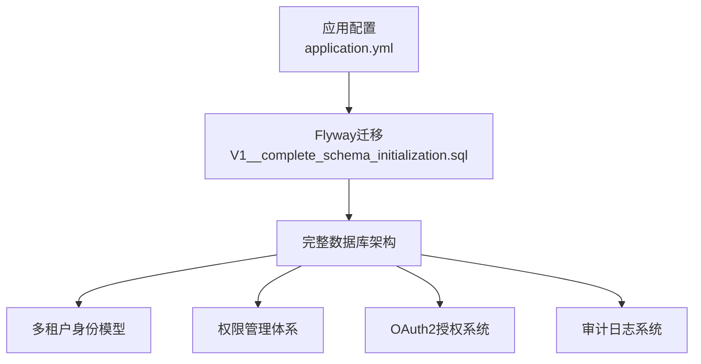
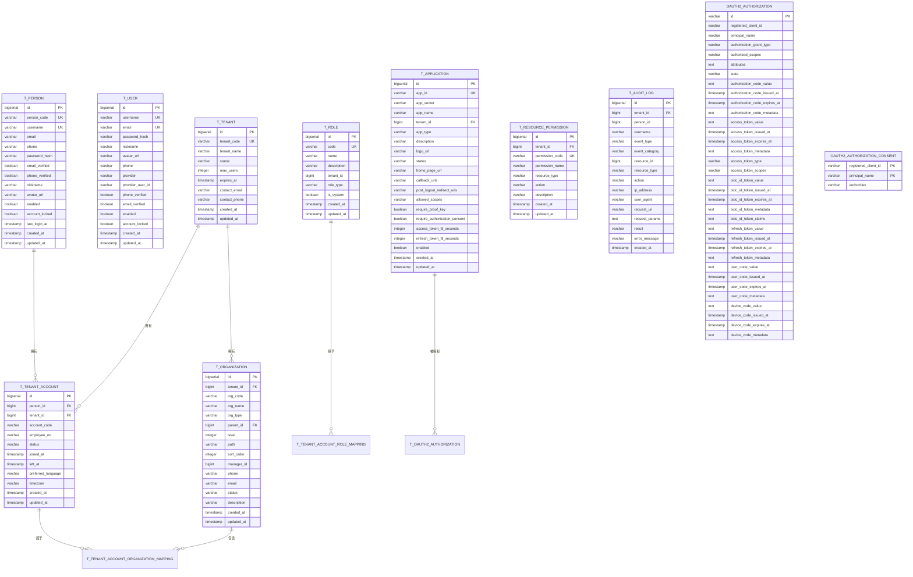
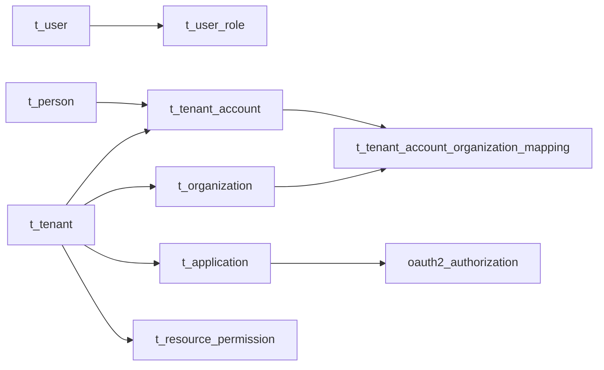
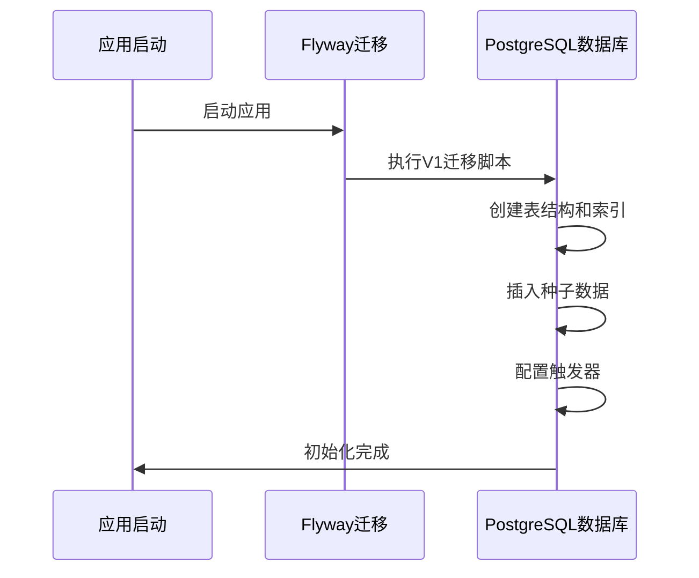

# 数据库表结构

<cite>
**本文档引用的文件**
- [V1__complete_schema_initialization.sql](file://sso-admin-server/src/main/resources/db/migration/V1__complete_schema_initialization.sql)
- [application.yml](file://sso-admin-server/src/main/resources/application.yml)
- [application.yml](file://sso-auth-server/src/main/resources/application.yml)
</cite>

## 更新摘要
**所做更改**
- 更新了迁移脚本文件引用，从旧的增量迁移V1__init_schema_and_seed_roles.sql等更新为新的V1__complete_schema_initialization.sql
- 新增了完整的多租户架构支持，包括t_person、t_tenant、t_tenant_account等核心表
- 扩展了权限管理体系，新增t_application、t_resource_permission、t_role_permission等表
- 更新了审计日志系统，新增t_audit_log表和清理函数
- 完善了种子数据，包含默认角色、系统权限和管理员账户
- 重构了用户认证架构，从单一t_user表扩展为t_person + t_tenant_account双层身份模型

## 目录
1. [简介](#简介)
2. [项目结构](#项目结构)
3. [核心组件](#核心组件)
4. [架构总览](#架构总览)
5. [详细组件分析](#详细组件分析)
6. [依赖分析](#依赖分析)
7. [性能考虑](#性能考虑)
8. [故障排查指南](#故障排查指南)
9. [结论](#结论)
10. [附录](#附录)

## 简介
本文件面向IAM Platform认证服务的完整数据库架构，系统性梳理并解释核心表结构与关系。新架构基于V1__complete_schema_initialization.sql提供完整的数据库初始化，涵盖多租户身份管理、权限控制、审计日志和OAuth2授权等核心功能。文档详细说明所有核心表的设计，包括角色表(t_role)、用户表(t_user)、用户角色关联表(t_user_role)、人员表(t_person)、租户表(t_tenant)、租户账户表(t_tenant_account)、组织表(t_organization)、应用表(t_application)、资源权限表(t_resource_permission)、审计日志表(t_audit_log)以及OAuth2授权相关表。

**更新** 新架构提供了完整的多租户支持和现代化的权限管理体系，替代了原有的简单用户-角色模型。

## 项目结构
数据库初始化通过单一的V1__complete_schema_initialization.sql脚本完成，该脚本合并了原有多个增量迁移文件的功能，提供完整的数据库架构。应用通过Flyway进行版本化迁移管理，开发环境配置支持自动迁移和种子数据注入。

**章节来源**
- [application.yml:32-35](file://sso-admin-server/src/main/resources/application.yml#L32-L35)
- [application.yml:33](file://sso-auth-server/src/main/resources/application.yml#L33)

## 核心组件
本节概述九个核心表的职责与关键字段，构成完整的多租户认证系统：

- t_role 角色表：存储系统和租户自定义角色，支持全局和租户级别的角色管理
- t_user 用户表：遗留兼容表，保持向后兼容性
- t_person 人员表：自然人身份表，提供全局唯一的身份标识
- t_tenant 租户表：多租户架构的核心，管理租户基本信息和状态
- t_tenant_account 租户账户表：人员在租户内的具体账户，支持员工编号和状态管理
- t_organization 组织表：租户内组织架构树，支持部门、团队等层级管理
- t_application 应用表：升级版OAuth2客户端，支持多种应用类型和配置
- t_resource_permission 资源权限表：细粒度权限定义，支持资源类型和操作动作
- t_audit_log 审计日志表：完整的操作审计记录，支持数据保留策略

**更新** 新架构引入了完整的多租户身份模型，从单一用户概念扩展为人员-租户-账户的三层身份体系。

**章节来源**
- [V1__complete_schema_initialization.sql:25-51](file://sso-admin-server/src/main/resources/db/migration/V1__complete_schema_initialization.sql#L25-L51)
- [V1__complete_schema_initialization.sql:52-93](file://sso-admin-server/src/main/resources/db/migration/V1__complete_schema_initialization.sql#L52-L93)
- [V1__complete_schema_initialization.sql:172-198](file://sso-admin-server/src/main/resources/db/migration/V1__complete_schema_initialization.sql#L172-L198)
- [V1__complete_schema_initialization.sql:199-236](file://sso-admin-server/src/main/resources/db/migration/V1__complete_schema_initialization.sql#L199-L236)
- [V1__complete_schema_initialization.sql:237-272](file://sso-admin-server/src/main/resources/db/migration/V1__complete_schema_initialization.sql#L237-L272)
- [V1__complete_schema_initialization.sql:277-320](file://sso-admin-server/src/main/resources/db/migration/V1__complete_schema_initialization.sql#L277-L320)
- [V1__complete_schema_initialization.sql:349-390](file://sso-admin-server/src/main/resources/db/migration/V1__complete_schema_initialization.sql#L349-L390)
- [V1__complete_schema_initialization.sql:418-447](file://sso-admin-server/src/main/resources/db/migration/V1__complete_schema_initialization.sql#L418-L447)
- [V1__complete_schema_initialization.sql:514-559](file://sso-admin-server/src/main/resources/db/migration/V1__complete_schema_initialization.sql#L514-L559)

## 架构总览
下图展示完整的多租户认证架构，包括身份管理、权限控制、组织架构和审计日志的完整数据流。

**图表来源**
- [V1__complete_schema_initialization.sql:25-51](file://sso-admin-server/src/main/resources/db/migration/V1__complete_schema_initialization.sql#L25-L51)
- [V1__complete_schema_initialization.sql:52-93](file://sso-admin-server/src/main/resources/db/migration/V1__complete_schema_initialization.sql#L52-L93)
- [V1__complete_schema_initialization.sql:172-272](file://sso-admin-server/src/main/resources/db/migration/V1__complete_schema_initialization.sql#L172-L272)
- [V1__complete_schema_initialization.sql:277-344](file://sso-admin-server/src/main/resources/db/migration/V1__complete_schema_initialization.sql#L277-L344)
- [V1__complete_schema_initialization.sql:349-480](file://sso-admin-server/src/main/resources/db/migration/V1__complete_schema_initialization.sql#L349-L480)
- [V1__complete_schema_initialization.sql:418-447](file://sso-admin-server/src/main/resources/db/migration/V1__complete_schema_initialization.sql#L418-L447)
- [V1__complete_schema_initialization.sql:514-559](file://sso-admin-server/src/main/resources/db/migration/V1__complete_schema_initialization.sql#L514-L559)

## 详细组件分析

### 表：t_role（角色）
- 主键：自增id（BIGSERIAL）
- 唯一约束：code
- 新增字段：
  - tenant_id：角色所属租户，null表示全局角色
  - role_type：角色类型，SYSTEM或TENANT_CUSTOM
  - is_system：系统内置角色标志
- 索引策略：idx_role_tenant_id（tenant_id）
- 触发器与自动时间戳：update_t_role_updated_at
- 业务含义：支持全局角色和租户自定义角色的统一管理

**章节来源**
- [V1__complete_schema_initialization.sql:25-51](file://sso-admin-server/src/main/resources/db/migration/V1__complete_schema_initialization.sql#L25-L51)

### 表：t_user（用户 - 遗留兼容表）
- 主键：自增id（BIGSERIAL）
- 唯一约束：username、email
- 新增字段：phone、provider、provider_user_id、phone_verified、email_verified
- 索引策略：idx_user_username、idx_user_email、idx_user_phone、idx_user_provider
- 触发器与自动时间戳：update_t_user_updated_at
- 业务含义：保持向后兼容，支持多种认证方式的用户凭证存储

**更新** 作为遗留表继续支持，但主要业务逻辑已迁移到新的身份模型。

**章节来源**
- [V1__complete_schema_initialization.sql:52-93](file://sso-admin-server/src/main/resources/db/migration/V1__complete_schema_initialization.sql#L52-L93)

### 表：t_person（人员）
- 主键：自增id（BIGSERIAL）
- 唯一约束：person_code、username、email（可空）、phone（可空）
- 新增字段：
  - person_code：全局唯一人员编码
  - email_verified、phone_verified：验证标志
  - last_login_at：最后登录时间
- 索引策略：uk_person_code、uk_person_username、uk_person_email、uk_person_phone
- 触发器与自动时间戳：update_t_person_updated_at
- 业务含义：提供全局唯一的人自然人身份标识，支持多租户环境下的身份管理

**章节来源**
- [V1__complete_schema_initialization.sql:199-236](file://sso-admin-server/src/main/resources/db/migration/V1__complete_schema_initialization.sql#L199-L236)

### 表：t_tenant（租户）
- 主键：自增id（BIGSERIAL）
- 唯一约束：tenant_code
- 新增字段：
  - tenant_code：租户唯一编码
  - max_users：最大用户数限制
  - expires_at：租户过期时间
  - contact_email、contact_phone：联系信息
- 索引策略：uk_tenant_code
- 触发器与自动时间戳：update_t_tenant_updated_at
- 业务含义：多租户架构的核心，管理租户的基本信息和状态

**章节来源**
- [V1__complete_schema_initialization.sql:172-198](file://sso-admin-server/src/main/resources/db/migration/V1__complete_schema_initialization.sql#L172-L198)

### 表：t_tenant_account（租户账户）
- 主键：自增id（BIGSERIAL）
- 唯一约束：tenant_id+account_code、tenant_id+employee_no
- 外键约束：person_id → t_person(id)、tenant_id → t_tenant(id)
- 新增字段：
  - account_code：租户内唯一账户编码
  - employee_no：员工编号
  - status：账户状态（ACTIVE/SUSPENDED/LEFT）
  - joined_at、left_at：加入和离开时间
  - preferred_language、timezone：偏好设置
- 索引策略：idx_tenant_account_person_id、idx_tenant_account_tenant_id、idx_tenant_account_status
- 触发器与自动时间戳：update_t_tenant_account_updated_at
- 业务含义：人员在租户内的具体账户实例，支持员工管理和状态跟踪

**章节来源**
- [V1__complete_schema_initialization.sql:237-272](file://sso-admin-server/src/main/resources/db/migration/V1__complete_schema_initialization.sql#L237-L272)

### 表：t_organization（组织）
- 主键：自增id（BIGSERIAL）
- 唯一约束：tenant_id+org_code
- 外键约束：tenant_id → t_tenant(id)、parent_id → t_organization(id)
- 新增字段：
  - org_code：组织编码
  - org_type：组织类型（COMPANY/DEPARTMENT/TEAM）
  - parent_id：父组织ID
  - level：树层级
  - path：物化路径
  - manager_id：管理者租户账户ID
  - sort_order：同级排序
- 索引策略：idx_organization_tenant_id、idx_organization_parent_id、idx_organization_path、idx_organization_level、idx_organization_manager_id
- 触发器与自动时间戳：update_t_organization_updated_at
- 业务含义：支持复杂的组织架构树，提供层级管理和权限继承

**章节来源**
- [V1__complete_schema_initialization.sql:277-320](file://sso-admin-server/src/main/resources/db/migration/V1__complete_schema_initialization.sql#L277-L320)

### 表：t_tenant_account_organization_mapping（租户账户-组织映射）
- 主键：自增id（BIGSERIAL）
- 唯一约束：tenant_account_id+organization_id
- 外键约束：tenant_account_id → t_tenant_account(id)、organization_id → t_organization(id)
- 新增字段：
  - is_primary：是否为主要组织
  - position：职位头衔
  - joined_org_at：加入组织时间
- 索引策略：idx_ta_org_mapping_tenant_account、idx_ta_org_mapping_organization
- 业务含义：支持租户账户在多个组织间的多对多关系，确保主要组织的唯一性

**章节来源**
- [V1__complete_schema_initialization.sql:321-344](file://sso-admin-server/src/main/resources/db/migration/V1__complete_schema_initialization.sql#L321-L344)

### 表：t_application（应用）
- 主键：自增id（BIGSERIAL）
- 唯一约束：app_id
- 外键约束：tenant_id → t_tenant(id)
- 新增字段：
  - app_id：应用唯一标识符
  - app_secret：应用密钥（AES-256-GCM加密）
  - app_type：应用类型（WEB/MOBILE/API/THIRD_PARTY）
  - callback_urls：OAuth2回调URI
  - allowed_scopes：允许的作用域
  - access_token_ttl_seconds、refresh_token_ttl_seconds：令牌有效期
- 索引策略：uk_application_app_id、idx_application_tenant_id、idx_application_status、idx_application_app_type
- 触发器与自动时间戳：update_t_application_updated_at
- 业务含义：升级版OAuth2客户端，支持多种应用类型和安全配置

**章节来源**
- [V1__complete_schema_initialization.sql:349-390](file://sso-admin-server/src/main/resources/db/migration/V1__complete_schema_initialization.sql#L349-L390)

### 表：t_resource_permission（资源权限）
- 主键：自增id（BIGSERIAL）
- 唯一约束：tenant_id+permission_code
- 外键约束：tenant_id → t_tenant(id)
- 新增字段：
  - permission_code：权限代码
  - permission_name：权限显示名
  - resource_type：资源类型
  - action：操作动作（READ/WRITE/DELETE/EXPORT/APPROVE/EXECUTE）
- 索引策略：idx_resource_permission_tenant、idx_resource_permission_resource_type、idx_resource_permission_action
- 触发器与自动时间戳：update_t_resource_permission_updated_at
- 业务含义：细粒度权限定义，支持资源类型和操作动作的组合权限模型

**章节来源**
- [V1__complete_schema_initialization.sql:418-447](file://sso-admin-server/src/main/resources/db/migration/V1__complete_schema_initialization.sql#L418-L447)

### 表：t_audit_log（审计日志）
- 主键：自增id（BIGSERIAL）
- 新增字段：
  - tenant_id：租户ID（可为空）
  - person_id：操作人员ID（可能已被删除）
  - event_type：事件类型
  - event_category：事件类别（AUTHENTICATION/AUTHORIZATION/ACCOUNT/ADMINISTRATION/SESSION）
  - resource_id、resource_type：相关资源
  - action：操作描述
  - ip_address、user_agent：客户端信息
  - request_uri、request_params：请求信息
  - result：操作结果（SUCCESS/FAILURE）
  - error_message：错误信息
- 索引策略：
  - idx_audit_tenant_id、idx_audit_person_id
  - idx_audit_event_type、idx_audit_event_category
  - idx_audit_resource、idx_audit_result
  - idx_audit_created_at、idx_audit_tenant_category_time
- 业务含义：完整的操作审计记录，支持合规性和安全审计需求

**章节来源**
- [V1__complete_schema_initialization.sql:514-559](file://sso-admin-server/src/main/resources/db/migration/V1__complete_schema_initialization.sql#L514-L559)

### OAuth2授权相关表
- oauth2_authorization：Spring Authorization Server标准表，存储授权状态和令牌元数据
- oauth2_authorization_consent：存储用户对客户端的授权同意范围
- 索引策略：对客户端ID、主体名、状态、令牌值建立索引

**章节来源**
- [V1__complete_schema_initialization.sql:111-167](file://sso-admin-server/src/main/resources/db/migration/V1__complete_schema_initialization.sql#L111-L167)

### 触发器与自动时间戳更新机制
- 触发器函数：update_updated_at_column（返回NEW.updated_at = NOW()）
- 自动时间戳：所有支持的表都定义了对应的BEFORE UPDATE触发器
- 应用侧补充：JPA实体通过注解实现创建/更新时间戳管理

**章节来源**
- [V1__complete_schema_initialization.sql:13-19](file://sso-admin-server/src/main/resources/db/migration/V1__complete_schema_initialization.sql#L13-L19)
- [V1__complete_schema_initialization.sql:40-42](file://sso-admin-server/src/main/resources/db/migration/V1__complete_schema_initialization.sql#L40-L42)
- [V1__complete_schema_initialization.sql:76-78](file://sso-admin-server/src/main/resources/db/migration/V1__complete_schema_initialization.sql#L76-L78)
- [V1__complete_schema_initialization.sql:188-190](file://sso-admin-server/src/main/resources/db/migration/V1__complete_schema_initialization.sql#L188-L190)
- [V1__complete_schema_initialization.sql:223-225](file://sso-admin-server/src/main/resources/db/migration/V1__complete_schema_initialization.sql#L223-L225)
- [V1__complete_schema_initialization.sql:260-262](file://sso-admin-server/src/main/resources/db/migration/V1__complete_schema_initialization.sql#L260-L262)
- [V1__complete_schema_initialization.sql:305-307](file://sso-admin-server/src/main/resources/db/migration/V1__complete_schema_initialization.sql#L305-L307)
- [V1__complete_schema_initialization.sql:378-380](file://sso-admin-server/src/main/resources/db/migration/V1__complete_schema_initialization.sql#L378-L380)
- [V1__complete_schema_initialization.sql:409-411](file://sso-admin-server/src/main/resources/db/migration/V1__complete_schema_initialization.sql#L409-L411)
- [V1__complete_schema_initialization.sql:437-439](file://sso-admin-server/src/main/resources/db/migration/V1__complete_schema_initialization.sql#L437-L439)
- [V1__complete_schema_initialization.sql:500-502](file://sso-admin-server/src/main/resources/db/migration/V1__complete_schema_initialization.sql#L500-L502)

### 种子数据与默认配置
- 默认角色：ROLE_USER（普通用户）、ROLE_ADMIN（管理员）
- 默认租户：id=1的默认租户
- 系统权限：包含用户、租户、组织、角色、应用、权限、审计等全量权限
- 管理员账户：admin用户，同时存在于t_user和t_person表中
- 权限分配：ROLE_ADMIN获得所有系统权限，ROLE_USER仅获得读权限

**更新** 新架构提供了完整的种子数据，包括默认角色、系统权限和管理员账户的初始化配置。

**章节来源**
- [V1__complete_schema_initialization.sql:582-585](file://sso-admin-server/src/main/resources/db/migration/V1__complete_schema_initialization.sql#L582-L585)
- [V1__complete_schema_initialization.sql:591-596](file://sso-admin-server/src/main/resources/db/migration/V1__complete_schema_initialization.sql#L591-L596)
- [V1__complete_schema_initialization.sql:602-635](file://sso-admin-server/src/main/resources/db/migration/V1__complete_schema_initialization.sql#L602-L635)
- [V1__complete_schema_initialization.sql:644-656](file://sso-admin-server/src/main/resources/db/migration/V1__complete_schema_initialization.sql#L644-L656)
- [V1__complete_schema_initialization.sql:662-693](file://sso-admin-server/src/main/resources/db/migration/V1__complete_schema_initialization.sql#L662-L693)
- [V1__complete_schema_initialization.sql:699-719](file://sso-admin-server/src/main/resources/db/migration/V1__complete_schema_initialization.sql#L699-L719)

## 依赖分析
- 外键依赖：
  - t_user_role.user_id → t_user.id（CASCADE）
  - t_tenant_account.person_id → t_person.id（RESTRICT）
  - t_tenant_account.tenant_id → t_tenant.id（RESTRICT）
  - t_organization.tenant_id → t_tenant.id（RESTRICT）
  - t_organization.parent_id → t_organization.id（SET NULL）
  - t_tenant_account_organization_mapping.tenant_account_id → t_tenant_account.id（CASCADE）
  - t_tenant_account_organization_mapping.organization_id → t_organization.id（CASCADE）
  - t_application.tenant_id → t_tenant.id（SET NULL）
  - t_resource_permission.tenant_id → t_tenant.id（SET NULL）
  - t_audit_log.tenant_id → t_tenant.id（SET NULL）
- 索引依赖：
  - 多表建立复合索引支持高效的多租户查询
  - OAuth2授权表建立专用索引优化令牌检索
  - 审计日志表建立时间序列索引支持历史查询
- 应用层映射：
  - 新架构支持三层身份模型：t_person → t_tenant_account → 租户内操作
  - 权限继承：租户级权限 → 组织级权限 → 个人级权限

**图表来源**
- [V1__complete_schema_initialization.sql:95-104](file://sso-admin-server/src/main/resources/db/migration/V1__complete_schema_initialization.sql#L95-L104)
- [V1__complete_schema_initialization.sql:240-254](file://sso-admin-server/src/main/resources/db/migration/V1__complete_schema_initialization.sql#L240-L254)
- [V1__complete_schema_initialization.sql:272-297](file://sso-admin-server/src/main/resources/db/migration/V1__complete_schema_initialization.sql#L272-L297)
- [V1__complete_schema_initialization.sql:322-331](file://sso-admin-server/src/main/resources/db/migration/V1__complete_schema_initialization.sql#L322-L331)
- [V1__complete_schema_initialization.sql:349-371](file://sso-admin-server/src/main/resources/db/migration/V1__complete_schema_initialization.sql#L349-L371)
- [V1__complete_schema_initialization.sql:418-447](file://sso-admin-server/src/main/resources/db/migration/V1__complete_schema_initialization.sql#L418-L447)

## 性能考虑
- 索引策略：
  - 多租户查询优化：在所有租户相关表上建立tenant_id索引
  - 身份查询优化：t_person表的唯一索引支持全局身份识别
  - 组织树查询优化：t_organization表的path和level索引支持层级查询
  - 权限查询优化：权限表的resource_type和action索引支持快速权限匹配
  - 审计查询优化：审计日志表的时间序列索引支持历史查询
- 时间戳更新：
  - 统一的触发器机制确保所有表的时间戳一致性
  - 减少应用层重复逻辑，提高性能
- 迁移与一致性：
  - 单一V1迁移脚本确保数据库结构演进的完整性和可追踪性
  - 种子数据的原子性插入保证初始状态的一致性
- 安全考虑：
  - 应用密钥使用AES-256-GCM加密存储
  - 审计日志支持数据保留策略，平衡存储成本和合规需求

**更新** 新架构提供了更完善的索引策略和性能优化方案，支持大规模多租户环境。

**章节来源**
- [V1__complete_schema_initialization.sql:38](file://sso-admin-server/src/main/resources/db/migration/V1__complete_schema_initialization.sql#L38)
- [V1__complete_schema_initialization.sql:218-222](file://sso-admin-server/src/main/resources/db/migration/V1__complete_schema_initialization.sql#L218-L222)
- [V1__complete_schema_initialization.sql:299-304](file://sso-admin-server/src/main/resources/db/migration/V1__complete_schema_initialization.sql#L299-L304)
- [V1__complete_schema_initialization.sql:406-408](file://sso-admin-server/src/main/resources/db/migration/V1__complete_schema_initialization.sql#L406-L408)
- [V1__complete_schema_initialization.sql:534-543](file://sso-admin-server/src/main/resources/db/migration/V1__complete_schema_initialization.sql#L534-L543)

## 故障排查指南
- 迁移失败：
  - 检查Flyway配置与迁移脚本路径
  - 确认数据库连接参数与权限
  - 验证V1迁移脚本的完整性和依赖关系
- 多租户数据隔离：
  - 检查tenant_id字段的正确设置
  - 验证租户间数据的隔离性
  - 确认外键约束的正确性
- 身份模型问题：
  - 检查t_person和t_tenant_account的关联关系
  - 验证人员编码的唯一性
  - 确认租户账户状态的正确性
- 权限系统问题：
  - 验证权限继承链的正确性
  - 检查角色权限映射的完整性
  - 确认资源权限的粒度控制
- 审计日志问题：
  - 检查审计日志的保留策略配置
  - 验证索引的有效性
  - 确认敏感信息的脱敏处理
- 性能问题：
  - 分析慢查询日志
  - 检查索引的使用情况
  - 优化查询计划

**更新** 新架构引入了更多复杂的数据关系，需要特别关注多租户隔离和权限继承的正确性。

**章节来源**
- [application.yml:32-35](file://sso-admin-server/src/main/resources/application.yml#L32-L35)
- [V1__complete_schema_initialization.sql:13-19](file://sso-admin-server/src/main/resources/db/migration/V1__complete_schema_initialization.sql#L13-L19)
- [V1__complete_schema_initialization.sql:561-577](file://sso-admin-server/src/main/resources/db/migration/V1__complete_schema_initialization.sql#L561-L577)

## 结论
新架构基于V1__complete_schema_initialization.sql提供了完整的多租户认证系统，从单一用户概念扩展为人员-租户-账户的三层身份模型。该设计支持复杂的组织架构、细粒度的权限控制、完整的审计日志和现代化的OAuth2授权流程。通过统一的迁移脚本和完善的种子数据，能够快速搭建生产级别的认证服务基础架构。新架构不仅保持了向后兼容性，还为未来的功能扩展奠定了坚实的基础。

**更新** 新架构代表了IAM Platform认证服务的重大升级，提供了企业级的多租户支持和现代化的权限管理体系。

## 附录

### 完整DDL（概要）
以下为各表的DDL概要，具体以V1__complete_schema_initialization.sql为准。

- t_role：角色表，支持全局和租户级别角色管理
- t_user：遗留用户表，保持向后兼容
- t_person：人员表，提供全局唯一身份标识
- t_tenant：租户表，多租户架构核心
- t_tenant_account：租户账户表，人员在租户内的具体账户
- t_organization：组织表，支持复杂的组织架构树
- t_application：应用表，升级版OAuth2客户端
- t_resource_permission：资源权限表，细粒度权限定义
- t_audit_log：审计日志表，完整的操作审计记录
- OAuth2授权表：oauth2_authorization和oauth2_authorization_consent

**更新** 新架构提供了完整的数据库初始化脚本，包含所有核心表和种子数据。

**章节来源**
- [V1__complete_schema_initialization.sql:1-720](file://sso-admin-server/src/main/resources/db/migration/V1__complete_schema_initialization.sql#L1-L720)

### 数据库初始化流程
- 应用启动时通过Flyway自动执行V1迁移
- 创建完整的数据库架构，包括所有核心表和索引
- 插入默认种子数据：角色、租户、权限和管理员账户
- 配置触发器和自动时间戳更新机制
- 启用审计日志系统和数据保留策略

**更新** 新架构通过单一迁移脚本提供完整的数据库初始化流程。

**章节来源**
- [application.yml:32-35](file://sso-admin-server/src/main/resources/application.yml#L32-L35)
- [V1__complete_schema_initialization.sql:582-719](file://sso-admin-server/src/main/resources/db/migration/V1__complete_schema_initialization.sql#L582-L719)