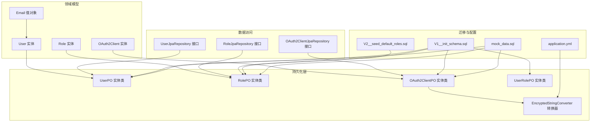
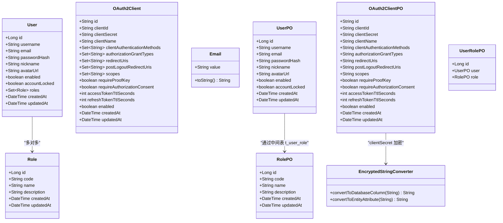
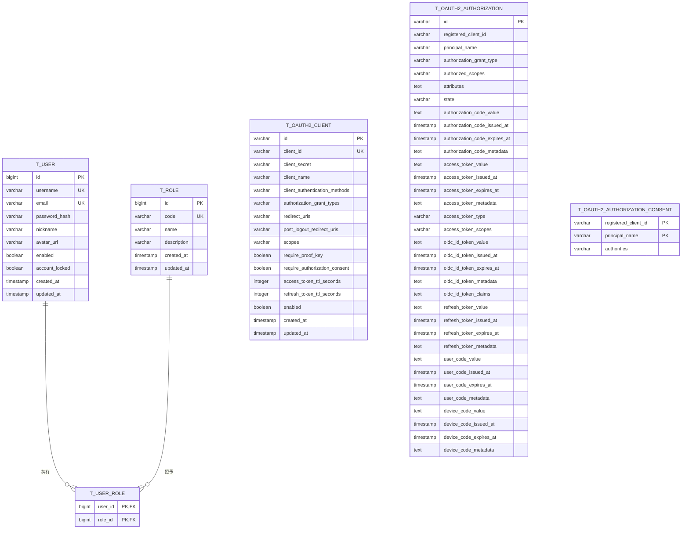
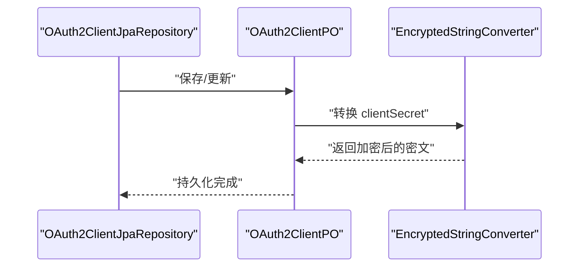
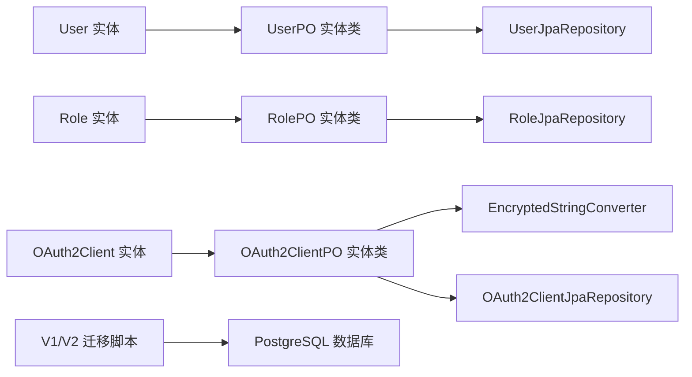

# 数据模型

<cite>
**本文引用的文件**
- [User.java](file://src/main/java/sso/oidc/domain/model/entity/User.java)
- [Role.java](file://src/main/java/sso/oidc/domain/model/entity/Role.java)
- [OAuth2Client.java](file://src/main/java/sso/oidc/domain/model/entity/OAuth2Client.java)
- [Email.java](file://src/main/java/sso/oidc/domain/model/valueobject/Email.java)
- [UserPO.java](file://src/main/java/sso/oidc/infrastructure/persistence/entity/UserPO.java)
- [RolePO.java](file://src/main/java/sso/oidc/infrastructure/persistence/entity/RolePO.java)
- [OAuth2ClientPO.java](file://src/main/java/sso/oidc/infrastructure/persistence/entity/OAuth2ClientPO.java)
- [UserRolePO.java](file://src/main/java/sso/oidc/infrastructure/persistence/entity/UserRolePO.java)
- [EncryptedStringConverter.java](file://src/main/java/sso/oidc/infrastructure/persistence/converter/EncryptedStringConverter.java)
- [UserJpaRepository.java](file://src/main/java/sso/oidc/infrastructure/persistence/repository/UserJpaRepository.java)
- [RoleJpaRepository.java](file://src/main/java/sso/oidc/infrastructure/persistence/repository/RoleJpaRepository.java)
- [OAuth2ClientJpaRepository.java](file://src/main/java/sso/oidc/infrastructure/persistence/repository/OAuth2ClientJpaRepository.java)
- [V1__init_schema.sql](file://src/main/resources/db/migration/V1__init_schema.sql)
- [V2__seed_default_roles.sql](file://src/main/resources/db/migration/V2__seed_default_roles.sql)
- [mock_data.sql](file://src/main/resources/db/dev/mock_data.sql)
- [application.yml](file://src/main/resources/application.yml)
</cite>

## 目录
1. [简介](#简介)
2. [项目结构](#项目结构)
3. [核心组件](#核心组件)
4. [架构总览](#架构总览)
5. [详细组件分析](#详细组件分析)
6. [依赖分析](#依赖分析)
7. [性能考量](#性能考量)
8. [故障排查指南](#故障排查指南)
9. [结论](#结论)
10. [附录](#附录)

## 简介
本文件面向IAM Platform认证服务，系统性梳理数据模型与持久化层设计，覆盖以下主题：
- 数据库表结构与实体关系（用户、角色、OAuth2客户端、授权记录等）
- 值对象设计理念与使用场景（如Email值对象）
- Flyway迁移脚本的版本管理与演进
- 数据访问模式、缓存策略与性能优化
- 数据完整性约束、索引设计与查询优化建议
- ER图与数据字典，帮助开发者快速理解业务规则与数据结构

## 项目结构
围绕数据模型与持久化的目录组织如下：
- 领域模型：位于domain/model，包含实体与值对象
- 持久化实体：位于infrastructure/persistence/entity，映射数据库表
- JPA仓库接口：位于infrastructure/persistence/repository，定义数据访问方法
- 迁移脚本：位于resources/db/migration，采用Flyway版本化管理
- 开发环境种子数据：位于resources/db/dev，用于本地开发初始化

图表来源
- [User.java:1-36](file://src/main/java/sso/oidc/domain/model/entity/User.java#L1-L36)
- [Role.java:1-22](file://src/main/java/sso/oidc/domain/model/entity/Role.java#L1-L22)
- [OAuth2Client.java:1-69](file://src/main/java/sso/oidc/domain/model/entity/OAuth2Client.java#L1-L69)
- [Email.java:1-31](file://src/main/java/sso/oidc/domain/model/valueobject/Email.java#L1-L31)
- [UserPO.java:1-76](file://src/main/java/sso/oidc/infrastructure/persistence/entity/UserPO.java#L1-L76)
- [RolePO.java:1-53](file://src/main/java/sso/oidc/infrastructure/persistence/entity/RolePO.java#L1-L53)
- [OAuth2ClientPO.java:1-101](file://src/main/java/sso/oidc/infrastructure/persistence/entity/OAuth2ClientPO.java#L1-L101)
- [UserRolePO.java:1-37](file://src/main/java/sso/oidc/infrastructure/persistence/entity/UserRolePO.java#L1-L37)
- [EncryptedStringConverter.java:1-52](file://src/main/java/sso/oidc/infrastructure/persistence/converter/EncryptedStringConverter.java#L1-L52)
- [UserJpaRepository.java:1-17](file://src/main/java/sso/oidc/infrastructure/persistence/repository/UserJpaRepository.java#L1-L17)
- [RoleJpaRepository.java:1-11](file://src/main/java/sso/oidc/infrastructure/persistence/repository/RoleJpaRepository.java#L1-L11)
- [OAuth2ClientJpaRepository.java:1-11](file://src/main/java/sso/oidc/infrastructure/persistence/repository/OAuth2ClientJpaRepository.java#L1-L11)
- [V1__init_schema.sql:1-180](file://src/main/resources/db/migration/V1__init_schema.sql#L1-L180)
- [V2__seed_default_roles.sql:1-9](file://src/main/resources/db/migration/V2__seed_default_roles.sql#L1-L9)
- [mock_data.sql:1-38](file://src/main/resources/db/dev/mock_data.sql#L1-L38)
- [application.yml:1-78](file://src/main/resources/application.yml#L1-L78)

章节来源
- [application.yml:1-78](file://src/main/resources/application.yml#L1-L78)

## 核心组件
本节聚焦于核心数据实体与值对象，说明其字段、约束与在系统中的职责。

- 用户实体（User）
  - 字段要点：标识、用户名、邮箱、密码哈希、昵称、头像、启用状态、锁定状态、角色集合、创建/更新时间
  - 关系：与角色通过多对多关联（中间表t_user_role）
  - 复杂度：角色集合懒加载与空值保护，避免空指针

- 角色实体（Role）
  - 字段要点：标识、唯一编码、名称、描述、创建/更新时间
  - 约束：编码唯一，确保权限语义清晰

- OAuth2客户端实体（OAuth2Client）
  - 字段要点：标识、clientId、clientSecret（加密存储）、clientName、认证方式集合、授权类型集合、重定向URI集合、后登出回调URI集合、作用域集合、是否要求PKCE、是否要求授权同意、令牌有效期、启用状态、创建/更新时间
  - 约束：clientId唯一；部分字段以逗号分隔字符串存储集合类型

- 值对象（Email）
  - 设计理念：不可变、校验构造、相等基于值
  - 使用场景：作为User实体的邮箱属性，保证格式合法性

章节来源
- [User.java:1-36](file://src/main/java/sso/oidc/domain/model/entity/User.java#L1-L36)
- [Role.java:1-22](file://src/main/java/sso/oidc/domain/model/entity/Role.java#L1-L22)
- [OAuth2Client.java:1-69](file://src/main/java/sso/oidc/domain/model/entity/OAuth2Client.java#L1-L69)
- [Email.java:1-31](file://src/main/java/sso/oidc/domain/model/valueobject/Email.java#L1-L31)

## 架构总览
下图展示数据模型与持久化层的类关系，以及与数据库表的映射：

图表来源
- [User.java:1-36](file://src/main/java/sso/oidc/domain/model/entity/User.java#L1-L36)
- [Role.java:1-22](file://src/main/java/sso/oidc/domain/model/entity/Role.java#L1-L22)
- [OAuth2Client.java:1-69](file://src/main/java/sso/oidc/domain/model/entity/OAuth2Client.java#L1-L69)
- [Email.java:1-31](file://src/main/java/sso/oidc/domain/model/valueobject/Email.java#L1-L31)
- [UserPO.java:1-76](file://src/main/java/sso/oidc/infrastructure/persistence/entity/UserPO.java#L1-L76)
- [RolePO.java:1-53](file://src/main/java/sso/oidc/infrastructure/persistence/entity/RolePO.java#L1-L53)
- [OAuth2ClientPO.java:1-101](file://src/main/java/sso/oidc/infrastructure/persistence/entity/OAuth2ClientPO.java#L1-L101)
- [UserRolePO.java:1-37](file://src/main/java/sso/oidc/infrastructure/persistence/entity/UserRolePO.java#L1-L37)
- [EncryptedStringConverter.java:1-52](file://src/main/java/sso/oidc/infrastructure/persistence/converter/EncryptedStringConverter.java#L1-L52)

## 详细组件分析

### 用户与角色：多对多关系与中间表
- 实体关系
  - User与Role通过UserRolePO建立多对多关系
  - 中间表t_user_role包含user_id与role_id，联合主键保证唯一性
  - 删除级联：当用户或角色被删除时，中间表记录同步清理

- 数据一致性
  - 通过联合主键避免重复授权
  - 通过外键约束保证引用完整性

图表来源
- [V1__init_schema.sql:1-180](file://src/main/resources/db/migration/V1__init_schema.sql#L1-L180)

章节来源
- [User.java:1-36](file://src/main/java/sso/oidc/domain/model/entity/User.java#L1-L36)
- [Role.java:1-22](file://src/main/java/sso/oidc/domain/model/entity/Role.java#L1-L22)
- [UserRolePO.java:1-37](file://src/main/java/sso/oidc/infrastructure/persistence/entity/UserRolePO.java#L1-L37)
- [UserPO.java:1-76](file://src/main/java/sso/oidc/infrastructure/persistence/entity/UserPO.java#L1-L76)
- [RolePO.java:1-53](file://src/main/java/sso/oidc/infrastructure/persistence/entity/RolePO.java#L1-L53)
- [V1__init_schema.sql:70-79](file://src/main/resources/db/migration/V1__init_schema.sql#L70-L79)

### OAuth2客户端：加密存储与集合字段
- 客户端密钥加密
  - 使用EncryptedStringConverter对client_secret进行加解密
  - 加密密钥从环境变量读取，需在生产环境正确配置

- 集合字段设计
  - 认证方式、授权类型、重定向URI、后登出回调URI、作用域均以逗号分隔字符串存储
  - 优点：简化单表结构；缺点：查询与维护复杂度上升

- 主键与唯一性
  - 实体主键为UUID字符串；数据库主键为VARCHAR(36)，client_id唯一

图表来源
- [OAuth2ClientJpaRepository.java:1-11](file://src/main/java/sso/oidc/infrastructure/persistence/repository/OAuth2ClientJpaRepository.java#L1-L11)
- [OAuth2ClientPO.java:1-101](file://src/main/java/sso/oidc/infrastructure/persistence/entity/OAuth2ClientPO.java#L1-L101)
- [EncryptedStringConverter.java:1-52](file://src/main/java/sso/oidc/infrastructure/persistence/converter/EncryptedStringConverter.java#L1-L52)

章节来源
- [OAuth2ClientPO.java:1-101](file://src/main/java/sso/oidc/infrastructure/persistence/entity/OAuth2ClientPO.java#L1-L101)
- [EncryptedStringConverter.java:1-52](file://src/main/java/sso/oidc/infrastructure/persistence/converter/EncryptedStringConverter.java#L1-L52)
- [OAuth2ClientJpaRepository.java:1-11](file://src/main/java/sso/oidc/infrastructure/persistence/repository/OAuth2ClientJpaRepository.java#L1-L11)

### 授权记录：Spring Authorization Server集成
- 表结构
  - t_oauth2_authorization：存储授权码、访问令牌、ID Token、刷新令牌等全生命周期信息
  - t_oauth2_authorization_consent：存储用户对客户端的作用域授权同意

- 索引设计
  - 对registered_client_id、principal_name、state、access_token_value、refresh_token_value建立索引，提升查询效率

- 业务意义
  - 支持OIDC授权流程与令牌发放、刷新、撤销等操作

章节来源
- [V1__init_schema.sql:120-179](file://src/main/resources/db/migration/V1__init_schema.sql#L120-L179)

### 值对象：Email
- 不可变性与校验
  - 构造函数中验证邮箱格式，非法输入抛出异常
  - equals/hashCode基于值，便于集合与缓存使用

- 应用位置
  - 可用于User实体的邮箱字段，或在DTO/Assembler中进行转换与校验

章节来源
- [Email.java:1-31](file://src/main/java/sso/oidc/domain/model/valueobject/Email.java#L1-L31)

### 数据访问模式与缓存策略
- 数据访问
  - JPA仓库接口提供按用户名、邮箱、clientId等常用查询
  - UserJpaRepository还提供存在性检查，减少不必要的加载

- 缓存策略
  - application.yml启用Redis会话存储，提升会话访问性能
  - 可结合Redis对热点用户信息、角色列表、OAuth2客户端元数据进行缓存

章节来源
- [UserJpaRepository.java:1-17](file://src/main/java/sso/oidc/infrastructure/persistence/repository/UserJpaRepository.java#L1-L17)
- [RoleJpaRepository.java:1-11](file://src/main/java/sso/oidc/infrastructure/persistence/repository/RoleJpaRepository.java#L1-L11)
- [OAuth2ClientJpaRepository.java:1-11](file://src/main/java/sso/oidc/infrastructure/persistence/repository/OAuth2ClientJpaRepository.java#L1-L11)
- [application.yml:28-46](file://src/main/resources/application.yml#L28-L46)

## 依赖分析
- 实体到持久化类的映射
  - User → UserPO
  - Role → RolePO
  - OAuth2Client → OAuth2ClientPO
  - 多对多关系通过UserRolePO连接

- 外部依赖
  - Flyway负责数据库迁移与版本控制
  - Spring Data JPA负责ORM与查询生成
  - Spring Security与Spring Authorization Server集成OIDC协议

图表来源
- [User.java:1-36](file://src/main/java/sso/oidc/domain/model/entity/User.java#L1-L36)
- [Role.java:1-22](file://src/main/java/sso/oidc/domain/model/entity/Role.java#L1-L22)
- [OAuth2Client.java:1-69](file://src/main/java/sso/oidc/domain/model/entity/OAuth2Client.java#L1-L69)
- [UserPO.java:1-76](file://src/main/java/sso/oidc/infrastructure/persistence/entity/UserPO.java#L1-L76)
- [RolePO.java:1-53](file://src/main/java/sso/oidc/infrastructure/persistence/entity/RolePO.java#L1-L53)
- [OAuth2ClientPO.java:1-101](file://src/main/java/sso/oidc/infrastructure/persistence/entity/OAuth2ClientPO.java#L1-L101)
- [EncryptedStringConverter.java:1-52](file://src/main/java/sso/oidc/infrastructure/persistence/converter/EncryptedStringConverter.java#L1-L52)
- [UserJpaRepository.java:1-17](file://src/main/java/sso/oidc/infrastructure/persistence/repository/UserJpaRepository.java#L1-L17)
- [RoleJpaRepository.java:1-11](file://src/main/java/sso/oidc/infrastructure/persistence/repository/RoleJpaRepository.java#L1-L11)
- [OAuth2ClientJpaRepository.java:1-11](file://src/main/java/sso/oidc/infrastructure/persistence/repository/OAuth2ClientJpaRepository.java#L1-L11)
- [V1__init_schema.sql:1-180](file://src/main/resources/db/migration/V1__init_schema.sql#L1-L180)

## 性能考量
- 索引优化
  - t_user：username、email唯一索引，满足登录与注册场景高频查询
  - t_oauth2_authorization：对registered_client_id、principal_name、access_token_value、refresh_token_value建立索引，支撑授权查询与令牌校验

- 查询优化建议
  - 避免N+1查询：在加载User时预取角色集合
  - 合理使用投影查询：仅选择必要字段，减少网络与序列化开销
  - 分页查询：对列表接口使用分页，避免一次性加载大量数据

- 缓存策略
  - 将常用查询结果（如用户详情、角色列表、OAuth2客户端元数据）放入Redis
  - 设置合理的过期时间，结合失效策略保证一致性

- 连接池与事务
  - application.yml中配置了Hikari连接池参数，建议根据QPS调优最大连接数与超时时间

章节来源
- [V1__init_schema.sql:53-58](file://src/main/resources/db/migration/V1__init_schema.sql#L53-L58)
- [V1__init_schema.sql:161-165](file://src/main/resources/db/migration/V1__init_schema.sql#L161-L165)
- [application.yml:13-18](file://src/main/resources/application.yml#L13-L18)

## 故障排查指南
- 邮箱格式错误
  - 现象：创建/更新用户时抛出非法参数异常
  - 排查：确认Email值对象构造参数符合邮箱格式规范

- 密钥未配置导致加密失败
  - 现象：保存OAuth2Client时抛出运行时异常
  - 排查：检查环境变量ENCRYPTION_KEY是否设置且有效

- Flyway迁移失败
  - 现象：应用启动时报迁移错误
  - 排查：核对迁移脚本版本顺序、数据库权限、SQL语法；确认Flyway配置正确

- 会话存储问题
  - 现象：登录后会话丢失或无法共享
  - 排查：检查Redis连接配置与密码；确认session.store-type=redis已启用

章节来源
- [Email.java:19-24](file://src/main/java/sso/oidc/domain/model/valueobject/Email.java#L19-L24)
- [EncryptedStringConverter.java:9-33](file://src/main/java/sso/oidc/infrastructure/persistence/converter/EncryptedStringConverter.java#L9-L33)
- [application.yml:32-36](file://src/main/resources/application.yml#L32-L36)
- [application.yml:28-46](file://src/main/resources/application.yml#L28-L46)

## 结论
本数据模型以清晰的实体边界与值对象封装为基础，结合Flyway版本化迁移与JPA仓库接口，实现了用户、角色、OAuth2客户端与授权记录的完整闭环。通过合理的索引与缓存策略，可在保证数据一致性的前提下提升查询与会话性能。建议在生产环境中完善密钥管理、监控与容量规划，并持续优化查询路径与缓存命中率。

## 附录

### 数据字典
- t_user
  - 字段：id、username（UNIQUE）、email（UNIQUE）、password_hash、nickname、avatar_url、enabled、account_locked、created_at、updated_at
  - 约束：主键、username与email唯一
  - 索引：idx_user_username、idx_user_email

- t_role
  - 字段：id、code（UNIQUE）、name、description、created_at、updated_at
  - 约束：主键、code唯一

- t_user_role
  - 字段：user_id、role_id
  - 约束：联合主键；user_id、role_id分别引用t_user.id与t_role.id，删除级联

- t_oauth2_client
  - 字段：id（PK）、client_id（UNIQUE）、client_secret（加密）、client_name、client_authentication_methods、authorization_grant_types、redirect_uris、post_logout_redirect_uris、scopes、require_proof_key、require_authorization_consent、access_token_ttl_seconds、refresh_token_ttl_seconds、enabled、created_at、updated_at

- t_oauth2_authorization
  - 字段：id（PK）、registered_client_id、principal_name、authorization_grant_type、authorized_scopes、attributes、state、authorization_code_*、access_token_*、oidc_id_token_*、refresh_token_*、user_code_*、device_code_*
  - 索引：registered_client_id、principal_name、state、access_token_value、refresh_token_value

- t_oauth2_authorization_consent
  - 字段：registered_client_id、principal_name、authorities
  - 约束：联合主键

章节来源
- [V1__init_schema.sql:17-179](file://src/main/resources/db/migration/V1__init_schema.sql#L17-L179)

### 迁移脚本版本管理
- V1__init_schema.sql
  - 初始化所有核心表结构与触发器函数
  - 创建更新时间自动更新机制与必要索引

- V2__seed_default_roles.sql
  - 插入默认角色（ROLE_USER、ROLE_ADMIN），幂等处理

- 开发环境种子数据
  - mock_data.sql：插入示例管理员用户、绑定角色、演示OAuth2客户端，避免冲突

章节来源
- [V1__init_schema.sql:1-180](file://src/main/resources/db/migration/V1__init_schema.sql#L1-L180)
- [V2__seed_default_roles.sql:1-9](file://src/main/resources/db/migration/V2__seed_default_roles.sql#L1-L9)
- [mock_data.sql:1-38](file://src/main/resources/db/dev/mock_data.sql#L1-L38)