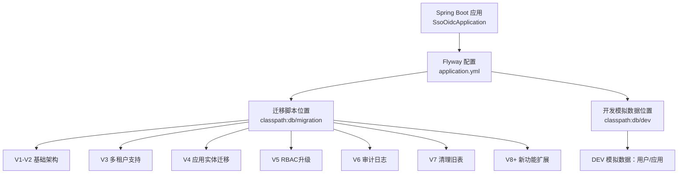
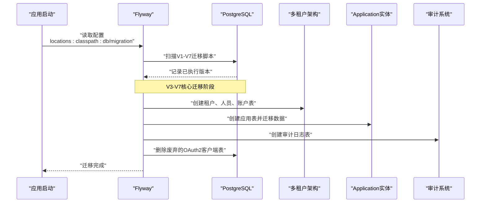
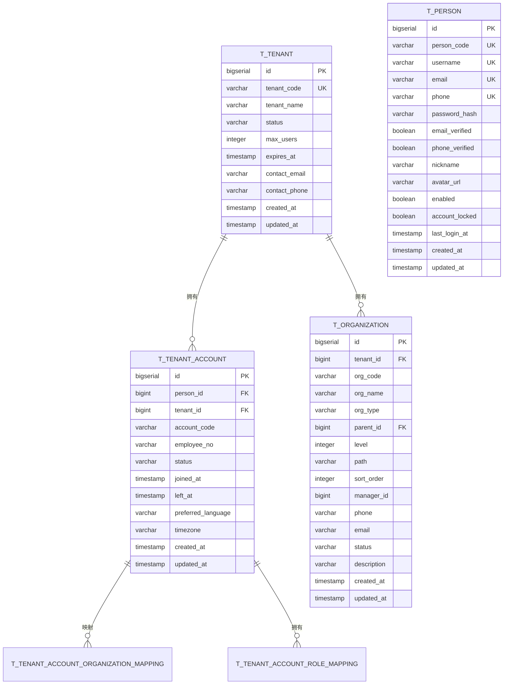
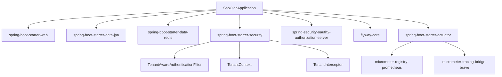
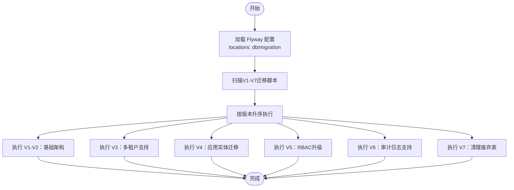

# 数据迁移策略

<cite>
**本文引用的文件**
- [V1__init_schema_and_seed_roles.sql](file://src/main/resources/db/migration/V1__init_schema_and_seed_roles.sql)
- [V2__add_sms_email_oauth2_login.sql](file://src/main/resources/db/migration/V2__add_sms_email_oauth2_login.sql)
- [V3__add_multi_tenant_support.sql](file://src/main/resources/db/migration/V3__add_multi_tenant_support.sql)
- [V4__migrate_oauth2_client_to_application.sql](file://src/main/resources/db/migration/V4__migrate_oauth2_client_to_application.sql)
- [V5__upgrade_rbac_with_tenant_and_permissions.sql](file://src/main/resources/db/migration/V5__upgrade_rbac_with_tenant_and_permissions.sql)
- [V6__add_audit_log_support.sql](file://src/main/resources/db/migration/V6__add_audit_log_support.sql)
- [V7__remove_deprecated_oauth2_client_table.sql](file://src/main/resources/db/migration/V7__remove_deprecated_oauth2_client_table.sql)
- [application.yml](file://src/main/resources/application.yml)
- [application-dev.yml](file://src/main/resources/application-dev.yml)
- [application-prod.yml](file://src/main/resources/application-prod.yml)
- [pom.xml](file://pom.xml)
- [SsoOidcApplication.java](file://src/main/java/sso/oidc/SsoOidcApplication.java)
- [Application.java](file://src/main/java/sso/oidc/domain/model/entity/Application.java)
- [Tenant.java](file://src/main/java/sso/oidc/domain/model/entity/Tenant.java)
- [Person.java](file://src/main/java/sso/oidc/domain/model/entity/Person.java)
- [TenantAccount.java](file://src/main/java/sso/oidc/domain/model/entity/TenantAccount.java)
- [Organization.java](file://src/main/java/sso/oidc/domain/model/entity/Organization.java)
- [ApplicationPO.java](file://src/main/java/sso/oidc/infrastructure/persistence/entity/ApplicationPO.java)
- [TenantPO.java](file://src/main/java/sso/oidc/infrastructure/persistence/entity/TenantPO.java)
- [PersonPO.java](file://src/main/java/sso/oidc/infrastructure/persistence/entity/PersonPO.java)
- [TenantAccountPO.java](file://src/main/java/sso/oidc/infrastructure/persistence/entity/TenantAccountPO.java)
- [OrganizationPO.java](file://src/main/java/sso/oidc/infrastructure/persistence/entity/OrganizationPO.java)
- [ApplicationRepository.java](file://src/main/java/sso/oidc/domain/repository/ApplicationRepository.java)
- [TenantRepository.java](file://src/main/java/sso/oidc/domain/repository/TenantRepository.java)
- [PersonRepository.java](file://src/main/java/sso/oidc/domain/repository/PersonRepository.java)
- [TenantAccountRepository.java](file://src/main/java/sso/oidc/domain/repository/TenantAccountRepository.java)
- [OrganizationRepository.java](file://src/main/java/sso/oidc/domain/repository/OrganizationRepository.java)
- [ApplicationRepositoryImpl.java](file://src/main/java/sso/oidc/infrastructure/persistence/repository/ApplicationJpaRepository.java)
- [TenantRepositoryImpl.java](file://src/main/java/sso/oidc/infrastructure/persistence/repository/TenantJpaRepository.java)
- [PersonRepositoryImpl.java](file://src/main/java/sso/oidc/infrastructure/persistence/repository/PersonJpaRepository.java)
- [TenantAccountRepositoryImpl.java](file://src/main/java/sso/oidc/infrastructure/persistence/repository/TenantAccountJpaRepository.java)
- [OrganizationRepositoryImpl.java](file://src/main/java/sso/oidc/infrastructure/persistence/repository/OrganizationJpaRepository.java)
- [TenantAwareAuthenticationFilter.java](file://src/main/java/sso/oidc/infrastructure/security/TenantAwareAuthenticationFilter.java)
- [TenantContext.java](file://src/main/java/sso/oidc/infrastructure/security/TenantContext.java)
- [TenantInterceptor.java](file://src/main/java/sso/oidc/infrastructure/security/TenantInterceptor.java)
- [DEPLOYMENT.md](file://DEPLOYMENT.md)
- [deployment.yaml](file://k8s/base/deployment.yaml)
- [secret.yaml](file://k8s/base/secret.yaml)
</cite>

## 更新摘要
**所做更改**
- 新增V3-V7多租户支持完整迁移方案详解
- 详细说明从OAuth2客户端到Application实体的架构重构
- 更新多租户RBAC权限模型和审计日志系统
- 补充完整的迁移流程图和操作指南
- 增强生产环境部署和监控告警机制

## 目录
1. [简介](#简介)
2. [项目结构](#项目结构)
3. [核心组件](#核心组件)
4. [架构总览](#架构总览)
5. [详细组件分析](#详细组件分析)
6. [依赖分析](#依赖分析)
7. [性能考虑](#性能考虑)
8. [故障排查指南](#故障排查指南)
9. [结论](#结论)
10. [附录](#附录)

## 简介
本文件面向IAM Platform认证服务的全面数据迁移策略，系统性阐述基于Flyway的数据库迁移方案。该方案涵盖了从单租户架构到多租户支持的完整演进路径，包括V1-V7的完整迁移序列，重点展示了OAuth2客户端到Application实体的架构重构、多租户RBAC权限模型升级以及审计日志系统的引入。文档详细说明了迁移脚本命名规范、版本管理策略、执行顺序、初始Schema设计思路、默认角色种子数据策略、开发环境模拟数据导入机制、迁移编写规范、回滚策略以及生产环境部署注意事项，并提供完整的迁移流程图与操作指南。

## 项目结构
本项目采用Spring Boot + Flyway + PostgreSQL架构，数据库迁移脚本位于resources/db/migration目录。迁移脚本按照功能模块分为多个版本：V1-V2为基础架构，V3-V7为多租户重构。Flyway通过classpath:db/migration加载迁移脚本；开发环境额外加载db/dev目录用于导入示例数据。

**图表来源**
- [application.yml:32-36](file://src/main/resources/application.yml#L32-L36)
- [application-dev.yml:7-8](file://src/main/resources/application-dev.yml#L7-L8)

**章节来源**
- [application.yml:32-36](file://src/main/resources/application.yml#L32-L36)
- [application-dev.yml:7-8](file://src/main/resources/application-dev.yml#L7-L8)

## 核心组件
- **Flyway迁移框架**：自动检测并执行classpath:db/migration下的SQL脚本，按版本号升序执行，确保数据库Schema与应用一致。
- **多租户架构**：通过V3-V7系列脚本实现从单租户到多租户的平滑迁移，支持租户隔离、用户账户管理和组织架构管理。
- **Application实体**：替代原有的OAuth2客户端实体，提供更丰富的应用管理功能，包括应用类型、回调地址、权限范围等。
- **增强RBAC模型**：升级角色权限系统，支持多租户上下文下的资源权限管理。
- **审计日志系统**：提供完整的操作审计功能，支持租户级别的审计记录管理。

**章节来源**
- [V3__add_multi_tenant_support.sql:1-315](file://src/main/resources/db/migration/V3__add_multi_tenant_support.sql#L1-L315)
- [V4__migrate_oauth2_client_to_application.sql:1-131](file://src/main/resources/db/migration/V4__migrate_oauth2_client_to_application.sql#L1-L131)
- [V5__upgrade_rbac_with_tenant_and_permissions.sql:1-149](file://src/main/resources/db/migration/V5__upgrade_rbac_with_tenant_and_permissions.sql#L1-L149)
- [V6__add_audit_log_support.sql:1-94](file://src/main/resources/db/migration/V6__add_audit_log_support.sql#L1-L94)

## 架构总览
下图展示多租户架构重构的完整迁移执行流程，包括从OAuth2客户端到Application实体的转换过程。

**图表来源**
- [application.yml:32-36](file://src/main/resources/application.yml#L32-L36)
- [V3__add_multi_tenant_support.sql:243-315](file://src/main/resources/db/migration/V3__add_multi_tenant_support.sql#L243-L315)
- [V4__migrate_oauth2_client_to_application.sql:84-124](file://src/main/resources/db/migration/V4__migrate_oauth2_client_to_application.sql#L84-L124)

## 详细组件分析

### 迁移脚本命名规范与版本管理
- **命名格式**：V{版本}__{描述}.sql，如V1__init_schema_and_seed_roles.sql、V3__add_multi_tenant_support.sql。
- **版本顺序**：Flyway按版本号升序执行，确保Schema演进的确定性。
- **功能分层**：
  - V1-V2：基础架构（用户、角色、OAuth2客户端）
  - V3：多租户支持（租户、人员、账户、组织）
  - V4：应用实体迁移（OAuth2客户端到Application）
  - V5：RBAC升级（资源权限、角色权限）
  - V6：审计日志支持
  - V7：清理废弃表

**章节来源**
- [V1__init_schema_and_seed_roles.sql:1-5](file://src/main/resources/db/migration/V1__init_schema_and_seed_roles.sql#L1-L5)
- [V3__add_multi_tenant_support.sql:2-7](file://src/main/resources/db/migration/V3__add_multi_tenant_support.sql#L2-L7)
- [V4__migrate_oauth2_client_to_application.sql:1-5](file://src/main/resources/db/migration/V4__migrate_oauth2_client_to_application.sql#L1-L5)

### 多租户支持迁移脚本（V3__add_multi_tenant_support.sql）
**更新** 新增完整的多租户架构支持，替代原有的单租户设计。

- **设计目标**：实现从单租户到多租户的架构重构，支持租户隔离、用户账户管理和组织架构管理。
- **核心表结构**：
  - t_tenant：租户表，包含租户代码、名称、状态、配额等信息
  - t_person：自然人身份表，支持全局唯一标识和多租户账户映射
  - t_tenant_account：租户账户表，连接人员与租户的多对多关系
  - t_organization：组织架构树形表，支持部门、团队等组织层级
  - t_tenant_account_organization_mapping：租户账户与组织的映射关系
  - t_tenant_account_role_mapping：租户账户与角色的映射关系
  - t_person_external_login：第三方登录信息表

- **数据迁移策略**：
  - 创建默认租户（ID=1）用于历史数据迁移
  - 将t_user表数据迁移到t_person和t_tenant_account
  - 维护用户角色映射关系
  - 保留第三方登录信息

**图表来源**
- [V3__add_multi_tenant_support.sql:12-161](file://src/main/resources/db/migration/V3__add_multi_tenant_support.sql#L12-L161)
- [V3__add_multi_tenant_support.sql:165-207](file://src/main/resources/db/migration/V3__add_multi_tenant_support.sql#L165-L207)

**章节来源**
- [V3__add_multi_tenant_support.sql:8-315](file://src/main/resources/db/migration/V3__add_multi_tenant_support.sql#L8-L315)

### OAuth2客户端到Application实体迁移（V4__migrate_oauth2_client_to_application.sql）
**更新** 详细说明从OAuth2客户端到Application实体的架构重构。

- **迁移目标**：将原有的OAuth2客户端概念升级为更通用的应用实体，支持多租户上下文下的应用管理。
- **新实体设计**：
  - t_application：应用表，包含应用ID、密钥、名称、类型、状态等
  - t_application_permission：应用级权限表，支持细粒度权限控制
- **字段映射策略**：
  - client_id → app_id（应用唯一标识）
  - client_secret → app_secret（应用密钥）
  - client_name → app_name（应用名称）
  - redirect_uris → callback_urls（回调地址）
  - scopes → allowed_scopes（允许的作用域）
  - 新增tenant_id字段指向默认租户
  - 新增app_type字段，默认为THIRD_PARTY

- **数据迁移流程**：
  1. 迁移OAuth2客户端到Application表
  2. 设置默认租户ID（1）
  3. 设置应用类型为THIRD_PARTY
  4. 设置应用状态为ACTIVE
  5. 重置序列避免ID冲突

**章节来源**
- [V4__migrate_oauth2_client_to_application.sql:1-131](file://src/main/resources/db/migration/V4__migrate_oauth2_client_to_application.sql#L1-L131)

### RBAC权限模型升级（V5__upgrade_rbac_with_tenant_and_permissions.sql）
**更新** 新增多租户上下文下的资源权限管理。

- **角色系统升级**：
  - 为t_role表添加tenant_id、role_type、is_system列
  - 支持系统内置角色和租户自定义角色
  - 标记现有角色为系统角色

- **资源权限系统**：
  - t_resource_permission：资源权限表，支持多租户权限
  - t_role_permission：角色-权限映射表
  - 支持READ、WRITE、DELETE、EXPORT、APPROVE、EXECUTE等操作类型

- **系统权限种子数据**：
  - 用户管理权限：user:read、user:write、user:delete、user:export
  - 租户管理权限：tenant:read、tenant:write、tenant:delete、tenant:activate、tenant:suspend
  - 组织管理权限：org:read、org:write、org:delete
  - 角色管理权限：role:read、role:write、role:delete、role:assign
  - 应用管理权限：app:read、app:write、app:delete、app:activate、app:block
  - 权限管理权限：permission:read、permission:write、permission:assign
  - 审计日志权限：audit:read、audit:export

**章节来源**
- [V5__upgrade_rbac_with_tenant_and_permissions.sql:1-149](file://src/main/resources/db/migration/V5__upgrade_rbac_with_tenant_and_permissions.sql#L1-L149)

### 审计日志系统（V6__add_audit_log_support.sql）
**更新** 新增完整的审计日志支持。

- **审计日志表设计**：
  - t_audit_log：审计日志主表，记录所有关键操作
  - 支持租户级别审计（tenant_id可为空表示系统级操作）
  - 记录操作者信息、IP地址、User-Agent、请求参数等
  - 支持SUCCESS/FAILURE结果记录和错误信息

- **索引优化**：
  - 按租户查询索引：idx_audit_tenant_id
  - 按操作者查询索引：idx_audit_person_id
  - 按事件类型查询索引：idx_audit_event_type
  - 按资源组合查询索引：idx_audit_resource
  - 时间范围查询索引：idx_audit_created_at
  - 复合查询索引：idx_audit_tenant_category_time

- **清理机制**：
  - 提供cleanup_old_audit_logs函数，默认保留180天
  - 支持自定义保留天数参数

**章节来源**
- [V6__add_audit_log_support.sql:1-94](file://src/main/resources/db/migration/V6__add_audit_log_support.sql#L1-L94)

### 废弃表清理（V7__remove_deprecated_oauth2_client_table.sql）
**更新** 清理不再使用的OAuth2客户端表。

- **清理策略**：
  - 先删除更新触发器，避免外键约束问题
  - 删除t_oauth2_client表
  - 更新t_application表注释，说明替代关系

- **影响评估**：
  - 所有OAuth2客户端数据已迁移至t_application
  - 旧的授权存储表仍需保留以支持现有会话
  - 应用层需要更新以使用新的Application实体

**章节来源**
- [V7__remove_deprecated_oauth2_client_table.sql:1-14](file://src/main/resources/db/migration/V7__remove_deprecated_oauth2_client_table.sql#L1-L14)

### 迁移脚本编写规范
**更新** 增加多租户架构下的特殊要求。

- **命名与版本**：严格遵循V{版本}__{描述}.sql，版本号递增。
- **幂等性**：所有DDL/DML操作应具备幂等特性，优先使用ON CONFLICT/IF NOT EXISTS/条件判断。
- **多租户兼容**：新脚本必须考虑多租户上下文，确保数据隔离和权限控制。
- **数据迁移**：复杂的数据迁移需要提供回滚策略和数据验证机制。
- **索引策略**：为多租户查询场景创建合适的索引，避免性能问题。
- **安全考虑**：敏感数据处理遵循最小权限原则，避免在迁移脚本中硬编码密钥。

**章节来源**
- [V3__add_multi_tenant_support.sql:243-315](file://src/main/resources/db/migration/V3__add_multi_tenant_support.sql#L243-L315)
- [V4__migrate_oauth2_client_to_application.sql:84-124](file://src/main/resources/db/migration/V4__migrate_oauth2_client_to_application.sql#L84-L124)

### 回滚策略
**更新** 增加多租户架构的回滚考虑。

- **原则**：生产环境禁止回滚；若必须回滚，需制定严格的降级与数据修复计划。
- **可回滚脚本**：仅在开发/测试环境编写可逆脚本，V3-V7的复杂迁移通常不可回滚。
- **风险控制**：
  - 每次变更前备份数据库
  - 变更后验证多租户数据一致性
  - 检查Application实体与原有OAuth2客户端的兼容性
  - 验证审计日志系统的正常运行

**章节来源**
- [V3__add_multi_tenant_support.sql:243-315](file://src/main/resources/db/migration/V3__add_multi_tenant_support.sql#L243-L315)
- [V5__upgrade_rbac_with_tenant_and_permissions.sql:77-149](file://src/main/resources/db/migration/V5__upgrade_rbac_with_tenant_and_permissions.sql#L77-L149)

### 生产环境部署注意事项
**更新** 增加多租户架构的生产部署要求。

- **配置隔离**：生产环境通过application-prod.yml配置，确保安全性和性能。
- **多租户安全**：
  - 实施租户隔离策略
  - 配置租户上下文传递机制
  - 验证多租户权限控制
- **性能优化**：
  - 为多租户查询场景优化索引
  - 调整连接池大小以支持多租户并发
  - 监控审计日志表的增长情况
- **监控告警**：
  - 监控多租户数据一致性
  - 监控Application实体的使用情况
  - 监控审计日志系统的性能
  - 设置租户配额使用预警

**章节来源**
- [application-prod.yml:1-25](file://src/main/resources/application-prod.yml#L1-L25)
- [TenantAwareAuthenticationFilter.java:1-200](file://src/main/java/sso/oidc/infrastructure/security/TenantAwareAuthenticationFilter.java)
- [TenantContext.java:1-150](file://src/main/java/sso/oidc/infrastructure/security/TenantContext.java)

## 依赖分析
**更新** 增加多租户架构相关的依赖关系。

- **Spring Boot Starter**：提供Web、JPA、Redis、安全、模板引擎等能力。
- **Spring Authorization Server**：提供OIDC授权服务器能力，依赖t_oauth2_authorization与t_oauth2_authorization_consent存储授权状态。
- **Flyway**：数据库迁移框架，依赖PostgreSQL驱动。
- **多租户安全组件**：TenantAwareAuthenticationFilter、TenantContext、TenantInterceptor实现租户上下文管理。
- **Micrometer + Actuator**：提供Prometheus指标与Zipkin链路追踪，便于运维监控。

**图表来源**
- [pom.xml:31-103](file://pom.xml#L31-L103)
- [SsoOidcApplication.java:6-11](file://src/main/java/sso/oidc/SsoOidcApplication.java#L6-L11)
- [TenantAwareAuthenticationFilter.java:1-200](file://src/main/java/sso/oidc/infrastructure/security/TenantAwareAuthenticationFilter.java)
- [TenantContext.java:1-150](file://src/main/java/sso/oidc/infrastructure/security/TenantContext.java)

**章节来源**
- [pom.xml:31-103](file://pom.xml#L31-L103)

## 性能考虑
**更新** 增加多租户架构的性能优化建议。

- **索引策略**：
  - 多租户查询优化：为tenant_id字段创建索引
  - 审计日志优化：为created_at、event_type、resource_type等字段创建复合索引
  - Application实体优化：为app_id、tenant_id、status等字段创建索引
- **连接池优化**：根据多租户并发需求调整连接池大小
- **查询优化**：
  - 在授权服务器层面对频繁查询的字段进行缓存
  - 为多租户场景优化查询语句，避免N+1查询
  - 使用批量操作减少数据库往返

**章节来源**
- [V3__add_multi_tenant_support.sql:25-315](file://src/main/resources/db/migration/V3__add_multi_tenant_support.sql#L25-L315)
- [V6__add_audit_log_support.sql:32-54](file://src/main/resources/db/migration/V6__add_audit_log_support.sql#L32-L54)
- [application-prod.yml:7-10](file://src/main/resources/application-prod.yml#L7-L10)

## 故障排查指南
**更新** 增加多租户架构的故障排查指导。

- **迁移失败**
  - 症状：应用启动时报错，提示迁移失败。
  - 排查：查看Flyway元数据表（schema_history）与日志，确认失败脚本与错误原因。
  - 处理：修正脚本后重试；生产环境严禁回滚，需通过新脚本修复。

- **多租户数据不一致**
  - 症状：租户间数据交叉或权限异常。
  - 排查：核对V3-V7脚本的幂等性，检查租户上下文传递机制。
  - 处理：验证租户隔离策略，重新初始化受影响的租户数据。

- **Application实体问题**
  - 症状：应用注册或认证失败。
  - 排查：检查t_application表数据完整性，验证回调地址和作用域配置。
  - 处理：重新生成应用密钥，验证OAuth2流程。

- **审计日志异常**
  - 症状：审计日志缺失或性能下降。
  - 排查：检查审计日志表索引，验证清理函数运行情况。
  - 处理：优化查询性能，调整保留策略。

**章节来源**
- [V3__add_multi_tenant_support.sql:243-315](file://src/main/resources/db/migration/V3__add_multi_tenant_support.sql#L243-L315)
- [V4__migrate_oauth2_client_to_application.sql:84-124](file://src/main/resources/db/migration/V4__migrate_oauth2_client_to_application.sql#L84-L124)
- [V6__add_audit_log_support.sql:78-94](file://src/main/resources/db/migration/V6__add_audit_log_support.sql#L78-L94)

## 结论
本项目通过V1-V7的完整迁移序列，成功实现了从单租户到多租户架构的重大升级。V3-V7系列脚本详细展示了OAuth2客户端到Application实体的架构重构过程，建立了完善的多租户RBAC权限模型和审计日志系统。新的架构不仅支持租户隔离和用户账户管理，还提供了更灵活的应用权限控制和完整的操作审计能力。

迁移策略强调了幂等性、数据一致性和性能优化，在生产环境中通过严格的配置管理和监控告警确保系统的稳定运行。建议在后续迭代中继续完善多租户场景下的性能优化和监控指标，并加强自动化测试以确保架构升级的可靠性。

## 附录

### 迁移流程图（完整版）

### 多租户架构迁移操作指南
- **开发环境**
  - 启动应用后，Flyway自动执行V1-V7完整迁移序列
  - 可通过Swagger UI与日志验证迁移结果
  - 验证多租户功能和Application实体的正常使用

- **测试/生产环境**
  - 仅执行V1-V7，不加载db/dev示例数据
  - 通过Kubernetes Secret注入数据库凭据与加密密钥
  - 使用Actuator健康端点与探针保障上线质量
  - 监控多租户数据一致性和性能指标

- **数据迁移验证**
  - 验证租户、人员、账户数据的完整性
  - 检查Application实体与原有OAuth2客户端的兼容性
  - 确认RBAC权限模型在多租户场景下的正确性
  - 测试审计日志系统的记录和查询功能

**章节来源**
- [application-dev.yml:7-8](file://src/main/resources/application-dev.yml#L7-L8)
- [application.yml:32-36](file://src/main/resources/application.yml#L32-L36)
- [V3__add_multi_tenant_support.sql:243-315](file://src/main/resources/db/migration/V3__add_multi_tenant_support.sql#L243-L315)
- [V4__migrate_oauth2_client_to_application.sql:84-124](file://src/main/resources/db/migration/V4__migrate_oauth2_client_to_application.sql#L84-L124)